技術仕様書　IVI-TS-LPLM-2026-01
Technical specifications


# ものづくり変革のためのリーンPLM
Lean Product Lifecycle Management for Manufacturing Innovation 


Ver1.0 パブリックレビュー版R４


一般社団法人インダストリアル・バリューチェーン・イニシアティブ

 
#### 著作権の扱いと利用許諾
本仕様書の著作権は、一般社団法人インダストリアル・バリューチェーン・イニシアティブが保有する。著作権者は、本仕様書に記載した目的とスコープの範囲に限り、商用目的かどうかに係らず、本仕様書の利用、複製および再配布を許諾する。本仕様書の内容の改変は、個別の事例に対応する場合を除き、文書による著作権者の許諾を要する。

著作権者の許諾なく、本仕様書を個別に改変した内容を、不特定多数に開示することはできない。個別の事例に対応するために本仕様書の内容を改変する場合は、本データモデルの著作権に関する表示を削除してはならず、本利用規定の内容を継承しなければならない。
著作権者は、本仕様書の内容に関して、関連する内容を実装したシステムの動作を保証しない。また、直接および間接的な場合も含めて、本仕様書の内容を利用または利用しないことによる損害に対して、著作権者はいかなる責務も負わない。

#### 更新履歴

| 版       | 日付         | 内容               | 更新者  |
| ------- | ---------- | ---------------- | ---- |
| v01_d01 | 2025/07/07 | 初版（キックオフ会議用事前配布） | 西岡靖之 |
| v01_d02 | 2025/11/13 | 第5回会議用事前配布       | 西岡靖之 |
| v01_d03 | 2025/12/10 | 第6回会議用資料         | 西岡靖之 |
| v01_d04 | 2026/01/08 | 第7回会議用資料         | 西岡靖之 |
| v01_d05 | 2026/01/18 | IVI内部レビュー用原稿     | 西岡靖之 |
| v01_d06 | 2026/02/12 | 第8回会議用資料         | 西岡靖之 |
| v01_d07 | 2026/02/19 | IVI内部レビュー用       | 西岡靖之 |
| v01_d08 | 2026/03/09 | パブリックレビュードラフト    | 西岡靖之 |
| v01_PR  | 2026/03/12 | パブリックレビュー版       | 西岡靖之 |
| v01_PR1 | 2026/03/16 | パブリックレビュー版（改定1）  | 西岡靖之 |
| v01_PR2 | 2026/03/19 | 第10回タスクフォース内で回覧  | 西岡靖之 |
| v01_PR3 | 2026/04/15 | ハノーバーメッセ発表向けに改定  | 西岡靖之 |
| v01_PR4 | 2026/05/14 | 英語版の発行にあわせて一部改訂  | 西岡靖之 |


 
 
#### PR4での変更点（技術的内容）
１）データモデルとして、作業工程（Operation Process）を削除。生産工程、設備工程に単純化した。
２）情報モデルとして、設備計画表、人員計画表、調達原価表、販売原価表、検査手順書の５つを削除。合計５０とした。
３）BOAを構成情報のグループから連携情報のグループへ移動した。
４）データモデルの定義を、仕様書として分離させた。本仕様書ではその構成および関係構造の一部を示す図のみ示した。 
メンバーおよび貢献者

#### 投票メンバー企業（CIOFパートナー企業）
アビームコンサルティング株式会社
アビームシステムズ株式会社
株式会社アプストウェブ
EYストラテジー・アンド・コンサルティング株式会社
日本電気株式会社
ビジネスエンジニアリング株式会社
富士電機株式会社
ブラザー工業株式会社
マツダ株式会社
三菱電機株式会社
株式会社安川電機
タスクフォースメンバー企業
アビームシステムズ株式会社
株式会社アプストウェブ
EYストラテジー・アンド・コンサルティング株式会社
株式会社ケー・ティー・システム
株式会社シムトップス
株式会社図研プリサイト
デジタルプロセス株式会社
株式会社デンソー
株式会社電通総研
日本電気株式会社
株式会社日本能率協会コンサルティング
日本ヒューレット・パッカード合同会社
ビジネスエンジニアリング株式会社
富士電機株式会社
ブラザー工業株式会社
マツダ株式会社
株式会社ミスズ工業
三菱電機株式会社
株式会社レイマック
YKK AP株式会社

#### 編集者
西岡靖之（インダストリアル・バリューチェーン・イニシアティブ／法政大学）

#### 貢献者　
伊藤 昭仁（	稲垣 敦史	伊与田 克宏（ビ	鵜飼 将成
梅本 達也	大竹 由也	小倉 信之	尾下 充利（電通総研）
北山 一真	木下 守克	北森 俊貴	熊谷 賢信（図研プリサイト）
越井 啓太	小島 嵩道	清水 圭介	清水 治彦
菅谷 幸平	須山 聡大（	竹内 英憲	田中 義二
茅野 眞一郎（	綱島 久司	遠塚 弘		西村 栄昭（ブラザー工業）
西山 裕之	根本 昭二（	根本 真太郎	樋口 涼一（電通総研）
松田 英次	三浦 恒軌	杢田 竜太（	森 尊道（マツダ）
山下 元彦（	山崎 慎二郎	若林 賢（	和田 誠一郎（CIMTOPS）

 
#### 目次
- [1. 本仕様の目的](#1-本仕様の目的)
- [2. スコープ](#2-スコープ)
- [3. 用語（normative）](#3-用語normative)
- [4. 参考図書](#4-参考図書)
- [5. 技術仕様の利用方法](#5-技術仕様の利用方法)
  - [5.1. 標準モデルの構成](#51-標準モデルの構成)
  - [5.2. 標準仕様のユースケース](#52-標準仕様のユースケース)
  - [5.3. 相互運用のためのしくみ](#53-相互運用のためのしくみ)
- [6. 機能モデル（normative）](#6-機能モデルnormative)
  - [6.1. 製品設計](#61-製品設計)
  - [6.2. 工程設計](#62-工程設計)
  - [6.3. 生産準備](#63-生産準備)
  - [6.4. 生産管理](#64-生産管理)
  - [6.5. 工場運営](#65-工場運営)
- [7. 情報モデル（normative）](#7-情報モデルnormative)
  - [7.1. 企画情報](#71-企画情報)
  - [7.2. 開発情報](#72-開発情報)
  - [7.3. 技術情報](#73-技術情報)
  - [7.4. 管理情報](#74-管理情報)
  - [7.5. 現場情報](#75-現場情報)
- [8. データモデル（normative）](#8-データモデルnormative)
  - [8.1. データモデル一覧](#81-データモデル一覧)
  - [8.2. 事業者](#82-事業者)
  - [8.3. アセット](#83-アセット)
  - [8.4. 生産品目](#84-生産品目)
  - [8.5. 設備](#85-設備)
  - [8.6. 作業者](#86-作業者)
  - [8.7. 生産工程](#87-生産工程)
  - [8.8. 設備工程](#88-設備工程)
  - [8.9. 作業工程](#89-作業工程)
  - [8.10. 計画管理](#810-計画管理)
- [9. システム統合手順（normative）](#9-システム統合手順normative)
  - [9.1. 連携モデル定義の基本手順](#91-連携モデル定義の基本手順)
  - [9.2. 連携用データモデルの定義](#92-連携用データモデルの定義)
- [10. 連携用プロファイル（normative）](#10-連携用プロファイルnormative)
  - [10.1. モデルの定義](#101-モデルの定義)
  - [10.2. モデル展開定義](#102-モデル展開定義)
  - [10.3. マッピング情報](#103-マッピング情報)
  - [10.4. データ連結とロジック](#104-データ連結とロジック)
  - [10.5. KPIモデル](#105-kpiモデル)
- [11. 準拠と認証（normative）](#11-準拠と認証normative)

 
# 1.	本仕様の目的
本技術仕様では、製品を製造する側である生産設備や工場、そしてそれらに携わる人を含めたしくみの構造的な変化や進化のサイクルと、製品のライフサイクルとを同期させることで、よりアジャイルでサステナブルな製造業のDXを実現するための取組みをリーンPLMと定義する。

変化が激しく不確実性が高いビジネス環境の中で、製造業の競争力をさらに高めるためには、製品開発を、設計の現場と生産の現場が一体となって迅速かつ柔軟に進めることが効果的である。リーンPLMでは、製品設計、工程設計、工場の設備や生産ラインの設計、そして、それらを製品やサービスとして具現化するための生産管理や工場運営を、関連する機能モデル、情報モデル、そしてデータモデルの表記方法を相互に変換可能な形とすることで、統合的に行うことを可能とする。

本技術仕様では、リーンPLMに関するさまざまな業務を記述するための標準モデルを定義する。そして、ここで定義された標準モデルを用いて、それぞれのステークホルダが、それぞれ異なる実情に対応して、対象業務を記述するための手順と記述形式を提示する。

本技術仕様にしたがってそれぞれのステークホルダが記述した内容は、一方のステークホルダが他方のステークホルダと連携するために活用される。すなわち、一方のステークホルダが対象業務を標準モデルに置き換えて連携相手に提示し、他方のステークホルダは標準モデルとして受け取った内容を自身の業務モデルに置き換える。
多くの業務ソフトウェアでは、システム間インタフェースとして、こうしたデータの変換プロセスを自動化するが、そこではエンジニアが、本技術仕様にもとづいて記述された情報を活用することで開発工数を削減し、期間も短縮できる。

本技術仕様の目的は、こうしたエンジニアリング工数を短縮し、システム間の連携をより低いコストで実現可能とすると同時に、情報モデルや機能モデルに遡って検討することで、これまで以上に効果的な情報の流れをみつけ、新たな実装に至る事例を増やすことであり、こうした積み重ねによってリーンPLMの実現に貢献する。

#### 対象とする読者
本技術仕様は以下の読者を想定している。
-	製造業の社内において、情報システムの企画、開発、運用に関与する者
-	製造業の社内あるいは関連する企業において、情報システムの構築に関与する者
-	製造業における業務改革や情報システムに関するコンサルティングを行う者
-	製造業向け業務ソフトウェアの企画、開発、運用に従事する管理者または技術者
-	製造業の競争力向上に関する政策立案に関与する公的機関のスタッフ
-	製造分野の標準仕様あるいは標準化プロセスに知見のある専門家および研究者

# 2.	スコープ
本技術仕様は、製造業が行うバリューチェーンの中で、特に製品設計、工程設計、そして設備や生産ライン設計といった設計業務において、それらの相互の依存関係を、設計から製造への一方向ではなく、統合的にとらえるためのモデルを示す。ここでは、製品設計に対応した工程設計および設備設計という流れとともに、特定の設備設計に対応可能な工程設計、そしてさらに特定の工程設計で対応可能な製品設計という流れに着目し、こうした双方向の設計業務が、過去の実績や実情を加味した形で相互に連携しあうことを可能とする。

対象とする製造業は、主に加工および組立工程を有するディスクリート型をベースとする。マーケットとの関係においては、繰り返し性の高い量産型を基本とするが、個別受注生産や個別受注設計生産も、コアとなる部品やモジュール、あるいは生産プロセスを繰り返し利用するという点から、本技術仕様の対象とする。サプライチェーン上における位置づけとして、下流の完成品メーカーだけでなく、上流の部品メーカー等も含め、企業規模は、大企業から中堅、中小企業も対象とする。なお、工場を持たないファブレス企業も対象となる。

本技術仕様における設計業務は、生産される側である製品の構成をBOMとして、生産する側である工場の構成をBOAとして、そしてそれらを関係づける工程の構成をBOPとして定義し、それらをできるかぎり共通のフレームワークの中でとらえる。なお、CAD／CAM／CAE等のソフトウェアが扱うデータモデルの詳細や、個別の業務ロジックの詳細についてはスコープ外とする。

一方で、本技術仕様では、製品の構成情報（BOM）が工程の構成情報（BOP）を介して工場の構成情報（BOA）と関係づけられる際に、モデル上の操作（サイバー空間）とともに、実際の現実（フィジカル空間）での対応を関係付け、サイバー・フィジカルシステムとしてこれらを一体として管理するしくみを対象とする。このため、実際の工場におけるインスタンスを扱う製造実行システム（MES）や、設備保全システム（CMMS）等が扱う一般的なデータモデルなどはスコープに含む。

# 3.	用語（normative）
#### 省略語 abbreviation 
BOA		Bill of Assets

BOM		Bill of Materials

BOP		Bill of Process

CAD		Computer Aided Design

CAE		Computer Aided Engineering

CAM		Computer Aided Manufacturing

CRM		Customer Relationship Management

ERP		Enterprise Resource Planning

FMEA		Failure Mode and Effects Analysis

FTA		Fault Tree Analysis

LCA		Life Cycle Assessment

MBSE		Model-Based Systems Engineering

CMMS		Computerized Maintenance Management System

MES		Manufacturing Execution System

MOM		Manufacturing Operations Management

PLM 		Product Lifecycle Management

QFD		Quality Function Deployment

#### 用語 terminology
##### AS-ISモデル
現在の状況をそのまま表現しモデル化したもの。本技術仕様では、AS-IS機能モデル、AS-IS情報モデル、AS-ISデータモデルがある。
##### BOM（Bill of Materials：部品構成表）
製品を構成する部品や材料を階層的に表した構成表で、設計・製造・購買・原価管理の基礎となる情報。
##### BOA(Bill of Assets：設備構成表)
工場や生産ラインを構成する設備、製造リソース、治工具などの資産の構造や能力、階層を表すデータで、工程構成（BOP）を実行する生産環境情報。
##### BOP(Bill of Process：工程構成表）
製品の製造工程における順序、作業内容、条件、工数などを階層的に定義した構成表で、製品構成（BOM）を実際の生産プロセスに展開する情報。
##### CMMS(Computerized Maintenance Management System：設備保全システム)
設備や機械の保全業務を管理する情報システム。点検計画、保全作業指示、故障履歴、部品在庫などを記録・管理し、設備状態を把握する。
##### CRM（Customer Relationship Management：顧客関係管理）
顧客情報や接点履歴、購買・問い合わせ履歴を一元管理し、営業・マーケティング・サービスを連携させて顧客満足度と価値向上を図るしくみ。
##### E-BOM（Engineering BOM：設計部品表）
設計部門が作成する設計視点のBOMで、機能構成や設計意図を反映し、図面やCADと連携して管理される。
##### ERP(Enterprise Resource Planning：基幹業務システム)
企業の財務、人事、生産計画、サプライヤー管理、販売などの基幹業務を統合的に管理するシステムで、経営資源の最適化と事業運営の効率化を支援するしくみ。
##### FMEA（Failure Mode and Effects Analysis：故障モード影響解析）
故障モードとその影響・原因を、影響度・発生頻度・検出難易度を用いて体系的に分析し、設計や工程に潜むリスクを未然に防止する品質手法。
##### FTA(Fault Tree Analysis：故障の木解析）
システムの不具合や事故の発生要因を論理的に分解し、原因の関係性をツリー構造で可視化する手法。潜在的リスクの特定と予防対策の立案に活用される。
##### MBSE (Model-Based Systems Engineering：モデルベースシステムズエンジニアリング)
複雑な製品やシステムの設計・開発において、機能や構造などをモデル化し、一貫した検討を可能にするシステムズエンジニアリングの手法。
##### M-BOM（Manufacturing BOM：製造部品表）
製造・組立順序や工程単位の構成を反映したBOMで、作業指示や工程管理、原価算出の基礎となる。
##### MOM（Manufacturing Operations Management：製造オペレーション管理）
製造現場の計画、実行、進捗、品質、設備、実績を統合管理し、QCDの最適化と現場改善を支援する製造管理の枠組み。
##### MFCA（Material Flow Cost Accounting：マテリアルフローコスト会計）
製造工程における材料やエネルギーの流れを可視化し、製品とロスに分けてコストを把握することで、資源効率向上と原価低減を促す管理手法。
##### MES(Manufacturing Execution System：製造実行システム）
製造現場の生産活動をリアルタイムで管理・監視するシステムで、生産指示、資源配分、工程進捗、品質データなどを統合的に把握する。
##### PLM（Product Lifecycle Management：製品ライフサイクル管理）	
製品の企画から設計、製造、保守、廃棄までの全ライフサイクル情報を一元管理し、部門連携と品質・開発効率向上を実現するしくみ。
##### 製品LCA（Product Life Cycle Assessment：製品ライフサイクルアセスメント）
特定製品を対象に、原材料調達から製造、使用、廃棄までの環境負荷を製品単位で評価し、設計比較や環境配慮設計、カーボンフットプリント算定等に活用する手法。
##### QFD（Quality Function Deployment：品質機能展開）
顧客要求を設計仕様や技術特性に展開する手法で、品質表を用いて顧客価値の作り込みを支援する。
##### S-BOM（Service BOM：サービス部品表）
保守・サービス視点で構成されたBOMで、交換部品や消耗品を整理し、アフターサービス業務を支える。
##### ステークホルダ
対象業務を実際のビジネスの中で行う製造業の事業部や部門など。また、そうした業務に対するソリューションとして開発されたソフトウェア。
##### TO-BEモデル
あるべき姿として開発プロジェクトのゴールを示すモデル。本技術仕様では、TO-BE機能モデル、TO-BE情報モデル、TO-BEデータモデルがある。


# 4.	参考図書
- IEC 62264-1:2023, Enterprise-control system integration - Part 1: Models and terminology
- IEC 62204-3:2016, Enterprise-control system integration - Part 3: Activity models of manufacturing operations management
- IEC 63278-1, Asset Administration Shell for industrial applications - Part 1: Asset Administration Shell structure
- IEC 63339:2024, Unified reference model for smart manufacturing
- IEC TR 63319-2025, A meta-modelling analysis approach to smart manufacturing reference models
- prostep ivip Recommendation, Bridging the Gap – Seamless Information Transfer in Production Environments, PLiM 2021-12 / PSI26, V1.0
- IVRA-Next, Industrial Value Chain Initiative, 2018, (https://iv-i.org)
- PSLX4.0技術仕様書, Industrial Value Chain Initiative, 2025


# 5.	技術仕様の利用方法
## 5.1.	標準モデルの構成
本技術仕様では、異なるステークホルダがもつリーンPLMの対象業務またはその一部が、そこで扱うデータを他のステークホルダと交換する形で、それぞれの業務がもつ機能が相互に連携することを１つのゴールとする。

ここでステークホルダとは、利害あるいは価値観を共有する主体であり、リーンPLMに対応する業務をビジネスの当事者として日々実践している製造業の事業部あるいは部門や工場の単位となる。また、情報システムをソリューションとして提供する企業においては、ソリューションの単位をステークホルダとして定義する。また、同一の企業やソリューションであっても、その構造や前提となる環境が大きく変わる場合は、それぞれの世代をステークホルダとして分けて考えることもできる。

ステークホルダの定義は、標準モデルを用いる。本技術仕様において、標準モデルは、リーンPLMの対象となる実際の業務の機能、そこで利用されている情報、そしてそこで処理の対象となっているデータについて、それぞれすべて異なる内容の共通部分を抽出し、整理しまとめたものである。本技術仕様では、リーンPLMに関する機能モデル、情報モデル、そしてデータモデルが定義される。

##### 機能モデル
機能モデルは、業務が行う内容をその課題や目的および成果に対応づける形で示すものである。機能モデルの粒度は、業務の担当者あるいは部署単位で担うことができる範囲とし、業務間での連携はそのアウトプットとしての成果物や外部環境への関与に対応する状態変更による。
##### 情報モデル
情報モデルは、機能モデルで定義された機能の単位が相互に連携するために必要となるインプットあるいはアウトプットの単位である。情報が必要となる場面において、それを提示または交換する単位となる画面や帳票がその単位となる。機能モデルで定義された機能を担う担当者あるいは担当部署は、情報モデルに対応して示された情報を解釈し、その情報の内容を更新あるいは他の情報を新たに設定する。
##### データモデル
データモデルは、情報モデルに対応する情報を、デジタル技術で表現するための形式およびルールを示すものである。データモデルは、データを表現する単位であるエンティティとその関係（リレーション）によって定義され、さらにエンティティには１つ以上の属性が定義される。情報の内容は、最終的にはすべてデータモデルにおけるエンティティがもつ属性の値によって示される。

図 1にこれら3種類のモデルおよびステークホルダの関係を示す。ステークホルダの双方が製造業におけるメーカーとサプライヤーなどの取引関係のある企業とした場合に、従来は伝票や帳票といった担当者が認識可能な情報モデルの間で連携していたのに対して、DXによって、データモデル間での連携が可能となり、より業務効率が高まるとともに、柔軟性や信頼性が飛躍的に向上する。

図 1　ステークホルダ間の関係
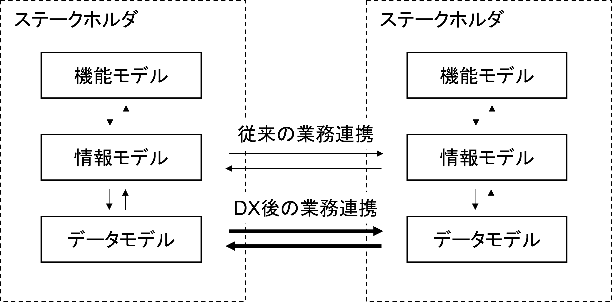

## 5.2.	標準仕様のユースケース
本標準の利用シーンとしては、図 2のように、企業間のデータ連携、企業システムの統廃合、外部ソリューションの実装、そしてシステム間のデータ連携の４つのユースケースが想定できる。それぞれのユースケースは、連携するステークホルダの種類によって以下の表のように整理することができる。

表 1　ユースケースの構成

No	ユースケース名	ステークホルダ1	ステークホルダ2
1	企業間のデータ連携	製造事業者	製造事業者（他社）
2	企業システムの統廃合	製造事業者	製造事業者（自社）
3	外部ソリューションの実装	ソリューション	製造事業者
4	システム間のデータ連携	ソリューション	ソリューション

図 2　技術仕様のユースケース


#### 企業間のデータ連携
ユースケース１は企業間のデータ連携である。これは、連携するステークホルダが異なる企業であり、それぞれの業務を連携することでビジネスを行っているケースに相当する。伝票等の情報モデルに対応するレベルで対応し、データモデルに対応する連携がない場合もある。
#### 企業システムの統廃合合
ユースケース２は、企業が社内の情報システムを刷新する場合や、部署の統合などで情報システムを再構成する場合に相当する。機能モデルをもとに企業全体の視点からあるべきTO-BEモデルを設定し、それにもとづき既存のAS-IS情報モデルやAS-ISデータモデルを再構築するという一般的な企業内のDXプロジェクトはこのケースに相当する。
#### 外部ソリューションの実装
ユースケース３は、企業が情報システムを構築する際に、ソリューション企業がもつパッケージ商品を導入するケースに相当する。ソリューション企業がもつソリューションパッケージは、ソフトウェアとしてあらかじめ想定した機能モデル、情報モデルを前提としたデータモデルを持っている。このケースでは、そうした提供可能なソリューションと提供先の企業との対応関係を検討し、情報システムの実装につなげる。
#### システム間のデータ連携
ユースケース４は、ソリューション企業がもつソリューション間、あるいは製造業などのユーザ企業がレガシーとして運用している情報システムの全体または一部との間でシステム連携を行うケースである。開発した企業が異なるソリューションを統合してユーザ企業に提供する場合や、すでに実装済みの情報システムとデータ連携を行うケースなどが対応する。これらは、多くのシステムインテグレーションの現場で日々行われている活動といえる。

## 5.3.	相互運用のためのしくみ
本標準をそれぞれのユースケースに適用し、２つの異なるステークホルダ間でモデルを相互運用するためには、それぞれのステークホルダと標準モデル間での対応関係を明らかにした上で、それらを統合するアプローチをとる。

たとえば、ステークホルダAとステークホルダBを連携するには、間に標準モデルを置き、ステークホルダAと標準モデルを連携させた上で、標準モデルとステークホルダBを連携させる、という方法がある。必要に応じて、このプロセスを統合し、システムとして自動化することで効率化を図る。

図 3のように、ステークホルダと標準モデル間では、機能モデル、情報モデル、データモデルそれぞれについて対応関係が定義できる。データモデルについては、ステークホルダから標準モデルへ、あるいは標準モデルからステークホルダへの変換手順が定義できる。

図 3　モデルの対応関係と変換手順


 
ステークホルダと標準モデル間で変換手順を定義する場合、データモデルに関してはPUSHあるいはPULLという方向性がある。異なるステークホルダ間でデータモデルの相互運用を行うには、一方のステークホルダにおけるPUSH変換手順と、他方のステークホルダにおけるPULL変換手順を統合する。

図 4　変換手順の方向性と統合

 
たとえば図 4では、ステークホルダAのモデルを標準モデルと対応付け、さらにデータモデルについては、ステークホルダAのモデルを標準モデルに変換する手順を明らかにする。同様に、ステークホルダBのデータモデルについては標準モデルに変換する手順を明らかにすることで、ステークホルダAからステークホルダBへデータモデルの内容を変換することを可能とする。

ここでステークホルダAのAS-ISモデルを標準モデルと対応づける変換手順Aに関する情報を、連携プロファイルと呼ぶ。連携プロファイルは、ステークホルダの対象業務あるいは対象システムごとに定義される。したがって、図 4の例では、連携プロファイルA、および連携プロファイルBとなる。
実際にステークホルダが標準モデルを用いて、連携のためのTO-BEモデルを定義しその内容をプロファイルとして活用する方法については、9章にその仕様を示す。 

本技術仕様を社会実装するにあたっては、この連携プロファイルの内容を第三者機関が認証し、それらをアーカイブ管理するとともに、連携の当事者間で、セキュアでかつトラストに認証されたプロファイルが交換できるプラットフォームが必要となる。

# 6.	機能モデル（normative）
リーンPLMが対象とする製造業における業務を機能の視点でモデル化する。機能を定義する際の粒度としては、担当者が実際にモノや情報に関して何らかの操作を行うレベルの活動を機能要素（Function Element）として定義する粒度、組織としてそれらの機能要素を業務としてまとめて管理する際に用いる機能グループ（Function Group）という粒度、そして、さらに機能グループを全社レベルのエンジニアリングチェーンの中で鳥瞰する際に用いる機能カテゴリ（Function Category）という粒度の３階層がある。

ここで機能カテゴリは大分類といえ、製品設計、工程設計、生産準備、生産管理、そして設備保全といった機能カテゴリが存在する。一方で機能グループは中分類であり、機能カテゴリのいずれかに含まれる。たとえば、図 5では、製品設計という機能カテゴリに対して機能設計、構造設計、そして原価設計という３つの機能グループが定義されている。なお、各機能グループには１つ以上の機能要素が定義される。これらは、それぞれの機能グループごとに表でまとめる。

小分類である機能要素は、機能グループの業務内容を示すものであり、モノと情報を対象とした操作によって定義される。基本的にモノは用語辞書の中で定義されたものを用いることとし、情報は情報モデルの中で定義されたものを対象とする。また、機能要素は、その機能を実施する主体となる担当者が対応づけられる。

図 5　リーンPLMの機能
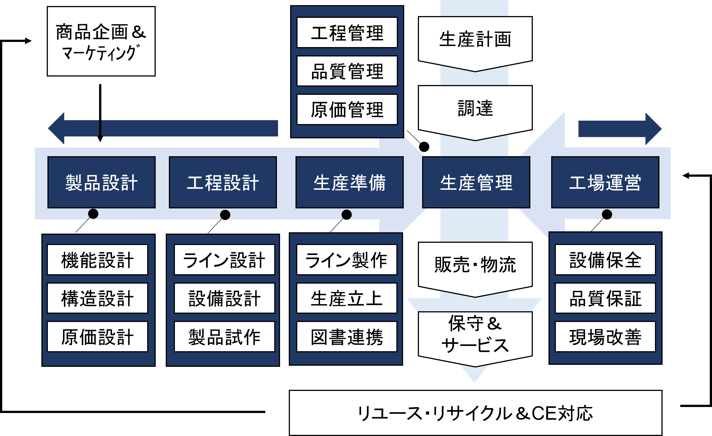
 
以下に機能カテゴリごとに、機能グループおよび機能要素の代表例を示す。

## 6.1.	製品設計
製品設計という機能カテゴリには、機能設計、構造設計、原価設計の３つの機能グループが存在する。以下に、機能グループごとに代表的な機能要素を示す。

### 機能設計
機能設計では、製品がもつべき機能を定性的、定量的に定義する。設計者は、製品の想定ユーザがもつ要求に対応して、それらを最大限満たすための製品がもつ機能に置き換える。

表 2 機能設計の機能要素

| NO | 機能要素名 | 説明 |
|----|------------|------|
| 1 | 製品要求の収集 | 顧客・市場・法規・環境などから要望を収集し、製品に求められる価値・機能・性能を明確化する。 |
| 2 | 要求仕様の整理 | 収集した要求を分類・構造化し、性能・コスト・安全・環境などの観点で設計要件に落とし込む。 |
| 3 | 製品企画の策定 | 顧客価値・市場性・収益性を踏まえ、開発目的や製品コンセプト、開発スコープを策定する。 |
| 4 | アーキテクチャ設計 | 電気・電装・制御やソフトウェアを含めた製品アーキテクチャを検討し設計につなげる。 |
| 5 | モックアップの評価 | 形状・操作性・デザインを試作モデルで確認し、顧客や開発メンバーの評価を反映して改良する。 |
| 6 | 品質機能の展開 | QFD（品質機能展開）手法で顧客要求を設計品質要素へ変換し、重要品質特性を明確化する。 |
| 7 | 機能BOMの展開 | 製品の機能を階層構造として整理し、機能とその構成要素の対応関係をBOM形式で表現・管理する。 |
| 8 | 製品機能の分析 | 各機能の目的・入出力・相互関係を分析し、設計上の最適化ポイントと影響範囲を特定する。 |
| 9 | 機能目標の設定 | 各機能に対して性能・コスト・信頼性などの目標値を設定し、後工程の設計評価基準とする。 |
| 10 | 製品仕様の策定 | 要求・機能分析の結果を踏まえ、具体的な寸法・性能・材料などの製品仕様書を確定する。 |

### 構造設計
構造設計では、製品の構成や部品の形状など、物理的な構造を定義する。部品図や組立図に対応するモデルをCAD等で作成する業務や、それらの形状や形状特徴に対応した仕様を検討し、パラメータなどと共に決定する業務が対応する。なお、構造設計では、ハードウェアのみでななく、電気・電装・制御やソフトウエアなども対象となる。

表 3　構造設計の機能要素

| NO | 機能要素名 | 説明 |
|----|------------|------|
| 1 | 製品構造の設計 | 製品機能を実現するための構造・形状・モジュール構成を設計し、組立性と保守性を考慮する。 |
| 2 | 部品構成の決定 | 製品を構成する部品・ユニットを定義し、標準品や共通部品の活用を含めた最適構成を決定する。 |
| 3 | CADモデルの作成 | 製品・部品の3D形状をCADで作成し、設計検証・干渉チェック・デジタル試作に活用する。 |
| 4 | 設計BOMの作成 | 設計段階での部品構成・仕様・数量を整理し、E-BOMとしてPLMに登録して設計情報を管理する。 |
| 5 | 製品の詳細設計 | 材質・寸法・公差・強度などを具体化し、加工・組立・検査に適した詳細な設計図を作成する。 |
| 6 | 製品のCAE解析 | 構造・流体・熱・振動などの解析を行い、性能・強度・信頼性を定量的に評価し設計を最適化する。 |
| 7 | 故障モードの分析 | 設計FMEAやFTAなどの手法で故障モードを分析し、原因・影響を特定して信頼性向上策を立案する。 |
| 8 | 設計変更の対応 | 試作・評価・製造段階で発生する設計変更を管理し、影響範囲を分析して確実に反映・承認する。 |
| 9 | 協力企業との連携 | 部品サプライヤーや外注設計先とデータを共有し、設計精度・納期・コストの最適化を図る。 |
| 10 | 仕向先仕様と規制の対応 | 各国や地域の安全・環境・認証規制に対応した設計・製造条件を確認し、製品仕様に反映する。 |

### 原価設計
商品企画やマーケティングにおいて得られた製品の価格や販売見込み数などに対応して、実際に製品を製造するために必要となるコストを積算し利益が確保できるか確認する。一般に、それぞれの原価構成要素となる項目のコストを集計することがメインではなく、どうしたら想定した利益が確保できるかを、構成要素に立ち返って検討することが主たる業務となる。

表 4　原価設計の機能要素
| NO | 機能要素名 | 説明 |
|----|------------|------|
| 1 | 目標原価の設定 | 目標利益を確保するために、想定販売価格と利益計画から逆算して製品ごとの目標原価を設定する。 |
| 2 | 開発期間の検討 | 原価目標や投資回収期間を踏まえ、開発コストとスケジュールの最適なバランスを検討する。 |
| 3 | 製品のROI管理 | 投資額に対する収益性を評価し、開発・設備投資・製造コストの妥当性を定量的に管理する。 |
| 4 | 標準原価の設定 | 生産工程や材料費、作業工数を基に標準的な製造原価を算出し、原価差異管理の基準とする。 |
| 5 | 調達部品の価格設定 | サプライヤーとの見積比較や市場価格分析により、調達部品ごとの適正価格を決定する。 |
| 6 | 環境負荷の管理 | MFCA、製品LCAなどを分析し、工場単位、製品単位での環境負荷を管理する。 |
| 7 | 工程の内外作判断 | 工程ごとのコストと技術力を比較し、社内製造と外部委託の最適な分担を判断する。 |
| 8 | 規制対策の原価分析 | 環境規制や安全基準への対応コストを分析し、法令遵守と経済性の両立を図る。 |
| 9 | 原価低減活動の管理 | 部品共通化、工程改善、調達コストなどの原価低減施策を計画・評価し、継続的なコスト削減を推進する。 |
| 10 | 原価シミュレーション | 材料費・工数・生産量などの変動要素をモデル化し、設計段階で原価影響を予測・検証する。 |

## 6.2.	工程設計
工程設計という機能カテゴリには、ライン設計、設備設計、製品試作の３つの機能グループが存在する。以下に、機能グループごとに代表的な機能要素を示す。

### ライン設計
対象とする製品の構成要素となる部品の加工や組立、その他の必要な処理など、技術的、理論的に必要な生産工程を、実際の生産ラインを用いたプロセスによって具現化する方法を検討し決定する。生産ラインは既存の設備を組み合わせる場合や、外部の協力工場に委託する場合なども対象となる。

表 5　ライン設計の機能要素
| NO | 機能要素名 | 説明 |
|----|------------|------|
| 1 | ライン要求情報の整理 | 生産量・タクト・品質・安全・作業人数など設計前提の要求条件を整理し、ライン設計の方向性を明確化する。 |
| 2 | 生産方式の比較検討 | 加工、組立、検査など各工程の流れを分析し、コスト・品質・生産性の観点から生産方式を選定する。 |
| 3 | 工程順序と手順の確定 | 製品構造と作業内容をもとに工程の順序と作業手順を定義し、効率的で標準化された生産フローを構築する。 |
| 4 | 内作外作の比較検討 | 各工程を自社製作か外注とするかを、コスト・納期・品質・技術力で比較し、最適な生産方法を決定する。 |
| 5 | 工程レイアウトの設計 | 作業者や設備、部品供給の配置を計画し、安全性・生産性・保守性を考慮した最適なレイアウトを設計する。 |
| 6 | 工内搬送方法の確定 | コンベヤ、AGV、ロボットなどの搬送手段を比較し、物流効率と安全性を両立する搬送方式を選定する。 |
| 7 | 生産ラインシミュレーション | 3Dモデルやデジタルツインで工程動作を再現し、タクト・稼働率・ボトルネックを事前に検証し最適化する。 |
| 8 | 工程FMEAによる分析 | 工程ごとの潜在不良やリスクを分析し、発生要因と影響度を評価して、予防的な改善策を立案・管理する。 |
| 9 | 制御プログラムの設計 | 設備や搬送装置の動作・インターロックを制御するプログラムを設計し、ライン全体の自動化を実現する。 |
| 10 | 工程構成（BOP）の作成 | 各工程の順序・作業時間・使用設備などを一覧化し、生産準備・計画・保全に活用できる基礎資料を整備する。 |

### 設備設計
部品の形状や部位、あるいは材料の特性や精度など、与えられた要件を満たす結果を得るための設備を設計または改変する。設備以外にも、治工具など、より効率的に作業を行うためのしくみ、より品質が安定化するためのしくみを設計する業務も含む。

表 6　設備設計の機能要素
| NO | 機能要素名 | 説明 |
|----|------------|------|
| 1 | 設備の機能要件の収集 | 生産目標や製品仕様に基づき、設備に求める性能・能力・安全要件を明確化する。 |
| 2 | 設備機能の基本設計 | 仕様を満たすための設備構成・制御方式・機能ブロックを概念レベルの段階で定義する。 |
| 3 | 設備構成の詳細設計 | 機構・電気・制御など各要素の詳細構造を設計し、部品図や接続図を作成する。 |
| 4 | 設備の自動化と自律化 | 人手作業を自動制御へ置換し、AIやセンシングで自律判断・最適動作を実現する。 |
| 5 | 設備信頼性の評価と対策 | 設備の設計FMEAやFTA、類似設備の過去トラブル分析に基づき、信頼性を考慮した仕様・設計を行う。 |
| 6 | 治工具の設計と管理 | 加工・組立・検査などに使用する治具や工具を設計し、寿命・精度を管理する。 |
| 7 | 設備サプライヤー連携 | メーカーや外注先と仕様共有・図面照合を行い、納入要件と品質を統一管理する。 |
| 8 | 設備稼働シミュレーション | 仮想空間で設備の動作・干渉・生産能力を検証し、設計段階で改善を行う。 |
| 9 | 設備ドキュメントの管理 | 図面・仕様書・過去トラブル情報などを体系的に管理し、改訂履歴の追跡と共有を容易にする。 |
| 10 | 設備構成（BOA）の作成 | 設備の構成や治工具、作業員など生産現場が保有する資産を整理し、設備構成情報として体系化する。 |

### 製品試作
理論上の生産工程や生産ラインに対して、実際の設備や装置を用いて製品を加工、組立を行い、想定した生産方法によって要求される品質が得られることを確認する。開発試作と量産試作では、評価内容や目的が異なるが、ここでは、量産設計を行う前の段階での試作として、より生産効率のよい、品質も安定する生産方法を模索する。

表 7　製品試作の機能要素
| NO | 機能要素名 | 説明 |
|----|------------|------|
| 1 | 製品試作方法の検討 | 試作目的に応じて工法・材料・設備を検討し、実製造に近い条件で性能評価できる方法を決定する。 |
| 2 | 試作のための部品調達 | 試作品に必要な部品・材料を特定し、短納期・小ロットに対応できる調達方法を計画・実行する。 |
| 3 | 試作品の製造手配 | 設計データと生産条件をもとに試作品を製作依頼し、品質・納期・コストを管理する。 |
| 4 | 試作品の性能分析 | 試作段階で製品の性能・信頼性・安全性を実測・分析し、設計妥当性を検証する。 |
| 5 | 試作品による仕様承認 | 試作品の試験結果を評価し、顧客や社内で設計仕様の妥当性を確認・承認する。 |
| 6 | 生産方法の改良 | 試作結果をもとに工程・治具・作業手順を改善し、量産時の生産性と品質を高める。 |
| 7 | 製造シミュレーション | 3Dモデルやデジタルツインを用いて製造プロセスを再現し、工法やライン設計を検証する。 |
| 8 | 製品利用時データの獲得 | 実機試験やユーザテストで使用状況データを収集し、製品改良や設計最適化に反映する。 |
| 9 | 仮想試作の実施と検証 | CAD/CAEモデル上で機能・性能をシミュレーションし、実試作前に設計の妥当性を検証する。 |
| 10 | マーケティング情報の更新 | 試作評価や市場反応を基に顧客価値を再分析し、商品企画・販売戦略に反映させる。 |

## 6.3.	生産準備
生産準備という機能カテゴリには、ライン製作、生産立上、図書連携の３つの機能グループが存在する。以下に、機能グループごとに代表的な機能要素を示す。

### ライン製作
量産を前提としてライン設計、設備設計の結果が承認されたら、その内容にもとづき設備や生産ラインのための資材を調達し、実際に設備や生産ライン、治工具を製作する。製作にあたっては、製作図面、製作日程、製作手順などを事前に示し、対象工場が製品の生産を行っている場合でも効率的に作業ができるようにする。

表 8　ライン製作の機能要素
| NO | 機能要素名 | 説明 |
|----|------------|------|
| 1 | QC工程表の実ライン適用 | 設計段階で作成したQC工程表を現場に適用し、品質確認点・検査条件を実ラインに反映させる。 |
| 2 | 生産設備の社外調達 | 必要な生産設備を外部メーカーから調達し、仕様書・納期・性能評価を管理して導入を進める。 |
| 3 | 生産設備の社内製作 | 内製可能な設備を自社設計・製作し、仕様変更や改良を柔軟に行える体制を整える。 |
| 4 | 治工具金型の製作手配 | 製造工程で使用する治工具や金型を設計情報に基づき手配し、精度と納期を管理する。 |
| 5 | 搬送ラインの設置と動線確認 | 部品搬送経路や作業者動線を考慮し、搬送ラインを設置・検証して作業効率を最適化する。 |
| 6 | ラインの設置とバランス調整 | 設備・人員配置・タクトを調整し、ライン全体の生産能力と作業負荷を均衡させる。 |
| 7 | トライモードでの生産監視 | 試運転・検証段階で設備動作や生産データをリアルタイム監視し、不具合を早期検出する。 |
| 8 | 品質と機能の実データ収集 | 試生産時の品質・性能・作業データを収集し、設計・工程条件の妥当性を検証する。 |
| 9 | パラメータとノウハウの共有 | 設備設定値や試作時の改善知見をデータベース化し、次機種や他拠点へ横展開する。 |
| 10 | 不要な設備の有効活用 | 余剰・旧型設備を再利用可能な工程へ転用し、投資コストを抑えつつ生産効率を向上させる。 |

### 生産立上
実際に生産ラインや生産設備を想定した設計を行うことで生産立上げを行う。生産を本格的に開始するにあたって、試作あるいは初期ロットとして重点的にデータを取得し、そこで得られたデータを分析し、立ち上げ時として目標とする生産性や品質管理の値になるまで管理する。 

表 9　生産立上の機能要素
| NO | 機能要素名 | 説明 |
|----|------------|------|
| 1 | 生産立上げ日程の管理 | 試作・検証・承認・量産切替の各工程をスケジュール化し、量産立上げの確実な進行を管理する。 |
| 2 | シリーズ化へのライン対応 | 派生モデルや改良品に対応できるよう、共通化・柔軟性を考慮したライン構成を設計する。 |
| 3 | QC工程表の環境整備 | 量産段階に適したQC工程表を再整備し、品質管理項目・作業手順・検査手順を標準化する。 |
| 4 | サプライヤー選定と調整 | 量産計画に基づき、協力会社の生産能力・品質体制を確認し、供給リスクを最小化する。 |
| 5 | 長納期調達部品の手配 | 生産遅延を防ぐため、リードタイムの長い部品を早期手配し、調達計画を最適化する。 |
| 6 | 量産時の初期流動管理 | 量産立上げ初期の品質ばらつきや工程不安定を重点的に監視・是正し、早期に安定生産へ移行する。 |
| 7 | 要求品質と不良要因対応 | 市場要求に基づく品質水準を維持し、不良要因を分析して迅速な対策・改善を行う。 |
| 8 | 製造BOMの作成 | 生産プロセスで必要となる資材や副資材、消耗品を含めた製造BOMを作成する。 |
| 9 | サービス部品表の作成 | アフターサービス用の図面や部品構成を整備し、製品ライフサイクル全体での供給・保守体制を整える。 |
| 10 | 生産終了時のライン移管 | 製品終息に合わせてライン設備を撤収・再配置し、他製品への転用計画を立案・実行する。 |

### 図書連携
図書連携では、作業手順書など、生産時に必要な情報を整備する。対象は作業者のみでなく、業務システムが利用するマスタデータ等の整備に関連する業務もある。図書連携は、まったく新規に生産ラインを立ち上げる場合や、新製品に対応した生産手順の登録のみでなく、すでに生産が開始された製品の設計変更時の対応なども含む。

表 10　図書連携の機能要素
NO	機能要素名	説明
| NO | 機能要素名 | 説明 |
|----|------------|------|
| 1 | 部品構成表の連携または統合 | 設計BOM・製造BOM・サービスBOMを統合的に管理し、工程・部門間のデータ整合性を維持する。 |
| 2 | 設計BOMの管理 | 設計構成・部品仕様・変更履歴をPLM上で統合的に管理し、設計情報の正確性を保証する。 |
| 3 | 製造BOMの管理 | 製造工程や組立順に基づく部品構成を管理し、設計BOMとの整合を図りながら生産準備を効率化する。 |
| 4 | 用語の整理と辞書の作成 | 設計・生産・品質で共通に使う用語を標準化し、辞書化して社内外の情報連携を円滑にする。 |
| 5 | 図面と作業手順書の共有 | 最新設計図面と対応する作業指示書・手順書などを統合的に管理し、現場への誤適用を防止する。 |
| 6 | QC工程表の管理と共有 | 品質管理項目や検査条件を工程表で明示し、設計変更や工程改善に即応できるよう共有する。 |
| 7 | 標準作業手順書の管理と共有 | 作業方法・治具条件・検査基準を標準化し、PLMまたはMES経由で全拠点に共有する。 |
| 8 | マスタデータの抽出と整備 | 部品・設備・工程などのマスタ情報を抽出し、コード体系・属性定義を統一して整備する。 |
| 9 | 設計変更時のフロー管理 | 設計変更提案から承認・反映までのプロセスを管理し、変更のタイミングや一貫性を追跡可能とする。 |
| 10 | 法規制対応書類の作成 | RoHSやREACHなどの法規制要求に対応した技術文書を作成し、製品ごとに管理する。 |


## 6.4.	生産管理
生産管理という機能カテゴリには、工程管理、品質管理、原価管理の３つの機能グループが存在する。以下に、機能グループごとに代表的な機能要素を示す。

### 工程管理
確定注文、見込注文、あるいは後工程からの補充指示などに対応して発行された生産予定と、実際の生産実績とを対応づけ、それぞれの指示が予定どおりに実行されているか、あるいは予定が妥当かなどについて管理する。

表 11　工程管理の機能要素

| NO | 機能要素名 | 説明 |
|----|------------|------|
| 1 | 生産日程計画の管理 | 需要予測・受注計画に基づき、生産日程を立案し、リソース負荷や納期を管理する。 |
| 2 | 生産スケジュールの管理 | 設備・人員・材料の制約を考慮し、日・週単位の生産スケジュールを作成して配信する。 |
| 3 | 生産指示の発行 | 計画に基づく製造指示書をMESや現場端末に発行し、作業内容や順序を明確化する。 |
| 4 | 生産進捗の管理 | 現場からの実績データを収集し、計画との差異を可視化して納期・品質をコントロールする。 |
| 5 | 設備稼働の管理 | 設備稼働率や停止要因をモニタリングし、データ化するとともにOEE向上と保全計画の最適化を図る。 |
| 6 | 調達品の内容と納期管理 | サプライヤーの生産進捗・納期情報を共有し、調達品の納期を管理する。 |
| 7 | 出来高と生産性の管理 | 作業実績・出来高データを分析し、生産性や稼働効率の向上策を継続的に検討する。 |
| 8 | 材料と仕掛品在庫の管理 | 材料・中間品の入出庫を監視し、在庫量を適宜把握することで欠品や過剰在庫を防止する。 |
| 9 | 製品在庫と出荷実績の管理 | 完成品の在庫と出荷状況を販売計画と連動させ、的確な納期回答を可能とする。 |
| 10 | イレギュラーへの対応 | イレギュラー（部品欠品、設備トラブル、不良など）が発生した際の処置を確実に行うとともに、対応実績を記録・管理する。 |

### 品質管理
品質管理としては、通常の検査に加えて、検査項目を厳しく設定するなど、品質管理として不良品を出さないためのしくみを運営維持する。検査結果の分析により不良の要因を特定し、生産性や直行率を高めるための活動を行う。

表 12　品質管理の機能要素
| NO | 機能要素名 | 説明 |
|----|------------|------|
| 1 | 品質検査基準の設定 | 製品仕様や顧客要求に基づき、判定基準・検査項目・許容範囲などを定義する。 |
| 2 | 完成品検査の実施 | 出荷前に製品の性能・外観・安全性を検査し、規格適合と品質保証を最終確認する。 |
| 3 | 受入および工程内検査 | 調達品や工程途中の部品を検査し、自工程および次工程への影響を防止する。 |
| 4 | 品質データの傾向監視 | 測定値や不良率などの品質データを時系列で分析し、異常兆候を早期に把握する。 |
| 5 | 測定機器の校正と記録 | 測定器の精度を維持するために定期校正を実施し、結果を記録・管理する。 |
| 6 | 不良要因の分析と対策 | 不良発生時に要因を分析し、再発防止のために設計・工程・材料面から対策を講じる。 |
| 7 | 不良品の修理と再検査 | 不良品を修正後、再度検査を行い品質を確認し、再発防止と履歴管理を徹底する。 |
| 8 | 不良原因のトレースバック | 不具合発生時にBOM・ロット・作業履歴を追跡し、原因特定と影響範囲を把握する。 |
| 9 | 検査装置としくみの開発 | 自動検査装置やAI画像判定などを開発し、検査の効率化と精度向上を図る。 |
| 10 | 品質改善の知識の共有 | 不具合事例・改善策・成功事例をデータベース化し、設計・製造部門間で共有する。 |

### 原価管理
生産ラインや設備において発生する原価について、材料費以外の労務費や設備の原価償却費などをできるだけ合理的に計算し集計するしくみを提供する。設備の固定費の配賦のために必要な指標や原単位やチャージレートなどの設定や管理を行う。

表 13　原価管理の機能要素
| NO | 機能要素名 | 説明 |
|----|------------|------|
| 1 | 原価要因の特定と記録 | 材料費・人件費・設備費などの原価構成要因を明確化し、発生源を記録して追跡可能にする。 |
| 2 | 製造実績データの記録 | 製造時間・使用材料・作業工数など実績データを収集し、実際原価算出の基礎とする。 |
| 3 | 原単位の計算および更新 | 製品あたりの標準作業時間・材料使用量などを算定し、生産実績に基づき定期的に更新する。 |
| 4 | 設備の減価償却の管理 | 設備投資コストを耐用年数に応じて配分し、標準原価への反映と資産管理を行う。 |
| 5 | 固定費と共通費の配賦 | 設備維持費や管理費などの共通費を合理的な基準で各製品・工程へ按分し、原価計算の精度を高める。 |
| 6 | 実際原価の計算 | 実績データから実際に発生したコストを算出し、標準原価との比較で効率を評価する。 |
| 7 | 製造間接費の設定 | 現場作業以外の管理・保全・物流などの間接費を算出し、配賦基準を設定して原価化する。 |
| 8 | 原価差異の分析 | 標準原価と実際原価の差異を分析し、要因（歩留まり・工数・材料価格など）を特定して改善する。 |
| 9 | 環境負荷量の計算 | エネルギー使用量やCO₂排出量を算定し、環境コストとして原価に反映・管理する。 |
| 10 | 原価見積と価格設定 | 設計・生産条件を基に見積原価を計算し、利益目標に沿った製品価格や見積額を決定する。 |


## 6.5.	工場運営
工場運営という機能カテゴリには、設備保全、品質保証、現場改善の３つの機能グループが存在する。以下に、機能グループごとに代表的な機能要素を示す。

### 設備保全
設備保全は、定期点検などの予防保全、あるいは故障時、チョコ停やドカ停などの事後保全、そしてなんらかの故障の予兆を察知して、事前に対応する予知保全などの業務がある。設備の点検や保守は、あらかじめ定められた方法や基準をもとに行い、それらのデータを分析することであらたな知見を得る。

表 14　設備保全の機能要素
| NO | 機能要素名 | 説明 |
|----|------------|------|
| 1 | 設備保守手順の策定 | 設備の安全・効率的な稼働を維持するため、点検・清掃・交換などの標準手順を策定する。 |
| 2 | 正常時保守の実施 | 定期点検・潤滑・清掃などの予防保全を実施し、故障を未然に防止する。 |
| 3 | 保守内容と計画の立案 | 年間・月間の保守スケジュールを立案し、対象設備や実施頻度を明確に定義する。 |
| 4 | 設備監視と異常検知 | センサーやIoTデータを活用し、温度・振動などから異常兆候を早期に検知する。 |
| 5 | 稼働実績データの分析 | 稼働率・停止時間・保全履歴を分析し、信頼性向上と保守計画の最適化に活用する。 |
| 6 | 設備異常の対応と対策 | 異常発生時に迅速な応急処置を行い、原因分析を通じて恒久的な再発防止策を講じる。 |
| 7 | 副資材と予備品の管理 | 保守に必要な工具・部品・油脂などの副資材を在庫管理し、欠品による遅延を防ぐ。 |
| 8 | 設備保守履歴の管理 | 点検・修理・交換などの履歴をデジタル記録し、傾向分析と保全戦略の改善に活用する。 |
| 9 | 設備保守人材の育成 | 現場技能やトラブル対応力を継承するため、教育訓練とOJTによる人材育成を行う。 |
| 10 | チョコ停・ドカ停の対応 | 短時間停止（チョコ停）や長時間停止（ドカ停）の発生要因を分析し、作業・設備両面から再発防止を図る。 |


### 品質保証
品質保証は、製品や部品が品質問題を発生しないように未然に防ぎ、最終段階での直接的な全数検査に過度に依存することなく品質が保証できるようなしくみを提供する。品質不良が発生するプロセスに着目し、因果関係や故障の要因分析から、品質不良や故障の要因を除去する。特に、設備の要因、人の要因、材料の要因、そして生産方法の要因の４Mについて取り込む。

表 15　品質保証の機能要素
| NO | 機能要素名 | 説明 |
|----|------------|------|
| 1 | 品質検査方式の設定 | 製品や工程の特性に応じた検査手法を決定し、抜取・全数・自動検査など最適な方式を設定する。 |
| 2 | 顧客クレームへの対応 | 顧客からの不具合・要望を迅速に分析し、原因究明と再発防止策を講じて信頼を維持する。 |
| 3 | 品質保証人材の育成 | 品質保証・検査・改善に関する専門知識と技能を教育し、品質文化を根付かせる。 |
| 4 | サプライヤーの品質評価 | 仕入先の品質管理体制・不良率・改善能力を定期評価し、供給品質を確保する。 |
| 5 | 工程FMEAによる対策 | 工程ごとの潜在リスクを洗い出し、影響度・発生頻度を評価して対策を事前に実施する。 |
| 6 | 管理因子の特定と記録 | 品質に影響を与える重要パラメータ（温度・圧力・時間など）を特定し、記録・管理する。 |
| 7 | 品質不良のリコール対応 | 市場で発生した重大不具合に対し、影響範囲を特定し、迅速な回収・顧客対応を行う。 |
| 8 | 品質不良ロットの除外 | 不良品を含むロットを識別・隔離し、再流出を防ぐために検査と再判定を実施する。 |
| 9 | 社内外の工程監査対応 | 社内および顧客・第三者による工程監査に対応し、是正処置と継続的改善を実施する。 |
| 10 | 工場の安全衛生管理 | 労働安全・衛生基準を遵守し、作業環境のリスク低減と従業員の健康維持を図る。 |

### 現場改善
現場の困りごとやヒヤリハットなど、改善のためのネタを現場の作業者や管理者がみずから発見し、その解決策を見つけ、改善を実行する。現場改善では、QC七つ道具や新QC七つ道具などの図表が用いられ、問題発見や問題の見える化をふくめた自律的ボトムアップ的なアプローチをとる。

表 16　現場改善の機能要素
| NO | 機能要素名 | 説明 |
|----|------------|------|
| 1 | 5S活動と安全管理 | 整理・整頓・清掃・清潔・躾の5Sを徹底し、職場環境の整備と安全性の向上を図る。 |
| 2 | 現場課題のなぜなぜ分析 | 問題の真因を特定するため「なぜ」を繰り返し、根本的な改善策を導く手法を実践する。 |
| 3 | 改善事例の共有と活用 | 現場の成功・失敗事例を体系的に共有し、他工程や他部門へ水平展開して再発防止に活かす。 |
| 4 | 過去トラやヒヤリハット共有 | 過去のトラブルやヒヤリ事例を共有し、同様のリスクを未然に防止する安全文化を醸成する。 |
| 5 | 課題対策のフォローアップ | 改善実施後の効果を継続的に確認し、再発防止と標準化につなげるしくみを構築する。 |
| 6 | データを活用したQC活動 | 品質・コスト・納期データを基に、統計手法を用いた定量的な問題解決を行う。 |
| 7 | モノと情報の同期化と整流化 | 現場の物の流れと情報伝達を一致させ、リードタイム短縮と工程間のムダ排除を実現する。 |
| 8 | 作業環境の整備と改善 | 作業者の安全・快適性を考慮したレイアウトや照明・動線改善を行い、生産性を高める。 |
| 9 | 社内標準化活動の推進 | 改善成果を標準化文書に反映し、全社的に統一ルールとして継続的運用を図る。 |
| 10 | スキルアップと人材育成 | 技能教育や資格取得支援を通じて人材を育成し、改善活動への貢献を評価する。 |


# 7.	情報モデル（normative）
情報モデルは、機能を実行した結果として得られた成果を情報として表現する内容の構造を示す。また、情報モデルは、機能を実行する際に不可欠な情報について、その内容の構造を示す。機能モデルと情報モデルの関係は、それぞれの要素で対応しており、ひとつの機能がひとつまたは複数の情報を利用していると同時に、ひとつの情報は複数の機能に係わっている。

情報モデルは、伝票や帳票、あるいは画面など、文字や数字や図表などで構成された対象をしめす。情報モデルは、業務の担当者がその意味を理解したうえで、その内容を読取り、または書込むことができる形に成形されたものである。一般に、情報モデルは階層をもち、ひとつの情報モデルの構造の一部に、他の情報モデルを含む場合もある。

本章では、情報のカテゴリとして、企画情報、開発情報、技術情報、管理情報、そして現場情報に分け、それぞれのカテゴリごとに情報をグループ化している。以下では、情報モデルの概要を、情報カテゴリ、情報グループに分けて説明し、それぞれについて、主要な項目を示す。

表 17　情報モデルのカテゴリとグループ

| カテゴリ	| グループ	| 説明 | 
| -- | -- | -- | 
| 企画情報	| 計画情報	| 製品開発や生産目標を設定し、数量・期間・資源配分を含めて実現方法を定義する情報 | 
| | 	仕様情報	| 製品や工程の機能・性能・条件を定義し、設計・製造・品質の基準として共有される情報 | 
| | 	原価情報	| 製品や工程に関わるコスト構成や見積・実績を管理し、収益性の分析や改善に活用する情報 | 
| 開発情報	| 構成情報	| 製品や設備の構成要素や関係性を定義し、BOMやBOAなどの構造管理の基盤となる情報 | 
| | 	手順情報	| 作業や工程の具体的な実施方法や順序を定義し、標準作業の確立と品質安定に寄与する情報 | 
| 	| 基準情報	| 品質や作業、設備に関する判断基準や規格を定義し、評価や管理の共通尺度となる情報
| 技術情報	| 展開情報	| 設計や計画の内容を各工程や部門に展開し、実行可能な形へ変換するための情報
| 	| 連携情報	| 部門間やシステム間で情報を共有・連携し、データの一貫性と相互運用性を確保する情報
| 	| 品質情報	| 製品や工程の品質に関する測定値や評価結果を記録し、不良防止や品質改善に活用する情報
| 管理情報	| 日程情報	| 生産や作業の開始・終了時刻や進行状況を示し、スケジュール管理と進捗統制に用いる情報
| 	| 指示情報	| 作業や生産に関する具体的な指示内容を示し、現場での実行を直接的に支援する情報
| 	| 実績情報	| 生産数量や作業結果、稼働状況などの実績を記録し、分析や改善の基礎とする情報
| 現場情報	| 4M情報	| 作業者、設備、材料、方法に関する情報を管理し、工程品質の要因分析と管理に用いる情報
| 	| 状態情報	| 設備や工程の状態や異常をリアルタイムに把握し、安定運用と迅速な対応を支援する情報
| 	| 改善情報	| 課題や不具合の原因分析と対策内容を記録し、継続的改善と再発防止に活用する情報

本章において、各情報グループに対応する表では、情報名ごとに製品、工程、設備のどの側面に関係しているかを示している。これにより、それぞれの情報が、製品、工程、設備に関する横断的な内容である場合を識別可能とする。

また、各情報モデルに対応して、それぞれに対応するクラス図と主要な情報項目のリストを示している。クラス図にあるクラスは、データモデルにおけるエンティティに対応し、情報項目のリストでは、各情報項目が属するエンティティと対応する属性、そして関係の列にカージナリティが示されている。たとえば、*は、対応する情報が1に対して複数存在することを意味し、基となるエンティティが複数ある場合は数字で識別する。また、エンティティに×がある場合は、その両側のエンティティをクロス展開したエンティティであることを示す。

## 7.1.	企画情報
### 計画情報（Planning Information）
将来の活動の計画や予定を期間や日程の進行とあわせて定義した情報。製品の開発にともなう日程や、それぞれの製品や設備の生産量、能力、負荷などについて、計画およびその実績を示す。

表 18　計画情報
| NO | 情報名 | 製品 | 工程 | 設備 | 説明 |
|---:|---|:---:|:---:|:---:|---|
| 1 | 開発計画表 | 〇 | 〇 | 〇 | 製品やシステム開発の目的、工程、日程、体制、資源をまとめた計画。開発進行の指針となる。 |
| 2 | 生産計画表 | 〇 |  |  | 需要予測や受注に基づき、生産量・時期・工場負荷を計画した表。生産全体の指針となる。 |
| 3 | 能力計画表 |  | 〇 | 〇 | 生産に必要な設備・人員の能力と負荷を比較し、過不足を把握するための計画表。生産計画の実行性を評価する。 |

#### 開発計画表
製品やシステム開発の目的、工程、日程、体制、資源をまとめた計画。開発進行の指針となる。

図 6　開発計画表
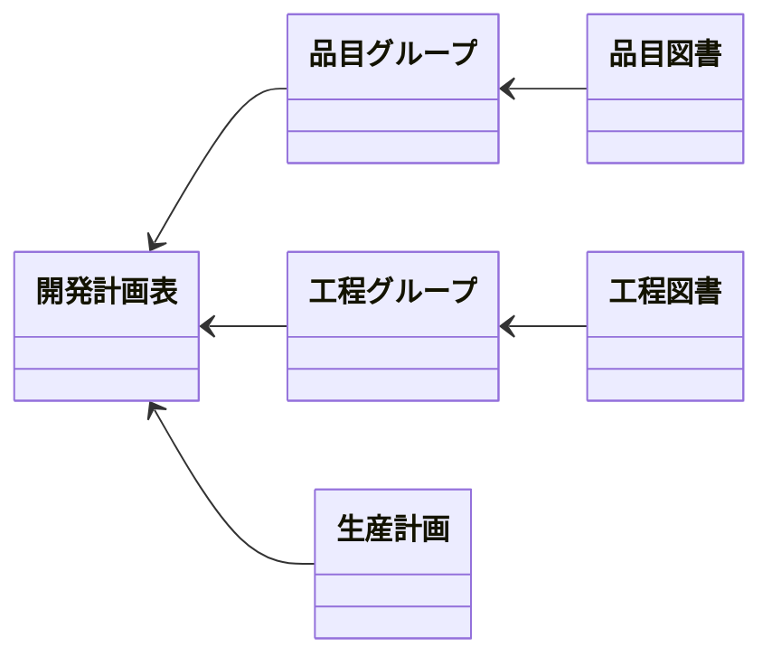
```mermaid
classDiagram
direction LR
    開発計画表 <-- 品目グル_プ
    開発計画表 <-- 工程グル_プ
    品目グル_プ <-- 品目図書
    工程グル_プ <-- 工程図書
    開発計画表 <-- 生産計画
    class 開発計画表["開発計画表"]
    class 品目グル_プ["品目グループ"]
    class 工程グル_プ["工程グループ"]
    class 品目図書["品目図書"]
    class 工程図書["工程図書"]
    class 生産計画["生産計画"]
```

表 19 開発計画表
| NO | 項目名 | エンティティ | 属性 | 関係 |
|---:|---|---|---|---|
| 1 | 品目名 | 品目グループ | 品目グループ名 | |
| 2 | ステータス | 品目グループ | ステータス | |
| 3 | 内容 | 品目グループ×日付 | 内容 | *1 |
| 4 | 開発目的 | 品目図書 | 開発目的 | |
| 5 | 開発日程 | 品目図書 | 開発日程 | |
| 6 | 仕様 | 品目図書 | 仕様 | |
| 7 | 数量 | 品目図書 | 数量 | |
| 8 | 単位 | 品目図書 | 単位 | |
| 9 | 工程名 | 工程グループ | 工程グループ名 | |
| 10 | ステータス | 工程グループ | ステータス | |
| 11 | 内容（工程） | 工程グループ×日付 | 内容 | *2 |
| 12 | 開発目的（工程） | 工程図書 | 開発目的 | |
| 13 | 開発日程（工程） | 工程図書 | 開発日程 | |
| 14 | 仕様（工程） | 工程図書 | 仕様 | |
| 15 | 数量（工程） | 工程図書 | 数量 | |
| 16 | 単位（工程） | 工程図書 | 単位 | |
| 17 | 日付 | 生産計画 | タームID | *3 |
| 18 | 計画内容 | 生産計画 | 計画内容 | *3 |
| 19 | ステータス | 生産計画 | ステータス | *3 |
| 20 | 売上原価 | 生産計画 | 売上原価 | *3 |
| 21 | 営業利益 | 生産計画 | 営業利益 | *3 |

#### 生産計画表
需要予測や受注に基づき、生産量・時期・工場負荷を計画した表。生産全体の指針となる。

図 7　生産計画表
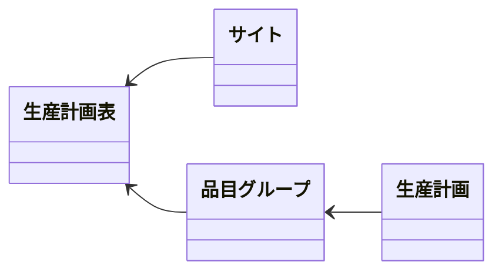
```mermaid
classDiagram
direction LR
    生産計画表 <-- サイト
    生産計画表 <-- 品目グル_プ
    品目グル_プ <-- 生産計画
    class 生産計画表["生産計画表"]
    class サイト["サイト"]
    class 品目グル_プ["品目グループ"]
    class 生産計画["生産計画"]
```

表 20 生産計画表
| NO | 項目名 | エンティティ | 属性 | 関係 |
|---:|---|---|---|---|
| 1 | サイト名 | サイト | サイト名 | |
| 2 | 計画数量 | サイト×月 | 計画数量 | *1 |
| 3 | 実績数量 | サイト×月 | 実績数量 | *1 |
| 4 | 品目名 | 品目グループ | 品目グループ名 | |
| 5 | 計画数量 | 品目グループ×月 | 計画数量 | *2 |
| 6 | 実績数量 | 品目グループ×月 | 実績数量 | *2 |
| 7 | 計画日時 | 生産計画 | 計画日時 | * |
| 8 | 計画数量 | 生産計画 | 計画数量 | * |
| 9 | 実績数量 | 生産計画 | 実績数量 | * |
| 10 | 基準数量 | 生産計画 | 数量 | * |
| 11 | 単位 | 生産計画 | 単位 | * |

#### 能力計画表
生産に必要な設備・人員の能力と負荷を比較し、過不足を把握するための計画表。生産計画の実行性を評価する。

図 8　能力計画表
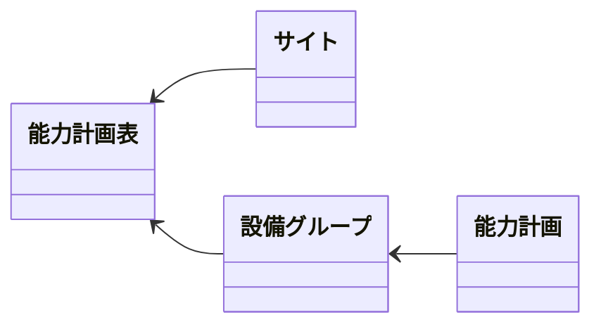
```mermaid
classDiagram
direction LR
    能力計画表 <-- サイト
    能力計画表 <-- 設備グル_プ
    設備グル_プ <-- 能力計画
    class 能力計画表["能力計画表"]
    class サイト["サイト"]
    class 設備グル_プ["設備グループ"]
    class 能力計画["能力計画"]
```

表 21 能力計画表
| NO | 項目名 | エンティティ | 属性 | 関係 |
|---:|---|---|---|---|
| 1 | サイト名 | サイト |  |  |
| 2 | 計画数量 | サイト×月 |  | *1 |
| 3 | 実績数量 | サイト×月 |  | *1 |
| 4 | 設備名 | 設備グループ |  |  |
| 5 | 計画数量 | 設備グループ×月 |  | *2 |
| 6 | 実績数量 | 設備グループ×月 |  | *2 |
| 7 | 計画日時 | 生産計画 | 計画日時 | * |
| 8 | 計画数量 | 生産計画 | 計画数量 | * |
| 9 | 実績数量 | 生産計画 | 実績数量 | * |
| 10 | 基準数量 | 生産計画 | 数量 | * |
| 11 | 単位 | 生産計画 | 単位 | * |

### 仕様情報（Specification Information）
仕様書は、要求・条件・制約を定義する上位情報で、他情報の基準点となる。定性的・定量的仕様を含む形式的な規定情報。また、設計書は、仕様を具現化するための構造・機能・形状を記述する生成情報。図面、E-BOMなど、表現形式が固定された技術文書系。

表 24　仕様情報
| NO | 情報名 | 製品 | 工程 | 設備 | 説明 |
|---:|---|:---:|:---:|:---:|---|
| 1 | 要求仕様書 | 〇 | 〇 | 〇 | 製品や工程や設備の設計に先立ち、望むべき機能・性能・制約条件をまとめた文書。何を実現すべきかを示す上位要求。 |
| 2 | 製品設計書 | 〇 |  |  | 製品の構造・材料・寸法・性能など設計内容をまとめた文書。量産の基礎となる設計情報。 |
| 3 | 工程設計書 |  | 〇 |  | 製造工程の手順、設備条件、作業内容、品質管理点などを定義する文書。量産工程の基準となる。 |
| 4 | 設備設計書 |  |  | 〇 | 生産設備の構造、能力、制御方式、安全対策など詳細設計をまとめた文書。設備製作・導入の指針。 |

#### 要求仕様書
製品や工程や設備の設計に先立ち、望むべき機能・性能・制約条件をまとめた文書。何を実現すべきかを示す上位要求。

図 9　要求仕様書
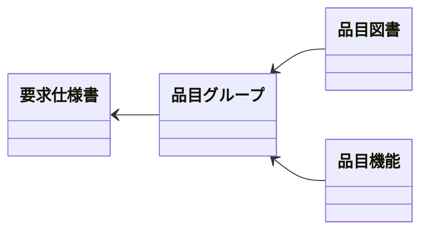
```mermaid
classDiagram
direction LR
    要求仕様書 <-- 品目グル_プ
    品目グル_プ <-- 品目図書
    品目グル_プ <-- 品目機能
    class 要求仕様書["要求仕様書"]
    class 品目グル_プ["品目グループ"]
    class 品目図書["品目図書"]
    class 品目機能["品目機能"]
```

表 25 要求仕様書
| NO | 項目名 | エンティティ | 属性 | 関係 |
|---:|---|---|---|---|
| 1 | 品目名 | 品目グループ | 品目グループ名 | |
| 2 | 品目分類 | 品目グループ | 品目グループ分類 | |
| 3 | 目標原価 | 品目グループ | 目標原価 | |
| 4 | 販売目標 | 品目グループ | 販売目標 | |
| 5 | 品目図書 | 品目図書 | 品目図書名 | *1 |
| 6 | 図書分類 | 品目図書 | 品目図書分類 | *1 |
| 7 | 開発目的 | 品目図書 | 開発目的 | *1 |
| 8 | 対象顧客 | 品目図書 | 対象顧客 | *1 |
| 9 | 開発日程 | 品目図書 | 開発日程 | *1 |
| 10 | 開発体制 | 品目図書 | 開発体制 | *1 |
| 11 | ステータス | 品目機能 | ステータス | *2 |
| 12 | 顧客要求 | 品目機能 | 顧客要求 | *2 |
| 13 | 機能要求 | 品目機能 | 機能要求 | *2 |
| 14 | 品質特性 | 品目機能 | 品質特性 | *2 |
| 15 | 要求水準 | 品目機能 | 数量 | *2 |
| 16 | 単位 | 品目機能 | 単位 | *2 |

#### 製品設計書
製品の構造・材料・寸法・性能など設計内容をまとめた文書。量産の基礎となる設計情報。

図 10　製品設計書
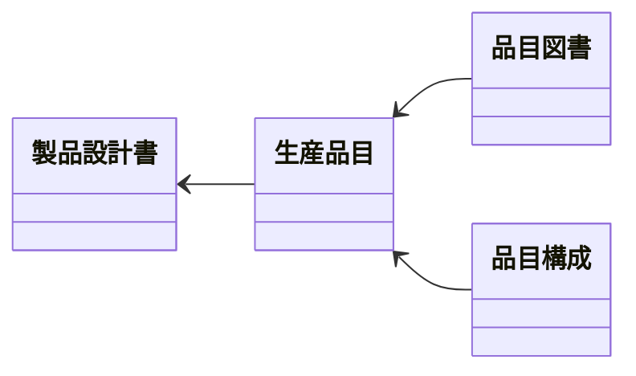
```mermaid
classDiagram
direction LR
    製品設計書 <-- 生産品目
    生産品目 <-- 品目図書
    生産品目 <-- 品目構成
    class 製品設計書["製品設計書"]
    class 生産品目["生産品目"]
    class 品目図書["品目図書"]
    class 品目構成["品目構成"]
```

表 26 製品設計書
| NO | 項目名 | エンティティ | 属性 | 関係 |
|---:|---|---|---|---|
| 1 | 品目番号 | 生産品目 | 品目番号 | |
| 2 | 品目名 | 生産品目 | 生産品目名 | |
| 3 | 品目分類 | 生産品目 | 生産品目分類 | |
| 4 | ステータス | 生産品目 | ステータス | |
| 5 | 仕様 | 生産品目 | 仕様 | |
| 6 | 数量 | 生産品目 | 数量 | |
| 7 | 単位 | 生産品目 | 単位 | |
| 8 | 図面番号 | 品目図書 | 品目図書名 | *1 |
| 9 | 図面名 | 品目図書 | 仕様 | *1 |
| 10 | 図面分類 | 品目図書 | 品目図書分類 | *1 |
| 11 | 改訂 | 品目図書 | スタータス | *1 |
| 12 | ファイル | 品目図書 | ファイル | *1 |
| 13 | 追番 | 品目構成 | 追番 | *2 |
| 14 | 構成分類 | 品目構成 | 品目構成分類 | *2 |
| 15 | 部品番号 | 品目構成 | 子生産品目ID | *2 |
| 16 | 部品名 | 品目構成 | 品目構成名 | *2 |
| 17 | 部品仕様 | 品目構成 | 仕様 | *2 |
| 18 | 員数 | 品目構成 | 員数 | *2 |
| 19 | 単位 | 品目構成 | 単位 | *2 |

#### 工程設計書
製造工程の手順、設備条件、作業内容、品質管理点などを定義する文書。量産工程の基準となる。

図 11　工程設計書
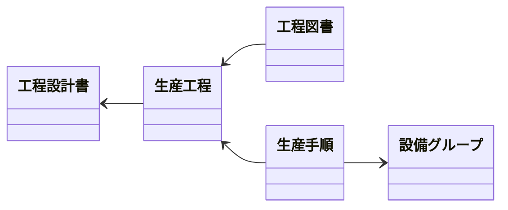
```mermaid
classDiagram
direction LR
    工程設計書 <-- 生産工程
    生産工程 <-- 工程図書
    生産工程 <-- 生産手順
    生産手順 --> 設備グル_プ
    class 工程設計書["工程設計書"]
    class 生産工程["生産工程"]
    class 工程図書["工程図書"]
    class 生産手順["生産手順"]
    class 設備グル_プ["設備グループ"]
```

表 27 工程設計書
| NO | 項目名 | エンティティ | 属性 | 関係 |
|---:|---|---|---|---|
| 1 | 工程名 | 工程グループ | 工程グループ名 | |
| 2 | 工程分類 | 工程グループ | 工程グループ分類 | |
| 3 | ステータス | 工程グループ | ステータス | |
| 4 | 仕様 | 工程グループ | 仕様 | |
| 5 | 性能 | 工程グループ | レート | |
| 6 | 能力 | 工程グループ | 標準能力 | |
| 7 | 単位 | 工程グループ |  | |
| 8 | 図面番号 | 工程図書 | 設備図書名 | *1 |
| 9 | 図面名 | 工程図書 | 仕様 | *1 |
| 10 | 図面分類 | 工程図書 | 設備図書分類 | *1 |
| 11 | 改訂 | 工程図書 | ステータス | *1 |
| 12 | ファイル | 工程図書 | ファイル | *1 |
| 13 | 追番 | 生産手順 | 追番 | *2 |
| 14 | 手順名 | 生産手順 | 生産手順名 | *2 |
| 15 | 手順分類 | 生産手順 | 生産手順分類 | *2 |
| 16 | 手順内容 | 生産手順 | 内容 | *2 |
| 17 | 数量 | 生産手順 | 数量 | *2 |
| 18 | 単位 | 生産手順 | 単位 | *2 |
| 19 | 生産工数 | 生産手順 | 生産工数 | *2 |
| 20 | 生産日数 | 生産手順 | 生産日数 | *2 |
| 21 | 設備名 | 設備グループ | 設備グループ名 | *3 |
| 22 | 設備分類 | 設備グループ | 設備グループ分類 | *3 |
| 23 | 設備能力 | 設備グループ | 標準能力 | *3 |
| 24 | 設備仕様 | 設備グループ | 仕様 | *3 |
| 25 | 単位 | 設備グループ | 単位 | *3 |

#### 設備設計書
生産設備の構造、能力、制御方式、安全対策など詳細設計をまとめた文書。設備製作・導入の指針。

図 12　設備設計書
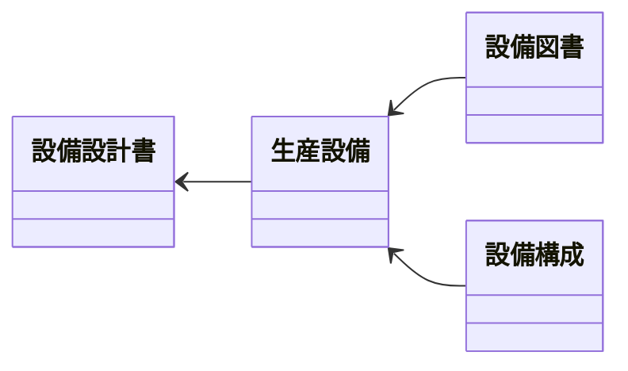
```mermaid
classDiagram
direction LR
    設備設計書 <-- 生産設備
    生産設備 <-- 設備図書
    生産設備 <-- 設備構成
    class 設備設計書["設備設計書"]
    class 生産設備["生産設備"]
    class 設備図書["設備図書"]
    class 設備構成["設備構成"]
```

表 28 設備設計書
| NO | 項目名 | エンティティ | 属性 | 関係 |
|---:|---|---|---|---|
| 1 | 設備番号 | 生産設備 | 設備番号 | |
| 2 | 設備名 | 生産設備 | 生産設備名 | |
| 3 | 設備分類 | 生産設備 | 設備分類 | |
| 4 | ステータス | 生産設備 | ステータス | |
| 5 | 仕様 | 生産設備 | 仕様 | |
| 6 | 数量 | 生産設備 | 数量 | |
| 7 | 単位 | 生産設備 | 単位 | |
| 8 | 設備能力 | 生産設備 | 標準能力 | |
| 9 | 設備性能 | 生産設備 | レート | |
| 10 | 図面番号 | 設備図書 | 設備図書名 | *1 |
| 11 | 図面名 | 設備図書 | 仕様 | *1 |
| 12 | 図面分類 | 設備図書 | 設備図書分類 | *1 |
| 13 | 改訂 | 設備図書 | ステータス | *1 |
| 14 | ファイル | 設備図書 | ファイル | *1 |
| 15 | 追番 | 設備構成 | 追番 | *2 |
| 16 | 構成設備名 | 設備構成 | 設備構成名 | *2 |
| 17 | 構成設備番号 | 設備構成 | 子生産設備ID | *2 |
| 18 | 構成分類 | 設備構成 | 構成分類 | *2 |
| 19 | 構成仕様 | 設備構成 | 仕様 | *2 |
| 20 | 構成員数 | 設備構成 | 員数 | *2 |
| 21 | 構成単位 | 設備構成 | 単位 | *2 |

### 原価情報（Cost Information）
標準原価・実際原価など、金額・数量・時間に基づく計算情報。集計・比較可能な数値構造を持つ。
表 29　原価表
| NO | 情報名 | 製品 | 工程 | 設備 | 説明 |
|---:|---|:---:|:---:|:---:|---|
| 1 | 標準原価表 | 〇 | 〇 | 〇 | 材料費・労務費・経費などの理論的な標準原価をまとめた表。計画値と差異分析の基準となる。 |
| 2 | 実際原価表 | 〇 | 〇 | 〇 | 実際に発生した材料費・工数・経費を集計した原価表。標準原価との比較で改善点を把握する。 |

#### 標準原価表
材料費・労務費・経費などの理論的な標準原価をまとめた表。計画値と差異分析の基準となる。

図 13　標準原価表
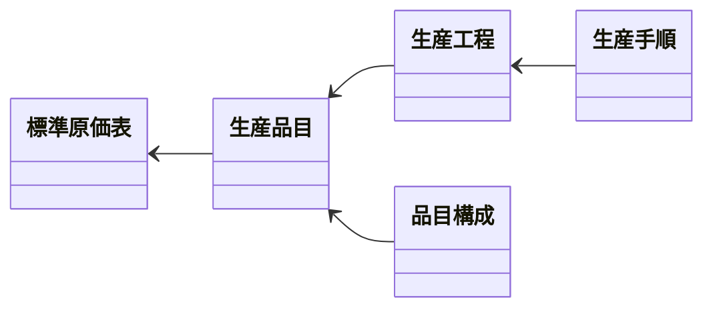
```mermaid
classDiagram
direction LR
    標準原価表 <-- 生産品目
    生産品目 <-- 生産工程
    生産品目 <-- 品目構成
    生産工程 <-- 生産手順
    class 標準原価表["標準原価表"]
    class 生産品目["生産品目"]
    class 生産工程["生産工程"]
    class 品目構成["品目構成"]
    class 生産手順["生産手順"]
```

表 30 標準原価表
| NO | 項目名 | エンティティ | 属性 | 関係 |
|---:|---|---|---|---|
| 1 | 品目番号 | 生産品目 | 品目番号 | |
| 2 | 品目名 | 生産品目 | 品目名 | |
| 3 | スタータス | 生産品目 | スタータス | |
| 4 | 数量 | 生産品目 | 数量 | |
| 5 | 単位 | 生産品目 | 単位 | |
| 6 | 原価 | 生産品目 | 原価 | |
| 7 | 追番 | 品目構成 | 追番 | *1 |
| 8 | 部品名 | 品目構成 | 品目構成名 | *1 |
| 9 | 仕様 | 品目構成 | 仕様 | *1 |
| 10 | 員数 | 品目構成 | 員数 | *1 |
| 11 | 単位 | 品目構成 | 単位 | *1 |
| 12 | 原価 | 品目構成 | 原価 | *1 |
| 13 | 工程番号 | 生産工程 | 工程番号 | |
| 14 | 工程名 | 生産工程 | 生産工程名 | |
| 15 | スタータス | 生産工程 | スタータス | |
| 16 | 数量 | 生産工程 | 数量 | |
| 17 | 単位 | 生産工程 | 単位 | |
| 18 | 原価 | 生産工程 | 原価 | |
| 19 | 追番 | 生産手順 | 追番 | *2 |
| 20 | 部品名 | 生産手順 | 生産手順名 | *2 |
| 21 | 内容 | 生産手順 | 内容 | *2 |
| 22 | 数量 | 生産手順 | 数量 | *2 |
| 23 | 単位 | 生産手順 | 単位 | *2 |
| 24 | 原価 | 生産手順 | 原価 | *2 |

#### 実際原価表
実際に発生した材料費・工数・経費を集計した原価表。標準原価との比較で改善点を把握する。

図 14　実際原価表
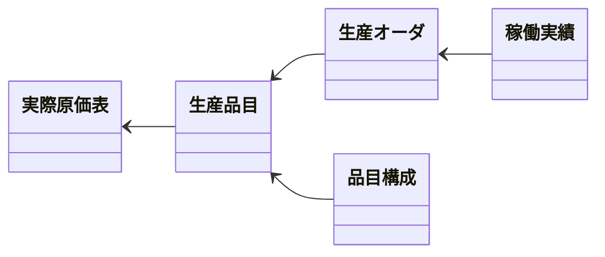
```mermaid
classDiagram
direction LR
    実際原価表 <-- 生産品目
    生産品目 <-- 生産オーダ
    生産品目 <-- 品目構成
    生産オーダ <-- 稼働実績
    class 実際原価表["実際原価表"]
    class 生産品目["生産品目"]
    class 生産オーダ["生産オーダ"]
    class 品目構成["品目構成"]
    class 稼働実績["稼働実績"]
```

表 31 実際原価表
| NO | 項目名 | エンティティ | 属性 | 関係 |
|---:|---|---|---|---|
| 1 | 部品番号 | 生産品目 | 部品番号 | |
| 2 | 品目名 | 生産品目 | 生産品目名 | |
| 3 | ステータス | 生産品目 | ステータス | |
| 4 | 数量 | 生産品目 | 数量 | |
| 5 | 単位 | 生産品目 | 単位 | |
| 6 | 原価 | 生産品目 | 原価 | |
| 8 | 追番 | 品目構成 | 追番 | *1 |
| 9 | 部品名 | 品目構成 | 品目構成名 | *1 |
| 10 | 仕様 | 品目構成 | 仕様 | *1 |
| 11 | 員数 | 品目構成 | 員数 | *1 |
| 12 | 単位 | 品目構成 | 単位 | *1 |
| 13 | 原価 | 品目構成 | 原価 | *1 |
| 14 | オーダ番号 | 生産オーダ | 生産オーダ名 | *2 |
| 15 | 発行日 | 生産オーダ | 発行日時 | *2 |
| 16 | ステータス | 生産オーダ | ステータス | *2 |
| 17 | 生産工程 | 生産オーダ | 生産工程ID | *2 |
| 18 | 数量 | 生産オーダ | 数量 | *2 |
| 19 | 単位 | 生産オーダ | 単位 | *2 |
| 20 | 原価 | 生産オーダ | 実績数量 | *2 |
| 21 | 日付 | 稼働実績 | タームID | *3 |
| 22 | 実績区分 | 稼働実績 | 稼働実績分類 | *3 |
| 23 | 設備 | 稼働実績 | 生産設備ID | *3 |
| 24 | 内容 | 稼働実績 | 内容 | *3 |
| 25 | 数量 | 稼働実績 | 数量 | *3 |
| 26 | 単位 | 稼働実績 | 単位 | *3 |
| 27 | 稼働時間 | 稼働実績 | 稼働時間 | *3 |

## 7.2.	開発情報
構成情報（Structure Information）
部品構成表（BOM）、工程構成表（BOP）、設備構成表（BOA）など、対象物を階層構造で表現するモデル情報。静的で整合性を求められるリレーショナルデータ型。
表 34　構成情報
| NO | 情報名 | 製品 | 工程 | 設備 | 説明 |
|---:|---|:---:|:---:|:---:|---|
| 1 | 設計部品表（E-BOM） | 〇 |  |  | 設計視点での部品構成を示す BOM。図面・仕様に基づき、製品の機能・構造を記述する。 |
| 2 | 製造部品表（M-BOM） | 〇 | 〇 |  | 製造工程で必要となる部品構成を示す BOM。作業単位や工程展開に対応した製造視点の表。 |
| 3 | サービス部品表（S-BOM） | 〇 |  |  | 保守・サービス用の交換部品構成を示す BOM。点検・修理のための部品体系。 |
| 4 | 工程構成表（BOP） | 〇 | 〇 | 〇 | 製造に必要な工程順序、作業内容、条件、工数などを記した表。BOM を工程に展開する役割を持つ。 |
					

#### 設計部品表（E-BOM）
設計視点での部品構成を示す BOM。図面・仕様に基づき、製品の機能・構造を記述する。

図 15　設計部品表（E-BOM）
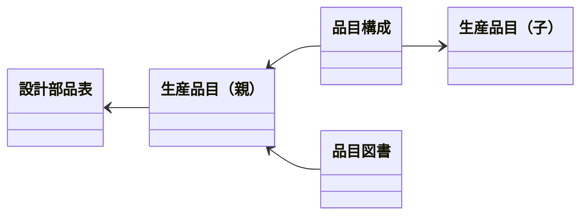
```mermaid
classDiagram
direction LR
    設計部品表 <-- 生産品目
    生産品目 <-- 品目構成
    生産品目 <-- 品目図書
    品目構成 --> 生産品目_子
    class 設計部品表["設計部品表"]
    class 生産品目["生産品目（親）"]
    class 品目構成["品目構成"]
    class 品目図書["品目図書"]
    class 生産品目_子["生産品目（子）"]
```

表 35 設計部品表（E-BOM）
| NO | 項目名 | エンティティ | 属性 | 関係 |
|---:|---|---|---|---|
| 1 | 品目名 | 生産品目 | 生産品目名 | |
| 2 | 品目番号 | 生産品目 | 品目番号 | |
| 3 | 品目分類 | 生産品目 | 生産品目分類 | |
| 4 | ステータス | 生産品目 | ステータス | |
| 5 | 図面番号 | 生産品目 | 図面番号 | |
| 6 | 仕様 | 生産品目 | 仕様 | |
| 7 | 図面ファイル | 品目図書 | ファイル | *1 |
| 8 | 追番 | 品目構成 | 追番 | *2 |
| 9 | 分類 | 品目構成 | 品目構成分類 | *2 |
| 10 | 員数 | 品目構成 | 員数 | *2 |
| 11 | 単位 | 品目構成 | 単位 | *2 |
| 12 | 品目番号 | 生産品目（子） | 品目番号 | *2 |
| 13 | 品目名 | 生産品目（子） | 生産品目名 | *2 |
| 14 | 図面番号 | 生産品目（子） | 図面番号 | *2 |
| 15 | 仕様（部品） | 生産品目（子） | 仕様 | *2 |

#### 製造部品表（M-BOM）
製造工程で必要となる部品構成を示す BOM。作業単位や工程展開に対応した製造視点の表。

図 16　製造部品表（M-BOM）
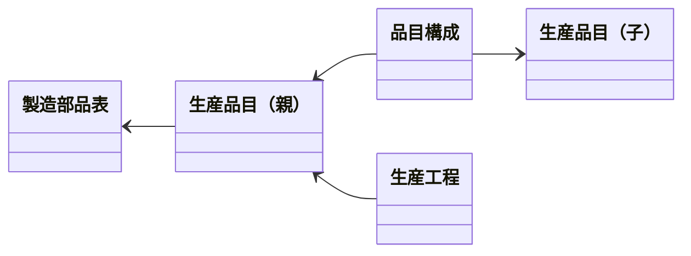
```mermaid
classDiagram
direction LR
    製造部品表 <-- 生産品目
    生産品目 <-- 品目構成
    生産品目 <-- 生産工程
    品目構成 --> 生産品目_子
    class 製造部品表["製造部品表"]
    class 生産品目["生産品目（親）"]
    class 品目構成["品目構成"]
    class 生産工程["生産工程"]
    class 生産品目_子["生産品目（子）"]
```

表 36 製造部品表（M-BOM）
| NO | 項目名 | エンティティ | 属性 | 関係 |
|---:|---|---|---|---|
| 1 | 品目名 | 生産品目 | 生産品目名 | |
| 2 | 品目番号 | 生産品目 | 品目番号 | |
| 3 | 品目分類 | 生産品目 | 生産品目分類 | |
| 4 | ステータス | 生産品目 | ステータス | |
| 5 | 図面番号 | 生産品目 | 図面番号 | |
| 6 | 仕様 | 生産品目 | 仕様 | |
| 7 | 追番 | 品目構成 | 追番 | * |
| 8 | 階層 | 品目構成 | 階層 | * |
| 9 | 分類 | 品目構成 | 分類 | * |
| 10 | 品目名 | 品目構成 | 生産品目名 | * |
| 11 | 員数 | 品目構成 | 員数 | * |
| 12 | 単位 | 品目構成 | 単位 | * |
| 13 | 品目番号 | 生産品目（子） | 品目番号 | *2 |
| 14 | 図面番号 | 生産品目（子） | 図面番号 | *2 |
| 15 | 仕様（子） | 生産品目（子） | 仕様 | *2 |
| 16 | 工程名 | 生産工程 | 工程名 | *3 |
| 17 | 仕様（工程） | 生産工程 | 仕様（工程） | *3 |
| 18 | 数量 | 生産工程 | 数量 | *3 |
| 19 | 単位 | 生産工程 | 単位 | *3 |

#### サービス部品表（S-BOM）
保守・サービス用の交換部品構成を示す BOM。点検・修理のための部品体系。

図 17　サービス部品表（S-BOM）
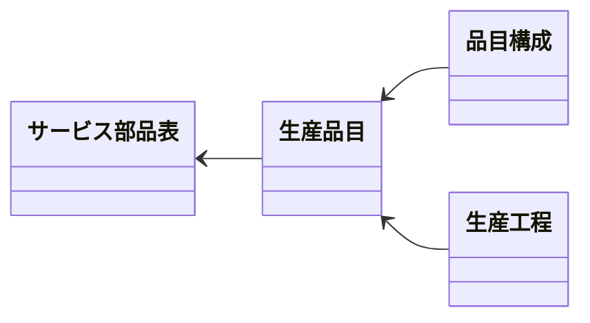
```mermaid
classDiagram
direction LR
    サービス部品表 <-- 生産品目
    生産品目 <-- 品目構成
    生産品目 <-- 生産工程
    class サービス部品表["サービス部品表"]
    class 生産品目["生産品目"]
    class 品目構成["品目構成"]
    class 生産工程["生産工程"]
```

表 37 サービス部品表（S-BOM）
| NO | 項目名 | エンティティ | 属性 | 関係 |
|---:|---|---|---|---|
| 1 | 品目名 | 生産品目 | 生産品目名 | |
| 2 | 品目番号 | 生産品目 | 品目番号 | |
| 3 | 品目分類 | 生産品目 | 生産品目分類 | |
| 4 | ステータス | 生産品目 | ステータス | |
| 5 | サービス番号 | 生産品目 | 図面番号 | |
| 6 | サービス仕様 | 生産品目 | 仕様 | |
| 7 | サービス名 | 生産工程 | 生産工程ID | *1 |
| 8 | サービス分類 | 生産工程 | 生産工程分類 | *1 |
| 9 | サービス内容 | 生産工程 | 生産工程名 | *1 |
| 10 | サービス状態 | 生産工程 | ステータス | *1 |
| 11 | 数量 | 生産工程 | 数量 | *1 |
| 12 | 単位 | 生産工程 | 単位 | *1 |
| 13 | 追番 | 品目構成 | 追番 | *2 |
| 14 | 分類 | 品目構成 | 品目構成分類 | *2 |
| 15 | 品目名 | 品目構成 | 生産品目名 | *2 |
| 16 | 員数 | 品目構成 | 員数 | *2 |
| 17 | 単位 | 品目構成 | 単位 | *2 |

#### 工程構成表（BOP）
製造に必要な工程順序、作業内容、条件、工数などを記した表。BOM を工程に展開する役割を持つ。

図 18　工程構成表（BOP）
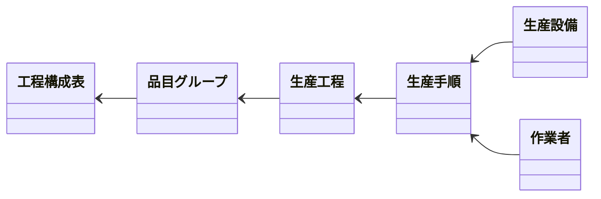
```mermaid
classDiagram
direction LR
    工程構成表 <-- 品目グループ
    品目グループ <-- 生産工程
    生産工程 <-- 生産手順
    生産手順 <-- 生産設備
    生産手順 <-- 作業者
    class 工程構成表["工程構成表"]
    class 品目グループ["品目グループ"]
    class 生産工程["生産工程"]
    class 生産手順["生産手順"]
    class 生産設備["生産設備"]
    class 作業者["作業者"]
```

表 38 工程構成表（BOP）
| NO | 項目名 | エンティティ | 属性 | 関係 |
|---:|---|---|---|---|
| 1 | 品目名 | 生産品目 | 品目名 | - |
| 2 | 品目番号 | 生産品目 | 品目番号 | - |
| 3 | 追番 | 品目構成 | 追番 | * |
| 4 | 階層 | 品目構成 | 階層 | * |
| 5 | 分類 | 品目構成 | 品目構成分類 | * |
| 6 | 生産品目 | 品目構成 | 子生産品目ID | * |
| 7 | 生産工程 | 品目構成 | 生産工程ID | * |
| 8 | 仕様 | 品目構成 | 仕様 | * |
| 9 | 員数 | 品目構成 | 員数 | * |
| 10 | 単位 | 品目構成 | 単位 | * |
| 11 | 追番 | 生産手順 | 追番 | *2 |
| 12 | 手順名 | 生産手順 | 生産手順名 | *2 |
| 13 | 手順内容 | 生産手順 | 内容 | *2 |
| 14 | 生産工数 | 生産手順 | 生産工数 | *2 |
| 15 | 単位 | 生産手順 | 単位 | *2 |
| 16 | 設備 | 生産手順 | 設備グループID | *2 |
| 17 | 作業者 | 生産手順 | 作業者グループID | *2 |
| 18 | 設備番号 | 生産設備 | 作設備番号 | *3 |
| 19 | 設備名 | 生産設備 | 生産設備名 | *3 |
| 20 | 仕様 | 生産設備 | 仕様 | *3 |
| 21 | 標準能力 | 生産設備 | 標準能力 | *3 |
| 22 | 作業者番号 | 作業者 | 作業者番号 | *4 |
| 23 | 作業者名 | 作業者 | 作業者名 | *4 |
| 24 | 仕様 | 作業者 | 仕様 | *4 |
| 25 | 標準能力 | 作業者 | 標準能力 | *4 |

### 手順情報
手順情報は、業務や作業を正しく安全に実行するための手順や順序、判断基準を定義した情報。作業内容、実施条件、注意事項、使用する設備や治工具などを明確にし、担当者による作業ばらつきを抑える。
表 40　手順情報
| NO | 情報名 | 製品 | 工程 | 設備 | 説明 |
|---:|---|:---:|:---:|:---:|---|
| 1 | QC工程表 | 〇 | 〇 |  | 工程ごとの作業内容、検査項目、管理点、使用設備をまとめた表。品質を作り込むための標準。 |
| 2 | 作業手順書 | 〇 | 〇 | 〇 | 作業の方法・手順・使用工具・注意点をまとめた文書。作業品質の安定と安全確保を目的とする。 |
| 3 | 保全手順書 |  | 〇 | 〇 | 設備点検・補修・予防保全の具体的手順や注意事項を示す文書。設備稼働率向上と故障防止に用いる。 |

#### QC工程表
工程ごとの作業内容、検査項目、管理点、使用設備をまとめた表。品質を作り込むための標準。

図 19　QC工程表

```mermaid
classDiagram
direction LR
    QC工程表 <-- 生産品目
    生産品目 <-- 生産工程
    生産工程 <-- 生産手順
    生産手順 <-- 生産内容
    class QC工程表["QC工程表"]
    class 生産品目["生産品目"]
    class 生産工程["生産工程"]
    class 生産手順["生産手順"]
    class 生産内容["生産内容"]
```

表 41 QC工程表
| NO | 項目名 | エンティティ | 属性 | 関係 |
|---:|---|---|---|---|
| 1 | 品目番号 | 生産品目 | 品目番号 | - |
| 2 | 品目名 | 生産品目 | 生産品目名 | - |
| 3 | 品目分類 | 生産品目 | 生産品目分類 | - |
| 4 | 工程番号 | 生産工程 | 工程番号 | |
| 5 | 工程名 | 生産工程 | 生産工程名 | |
| 6 | サイト | 生産工程 | サイト | |
| 7 | 追番 | 生産手順 | 追番 | *1 |
| 8 | 分類 | 生産手順 | 分類 | *1 |
| 9 | 手順名 | 生産手順 | 手順名 | *1 |
| 10 | 内容 | 生産手順 | 内容 | *1 |
| 11 | 数量 | 生産手順 | 数量 | *1 |
| 12 | 単位 | 生産手順 | 単位 | *1 |
| 13 | 生産ライン | 生産手順 | 生産ライン | *1 |
| 14 | 使用設備 | 生産手順 | 使用設備 | *1 |
| 15 | 作業者 | 生産手順 | 作業者 | *1 |
| 16 | 管理方法 | 生産手順 | 管理方法 | *1 |
| 17 | 検査方法 | 生産手順 | 検査方法 | *1 |
| 18 | 検査頻度 | 生産手順 | 検査頻度 | *1 |
| 19 | 備考 | 生産手順 | 備考 | *1 |
| 20 | 追番 | 生産項目 | 追番 | *2 |
| 21 | 分類 | 生産項目 | 分類 | *2 |
| 22 | 生産項目名 | 生産項目 | 生産項目名 | *2 |
| 23 | 治工具名 | 生産項目 | 治工具名 | *2 |
| 24 | 仕様 | 生産項目 | 仕様 | *2 |
| 25 | 規格値 | 生産項目 | 規格値 | *2 |
| 26 | 測定値 | 生産項目 | 測定値 | *2 |
| 27 | 単位 | 生産項目 | 単位 | *2 |

#### 作業手順書
作業の方法・手順・使用工具・注意点をまとめた文書。作業品質の安定と安全確保を目的とする。

図 20　作業手順書
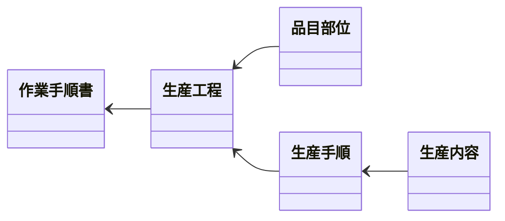
```mermaid
classDiagram
direction LR
    作業手順書 <-- 生産工程
    生産工程 <-- 品目部位
    生産工程 <-- 生産手順
    生産手順 <-- 生産内容
    class 作業手順書["作業手順書"]
    class 生産工程["生産工程"]
    class 品目部位["品目部位"]
    class 生産手順["生産手順"]
    class 生産内容["生産内容"]
```

表 42 作業手順書
| NO | 項目名 | エンティティ | 属性 | 関係 |
|---:|---|---|---|---|
| 1 | 工程名 | 生産工程 | 生産工程名 | |
| 2 | 工程分類 | 生産工程 | 生産工程分類 | |
| 3 | ステータス | 生産工程 | ステータス | |
| 4 | 生産品目 | 生産工程 | 生産品目ID | |
| 5 | 仕様 | 生産工程 | 仕様 | |
| 6 | 数量 | 生産工程 | 数量 | |
| 7 | 単位 | 生産工程 | 単位 | |
| 8 | サイト | 生産工程 | サイトID | |
| 9 | 追番 | 生産手順 | 追番 | *1 |
| 10 | 手順名 | 生産手順 | 生産手順名 | *1 |
| 11 | 手順分類 | 生産手順 | 生産手順分類 | *1 |
| 12 | 手順内容 | 生産手順 | 内容 | *1 |
| 13 | 手順数量 | 生産手順 | 数量 | *1 |
| 14 | 単位 | 生産手順 | 単位 | *1 |
| 15 | 追番 | 生産項目 | 追番 | *2 |
| 16 | 項目分類 | 生産項目 | 生産項目分類 | *2 |
| 17 | 項目内容 | 生産項目 | 項目内容 | *2 |
| 18 | 規格値 | 生産項目 | 規格値 | *2 |
| 19 | 単位 | 生産項目 | 単位 | *2 |
| 20 | 対象部位 | 生産項目 | 品目部位ID | *2 |

#### 保全手順書
設備点検・補修・予防保全の具体的手順や注意事項を示す文書。設備稼働率向上と故障防止に用いる。

図 21　保全手順書
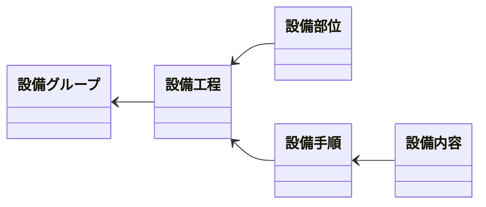
```mermaid
classDiagram
direction LR
    設備グループ <-- 設備工程
    設備工程 <-- 設備部位
    設備工程 <-- 設備手順
    設備手順 <-- 設備内容
    class 設備工程["設備工程"]
    class 設備部位["設備部位"]
    class 設備手順["設備手順"]
    class 設備内容["設備内容"]
```

表 44 保全手順書
| NO | 項目名 | エンティティ | 属性 | 関係 |
|---:|---|---|---|---|
| 1 | 工程名 | 設備工程 | 生産工程名 | |
| 2 | 工程分類 | 設備工程 | 生産工程分類 | |
| 3 | ステータス | 設備工程 | ステータス | |
| 4 | 生産品目 | 設備工程 | 生産品目ID | |
| 5 | 仕様 | 設備工程 | 仕様 | |
| 6 | 数量 | 設備工程 | 数量 | |
| 7 | 単位 | 設備工程 | 単位 | |
| 8 | サイト | 設備工程 | サイトID | |
| 9 | 追番 | 設備手順 | 追番 | *1 |
| 10 | 手順名 | 設備手順 | 生産手順名 | *1 |
| 11 | 手順分類 | 設備手順 | 生産手順分類 | |
| 12 | 手順内容 | 設備手順 | 内容 | |
| 13 | 手順数量 | 設備手順 | 数量 | *1 |
| 14 | 単位 | 設備手順 | 単位 | *1 |
| 15 | 追番 | 設備項目 | 追番 | *2 |
| 16 | 項目分類 | 設備項目 | 生産項目分類 | *2 |
| 17 | 項目内容 | 設備項目 | 項目内容 | *2 |
| 18 | 規格値 | 設備項目 | 規格値 | *2 |
| 19 | 単位 | 設備項目 | 単位 | *2 |
| 20 | 対象部位 | 設備項目 | 設備部位ID | *2 |

### 基準情報（Standard Information）
品質・工程・設備などの基準値や規格を保持する参照情報。変更頻度が低く、他情報の判断基準として機能する。

表 45　基準情報
| NO | 情報名 | 製品 | 工程 | 設備 | 説明 |
|---:|---|:---:|:---:|:---:|---|
| 1 | 品質管理基準表 | 〇 | 〇 |  | 品質を維持・改善するための管理項目、目標値、監視方法を示す基準。工程品質の統一を図る。 |
| 2 | 設備保全基準表 |  | 〇 | 〇 | 設備の点検項目、周期、許容値、保全方法を規定した基準。故障防止と稼働率維持に用いる。 |
| 3 | 環境安全基準表 | 〇 | 〇 | 〇 | 作業環境・安全対策・化学物質管理などの基準をまとめた表。環境保全と作業者安全を確保する。 |

#### 品質管理基準表
品質を維持・改善するための管理項目、目標値、監視方法を示す基準。工程品質の統一を図る。 

図 22　品質管理基準表
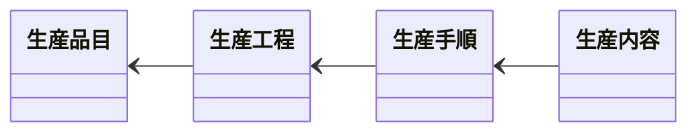
```mermaid
classDiagram
direction LR
    生産品目 <-- 生産工程
    生産工程 <-- 生産手順
    生産手順 <-- 生産内容
    class 生産品目["生産品目"]
    class 生産工程["生産工程"]
    class 生産手順["生産手順"]
    class 生産内容["生産内容"]
```

表 46　品質管理基準表
| NO | 項目名 | エンティティ | 属性 | 関係 |
|---:|---|---|---|---|
| 1 | 品目番号 | 生産品目 | 品目番号 | |
| 2 | 品目名 | 生産品目 | 生産品目名 | |
| 3 | 品目分類 | 生産品目 | 生産品目分類 | |
| 4 | ステータス | 生産品目 | ステータス | |
| 5 | 図面番号 | 生産品目 | 図面番号 | |
| 6 | 品質仕様 | 生産品目 | 仕様 | |
| 7 | 追番 | 生産手順 | 追番 | *1 |
| 8 | 手順名 | 生産手順 | 生産手順名 | *1 |
| 9 | 手順分類 | 生産手順 | 生産手順分類 | *1 |
| 10 | 手順内容 | 生産手順 | 内容 | *1 |
| 11 | 管理方法 | 生産手順 | 管理方法 | *1 |
| 12 | 検査方法 | 生産手順 | 検査方法 | *1 |
| 13 | 基準数量 | 生産手順 | 数量 | *1 |
| 14 | 単位 | 生産手順 | 単位 | *1 |
| 15 | 追番 | 生産項目 | 追番 | *2 |
| 16 | 項目分類 | 生産項目 | 生産項目分類 | *2 |
| 17 | 項目名 | 生産項目 | 生産項目名 | *2 |
| 18 | 検査仕様 | 生産項目 | 仕様 | *2 |
| 19 | 検査基準 | 生産項目 | 数量 | *2 |
| 20 | 単位 | 生産項目 | 単位 | *2 |
| 21 | 品目部位 | 生産項目 | 品目部位ID | *2 |

#### 設備保全基準表
設備の点検項目、周期、許容値、保全方法を規定した基準。故障防止と稼働率維持に用いる。

図 23　設備保全基準表
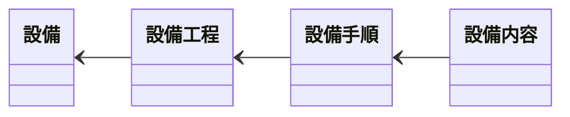
```mermaid
classDiagram
direction LR
    設備 <-- 設備工程
    設備工程 <-- 設備手順
    設備手順 <-- 設備内容
    class 設備["設備"]
    class 設備工程["設備工程"]
    class 設備手順["設備手順"]
    class 設備内容["設備内容"]
```

表 47 設備保全基準表
| NO | 項目名 | エンティティ | 属性 | 関係 |
|---:|---|---|---|---|
| 1 | 設備番号 | 生産設備 | 設備番号 | |
| 2 | 設備名 | 生産設備 | 生産設備名 | |
| 3 | 設備分類 | 生産設備 | 生産設備分類 | |
| 4 | ステータス | 生産設備 | ステータス | |
| 5 | 品質仕様 | 生産設備 | 仕様 | |
| 6 | 追番 | 設備手順 | 追番 | *1 |
| 7 | 手順名 | 設備手順 | 設備手順名 | *1 |
| 8 | 手順分類 | 設備手順 | 設備手順分類 | *1 |
| 9 | 手順内容 | 設備手順 | 内容 | *1 |
| 10 | 管理方法 | 設備手順 | 管理方法 | *1 |
| 11 | 検査方法 | 設備手順 | 検査方法 | *1 |
| 12 | 基準数量 | 設備手順 | 数量 | *1 |
| 13 | 単位 | 設備手順 | 単位 | *1 |
| 14 | 追番 | 設備項目 | 追番 | *2 |
| 15 | 項目分類 | 設備項目 | 設備項目分類 | *2 |
| 16 | 項目名 | 設備項目 | 設備項目名 | *2 |
| 17 | 点検仕様 | 設備項目 | 仕様 | *2 |
| 18 | 点検基準 | 設備項目 | 数量 | *2 |
| 19 | 単位 | 設備項目 | 単位 | *2 |
| 20 | 設備部位 | 設備項目 | 設備部位ID | *2 |

#### 環境安全基準表
作業環境・安全対策・化学物質管理などの基準をまとめた表。環境保全と作業者安全を確保する。

図 24　環境安全基準表
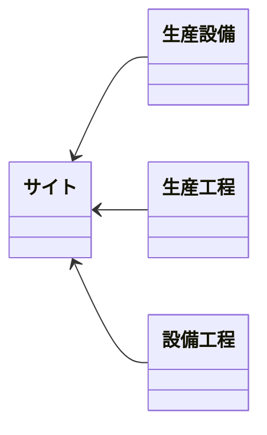
```mermaid
classDiagram
direction LR
    サイト <-- 生産設備
    サイト <-- 生産工程
    サイト <-- 設備工程
    class サイト["サイト"]
    class 生産設備["生産設備"]
    class 生産工程["生産工程"]
    class 設備工程["設備工程"]
```

表 48 環境安全基準表
| NO | 項目名 | エンティティ | 属性 | 関係 |
|---:|---|---|---|---|
| 1 | サイト名 | サイト | サイト名 | |
| 2 | 安全仕様 | サイト | 仕様 | |
| 3 | ロケーション | サイト | ロケーション | |
| 4 | ステータス | サイト | ステータス | |
| 5 | 生産工程 | 生産工程 | 生産工程名 | *1 |
| 6 | 工程分類（生産工程） | 生産工程 | 生産工程分類 | *1 |
| 7 | 計測仕様 | 生産工程 | 仕様 | *1 |
| 8 | 基準数値 | 生産工程 | 数量 | *1 |
| 9 | 単位 | 生産工程 | 単位 | *1 |
| 10 | 保全工程 | 設備工程 | 設備工程名 | *2 |
| 11 | 工程分類（保全工程） | 設備工程 | 設備工程分類 | *2 |
| 12 | 要求仕様（保全工程） | 設備工程 | 仕様 | *2 |
| 13 | 基準数値（保全工程） | 設備工程 | 数量 | *2 |
| 14 | 単位（保全工程） | 設備工程 | 単位 | *2 |

## 7.3.	技術情報
### 展開情報（Deployment Information）
製品、工程、設備に関する情報を、より個別の管理手法に沿った形で深掘りし、それらを展開して相互に対応関係を示すことで新たなビューを提示する変換型情報。表記ルールがそれぞれ定義されている。（例：QFD、FMEAなど）。
表 49　展開情報
| NO | 情報名 | 製品 | 工程 | 設備 | 説明 |
|---:|---|:---:|:---:|:---:|---|
| 1 | 品質機能展開表（QFD） | 〇 | 〇 | 〇 | 顧客要求を設計要素へ体系的に展開し、重要度を評価する表。設計品質を確実に反映させる。 |
| 2 | 故障解析表（FTA） |  | 〇 | 〇 | 故障の原因を論理的に木構造で追究する解析図。重大故障の根本原因を明確化する。 |
| 3 | 設計FMEA | 〇 | 〇 |  | 設計段階で潜在的な不具合を予測し、原因・影響・対策を整理する手法。設計リスクを低減する。 |
| 4 | 工程FMEA |  | 〇 | 〇 | 製造工程で起こり得る不具合や異常を分析し、優先度をつけ対策を検討する手法。工程品質を強化する。 |

#### 品質機能展開表(QFD)
顧客要求を設計要素へ体系的に展開し、重要度を評価する表。設計品質を確実に反映させる。

図 25　品質機能展開表
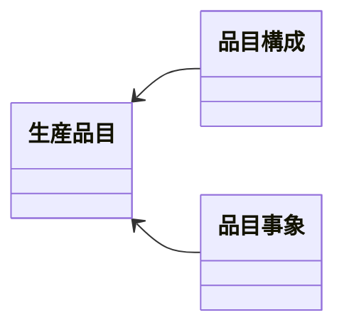
```mermaid
classDiagram
direction LR
    生産品目 <-- 品目構成
    生産品目 <-- 品目事象
    class 生産品目["生産品目"]
    class 品目構成["品目構成"]
    class 品目事象["品目事象"]
```


表 50 品質機能展開表（QFD）
| NO | 項目名 | エンティティ | 属性 | 関係 |
|---:|---|---|---|---|
| 1 | 品目番号 | 生産品目 | 品目番号 | |
| 2 | 品目名 | 生産品目 | 品目名 | |
| 3 | 品目分類 | 生産品目 | 品目分類 | |
| 4 | ステータス | 生産品目 | ステータス | |
| 5 | 仕様 | 生産品目 | 仕様 | |
| 6 | 機能名 | 品目機能 | 品目機能名 | |
| 7 | 品質特性 | 品目機能 | 品質機能分類 | |
| 8 | 基準数量 | 品目機能 | 数量 | |
| 9 | 単位 | 品目機能 | 単位 | |
| 10 | 要求名 | 品目事象 | 品目事象名 | |
| 11 | 要求分類 | 品目事象 | 品目事象分類 | |
| 12 | ステータス | 品目事象 | ステータス | |
| 13 | 連関度 | 品目事象×品目機能 | 連関度 | |
| 14 | 重要度 | 品目事象×品目機能 | 重要度 | |

#### 故障解析表
故障の原因を論理的に木構造で追究する解析図。重大故障の根本原因を明確化する。

図 26　故障解析表
```mermaid
classDiagram
direction LR
    設備 <-- 設備対策
    設備 <-- 設備事象_親
    設備 <-- 設備事象_子
    class 設備["設備"]
    class 設備対策["設備対策"]
    class 設備事象_親["設備事象（親）"]
    class 設備事象_子["設備事象（子）"]
```

表 51 故障解析表（FTA）
| NO | 項目名 | エンティティ | 属性 | 関係 |
|---:|---|---|---|---|
| 1 | 設備番号 | 生産設備 | 設備番号 | |
| 2 | 設備名 | 生産設備 | 生産設備名 | |
| 3 | 設備分類 | 生産設備 | 生産設備分類 | |
| 4 | 仕様 | 生産設備 | 仕様 | |
| 5 | ステータス | 生産設備 | ステータス | |
| 6 | 事象名 | 設備事象 | 設備事象名 | *1 |
| 7 | 論理関係 | 設備事象 | 論理関係 | *1 |
| 8 | 確率 | 設備事象 | 確率 | *1 |
| 9 | 事実 | 設備事象 | 事実 | *1 |
| 10 | 課題 | 設備事象 | 課題 | *1 |
| 11 | 原因 | 設備事象 | 原因 | *1 |
| 12 | 事象名（子） | 設備事象（子） | 設備事象名 | *2 |
| 13 | 論理関係（子） | 設備事象（子） | 論理関係 | *2 |
| 14 | 確率（子） | 設備事象（子） | 確率 | *2 |
| 15 | 事実（子） | 設備事象（子） | 事実 | *2 |
| 16 | 課題（子） | 設備事象（子） | 課題 | *2 |
| 17 | 原因（子） | 設備事象（子） | 原因 | *2 |
| 18 | 対策名 | 設備対策 | 設備対策名 | *3 |
| 19 | ステータス | 設備対策 | ステータス | *3 |
| 20 | 対策 | 設備対策 | 対策 | *3 |
| 21 | 成果 | 設備対策 | 成果 | *3 |
| 22 | 完了日時 | 設備対策 | 完了日時 | *3 |

#### 設計FMEA
設計段階で潜在的な不具合を予測し、原因・影響・対策を整理する手法。設計リスクを低減する。 

図 27　設計FMEA
```mermaid
classDiagram
direction LR
    生産品目 <-- 品目機能
    生産品目 <-- 品目事象
    品目事象 <-- 品目対策
    class 生産品目["生産品目"]
    class 品目機能["品目機能"]
    class 品目事象["品目事象"]
    class 品目対策["品目対策"]
```

表 52 設計FMEA
| NO | 項目名 | エンティティ | 属性 | 関係 |
|---:|---|---|---|---|
| 1 | 品目番号 | 生産品目 | 品目番号 | |
| 2 | 品目名 | 生産品目 | 品目名 | |
| 3 | 品目分類 | 生産品目 | 品目分類 | |
| 4 | ステータス | 生産品目 | ステータス | |
| 5 | 図面番号 | 生産品目 | 図面番号 | |
| 6 | 仕様 | 生産品目 | 仕様 | |
| 7 | 品目機能名 | 品目機能 | 品目機能名 | *1 |
| 8 | ステータス | 品目機能 | ステータス | *1 |
| 9 | 故障モード | 品目機能 | 故障モード | *1 |
| 10 | 影響 | 品目機能 | 影響 | *1 |
| 11 | 原因 | 品目機能 | 原因 | *1 |
| 12 | 管理 | 品目機能 | 管理 | *1 |
| 13 | 影響度 | 品目機能 | 影響度 | *1 |
| 14 | 発生頻度 | 品目機能 | 発生頻度 | *1 |
| 15 | 検出可能性 | 品目機能 | 検出可能性 | *1 |
| 16 | 優先度（RPN） | 品目機能 | 優先度（RPN） | *1 |
| 17 | 事業名 | 品目事象 | 事業名 | * |
| 18 | 事業分類 | 品目事象 | 事業分類 | * |
| 19 | ステータス | 品目事象 | ステータス | * |
| 20 | 事実 | 品目事象 | 事実 | * |
| 21 | 課題 | 品目事象 | 課題 | * |
| 22 | 原因 | 品目事象 | 原因 | * |
| 23 | 追番 | 品目対策 | 追番 | *2 |
| 24 | 対策名 | 品目対策 | 工程対策名 | *2 |
| 25 | 対策分類 | 品目対策 | 工程対策分類 | *2 |
| 26 | ステータス | 工程対策 | ステータス | *2 |
| 27 | 対策 | 品目対策 | 対策 | *2 |
| 28 | 成果 | 品目対策 | 成果 | *2 |
| 29 | 着手日時 | 品目対策 | 着手日時 | *2 |
| 30 | 完了日時 | 品目対策 | 完了日時 | *2 |
| 31 | 作業者 | 品目対策 | 作業者ID | *2 |

#### 工程FMEA
製造工程で起こり得る不具合や異常を分析し、優先度をつけ対策を検討する手法。工程品質を強化する。

図 28　工程FMEA
```mermaid
classDiagram
direction LR
    生産工程 <-- 工程機能
    生産工程 <-- 工程事象
    工程事象 <-- 工程対策
    class 生産工程["生産工程"]
    class 工程機能["工程機能"]
    class 工程事象["工程事象"]
    class 工程対策["工程対策"]
```

表 53 工程FMEA
| NO | 項目名 | エンティティ | 属性 | 関係 |
|---:|---|---|---|---|
| 1 | 工程番号 | 生産工程 | 品目番号 | |
| 2 | 工程名 | 生産工程 | 品目名 | |
| 3 | 工程分類 | 生産工程 | 品目分類 | |
| 4 | ステータス | 生産工程 | ステータス | |
| 5 | 図面番号 | 生産工程 | 図面番号 | |
| 6 | 仕様 | 生産工程 | 仕様 | |
| 7 | 機能名 | 工程機能 | 品目機能名 | *1 |
| 8 | ステータス | 工程機能 | ステータス | *1 |
| 9 | 故障モード | 工程機能 | 故障モード | *1 |
| 10 | 影響 | 工程機能 | 影響 | *1 |
| 11 | 原因 | 工程機能 | 原因 | *1 |
| 12 | 管理 | 工程機能 | 管理 | *1 |
| 13 | 影響度 | 工程機能 | 影響度 | *1 |
| 14 | 発生頻度 | 工程機能 | 発生頻度 | *1 |
| 15 | 検出可能性 | 工程機能 | 検出可能性 | *1 |
| 16 | 優先度（RPN） | 工程機能 | 優先度（RPN） | *1 |
| 17 | 事業名 | 工程事象 | 事業名 | * |
| 18 | 事業分類 | 工程事象 | 事業分類 | * |
| 19 | ステータス | 工程事象 | ステータス | * |
| 20 | 事実 | 工程事象 | 事実 | * |
| 21 | 課題 | 工程事象 | 課題 | * |
| 22 | 原因 | 工程事象 | 原因 | * |
| 23 | 追番 | 工程対策 | 追番 | *2 |
| 24 | 対策名 | 工程対策 | 工程対策名 | *2 |
| 25 | 対策分類 | 工程対策 | 工程対策分類 | *2 |
| 26 | ステータス | 工程対策 | ステータス | *2 |
| 27 | 対策 | 工程対策 | 対策 | *2 |
| 28 | 成果 | 工程対策 | 成果 | *2 |
| 29 | 着手日時 | 工程対策 | 着手日時 | *2 |
| 30 | 完了日時 | 工程対策 | 完了日時 | *2 |
| 31 | 作業者 | 工程対策 | 作業者ID | *2 |

### 連携情報（Item/Material Identification Information）
部品や仕掛品の位置・状態・識別情報からなるトラッキング情報。現品票・バーコード・IDタグなどの形式が中心。

表 54　連携情報
| NO | 情報名 | 製品 | 工程 | 設備 | 説明 |
|---:|---|:---:|:---:|:---:|---|
| 1 | 設備構成表（BOA） |  | 〇 | 〇 | 工場や設備の構造・能力・設備階層を表すデータ。BOP を実行する工場モデルとして位置づく。 |
| 2 | モノと情報の流れ図（VSM） |  | 〇 |  | 工程間のモノの流れと情報の流れを可視化し、ムダやボトルネックを特定する図。改善活動の基盤。 |
| 3 | トレーサビリティ表 | 〇 | 〇 | 〇 | 部品・工程・作業履歴を追跡できるよう記録した表。品質問題発生時の原因追跡に必須。 |

#### 設備構成表(BOA)
工場や設備の構造・能力・設備階層を表すデータ。BOP を実行する工場モデルとして位置づく。

図 29　設備構成表
```mermaid
classDiagram
direction LR
 生産ライン <-- 設備グループ
 設備_親 --> 設備グループ 
 設備構成 --> 設備_親
 設備構成 --> 設備_子
 設備_親 <-- 設備割当
 作業者 <-- 設備割当
    

```

表 39 設備構成表（BOA）
| NO | 項目名 | エンティティ | 属性 | 関係 |
|---:|---|---|---|---|
| 1 | 設備名 | 生産設備 | 生産設備名 | * |
| 2 | 設備番号 | 生産設備 | 設備番号 | * |
| 3 | ロケーション | 生産設備 | ロケーション | * |
| 4 | 仕様 | 生産設備 | 仕様 | * |
| 5 | 標準能力 | 生産設備 | 標準能力 | * |
| 6 | 単位 | 生産設備 | 単位 | * |
| 7 | エリア | 生産ライン | エリアID | |
| 8 | 生産ライン | 生産ライン | 生産ライン名 | |
| 9 | 設備分類 | 設備グループ | 設備グループ分類 | |
| 10 | 設備グループ | 設備グループ | 設備グループ名 | |
| 11 | 設備番号（子） | 設備構成 | 子生産設備ID | *1 |
| 12 | 設備名（子） | 設備構成 | 設備構成名 | *1 |
| 13 | 仕様（子） | 設備構成 | 仕様 | *1 |
| 14 | 員数 | 設備構成 | 員数 | *1 |
| 15 | 単位（子） | 設備構成 | 単位 | *1 |
| 16 | 治工具名 | 治工具 | 治工具名 | *2 |
| 17 | 仕様（治工具） | 治工具 | 仕様 | *2 |
| 18 | 数量（治工具） | 治工具 | 数量 | *2 |
| 19 | 単位（治工具） | 治工具 | 単位 | *2 |
| 20 | ロケーション（治工具） | 治工具 | ロケーション | *2 |
| 21 | 作業者スキル名 | 作業者スキル | 作業者スキル名 | *3 |
| 22 | 作業者番号 | 作業者スキル | 作業者ID | *3 |
| 23 | 要求技能 | 作業者スキル | 仕様 | *3 |
| 24 | 数量（作業者） | 作業者スキル | 数量 | *3 |
| 25 | 単位（作業者） | 作業者スキル | 単位 | *3 |

#### モノと情報の流れ図
工程間のモノの流れと情報の流れを可視化し、ムダやボトルネックを特定する図。改善活動の基盤。

図 30　モノと情報の流れ図
```mermaid
classDiagram
direction LR
生産品目_製品 <-- 受注オーダ 
生産品目 <-- 生産オーダ
生産品目_資材 <-- 仕入オーダ 


生産品目_製品 <-- 品目構成 
生産品目 <-- 品目構成
生産品目 <-- 品目構成2
生産品目_資材 <-- 品目構成2

生産オーダ --> 生産工程
```
  
    

表 55 モノと情報の流れ図（VSM）
NO	項目名	エンティティ	属性	関係
| NO | 項目名 | エンティティ | 属性 | 関係 |
|---:|---|---|---|---|
| 1 | 生産品目 | 受注オーダ | 生産品目ID | |
| 2 | 出荷日時 | 受注オーダ | 出荷日時 | |
| 3 | 数量 | 受注オーダ | 数量 | |
| 4 | 単位 | 受注オーダ | 単位 | |
| 5 | 受注オーダ | 生産オーダ | 受注オーダID | *1 |
| 6 | 生産品目 | 生産オーダ | 生産品目 | *1 |
| 7 | 終了日時 | 生産オーダ | 終了日時 | *1 |
| 8 | 生産工程 | 生産オーダ | 生産工程ID | *1 |
| 9 | ロケーション | 生産オーダ | ロケーション | *1 |
| 10 | 数量 | 生産オーダ | 数量 | *1 |
| 11 | 単位 | 生産オーダ | 単位 | *1 |
| 12 | 生産オーダ | 仕入オーダ | 生産オーダID | *2 |
| 13 | 生産品目 | 仕入オーダ | 生産品目 | *2 |
| 14 | 入荷日時 | 仕入オーダ | 入荷日時 | *2 |
| 15 | 数量 | 仕入オーダ | 数量 | *2 |
| 16 | 単位 | 仕入オーダ | 単位 | *2 |
| 17 | 品目番号 | 生産品目 | 品目番号 | |
| 18 | 品目名 | 生産品目 | 生産品目名 | |
| 19 | ステータス | 生産品目 | ステータス | |
| 20 | 数量 | 生産品目 | 数量 | |
| 21 | 単位 | 生産品目 | 単位 | |
| 22 | 工程番号 | 生産工程 | 工程番号 | *1 |
| 23 | 工程名 | 生産工程 | 生産工程名 | *1 |
| 24 | ステータス | 生産工程 | ステータス | *1 |
| 25 | 数量 | 生産工程 | 数量 | *1 |
| 26 | 単位 | 生産工程 | 単位 | *1 |
| 27 | 親生産品目 | 品目構成 | 親生産品目ID | *2 |
| 28 | 子生産品目 | 品目構成 | 子生産品目ID | *2 |
| 29 | ステータス | 品目構成 | ステータス | *2 |
| 30 | 員数 | 品目構成 | 員数 | *2 |
| 31 | 単位 | 品目構成 | 単位 | *2 |

#### トレ_サビリティ表
部品・工程・作業履歴を追跡できるよう記録した表。品質問題発生時の原因追跡に必須。

図 31　トレ_サビリティ表
```mermaid
classDiagram
direction LR
生産品目_製品 <-- 受注オーダ 
生産品目 <-- 生産オーダ
生産品目_資材 <-- 仕入オーダ 


生産品目_製品 <-- 品目構成 
生産品目 <-- 品目構成
生産品目 <-- 品目構成2
生産品目_資材 <-- 品目構成2

生産オーダ --> 生産工程
```

表 56 トレーサビリティ表
| NO | 項目名 | エンティティ | 属性 | 関係 |
|---:|---|---|---|---|
| 1 | 生産品目 | 受注オーダ | 生産品目ID | |
| 2 | 出荷日時 | 受注オーダ | 出荷日時 | |
| 3 | 数量 | 受注オーダ | 数量 | |
| 4 | 単位 | 受注オーダ | 単位 | |
| 5 | 受注オーダ | 生産オーダ | 受注オーダID | *1 |
| 6 | 生産品目 | 生産オーダ | 生産品目 | *1 |
| 7 | 終了日時 | 生産オーダ | 終了日時 | *1 |
| 8 | 生産工程 | 生産オーダ | 生産工程ID | *1 |
| 9 | ロケーション | 生産オーダ | ロケーション | *1 |
| 10 | 数量 | 生産オーダ | 数量 | *1 |
| 11 | 単位 | 生産オーダ | 単位 | *1 |
| 12 | 生産オーダ | 仕入オーダ | 生産オーダID | *2 |
| 13 | 生産品目 | 仕入オーダ | 生産品目 | *2 |
| 14 | 入荷日時 | 仕入オーダ | 入荷日時 | *2 |
| 15 | 数量 | 仕入オーダ | 数量 | *2 |
| 16 | 単位 | 仕入オーダ | 単位 | *2 |
| 17 | 品目番号 | 生産品目 | 品目番号 | |
| 18 | 品目名 | 生産品目 | 生産品目名 | |
| 19 | ステータス | 生産品目 | ステータス | |
| 20 | 数量 | 生産品目 | 数量 | |
| 21 | 単位 | 生産品目 | 単位 | |
| 22 | 工程番号 | 生産工程 | 工程番号 | *1 |
| 23 | 工程名 | 生産工程 | 生産工程名 | *1 |
| 24 | ステータス | 生産工程 | ステータス | *1 |
| 25 | 数量 | 生産工程 | 数量 | *1 |
| 26 | 単位 | 生産工程 | 単位 | *1 |
| 27 | 親生産品目 | 品目構成 | 親生産品目ID | *2 |
| 28 | 子生産品目 | 品目構成 | 子生産品目ID | *2 |
| 29 | ステータス | 品目構成 | ステータス | *2 |
| 30 | 員数 | 品目構成 | 員数 | *2 |
| 31 | 単位 | 品目構成 | 単位 | *2 |

### 品質情報（Instruction Information）
現場への実行内容を指定する実行指示型情報。数量・納期・設備など、計画情報を具体化した運用データ。検査や点検なども対象となる。
表 57　品質情報
| NO | 情報名 | 製品 | 工程 | 設備 | 説明 |
|---:|---|:---:|:---:|:---:|---|
| 1 | 製品検査表 | 〇 |  |  | 完成品の検査項目、基準、結果を記録する表。品質保証と出荷判定の管理に用いる。 |
| 2 | 材料検査表 | 〇 |  |  | 受入材料の検査項目、規格、結果を記録する表。品質確保と不良流入防止に用いる。 |
| 3 | 設備点検表 |  |  | 〇 | 設備や機器の点検項目、周期、許容値、結果を記録する表。故障予防と安定稼働の管理に用いる。 |

#### 製品検査表
完成品の検査項目、基準、結果を記録する表。品質保証と出荷判定の管理に用いる。

図 32　製品検査表
```mermaid
classDiagram
direction LR
    生産品目 <-- 生産手順
    生産手順 <-- 生産内容
    生産品目 <-- 生産図書
```

表 59 製品検査表
| NO | 項目名 | エンティティ | 属性 | 関係 |
|---:|---|---|---|---|
| 1 | 品目番号 | 生産品目 | 品目番号 | |
| 2 | 図面番号 | 生産品目 | 図面番号 | |
| 3 | 品目名 | 生産品目 | 生産品目名 | |
| 4 | 仕様 | 生産品目 | 仕様 | |
| 5 | 検査図面 | 品目図書 | ファイル | |
| 6 | 追番 | 生産手順 | 追番 | * |
| 7 | 手順名 | 生産手順 | 生産手順名 | *1 |
| 8 | 手順分類 | 生産手順 | 生産手順分類 | *1 |
| 9 | 管理方法 | 生産手順 | 管理方法 | *1 |
| 10 | 検査方法 | 生産手順 | 検査方法 | *1 |
| 11 | 手順内容 | 生産手順 | 手順内容 | *1 |
| 12 | 基準数量 | 生産手順 | 数量 | *1 |
| 13 | 単位 | 生産手順 | 単位 | *1 |
| 14 | 追番 | 生産項目 | 追番 | *2 |
| 15 | 項目名 | 生産項目 | 生産項目名 | *2 |
| 16 | 項目分類 | 生産項目 | 生産項目分類 | *2 |
| 17 | 部位名 | 生産項目 | 生産部位ID | *2 |
| 18 | 治工具 | 生産項目 | 治工具ID | *2 |
| 19 | 項目内容 | 生産項目 | 仕様 | *2 |
| 20 | 基準値 | 生産項目 | 数量 | *2 |
| 21 | 測定値 | 生産項目 | 測定値 | *2 |
| 22 | 単位 | 生産項目 | 単位 | *2 |

#### 材料検査表
受入材料の検査項目、規格、結果を記録する表。品質確保と不良流入防止に用いる。

図 33　材料検査表
```mermaid
classDiagram
direction LR
    生産品目 <-- 生産手順
    生産手順 <-- 生産内容
    生産品目 <-- 生産図書
```

表 60 材料検査表
| NO | 項目名 | エンティティ | 属性 | 関係 |
|---:|---|---|---|---|
| 1 | 品目番号 | 生産品目 | 品目番号 | |
| 2 | 図面番号 | 生産品目 | 図面番号 | |
| 3 | 品目名 | 生産品目 | 生産品目名 | |
| 4 | 仕様 | 生産品目 | 仕様 | |
| 5 | 検査図面 | 品目図書 | ファイル | |
| 6 | 追番 | 生産手順 | 追番 | * |
| 7 | 手順名 | 生産手順 | 生産手順名 | *1 |
| 8 | 手順分類 | 生産手順 | 生産手順分類 | *1 |
| 9 | 管理方法 | 生産手順 | 管理方法 | *1 |
| 10 | 検査方法 | 生産手順 | 検査方法 | *1 |
| 11 | 手順内容 | 生産手順 | 手順内容 | *1 |
| 12 | 基準数量 | 生産手順 | 数量 | *1 |
| 13 | 単位 | 生産手順 | 単位 | *1 |
| 14 | 追番 | 生産項目 | 追番 | *2 |
| 15 | 項目名 | 生産項目 | 生産項目名 | *2 |
| 16 | 項目分類 | 生産項目 | 生産項目分類 | *2 |
| 17 | 部位名 | 生産項目 | 生産部位ID | *2 |
| 18 | 治工具 | 生産項目 | 治工具ID | *2 |
| 19 | 項目内容 | 生産項目 | 仕様 | *2 |
| 20 | 基準値 | 生産項目 | 数量 | *2 |
| 21 | 測定値 | 生産項目 | 測定値 | *2 |
| 22 | 単位 | 生産項目 | 単位 | *2 |

#### 設備点検表
設備や機器の点検項目、周期、許容値、結果を記録する表。故障予防と安定稼働の管理に用いる。

図 34　設備点検表
```mermaid
classDiagram
direction LR
    設備 <-- 設備手順
    設備手順 <-- 設備内容
```

表 58 設備点検表
| NO | 項目名 | エンティティ | 属性 | 関係 |
|---:|---|---|---|---|
| 1 | 生産ライン | 生産設備 | 生産ラインID | |
| 2 | 設備番号 | 生産設備 | 設備番号 | |
| 3 | 設備名 | 生産設備 | 生産設備名 | |
| 4 | 仕様 | 生産設備 | 仕様 | |
| 5 | 点検図面 | 設備図書 | ファイル | |
| 6 | 追番 | 設備手順 | 追番 | * |
| 7 | 手順名 | 設備手順 | 設備手順名 | *1 |
| 8 | 点検区分 | 設備手順 | 設備手順分類 | *1 |
| 9 | 管理方法 | 設備手順 | 管理方法 | *1 |
| 10 | 検査方法 | 設備手順 | 検査方法 | *1 |
| 11 | 手順内容 | 設備手順 | 手順内容 | *1 |
| 12 | 点検周期 | 設備手順 | 検査周期 | *1 |
| 13 | 基準数量 | 設備手順 | 数量 | *1 |
| 14 | 単位 | 設備手順 | 単位 | *1 |
| 15 | 追番 | 設備項目 | 追番 | *2 |
| 16 | 項目名 | 設備項目 | 設備項目名 | *2 |
| 17 | 項目分類 | 設備項目 | 設備項目分類 | *2 |
| 18 | 部位名 | 設備項目 | 設備部位ID | *2 |
| 19 | 治工具 | 設備項目 | 治工具ID | *2 |
| 20 | 項目内容 | 設備項目 | 仕様 | *2 |
| 21 | 基準値 | 設備項目 | 数量 | *2 |
| 22 | 測定値 | 設備項目 | 測定値 | *2 |
| 23 | 単位 | 設備項目 | 単位 | *2 |

## 7.4.	管理情報
### 日程情報
業務や生産活動を計画的かつ確実に実行するため、作業や工程、保全などの活動を時間軸で整理・管理する情報である。全体計画から実行レベルまでを一貫して可視化することで、進捗把握や調整を容易にし、遅延防止や資源の有効活用を支援する。

表 61　日程情報
| NO | 情報名 | 製品 | 工程 | 設備 | 説明 |
|---:|---|:---:|:---:|:---:|---|
| 1 | 大日程計画表（MPS） | 〇 |  |  | 月次〜週次レベルで主要品目の生産量と時期を示す計画。資材・能力計画の基盤となる。 |
| 2 | 生産日程表（小日程計画） | 〇 | 〇 |  | 日別やシフト単位で工程別・生産ライン別の作業順序を示す計画。現場作業の実行管理の基盤となる。 |
| 3 | 保全日程表 |  | 〇 | 〇 | 設備の点検・修理・予防保全の時期、方法、必要資源を計画した表。安定稼働を維持するための管理資料。 |
| 4 | 作業展開表（WBS） |  | 〇 |  | 作業を階層的に分解し、工程・期間・担当を整理する表。開発・設備導入の計画に利用する。 |

#### 大日程計画表（MPS）
月次〜週次レベルで主要品目の生産量と時期を示す計画。資材・能力計画の基盤となる。

図 35　大日程計画表
```mermaid
classDiagram
direction LR
    受注オーダ <-- 生産オーダ
    受注オーダ --> 生産品目
    生産オーダ --> 生産品目
    生産品目 <-- 生産計画
```


表 62　大日程計画表（MPS）
| NO | 項目名 | エンティティ | 属性 | 関係 |
|---:|---|---|---|---|
| 1 | 受注オーダ | 受注オーダ | 受注オーダ名 | |
| 2 | 内容（受注オーダ） | 受注オーダ×日付 | 内容（受注オーダ） | ** |
| 3 | 状態 | 生産オーダ | ステータス | -1 |
| 4 | 生産品目 | 生産オーダ | 生産品目ID | -1 |
| 5 | 要求日時 | 生産オーダ | 要求日時 | -1 |
| 6 | 内容 | 生産オーダ | 内容 | -1 |
| 7 | 数量 | 生産オーダ | 数量 | -1 |
| 8 | 単位 | 生産オーダ | 単位 | -1 |
| 9 | 開始日時 | 生産オーダ | 開始日時 | -1 |
| 10 | 終了日時 | 生産オーダ | 終了日時 | -1 |
| 11 | 品目グループ | 品目グループ | 品目グループID | |
| 12 | 内容（品目グループ） | 品目グループ×日付 | 内容 | ** |
| 13 | 品目グループ | 生産計画 | 品目グループ | -2 |
| 14 | 計画数量 | 生産計画 | 計画数量 | -2 |
| 15 | 実績数量 | 生産計画 | 実績数量 | -2 |
| 16 | 能力数量 | 生産計画 | 数量 | -2 |
| 17 | 単位 | 生産計画 | 単位 | -2 |

#### 生産日程表（小日程計画表）
日別やシフト単位で工程別・生産ライン別の作業順序を示す計画。現場作業の実行管理の基盤となる。

図 36　生産日程表（小日程計画表）
```mermaid
classDiagram
direction LR
    受注オーダ <-- 生産オーダ
    生産オーダ --> 生産ライン
    生産ライン <-- 設備
```

表 63　生産日程表（小日程計画）
| NO | 項目名 | エンティティ | 属性 | 関係 |
|---:|---|---|---|---|
| 1 | 状態 | 受注オーダ | ステータス | |
| 2 | 受注オーダ | 受注オーダ | 受注オーダ名 | |
| 3 | 仕様 | 受注オーダ | 仕様 | |
| 4 | 数量 | 受注オーダ | 数量 | |
| 5 | 単位 | 受注オーダ | 単位 | |
| 6 | 受注日時 | 受注オーダ | 受注日時 | |
| 7 | 出荷日時 | 受注オーダ | 出荷日時 | |
| 8 | 状態 | 生産オーダ | ステータス | |
| 9 | 生産オーダ | 生産オーダ | 生産オーダ名 | |
| 10 | 生産品目 | 生産オーダ | 生産品目ID | |
| 11 | 生産ライン | 生産オーダ | 生産ラインID | |
| 12 | 内容 | 生産オーダ | 内容 | |
| 13 | 数量 | 生産オーダ | 数量 | |
| 14 | 単位 | 生産オーダ | 単位 | |
| 15 | 開始日時 | 生産オーダ | 開始日時 | |
| 16 | 終了日時 | 生産オーダ | 終了日時 | |
| 17 | 生産ライン名 | 生産ライン | 生産ライン名 | |
| 18 | 内容 | 生産ライン×日付 | 内容 | |
| 19 | 設備番号 | 生産設備 | 設備番号 | |
| 20 | 設備名 | 生産設備 | 生産設備名 | |
| 21 | 仕様 | 生産設備 | 仕様 | |
| 22 | 標準能力 | 生産設備 | 標準能力 | |
| 23 | 単位 | 生産設備 | 単位 | |

#### 保全日程表
設備の点検・修理・予防保全の時期、方法、必要資源を計画した表。安定稼働を維持するための管理資料。

図 37　保全日程表
```mermaid
classDiagram
direction LR
    生産ライン <-- 生産設備
    生産設備 <-- 設備オーダ
    設備オーダ --> 設備工程
```

表 64　保全日程表
| NO | 項目名 | エンティティ | 属性 | 関係 |
|---:|---|---|---|---|
| 1 | 生産ライン名 | 生産ライン | 生産ライン名 | |
| 2 | 内容 | 生産ライン×日付 | 内容 | |
| 3 | 状態 | 生産設備 | ステータス | *1 |
| 4 | 設備番号 | 生産設備 | 設備番号 | *1 |
| 5 | 設備名 | 生産設備 | 生産設備名 | *1 |
| 6 | 仕様 | 生産設備 | 仕様 | *1 |
| 7 | 標準能力 | 生産設備 | 標準能力 | *1 |
| 8 | 単位 | 生産設備 | 単位 | *1 |
| 9 | 状態 | 設備オーダ | 状態 | *2 |
| 10 | 設備オーダ名 | 設備オーダ | 設備オーダ名 | *2 |
| 11 | 生産設備 | 設備オーダ | 生産設備 | *2 |
| 12 | 設備工程 | 設備オーダ | 設備工程 | *2 |
| 13 | 内容 | 設備オーダ | 内容 | *2 |
| 14 | 数量 | 設備オーダ | 数量 | *2 |
| 15 | 単位 | 設備オーダ | 単位 | *2 |
| 16 | 開始日時 | 設備オーダ | 開始日時 | *2 |
| 17 | 終了日時 | 設備オーダ | 終了日時 | *2 |
| 18 | 工程名 | 設備工程 | 設備工程名 | -2 |
| 19 | 工程分類 | 設備工程 | 設備工程分類 | -2 |
| 20 | 生産設備 | 設備工程 | 生産設備ID | -2 |
| 21 | サイト | 設備工程 | サイトID | -2 |
| 22 | 状態 | 設備工程 | ステータス | -2 |
| 23 | 仕様 | 設備工程 | 仕様 | -2 |
| 24 | 数量 | 設備工程 | 数量 | -2 |
| 25 | 単位 | 設備工程 | 単位 | -2 |

#### 作業展開表（WBS）
作業を階層的に分解し、工程・期間・担当を整理する表。開発・設備導入の計画に利用する。

図 38　作業展開表（WBS）
```mermaid
classDiagram
direction LR
    作業オーダ <-- 作業工程
    作業オーダ <-- 作業指示
    作業工程 <-- 作業手順
    作業手順 <-- 作業指示
    作業指示 <-- 作業指示
    
```

表 65　作業展開表（WBS）
| NO | 項目名 | エンティティ | 属性 | 関係 |
|---:|---|---|---|---|
| 1 | 状態 | 作業オーダ | ステータス | * |
| 2 | 生産オーダ名 | 作業オーダ | 生産オーダ名 | * |
| 3 | 内容 | 作業オーダ | 内容 | * |
| 4 | 開始日時 | 作業オーダ | 開始日時 | * |
| 5 | 終了日時 | 作業オーダ | 終了日時 | * |
| 6 | 作業時間 | 作業オーダ | 作業時間 | * |
| 7 | 工程名 | 作業工程 | 生産工程名 | - |
| 8 | 工程分類 | 作業工程 | 生産工程分類 | - |
| 9 | 状態 | 作業工程 | ステータス | - |
| 10 | 仕様 | 作業工程 | 仕様 | - |
| 11 | 数量 | 作業工程 | 数量 | - |
| 12 | 単位 | 作業工程 | 単位 | - |
| 13 | 状態 | 作業指示 | ステータス | *1 |
| 14 | 作業指示名 | 作業指示 | 作業指示名 | *1 |
| 15 | 内容 | 作業指示 | 内容 | *1 |
| 16 | 開始日時 | 作業指示 | 開始日時 | *1 |
| 17 | 終了日時 | 作業指示 | 終了日時 | *1 |
| 18 | 作業時間 | 作業指示 | 作業時間 | *1 |
| 19 | 先行事象 | 作業指示 | 先行事象 | *1 |
| 20 | 後続事象 | 作業指示 | 後続事象 | *1 |
| 21 | 追番 | 作業手順 | 追番 | *2 |
| 22 | 手順名 | 作業手順 | 作業手順名 | *2 |
| 23 | 内容 | 作業手順 | 内容 | *2 |
| 24 | 生産工数 | 作業手順 | 生産工数 | *2 |
| 25 | 作業者 | 作業手順 | 作業者グループID | *2 |
| 26 | 設備 | 作業手順 | 設備グループID | *2 |
| 27 | 数量 | 作業手順 | 数量 | *2 |
| 28 | 単位 | 作業手順 | 単位 | *2 |

### 指示情報（Instruction Information）
生産・品質・稼働などの実行結果を時系列に蓄積した実績データ。計画情報との比較・分析を前提とした記録型情報。

表 66　指示情報
| NO | 情報名 | 製品 | 工程 | 設備 | 説明 |
|---:|---|:---:|:---:|:---:|---|
| 1 | 生産指図表（生産オーダ） | 〇 | 〇 | 〇 | 製造すべき品目・数量・納期・工程情報を示し、生産開始を指示する文書。製造現場への正式指図。 |
| 2 | ガントチャート |  | 〇 | 〇 | 設備ごとの作業割付や稼働状況を時系列で示す図。生産日程と設備利用を最適化する。 |
| 3 | 負荷山積み表 |  | 〇 | 〇 | 設備・人員に対する作業負荷を時間軸で可視化する表。能力計画と負荷平準化に活用する。 |

#### 生産指図表（生産オーダ）
製造すべき品目・数量・納期・工程情報を示し、生産開始を指示する文書。製造現場への正式指図。

図 39　生産指図表（生産オーダ）
```mermaid
classDiagram
direction LR
    生産工程 <-- 生産オーダ
    生産工程 <-- 生産手順
    生産オーダ <-- 生産指示

```

表 69 生産指図表（生産オーダ）
| NO | 項目名 | エンティティ | 属性 | 関係 |
|---:|---|---|---|---|
| 1 | オーダ名 | 生産オーダ | 生産オーダ名 | |
| 2 | オーダ分類 | 生産オーダ | 生産オーダ分類 | |
| 3 | 単位 | 生産オーダ | 単位 | |
| 4 | 数量 | 生産オーダ | 数量 | |
| 5 | 開始日時 | 生産オーダ | 開始日時 | |
| 6 | 終了日時 | 生産オーダ | 終了日時 | |
| 7 | 内容 | 生産オーダ | 内容 | |
| 8 | ロケーション | 生産オーダ | ロケーション | |
| 9 | 発行日時 | 生産オーダ | 発行日時 | |
| 10 | 要求日時 | 生産オーダ | 要求日時 | |
| 11 | 工程名 | 生産工程 | 生産工程名 | - |
| 12 | 工程分類 | 生産工程 | 生産工程分類 | - |
| 13 | 仕様 | 生産工程 | 仕様 | - |
| 14 | 追番 | 生産手順 | 追番 | *1 |
| 15 | 手順名 | 生産手順 | 生産手順名 | *1 |
| 16 | 生産工程 | 生産手順 | 生産工程ID | *1 |
| 17 | 作業者 | 生産手順 | 作業者グループID | *1 |
| 18 | 設備 | 生産手順 | 設備グループID | *1 |
| 19 | 内容 | 生産手順 | 内容 | *1 |
| 20 | 数量 | 生産手順 | 数量 | *1 |
| 21 | 単位 | 生産手順 | 単位 | *1 |
| 22 | 生産工数 | 生産手順 | 生産工数 | *1 |
| 23 | 生産日数 | 生産手順 | 生産日数 | *1 |
| 24 | 状態 | 生産手順 | ステータス | *1 |
| 25 | 追番 | 生産指示 | 追番 | *2 |
| 26 | 指示名 | 生産指示 | 生産指示名 | *2 |
| 27 | 内容 | 生産指示 | 内容 | *2 |
| 28 | 数量 | 生産指示 | 数量 | *2 |
| 29 | 単位 | 生産指示 | 単位 | *2 |
| 30 | 発行日時 | 生産指示 | 発行日時 | *2 |
| 31 | 開始日時 | 生産指示 | 開始日時 | *2 |
| 32 | 状態 | 生産指示 | ステータス | *2 |

#### ガントチャ_ト
設備ごとの作業割付や稼働状況を時系列で示す図。生産日程と設備利用を最適化する。

図 40　ガントチャ_ト
```mermaid
classDiagram
direction LR
    生産オーダ <-- 生産指示
    設備 <-- 生産指示
    生産ライン --> 設備
    %% 設備 --> 生産ライン
    
```

表 67 ガントチャート
| NO | 項目名 | エンティティ | 属性 | 関係 |
|---:|---|---|---|---|
| 1 | 生産ライン名 | 生産ライン | 生産ライン名 | |
| 2 | 内容（生産オーダ他） | 生産ライン×時間 | 内容 | ** |
| 3 | 設備名 | 生産設備 | 設備名 | *1 |
| 4 | 設備番号 | 生産設備 | 設備番号 | *1 |
| 5 | 数量 | 生産設備 | 数量 | *1 |
| 6 | 単位 | 生産設備 | 単位 | *1 |
| 7 | 仕様 | 生産設備 | 仕様 | *1 |
| 8 | ロケーション | 生産設備 | ロケーション | *1 |
| 9 | レート | 生産設備 | レート | *1 |
| 10 | 状態（生産オーダ） | 生産オーダ | ステータス | |
| 11 | 生産品目 | 生産オーダ | 生産品目 | |
| 12 | 生産工程 | 生産オーダ | 生産工程 | |
| 13 | 内容（生産オーダ） | 生産オーダ | 内容 | |
| 14 | 数量（生産オーダ） | 生産オーダ | 数量 | |
| 15 | 単位（生産オーダ） | 生産オーダ | 単位 | |
| 16 | 発行日時 | 生産オーダ | 発行日時 | |
| 17 | 要求日時 | 生産オーダ | 要求日時 | |
| 18 | 開始日時（生産オーダ） | 生産オーダ | 開始日時 | |
| 19 | 終了日時（生産オーダ） | 生産オーダ | 終了日時 | |
| 20 | 追番 | 作業指示 | 追番 | *2 |
| 21 | 生産設備 | 作業指示 | 生産設備 | *2 |
| 22 | 作業者 | 作業指示 | 作業者 | *2 |
| 23 | 数量（作業指示） | 作業指示 | 数量 | *2 |
| 24 | 単位（作業指示） | 作業指示 | 単位 | *2 |
| 25 | 内容（作業指示） | 作業指示 | 内容 | *2 |
| 26 | ロケーション | 作業指示 | ロケーション | *2 |
| 27 | 開始日時（作業指示） | 作業指示 | 開始日時 | *2 |
| 28 | 終了日時（作業指示） | 作業指示 | 終了日時 | *2 |
| 29 | 状態 | 作業指示 | ステータス | *2 |

#### 負荷山積み表
設備・人員に対する作業負荷を時間軸で可視化する表。能力計画と負荷平準化に活用する。

図 41　負荷山積み表
```mermaid
classDiagram
direction LR
    生産ライン <-- 設備
    設備 <-- 作業指示
    生産オーダ <-- 作業指示
```

表 68 負荷山積み表
| NO | 項目名 | エンティティ | 属性 | 関係 |
|---:|---|---|---|---|
| 1 | 生産ライン名 | 生産ライン | 生産ライン名 | |
| 2 | 内容（生産オーダ他） | 生産ライン×時間 | 内容 | ** |
| 3 | 状態 | 生産オーダ | ステータス | *1 |
| 4 | 生産オーダ | 生産オーダ | 生産オーダ名 | *1 |
| 5 | 生産品目 | 生産オーダ | 生産品目ID | *1 |
| 6 | 生産工程 | 生産オーダ | 生産工程ID | *1 |
| 7 | 内容 | 生産オーダ | 内容 | *1 |
| 8 | 数量 | 生産オーダ | 数量 | *1 |
| 9 | 単位 | 生産オーダ | 単位 | *1 |
| 10 | 発行日時 | 生産オーダ | 発行日時 | *1 |
| 11 | 要求日時 | 生産オーダ | 要求日時 | *1 |
| 12 | 開始日時 | 生産オーダ | 開始日時 | *1 |
| 13 | 終了日時 | 生産オーダ | 終了日時 | *1 |
| 14 | 生産設備名 | 生産設備 | 生産設備名 | |
| 15 | 設備番号 | 生産設備 | 設備番号 | |
| 16 | 内容 | 生産設備×時間 | 内容 | ** |
| 17 | 追番 | 生産指示 | 追番 | *2 |
| 18 | 生産指示 | 生産指示 | 生産指示名 | *2 |
| 19 | 内容 | 生産指示 | 内容 | *2 |
| 20 | 数量 | 生産指示 | 数量 | *2 |
| 21 | 単位 | 生産指示 | 単位 | *2 |


### 実績情報
計画や指示に対して、実際に行われた作業や生産の結果を記録した情報である。数量、時間、品質などの事実を把握することで、計画との差異分析や業務評価、次回計画の精度向上に活用される。

表 70　実績情報
| NO | 情報名 | 製品 | 工程 | 設備 | 説明 |
|---:|---|:---:|:---:|:---:|---|
| 1 | 生産実績表 | 〇 | 〇 |  | 工場全体やライン単位の生産数、計画差異、稼働状況をまとめた表。生産計画達成度を評価する。 |
| 2 | 稼働実績表 |  | 〇 | 〇 | 作業ごとの生産数量、時間、ロス、稼働状況を記録する表。日々の製造管理と改善の基礎資料。 |
| 3 | 検査実績表 | 〇 | 〇 |  | 製品・材料・工程の検査結果や測定値、判定を記録する表。品質状況を把握し改善に活用する。 |
| 4 | 保全実績表 |  |  | 〇 | 設備の点検・補修・故障対応の内容と結果を記録した表。設備状態の把握と保全改善に役立つ。 |


#### 生産実績表
工場全体やライン単位の生産数、計画差異、稼働状況をまとめた表。生産計画達成度を評価する。

図 42　生産実績表
```mermaid
classDiagram
direction LR
    生産実績 --> ターム
    生産品目 <-- 生産実績
```

表 71 生産実績表
| NO | 項目名 | エンティティ | 属性 | 関係 |
|---:|---|---|---|---|
| 1 | 品目名 | 生産品目 | 生産品目名 | |
| 2 | 品目分類 | 生産品目 | 生産品目分類 | |
| 3 | 実績 | 生産品目×日付 | 実績 | ** |
| 4 | 状態 | 生産実績 | ステータス | *1 |
| 5 | 内容 | 生産実績 | 内容 | *1 |
| 6 | 結果 | 生産実績 | 結果 | *1 |
| 7 | 開始日時 | 生産実績 | 開始日時 | *1 |
| 8 | 終了日時 | 生産実績 | 終了日時 | *1 |
| 9 | 生産時間 | 生産実績 | 生産時間 | *1 |
| 10 | 数量 | 生産実績 | 数量 | *1 |
| 11 | 単位 | 生産実績 | 単位 | *1 |

#### 稼働実績表
作業ごとの生産数量、時間、ロス、稼働状況を記録する表。日々の製造管理と改善の基礎資料。

図 43　稼働実績表
```mermaid
classDiagram
direction LR
    稼働実績 --> ターム
    設備 <-- 稼働実績

```

表 72　稼働実績表
| NO | 項目名 | エンティティ | 属性 | 関係 |
|---:|---|---|---|---|
| 1 | 設備名 | 生産設備 | 生産設備名 | |
| 2 | 設備分類 | 生産設備 | 生産設備分類 | |
| 3 | 実績 | 生産設備×日付 | 実績 | ** |
| 4 | 状態 | 稼働実績 | ステータス | *1 |
| 5 | 内容 | 稼働実績 | 内容 | *1 |
| 6 | 結果 | 稼働実績 | 結果 | *1 |
| 7 | 開始日時 | 稼働実績 | 開始日時 | *1 |
| 8 | 終了日時 | 稼働実績 | 終了日時 | *1 |
| 9 | 生産時間 | 稼働実績 | 生産時間 | *1 |
| 10 | 数量 | 稼働実績 | 数量 | *1 |
| 11 | 単位 | 稼働実績 | 単位 | *1 |

#### 検査実績表
製品・材料・工程の検査結果や測定値、判定を記録する表。品質状況を把握し改善に活用する。

図 44　検査実績表
```mermaid
classDiagram
direction LR
    生産品目 <-- 生産実績
    生産品目 <-- 生産内容
    生産内容 <-- 生産結果
```

表 73 検査実績表
| NO | 項目名 | エンティティ | 属性 | 関係 |
|---:|---|---|---|---|
| 1 | 品目番号 | 生産品目 | 品目番号 | |
| 2 | 図面番号 | 生産品目 | 図面番号 | |
| 3 | 品目名 | 生産品目 | 生産品目名 | |
| 4 | 仕様 | 生産品目 | 仕様 | |
| 5 | 追番 | 生産項目 | 追番 | * |
| 6 | 項目名 | 生産項目 | 生産項目名 | * |
| 7 | 部位名 | 生産項目 | 品目部位ID | * |
| 8 | 治工具 | 生産項目 | 治工具ID | * |
| 9 | 仕様 | 生産項目 | 仕様 | * |
| 10 | 基準値 | 生産項目 | 基準値 | * |
| 11 | 測定値 | 生産項目 | 測定値 | * |
| 12 | 単位 | 生産項目 | 単位 | * |
| 13 | 状態 | 生産実績 | ステータス | *1 |
| 14 | 開始日時 | 生産実績 | 開始日時 | *1 |
| 15 | 終了日時 | 生産実績 | 終了日時 | *1 |
| 16 | 内容 | 生産実績 | 内容 | *1 |
| 17 | 結果 | 生産実績 | 結果 | *1 |
| 18 | 単位 | 生産実績 | 単位 | *1 |
| 19 | 判定 | 生産結果 | ステータス | *2 |
| 20 | 結果名 | 生産結果 | 生産結果名 | *2 |
| 21 | 結果分類 | 生産結果 | 生産結果分類 | *2 |
| 22 | 仕様 | 生産結果 | 仕様 | *2 |
| 23 | 結果 | 生産結果 | 結果 | *2 |
| 24 | 数量 | 生産結果 | 数量 | *2 |
| 25 | 単位 | 生産結果 | 単位 | *2 |
| 26 | 作業者 | 生産結果 | 作業者ID | *2 |
| 27 | 作業日時 | 生産結果 | 作業日時 | *2 |

#### 保全実績表
設備の点検・補修・故障対応の内容と結果を記録した表。設備状態の把握と保全改善に役立つ。

図 45　保全実績表
```mermaid
classDiagram
direction LR
    設備 <-- 設備実績
    設備 <-- 設備内容
    設備内容 <-- 設備結果

```

表 74 保全実績表
| NO | 項目名 | エンティティ | 属性 | 関係 |
|---:|---|---|---|---|
| 1 | 生産ライン | 生産設備 | 生産ライン | |
| 2 | 設備番号 | 生産設備 | 設備番号 | |
| 3 | 設備名 | 生産設備 | 設備名 | |
| 4 | 仕様 | 生産設備 | 仕様 | |
| 5 | 追番 | 設備項目 | 追番 | * |
| 6 | 項目名 | 設備項目 | 生産項目名 | * |
| 7 | 項目分類 | 設備項目 | 生産項目分類 | * |
| 8 | 項目内容 | 設備項目 | 内容 | * |
| 9 | 部位名 | 設備項目 | 品目部位ID | * |
| 10 | 基準値 | 設備項目 | 基準値 | * |
| 11 | 測定値 | 設備項目 | 測定値 | * |
| 12 | 単位 | 設備項目 | 単位 | * |
| 13 | 状態 | 設備実績 | ステータス | *1 |
| 14 | 開始日時 | 設備実績 | 開始日時 | *1 |
| 15 | 終了日時 | 設備実績 | 終了日時 | *1 |
| 16 | 内容 | 設備実績 | 内容 | *1 |
| 17 | 結果 | 設備実績 | 結果 | *1 |
| 18 | 単位 | 設備実績 | 単位 | *1 |
| 19 | 判定 | 設備結果 | ステータス | *1 |
| 20 | 結果名 | 設備結果 | 生産結果名 | *2 |
| 21 | 結果分類 | 設備結果 | 生産結果分類 | *2 |
| 22 | 仕様 | 設備結果 | 仕様 | *2 |
| 23 | 結果 | 設備結果 | 結果 | *2 |
| 24 | 数量 | 設備結果 | 数量 | *2 |
| 25 | 単位 | 設備結果 | 単位 | *2 |
| 26 | 作業者 | 設備結果 | 作業者ID | *2 |
| 27 | 作業日時 | 設備結果 | 作業日時 | *2 |


## 7.5.	現場情報
### ４M情報（Management Information）
生産現場で実際の生産を行う基本的な視点である人（Man）、設備（Machine）、材料（Material）、方法（Method）に関する管理情報。個別の特性や管理方法、現在の状況や過去の履歴などを管理する。

表 75　４M情報
| NO | 情報名 | 製品 | 工程 | 設備 | 説明 |
|---:|---|:---:|:---:|:---:|---|
| 1 | 工程管理表 |  | 〇 |  | 工程ごとの作業状況、進捗、問題点、予定との差異を管理する表。生産の流れを安定化する。 |
| 2 | 品質管理表 | 〇 | 〇 |  | 品質指標や管理項目、測定結果、改善状況を記録する表。工程品質を維持・向上するために用いる。 |
| 3 | 設備管理表 |  |  | 〇 | 設備の状態、保全履歴、稼働状況、異常情報を管理する表。設備効率と信頼性向上に活用する。 |
| 4 | スキル管理表 |  | 〇 | 〇 | 作業者の技能レベル、資格、教育履歴を整理した表。適材配置と技能育成に役立つ。 |

#### 工程管理表
工程ごとの作業状況、進捗、問題点、予定との差異を管理する表。生産の流れを安定化する。

図 46　工程管理表
```mermaid
classDiagram
direction LR
    生産工程 <-- 生産オーダ
    生産工程 <-- 生産実績

```

表 76 工程管理表
| NO | 項目名 | エンティティ | 属性 | 関係 |
|---:|---|---|---|---|
| 1 | 生産オーダ | 生産オーダ | 生産オーダ名 | |
| 2 | 生産品目 | 生産オーダ | 生産品目ID | |
| 3 | 進捗 | 生産オーダ×生産工程 | 進捗 | ** |
| 4 | 工程分類 | 生産工程 | 生産工程分類 | |
| 5 | 工程名 | 生産工程 | 生産工程名 | |
| 6 | 状態 | 生産実績 | ステータス | *1 |
| 7 | 生産オーダ | 生産実績 | 生産オーダID | *1 |
| 8 | 生産品目 | 生産実績 | 生産品目ID | *1 |
| 9 | 内容 | 生産実績 | 内容 | *1 |
| 10 | 結果 | 生産実績 | 結果 | *1 |
| 11 | 数量 | 生産実績 | 数量 | *1 |
| 12 | 単位 | 生産実績 | 単位 | *1 |

#### 品質管理表
品質指標や管理項目、測定結果、改善状況を記録する表。工程品質を維持・向上するために用いる。

図 47　品質管理表
```mermaid
classDiagram
direction LR
    生産品目 <-- 生産工程
    生産工程 <-- 稼働実績
    生産品目 <-- 生産実績
    生産工程 <-- 生産オーダ
```

表 77 品質管理表
| NO | 項目名 | エンティティ | 属性 | 関係 |
|---:|---|---|---|---|
| 1 | 品目番号 | 生産品目 | 品目番号 | |
| 2 | 図面番号 | 生産品目 | 図面番号 | |
| 3 | 品目名 | 生産品目 | 生産品目名 | |
| 4 | 仕様 | 生産品目 | 仕様 | |
| 5 | 工程名 | 生産工程 | 工程名 | 1 |
| 6 | 工程分類 | 生産工程 | 工程分類 | 1 |
| 7 | サイト | 生産工程 | サイト | 1 |
| 8 | 仕様 | 生産工程 | 仕様 | 1 |
| 9 | 状態 | 生産実績 | ステータス | *1 |
| 10 | 開始日時 | 生産実績 | 開始日時 | *1 |
| 11 | 終了日時 | 生産実績 | 終了日時 | *1 |
| 12 | 生産実績名 | 生産実績 | 生産実績名 | *1 |
| 13 | 実績分類 | 生産実績 | 生産実績分類 | *1 |
| 14 | 生産時間 | 生産実績 | 生産時間 | *1 |
| 15 | 内容 | 生産実績 | 内容 | *1 |
| 16 | 結果 | 生産実績 | 結果 | *1 |
| 17 | 数量 | 生産実績 | 数量 | *1 |
| 18 | 単位 | 生産実績 | 単位 | *1 |
| 19 | 状態 | 品目事象 | ステータス | *2 |
| 20 | 事象名 | 品目事象 | 品目事象名 | *2 |
| 21 | 事象分類 | 品目事象 | 品目事象分類 | *2 |
| 22 | 発生日時 | 品目事象 | 発生日時 | *2 |
| 23 | 事象時間 | 品目事象 | 事象時間 | *2 |
| 24 | 事実 | 品目事象 | 事実 | *2 |
| 25 | 原因 | 品目事象 | 原因 | *2 |
| 26 | 課題 | 品目事象 | 課題 | *2 |
| 27 | ロケーション | 品目事象 | ロケーション | *2 |
| 28 | 数量 | 品目事象 | 数量 | *2 |
| 29 | 単位 | 品目事象 | 単位 | *2 |
| 30 | 追番 | 生産項目 | 追番 | *3 |
| 31 | 項目名 | 生産項目 | 生産項目名 | *3 |
| 32 | 仕様 | 生産項目 | 仕様 | *3 |
| 33 | 基準数量 | 生産項目 | 基準数量 | *3 |
| 34 | 測定値 | 生産項目 | 測定値 | *3 |
| 35 | 単位 | 生産項目 | 単位 | *3 |
| 36 | 状態 | 生産項目 | ステータス | *3 |

#### 設備管理表
設備の状態、保全履歴、稼働状況、異常情報を管理する表。設備効率と信頼性向上に活用する。

図 48　設備管理表
```mermaid
classDiagram
direction LR
    設備 <-- 設備工程
    設備工程 <-- 設備実績
    設備 <-- 設備事象

```

表 78 設備管理表
| NO | 項目名 | エンティティ | 属性 | 関係 |
|---:|---|---|---|---|
| 1 | 生産ライン | 生産設備 | 生産ライン | |
| 2 | 設備番号 | 生産設備 | 設備番号 | |
| 3 | 設備名 | 生産設備 | 生産設備名 | |
| 4 | 仕様 | 生産設備 | 仕様 | |
| 5 | 工程名 | 設備工程 | 工程名 | 1 |
| 6 | 工程分類 | 設備工程 | 工程分類 | 1 |
| 7 | サイト | 設備工程 | サイト | 1 |
| 8 | 仕様 | 設備工程 | 仕様 | 1 |
| 9 | 状態 | 保全実績 | ステータス | *1 |
| 10 | 開始日時 | 保全実績 | 開始日時 | *1 |
| 11 | 終了日時 | 保全実績 | 終了日時 | *1 |
| 12 | 生産実績名 | 保全実績 | 生産実績名 | *1 |
| 13 | 実績分類 | 保全実績 | 生産実績分類 | *1 |
| 14 | 生産時間 | 保全実績 | 生産時間 | *1 |
| 15 | 内容 | 保全実績 | 内容 | *1 |
| 16 | 結果 | 保全実績 | 結果 | *1 |
| 17 | 数量 | 保全実績 | 数量 | *1 |
| 18 | 単位 | 保全実績 | 単位 | *1 |
| 19 | 状態 | 保全事象 | ステータス | *2 |
| 20 | 事象名 | 保全事象 | 品目事象名 | *2 |
| 21 | 事象分類 | 保全事象 | 品目事象分類 | *2 |
| 22 | 発生日時 | 保全事象 | 発生日時 | *2 |
| 23 | 事象時間 | 保全事象 | 事象時間 | *2 |
| 24 | 事実 | 保全事象 | 事実 | *2 |
| 25 | 原因 | 保全事象 | 原因 | *2 |
| 26 | 課題 | 保全事象 | 課題 | *2 |
| 27 | ロケーション | 保全事象 | ロケーション | *2 |
| 28 | 数量 | 保全事象 | 数量 | *2 |
| 29 | 単位 | 保全事象 | 単位 | *2 |
| 30 | 状態 | 稼働実績 | 状態 | *3 |
| 31 | 開始日時 | 稼働実績 | 開始日時 | *3 |
| 32 | 終了日時 | 稼働実績 | 終了日時 | *3 |
| 33 | 実績名 | 稼働実績 | 稼働実績名 | *3 |
| 34 | 実績分類 | 稼働実績 | 稼働実績分類 | *3 |
| 35 | 生産設備 | 稼働実績 | 生産設備 | *3 |
| 36 | 稼働時間 | 稼働実績 | 稼働時間 | *3 |
| 37 | 内容 | 稼働実績 | 内容 | *3 |
| 38 | 結果 | 稼働実績 | 結果 | *3 |
| 39 | 数量 | 稼働実績 | 数量 | *3 |
| 40 | 単位 | 稼働実績 | 単位 | *3 |

#### スキル管理表
作業者の技能レベル、資格、教育履歴を整理した表。適材配置と技能育成に役立つ。

図 49　スキル管理表
```mermaid
classDiagram
direction LR
    作業者グループ <-- 作業者
    作業者 <-- 作業スキル
    作業者 <-- 作業者事象

```

表 79 スキル管理表
| NO | 項目名        | エンティティ  | 属性        | 関係 |
| -: | ---------- | ------- | --------- | -- |
|  1 | グループ分類     | 作業者グループ | 作業者グループ名  |    |
|  2 | グループ名      | 作業者グループ | 作業者グループ分類 |    |
|  3 | 作業者番号      | 作業者     | 作業者番号     |    |
|  4 | 作業者名       | 作業者     | 作業者名      |    |
|  5 | 作業者ランク     | 作業者     | 作業者分類     |    |
|  6 | レート        | 作業者     | レート       |    |
|  7 | 標準能力       | 作業者     | 標準能力      |    |
|  8 | 基準数量       | 作業者     | 数量        |    |
|  9 | 単位         | 作業者     | 単位        |    |
| 10 | 仕様         | 作業者     | 仕様        |    |
| 11 | スキル区分      | 作業者スキル  | 作業者スキル分類  |    |
| 12 | スキル名       | 作業者スキル  | 作業者スキル名   |    |
| 13 | レベル        | 作業者スキル  | ステータス     |    |
| 14 | 内容         | 作業者スキル  | 仕様        |    |
| 15 | 数量         | 作業者スキル  | 数量        |    |
| 16 | 単位（作業者スキル） | 作業者スキル  | 単位        |    |
| 17 | 事象         | 作業者事象   | 作業者事象名    |    |
| 18 | 課題         | 作業者事象   | 課題        |    |
| 19 | 着手日        | 作業者事象   | 開始日時      |    |
| 20 | 完了日        | 作業者事象   | 終了日時      |    |
| 21 | ステータス      | 作業者事象   | ステータス     |    |


### 状態情報
現場や業務の実行状況を把握・管理するために用いられる情報であり、稼働状況、在庫状態、作業進捗などを継続的に可視化することを目的とする。業務の停滞や異常を早期に把握し、迅速な判断や改善活動につなげるための基礎となる。
表 80　状態情報
| NO | 情報名 | 製品 | 工程 | 設備 | 説明 |
|---:|---|:---:|:---:|:---:|---|
| 1 | 生産進捗表（アンドン） | 〇 | 〇 |  | 各工程の進捗、異常、停止情報をリアルタイム表示する管理表。現場の見える化と迅速な対応を可能にする。 |
| 2 | 稼働監視表 |  |  | 〇 | 設備の稼働時間、停止時間、停止理由などを記録し稼働率を算出する表。設備効率改善に用いる。 |
| 3 | 在庫管理表 | 〇 |  |  | 材料・部品・製品の在庫数量、入出庫、適正在庫を把握する表。欠品防止と在庫最適化に使用する。 |

#### 生産進捗表（アンドン）
各工程の進捗、異常、停止情報をリアルタイム表示する管理表。現場の見える化と迅速な対応を可能にする。

図 50　生産進捗表（アンドン）
```mermaid
classDiagram
direction LR
    生産オーダ <-- 生産実績
    生産オーダ <-- 生産指示
    生産指示 <-- 生産結果

```


表 83 生産進捗表（アンドン）
| NO | 項目名 | エンティティ | 属性 | 関係 |
|---:|---|---|---|---|
| 1 | オーダ名 | 生産オーダ | 生産オーダ名 | |
| 2 | 生産ライン | 生産オーダ | 生産ラインID | |
| 3 | 生産品目 | 生産オーダ | 生産品目ID | |
| 4 | 内容 | 生産オーダ | 内容 | |
| 5 | ロケーション | 生産オーダ | ロケーション | |
| 6 | 製造納期 | 生産オーダ | 要求日時 | |
| 7 | 開始日時 | 生産オーダ | 開始日時 | |
| 8 | 終了日時 | 生産オーダ | 終了日時 | |
| 9 | 数量 | 生産オーダ | 数量 | |
| 10 | 単位 | 生産オーダ | 単位 | |
| 11 | 追番 | 生産指示 | 追番 | *1 |
| 12 | 状態 | 生産指示 | ステータス | *1 |
| 13 | 内容 | 生産指示 | 内容 | *1 |
| 14 | 開始日時 | 生産指示 | 開始日時 | *1 |
| 15 | 数量 | 生産指示 | 数量 | *1 |
| 16 | 単位 | 生産指示 | 単位 | *1 |
| 17 | 内容 | 生産実績 | 内容 | |
| 18 | 数量 | 生産実績 | 数量 | |
| 19 | 単位 | 生産実績 | 単位 | |
| 20 | 状態 | 生産実績 | ステータス | |
| 21 | 開始日時 | 生産実績 | 開始日時 | |
| 22 | 終了日時 | 生産実績 | 終了日時 | |
| 23 | 生産時間 | 生産実績 | 生産時間 | |
| 24 | 結果 | 生産実績 | 結果 | |
| 25 | 結果 | 生産結果 | 結果 | *2 |
| 26 | 状態 | 生産結果 | ステータス | *2 |
| 27 | 仕様 | 生産結果 | 仕様 | *2 |
| 28 | ロケーション | 生産結果 | ロケーション | *2 |
| 29 | 数量 | 生産結果 | 数量 | *2 |
| 30 | 単位 | 生産結果 | 単位 | *2 |

#### 稼働監視表
設備の稼働時間、停止時間、停止理由などを記録し稼働率を算出する表。設備効率改善に用いる。

図 51　稼働監視表
```mermaid
classDiagram
direction LR
    設備 <-- 稼働実績
    設備 <-- 監視項目
    監視項目 <-- 監視結果
    
```

表 81 稼働監視表
| NO | 項目名 | エンティティ | 属性 | 関係 |
|---:|---|---|---|---|
| 1 | 設備名 | 生産設備 | 生産設備名 | |
| 2 | 設備番号 | 生産設備 | 設備番号 | |
| 3 | 状態 | 稼働実績 | ステータス | * |
| 4 | 開始日時 | 稼働実績 | 開始日時 | * |
| 5 | 終了日時 | 稼働実績 | 終了日時 | * |
| 6 | 内容 | 稼働実績 | 内容 | * |
| 7 | 結果 | 稼働実績 | 結果 | * |
| 8 | 数量 | 稼働実績 | 数量 | * |
| 9 | 単位 | 稼働実績 | 単位 | * |
| 10 | 状態 | 監視項目 | ステータス | *1 |
| 11 | 設備部位 | 監視項目 | 設備部位ID | *1 |
| 12 | 監視項目 | 監視項目 | 監視項目名 | *1 |
| 13 | 監視内容 | 監視項目 | 仕様 | *1 |
| 14 | 基準値 | 監視項目 | 数量 | *1 |
| 15 | 単位 | 監視項目 | 単位 | *1 |
| 16 | 監視名 | 監視結果 | 監視結果名 | *2 |
| 17 | 監視内容 | 監視結果 | 仕様 | *2 |
| 18 | 結果 | 監視結果 | 結果 | *2 |
| 19 | 数量 | 監視結果 | 数量 | *2 |
| 20 | 単位 | 監視結果 | 単位 | *2 |
| 21 | 判定 | 監視結果 | ステータス | *2 |

#### 在庫管理表
材料・部品・製品の在庫数量、入出庫、適正在庫を把握する表。欠品防止と在庫最適化に使用する。

図 52　在庫管理表
```mermaid
classDiagram
direction LR
    在庫品目 --> エリア
    在庫品目 --> 生産品目
    
    在庫品目 <-- 在庫移動
    在庫品目 <-- 在庫実績

```

表 82 在庫管理表
| NO | 項目名 | エンティティ | 属性 | 関係 |
|---:|---|---|---|---|
| 1 | エリア名 | エリア | エリア名 | |
| 2 | 在庫品目名 | 在庫品目 | 在庫品目名 | |
| 3 | 基準値 | 在庫品目 | 基準値 | |
| 4 | 在庫数 | 在庫品目×日付 | 在庫数 | ** |
| 5 | 状態 | 在庫移動 | ステータス | *1 |
| 6 | 移動日時 | 在庫移動 | 移動日時 | *1 |
| 7 | 移動先 | 在庫移動 | 移動先 | *1 |
| 8 | 在庫品目 | 在庫移動 | 在庫品目ID | *1 |
| 9 | 仕様 | 在庫移動 | 仕様 | *1 |
| 10 | 作業者 | 在庫移動 | 作業者ID | *1 |
| 11 | 数量 | 在庫移動 | 数量 | *1 |
| 12 | 単位 | 在庫移動 | 単位 | *1 |
| 13 | 状態 | 在庫実績 | ステータス | *2 |
| 14 | 在庫日時 | 在庫実績 | 在庫日時 | *2 |
| 15 | 在庫品目 | 在庫実績 | 在庫品目ID | *2 |
| 16 | ロケーション | 在庫実績 | ロケーション | *2 |
| 17 | 仕様 | 在庫実績 | 仕様 | *2 |
| 18 | 数量 | 在庫実績 | 数量 | *2 |
| 19 | 単位 | 在庫実績 | 単位 | *2 |
| 20 | 前回数量 | 在庫実績 | 前回数量 | *2 |
| 21 | 理論数量 | 在庫実績 | 理論数量 | *2 |

### 改善情報
業務や生産活動の中で明らかになった課題や問題点に対し、原因、対策、効果を整理した情報である。継続的改善を目的に、再発防止や標準化、業務品質の向上へとつなげるために用いられる。

表 84　改善情報
| NO | 情報名 | 製品 | 工程 | 設備 | 説明 |
|---:|---|:---:|:---:|:---:|---|
| 1 | 課題管理表 |  | 〇 | 〇 | 発生した課題の内容、原因、担当、期限、対応状況を整理する表。改善活動の進捗管理に役立つ。 |
| 2 | 不具合管理表 |  | 〇 | 〇 | 発生した不具合の内容、発生源、原因、対策、再発防止状況を管理する表。品質改善に不可欠。 |
| 3 | 不良品管理表 | 〇 | 〇 |  | 不良品の数量、種類、発生工程、損失を記録する表。不良傾向の把握と改善施策に用いる。 |

#### 課題管理表
発生した課題の内容、原因、担当、期限、対応状況を整理する表。改善活動の進捗管理に役立つ。

図 53　課題管理表
```mermaid
classDiagram
direction LR
    工程事象 <-- 工程対策
    工程対策 <-- 作業内容
    作業内容 <-- 作業結果
```

表 85 課題管理表
| NO | 項目名 | エンティティ | 属性 | 関係 |
|---:|---|---|---|---|
| 1 | 状態 | 工程事象 | ステータス | |
| 2 | 事象名 | 工程事象 | 工程事象名 | |
| 3 | 事象分類 | 工程事象 | 工程事象分類 | |
| 4 | 開始日時 | 工程事象 | 開始日時 | |
| 5 | 終了日時 | 工程事象 | 終了日時 | |
| 6 | 追番 | 工程対策 | 追番 | *1 |
| 7 | 状態 | 工程対策 | ステータス | *1 |
| 8 | 対策名 | 工程対策 | 工程対策名 | *1 |
| 9 | 対策分類 | 工程対策 | 工程対策分類 | *1 |
| 10 | 着手日時 | 工程対策 | 着手日時 | *1 |
| 11 | 完了日時 | 工程対策 | 完了日時 | *1 |
| 12 | 対策 | 工程対策 | 対策 | *1 |
| 13 | 成果 | 工程対策 | 成果 | *1 |
| 14 | ロケーション | 工程対策 | ロケーション | *1 |
| 15 | 作業者 | 工程対策 | 作業者 | *1 |
| 16 | 追番 | 作業項目 | 追番 | |
| 17 | 状態 | 作業項目 | ステータス | |
| 18 | 項目名 | 作業項目 | 作業項目名 | |
| 19 | 項目分類 | 作業項目 | 作業項目分類 | |
| 20 | 仕様 | 作業項目 | 仕様 | |
| 21 | 数量 | 作業項目 | 数量 | |
| 22 | 単位 | 作業項目 | 単位 | |
| 23 | 状態 | 作業結果 | ステータス | *2 |
| 24 | 結果名 | 作業結果 | 作業結果名 | *2 |
| 25 | 結果分類 | 作業結果 | 作業結果分類 | *2 |
| 26 | 仕様 | 作業結果 | 仕様 | *2 |
| 27 | 結果 | 作業結果 | 結果 | *2 |
| 28 | 作業日時 | 作業結果 | 作業日時 | *2 |
| 29 | 作業者 | 作業結果 | 作業者 | *2 |
| 30 | ロケーション | 作業結果 | ロケーション | *2 |
| 31 | 数量 | 作業結果 | 数量 | *2 |
| 32 | 単位 | 作業結果 | 単位 | *2 |

#### 不具合管理表
発生した不具合の内容、発生源、原因、対策、再発防止状況を管理する表。品質改善に不可欠。

図 54　不具合管理表
```mermaid
classDiagram
direction LR
    設備 <-- 設備図書
    設備 <-- 設備事象
    設備事象 <-- 設備対策
```

表 86 不具合管理表
| NO | 項目名 | エンティティ | 属性 | 関係 |
|---:|---|---|---|---|
| 1 | 生産ライン | 生産設備 | 生産ラインID | |
| 2 | 設備番号 | 生産設備 | 生産設備番号 | |
| 3 | 設備名 | 生産設備 | 生産設備名 | |
| 4 | 仕様 | 生産設備 | 仕様 | |
| 5 | 報告書名 | 設備図書 | 設備図書名 | *1 |
| 6 | 分類 | 設備図書 | 設備図書分類 | *1 |
| 7 | ファイル | 設備図書 | ファイル | *1 |
| 8 | 概要 | 設備図書 | 仕様 | *1 |
| 9 | 登録日時 | 設備図書 | 登録日時 | *1 |
| 10 | 作成者 | 設備図書 | 作成者 | *1 |
| 11 | 状態 | 設備事象 | ステータス | |
| 12 | 事象名 | 設備事象 | 設備事象名 | |
| 13 | 事象分類 | 設備事象 | 設備事象分類 | |
| 14 | 開始日時 | 設備事象 | 開始日時 | |
| 15 | 事象時間 | 設備事象 | 事象時間 | |
| 16 | 事実 | 設備事象 | 事実 | |
| 17 | 原因 | 設備事象 | 原因 | |
| 18 | 課題 | 設備事象 | 課題 | |
| 19 | ロケーション | 設備事象 | ロケーション | |
| 20 | 数量 | 設備事象 | 数量 | |
| 21 | 単位 | 設備事象 | 単位 | |
| 22 | 追番 | 設備対策 | 追番 | *2 |
| 23 | 対策名 | 設備対策 | 設備対策名 | *2 |
| 24 | 対策分類 | 設備対策 | 設備対策分類 | *2 |
| 25 | 着手日時 | 設備対策 | 着手日時 | *2 |
| 26 | 完了日時 | 設備対策 | 完了日時 | *2 |
| 27 | 対策 | 設備対策 | 対策 | *2 |
| 28 | 成果 | 設備対策 | 成果 | *2 |
| 29 | ロケーション | 設備対策 | ロケーション | *2 |
| 30 | 作業者 | 設備対策 | 作業者ID | *2 |
| 31 | 数量 | 設備対策 | 数量 | *2 |
| 32 | 単位 | 設備対策 | 単位 | *2 |
| 33 | 状態 | 設備対策 | ステータス | *2 |

#### 不良品管理表
不良品の数量、種類、発生工程、損失を記録する表。不良傾向の把握と改善施策に用いる。

図 55　不良品管理表
```mermaid
classDiagram
direction LR
    生産品目 <-- 品目事象
    品目事象 <-- 品質対策

```

表 87 不良品管理表
| NO | 項目名 | エンティティ | 属性 | 関係 |
|---:|---|---|---|---|
| 1 | 品目番号 | 生産品目 | 品目番号 | |
| 2 | 図面番号 | 生産品目 | 図面番号 | |
| 3 | 品目名 | 生産品目 | 品目名 | |
| 4 | 仕様 | 生産品目 | 仕様 | |
| 5 | 報告書名 | 品目図書 | 品目図書名 | *1 |
| 6 | 分類 | 品目図書 | 品目図書分類 | *1 |
| 7 | ファイル | 品目図書 | ファイル | *1 |
| 8 | 概要 | 品目図書 | 仕様 | *1 |
| 9 | 登録日時 | 品目図書 | 登録日時 | *1 |
| 10 | 作成者 | 品目図書 | 作成者 | *1 |
| 11 | 状態 | 品目事象 | ステータス | |
| 12 | 事象名 | 品目事象 | 品目事象名 | |
| 13 | 事象分類 | 品目事象 | 品目事象分類 | |
| 14 | 開始日時 | 品目事象 | 開始日時 | |
| 15 | 事象時間 | 品目事象 | 事象時間 | |
| 16 | 事実 | 品目事象 | 事実 | |
| 17 | 原因 | 品目事象 | 原因 | |
| 18 | 課題 | 品目事象 | 課題 | |
| 19 | ロケーション | 品目事象 | ロケーション | |
| 20 | 数量 | 品目事象 | 数量 | |
| 21 | 単位 | 品目事象 | 単位 | |
| 22 | 追番 | 品目対策 | 追番 | *2 |
| 23 | 対策名 | 品目対策 | 品目対策名 | *2 |
| 24 | 対策分類 | 品目対策 | 品目対策分類 | *2 |
| 25 | 着手日時 | 品目対策 | 着手日時 | *2 |
| 26 | 完了日時 | 品目対策 | 完了日時 | *2 |
| 27 | 対策 | 品目対策 | 対策 | *2 |
| 28 | 成果 | 品目対策 | 成果 | *2 |
| 29 | ロケーション | 品目対策 | ロケーション | *2 |
| 30 | 作業者 | 品目対策 | 作業者ID | *2 |
| 31 | 数量 | 品目対策 | 数量 | *2 |
| 32 | 単位 | 品目対策 | 単位 | *2 |
| 33 | 状態 | 品目対策 | ステータス | *2 |


# 8.	データモデル（normative）
データモデルは、情報モデルを実装するために必要なデータを計算機などのハードウェア上で処理するために必要な構造を示す。データモデルは、エンティティと属性によって定義されている。データモデルの内容については、別途「PSLX4.2技術標準 IVI-TS-PSLX-2026-01」において規定された内容に従う。

## 8.1.	データモデル一覧
以下に72のデータモデルの一覧を示す。

図 56　データモデル一覧
| No | テーブル名 | 日本語名 | 説明 |
|---:|---|---|---|
| 1 | enterprise | 事業者 | 自社および取引先となる企業を表す。 |
| 2 | site | サイト | 生産活動を行う工場や拠点を表す。 |
| 3 | area | エリア | サイト内の区画、フロア、または管理単位を表す。 |
| 4 | production_line | 生産ライン | 生産工程を実行するラインまたは設備群を表す。 |
| 5 | calendar | カレンダ | 稼働日、休日、シフトなどの操業条件を表す。 |
| 6 | term | ターム | カレンダを構成する時間区間を表す。 |
| 7 | asset | アセット | 生産活動に関わる資産の共通情報を表す。 |
| 8 | asset_group | アセットグループ | 共通属性をもつアセットの分類単位を表す。 |
| 9 | asset_specification | アセット仕様 | アセットに求められる仕様や性能条件を表す。 |
| 10 | asset_structure | アセット構成 | アセット間の構成関係や階層構造を表す。 |
| 11 | production_item | 生産品目 | 生産対象となる製品、部品、材料を表す。 |
| 12 | production_item_group | 品目グループ | 共通特性をもつ生産品目の分類単位を表す。 |
| 13 | production_item_structure | 品目構成 | 生産品目の部品表や構成関係を表す。 |
| 14 | production_item_specification | 品目仕様 | 生産品目の仕様、品質条件、性能条件を表す。 |
| 15 | production_item_portion | 品目部位 | 生産品目を構成する識別可能な部位を表す。 |
| 16 | production_item_function | 品目機能 | 生産品目が提供する機能や役割を表す。 |
| 17 | production_item_document | 品目図書 | 生産品目に関連する図面や仕様書を表す。 |
| 18 | production_item_issue | 品目事象 | 生産品目に関連する不具合や課題を表す。 |
| 19 | production_item_countermeasure | 品目対策 | 品目事象に対する対策内容を表す。 |
| 20 | production_item_result | 品目結果 | 生産品目を生産して得られた実体を示す。 |
| 21 | equipment | 設備 | 生産作業を実行する機械や装置を表す。 |
| 22 | equipment_group | 設備グループ | 共通機能をもつ設備の分類単位を表す。 |
| 23 | equipment_specification | 設備仕様 | 設備に求められる性能や仕様条件を表す。 |
| 24 | equipment_structure | 設備構成 | 設備の親子関係や構成情報を表す。 |
| 25 | equipment_portion | 設備部位 | 設備を構成する識別可能な部位を表す。 |
| 26 | equipment_function | 設備機能 | 設備がもつ機能や役割を表す。 |
| 27 | equipment_document | 設備図書 | 設備に関連する図面やマニュアルを表す。 |
| 28 | equipment_issue | 設備事象 | 設備に発生した故障や異常を表す。 |
| 29 | equipment_countermeasure | 設備対策 | 設備事象に対する対策内容を表す。 |
| 30 | personnel | 作業者 | 生産活動に従事する作業者を表す。 |
| 31 | personnel_group | 作業者グループ | 共通役割をもつ作業者のグループを表す。 |
| 32 | personnel_specification | 作業者仕様 | 作業者に求められる資格や条件を表す。 |
| 33 | personnel_structure | 作業者構成 | 作業者間の階層や代替関係を表す。 |
| 34 | personnel_portion | 作業者部位 | 作業者の身体的または機能的な部位を表す。 |
| 35 | personnel_skill | 作業者スキル | 作業者が保有する技能や資格を表す。 |
| 36 | personnel_document | 作業者図書 | 作業者に関連する教育資料や記録を表す。 |
| 37 | personnel_issue | 作業者事象 | 作業者に関連する問題や事故を表す。 |
| 38 | personnel_countermeasure | 作業者対策 | 作業者事象に対する改善や対策を表す。 |
| 39 | production_process | 生産工程 | 技術的に定義された生産工程を表す。 |
| 40 | production_operation | 生産手順 | 生産工程を具体化した作業手順を表す。 |
| 41 | production_content | 生産内容 | 生産手順を構成する詳細な作業項目を表す。 |
| 42 | production_assignment | 生産割当 | 生産指示に対するリソース割当を表す。 |
| 43 | production_order | 生産オーダ | 生産を要求する指示単位を表す。 |
| 44 | production_schedule | 生産指示 | 生産オーダに基づく実行指示を表す。 |
| 45 | production_result | 生産結果 | 生産指示の結果として得られた実行結果を表す。 |
| 46 | production_capacity | 生産能力 | 生産ラインや工程の能力情報を表す。 |
| 47 | production_performance | 生産実績 | 実際の生産量や稼働実績を表す。 |
| 48 | equipment_process | 設備工程 | 設備に関する保全や稼働の工程を表す。 |
| 49 | equipment_operation | 設備手順 | 設備工程を実行する具体的な手順を表す。 |
| 50 | equipment_content | 設備内容 | 設備手順を構成する詳細な作業内容を表す。 |
| 51 | equipment_assignment | 設備割当 | 生産手順に対する設備割当を表す。 |
| 52 | equipment_order | 設備オーダ | 設備に対する作業要求を表す。 |
| 53 | equipment_schedule | 設備指示 | 設備オーダに基づく実行指示を表す。 |
| 54 | equipment_result | 設備結果 | 設備作業の結果を表す。 |
| 55 | equipment_capacity | 設備能力 | 設備がもつ処理能力や性能を表す。 |
| 56 | equipment_performance | 稼働実績 | 設備の稼働実績や運転結果を表す。 |
| 57 | work_process | 作業工程 | 人作業として定義された工程を表す。 |
| 58 | work_operation | 作業手順 | 作業工程を実行する具体的な手順を表す。 |
| 59 | work_content | 作業内容 | 作業手順を構成する詳細な作業内容を表す。 |
| 60 | work_assignment | 作業割当 | 作業指示に対するリソース割当を表す。 |
| 61 | work_order | 作業オーダ | 作業者に対する作業要求を表す。 |
| 62 | work_schedule | 作業指示 | 作業オーダに基づく実行指示を表す。 |
| 63 | work_result | 作業結果 | 作業の実行結果を表す。 |
| 64 | work_capacity | 作業能力 | 作業者または作業班の能力を表す。 |
| 65 | work_performance | 作業実績 | 作業者または作業班の実績を表す。 |
| 66 | production_document | 生産図書 | 生産工程に関連する技術文書を表す。 |
| 67 | production_issue | 生産事象 | 生産活動で発生した問題や異常を表す。 |
| 68 | production_countermeasure | 生産対策 | 生産事象に対する改善や対策を表す。 |
| 69 | production_plan | 生産計画 | 生産数量や期間に関する計画を表す。 |
| 70 | capacity_plan | 能力計画 | 生産能力の確保や配分計画を表す。 |
| 71 | monitoring_content | 監視項目 | 設備や工程で監視する対象項目を表す。 |
| 72 | monitoring_result | 監視結果 | 監視項目に対する実測値や状態結果を表す。 |

## 8.2.	事業者
製造業を企業全体として１つの事業者ととらえた場合に、階層構造として、サイト、エリア、そして生産ラインというエンティティによって構成される。

図 58に示すような構造となる。この定義は、IEC62264（MES–ERP 連携の国際標準）において規定され広く普及している。また、カレンダおよびタームは、離散的な時間経過を示すためのエンティティである。これらは事業者全体のみならず、サイトやエリアごとに設定することができる。

図 57　事業者の階層構造
 
```mermaid
classDiagram
direction RL
  class 事業者
  class サイト
  class エリア
  class 生産ライン

  class 設備
  class 作業者

  作業者 --> 生産ライン
  サイト --> 事業者
  エリア --> サイト
  生産ライン --> エリア
  設備 --> 生産ライン
```

## 8.3.	アセット
アセットは、生産に関する資産全般を指す抽象概念である。生産品目、設備、作業者、およびそれらのグループが対応する。

図 58　アセットに関するエンティティ
```mermaid
classDiagram
direction RL

  アセット --> アセットグループ
  アセット仕様 --> アセット
  アセット構成 --> アセットグループ:parent
  アセット構成 --> アセットグループ:child
  アセット構成 --> アセット:parent
  アセット構成 --> アセット:child
  作業者 --> アセット
  作業者 --> 作業者グループ
  作業者グループ --> アセットグループ
  生産品目 --> アセット
  生産品目 --> 品目グループ
  品目グループ --> アセットグループ
  設備 --> アセット
  設備 --> 設備グループ
  設備グループ --> アセットグループ

```

## 8.4.	生産品目
生産品目に関するエンティティには、品目グループ、品目構成、品目部位、品目機能がある。図にその関係を示す。以下の節では、それぞれについて、その構造を説明する。

図 59　生産品目に関するエンティティ
```mermaid
classDiagram
direction RL

  生産品目 --> 品目グループ
  生産品目 --> 生産工程
  品目構成 --> 品目グループ:parent
  品目構成 --> 品目グループ:child
  品目構成 --> 生産品目:parent
  品目構成 --> 生産品目:child
  品目仕様 --> 生産品目
  品目部位 --> 生産品目
  生産品目 <-- 品目機能
  生産品目 <-- 品目結果
```
```mermaid
classDiagram
direction RL
  class 品目図書
  class 品目事象
  class 品目対策
  
  品目図書 --> 生産品目
  生産品目 --> 品目グループ
  品目事象 --> 生産品目
  品目事象 --> 品目グループ
  品目対策 --> 品目事象
```
## 8.5.	設備
設備に関するエンティティには、設備グループ、設備構成、設備部位、設備機能がある。図にその関係を示す。以下の節では、それぞれについて、その構造を説明する。

図 60　設備に関するエンティティ

```mermaid
classDiagram
direction RL

  設備 --> 設備グループ
  設備構成 --> 設備グループ:parent
  設備構成 --> 設備グループ:child
  設備構成 --> 設備:parent
  設備構成 --> 設備:child
  設備機能 --> 設備
  設備部位 --> 設備
  設備 <-- 設備仕様
```
```mermaid
classDiagram
direction RL
  class 設備図書
  class 設備事象
  class 設備対策

  設備図書 --> 設備
  設備事象 --> 設備
  設備事象 --> 設備グループ
  設備 --> 設備グループ
  設備対策 --> 設備事象
```

## 8.6.	作業者
作業者に関するエンティティには、作業者グループ、作業者構成、作業者部位、作業者スキルがある。図にその関係を示す。以下の節では、それぞれについて、その構造を説明する。作業者構成は、実際には作業者グループ間の構成を定義するが、図の表記上、品目および設備の構造と合わせている。

図 61　作業者に関するエンティティ

```mermaid
classDiagram
direction RL

  作業者 --> 作業者グループ
  作業者構成 --> 作業者グループ:parent
  作業者構成 --> 作業者グループ:child
  作業者構成 --> 作業者:parent
  作業者構成 --> 作業者:child
  作業者　<-- 作業者仕様
  作業者 <-- 作業者スキル
  作業者部位 --> 作業者
  
```

```mermaid
classDiagram
direction RL

  作業者 --> 作業者グループ
  作業者事象 --> 作業者グループ
  作業者図書 --> 作業者
  作業者事象 --> 作業者
  作業者対策 --> 作業者事象 
```

## 8.7.	生産工程
生産工程に関するエンティティには、マスタデータとして、生産工程の他に、工程グループ、生産手順、生産項目がある。また、トランザクションデータとして、生産オーダ、生産指示、生産結果があり、生産オーダに対応して生産実績が定義される。以下の図にその関係を示す。

図 62　生産工程に関するエンティティ

```mermaid
classDiagram
direction RL

  生産手順 --> 生産工程
  生産内容 --> 生産手順
  生産オーダ --> 生産工程

  生産指示 --> 生産オーダ
  生産指示 --> 生産手順
  生産結果 --> 生産指示
  生産結果 --> 生産内容
  ターム --> 生産実績
  生産実績 --> 生産工程

  設備 <-- 生産指示
  作業者 <-- 生産指示
  生産ライン <-- 生産指示
  %%生産結果 --> 作業者
  
```
```mermaid
classDiagram
direction RL

  作業者 --> 作業者グループ
  生産手順 --> 生産工程
  生産手順 --> 設備グループ
  生産手順 --> 作業者グループ
  生産内容 --> 生産手順
  設備 --> 設備グループ

  生産割当 --> 生産手順
  生産割当 --> 設備
  生産割当 --> 作業者
```
```mermaid
classDiagram
direction RL
  class 生産図書
  class 生産事象
  class 生産対策
  
  設備 --> 設備グループ
  生産図書 --> 設備
  生産事象 --> 設備
  生産事象 --> 設備グループ
  生産対策 --> 生産事象
```

## 8.8.	設備工程
設備工程に関するエンティティは、生産工程に対応するエンティティと同様に構成となり、対象が生産品目の生産ではなく、設備を対象としたプロセスが対応する。以下にその構造を示す。

図 63　設備工程に関するエンティティ

```mermaid
classDiagram
direction RL

  設備手順 --> 設備工程
  設備オーダ --> 設備工程
  設備実績 --> 設備工程

  設備内容 --> 設備手順
  設備指示 --> 設備オーダ

  設備指示 --> 設備手順

  設備結果 --> 設備指示
  設備結果 --> 設備内容

  設備 <--   設備指示
  作業者 <-- 設備指示  
  ターム <-- 設備実績
```

```mermaid
classDiagram
direction RL
  設備手順 --> 設備工程

  設備割当 --> 設備手順
  設備割当 --> 設備
  設備割当 --> 作業者

  設備手順 --> 設備グループ
  設備 --> 設備グループ
  設備手順 --> 作業者グループ
  
  作業者 --> 作業者グループ
```

## 8.9.	作業工程
作業工程は、プロセスを行う主体が作業者であり、生産工程、設備工程に該当しないものが対象となる。構成するエンティティは同じ形態となる。

図 64　作業工程に関するエンティティ
```mermaid
classDiagram
direction RL

  作業手順 --> 作業工程
  作業オーダ --> 作業工程
  作業実績 --> 作業工程

  作業内容 --> 作業手順
  作業結果 --> 作業内容

  作業指示 --> 作業オーダ
  作業結果 --> 作業指示

  設備 <-- 作業指示
  作業者 <-- 作業指示

  ターム <-- 作業実績

```
```mermaid
classDiagram
direction RL

  作業手順 --> 作業工程
  作業手順 --> 設備グループ
  作業手順 --> 作業者グループ
  設備 --> 設備グループ
  作業者 --> 作業者グループ
  作業割当 --> 作業手順
  作業割当 --> 作業者
  作業割当 --> 設備
```
 
## 8.10.	計画管理
生産計画や生産能力など、月次や週次などの期間で集計した数字を対象に行う業務に対応したデータとなる。生産設備については、能力計画および設備能力が対応し、作業者に関しては人員能力および人員計画が対応する。生産能力および生産計画について項目を示す。生産設備および作業者に関する属性は、生産計画および生産能力の項目に準ずる。

図 66　計画に関するエンティティ
```mermaid
classDiagram
direction LR

  %%calendar --> 事業者

  生産計画 --> 品目グループ
  能力計画 --> 設備グループ

  %%production_capacity --> エリア
  生産能力 --> ターム
  生産能力 --> 品目グループ

  設備能力 --> ターム
  設備能力 --> 設備グループ

  生産計画 --> サイト
  生産計画 --> ターム

  能力計画 --> サイト
  能力計画 --> ターム

  作業能力 --> ターム
  作業能力 --> サイト

  ターム --> カレンダ
  カレンダ --> サイト  
 

```
 
# 9.	システム統合手順（normative）
## 9.1.	連携モデル定義の基本手順
本節では、相互運用性を確保するための手順として、ステークホルダの機能モデル、情報モデル、データモデルを本標準仕様で定義する標準モデルと対応づけられた連携モデルとするための方法を示す。また、データモデルについては、標準モデルを骨格として連携モデルを定義したうえで、実際のモデルと連携モデルとの間でのデータの内容の変換方法を明らかにする手順を示す。

本技術仕様では、業務連携を考慮していない現状を示すモデルをAS-ISモデルとよび、業務連携を考慮した連携モデルをTO-BEモデルと呼ぶ。対象となるステークホルダの現状を調査し、それらのAS-ISモデルを踏まえて、あるべき姿としてのTO-BEモデルを定義する。

ただし、現状を示すAS-ISモデルは、明示的に記述され、第三者が理解可能な形で示されたものがある場合と、実体として機能しているが、それを体系的に記述した情報が存在しない場合がある。

図 1図 66に示すように、AS-ISモデルがある場合とない場合によって、連携モデルであるTO-BEモデルを設定する方法が異なる。AS-ISモデルがある場合は、それをベースとしてTO-BEモデルを作成するが、AS-ISモデルがない場合は、標準モデルをベースとしてTO-BEモデルを作成する。

図 67 TO-BEモデル定義手順の概要
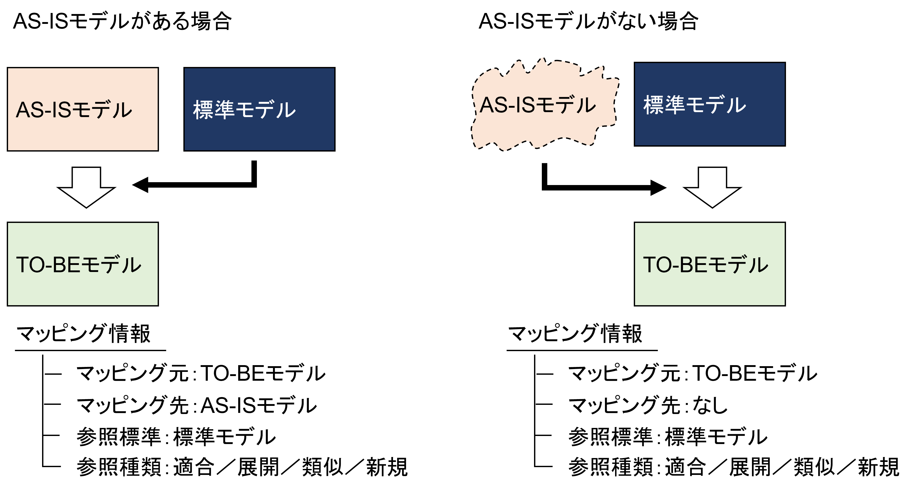

#### AS-ISモデルが定義されている場合
対象となるステークホルダの機能モデルおよび情報モデルの現状がAS-ISモデルとしてまとめられている場合、それらのAS-ISモデルをベースとして新たにTO-BEモデルを生成する。機能モデルおよび情報モデルについて、連携モデルとなるTO-BEモデルを設定する方法を、図 68を用いて手順を追って説明する。

図 68　連携モデルの生成手順（AS-ISモデルあり）
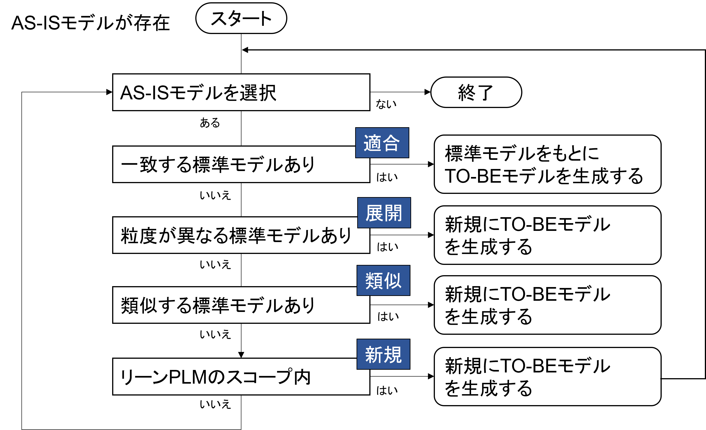

すでにAS-ISモデルとして定義された要素について、それぞれ標準モデルとして定義された内容と比較する。
1. 標準適合：AS-ISモデルで定義された内容に対応する標準モデルが存在する場合、TO-BEモデルとして定義し、マッピング情報として対応する標準モデルを設定する。マッピングの種類は“適合”とする。
2. 標準展開：AS-ISモデルで定義された内容はスコープ内だが参照した標準モデルと粒度が異なる場合、TO-BEモデルに新規に追加し、マッピング情報として新規に追加したモデルを設定する。また、参照した標準モデルはマッピング情報の“展開”として設定する。
3. 標準類似：AS-ISモデルで定義された内容はスコープ内だが参照した標準モデルと意味が異なる場合、TO-BEモデルに新規に追加し、マッピング情報として新規に追加したデータモデルを設定する。また、もっとも意味が近い標準モデルとして、参照した標準モデルは、マッピング情報の“類似”として設定する。
4. 新規追加：AS-ISモデルで定義された内容はスコープ内だが標準モデルに存在しない場合、TO-BEモデルに新規に追加し、マッピング情報として新規に追加したデータモデルを設定する。種類は“新規”となる。
5. 対象なし：AS-ISモデルで定義された内容が本標準仕様のスコープ外である場合、なにもせずに、TO-BEモデルには設定しない。

情報モデルの場合は、それぞれのモデルに対して情報項目が設定されている。したがって、それぞれの情報モデルについて、さらに上記の手順をAS-ISモデルにある情報項目と標準モデルにある情報項目で比較し、TO-BEモデルに設定する。

ここで粒度が異なるというのは、たとえば“設計BOMの管理”と“BOMの管理”の違いなど対象とする範囲が異なる場合をいう。

結果としてTO-BEモデルが生成され、マッピング情報として、マッピング元、マッピング先、参照標準、参照種類が設定される。

#### AS-ISモデルが定義されていない場合
ステークホルダの現状がAS-ISモデルとしてまとめられていない場合、標準モデルとして定義された内容をベースとして、図 69の手順にしたがい、TO-BEモデルを新規に追加する。データモデルの場合は、AS-ISモデルがあることが前提となるので、以下は機能モデルと情報モデルについての手順となる。

図 69　連携モデルの生成手順（AS-ISモデルなし）
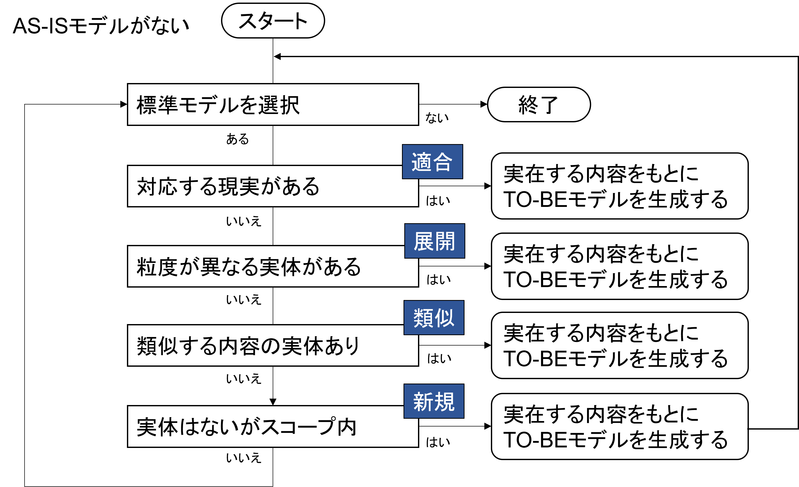

1. 標準適合：標準モデルで定義された内容に該当する情報が実際に存在する場合、TO-BEモデルとして標準モデルの内容を定義する。標準モデルに対するマッピング情報として、追加したTO-BEモデルを設定し、標準モデルとの関係は “適合”とする。
2. 標準展開：標準モデルで定義された内容は実際に存在するが粒度が異なる場合、TO-BEモデルとして新規に追加する。対象とした標準モデルに対するマッピング情報として、新規に追加したTO-BEモデルを設定し、標準モデルとの関係は“展開”とする。
3. 標準類似：標準モデルで定義された内容は実際に存在するが意味が異なる場合、TO-BEモデルとして新規に追加する。対象とした標準モデルに対するマッピング情報として、新規に追加したTO-BEモデルを設定し、標準モデルとの関係は“類似”とする。
4. 新規追加：明示的な情報はないが、AS-ISモデルとして定義すべき内容が標準モデルに存在しない場合、TO-BEモデルとして新規に追加する。マッピング情報として新規に追加したTO-BEモデルを設定し、追加したモデルに最も意味が近い標準モデルを“新規”として定義する。
5. 対象なし：標準モデルで定義された内容に対応するものがAS-ISとして定義すべき機能モデルに存在しない場合、TO-BEモデルは生成しない。対象とした標準モデルに対するマッピング情報には“なし”として設定する。

情報モデルの場合は、それぞれの情報モデルに情報項目を設定する必要があるが、参照する標準モデルがある場合はそれに従い設定するものとし、必要に応じて実際の現状をベースとして暫定的なAS-IS情報モデルを調査しその情報項目を設定する。

## 9.2.	連携用データモデルの定義
データモデルについては、すべてのステークホルダはAS-ISモデルを持つことを前提とする。ただし、連携データモデルであるTO-BEモデルは、基本的に標準モデルをベースとして設定しなければならない。

また、TO-BEデータモデルの定義では、あらかじめ定義されたTO-BE情報モデルおよびそれに対応する標準情報モデルを利用する。連携用データモデルの定義では、データモデルと情報モデルの対応関係とともに、データ属性と情報項目の対応関係が非常に重要となる。

図 70に連携用データモデルの設定に関する全体構成を示す。図の左側がデータモデル、右側が情報モデルである。最終的にAS-ISデータモデルとTO-BEデータモデル、おおびAS-ISデータ属性とTO-BEデータ属性の対応関係を示すことがゴールとなるが、その過程において情報モデルとの対応関係を参考とする。

なお、AS-ISモデルでは、データモデルと情報モデルの対応関係が定義されている場合とそうでない場合があるのに対して、標準モデルでは、本技術仕様によってそれらの関係は明記されている。TO-BEモデルについては、以下の手順にしたがって、データモデルと情報モデル間の関係が定義される。

図 70　連携用データモデルの定義
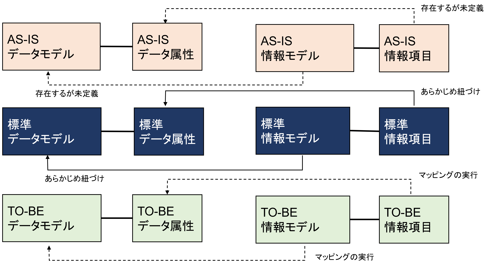

#### 連携データモデルの生成

まず、TO-BE情報モデルについて、以下の手順を事項する。

1. 対象とするTO-BE情報モデル対応する標準情報モデルが存在するかを検索する。
2. 標準情報モデルが存在する場合は、さらに、その標準情報モデルに対して、あらかじめ標準仕様の中で紐づけられた標準データモデルを得る。
3. 標準データモデルに対応するTO-BEデータモデルを新規に設定し、あわせてTO-BEデータ属性も標準データ属性に対応して設定する。
4. 新規に設定されたTO-BEデータモデルとTO-BE情報モデル間を対応づける。

上記2.において、標準情報モデルが存在しない場合は、標準データモデルを直接参照し、TO-BE情報モデルの内容にもっとも近いものを検索する。そこで見つかった場合は、上記3.、4.の手順にしたがってTO-BEデータモデルを設定する。

なお、対応する標準データモデルが見つからなかった場合は、新規にTO-BEデータモデルを設定することになるが、この場合は標準データモデルに対応しないデータモデルとなる。

#### データ属性の設定
データモデル、情報モデルには、それぞれデータ属性と情報項目が定義されている。ここでは情報項目に対応してデータ属性を設定する手順を示す。

1. すべてのTO-BE情報モデルに属するすべてのTO-BE情報項目について、対応する標準情報項目を設定する。ただし、ここで対応づけられたTO-BE情報項目と標準情報項目は、それぞれの親となるTO-BE情報モデルと標準情報モデル間で、あらかじめ対応関係が設定されているものとする。
2. 標準情報項目が存在する場合は、さらに、その標準情報項目に対して、あらかじめ標準仕様の中で紐づけられた標準データ属性を得る。
3. 標準データ属性に対応するTO-BEデータ属性があるか確認し、存在しない場合は新規に設定する。
4. 新規に設定されたTO-BEデータ属性とTO-BE情報項目を対応づける。

上記2において、対象となる標準情報モデルに適当な情報項目が存在しない場合は、標準データ属性を直接参照し、TO-BE情報項目の内容にもっとも近いものを設定することができる。その場合は、上記3、4の手順にしたがってTO-BEデータ属性を設定する。

ただし、ここで参照可能な標準データ属性は、同一のTO-BE情報モデルの情報項目に対して設定された他の標準データ属性と同じデータモデルに属するか、あるいは親となる標準データモデル間で主キーと外部キーによる連結関係が定義されている必要がある。

なお、対応する標準データ属性が見つからなかった場合は、対象となるTO-BEデータモデルに対応する新規のデータ属性として設定する。

#### データ変換方法の定義
最終的に得られるAS-ISデータモデルとTO-BEデータモデル間の関係は、連結方法と変換方法という形で、10章で示す連携用プロファイルとして定義される。

図 71　データ変換方法の定義
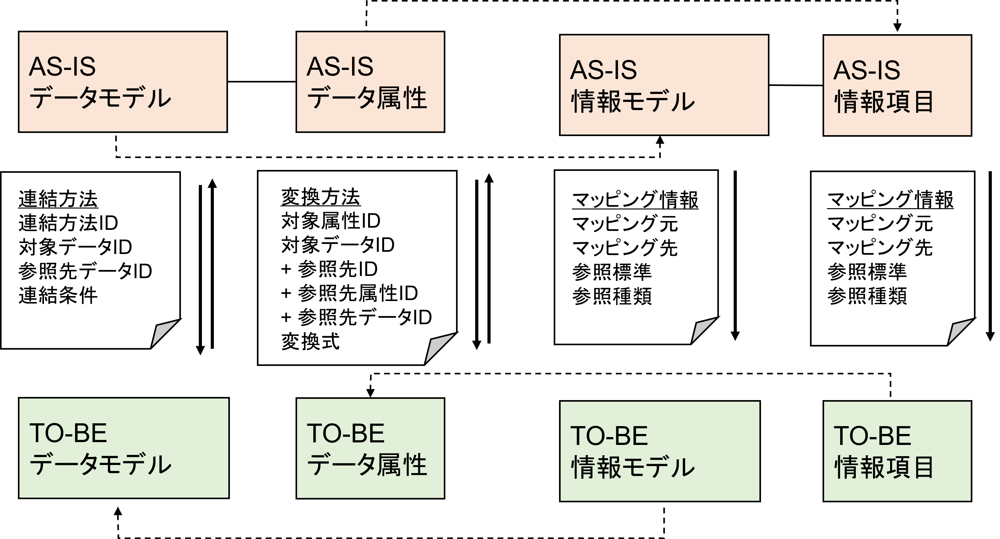
 
実際のデータ内容の変換は、図 71　に示すデータ変換方法の定義による。ここで、データ変換方法は、AS-ISデータモデルとTO-BEデータモデルの間で行うが、どちらからどちらへ変換するかによって方向性がある。

本仕様書では、内容を設定する側のデータモデルを対象データモデル、内容を参照する側のデータモデルを参照先データモデルと呼ぶ。TO-BEデータモデルにAS-ISデータモデルの内容を設定する場合（PUSH）は、参照先データモデルはAS-ISデータモデルとなる。一方、AS-ISデータモデルにTO-BEデータモデルの内容を設定する場合（PULL）は、参照先データモデルはTO-BEモデルとなる。

対象モデルがTO-BEデータモデルであって、データ変換のために必要なデータがAS-ISデータモデル側に存在しない場合は、補助データモデルとしてTO-BEデータモデル側に新たに拡張データモデルおよび拡張データ属性を追加し、これを参照先データモデルに追加することができる。

参照先データモデルにあるデータ属性を用いて、対象データモデルのそれぞれのデータ属性の内容を設定するための定義式および計算手順を記述する。１つのデータの値を計算するために必要な参照先は、複数の異なるデータモデルにまたがった複数のデータである場合がある。計算手順の定義では、一般的な演算の他、レコード単位で行う限定、ソート、転記、集計などがある。


# 10.	連携用プロファイル（normative）
連携用プロファイルは、それぞれのステークホルダが、自社のリーンPLMを本標準にもとづいて表記するためのものである。9.1節で示した本技術仕様の利用手順にしたがい、それぞれのリーンPLMを明示的に表記することで、相互運用が容易となる。

ここで示す連携用プロファイルのためのモデルは、ステークホルダごとにその内容が定義される。標準モデルについては、モデル定義にある８つのモデルのみ定義可能である。これは、別ドキュメント（lplm-schema.json）にて示す。

## 10.1.	モデルの定義
リーンPLMを構成する基本モデルである機能モデル、情報モデル、そしてデータモデルは、以下の構造をもつ。

図 72　モデル定義用のエンティティ
```mermaid
classDiagram
direction RL
class function_model
class information_model
class information_item
class data_model
class data_attribute

information_item --> information_model
data_attribute --> data_model

function_information_deplyment --> function_model
function_information_deplyment --> information_model

information_data_deplyment --> information_model
information_data_deplyment --> data_model

attribute_item_deplyment --> information_item
attribute_item_deplyment --> data_attribute

```

機能モデルは、対象ステークホルダーが持つさまざまな業務の内容を、特定のモノや情報に対応する要求を解決する機能としてまとめたものである。事業者が行うあらゆる行為は、機能として捉えることができる。ただし、機能モデルとして明示的に記述可能な範囲は限定されている。		

表 117　機能モデル（function_model）
| 名称 | 略称 | データ型 | 説明 |
|---|---|---|---|
| id | ID | PK | モデルの識別記号 |
| category | 機能カテゴリ | varchar | カテゴリ名（本仕様で定義した内容から選択する） |
| group_name | 機能グループ | varchar | グループ名（本仕様で定義した内容から選択する） |
| name | 機能名 | varchar | 機能を表す名称 |
| description | 説明 | varchar | 機能の説明 |
| stakeholder_id | ステークホルダID | FK | 記入したステークホルダのID（別途識別コードを設定） |
| created_at | 登録日時 | datetime | 内容を最初に登録した年月日 |
| updated_at | 更新日時 | datetime | 内容を最後に修正した年月日 |
| status | ステータス | varchar | 現在の状態（有効／無効など） |
| note | 備考 | varchar | 管理上のメモなど |

情報モデルは、機能モデルで定義された業務が対象とする情報を表す単位である。業務担当者が行う活動において意思決定を行うために必要な情報項目の一式がまとまって表現されており、情報を構成するそれらの情報項目が空間上でレイアウトされている。

表 118　情報モデル（information_model）
| 名称 | 略称 | データ型 | 説明 |
|---|---|---|---|
| id | ID | PK | モデルの識別記号 |
| category | 情報カテゴリ | varchar | カテゴリ名（本仕様で定義した内容から選択する） |
| group_name | 情報グループ | varchar | グループ名（本仕様で定義した内容から選択する） |
| name | 情報名 | varchar | 情報を表す名称 |
| description | 説明 | varchar | 情報の説明 |
| stakeholder_id | ステークホルダID | FK | 記入したステークホルダのID（別途識別コードを設定） |
| created_at | 登録日時 | datetime | 内容を最初に登録した年月日 |
| updated_at | 更新日時 | datetime | 内容を最後に修正した年月日 |
| status | ステータス | varchar | 現在の状態（有効／無効など） |
| note | 備考 | varchar | 管理上のメモなど |

情報項目は、情報モデルを構成する要素であり、その内容を表現するとともに、業務担当者からの入力を受け付ける単位となる。情報項目の意味は、あらかじめ情報モデルおよびそれに対応する機能モデルから推察することが可能でなければならない。

表 119　情報項目（information_item）
| 名称 | 略称 | データ型 | 説明 |
|---|---|---|---|
| id | ID | PK | 情報項目のユニークID |
| information_model_id | 情報モデルID | FK | 対象となる情報モデルID |
| name | 項目名 | varchar | 情報項目の名称 |
| description | 説明 | varchar | 情報項目の説明 |
| note | 備考 | varchar | 管理上のメモなど |

データモデルは、情報モデルを計算機上で表現するためのデータスキーマにおけるエンティティの単位である。リレーショナルデータベースによる実装ではテーブルに相当する。データモデルは相互に連結する。正規化により、情報モデルの単位とは一対一に対応しないが、データ属性を介して対応づけることができる。

表 120　データモデル（data_model）
| 名称 | 略称 | データ型 | 説明 |
|---|---|---|---|
| id | ID | PK | モデルの識別記号 |
| category | データカテゴリ | varchar | カテゴリ名（本仕様で定義した内容から選択する） |
| group_name | データグループ | varchar | グループ名（本仕様で定義した内容から選択する） |
| name | データ名 | varchar | データを表す名称 |
| description | 説明 | varchar | データの説明 |
| stakeholder_id | ステークホルダID | FK | 記入したステークホルダのID（別途識別コードを設定） |
| created_at | 登録日時 | datetime | 内容を最初に登録した年月日 |
| updated_at | 更新日時 | datetime | 内容を最後に修正した年月日 |
| status | ステータス | varchar | 現在の状態（有効／無効など） |
| note | 備考 | varchar | 管理上のメモなど |

データ属性は、データモデルを構成する要素であり、数値や文字列などで表現された具体的な値をもつことができる。データベース上のフィールドや、キーバリューによって実装される。データ属性は、永続化を前提としたものとするが、情報項目に対応した一時的なものも定義可能である。


表 121　データ属性（data_attribute）
| 名称 | 略称 | データ型 | 説明 |
|---|---|---|---|
| id | ID | PK | データ属性のユニークID |
| data_model_id | データモデルID | FK | 対象となるデータモデルID |
| name | データ属性名 | varchar | データ属性の名称 |
| description | 説明 | varchar | データ属性の説明 |
| note | 備考 | varchar | 管理上のメモなど |


## 10.2.	モデル展開定義

機能情報展開は、機能モデルと情報モデルとの関係を示す。それぞれの機能モデルは、その機能を行う上で情報を利用したり情報を提供したりする。それらの情報が情報モデルとして定義されている場合は、ここでその関係を示す。

表 122　機能情報展開（function_info_deployment）
| 名称 | 略称 | データ型 | 説明 |
|---|---|---|---|
| id | ID | PK | 機能情報展開のユニークID |
| function_model_id | 機能モデルID | FK | 展開元となる機能モデルID |
| information_model_id | 情報モデルID | FK | 展開先となる情報モデルID |
| note | 備考 | varchar | 管理上のメモなど |

情報データ展開は、情報モデルをデータモデルによって表記する場合の対応関係を示す。情報モデルは１つ以上のデータモデルによって構成されている。一方で、データモデルは、０または１つ以上の情報モデルに対応している。なお、１つの情報が複数のデータモデルに対応している場合は、それらのデータモデル間にデータモデル連結による関係が設定されていなければならない。

表 123　情報データ展開（info_data_deployment）
| 名称 | 略称 | データ型 | 説明 |
|---|---|---|---|
| id | ID | PK | 情報データ展開のユニークID |
| information_model_id | 情報モデルID | FK | 展開元となる情報モデルID |
| data_model_id | データモデルID | FK | 展開先となるデータモデルID |
| note | 備考 | varchar | 管理上のメモなど |


項目属性展開は、情報モデルにある情報項目が、どのデータモデルにあるデータ属性に対応しているかを示す。情報項目はかならず１つのデータ属性に対応する。一方、データ属性は、０または１つ以上の情報項目に対応する。

表 124　項目属性展開（attribute_item_deployment）
| 名称 | 略称 | データ型 | 説明 |
|---|---|---|---|
| id | ID | PK | 項目属性展開のユニークID |
| information_item_id | 情報項目ID | FK | 対象となる情報項目ID |
| data_attribute_id | データ属性ID | FK | 対応するデータ属性ID |
| note | 備考 | varchar | 管理上のメモなど |


## 10.3.	マッピング情報
マッピング情報は、それぞれのステークホルダが定義した独自の機能モデル、情報モデル、そしてデータモデルが、本仕様で示す標準モデルとどのように対応しているかを示すものである。ここでは、それぞれのステークホルダのモデルをAS-ISモデル、本技術仕様で示す標準モデルをTO-BEモデルとしている。

図 73　マッピング情報
```mermaid
classDiagram
direction RL
function_model_mapping --> function_model:as-is
function_model_mapping --> function_model:to-be

information_model_mapping --> information_model:as-is
information_model_mapping --> information_model:to-be

data_model_mapping --> data_model:as-is
data_model_mapping --> data_model:to-be

information_item_mapping --> information_item:as-is
information_item_mapping --> information_item:to-be
information_item_mapping --> information_model
information_item --> information_model


data_attribute_mapping --> data_attribute:as-is
data_attribute_mapping --> data_attribute:to-be
data_attribute_mapping --> data_model
data_attribute --> data_model
```
 
機能モデルマッピングは、機能モデルにおけるAS-ISモデルとTO-BEモデルの対応関係を示す。

表 125 機能モデルマッピング(function_model_mapping)
| 名称 | 略称 | データ型 | 説明 |
|---|---|---|---|
| id | ID | PK | 機能モデル対応のユニークID |
| as_is_model_id | AS-IS機能モデルID | FK | 現状業務を表す機能モデルID |
| to_be_model_id | TO-BE機能モデルID | FK | 目標業務を表す機能モデルID |
| standard_model_id | 標準機能モデルID | FK | 対応する標準機能モデルID |
| mapping_type | 対応区分 | varchar | モデル間の対応種別 |
| note | 備考 | varchar | 管理上のメモなど |


情報モデルマッピングは、情報モデルにおけるAS-ISモデルとTO-BEモデルの対応関係を示す。

表 126　情報モデルマッピング（information_model_mapping）
| 名称 | 略称 | データ型 | 説明 |
|---|---|---|---|
| id | ID | PK | 情報モデル対応のユニークID |
| as_is_model_id | AS-IS情報モデルID | FK | 現状業務で利用している情報モデルID |
| to_be_model_id | TO-BE情報モデルID | FK | 目標業務で利用する情報モデルID |
| standard_model_id | 標準情報モデルID | FK | 対応する標準情報モデルID |
| mapping_type | 対応区分 | varchar | モデル間の対応種別 |
| note | 備考 | varchar | 管理上のメモなど |


データモデルマッピングは、データモデルにおけるAS-ISモデルとTO-BEモデルの対応関係を示す。

表 127　データモデルマッピング（data_model_mapping）
| 名称 | 略称 | データ型 | 説明 |
|---|---|---|---|
| id | ID | PK | データモデル対応のユニークID |
| as_is_model_id | AS-ISデータモデルID | FK | 現状システムで利用しているデータモデルID |
| to_be_model_id | TO-BEデータモデルID | FK | 目標システムで利用するデータモデルID |
| standard_model_id | 標準データモデルID | FK | 対応する標準データモデルID |
| mapping_type | 対応区分 | varchar | モデル間の対応種別 |
| note | 備考 | varchar | 管理上のメモなど |

情報項目マッピングは、情報項目におけるAS-ISモデルとTO-BEモデルのマッピングを示す。同一の情報モデルに属する情報項目について、マッピングを介して対応する相手の情報項目が属する情報モデルが同じ場合と異なる場合がある。相手側の情報モデルが異なる場合は、それらの情報モデル間に直接または間接的な関係が定義されていなければならない。

表 128　情報項目マッピング（information_item_mapping）
名称	略称	データ型	説明
| 名称 | 略称 | データ型 | 説明 |
|---|---|---|---|
| id | ID | PK | 情報項目対応のユニークID |
| as_is_model_id | AS-IS情報モデル | FK | 現状業務で利用している情報モデルID |
| as_is_element_id | AS-IS情報項目 | FK | 現状業務で利用している情報項目ID |
| to_be_model_id | TO-BE情報モデル | FK | 目標業務で利用する情報モデルID |
| to_be_element_id | TO-BE情報項目 | FK | 目標業務で利用する情報項目ID |
| mapping_type | 対応区分 | varchar | 項目間の対応種別 |
| note | 備考 | varchar | 管理上のメモなど |

データ属性マッピングは、データ属性におけるAS-ISモデルとTO-BEモデルのマッピングを示す。同一のデータモデルに属するデータ属性について、マッピングを介して対応する相手のデータ属性が属するデータモデルが同じ場合と異なる場合がある。相手側のデータモデルが異なる場合は、それらのデータモデル間に直接または間接的な関係が定義されていなければならない。

表 128　データ属性マッピング（data_attribute_mapping）
| 名称 | 略称 | データ型 | 説明 |
|---|---|---|---|
| id | ID | PK | 情報項目対応のユニークID |
| as_is_model_id | AS-IS情報モデル | FK | 現状業務で利用している情報モデルID |
| as_is_element_id | AS-IS情報項目 | FK | 現状業務で利用している情報項目ID |
| to_be_model_id | TO-BE情報モデル | FK | 目標業務で利用する情報モデルID |
| to_be_element_id | TO-BE情報項目 | FK | 目標業務で利用する情報項目ID |
| mapping_type | 対応区分 | varchar | 項目間の対応種別 |
| note | 備考 | varchar | 管理上のメモなど |


## 10.4.	データ連結とロジック

データモデル連携と演算ロジックは、データモデルの構造と、データモデルがもつデータの値を用いた演算の構造について示す。基本的な構成は以下の３段階となる。

| 定義名 | 構成名 |
|--|--|
| data_link | 参照モデルを決定 |
| data_calculation | 対象属性の計算方法を定義 |
| data_calculation_link | 演算式内で利用する属性を定義 |

#### データモデル連結
データモデル連結は、データモデル間の関係を示す。これは、SQLにおけるJOIN文に相当する。データモデル連結で関係づけることができるのは、１つの定義で高々１つであるが、これを組み合わせることで複数のデータモデルから値を設定することが可能となる。

なお連結の形式としては、対象データモデル側にデータの実体を持たずに連結先のデータモデルの値を常に参照する場合と、対象データモデル側に連結先のデータモデルの値を複製し実体として保持する場合がある。

図 74　データ連結とロジック
```mermaid
classDiagram
direction RL
data_link --> data_model:target
data_link --> data_model:linked

data_attribute --> data_model
data_calculation --> data_attribute:target
data_calculation --> data_model:source
data_calculation --> data_link
```
 
表 130　データモデル連結（data_link）
| 名称 | 略称 | データ型 | 説明 |
|---|---|---|---|
| id | ID | PK | データ連結のユニークID |
| target_model_id | 対象モデルID | FK | 対象となるモデル。連結先から値を取得する。 |
| linked_model_id | 拡張モデルID | FK | 連結先のモデル。転記の場合は参照先となる。 |
| link_type | 拡張種別 | varchar | JOINとして静的に連結する場合と、動的に値を転記する場合がある。 |
| join_key | 連結方法 | varchar | 2つのモデルの連結条件を文字列で指定する。 |
| note | 備考 | varchar | 管理上のメモなど。 |

link_type の候補値は以下がある。

| 値	| 意味 |
|--|--|
| JOIN	| データモデルを静的に連結する。SQL JOIN のような静的なモデル連結 |
| COPY	| 値を動的に転記する。データ変換時に値を取得して転記 |
| LOOKUP	| 参照テーブルとして利用する。マスタ参照 |
| AGGREGATE	| 集計元として利用する。複数レコードを集計 |

#### 演算ロジック

演算ロジックは、対象とするデータ属性の値の計算方法を示す。計算方法は演算式で示され、そこで示された式の構成要素は、参照先データモデルにあるデータ属性の値となる。参照先データモデルは、演算ロジックリンクを用いることで複数のデータモデルを設定することができる。

表 131　演算ロジック（data_calculation）
| 名称 | 略称 | データ型 | 説明 |
|---|---|---|---|
| id | ID | PK | データ変換方法のユニークID |
| target_attribute_id | 対象属性ID | FK | 値を設定する対象属性ID |
| source_model_id | 参照先データモデルID | FK | 演算対象となる参照先データモデルID |
| calculation_type | 演算種別 | varchar | 転記、集計、マージ、限定、演算のいずれか |
| condition | 条件式 | varchar | 演算の前提となる対象データを限定する |
| expression | 演算式 | varchar | 演算内容や条件式を記述する |
| note | 備考 | varchar | 管理上のメモなど |

以下の表に、calculation_typeとして、属性の値を計算するため利用可能な演算の種類やその実装方法について示す。


| 値         | 日本語 | 説明                                                   |
| --------- | --- | ---------------------------------------------------- |
| COPY      | 転記  | 検索条件を指定して参照先データモデルの特定レコードを選択し、そのデータ属性の値を設定する。        |
| AGGREGATE | 集計  | 検索条件に該当する参照先データモデルの複数レコードを対象として、指定したデータ属性の値を集計する。    |
| MERGE     | マージ | 検索条件を指定して参照先データモデルの特定レコードを選択し、対象データに追加する。            |
| FILTER    | 限定  | 演算で用いる参照先データモデルについて、検索条件を指定して該当するデータを選択する。           |
| CALCULATE | 演算  | 参照先データモデルで選択されているレコードのデータ属性の値を用いて、あらかじめ定義された演算を実行する。 |

calculation_typeがAGGREGATEの場合はexpressionに記述された計算式に従って対象属性の値を計算する。

| expression                   | 意味        |
| ---------------- | --------- |
| COPY               | 数量をそのまま転記 |
| SUM               | 数量を集計     |
| AVG                    | 平均値       |
| MAX             | 最大値       |

calculation_typeがCALCULATEの場合はexpressionに記述された計算式に従って、対象データモデルのデータに内で対象属性の値を計算する。

記述例
```source
 生産オーダ.原価 = 生産数量 × 標準単価
```

### 演算ロジックリンク
演算ロジックリンクは、演算ロジックで定義された演算式に基づいて演算する場合に、対象となる参照先データモデルが複数の場合に、それらを連結するためのデータモデル連結を指定する。たとえば、A = B + Cという演算を行うにあたって、A、B、CがそれぞれData-01、Data-01、Data-02に属しているとすると、この演算を実行するにはData-01とData-02を関係付けておく必要がある。 

表 132　演算ロジックリンク（data_calculation_link）
| 名称 | 略称 | データ型 | 説明 |
|---|---|---|---|
| id | ID | PK | データ変換参照のユニークID |
| data_calculation_id | 演算ロジックID | FK | 対応する演算ロジックID |
| data_link_id | データモデル連結ID | FK | 演算で利用するデータモデル連結ID |
| note | 備考 | varchar | 管理上のメモなど |

## 10.5.	KPIモデル
ステークホルダとしての製造業の事業所や、ソリューション企業のリーンPLMに関する個々のソリューションについて、中立的な立場からそれらのシステム連携能力のレベルを評価するために、データ適合性、データ充足性、データ信頼性という３つのKPIを設定する。これらの指標は、データモデルの内容を受け取る側（PULL）、すなわちユーザ側となるステークホルダの場合と、データを提供する側（PUSH）となるステークホルダの場合について、それぞれ計算することになるが、一方が他方のパフォーマンスに影響を与えないように、中間に位置する標準モデルのレイアで分割し、それぞれの側ごとに独立して評価する。

### データ適合性
データの適合性は、対象とするAS-ISデータモデルAを、9.1節の手順にしたがってTO-BEデータモデルA*に変換する場合に、

1. AS-ISデータモデルAに対応するTO-BEデータモデルA*が存在し、
2. AS-ISデータモデルAがもつ必須のデータ属性のすべてが、A*のデータ属性として定義されている

ものの割合で示す。また、PULL型として、標準モデルをベースとしたTO-BEデータモデルから、AS-ISデータモデル側にデータを取得する場合も同様となる。

カウントする対象は、AS-IS側で情報モデルの視点からカウントする。すなわち、AS-IS情報モデルを構成するデータモデルのすべてをデータ適合性の調査対象とし、それ以外は対象から除外する。

### データ充足性
データの充足性とは、ステークホルダに実装されたAS-ISデータモデルについて、その内容を設定するにあたり、同等の内容を再現するために理論的に必要となるすべてのデータモデルの内容が、一回のトランザクションで伝達できる割合を示す。

たとえば、PUSH型のユースケースにおいて、AS-ISデータモデルA*を相手が要求している場合、対応するAS-ISデータモデルAのみでは内容が充足しないときでも、図(a)のようにデータモデルBを連結させることで、内容を100%充足できる。

一方で、現実的には、図(b)のように、データモデルA*を構成するために必要なデータモデルBを、事前または事後に伝送したうえで、ユーザ側で再構成する場合もある。この場合は充足性の計算対象とはならない。

データ充足性の計算は、データ属性単位で調査する。データ充足率はデータモデルごとに設定可能であり、同時にステークホルダ全体としてのデータ充足性は、それらのデータ充足率の加重平均することで明らかにする。
 
 
### データ信頼性
データの信頼性は、データモデルごとに、データ属性のレベルで、その値を設定するために必要十分なデータ属性が存在するかどうかの割合を示す。データ信頼性は、対象データモデルごと、あるいは事業所ごとに求めることができる。対象データモデルが同じでも、データ信頼性の値はPUSH型とPULL型で異なる。

該当するデータ属性がない場合は、TO-BEデータモデル側の属性として追加する必要があるが、それを実施しない場合は欠損扱いとなり、信頼性が低下する。なお、欠損としてカウントされる属性には、それぞれに定義されたデフォルト値を設定する。

調査対象のデータ属性について、その値を設定するためのデータ属性が参照側のデータモデル上に存在し、データ信頼性の計算上カウントされるためには、

1. 対象となるデータモデルの各属性に、参照側のデータモデルの属性が割り当てられており、
2. 対象となるデータ属性の値に対して計算ロジックが定義され、さらにそのロジック内で参照されるデータ属性の値が取得可能であることが条件となる。

なお、データ属性の値を計算するために設けた拡張データモデルや拡張データ属性は、対応する情報モデルや情報項目に対応しており、存在しない場合は新たに生成するものとし、それができない場合は、信頼性のカウントから除外する。

# 11.	準拠と認証（normative）
企業、団体、または個人が行うものづくり全般、あるいは提供する製品またはサービスは、以下の要件をすべて満たす場合、本技術仕様に準拠しているということができる。

1.	本技術仕様のスコープ内の製品またはサービスであること
2.	製品またはサービスを説明する用語が、本技術仕様で定義された用語と対応づけられていること。
3.	製品またはサービスが、本技術仕様で定義された機能および情報に対応づけて説明されていること。
4.	その他、本技術仕様の中で明示的に規定しているルールに違反がなく、その運用によって利用者に甚大な損害を与える恐れがないこと。

また、企業または個人が提供する製品またはサービスは、上記４つの要件に加えて、以下の要件を満たすことが、IVIが提供する認証プロセスによって認められた場合、本技術仕様に準拠していることをIVIが認証する。

1.	機能モデル、情報モデル、そしてデータモデルを本技術仕様の9章で示す連携用プロファイルとして記述し、その内容をIVIに提出し、その内容に不備がないこと。
2.	提出した連携用プロファイルに対応したテスト環境を構築し、３件以上のサンプルデータを用いた認証試験において仕様どおりの結果が得られることが確認できること。なお、認証試験の方法や基準は、付属文書にて規程する。
3.	設計と製造の双方向の連携のため、定期的にあるべき姿としてのシステム実装を見直し、業務のしくみや提供する製品またはサービスの付加価値を向上させる取組みを続けていること。

