Technical Specification　IVI-TS-LPLM-2026-02


# Lean PLM for Manufacturing Innovation
Lean Product Lifecycle Management for Manufacturing Innovation 


Ver1.0 Public Review Edition R4

Industrial Value Chain Initiative (General Incorporated Association)

 
#### Copyright and License Terms
The copyright of this specification is held by the Industrial Value Chain Initiative (General Incorporated Association). The copyright holder permits the use, reproduction, and redistribution of this specification, whether for commercial purposes or not, within the scope of the purpose and scope described in this specification. Modification of the content of this specification requires the written permission of the copyright holder, except in cases where it is necessary to address individual cases.

Without the permission of the copyright holder, individually modified content of this specification may not be disclosed to an unspecified number of people. When modifying the content of this specification to address an individual case, the copyright notice regarding this data model must not be deleted, and the content of these terms of use must be carried over.
The copyright holder does not guarantee the operation of any system that implements content related to this specification. Furthermore, the copyright holder assumes no responsibility, whether direct or indirect, for any damages arising from the use or non-use of the content of this specification.

#### Revision History

| Version | Date | Content | Updated by |
| ------- | ---------- | ---------------- | ---- |
| v01_d01 | 2025/07/07 | First edition (pre-distributed for kickoff meeting) | Yasuyuki Nishioka |
| v01_d02 | 2025/11/13 | Pre-distributed for 5th meeting | Yasuyuki Nishioka |
| v01_d03 | 2025/12/10 | Material for 6th meeting | Yasuyuki Nishioka |
| v01_d04 | 2026/01/08 | Material for 7th meeting | Yasuyuki Nishioka |
| v01_d05 | 2026/01/18 | Draft for internal IVI review | Yasuyuki Nishioka |
| v01_d06 | 2026/02/12 | Material for 8th meeting | Yasuyuki Nishioka |
| v01_d07 | 2026/02/19 | For internal IVI review | Yasuyuki Nishioka |
| v01_d08 | 2026/03/09 | Public review draft | Yasuyuki Nishioka |
| v01_PR  | 2026/03/12 | Public review edition | Yasuyuki Nishioka |
| v01_PR1 | 2026/03/16 | Public review edition (revision 1) | Yasuyuki Nishioka |
| v01_PR2 | 2026/03/19 | Circulated at 10th Task Force meeting | Yasuyuki Nishioka |
| v01_PR3 | 2026/04/15 | Revised for Hannover Messe announcement | Yasuyuki Nishioka |
| v01_PR4 | 2026/05/14 | Partially revised in conjunction with the English edition | Yasuyuki Nishioka |


 
 
#### Changes in PR4 (technical content)
1) As a data model, the Operation Process has been removed. It has been simplified to Production Process and Equipment Process.
2) As information models, the following five have been removed: Equipment Plan Table, Personnel Plan Table, Procurement Cost Table, Sales Cost Table, and Inspection Procedure Document. The total is now 50.
3) BOA has been moved from the Structure Information group to the Linkage Information group.
4) The definition of the data model has been separated out as its own specification. This specification shows only diagrams illustrating part of its structure and relational configuration.

Members and Contributors

#### Voting Member Companies (CIOF Partner Companies)
ABeam Consulting Ltd.
ABeam Systems Ltd.
ApstoWeb Ltd.
Brother Industries, Ltd.
Business Engineering Corporation
EY Strategy and Consulting Co., Ltd.
FUJI ELECTRIC CO., LTD.
Mazda Motor Corporation
Mitsubishi Electric Corporation
NEC Corporation
YASKAWA Electric Corporation

Task Force Member Companies
ABeam Systems Ltd.
ApstoWeb Ltd.
Brother Industries, Ltd.
Business Engineering Corporation
CIMTOPS Corporation
DENSO CORPORATION
DENTSU SOKEN INC.
DIGITAL PROCESS LTD.
EY Strategy and Consulting Co., Ltd.
FUJI ELECTRIC CO., LTD.
Hewlett Packard Japan, G.K..
Honda Motor Co., Ltd.
JMA Consultants Inc.
K.T.System Co., Ltd.
Mazda Motor Corporation
Misuzu Industries Corporation
Mitsubishi Electric Corporation
NEC Corporation
LeimacLtd.
YKK AP Inc.
Zuken PreSight Inc.

#### Editor
Yasuyuki Nishioka (Industrial Value Chain Initiative / Hosei University)

#### Contributors　
Akihito Ito
Akihiro Suyama
Atsushi Inagaki
Eiji Matsuda
Haruhiko Shimizu
Hidekazu Takeuchi
Hiroshi Tozuka
Hiroyuki Nishiyama
Hisashi Tsunashima
Katsuhiro Iyoda
Kazuma Kitayama
Keisuke Shimizu
Keita Koshii
Kohei Sugaya
Koki Miura
Masanari Ukai
Masaru Wakabayashi
Mitsutoshi Oshita
Morikatsu Kinoshita
Motohiko Yamashita
Nobuyuki Ogura
Ryoichi Higuchi
Ryuta Mokuda
Seiichiro Wada
Shinichiro Chino
Shinjiro Yamazaki
Shintaro Nemoto
Shoji Nemoto
Takamichi Kojima
Takamichi Mori
Tatsuya Umemoto
Toshiki Kitamori
Yoshiaki Nishimura
Yoshinobu Kumagai
Yoshitsugu Tanaka
Yuya Otake
 
#### Table of Contents
- [1. Purpose of this Specification](#1-本仕様の目的)
- [2. Scope](#2-スコープ)
- [3. Terminology (normative)](#3-用語normative)
- [4. References](#4-参考図書)
- [5. How to Use this Technical Specification](#5-技術仕様の利用方法)
  - [5.1. Structure of the Standard Model](#51-標準モデルの構成)
  - [5.2. Use Cases for the Standard Specification](#52-標準仕様のユースケース)
  - [5.3. Mechanisms for Interoperability](#53-相互運用のためのしくみ)
- [6. Function Model (normative)](#6-機能モデルnormative)
  - [6.1. Product Design](#61-製品設計)
  - [6.2. Process Design](#62-工程設計)
  - [6.3. Production Preparation](#63-生産準備)
  - [6.4. Production Management](#64-生産管理)
  - [6.5. Plant Operations](#65-工場運営)
- [7. Information Model (normative)](#7-情報モデルnormative)
  - [7.1. Planning Information](#71-企画情報)
  - [7.2. Development Information](#72-開発情報)
  - [7.3. Technical Information](#73-技術情報)
  - [7.4. Management Information](#74-管理情報)
  - [7.5. Shop-floor Information](#75-現場情報)
- [8. Data Model (normative)](#8-データモデルnormative)
  - [8.1. List of Data Models](#81-データモデル一覧)
  - [8.2. Business Entity](#82-事業者)
  - [8.3. Assets](#83-アセット)
  - [8.4. Production Items](#84-生産品目)
  - [8.5. Equipment](#85-設備)
  - [8.6. Workers](#86-作業者)
  - [8.7. Production Process](#87-生産工程)
  - [8.8. Equipment Process](#88-設備工程)
  - [8.9. Operation Process](#89-作業工程)
  - [8.10. Plan Management](#810-計画管理)
- [9. System Integration Procedure (normative)](#9-システム統合手順normative)
  - [9.1. Basic Procedure for Defining the Integration Model](#91-連携モデル定義の基本手順)
  - [9.2. Defining the Data Model for Integration](#92-連携用データモデルの定義)
- [10. Integration Profile (normative)](#10-連携用プロファイルnormative)
  - [10.1. Model Definition](#101-モデルの定義)
  - [10.2. Model Deployment Definition](#102-モデル展開定義)
  - [10.3. Mapping Information](#103-マッピング情報)
  - [10.4. Data Linking and Logic](#104-データ連結とロジック)
  - [10.5. KPI Model](#105-kpiモデル)
- [11. Compliance and Certification (normative)](#11-準拠と認証normative)

 
<a id="1-本仕様の目的"></a>
# 1. Purpose of this Specification
In this technical specification, Lean PLM is defined as the effort to synchronize the cycle of structural change and evolution of the manufacturing-side mechanisms — production equipment, plants, and the people involved with them — with the lifecycle of the product, thereby realizing a more agile and sustainable DX for the manufacturing industry.

In a business environment characterized by rapid change and high uncertainty, it is effective for further strengthening the competitiveness of manufacturing to advance product development quickly and flexibly with the design site and the production site working as one. In Lean PLM, product design, process design, and the design of factory equipment and production lines, together with the production management and plant operations needed to embody these as products or services, can be carried out in an integrated manner by making the notations of the related function model, information model, and data model mutually convertible.

This technical specification defines standard models for describing the various operations related to Lean PLM. Using the standard models defined here, it presents procedures and description formats that allow each stakeholder to describe their target operations according to their own differing circumstances.

Content described by each stakeholder in accordance with this technical specification is used so that one stakeholder can collaborate with another. That is, one stakeholder translates its target operations into the standard model and presents it to its collaboration partner, while the other stakeholder translates the content received as the standard model into its own business model.
In many business software applications, this data conversion process is automated as an inter-system interface; engineers can reduce development effort and shorten the schedule by making use of information described in accordance with this technical specification.

The purpose of this technical specification is to shorten such engineering effort and enable inter-system collaboration at lower cost, while also, by reconsidering matters back at the level of the information model and function model, discovering more effective information flows than before and increasing the number of cases that lead to new implementations. Through such accumulated efforts, this specification contributes to the realization of Lean PLM.

#### Intended Readers
This technical specification assumes the following readers:
-	Those within manufacturing companies who are involved in the planning, development, and operation of information systems
-	Those within manufacturing companies or related companies who are involved in building information systems
-	Those who provide consulting on business reform or information systems in manufacturing
-	Managers or engineers engaged in the planning, development, or operation of business software for manufacturing
-	Staff of public institutions involved in policy-making related to improving the competitiveness of manufacturing
-	Experts and researchers knowledgeable about standard specifications or standardization processes in the manufacturing field

<a id="2-スコープ"></a>
# 2. Scope
This technical specification presents a model for capturing, in an integrated manner rather than as a one-way flow from design to manufacturing, the mutual dependencies among design activities within the manufacturing value chain — in particular product design, process design, and the design of equipment and production lines. It focuses on the flow of process design and equipment design corresponding to product design, as well as on the flow of process design that can accommodate a given equipment design, and further of product design that can be accommodated by a given process design, thereby enabling such bidirectional design work to be linked together while incorporating past track record and actual circumstances.

The manufacturing industries targeted are primarily discrete-type industries with machining and assembly processes. With respect to the market, the focus is mainly on repetitive, high-volume mass production; however, engineer-to-order production and made-to-order design-and-build are also included within the scope of this specification, insofar as core parts, modules, or production processes are reused repeatedly. In terms of position within the supply chain, the scope covers not only downstream finished-goods manufacturers but also upstream parts manufacturers, and covers companies ranging from large enterprises to mid-sized and small/medium enterprises. Fabless companies without their own plants are also included.

Design work in this technical specification defines the structure of the product being produced as the BOM, the structure of the plant that produces it as the BOA, and the structure of the processes that relate the two as the BOP, and it attempts to capture these within as common a framework as possible. Note that the details of data models handled by CAD/CAM/CAE and similar software, and the details of individual business logic, are outside the scope.

At the same time, this technical specification addresses the mechanism by which, when the product structure information (BOM) is related to the plant structure information (BOA) via the process structure information (BOP), the operations on the model (cyber space) are related to their corresponding realities in the physical world (physical space), managing these together as a cyber-physical system. For this reason, the scope also includes the general data models handled by Manufacturing Execution Systems (MES), which deal with instances in an actual plant, and by Computerized Maintenance Management Systems (CMMS), among others.

<a id="3-用語normative"></a>
# 3. Terminology (normative)
#### Abbreviations
BOA		Bill of Assets

BOM		Bill of Materials

BOP		Bill of Process

CAD		Computer Aided Design

CAE		Computer Aided Engineering

CAM		Computer Aided Manufacturing

CRM		Customer Relationship Management

ERP		Enterprise Resource Planning

FMEA		Failure Mode and Effects Analysis

FTA		Fault Tree Analysis

LCA		Life Cycle Assessment

MBSE		Model-Based Systems Engineering

CMMS		Computerized Maintenance Management System

MES		Manufacturing Execution System

MOM		Manufacturing Operations Management

PLM 		Product Lifecycle Management

QFD		Quality Function Deployment

#### Terminology
##### AS-IS Model
A model that represents and expresses the current situation as-is. In this technical specification there are an AS-IS function model, AS-IS information model, and AS-IS data model.
##### BOM (Bill of Materials)
A hierarchical structure table representing the parts and materials that make up a product; it is foundational information for design, manufacturing, procurement, and cost management.
##### BOA (Bill of Assets)
Data representing the structure, capability, and hierarchy of the assets — equipment, manufacturing resources, jigs and tools — that make up a plant or production line; it is production-environment information that executes the process structure (BOP).
##### BOP (Bill of Process)
A structure table that hierarchically defines the sequence, work content, conditions, and man-hours in a product's manufacturing processes; it is information that deploys the product structure (BOM) into an actual production process.
##### CMMS (Computerized Maintenance Management System)
An information system that manages equipment/machinery maintenance operations. It records and manages inspection plans, maintenance work orders, failure history, and parts inventory, and helps understand equipment condition.
##### CRM (Customer Relationship Management)
A mechanism that centrally manages customer information, touch-point history, and purchase/inquiry history, linking sales, marketing, and service to improve customer satisfaction and value.
##### E-BOM (Engineering BOM)
A design-perspective BOM created by the design department, reflecting functional structure and design intent, and managed in conjunction with drawings and CAD.
##### ERP (Enterprise Resource Planning)
A system that integrally manages a company's core operations such as finance, HR, production planning, supplier management, and sales, supporting the optimization of management resources and the efficiency of business operations.
##### FMEA (Failure Mode and Effects Analysis)
A quality method that systematically analyzes failure modes and their effects/causes using severity, occurrence frequency, and detection difficulty, so as to prevent risks latent in design or processes.
##### FTA (Fault Tree Analysis)
A method that logically decomposes the causes of system defects or accidents and visualizes the relationships among causes in a tree structure; used for identifying potential risks and formulating preventive measures.
##### MBSE (Model-Based Systems Engineering)
A systems engineering method that models functions, structure, and other aspects in the design and development of complex products or systems, enabling consistent examination throughout.
##### M-BOM (Manufacturing BOM)
A BOM that reflects the manufacturing/assembly sequence and the structure at the process level; it is the basis for work instructions, process management, and cost calculation.
##### MOM (Manufacturing Operations Management)
A manufacturing management framework that integrally manages the planning, execution, progress, quality, equipment, and results of the shop floor, supporting QCD optimization and shop-floor improvement.
##### MFCA (Material Flow Cost Accounting)
A management method that visualizes the flow of materials and energy in the manufacturing process and grasps cost by separating it into product and loss, thereby promoting improved resource efficiency and cost reduction.
##### MES (Manufacturing Execution System)
A system that manages and monitors production activities on the shop floor in real time, integrally capturing production instructions, resource allocation, process progress, and quality data.
##### PLM (Product Lifecycle Management)
A mechanism that centrally manages information across a product's entire lifecycle, from planning through design, manufacturing, maintenance, and disposal, realizing cross-departmental collaboration and improved quality/development efficiency.
##### Product LCA (Product Life Cycle Assessment)
A method that evaluates, per product unit, the environmental burden of a specific product from raw-material procurement through manufacturing, use, and disposal; used for design comparison, environmentally conscious design, carbon footprint calculation, and the like.
##### QFD (Quality Function Deployment)
A method for deploying customer requirements into design specifications and technical characteristics, using a quality table to support building in customer value.
##### S-BOM (Service BOM)
A BOM organized from a maintenance/service perspective, organizing replacement parts and consumables to support after-sales service operations.
##### Stakeholder
A business unit or department of a manufacturing company that actually carries out the target operations in real business, or software developed as a solution for such operations.
##### TO-BE Model
A model showing the goal of a development project as the desired future state. In this technical specification there are a TO-BE function model, TO-BE information model, and TO-BE data model.


<a id="4-参考図書"></a>
# 4. References
- IEC 62264-1:2023, Enterprise-control system integration - Part 1: Models and terminology
- IEC 62204-3:2016, Enterprise-control system integration - Part 3: Activity models of manufacturing operations management
- IEC 63278-1, Asset Administration Shell for industrial applications - Part 1: Asset Administration Shell structure
- IEC 63339:2024, Unified reference model for smart manufacturing
- IEC TR 63319-2025, A meta-modelling analysis approach to smart manufacturing reference models
- prostep ivip Recommendation, Bridging the Gap – Seamless Information Transfer in Production Environments, PLiM 2021-12 / PSI26, V1.0
- IVRA-Next, Industrial Value Chain Initiative, 2018, (https://iv-i.org)
- PSLX4.0 Technical Specification, Industrial Value Chain Initiative, 2025


<a id="5-技術仕様の利用方法"></a>
# 5. How to Use this Technical Specification
<a id="51-標準モデルの構成"></a>
## 5.1. Structure of the Standard Model
One goal of this technical specification is that the target operations of Lean PLM held by different stakeholders — or parts thereof — will have their respective functions collaborate with one another, in the form of exchanging the data they handle with other stakeholders.

Here, a stakeholder is an entity that shares interests or values, and is the unit — a business division, department, or plant of a manufacturing company — that practices, as the business party, the operations corresponding to Lean PLM on a daily basis. For a company that provides an information system as a solution, the unit of the solution is defined as the stakeholder. Also, even for the same company or solution, if its structure or the assumed environment changes significantly, each generation can be treated as a separate stakeholder.

The definition of a stakeholder uses the standard model. In this technical specification, the standard model is what results from extracting, organizing, and summarizing the common elements — each of which otherwise differs entirely — among the functions of the actual business operations targeted by Lean PLM, the information used therein, and the data that is processed there. In this technical specification, a function model, information model, and data model related to Lean PLM are defined.

##### Function Model
The function model shows the content of what a business operation does, in a form that maps it to its task, purpose, and outcome. The granularity when defining a function is the range that can be handled by a person in charge or by a department; collaboration between operations is via a state change corresponding to the deliverable that is its output, or to its involvement with the external environment.
##### Information Model
The information model is the unit of input or output needed for the units of function defined in the function model to collaborate with one another. In a situation where information is needed, the unit that is presented or exchanged — a screen or a form — is that unit. The person or department in charge of a function defined in the function model interprets the information shown corresponding to the information model, and updates its content or newly sets other information.
##### Data Model
The data model shows the format and rules for expressing, using digital technology, the information corresponding to the information model. A data model is defined by entities, the units representing data, and the relations among them; furthermore, one or more attributes are defined for each entity. The content of information is ultimately shown entirely by the values of the attributes held by the entities in the data model.

Figure 1 shows the relationship among these three kinds of models and the stakeholders. When both stakeholders are, say, a manufacturer and a supplier with a trading relationship in manufacturing, whereas collaboration traditionally took place between information models recognizable by the people in charge — such as slips and forms — DX makes collaboration possible at the level of the data model, which not only raises business efficiency but also dramatically improves flexibility and reliability.

Figure 1　Relationship among Stakeholders
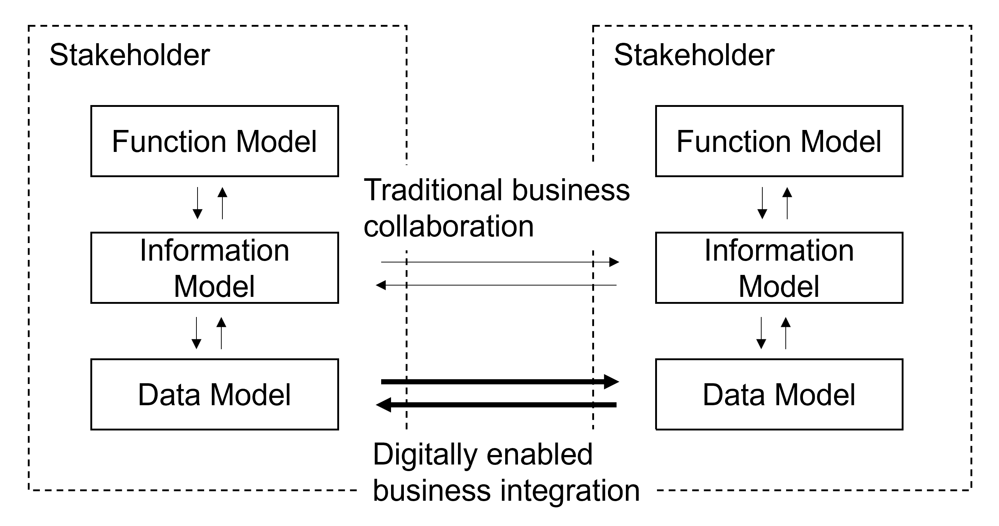

<a id="52-標準仕様のユースケース"></a>
## 5.2. Use Cases for the Standard Specification
As shown in Figure 2, four use cases can be envisioned for using this standard: data collaboration between companies, consolidation of enterprise systems, implementation of external solutions, and data collaboration between systems. Each use case can be organized as in the table below, according to the kinds of stakeholders that are collaborating.

Table 1　Structure of the Use Cases

No.	Use Case Name	Stakeholder 1	Stakeholder 2
1	Data collaboration between companies	Manufacturing company	Manufacturing company (another company)
2	Consolidation of enterprise systems	Manufacturing company	Manufacturing company (own company)
3	Implementation of an external solution	Solution	Manufacturing company
4	Data collaboration between systems	Solution	Solution

Figure 2　Use Cases of the Technical Specification
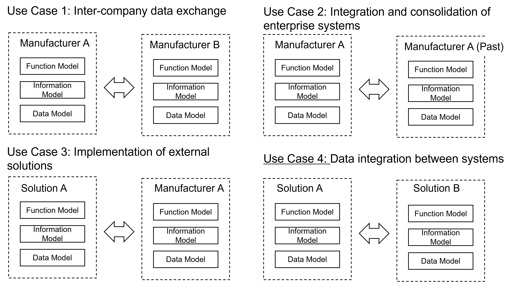

#### Data Collaboration between Companies
Use case 1 is data collaboration between companies. This corresponds to the case in which the collaborating stakeholders are different companies conducting business by linking their respective operations. It is handled at a level corresponding to information models such as slips, and there may be no collaboration corresponding to the data model.
#### Consolidation of Enterprise Systems
Use case 2 corresponds to a case in which a company renews its internal information systems, or reconfigures its information systems due to the consolidation of departments. The typical in-house DX project — in which a TO-BE model, viewed from the perspective of the whole company, is set based on the function model, and the existing AS-IS information model and AS-IS data model are rebuilt accordingly — corresponds to this case.
#### Implementation of an External Solution
Use case 3 corresponds to the case in which, when a company builds an information system, it adopts a package product owned by a solution company. A solution package owned by a solution company has, as software, a data model premised on a function model and information model assumed in advance. In this case, the correspondence between the available solution and the company to which it will be provided is examined, leading to the implementation of the information system.
#### Data Collaboration between Systems
Use case 4 is a case in which system integration is carried out between solutions owned by a solution company, or between all or part of the information systems that a user company such as a manufacturer operates as legacy systems. This corresponds to cases such as when a developing company integrates different solutions to provide to a user company, or performs data collaboration with an already-implemented information system. These are activities carried out daily at many system integration sites.

<a id="53-相互運用のためのしくみ"></a>
## 5.3. Mechanisms for Interoperability
To apply this standard to each use case and achieve interoperability of models between two different stakeholders, the approach taken is to first clarify the correspondence between each stakeholder and the standard model, and then integrate them.

For example, to link stakeholder A and stakeholder B, one method is to place the standard model in between: link stakeholder A with the standard model, and then link the standard model with stakeholder B. As needed, this process can be integrated and automated as a system to improve efficiency.

As shown in Figure 3, correspondences can be defined between a stakeholder and the standard model for each of the function model, information model, and data model. For the data model, conversion procedures can be defined from the stakeholder to the standard model, or from the standard model to the stakeholder.

Figure 3　Model Correspondence and Conversion Procedure
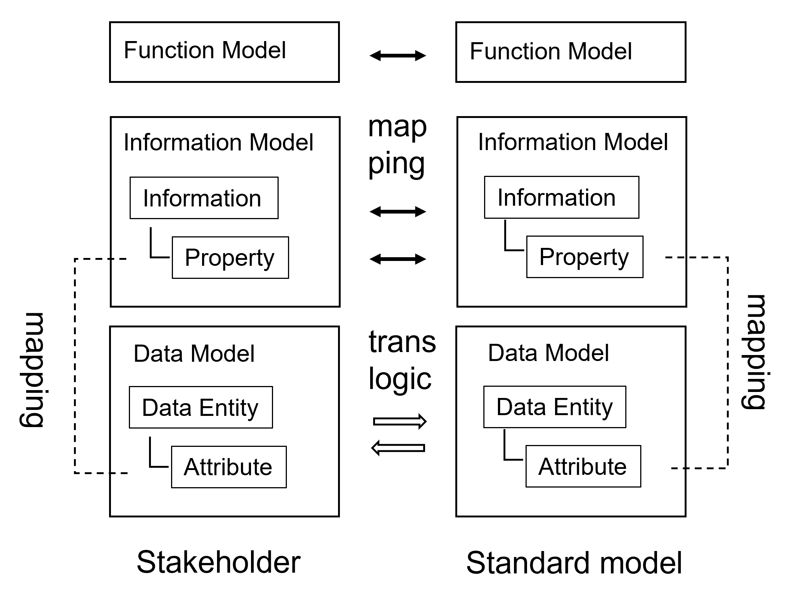

 
When defining a conversion procedure between a stakeholder and the standard model, for the data model there is a directionality of PUSH or PULL. To achieve interoperability of the data model between different stakeholders, the PUSH conversion procedure at one stakeholder and the PULL conversion procedure at the other stakeholder are integrated.

Figure 4　Directionality and Integration of Conversion Procedures
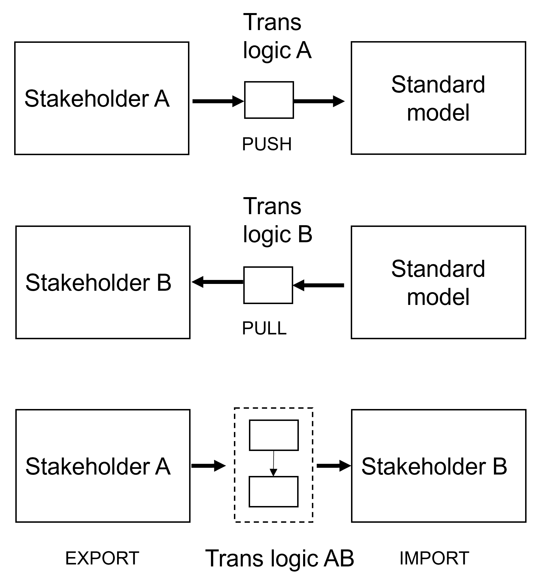
 
For example, in Figure 4, stakeholder A's model is mapped to the standard model, and further, for the data model, the procedure for converting stakeholder A's model into the standard model is clarified. Likewise, by clarifying the procedure for converting stakeholder B's data model into the standard model, it becomes possible to convert the content of the data model from stakeholder A to stakeholder B.

Here, the information about conversion procedure A, which maps stakeholder A's AS-IS model to the standard model, is called the integration profile. An integration profile is defined for each stakeholder's target operation or target system. Accordingly, in the example of Figure 4, there are integration profile A and integration profile B.
Chapter 9 shows the specification for how a stakeholder actually uses the standard model to define a TO-BE model for collaboration and uses its content as a profile.

To socially implement this technical specification, a platform is needed by which a third-party organization certifies the content of these integration profiles, archives and manages them, and enables the parties in a collaboration to exchange profiles that are secure and trust-certified.

<a id="6-機能モデルnormative"></a>
# 6. Function Model (normative)
The operations in manufacturing targeted by Lean PLM are modeled from the perspective of function. In defining a function, there are three levels of granularity: the Function Element, which is the granularity of activity at which a person in charge actually performs some operation on a thing or on information; the Function Group, which is the granularity used when an organization collectively manages such function elements as a unit of business; and the Function Category, which is the granularity used to take a bird's-eye view of function groups within the company-wide engineering chain.

Here, the function category can be regarded as a major classification, and there are function categories such as Product Design, Process Design, Production Preparation, Production Management, and Equipment Maintenance. On the other hand, the function group is a medium classification and is included in one of the function categories. For example, in Figure 5, three function groups — Functional Design, Structural Design, and Cost Design — are defined for the function category of Product Design. Note that one or more function elements are defined for each function group. These are summarized in a table for each function group.

The function element, which is the minor classification, shows the business content of a function group, and is defined by operations on things and information. In principle, "things" use what is defined in the glossary, and "information" refers to what is defined in the information model. A function element is also mapped to the person in charge who is the actor carrying out that function.

Figure 5　Functions of Lean PLM
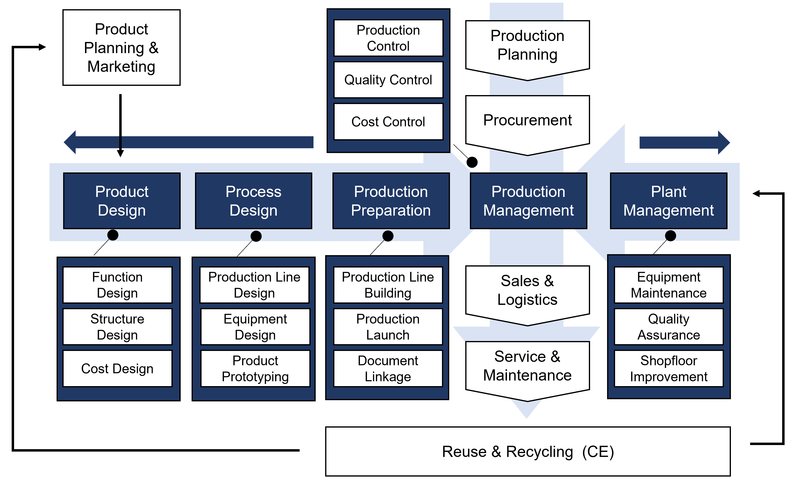
 
Below, for each function category, representative examples of function groups and function elements are shown.

<a id="61-製品設計"></a>
## 6.1. Product Design
The function category of Product Design has three function groups: Functional Design, Structural Design, and Cost Design. Representative function elements for each function group are shown below.

### Functional Design
In functional design, the functions a product should have are defined qualitatively and quantitatively. The designer translates the requirements of the product's intended users into the functions the product should have in order to maximally satisfy them.

Table 2　Function Elements of Functional Design

| No. | Function Element | Description |
|----|------------|------|
| 1 | Collecting product requirements | Collects requests from customers, the market, regulations, the environment, etc., and clarifies the value, functions, and performance required of the product. |
| 2 | Organizing requirement specifications | Classifies and structures the collected requirements, and translates them into design requirements from the perspectives of performance, cost, safety, environment, etc. |
| 3 | Formulating the product plan | Formulates the development purpose, product concept, and development scope based on customer value, marketability, and profitability. |
| 4 | Architecture design | Examines and connects to design the product architecture, including electrical, electronic control, and software aspects. |
| 5 | Evaluating mockups | Confirms shape, operability, and design using prototype models, and improves them by reflecting evaluations from customers and development members. |
| 6 | Deploying quality function | Converts customer requirements into design quality elements using the QFD method, clarifying key quality characteristics. |
| 7 | Deploying the functional BOM | Organizes the product's functions in a hierarchical structure and expresses/manages the correspondence between functions and their constituent elements in BOM form. |
| 8 | Analyzing product functions | Analyzes the purpose, input/output, and interrelationships of each function, and identifies design optimization points and the scope of impact. |
| 9 | Setting functional targets | Sets target values such as performance, cost, and reliability for each function, serving as the evaluation criteria for design in subsequent processes. |
| 10 | Formulating product specifications | Finalizes the product specification document, including concrete dimensions, performance, materials, etc., based on the results of requirement/function analysis. |

### Structural Design
In structural design, the physical structure of the product, such as its composition and the shape of its parts, is defined. This includes the work of creating, using CAD and similar tools, models corresponding to part drawings and assembly drawings, and the work of examining and determining, together with parameters, the specifications corresponding to their shapes and shape features. Note that structural design covers not only hardware but also electrical/electronic control and software.

Table 3　Function Elements of Structural Design

| No. | Function Element | Description |
|----|------------|------|
| 1 | Designing the product structure | Designs the structure, shape, and module composition needed to realize the product's functions, considering assemblability and maintainability. |
| 2 | Determining part composition | Defines the parts/units that make up the product, and determines the optimal composition, including the use of standard or common parts. |
| 3 | Creating CAD models | Creates 3D shapes of the product/parts in CAD, used for design verification, interference checking, and digital prototyping. |
| 4 | Creating the design BOM | Organizes part composition, specifications, and quantities at the design stage, and registers them in the PLM as an E-BOM to manage design information. |
| 5 | Detailed product design | Concretizes material, dimensions, tolerances, strength, etc., and creates detailed design drawings suitable for machining, assembly, and inspection. |
| 6 | Product CAE analysis | Performs structural, fluid, thermal, vibration, and other analyses, quantitatively evaluating performance, strength, and reliability to optimize the design. |
| 7 | Analyzing failure modes | Analyzes failure modes using methods such as design FMEA and FTA, identifying causes and effects and formulating measures to improve reliability. |
| 8 | Responding to design changes | Manages design changes that arise during prototyping, evaluation, and manufacturing stages, analyzing the scope of impact and ensuring reflection and approval. |
| 9 | Collaborating with partner companies | Shares data with parts suppliers and outsourced design partners, optimizing design accuracy, delivery time, and cost. |
| 10 | Responding to destination specifications and regulations | Confirms the design/manufacturing conditions corresponding to safety, environmental, and certification regulations in each country or region, and reflects them in the product specifications. |

### Cost Design
Corresponding to the product's price and expected sales volume obtained in product planning and marketing, the costs needed to actually manufacture the product are accumulated to confirm whether profit can be secured. Generally, the main task is not simply to tally the cost of each cost-component item, but to go back to the constituent elements and examine how the targeted profit can be secured.


Table 4　Function Elements of Cost Design
| No. | Function Element | Description |
|----|------------|------|
| 1 | Setting the target cost | Sets the target cost per product by working backward from the assumed sales price and profit plan, so as to secure the target profit. |
| 2 | Examining the development period | Examines the optimal balance between development cost and schedule, based on the cost target and investment payback period. |
| 3 | Managing product ROI | Evaluates profitability against investment amount, and quantitatively manages the validity of development, capital investment, and manufacturing cost. |
| 4 | Setting the standard cost | Calculates a standard manufacturing cost based on the production process, material cost, and man-hours, serving as the basis for cost variance management. |
| 5 | Pricing procured parts | Determines the appropriate price for each procured part through quotation comparison with suppliers and market price analysis. |
| 6 | Managing environmental burden | Analyzes MFCA, product LCA, etc., and manages environmental burden per plant and per product. |
| 7 | Make-or-buy decisions for processes | Compares cost and technical capability for each process, and determines the optimal split between in-house manufacturing and outsourcing. |
| 8 | Cost analysis of regulatory measures | Analyzes the cost of responding to environmental regulations and safety standards, achieving both legal compliance and economic efficiency. |
| 9 | Managing cost reduction activities | Plans and evaluates cost reduction measures such as part commonization, process improvement, and procurement cost, and promotes continuous cost reduction. |
| 10 | Cost simulation | Models variable factors such as material cost, man-hours, and production volume, predicting and verifying cost impact at the design stage. |

<a id="62-工程設計"></a>
## 6.2. Process Design
The function category of Process Design has three function groups: Line Design, Equipment Design, and Product Prototyping. Representative function elements for each function group are shown below.

### Line Design
This examines and determines the method for realizing, through a process using an actual production line, the production processes technically and theoretically required for the machining, assembly, and other necessary processing of the parts that make up the target product. This also covers cases where an existing combination of equipment is used, or where the work is outsourced to an external partner plant.

Table 5　Function Elements of Line Design
| No. | Function Element | Description |
|----|------------|------|
| 1 | Organizing line requirement information | Organizes the design-premise requirement conditions such as production volume, takt time, quality, safety, and number of workers, and clarifies the direction of the line design. |
| 2 | Comparing production methods | Analyzes the flow of each process, such as machining, assembly, and inspection, and selects a production method from the perspectives of cost, quality, and productivity. |
| 3 | Determining process sequence and procedure | Defines the process sequence and work procedure based on the product structure and work content, building an efficient and standardized production flow. |
| 4 | Comparing in-house vs. outsourced production | Compares whether each process should be made in-house or outsourced, based on cost, delivery time, quality, and technical capability, and determines the optimal production method. |
| 5 | Designing the process layout | Plans the placement of workers, equipment, and parts supply, and designs the optimal layout considering safety, productivity, and maintainability. |
| 6 | Determining the in-process transport method | Compares transport means such as conveyors, AGVs, and robots, and selects a transport method that balances logistics efficiency and safety. |
| 7 | Production line simulation | Reproduces process operation with 3D models or digital twins, verifying and optimizing takt time, utilization rate, and bottlenecks in advance. |
| 8 | Analysis via process FMEA | Analyzes latent defects and risks for each process, evaluates cause and impact, and formulates and manages preventive improvement measures. |
| 9 | Designing control programs | Designs programs that control the operation and interlocks of equipment and transport devices, realizing automation of the entire line. |
| 10 | Creating the process structure (BOP) | Lists the sequence, work time, equipment used, etc. for each process, preparing basic material usable for production preparation, planning, and maintenance. |

### Equipment Design
Equipment is designed or modified to obtain a result that satisfies given requirements, such as part shape or location, or material characteristics or precision. In addition to equipment, this also includes the work of designing jigs and tools and other mechanisms for working more efficiently and stabilizing quality further.

Table 6　Function Elements of Equipment Design
| No. | Function Element | Description |
|----|------------|------|
| 1 | Collecting functional requirements for equipment | Clarifies the performance, capacity, and safety requirements demanded of the equipment, based on production targets and product specifications. |
| 2 | Basic design of equipment functions | Defines, at the conceptual level, the equipment configuration, control method, and functional blocks needed to satisfy the specifications. |
| 3 | Detailed design of equipment configuration | Designs the detailed structure of each element, such as mechanism, electrical, and control, and creates part drawings and connection diagrams. |
| 4 | Automating and making equipment autonomous | Replaces manual work with automatic control, realizing autonomous judgment and optimal operation using AI and sensing. |
| 5 | Evaluating and addressing equipment reliability | Designs specifications with reliability in mind, based on design FMEA and FTA of the equipment and analysis of past trouble with similar equipment. |
| 6 | Designing and managing jigs and tools | Designs jigs and tools used for machining, assembly, inspection, etc., and manages their lifespan and precision. |
| 7 | Collaborating with equipment suppliers | Shares specifications and cross-checks drawings with manufacturers and outsourcing partners, uniformly managing delivery requirements and quality. |
| 8 | Equipment operation simulation | Verifies equipment operation, interference, and production capacity in virtual space, making improvements at the design stage. |
| 9 | Managing equipment documentation | Systematically manages drawings, specifications, and past trouble information, facilitating tracking and sharing of revision history. |
| 10 | Creating the equipment structure (BOA) | Organizes the equipment configuration, jigs/tools, and workers and other assets held by the production site, systematizing them as equipment structure information. |

### Product Prototyping
Actual equipment and devices are used to machine and assemble a product against a theoretical production process or production line, confirming that the required quality is obtained with the assumed production method. Development prototyping and mass-production prototyping differ in their evaluation content and purpose, but here, as prototyping at the stage before mass-production design, the focus is on exploring a production method with better production efficiency and more stable quality.

Table 7　Function Elements of Product Prototyping
| No. | Function Element | Description |
|----|------------|------|
| 1 | Examining the prototyping method | Examines the method, materials, and equipment according to the prototyping purpose, determining a method that allows performance evaluation under conditions close to actual manufacturing. |
| 2 | Procuring parts for prototyping | Identifies parts/materials needed for the prototype, and plans and executes a procurement method that can accommodate short lead times and small lots. |
| 3 | Arranging manufacture of the prototype | Requests the manufacture of the prototype based on design data and production conditions, and manages quality, delivery time, and cost. |
| 4 | Analyzing prototype performance | Measures and analyzes the product's performance, reliability, and safety at the prototyping stage, verifying design validity. |
| 5 | Approving specifications via the prototype | Evaluates the test results of the prototype, and confirms/approves the validity of the design specification with the customer or internally. |
| 6 | Improving the production method | Improves the process, jigs, and work procedure based on the prototyping results, raising productivity and quality at mass production. |
| 7 | Manufacturing simulation | Reproduces the manufacturing process using 3D models or digital twins, verifying the method and line design. |
| 8 | Acquiring product-use data | Collects usage data through actual-machine testing and user testing, reflecting it in product improvement and design optimization. |
| 9 | Conducting and verifying virtual prototyping | Simulates function and performance on CAD/CAE models, verifying design validity before actual prototyping. |
| 10 | Updating marketing information | Re-analyzes customer value based on prototype evaluation and market response, and reflects it in product planning and sales strategy. |

<a id="63-生産準備"></a>
## 6.3. Production Preparation
The function category of Production Preparation has three function groups: Line Fabrication, Production Ramp-up, and Document Linkage. Representative function elements for each function group are shown below.

### Line Fabrication
Once the results of line design and equipment design, premised on mass production, have been approved, materials for the equipment and production line are procured based on that content, and the equipment, production line, and jigs/tools are actually fabricated. In fabrication, fabrication drawings, fabrication schedule, and fabrication procedure are presented in advance, so that work can proceed efficiently even where the target plant is already producing product.

Table 8　Function Elements of Line Fabrication
| No. | Function Element | Description |
|----|------------|------|
| 1 | Applying the QC process table to the actual line | Applies the QC process table created at the design stage to the shop floor, reflecting quality check points and inspection conditions on the actual line. |
| 2 | External procurement of production equipment | Procures the necessary production equipment from external manufacturers, managing specifications, delivery time, and performance evaluation to proceed with introduction. |
| 3 | In-house fabrication of production equipment | Designs and fabricates in-house-producible equipment, establishing a system that can flexibly handle specification changes and improvements. |
| 4 | Arranging fabrication of jigs/tools and molds | Arranges for the fabrication of jigs/tools and molds used in the manufacturing process based on design information, managing precision and delivery time. |
| 5 | Installing transport lines and confirming flow lines | Installs and verifies transport lines considering parts transport routes and worker flow lines, optimizing work efficiency. |
| 6 | Installing the line and balancing | Adjusts equipment, personnel placement, and takt time, balancing the production capacity and workload of the entire line. |
| 7 | Production monitoring in trial mode | Monitors equipment operation and production data in real time during the trial-run and verification stage, detecting defects early. |
| 8 | Collecting actual quality and functional data | Collects quality, performance, and work data during trial production, verifying the validity of design and process conditions. |
| 9 | Sharing parameters and know-how | Databases equipment setting values and improvement insights gained during prototyping, horizontally deploying them to the next model or other sites. |
| 10 | Effectively utilizing unneeded equipment | Diverts surplus or older equipment to reusable processes, improving production efficiency while restraining investment cost. |

### Production Ramp-up
Production ramp-up is carried out by performing design that assumes the actual production line and production equipment. When starting full-scale production, data is intensively acquired as a prototype or initial lot, analyzed, and managed until the productivity and quality-control values targeted for ramp-up are achieved.

Table 9　Function Elements of Production Ramp-up
| No. | Function Element | Description |
|----|------------|------|
| 1 | Managing the production ramp-up schedule | Schedules each of the prototyping, verification, approval, and mass-production switchover processes, managing the reliable progress of mass-production ramp-up. |
| 2 | Adapting the line for series production | Designs a line configuration that considers commonization and flexibility so as to accommodate derivative models and improved products. |
| 3 | Preparing the environment for the QC process table | Re-prepares a QC process table suited to the mass-production stage, standardizing quality control items, work procedures, and inspection procedures. |
| 4 | Selecting and coordinating suppliers | Confirms the production capacity and quality system of partner companies based on the mass-production plan, minimizing supply risk. |
| 5 | Arranging long-lead-time procured parts | Arranges early for parts with long lead times to prevent production delays, optimizing the procurement plan. |
| 6 | Managing initial fluctuation at mass production | Intensively monitors and corrects quality variation and process instability in the early period of mass-production ramp-up, transitioning early to stable production. |
| 7 | Addressing required quality and defect causes | Maintains the quality level based on market requirements, analyzing defect causes and taking swift countermeasures/improvements. |
| 8 | Creating the manufacturing BOM | Creates a manufacturing BOM including the materials, auxiliary materials, and consumables needed in the production process. |
| 9 | Creating the service BOM | Prepares drawings and part composition for after-sales service, establishing a supply/maintenance system across the entire product lifecycle. |
| 10 | Transferring the line at end of production | Withdraws and relocates line equipment in line with product discontinuation, planning and executing a diversion plan to other products. |

### Document Linkage
Document linkage prepares the information needed at production time, such as work procedure documents. This covers not only workers but also business related to preparing master data used by business systems. Document linkage covers not only cases of starting up an entirely new production line or registering production procedures for a new product, but also cases such as responding to design changes for products whose production has already started.

Table 10　Function Elements of Document Linkage
| No. | Function Element | Description |
|----|------------|------|
| 1 | Linking or integrating the bill of materials | Integrally manages the design BOM, manufacturing BOM, and service BOM, maintaining data consistency between processes and departments. |
| 2 | Managing the design BOM | Integrally manages design composition, part specifications, and change history on the PLM, guaranteeing the accuracy of design information. |
| 3 | Managing the manufacturing BOM | Manages part composition based on the manufacturing process and assembly sequence, streamlining production preparation while aligning with the design BOM. |
| 4 | Organizing terminology and creating a dictionary | Standardizes terms commonly used across design, production, and quality, compiling them into a dictionary to facilitate information collaboration inside and outside the company. |
| 5 | Sharing drawings and work procedure documents | Integrally manages the latest design drawings and corresponding work instructions/procedure documents, preventing misapplication on the shop floor. |
| 6 | Managing and sharing the QC process table | Clarifies quality control items and inspection conditions in the process table, sharing it so it can respond immediately to design changes or process improvements. |
| 7 | Managing and sharing standard work procedure documents | Standardizes work methods, jig conditions, and inspection criteria, sharing them across all sites via PLM or MES. |
| 8 | Extracting and preparing master data | Extracts master information such as parts, equipment, and processes, unifying and preparing the code system and attribute definitions. |
| 9 | Managing the flow at design change | Manages the process from design change proposal through approval and reflection, making the timing and consistency of changes traceable. |
| 10 | Creating documents for regulatory compliance | Creates technical documents responding to regulatory requirements such as RoHS and REACH, managed per product. |


<a id="64-生産管理"></a>
## 6.4. Production Management
The function category of Production Management has three function groups: Process Control, Quality Control, and Cost Management. Representative function elements for each function group are shown below.

### Process Control
This manages the correspondence between the production schedule issued in response to confirmed orders, forecast orders, or replenishment instructions from downstream processes, and the actual production performance, managing whether each instruction is being executed as planned, or whether the plan itself is valid.

Table 11　Function Elements of Process Control
| No. | Function Element | Description |
|----|------------|------|
| 1 | Managing the production schedule plan | Formulates a production schedule based on demand forecasts and order plans, managing resource load and delivery time. |
| 2 | Managing the production schedule | Creates and distributes a daily/weekly production schedule considering equipment, personnel, and material constraints. |
| 3 | Issuing production instructions | Issues manufacturing instructions based on the plan to the MES or shop-floor terminals, clarifying work content and sequence. |
| 4 | Managing production progress | Collects actual performance data from the shop floor, visualizing the difference from the plan to control delivery time and quality. |
| 5 | Managing equipment operation | Monitors equipment utilization rate and downtime causes, converting them to data, and optimizes OEE improvement and maintenance planning. |
| 6 | Managing procured items' content and delivery time | Shares suppliers' production progress and delivery-time information, managing the delivery time of procured items. |
| 7 | Managing output and productivity | Analyzes work performance/output data, continuously examining measures to improve productivity and operating efficiency. |
| 8 | Managing material and WIP inventory | Monitors the receipt and issuance of materials and intermediate items, appropriately grasping inventory levels to prevent shortages or excess inventory. |
| 9 | Managing product inventory and shipment performance | Links finished-goods inventory and shipment status with the sales plan, enabling accurate delivery-time responses. |
| 10 | Responding to irregularities | Ensures reliable handling of irregularities (parts shortage, equipment trouble, defects, etc.) when they occur, and records/manages the response performance. |

### Quality Control
For quality control, in addition to normal inspection, mechanisms are operated and maintained — such as setting stricter inspection items — to prevent defective products as part of quality control. Analysis of inspection results identifies the causes of defects, and activities are conducted to raise productivity and the first-pass yield rate.

Table 12　Function Elements of Quality Control
| No. | Function Element | Description |
|----|------------|------|
| 1 | Setting quality inspection criteria | Defines judgment criteria, inspection items, and allowable ranges based on product specifications and customer requirements. |
| 2 | Conducting finished-product inspection | Inspects the product's performance, appearance, and safety before shipment, making a final confirmation of standard compliance and quality assurance. |
| 3 | Receiving and in-process inspection | Inspects procured items or parts partway through the process, preventing impact on the current and next processes. |
| 4 | Monitoring quality data trends | Analyzes quality data such as measured values and defect rates over time, catching signs of abnormality early. |
| 5 | Calibrating and recording measuring instruments | Performs periodic calibration to maintain the precision of measuring instruments, recording and managing the results. |
| 6 | Analyzing defect causes and countermeasures | Analyzes causes when a defect occurs, and takes measures from the design, process, and material sides to prevent recurrence. |
| 7 | Repairing and re-inspecting defective products | Re-inspects a defective product after correction to confirm quality, thoroughly managing recurrence prevention and history. |
| 8 | Tracing back defect causes | Traces the BOM, lot, and work history when a defect occurs, identifying the cause and scope of impact. |
| 9 | Developing inspection devices and mechanisms | Develops automatic inspection devices, AI image judgment, etc., improving the efficiency and accuracy of inspection. |
| 10 | Sharing quality-improvement knowledge | Databases defect cases, improvement measures, and success cases, sharing them between design and manufacturing departments. |

### Cost Management
This provides a mechanism for calculating and aggregating, as rationally as possible, the costs incurred at production lines and equipment other than material cost — such as labor cost and equipment depreciation cost. It sets and manages the indicators, unit consumption rates, and charge rates needed to allocate the fixed costs of equipment.

Table 13　Function Elements of Cost Management
| No. | Function Element | Description |
|----|------------|------|
| 1 | Identifying and recording cost factors | Clarifies cost-component factors such as material cost, labor cost, and equipment cost, recording their source so they can be traced. |
| 2 | Recording manufacturing performance data | Collects performance data such as manufacturing time, materials used, and work hours, as the basis for calculating actual cost. |
| 3 | Calculating and updating the unit consumption rate | Calculates the standard work time and material usage per product, and updates it periodically based on production performance. |
| 4 | Managing equipment depreciation | Allocates equipment investment cost according to useful life, reflecting it in the standard cost and asset management. |
| 5 | Allocating fixed and shared costs | Rationally allocates shared costs such as equipment maintenance cost and administrative cost to each product/process, raising the accuracy of cost calculation. |
| 6 | Calculating actual cost | Calculates the cost actually incurred from performance data, evaluating efficiency by comparison with the standard cost. |
| 7 | Setting manufacturing overhead | Calculates indirect costs other than shop-floor work, such as management, maintenance, and logistics, setting an allocation basis to incorporate into cost. |
| 8 | Analyzing cost variance | Analyzes the variance between standard cost and actual cost, identifying factors (yield, man-hours, material price, etc.) to improve. |
| 9 | Calculating environmental burden amount | Calculates energy usage and CO2 emissions, reflecting/managing them as environmental cost within the cost. |
| 10 | Cost estimation and price setting | Calculates the estimated cost based on design and production conditions, determining the product price or quotation amount in line with the profit target. |


<a id="65-工場運営"></a>
## 6.5. Plant Operations
The function category of Plant Operations has three function groups: Equipment Maintenance, Quality Assurance, and Shop-floor Improvement. Representative function elements for each function group are shown below.

### Equipment Maintenance
Equipment maintenance includes preventive maintenance such as periodic inspection, corrective maintenance after a failure or minor/major stoppage, and predictive maintenance that senses signs of a failure in advance and responds proactively. Equipment inspection and maintenance are carried out based on predetermined methods and criteria, and new insight is gained by analyzing this data.

Table 14　Function Elements of Equipment Maintenance
| No. | Function Element | Description |
|----|------------|------|
| 1 | Formulating equipment maintenance procedures | Formulates standard procedures such as inspection, cleaning, and replacement to maintain safe and efficient operation of the equipment. |
| 2 | Conducting routine maintenance | Performs preventive maintenance such as periodic inspection, lubrication, and cleaning, preventing failures before they occur. |
| 3 | Planning maintenance content and schedule | Formulates an annual/monthly maintenance schedule, clearly defining the target equipment and frequency of implementation. |
| 4 | Monitoring equipment and detecting abnormalities | Uses sensor and IoT data to detect early signs of abnormality from temperature, vibration, etc. |
| 5 | Analyzing operating performance data | Analyzes operation rate, downtime, and maintenance history, using it to improve reliability and optimize the maintenance plan. |
| 6 | Responding to and addressing equipment abnormalities | Takes swift emergency action when an abnormality occurs, and formulates permanent recurrence-prevention measures through cause analysis. |
| 7 | Managing auxiliary materials and spare parts | Manages inventory of auxiliary materials such as tools, parts, and oils/greases needed for maintenance, preventing delays due to shortage. |
| 8 | Managing equipment maintenance history | Digitally records history such as inspection, repair, and replacement, using it for trend analysis and improvement of maintenance strategy. |
| 9 | Training equipment maintenance personnel | Trains personnel through education and OJT to pass on shop-floor skills and troubleshooting capability. |
| 10 | Responding to minor and major stoppages | Analyzes the causes of short stoppages (minor stops) and long stoppages (major stops), pursuing recurrence prevention from both the work and equipment sides. |


### Quality Assurance
Quality assurance provides a mechanism to prevent quality problems in products or parts before they occur, so that quality can be assured without excessive reliance on direct 100% inspection at the final stage. It focuses on the process by which quality defects arise, and removes the causes of quality defects and failures through causal-relationship and failure-factor analysis. In particular, it incorporates the 4M factors: equipment, people, material, and method.

Table 15　Function Elements of Quality Assurance
| No. | Function Element | Description |
|----|------------|------|
| 1 | Setting the quality inspection method | Determines an inspection method suited to the characteristics of the product or process, setting the optimal method such as sampling, 100%, or automatic inspection. |
| 2 | Responding to customer complaints | Swiftly analyzes defects/requests from customers, investigating the cause and taking recurrence-prevention measures to maintain trust. |
| 3 | Training quality assurance personnel | Educates specialized knowledge and skill regarding quality assurance, inspection, and improvement, embedding a quality culture. |
| 4 | Evaluating supplier quality | Periodically evaluates the quality-control system, defect rate, and improvement capability of suppliers, securing the quality of supplied goods. |
| 5 | Countermeasures via process FMEA | Identifies latent risks for each process, evaluating impact and occurrence frequency to implement measures proactively. |
| 6 | Identifying and recording control factors | Identifies important parameters affecting quality (temperature, pressure, time, etc.), recording and managing them. |
| 7 | Responding to quality-defect recalls | Identifies the scope of impact for a serious defect that occurred in the market, and swiftly carries out recovery and customer response. |
| 8 | Excluding defective lots | Identifies and isolates lots containing defective products, performing inspection and re-judgment to prevent further outflow. |
| 9 | Responding to internal/external process audits | Responds to process audits by internal parties, customers, or third parties, implementing corrective action and continuous improvement. |
| 10 | Managing plant health and safety | Complies with labor safety and hygiene standards, reducing risk in the work environment and maintaining employee health. |

### Shop-floor Improvement
Shop-floor workers and managers themselves discover material for improvement, such as shop-floor problems and near-misses, find solutions, and implement improvements. Shop-floor improvement uses diagrams such as the QC seven tools and the new QC seven tools, taking an autonomous, bottom-up approach that includes problem discovery and visualization.

Table 16　Function Elements of Shop-floor Improvement
| No. | Function Element | Description |
|----|------------|------|
| 1 | 5S activities and safety management | Thoroughly implements the 5S (sort, set in order, shine, standardize, sustain), improving the workplace environment and safety. |
| 2 | "Why-why" analysis of shop-floor issues | Practices a method of repeating "why" to identify the true cause of a problem, leading to a fundamental improvement measure. |
| 3 | Sharing and utilizing improvement cases | Systematically shares success/failure cases from the shop floor, horizontally deploying them to other processes or departments to prevent recurrence. |
| 4 | Sharing past troubles and near-misses | Shares past troubles and near-miss cases, cultivating a safety culture that prevents similar risks before they occur. |
| 5 | Following up on countermeasures | Continuously confirms the effect after an improvement is implemented, building a mechanism that leads to recurrence prevention and standardization. |
| 6 | Data-driven QC activities | Performs quantitative problem-solving using statistical methods based on quality, cost, and delivery-time data. |
| 7 | Synchronizing and streamlining things and information | Aligns the flow of physical items on the shop floor with the flow of information, achieving lead-time reduction and elimination of waste between processes. |
| 8 | Improving the work environment | Improves layout, lighting, and flow lines considering worker safety and comfort, raising productivity. |
| 9 | Promoting in-house standardization activities | Reflects improvement results in standardization documents, aiming for continuous company-wide operation as unified rules. |
| 10 | Skill development and human resource development | Develops personnel through skill education and support for qualification acquisition, evaluating their contribution to improvement activities. |

<a id="7-情報モデルnormative"></a>
# 7. Information Model (normative)
The information model shows the structure of the content that expresses, as information, the outcome obtained as a result of executing a function. The information model also shows the structure of the content of information that is indispensable when executing a function. The function model and the information model correspond element by element: one function uses one or more pieces of information, and at the same time one piece of information is involved in multiple functions.

The information model refers to objects composed of characters, numbers, diagrams, etc., such as slips, forms, or screens. The information model is shaped so that the person in charge of the business, having understood its meaning, can read or write its content. In general, an information model has a hierarchy, and part of the structure of one information model may include other information models.

In this chapter, information is divided into the categories of Planning Information, Development Information, Technical Information, Management Information, and Shop-floor Information, and information is grouped within each category. Below, an overview of the information model is explained by information category and information group, and the main items are shown for each.

Table 17　Categories and Groups of the Information Model

| Category	| Group	| Description | 
| -- | -- | -- | 
| Planning Information	| Planning Information	| Information that sets product development or production targets and defines the method of realization, including quantity, period, and resource allocation | 
| | 	Specification Information	| Information that defines the function, performance, and conditions of a product or process, and is shared as the standard for design, manufacturing, and quality | 
| | 	Cost Information	| Information that manages the cost structure, estimates, and actuals related to a product or process, and is used for profitability analysis and improvement | 
| Development Information	| Structure Information	| Information that defines the constituent elements and relationships of a product or piece of equipment, forming the basis of structure management such as BOM and BOA | 
| | 	Procedure Information	| Information that defines the concrete method and sequence of carrying out a task or process, contributing to establishing standard work and stabilizing quality | 
| 	| Reference/Standard Information	| Information that defines the judgment criteria or standards regarding quality, work, or equipment, serving as a common yardstick for evaluation and management
| Technical Information	| Deployment Information	| Information for deploying the content of a design or plan to each process or department, converting it into an executable form
| 	| Linkage Information	| Information that is shared and linked between departments or systems, ensuring data consistency and interoperability
| 	| Quality Information	| Information that records measured values and evaluation results regarding the quality of a product or process, used for defect prevention and quality improvement
| Management Information	| Schedule Information	| Information indicating the start/end time and progress status of production or work, used for schedule management and progress control
| 	| Instruction Information	| Information indicating concrete instruction content regarding work or production, directly supporting execution on the shop floor
| 	| Performance Information	| Information that records performance such as production quantity, work results, and operating status, forming the basis for analysis and improvement
| Shop-floor Information	| 4M Information	| Information that manages data regarding workers, equipment, materials, and methods, used for factor analysis and management of process quality
| 	| Status Information	| Information that grasps the status or abnormality of equipment or a process in real time, supporting stable operation and swift response
| 	| Improvement Information	| Information that records the cause analysis of an issue or defect and the content of countermeasures, used for continuous improvement and recurrence prevention

In this chapter, the table corresponding to each information group indicates, for each information name, which of product, process, or equipment it relates to. This makes it possible to identify cases where a given piece of information is cross-cutting content relating to product, process, and equipment.

Also, for each information model, a corresponding class diagram and a list of the main information items are shown. The classes in the class diagram correspond to entities in the data model; in the list of information items, the entity to which each information item belongs and the corresponding attribute are shown, along with the cardinality shown in the Relationship column. For example, "*" means that multiple pieces of the corresponding information exist for one; where there are multiple underlying entities, they are identified by number. Also, where an entity is marked with "×", this indicates that it is an entity formed by cross-expanding the entities on both sides.

<a id="71-企画情報"></a>
## 7.1. Planning Information
### Planning Information (Planning Information)
Information that defines the plan or schedule for a future activity together with the progression of a period or schedule. It shows the plan and its actual performance regarding the schedule accompanying product development, and the production volume, capacity, and load of each product or piece of equipment.

Table 18　Planning Information
| No. | Information Name | Product | Process | Equipment | Description |
|---:|---|:---:|:---:|:---:|---|
| 1 | Development Plan Table | 〇 | 〇 | 〇 | A plan summarizing the purpose, process, schedule, structure, and resources of product or system development. Serves as a guide for development progress. |
| 2 | Production Plan Table | 〇 |  |  | A table planning production volume, timing, and plant load based on demand forecast and orders. Serves as a guide for overall production. |
| 3 | Capacity Plan Table |  | 〇 | 〇 | A plan table for comparing the capacity and load of the equipment and personnel needed for production, to grasp shortfalls/excesses. Evaluates the feasibility of the production plan. |

#### Development Plan Table
A plan summarizing the purpose, process, schedule, structure, and resources of product or system development. Serves as a guide for development progress.

Figure 6　Development Plan Table
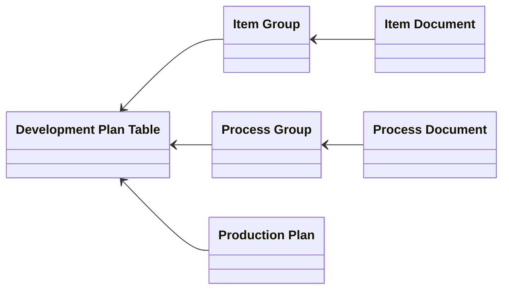
```mermaid
classDiagram
direction LR
    Development_Plan_Table <-- Item_Group
    Development_Plan_Table <-- Process_Group
    Item_Group <-- Item_Document
    Process_Group <-- Process_Document
    Development_Plan_Table <-- Production_Plan
    class Development_Plan_Table["Development Plan Table"]
    class Item_Group["Item Group"]
    class Process_Group["Process Group"]
    class Item_Document["Item Document"]
    class Process_Document["Process Document"]
    class Production_Plan["Production Plan"]
```

Table 19 Development Plan Table
| No. | Item Name | Entity | Attribute | Relationship |
|---:|---|---|---|---|
| 1 | Item Name | Item Group | Item Group Name | |
| 2 | Status | Item Group | Status | |
| 3 | Content | Item Group × Date | Content | *1 |
| 4 | Development Purpose | Item Document | Development Purpose | |
| 5 | Development Schedule | Item Document | Development Schedule | |
| 6 | Specification | Item Document | Specification | |
| 7 | Quantity | Item Document | Quantity | |
| 8 | Unit | Item Document | Unit | |
| 9 | Process Name | Process Group | Process Group Name | |
| 10 | Status | Process Group | Status | |
| 11 | Content (Process) | Process Group × Date | Content | *2 |
| 12 | Development Purpose (Process) | Process Document | Development Purpose | |
| 13 | Development Schedule (Process) | Process Document | Development Schedule | |
| 14 | Specification (Process) | Process Document | Specification | |
| 15 | Quantity (Process) | Process Document | Quantity | |
| 16 | Unit (Process) | Process Document | Unit | |
| 17 | Date | Production Plan | Term ID | *3 |
| 18 | Plan Content | Production Plan | Plan Content | *3 |
| 19 | Status | Production Plan | Status | *3 |
| 20 | Cost of Sales | Production Plan | Cost of Sales | *3 |
| 21 | Operating Profit | Production Plan | Operating Profit | *3 |

#### Production Plan Table
A table planning production volume, timing, and plant load based on demand forecast and orders. Serves as a guide for overall production.

Figure 7　Production Plan Table
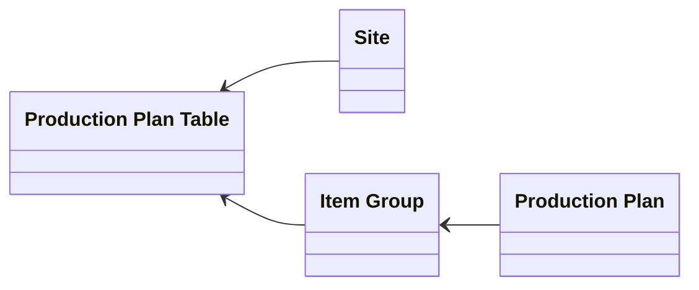
```mermaid
classDiagram
direction LR
    Production_Plan_Table <-- Site
    Production_Plan_Table <-- Item_Group
    Item_Group <-- Production_Plan
    class Production_Plan_Table["Production Plan Table"]
    class Site["Site"]
    class Item_Group["Item Group"]
    class Production_Plan["Production Plan"]
```

Table 20 Production Plan Table
| No. | Item Name | Entity | Attribute | Relationship |
|---:|---|---|---|---|
| 1 | Site Name | Site | Site Name | |
| 2 | Planned Quantity | Site × Month | Planned Quantity | *1 |
| 3 | Actual Quantity | Site × Month | Actual Quantity | *1 |
| 4 | Item Name | Item Group | Item Group Name | |
| 5 | Planned Quantity | Item Group × Month | Planned Quantity | *2 |
| 6 | Actual Quantity | Item Group × Month | Actual Quantity | *2 |
| 7 | Planned Date/Time | Production Plan | Planned Date/Time | * |
| 8 | Planned Quantity | Production Plan | Planned Quantity | * |
| 9 | Actual Quantity | Production Plan | Actual Quantity | * |
| 10 | Reference Quantity | Production Plan | Quantity | * |
| 11 | Unit | Production Plan | Unit | * |

#### Capacity Plan Table
A plan table for comparing the capacity and load of the equipment and personnel needed for production, to grasp shortfalls/excesses. Evaluates the feasibility of the production plan.

Figure 8　Capacity Plan Table
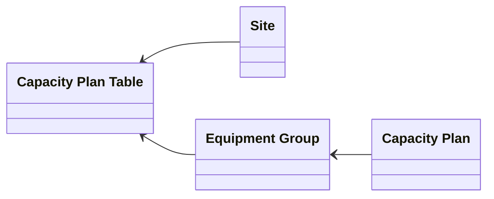
```mermaid
classDiagram
direction LR
    Capacity_Plan_Table <-- Site
    Capacity_Plan_Table <-- Equipment_Group
    Equipment_Group <-- Capacity_Plan
    class Capacity_Plan_Table["Capacity Plan Table"]
    class Site["Site"]
    class Equipment_Group["Equipment Group"]
    class Capacity_Plan["Capacity Plan"]
```

Table 21 Capacity Plan Table
| No. | Item Name | Entity | Attribute | Relationship |
|---:|---|---|---|---|
| 1 | Site Name | Site |  |  |
| 2 | Planned Quantity | Site × Month |  | *1 |
| 3 | Actual Quantity | Site × Month |  | *1 |
| 4 | Equipment Name | Equipment Group |  |  |
| 5 | Planned Quantity | Equipment Group × Month |  | *2 |
| 6 | Actual Quantity | Equipment Group × Month |  | *2 |
| 7 | Planned Date/Time | Production Plan | Planned Date/Time | * |
| 8 | Planned Quantity | Production Plan | Planned Quantity | * |
| 9 | Actual Quantity | Production Plan | Actual Quantity | * |
| 10 | Reference Quantity | Production Plan | Quantity | * |
| 11 | Unit | Production Plan | Unit | * |

### Specification Information (Specification Information)
The requirement specification document is upper-level information that defines requirements, conditions, and constraints, serving as the reference point for other information. It is formal, prescriptive information containing both qualitative and quantitative specifications. The design document, meanwhile, is generative information that describes the structure, function, and shape needed to embody the specification. It is a category of technical document with a fixed representation format, such as drawings and the E-BOM.

Table 24　Specification Information
| No. | Information Name | Product | Process | Equipment | Description |
|---:|---|:---:|:---:|:---:|---|
| 1 | Requirement Specification Document | 〇 | 〇 | 〇 | A document summarizing the desired functions, performance, and constraint conditions prior to designing a product, process, or equipment. An upper-level requirement showing what should be achieved. |
| 2 | Product Design Document | 〇 |  |  | A document summarizing the design content of a product, such as its structure, materials, dimensions, and performance. Design information forming the basis of mass production. |
| 3 | Process Design Document |  | 〇 |  | A document defining the procedure, equipment conditions, work content, quality control points, etc. of a manufacturing process. Serves as the standard for the mass-production process. |
| 4 | Equipment Design Document |  |  | 〇 | A document summarizing the detailed design of the structure, capacity, control method, and safety measures of production equipment. A guide for equipment fabrication/introduction. |

#### Requirement Specification Document
A document summarizing the desired functions, performance, and constraint conditions prior to designing a product, process, or equipment. An upper-level requirement showing what should be achieved.

Figure 9　Requirement Specification Document
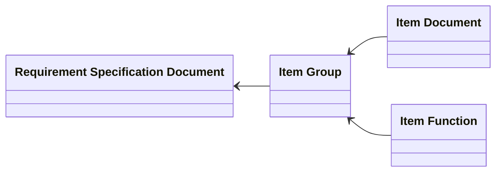
```mermaid
classDiagram
direction LR
    Requirement_Specification_Document <-- Item_Group
    Item_Group <-- Item_Document
    Item_Group <-- Item_Function
    class Requirement_Specification_Document["Requirement Specification Document"]
    class Item_Group["Item Group"]
    class Item_Document["Item Document"]
    class Item_Function["Item Function"]
```

Table 25 Requirement Specification Document
| No. | Item Name | Entity | Attribute | Relationship |
|---:|---|---|---|---|
| 1 | Item Name | Item Group | Item Group Name | |
| 2 | Item Classification | Item Group | Item Group Classification | |
| 3 | Target Cost | Item Group | Target Cost | |
| 4 | Sales Target | Item Group | Sales Target | |
| 5 | Item Document | Item Document | Item Document Name | *1 |
| 6 | Document Classification | Item Document | Item Document Classification | *1 |
| 7 | Development Purpose | Item Document | Development Purpose | *1 |
| 8 | Target Customer | Item Document | Target Customer | *1 |
| 9 | Development Schedule | Item Document | Development Schedule | *1 |
| 10 | Development Structure | Item Document | Development Structure | *1 |
| 11 | Status | Item Function | Status | *2 |
| 12 | Customer Requirement | Item Function | Customer Requirement | *2 |
| 13 | Functional Requirement | Item Function | Functional Requirement | *2 |
| 14 | Quality Characteristic | Item Function | Quality Characteristic | *2 |
| 15 | Required Level | Item Function | Quantity | *2 |
| 16 | Unit | Item Function | Unit | *2 |

#### Product Design Document
A document summarizing the design content of a product, such as its structure, materials, dimensions, and performance. Design information forming the basis of mass production.

Figure 10　Product Design Document
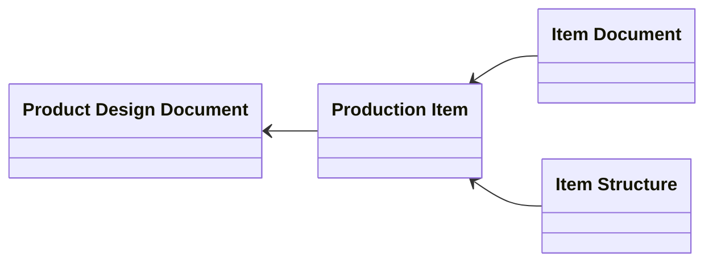
```mermaid
classDiagram
direction LR
    Product_Design_Document <-- Production_Item
    Production_Item <-- Item_Document
    Production_Item <-- Item_Structure
    class Product_Design_Document["Product Design Document"]
    class Production_Item["Production Item"]
    class Item_Document["Item Document"]
    class Item_Structure["Item Structure"]
```

Table 26 Product Design Document
| No. | Item Name | Entity | Attribute | Relationship |
|---:|---|---|---|---|
| 1 | Item Number | Production Item | Item Number | |
| 2 | Item Name | Production Item | Production Item Name | |
| 3 | Item Classification | Production Item | Production Item Classification | |
| 4 | Status | Production Item | Status | |
| 5 | Specification | Production Item | Specification | |
| 6 | Quantity | Production Item | Quantity | |
| 7 | Unit | Production Item | Unit | |
| 8 | Drawing Number | Item Document | Item Document Name | *1 |
| 9 | Drawing Name | Item Document | Specification | *1 |
| 10 | Drawing Classification | Item Document | Item Document Classification | *1 |
| 11 | Revision | Item Document | Status | *1 |
| 12 | File | Item Document | File | *1 |
| 13 | Sequence Number | Item Structure | Sequence Number | *2 |
| 14 | Structure Classification | Item Structure | Item Structure Classification | *2 |
| 15 | Part Number | Item Structure | Child Production Item ID | *2 |
| 16 | Part Name | Item Structure | Item Structure Name | *2 |
| 17 | Part Specification | Item Structure | Specification | *2 |
| 18 | Quantity per Unit | Item Structure | Quantity per Unit | *2 |
| 19 | Unit | Item Structure | Unit | *2 |

#### Process Design Document
A document defining the procedure, equipment conditions, work content, quality control points, etc. of a manufacturing process. Serves as the standard for the mass-production process.

Figure 11　Process Design Document
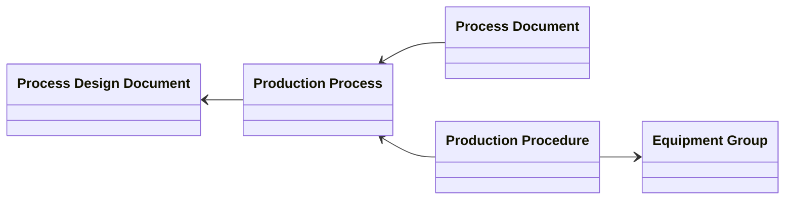
```mermaid
classDiagram
direction LR
    Process_Design_Document <-- Production_Process
    Production_Process <-- Process_Document
    Production_Process <-- Production_Procedure
    Production_Procedure --> Equipment_Group
    class Process_Design_Document["Process Design Document"]
    class Production_Process["Production Process"]
    class Process_Document["Process Document"]
    class Production_Procedure["Production Procedure"]
    class Equipment_Group["Equipment Group"]
```

Table 27 Process Design Document
| No. | Item Name | Entity | Attribute | Relationship |
|---:|---|---|---|---|
| 1 | Process Name | Process Group | Process Group Name | |
| 2 | Process Classification | Process Group | Process Group Classification | |
| 3 | Status | Process Group | Status | |
| 4 | Specification | Process Group | Specification | |
| 5 | Performance | Process Group | Rate | |
| 6 | Capacity | Process Group | Standard Capacity | |
| 7 | Unit | Process Group |  | |
| 8 | Drawing Number | Process Document | Equipment Document Name | *1 |
| 9 | Drawing Name | Process Document | Specification | *1 |
| 10 | Drawing Classification | Process Document | Equipment Document Classification | *1 |
| 11 | Revision | Process Document | Status | *1 |
| 12 | File | Process Document | File | *1 |
| 13 | Sequence Number | Production Procedure | Sequence Number | *2 |
| 14 | Procedure Name | Production Procedure | Production Procedure Name | *2 |
| 15 | Procedure Classification | Production Procedure | Production Procedure Classification | *2 |
| 16 | Procedure Content | Production Procedure | Content | *2 |
| 17 | Quantity | Production Procedure | Quantity | *2 |
| 18 | Unit | Production Procedure | Unit | *2 |
| 19 | Production Man-hours | Production Procedure | Production Man-hours | *2 |
| 20 | Production Days | Production Procedure | Production Days | *2 |
| 21 | Equipment Name | Equipment Group | Equipment Group Name | *3 |
| 22 | Equipment Classification | Equipment Group | Equipment Group Classification | *3 |
| 23 | Equipment Capacity | Equipment Group | Standard Capacity | *3 |
| 24 | Equipment Specification | Equipment Group | Specification | *3 |
| 25 | Unit | Equipment Group | Unit | *3 |

#### Equipment Design Document
A document summarizing the detailed design of the structure, capacity, control method, and safety measures of production equipment. A guide for equipment fabrication/introduction.

Figure 12　Equipment Design Document
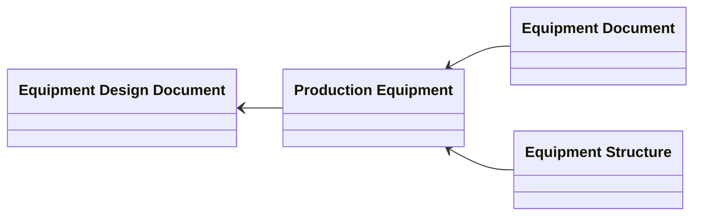
```mermaid
classDiagram
direction LR
    Equipment_Design_Document <-- Production_Equipment
    Production_Equipment <-- Equipment_Document
    Production_Equipment <-- Equipment_Structure
    class Equipment_Design_Document["Equipment Design Document"]
    class Production_Equipment["Production Equipment"]
    class Equipment_Document["Equipment Document"]
    class Equipment_Structure["Equipment Structure"]
```

Table 28 Equipment Design Document
| No. | Item Name | Entity | Attribute | Relationship |
|---:|---|---|---|---|
| 1 | Equipment Number | Production Equipment | Equipment Number | |
| 2 | Equipment Name | Production Equipment | Production Equipment Name | |
| 3 | Equipment Classification | Production Equipment | Equipment Classification | |
| 4 | Status | Production Equipment | Status | |
| 5 | Specification | Production Equipment | Specification | |
| 6 | Quantity | Production Equipment | Quantity | |
| 7 | Unit | Production Equipment | Unit | |
| 8 | Equipment Capacity | Production Equipment | Standard Capacity | |
| 9 | Equipment Performance | Production Equipment | Rate | |
| 10 | Drawing Number | Equipment Document | Equipment Document Name | *1 |
| 11 | Drawing Name | Equipment Document | Specification | *1 |
| 12 | Drawing Classification | Equipment Document | Equipment Document Classification | *1 |
| 13 | Revision | Equipment Document | Status | *1 |
| 14 | File | Equipment Document | File | *1 |
| 15 | Sequence Number | Equipment Structure | Sequence Number | *2 |
| 16 | Component Equipment Name | Equipment Structure | Equipment Structure Name | *2 |
| 17 | Component Equipment Number | Equipment Structure | Child Production Equipment ID | *2 |
| 18 | Structure Classification | Equipment Structure | Structure Classification | *2 |
| 19 | Structure Specification | Equipment Structure | Specification | *2 |
| 20 | Quantity per Unit | Equipment Structure | Quantity per Unit | *2 |
| 21 | Structure Unit | Equipment Structure | Unit | *2 |

### Cost Information (Cost Information)
Calculation information based on amount, quantity, and time, such as standard cost and actual cost. Has a numerical structure that can be aggregated and compared.
Table 29　Cost Table
| No. | Information Name | Product | Process | Equipment | Description |
|---:|---|:---:|:---:|:---:|---|
| 1 | Standard Cost Table | 〇 | 〇 | 〇 | A table summarizing the theoretical standard cost, such as material cost, labor cost, and expenses. Serves as the basis for planned values and variance analysis. |
| 2 | Actual Cost Table | 〇 | 〇 | 〇 | A cost table tallying the material cost, man-hours, and expenses actually incurred. Grasps points for improvement by comparison with the standard cost. |

#### Standard Cost Table
A table summarizing the theoretical standard cost, such as material cost, labor cost, and expenses. Serves as the basis for planned values and variance analysis.

Figure 13　Standard Cost Table
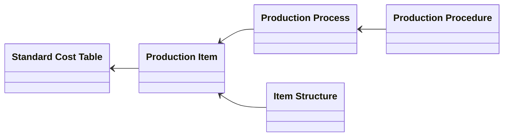
```mermaid
classDiagram
direction LR
    Standard_Cost_Table <-- Production_Item
    Production_Item <-- Production_Process
    Production_Item <-- Item_Structure
    Production_Process <-- Production_Procedure
    class Standard_Cost_Table["Standard Cost Table"]
    class Production_Item["Production Item"]
    class Production_Process["Production Process"]
    class Item_Structure["Item Structure"]
    class Production_Procedure["Production Procedure"]
```

Table 30 Standard Cost Table
| No. | Item Name | Entity | Attribute | Relationship |
|---:|---|---|---|---|
| 1 | Item Number | Production Item | Item Number | |
| 2 | Item Name | Production Item | Item Name | |
| 3 | Status | Production Item | Status | |
| 4 | Quantity | Production Item | Quantity | |
| 5 | Unit | Production Item | Unit | |
| 6 | Cost | Production Item | Cost | |
| 7 | Sequence Number | Item Structure | Sequence Number | *1 |
| 8 | Part Name | Item Structure | Item Structure Name | *1 |
| 9 | Specification | Item Structure | Specification | *1 |
| 10 | Quantity per Unit | Item Structure | Quantity per Unit | *1 |
| 11 | Unit | Item Structure | Unit | *1 |
| 12 | Cost | Item Structure | Cost | *1 |
| 13 | Process Number | Production Process | Process Number | |
| 14 | Process Name | Production Process | Production Process Name | |
| 15 | Status | Production Process | Status | |
| 16 | Quantity | Production Process | Quantity | |
| 17 | Unit | Production Process | Unit | |
| 18 | Cost | Production Process | Cost | |
| 19 | Sequence Number | Production Procedure | Sequence Number | *2 |
| 20 | Part Name | Production Procedure | Production Procedure Name | *2 |
| 21 | Content | Production Procedure | Content | *2 |
| 22 | Quantity | Production Procedure | Quantity | *2 |
| 23 | Unit | Production Procedure | Unit | *2 |
| 24 | Cost | Production Procedure | Cost | *2 |

#### Actual Cost Table
A cost table tallying the material cost, man-hours, and expenses actually incurred. Grasps points for improvement by comparison with the standard cost.

Figure 14　Actual Cost Table
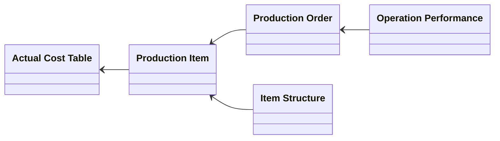
```mermaid
classDiagram
direction LR
    Actual_Cost_Table <-- Production_Item
    Production_Item <-- Production_Order
    Production_Item <-- Item_Structure
    Production_Order <-- Operation_Performance
    class Actual_Cost_Table["Actual Cost Table"]
    class Production_Item["Production Item"]
    class Production_Order["Production Order"]
    class Item_Structure["Item Structure"]
    class Operation_Performance["Operation Performance"]
```

Table 31 Actual Cost Table
| No. | Item Name | Entity | Attribute | Relationship |
|---:|---|---|---|---|
| 1 | Part Number | Production Item | Part Number | |
| 2 | Item Name | Production Item | Production Item Name | |
| 3 | Status | Production Item | Status | |
| 4 | Quantity | Production Item | Quantity | |
| 5 | Unit | Production Item | Unit | |
| 6 | Cost | Production Item | Cost | |
| 8 | Sequence Number | Item Structure | Sequence Number | *1 |
| 9 | Part Name | Item Structure | Item Structure Name | *1 |
| 10 | Specification | Item Structure | Specification | *1 |
| 11 | Quantity per Unit | Item Structure | Quantity per Unit | *1 |
| 12 | Unit | Item Structure | Unit | *1 |
| 13 | Cost | Item Structure | Cost | *1 |
| 14 | Order Number | Production Order | Production Order Name | *2 |
| 15 | Issue Date | Production Order | Issue Date/Time | *2 |
| 16 | Status | Production Order | Status | *2 |
| 17 | Production Process | Production Order | Production Process ID | *2 |
| 18 | Quantity | Production Order | Quantity | *2 |
| 19 | Unit | Production Order | Unit | *2 |
| 20 | Cost | Production Order | Actual Quantity | *2 |
| 21 | Date | Operation Performance | Term ID | *3 |
| 22 | Performance Classification | Operation Performance | Operation Performance Classification | *3 |
| 23 | Equipment | Operation Performance | Production Equipment ID | *3 |
| 24 | Content | Operation Performance | Content | *3 |
| 25 | Quantity | Operation Performance | Quantity | *3 |
| 26 | Unit | Operation Performance | Unit | *3 |
| 27 | Operating Time | Operation Performance | Operating Time | *3 |

<a id="72-開発情報"></a>
## 7.2. Development Information
### Structure Information (Structure Information)
Model information that expresses a target object in a hierarchical structure, such as the bill of materials (BOM), bill of process (BOP), and bill of assets (BOA). A static relational data type requiring consistency.
Table 34　Structure Information
| No. | Information Name | Product | Process | Equipment | Description |
|---:|---|:---:|:---:|:---:|---|
| 1 | Engineering BOM (E-BOM) | 〇 |  |  | A BOM showing the part composition from a design perspective. Describes the function and structure of the product based on drawings and specifications. |
| 2 | Manufacturing BOM (M-BOM) | 〇 | 〇 |  | A BOM showing the part composition needed in the manufacturing process. A manufacturing-perspective table corresponding to work units and process deployment. |
| 3 | Service BOM (S-BOM) | 〇 |  |  | A BOM showing the composition of replacement parts for maintenance/service. A part system for inspection and repair. |
| 4 | Bill of Process (BOP) | 〇 | 〇 | 〇 | A table recording the process sequence, work content, conditions, man-hours, etc. needed for manufacturing. Has the role of deploying the BOM into processes. |


#### Engineering BOM (E-BOM)
A BOM showing the part composition from a design perspective. Describes the function and structure of the product based on drawings and specifications.

Figure 15　Engineering BOM (E-BOM)

```mermaid
classDiagram
direction LR
    Engineering_BOM <-- Production_Item
    Production_Item <-- Item_Structure
    Production_Item <-- Item_Document
    Item_Structure --> Production_Item_Child
    class Engineering_BOM["Engineering BOM"]
    class Production_Item["Production Item (Parent)"]
    class Item_Structure["Item Structure"]
    class Item_Document["Item Document"]
    class Production_Item_Child["Production Item (Child)"]
```

Table 35 Engineering BOM (E-BOM)
| No. | Item Name | Entity | Attribute | Relationship |
|---:|---|---|---|---|
| 1 | Item Name | Production Item | Production Item Name | |
| 2 | Item Number | Production Item | Item Number | |
| 3 | Item Classification | Production Item | Production Item Classification | |
| 4 | Status | Production Item | Status | |
| 5 | Drawing Number | Production Item | Drawing Number | |
| 6 | Specification | Production Item | Specification | |
| 7 | Drawing File | Item Document | File | *1 |
| 8 | Sequence Number | Item Structure | Sequence Number | *2 |
| 9 | Classification | Item Structure | Item Structure Classification | *2 |
| 10 | Quantity per Unit | Item Structure | Quantity per Unit | *2 |
| 11 | Unit | Item Structure | Unit | *2 |
| 12 | Item Number | Production Item (Child) | Item Number | *2 |
| 13 | Item Name | Production Item (Child) | Production Item Name | *2 |
| 14 | Drawing Number | Production Item (Child) | Drawing Number | *2 |
| 15 | Specification (Part) | Production Item (Child) | Specification | *2 |

#### Manufacturing BOM (M-BOM)
A BOM showing the part composition needed in the manufacturing process. A manufacturing-perspective table corresponding to work units and process deployment.

Figure 16　Manufacturing BOM (M-BOM)
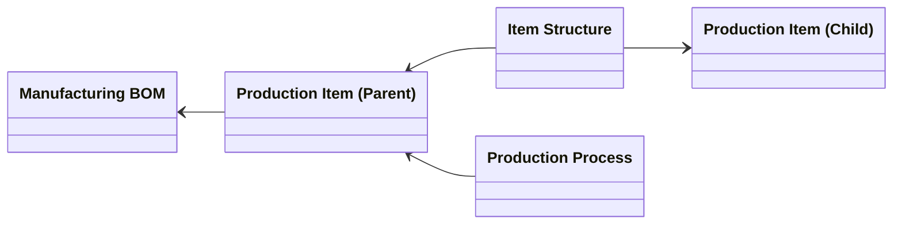
```mermaid
classDiagram
direction LR
    Manufacturing_BOM <-- Production_Item
    Production_Item <-- Item_Structure
    Production_Item <-- Production_Process
    Item_Structure --> Production_Item_Child
    class Manufacturing_BOM["Manufacturing BOM"]
    class Production_Item["Production Item (Parent)"]
    class Item_Structure["Item Structure"]
    class Production_Process["Production Process"]
    class Production_Item_Child["Production Item (Child)"]
```

Table 36 Manufacturing BOM (M-BOM)
| No. | Item Name | Entity | Attribute | Relationship |
|---:|---|---|---|---|
| 1 | Item Name | Production Item | Production Item Name | |
| 2 | Item Number | Production Item | Item Number | |
| 3 | Item Classification | Production Item | Production Item Classification | |
| 4 | Status | Production Item | Status | |
| 5 | Drawing Number | Production Item | Drawing Number | |
| 6 | Specification | Production Item | Specification | |
| 7 | Sequence Number | Item Structure | Sequence Number | * |
| 8 | Level | Item Structure | Level | * |
| 9 | Classification | Item Structure | Classification | * |
| 10 | Item Name | Item Structure | Production Item Name | * |
| 11 | Quantity per Unit | Item Structure | Quantity per Unit | * |
| 12 | Unit | Item Structure | Unit | * |
| 13 | Item Number | Production Item (Child) | Item Number | *2 |
| 14 | Drawing Number | Production Item (Child) | Drawing Number | *2 |
| 15 | Specification (Child) | Production Item (Child) | Specification | *2 |
| 16 | Process Name | Production Process | Process Name | *3 |
| 17 | Specification (Process) | Production Process | Specification (Process) | *3 |
| 18 | Quantity | Production Process | Quantity | *3 |
| 19 | Unit | Production Process | Unit | *3 |

#### Service BOM (S-BOM)
A BOM showing the composition of replacement parts for maintenance/service. A part system for inspection and repair.

Figure 17　Service BOM (S-BOM)
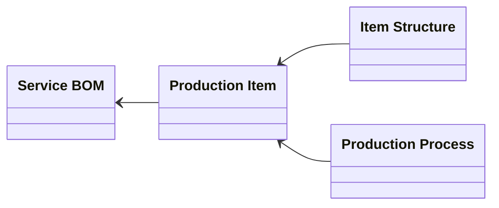
```mermaid
classDiagram
direction LR
    Service_BOM <-- Production_Item
    Production_Item <-- Item_Structure
    Production_Item <-- Production_Process
    class Service_BOM["Service BOM"]
    class Production_Item["Production Item"]
    class Item_Structure["Item Structure"]
    class Production_Process["Production Process"]
```

Table 37 Service BOM (S-BOM)
| No. | Item Name | Entity | Attribute | Relationship |
|---:|---|---|---|---|
| 1 | Item Name | Production Item | Production Item Name | |
| 2 | Item Number | Production Item | Item Number | |
| 3 | Item Classification | Production Item | Production Item Classification | |
| 4 | Status | Production Item | Status | |
| 5 | Service Number | Production Item | Drawing Number | |
| 6 | Service Specification | Production Item | Specification | |
| 7 | Service Name | Production Process | Production Process ID | *1 |
| 8 | Service Classification | Production Process | Production Process Classification | *1 |
| 9 | Service Content | Production Process | Production Process Name | *1 |
| 10 | Service Status | Production Process | Status | *1 |
| 11 | Quantity | Production Process | Quantity | *1 |
| 12 | Unit | Production Process | Unit | *1 |
| 13 | Sequence Number | Item Structure | Sequence Number | *2 |
| 14 | Classification | Item Structure | Item Structure Classification | *2 |
| 15 | Item Name | Item Structure | Production Item Name | *2 |
| 16 | Quantity per Unit | Item Structure | Quantity per Unit | *2 |
| 17 | Unit | Item Structure | Unit | *2 |

#### Bill of Process (BOP)
A table recording the process sequence, work content, conditions, man-hours, etc. needed for manufacturing. Has the role of deploying the BOM into processes.

Figure 18　Bill of Process (BOP)
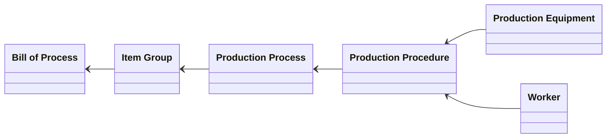
```mermaid
classDiagram
direction LR
    Bill_of_Process <-- Item_Group
    Item_Group <-- Production_Process
    Production_Process <-- Production_Procedure
    Production_Procedure <-- Production_Equipment
    Production_Procedure <-- Worker
    class Bill_of_Process["Bill of Process"]
    class Item_Group["Item Group"]
    class Production_Process["Production Process"]
    class Production_Procedure["Production Procedure"]
    class Production_Equipment["Production Equipment"]
    class Worker["Worker"]
```

Table 38 Bill of Process (BOP)
| No. | Item Name | Entity | Attribute | Relationship |
|---:|---|---|---|---|
| 1 | Item Name | Production Item | Item Name | - |
| 2 | Item Number | Production Item | Item Number | - |
| 3 | Sequence Number | Item Structure | Sequence Number | * |
| 4 | Level | Item Structure | Level | * |
| 5 | Classification | Item Structure | Item Structure Classification | * |
| 6 | Production Item | Item Structure | Child Production Item ID | * |
| 7 | Production Process | Item Structure | Production Process ID | * |
| 8 | Specification | Item Structure | Specification | * |
| 9 | Quantity per Unit | Item Structure | Quantity per Unit | * |
| 10 | Unit | Item Structure | Unit | * |
| 11 | Sequence Number | Production Procedure | Sequence Number | *2 |
| 12 | Procedure Name | Production Procedure | Production Procedure Name | *2 |
| 13 | Procedure Content | Production Procedure | Content | *2 |
| 14 | Production Man-hours | Production Procedure | Production Man-hours | *2 |
| 15 | Unit | Production Procedure | Unit | *2 |
| 16 | Equipment | Production Procedure | Equipment Group ID | *2 |
| 17 | Worker | Production Procedure | Worker Group ID | *2 |
| 18 | Equipment Number | Production Equipment | Equipment Number | *3 |
| 19 | Equipment Name | Production Equipment | Production Equipment Name | *3 |
| 20 | Specification | Production Equipment | Specification | *3 |
| 21 | Standard Capacity | Production Equipment | Standard Capacity | *3 |
| 22 | Worker Number | Worker | Worker Number | *4 |
| 23 | Worker Name | Worker | Worker Name | *4 |
| 24 | Specification | Worker | Specification | *4 |
| 25 | Standard Capacity | Worker | Standard Capacity | *4 |

### Procedure Information
Procedure information is information that defines the procedure, sequence, and judgment criteria for correctly and safely executing a business task or piece of work. It clarifies work content, execution conditions, precautions, and the equipment or jigs/tools used, suppressing variation in work between different people in charge.
Table 40　Procedure Information
| No. | Information Name | Product | Process | Equipment | Description |
|---:|---|:---:|:---:|:---:|---|
| 1 | QC Process Table | 〇 | 〇 |  | A table summarizing the work content, inspection items, control points, and equipment used for each process. A standard for building in quality. |
| 2 | Work Procedure Document | 〇 | 〇 | 〇 | A document summarizing the work method, procedure, tools used, and precautions. Aims to stabilize work quality and ensure safety. |
| 3 | Maintenance Procedure Document |  | 〇 | 〇 | A document showing the concrete procedure and precautions for equipment inspection, repair, and preventive maintenance. Used to improve equipment operation rate and prevent failures. |

#### QC Process Table
A table summarizing the work content, inspection items, control points, and equipment used for each process. A standard for building in quality.

Figure 19　QC Process Table
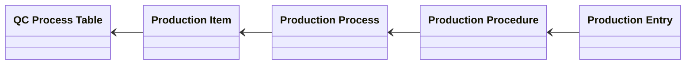
```mermaid
classDiagram
direction LR
    QC_Process_Table <-- Production_Item
    Production_Item <-- Production_Process
    Production_Process <-- Production_Procedure
    Production_Procedure <-- Production_Entry
    class QC_Process_Table["QC Process Table"]
    class Production_Item["Production Item"]
    class Production_Process["Production Process"]
    class Production_Procedure["Production Procedure"]
    class Production_Entry["Production Entry"]
```

Table 41 QC Process Table
| No. | Item Name | Entity | Attribute | Relationship |
|---:|---|---|---|---|
| 1 | Item Number | Production Item | Item Number | - |
| 2 | Item Name | Production Item | Production Item Name | - |
| 3 | Item Classification | Production Item | Production Item Classification | - |
| 4 | Process Number | Production Process | Process Number | |
| 5 | Process Name | Production Process | Production Process Name | |
| 6 | Site | Production Process | Site | |
| 7 | Sequence Number | Production Procedure | Sequence Number | *1 |
| 8 | Classification | Production Procedure | Classification | *1 |
| 9 | Procedure Name | Production Procedure | Procedure Name | *1 |
| 10 | Content | Production Procedure | Content | *1 |
| 11 | Quantity | Production Procedure | Quantity | *1 |
| 12 | Unit | Production Procedure | Unit | *1 |
| 13 | Production Line | Production Procedure | Production Line | *1 |
| 14 | Equipment Used | Production Procedure | Equipment Used | *1 |
| 15 | Worker | Production Procedure | Worker | *1 |
| 16 | Control Method | Production Procedure | Control Method | *1 |
| 17 | Inspection Method | Production Procedure | Inspection Method | *1 |
| 18 | Inspection Frequency | Production Procedure | Inspection Frequency | *1 |
| 19 | Remarks | Production Procedure | Remarks | *1 |
| 20 | Sequence Number | Production Entry | Sequence Number | *2 |
| 21 | Classification | Production Entry | Classification | *2 |
| 22 | Production Entry Name | Production Entry | Production Entry Name | *2 |
| 23 | Jig/Tool Name | Production Entry | Jig/Tool Name | *2 |

| 24 | Specification | Production Entry | Specification | *2 |
| 25 | Standard Value | Production Entry | Standard Value | *2 |
| 26 | Measured Value | Production Entry | Measured Value | *2 |
| 27 | Unit | Production Entry | Unit | *2 |

#### Work Procedure Document
A document summarizing the work method, procedure, tools used, and precautions. Aims to stabilize work quality and ensure safety.

Figure 20　Work Procedure Document
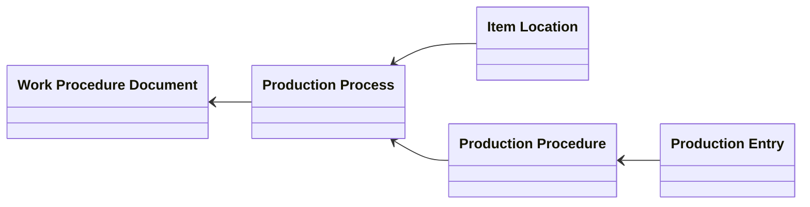
```mermaid
classDiagram
direction LR
    Work_Procedure_Document <-- Production_Process
    Production_Process <-- Item_Location
    Production_Process <-- Production_Procedure
    Production_Procedure <-- Production_Entry
    class Work_Procedure_Document["Work Procedure Document"]
    class Production_Process["Production Process"]
    class Item_Location["Item Location"]
    class Production_Procedure["Production Procedure"]
    class Production_Entry["Production Entry"]
```

Table 42 Work Procedure Document
| No. | Item Name | Entity | Attribute | Relationship |
|---:|---|---|---|---|
| 1 | Process Name | Production Process | Production Process Name | |
| 2 | Process Classification | Production Process | Production Process Classification | |
| 3 | Status | Production Process | Status | |
| 4 | Production Item | Production Process | Production Item ID | |
| 5 | Specification | Production Process | Specification | |
| 6 | Quantity | Production Process | Quantity | |
| 7 | Unit | Production Process | Unit | |
| 8 | Site | Production Process | Site ID | |
| 9 | Sequence Number | Production Procedure | Sequence Number | *1 |
| 10 | Procedure Name | Production Procedure | Production Procedure Name | *1 |
| 11 | Procedure Classification | Production Procedure | Production Procedure Classification | *1 |
| 12 | Procedure Content | Production Procedure | Content | *1 |
| 13 | Procedure Quantity | Production Procedure | Quantity | *1 |
| 14 | Unit | Production Procedure | Unit | *1 |
| 15 | Sequence Number | Production Entry | Sequence Number | *2 |
| 16 | Entry Classification | Production Entry | Production Entry Classification | *2 |
| 17 | Entry Content | Production Entry | Entry Content | *2 |
| 18 | Standard Value | Production Entry | Standard Value | *2 |
| 19 | Unit | Production Entry | Unit | *2 |
| 20 | Target Location | Production Entry | Item Location ID | *2 |

#### Maintenance Procedure Document
A document showing the concrete procedure and precautions for equipment inspection, repair, and preventive maintenance. Used to improve equipment operation rate and prevent failures.

Figure 21　Maintenance Procedure Document
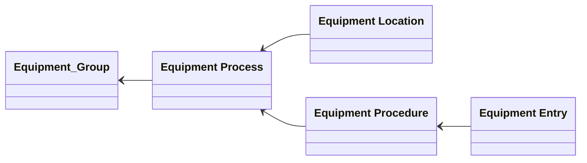
```mermaid
classDiagram
direction LR
    Equipment_Group <-- Equipment_Process
    Equipment_Process <-- Equipment_Location
    Equipment_Process <-- Equipment_Procedure
    Equipment_Procedure <-- Equipment_Entry
    class Equipment_Process["Equipment Process"]
    class Equipment_Location["Equipment Location"]
    class Equipment_Procedure["Equipment Procedure"]
    class Equipment_Entry["Equipment Entry"]
```

Table 44 Maintenance Procedure Document
| No. | Item Name | Entity | Attribute | Relationship |
|---:|---|---|---|---|
| 1 | Process Name | Equipment Process | Production Process Name | |
| 2 | Process Classification | Equipment Process | Production Process Classification | |
| 3 | Status | Equipment Process | Status | |
| 4 | Production Item | Equipment Process | Production Item ID | |
| 5 | Specification | Equipment Process | Specification | |
| 6 | Quantity | Equipment Process | Quantity | |
| 7 | Unit | Equipment Process | Unit | |
| 8 | Site | Equipment Process | Site ID | |
| 9 | Sequence Number | Equipment Procedure | Sequence Number | *1 |
| 10 | Procedure Name | Equipment Procedure | Production Procedure Name | *1 |
| 11 | Procedure Classification | Equipment Procedure | Production Procedure Classification | |
| 12 | Procedure Content | Equipment Procedure | Content | |
| 13 | Procedure Quantity | Equipment Procedure | Quantity | *1 |
| 14 | Unit | Equipment Procedure | Unit | *1 |
| 15 | Sequence Number | Equipment Entry | Sequence Number | *2 |
| 16 | Entry Classification | Equipment Entry | Production Entry Classification | *2 |
| 17 | Entry Content | Equipment Entry | Entry Content | *2 |
| 18 | Standard Value | Equipment Entry | Standard Value | *2 |
| 19 | Unit | Equipment Entry | Unit | *2 |
| 20 | Target Location | Equipment Entry | Equipment Location ID | *2 |

### Reference/Standard Information (Standard Information)
Reference information holding standard values and specifications for quality, process, equipment, etc. Changes infrequently and functions as the judgment criterion for other information.

Table 45　Reference/Standard Information
| No. | Information Name | Product | Process | Equipment | Description |
|---:|---|:---:|:---:|:---:|---|
| 1 | Quality Control Standard Table | 〇 | 〇 |  | A standard showing the control items, target values, and monitoring method for maintaining/improving quality. Aims to unify process quality. |
| 2 | Equipment Maintenance Standard Table |  | 〇 | 〇 | A standard prescribing the inspection items, cycle, allowable values, and maintenance method of equipment. Used to prevent failures and maintain operation rate. |
| 3 | Environment/Safety Standard Table | 〇 | 〇 | 〇 | A table summarizing standards for the work environment, safety measures, chemical substance management, etc. Ensures environmental conservation and worker safety. |

#### Quality Control Standard Table
A standard showing the control items, target values, and monitoring method for maintaining/improving quality. Aims to unify process quality.

Figure 22　Quality Control Standard Table
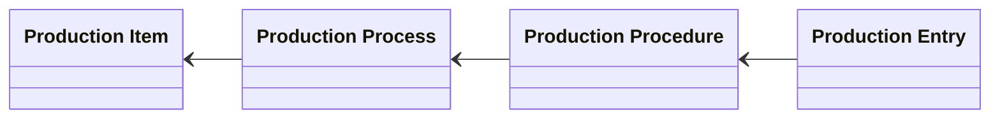
```mermaid
classDiagram
direction LR
    Production_Item <-- Production_Process
    Production_Process <-- Production_Procedure
    Production_Procedure <-- Production_Entry
    class Production_Item["Production Item"]
    class Production_Process["Production Process"]
    class Production_Procedure["Production Procedure"]
    class Production_Entry["Production Entry"]
```

Table 46　Quality Control Standard Table
| No. | Item Name | Entity | Attribute | Relationship |
|---:|---|---|---|---|
| 1 | Item Number | Production Item | Item Number | |
| 2 | Item Name | Production Item | Production Item Name | |
| 3 | Item Classification | Production Item | Production Item Classification | |
| 4 | Status | Production Item | Status | |
| 5 | Drawing Number | Production Item | Drawing Number | |
| 6 | Quality Specification | Production Item | Specification | |
| 7 | Sequence Number | Production Procedure | Sequence Number | *1 |
| 8 | Procedure Name | Production Procedure | Production Procedure Name | *1 |
| 9 | Procedure Classification | Production Procedure | Production Procedure Classification | *1 |
| 10 | Procedure Content | Production Procedure | Content | *1 |
| 11 | Control Method | Production Procedure | Control Method | *1 |
| 12 | Inspection Method | Production Procedure | Inspection Method | *1 |
| 13 | Standard Quantity | Production Procedure | Quantity | *1 |
| 14 | Unit | Production Procedure | Unit | *1 |
| 15 | Sequence Number | Production Entry | Sequence Number | *2 |
| 16 | Entry Classification | Production Entry | Production Entry Classification | *2 |
| 17 | Entry Name | Production Entry | Production Entry Name | *2 |
| 18 | Inspection Specification | Production Entry | Specification | *2 |
| 19 | Inspection Standard | Production Entry | Quantity | *2 |
| 20 | Unit | Production Entry | Unit | *2 |
| 21 | Item Location | Production Entry | Item Location ID | *2 |

#### Equipment Maintenance Standard Table
A standard prescribing the inspection items, cycle, allowable values, and maintenance method of equipment. Used to prevent failures and maintain operation rate.

Figure 23　Equipment Maintenance Standard Table
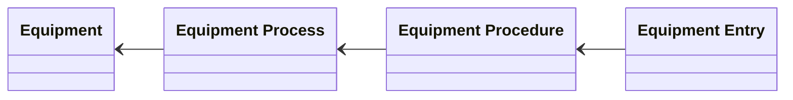
```mermaid
classDiagram
direction LR
    Equipment <-- Equipment_Process
    Equipment_Process <-- Equipment_Procedure
    Equipment_Procedure <-- Equipment_Entry
    class Equipment["Equipment"]
    class Equipment_Process["Equipment Process"]
    class Equipment_Procedure["Equipment Procedure"]
    class Equipment_Entry["Equipment Entry"]
```

Table 47 Equipment Maintenance Standard Table
| No. | Item Name | Entity | Attribute | Relationship |
|---:|---|---|---|---|
| 1 | Equipment Number | Production Equipment | Equipment Number | |
| 2 | Equipment Name | Production Equipment | Production Equipment Name | |
| 3 | Equipment Classification | Production Equipment | Production Equipment Classification | |
| 4 | Status | Production Equipment | Status | |
| 5 | Quality Specification | Production Equipment | Specification | |
| 6 | Sequence Number | Equipment Procedure | Sequence Number | *1 |
| 7 | Procedure Name | Equipment Procedure | Equipment Procedure Name | *1 |
| 8 | Procedure Classification | Equipment Procedure | Equipment Procedure Classification | *1 |
| 9 | Procedure Content | Equipment Procedure | Content | *1 |
| 10 | Control Method | Equipment Procedure | Control Method | *1 |
| 11 | Inspection Method | Equipment Procedure | Inspection Method | *1 |
| 12 | Standard Quantity | Equipment Procedure | Quantity | *1 |
| 13 | Unit | Equipment Procedure | Unit | *1 |
| 14 | Sequence Number | Equipment Entry | Sequence Number | *2 |
| 15 | Entry Classification | Equipment Entry | Equipment Entry Classification | *2 |
| 16 | Entry Name | Equipment Entry | Equipment Entry Name | *2 |
| 17 | Inspection Specification | Equipment Entry | Specification | *2 |
| 18 | Inspection Standard | Equipment Entry | Quantity | *2 |
| 19 | Unit | Equipment Entry | Unit | *2 |
| 20 | Equipment Location | Equipment Entry | Equipment Location ID | *2 |

#### Environment/Safety Standard Table
A table summarizing standards for the work environment, safety measures, chemical substance management, etc. Ensures environmental conservation and worker safety.

Figure 24　Environment/Safety Standard Table
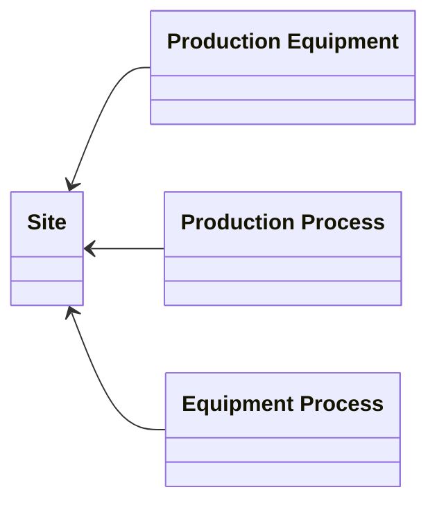
```mermaid
classDiagram
direction LR
    Site <-- Production_Equipment
    Site <-- Production_Process
    Site <-- Equipment_Process
    class Site["Site"]
    class Production_Equipment["Production Equipment"]
    class Production_Process["Production Process"]
    class Equipment_Process["Equipment Process"]
```

Table 48 Environment/Safety Standard Table
| No. | Item Name | Entity | Attribute | Relationship |
|---:|---|---|---|---|
| 1 | Site Name | Site | Site Name | |
| 2 | Safety Specification | Site | Specification | |
| 3 | Location | Site | Location | |
| 4 | Status | Site | Status | |
| 5 | Production Process | Production Process | Production Process Name | *1 |
| 6 | Process Classification (Production Process) | Production Process | Production Process Classification | *1 |
| 7 | Measurement Specification | Production Process | Specification | *1 |
| 8 | Standard Value | Production Process | Quantity | *1 |
| 9 | Unit | Production Process | Unit | *1 |
| 10 | Maintenance Process | Equipment Process | Equipment Process Name | *2 |
| 11 | Process Classification (Maintenance Process) | Equipment Process | Equipment Process Classification | *2 |
| 12 | Required Specification (Maintenance Process) | Equipment Process | Specification | *2 |
| 13 | Standard Value (Maintenance Process) | Equipment Process | Quantity | *2 |
| 14 | Unit (Maintenance Process) | Equipment Process | Unit | *2 |

<a id="73-技術情報"></a>
## 7.3. Technical Information
### Deployment Information (Deployment Information)
Transformation-type information that digs deeper into information about products, processes, and equipment along more individualized management methods, and presents a new view by deploying that information and showing correspondences among it. Each has its own defined notation rules (e.g., QFD, FMEA, etc.).
Table 49　Deployment Information
| No. | Information Name | Product | Process | Equipment | Description |
|---:|---|:---:|:---:|:---:|---|
| 1 | Quality Function Deployment Table (QFD) | 〇 | 〇 | 〇 | A table that systematically deploys customer requirements into design elements and evaluates their importance. Ensures design quality is reliably reflected. |
| 2 | Fault Tree Analysis Table (FTA) |  | 〇 | 〇 | An analysis diagram that logically pursues the causes of a failure in a tree structure. Clarifies the root cause of a serious failure. |
| 3 | Design FMEA | 〇 | 〇 |  | A method for predicting potential defects at the design stage and organizing causes, effects, and countermeasures. Reduces design risk. |
| 4 | Process FMEA |  | 〇 | 〇 | A method for analyzing possible defects or abnormalities in the manufacturing process, prioritizing them, and examining countermeasures. Strengthens process quality. |

#### Quality Function Deployment Table (QFD)
A table that systematically deploys customer requirements into design elements and evaluates their importance. Ensures design quality is reliably reflected.

Figure 25　Quality Function Deployment Table
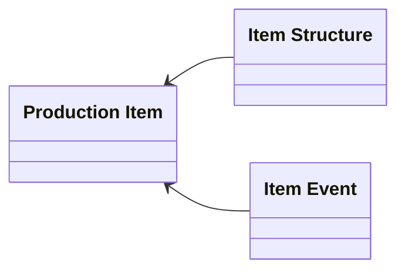
```mermaid
classDiagram
direction LR
    Production_Item <-- Item_Structure
    Production_Item <-- Item_Event
    class Production_Item["Production Item"]
    class Item_Structure["Item Structure"]
    class Item_Event["Item Event"]
```


Table 50 Quality Function Deployment Table (QFD)
| No. | Item Name | Entity | Attribute | Relationship |
|---:|---|---|---|---|
| 1 | Item Number | Production Item | Item Number | |
| 2 | Item Name | Production Item | Item Name | |
| 3 | Item Classification | Production Item | Item Classification | |
| 4 | Status | Production Item | Status | |
| 5 | Specification | Production Item | Specification | |
| 6 | Function Name | Item Function | Item Function Name | |
| 7 | Quality Characteristic | Item Function | Quality Function Classification | |
| 8 | Standard Quantity | Item Function | Quantity | |
| 9 | Unit | Item Function | Unit | |
| 10 | Requirement Name | Item Event | Item Event Name | |
| 11 | Requirement Classification | Item Event | Item Event Classification | |
| 12 | Status | Item Event | Status | |
| 13 | Correlation Degree | Item Event × Item Function | Correlation Degree | |
| 14 | Importance | Item Event × Item Function | Importance | |

#### Fault Tree Analysis Table
An analysis diagram that logically pursues the causes of a failure in a tree structure. Clarifies the root cause of a serious failure.

Figure 26　Fault Tree Analysis Table
```mermaid
classDiagram
direction LR
    Equipment <-- Equipment_Countermeasure
    Equipment <-- Equipment_Event_Parent
    Equipment <-- Equipment_Event_Child
    class Equipment["Equipment"]
    class Equipment_Countermeasure["Equipment Countermeasure"]
    class Equipment_Event_Parent["Equipment Event (Parent)"]
    class Equipment_Event_Child["Equipment Event (Child)"]
```

Table 51 Fault Tree Analysis Table (FTA)
| No. | Item Name | Entity | Attribute | Relationship |
|---:|---|---|---|---|
| 1 | Equipment Number | Production Equipment | Equipment Number | |
| 2 | Equipment Name | Production Equipment | Production Equipment Name | |
| 3 | Equipment Classification | Production Equipment | Production Equipment Classification | |
| 4 | Specification | Production Equipment | Specification | |
| 5 | Status | Production Equipment | Status | |
| 6 | Event Name | Equipment Event | Equipment Event Name | *1 |
| 7 | Logical Relationship | Equipment Event | Logical Relationship | *1 |
| 8 | Probability | Equipment Event | Probability | *1 |
| 9 | Fact | Equipment Event | Fact | *1 |
| 10 | Issue | Equipment Event | Issue | *1 |
| 11 | Cause | Equipment Event | Cause | *1 |
| 12 | Event Name (Child) | Equipment Event (Child) | Equipment Event Name | *2 |
| 13 | Logical Relationship (Child) | Equipment Event (Child) | Logical Relationship | *2 |
| 14 | Probability (Child) | Equipment Event (Child) | Probability | *2 |
| 15 | Fact (Child) | Equipment Event (Child) | Fact | *2 |
| 16 | Issue (Child) | Equipment Event (Child) | Issue | *2 |
| 17 | Cause (Child) | Equipment Event (Child) | Cause | *2 |
| 18 | Countermeasure Name | Equipment Countermeasure | Equipment Countermeasure Name | *3 |
| 19 | Status | Equipment Countermeasure | Status | *3 |
| 20 | Countermeasure | Equipment Countermeasure | Countermeasure | *3 |
| 21 | Result | Equipment Countermeasure | Result | *3 |
| 22 | Completion Date/Time | Equipment Countermeasure | Completion Date/Time | *3 |

#### Design FMEA
A method for predicting potential defects at the design stage and organizing causes, effects, and countermeasures. Reduces design risk.

Figure 27　Design FMEA
```mermaid
classDiagram
direction LR
    Production_Item <-- Item_Function
    Production_Item <-- Item_Event
    Item_Event <-- Item_Countermeasure
    class Production_Item["Production Item"]
    class Item_Function["Item Function"]
    class Item_Event["Item Event"]
    class Item_Countermeasure["Item Countermeasure"]
```

Table 52 Design FMEA
| No. | Item Name | Entity | Attribute | Relationship |
|---:|---|---|---|---|
| 1 | Item Number | Production Item | Item Number | |
| 2 | Item Name | Production Item | Item Name | |
| 3 | Item Classification | Production Item | Item Classification | |
| 4 | Status | Production Item | Status | |
| 5 | Drawing Number | Production Item | Drawing Number | |
| 6 | Specification | Production Item | Specification | |
| 7 | Item Function Name | Item Function | Item Function Name | *1 |
| 8 | Status | Item Function | Status | *1 |
| 9 | Failure Mode | Item Function | Failure Mode | *1 |
| 10 | Effect | Item Function | Effect | *1 |
| 11 | Cause | Item Function | Cause | *1 |
| 12 | Control | Item Function | Control | *1 |
| 13 | Severity | Item Function | Severity | *1 |
| 14 | Occurrence Frequency | Item Function | Occurrence Frequency | *1 |
| 15 | Detectability | Item Function | Detectability | *1 |
| 16 | Priority (RPN) | Item Function | Priority (RPN) | *1 |
| 17 | Business Name | Item Event | Business Name | * |
| 18 | Business Classification | Item Event | Business Classification | * |
| 19 | Status | Item Event | Status | * |
| 20 | Fact | Item Event | Fact | * |
| 21 | Issue | Item Event | Issue | * |
| 22 | Cause | Item Event | Cause | * |
| 23 | Sequence Number | Item Countermeasure | Sequence Number | *2 |
| 24 | Countermeasure Name | Item Countermeasure | Process Countermeasure Name | *2 |
| 25 | Countermeasure Classification | Item Countermeasure | Process Countermeasure Classification | *2 |
| 26 | Status | Process Countermeasure | Status | *2 |
| 27 | Countermeasure | Item Countermeasure | Countermeasure | *2 |
| 28 | Result | Item Countermeasure | Result | *2 |
| 29 | Start Date/Time | Item Countermeasure | Start Date/Time | *2 |
| 30 | Completion Date/Time | Item Countermeasure | Completion Date/Time | *2 |
| 31 | Worker | Item Countermeasure | Worker ID | *2 |

#### Process FMEA
A method for analyzing possible defects or abnormalities in the manufacturing process, prioritizing them, and examining countermeasures. Strengthens process quality.

Figure 28　Process FMEA
```mermaid
classDiagram
direction LR
    Production_Process <-- Process_Function
    Production_Process <-- Process_Event
    Process_Event <-- Process_Countermeasure
    class Production_Process["Production Process"]
    class Process_Function["Process Function"]
    class Process_Event["Process Event"]
    class Process_Countermeasure["Process Countermeasure"]
```

Table 53 Process FMEA
| No. | Item Name | Entity | Attribute | Relationship |
|---:|---|---|---|---|
| 1 | Process Number | Production Process | Item Number | |
| 2 | Process Name | Production Process | Item Name | |
| 3 | Process Classification | Production Process | Item Classification | |
| 4 | Status | Production Process | Status | |
| 5 | Drawing Number | Production Process | Drawing Number | |
| 6 | Specification | Production Process | Specification | |
| 7 | Function Name | Process Function | Item Function Name | *1 |
| 8 | Status | Process Function | Status | *1 |
| 9 | Failure Mode | Process Function | Failure Mode | *1 |
| 10 | Effect | Process Function | Effect | *1 |
| 11 | Cause | Process Function | Cause | *1 |
| 12 | Control | Process Function | Control | *1 |
| 13 | Severity | Process Function | Severity | *1 |
| 14 | Occurrence Frequency | Process Function | Occurrence Frequency | *1 |
| 15 | Detectability | Process Function | Detectability | *1 |
| 16 | Priority (RPN) | Process Function | Priority (RPN) | *1 |
| 17 | Business Name | Process Event | Business Name | * |
| 18 | Business Classification | Process Event | Business Classification | * |
| 19 | Status | Process Event | Status | * |
| 20 | Fact | Process Event | Fact | * |
| 21 | Issue | Process Event | Issue | * |
| 22 | Cause | Process Event | Cause | * |
| 23 | Sequence Number | Process Countermeasure | Sequence Number | *2 |
| 24 | Countermeasure Name | Process Countermeasure | Process Countermeasure Name | *2 |
| 25 | Countermeasure Classification | Process Countermeasure | Process Countermeasure Classification | *2 |
| 26 | Status | Process Countermeasure | Status | *2 |
| 27 | Countermeasure | Process Countermeasure | Countermeasure | *2 |
| 28 | Result | Process Countermeasure | Result | *2 |
| 29 | Start Date/Time | Process Countermeasure | Start Date/Time | *2 |
| 30 | Completion Date/Time | Process Countermeasure | Completion Date/Time | *2 |
| 31 | Worker | Process Countermeasure | Worker ID | *2 |

### Linkage Information (Item/Material Identification Information)
Tracking information consisting of the location, status, and identification information of parts or work-in-process. Primarily takes the form of physical item tags, barcodes, ID tags, etc.

Table 54　Linkage Information
| No. | Information Name | Product | Process | Equipment | Description |
|---:|---|:---:|:---:|:---:|---|
| 1 | Bill of Assets (BOA) |  | 〇 | 〇 | Data representing the structure, capacity, and equipment hierarchy of a plant or equipment. Positioned as the plant model that executes the BOP. |
| 2 | Value Stream Map (VSM) |  | 〇 |  | A diagram that visualizes the flow of things and the flow of information between processes, identifying waste and bottlenecks. The basis for improvement activities. |
| 3 | Traceability Table | 〇 | 〇 | 〇 | A table recorded so that parts, processes, and work history can be traced. Essential for tracing the cause when a quality problem occurs. |

#### Bill of Assets (BOA)
Data representing the structure, capacity, and equipment hierarchy of a plant or equipment. Positioned as the plant model that executes the BOP.

Figure 29　Bill of Assets
```mermaid
classDiagram
direction LR
 Production_Line <-- Equipment_Group
 Equipment_Parent --> Equipment_Group 
 Equipment_Structure --> Equipment_Parent
 Equipment_Structure --> Equipment_Child
 Equipment_Parent <-- Equipment_Assignment
 Worker <-- Equipment_Assignment
    

```

Table 39 Bill of Assets (BOA)
| No. | Item Name | Entity | Attribute | Relationship |
|---:|---|---|---|---|
| 1 | Equipment Name | Production Equipment | Production Equipment Name | * |
| 2 | Equipment Number | Production Equipment | Equipment Number | * |
| 3 | Location | Production Equipment | Location | * |
| 4 | Specification | Production Equipment | Specification | * |
| 5 | Standard Capacity | Production Equipment | Standard Capacity | * |
| 6 | Unit | Production Equipment | Unit | * |
| 7 | Area | Production Line | Area ID | |
| 8 | Production Line | Production Line | Production Line Name | |
| 9 | Equipment Classification | Equipment Group | Equipment Group Classification | |
| 10 | Equipment Group | Equipment Group | Equipment Group Name | |
| 11 | Equipment Number (Child) | Equipment Structure | Child Production Equipment ID | *1 |
| 12 | Equipment Name (Child) | Equipment Structure | Equipment Structure Name | *1 |
| 13 | Specification (Child) | Equipment Structure | Specification | *1 |
| 14 | Quantity per Unit | Equipment Structure | Quantity per Unit | *1 |
| 15 | Unit (Child) | Equipment Structure | Unit | *1 |
| 16 | Jig/Tool Name | Jig/Tool | Jig/Tool Name | *2 |
| 17 | Specification (Jig/Tool) | Jig/Tool | Specification | *2 |
| 18 | Quantity (Jig/Tool) | Jig/Tool | Quantity | *2 |
| 19 | Unit (Jig/Tool) | Jig/Tool | Unit | *2 |
| 20 | Location (Jig/Tool) | Jig/Tool | Location | *2 |
| 21 | Worker Skill Name | Worker Skill | Worker Skill Name | *3 |
| 22 | Worker Number | Worker Skill | Worker ID | *3 |
| 23 | Required Skill | Worker Skill | Specification | *3 |
| 24 | Quantity (Worker) | Worker Skill | Quantity | *3 |
| 25 | Unit (Worker) | Worker Skill | Unit | *3 |

#### Value Stream Map
A diagram that visualizes the flow of things and the flow of information between processes, identifying waste and bottlenecks. The basis for improvement activities.

Figure 30　Value Stream Map
```mermaid
classDiagram
direction LR
Production_Item_Product <-- Sales_Order 
Production_Item <-- Production_Order
Production_Item_Material <-- Purchase_Order 


Production_Item_Product <-- Item_Structure 
Production_Item <-- Item_Structure
Production_Item <-- Item_Structure2
Production_Item_Material <-- Item_Structure2

Production_Order --> Production_Process
```
  
    

Table 55 Value Stream Map (VSM)
| No. | Item Name | Entity | Attribute | Relationship |
|---:|---|---|---|---|
| 1 | Production Item | Sales Order | Production Item ID | |
| 2 | Shipment Date/Time | Sales Order | Shipment Date/Time | |
| 3 | Quantity | Sales Order | Quantity | |
| 4 | Unit | Sales Order | Unit | |
| 5 | Sales Order | Production Order | Sales Order ID | *1 |
| 6 | Production Item | Production Order | Production Item | *1 |
| 7 | End Date/Time | Production Order | End Date/Time | *1 |
| 8 | Production Process | Production Order | Production Process ID | *1 |
| 9 | Location | Production Order | Location | *1 |
| 10 | Quantity | Production Order | Quantity | *1 |
| 11 | Unit | Production Order | Unit | *1 |
| 12 | Production Order | Purchase Order | Production Order ID | *2 |
| 13 | Production Item | Purchase Order | Production Item | *2 |
| 14 | Receipt Date/Time | Purchase Order | Receipt Date/Time | *2 |
| 15 | Quantity | Purchase Order | Quantity | *2 |
| 16 | Unit | Purchase Order | Unit | *2 |
| 17 | Item Number | Production Item | Item Number | |
| 18 | Item Name | Production Item | Production Item Name | |
| 19 | Status | Production Item | Status | |
| 20 | Quantity | Production Item | Quantity | |
| 21 | Unit | Production Item | Unit | |
| 22 | Process Number | Production Process | Process Number | *1 |
| 23 | Process Name | Production Process | Production Process Name | *1 |
| 24 | Status | Production Process | Status | *1 |
| 25 | Quantity | Production Process | Quantity | *1 |
| 26 | Unit | Production Process | Unit | *1 |
| 27 | Parent Production Item | Item Structure | Parent Production Item ID | *2 |
| 28 | Child Production Item | Item Structure | Child Production Item ID | *2 |
| 29 | Status | Item Structure | Status | *2 |
| 30 | Quantity per Unit | Item Structure | Quantity per Unit | *2 |
| 31 | Unit | Item Structure | Unit | *2 |

#### Traceability Table
A table recorded so that parts, processes, and work history can be traced. Essential for tracing the cause when a quality problem occurs.

Figure 31　Traceability Table
```mermaid
classDiagram
direction LR
Production_Item_Product <-- Sales_Order 
Production_Item <-- Production_Order
Production_Item_Material <-- Purchase_Order 


Production_Item_Product <-- Item_Structure 
Production_Item <-- Item_Structure
Production_Item <-- Item_Structure2
Production_Item_Material <-- Item_Structure2

Production_Order --> Production_Process
```

Table 56 Traceability Table
| No. | Item Name | Entity | Attribute | Relationship |
|---:|---|---|---|---|
| 1 | Production Item | Sales Order | Production Item ID | |
| 2 | Shipment Date/Time | Sales Order | Shipment Date/Time | |
| 3 | Quantity | Sales Order | Quantity | |
| 4 | Unit | Sales Order | Unit | |
| 5 | Sales Order | Production Order | Sales Order ID | *1 |
| 6 | Production Item | Production Order | Production Item | *1 |
| 7 | End Date/Time | Production Order | End Date/Time | *1 |
| 8 | Production Process | Production Order | Production Process ID | *1 |
| 9 | Location | Production Order | Location | *1 |
| 10 | Quantity | Production Order | Quantity | *1 |
| 11 | Unit | Production Order | Unit | *1 |
| 12 | Production Order | Purchase Order | Production Order ID | *2 |
| 13 | Production Item | Purchase Order | Production Item | *2 |
| 14 | Receipt Date/Time | Purchase Order | Receipt Date/Time | *2 |
| 15 | Quantity | Purchase Order | Quantity | *2 |
| 16 | Unit | Purchase Order | Unit | *2 |
| 17 | Item Number | Production Item | Item Number | |
| 18 | Item Name | Production Item | Production Item Name | |
| 19 | Status | Production Item | Status | |
| 20 | Quantity | Production Item | Quantity | |
| 21 | Unit | Production Item | Unit | |
| 22 | Process Number | Production Process | Process Number | *1 |
| 23 | Process Name | Production Process | Production Process Name | *1 |
| 24 | Status | Production Process | Status | *1 |
| 25 | Quantity | Production Process | Quantity | *1 |
| 26 | Unit | Production Process | Unit | *1 |
| 27 | Parent Production Item | Item Structure | Parent Production Item ID | *2 |
| 28 | Child Production Item | Item Structure | Child Production Item ID | *2 |
| 29 | Status | Item Structure | Status | *2 |
| 30 | Quantity per Unit | Item Structure | Quantity per Unit | *2 |
| 31 | Unit | Item Structure | Unit | *2 |

### Quality Information (Instruction Information)
Execution-instruction-type information specifying the content to be executed on the shop floor. Operational data that concretizes plan information, such as quantity, delivery date, and equipment. Inspections and checks are also covered.
Table 57　Quality Information
| No. | Information Name | Product | Process | Equipment | Description |
|---:|---|:---:|:---:|:---:|---|
| 1 | Product Inspection Table | 〇 |  |  | A table recording the inspection items, criteria, and results for a finished product. Used to manage quality assurance and shipment judgment. |
| 2 | Material Inspection Table | 〇 |  |  | A table recording the inspection items, specifications, and results for received materials. Used to ensure quality and prevent defective materials from entering the process. |
| 3 | Equipment Inspection Table |  |  | 〇 | A table recording the inspection items, cycle, allowable values, and results for equipment/machinery. Used to prevent failures and manage stable operation. |

#### Product Inspection Table
A table recording the inspection items, criteria, and results for a finished product. Used to manage quality assurance and shipment judgment.

Figure 32　Product Inspection Table
```mermaid
classDiagram
direction LR
    Production_Item <-- Production_Procedure
    Production_Procedure <-- Production_Entry
    Production_Item <-- Production_Document
```

Table 59 Product Inspection Table
| No. | Item Name | Entity | Attribute | Relationship |
|---:|---|---|---|---|
| 1 | Item Number | Production Item | Item Number | |
| 2 | Drawing Number | Production Item | Drawing Number | |
| 3 | Item Name | Production Item | Production Item Name | |
| 4 | Specification | Production Item | Specification | |
| 5 | Inspection Drawing | Item Document | File | |
| 6 | Sequence Number | Production Procedure | Sequence Number | * |
| 7 | Procedure Name | Production Procedure | Production Procedure Name | *1 |
| 8 | Procedure Classification | Production Procedure | Production Procedure Classification | *1 |
| 9 | Control Method | Production Procedure | Control Method | *1 |
| 10 | Inspection Method | Production Procedure | Inspection Method | *1 |
| 11 | Procedure Content | Production Procedure | Procedure Content | *1 |
| 12 | Standard Quantity | Production Procedure | Quantity | *1 |
| 13 | Unit | Production Procedure | Unit | *1 |
| 14 | Sequence Number | Production Entry | Sequence Number | *2 |
| 15 | Entry Name | Production Entry | Production Entry Name | *2 |
| 16 | Entry Classification | Production Entry | Production Entry Classification | *2 |
| 17 | Location Name | Production Entry | Production Location ID | *2 |
| 18 | Jig/Tool | Production Entry | Jig/Tool ID | *2 |
| 19 | Entry Content | Production Entry | Specification | *2 |
| 20 | Standard Value | Production Entry | Quantity | *2 |
| 21 | Measured Value | Production Entry | Measured Value | *2 |
| 22 | Unit | Production Entry | Unit | *2 |

#### Material Inspection Table
A table recording the inspection items, specifications, and results for received materials. Used to ensure quality and prevent defective materials from entering the process.

Figure 33　Material Inspection Table
```mermaid
classDiagram
direction LR
    Production_Item <-- Production_Procedure
    Production_Procedure <-- Production_Entry
    Production_Item <-- Production_Document
```

Table 60 Material Inspection Table
| No. | Item Name | Entity | Attribute | Relationship |
|---:|---|---|---|---|
| 1 | Item Number | Production Item | Item Number | |
| 2 | Drawing Number | Production Item | Drawing Number | |
| 3 | Item Name | Production Item | Production Item Name | |
| 4 | Specification | Production Item | Specification | |
| 5 | Inspection Drawing | Item Document | File | |
| 6 | Sequence Number | Production Procedure | Sequence Number | * |
| 7 | Procedure Name | Production Procedure | Production Procedure Name | *1 |
| 8 | Procedure Classification | Production Procedure | Production Procedure Classification | *1 |
| 9 | Control Method | Production Procedure | Control Method | *1 |
| 10 | Inspection Method | Production Procedure | Inspection Method | *1 |
| 11 | Procedure Content | Production Procedure | Procedure Content | *1 |
| 12 | Standard Quantity | Production Procedure | Quantity | *1 |
| 13 | Unit | Production Procedure | Unit | *1 |
| 14 | Sequence Number | Production Entry | Sequence Number | *2 |
| 15 | Entry Name | Production Entry | Production Entry Name | *2 |
| 16 | Entry Classification | Production Entry | Production Entry Classification | *2 |
| 17 | Location Name | Production Entry | Production Location ID | *2 |
| 18 | Jig/Tool | Production Entry | Jig/Tool ID | *2 |
| 19 | Entry Content | Production Entry | Specification | *2 |
| 20 | Standard Value | Production Entry | Quantity | *2 |
| 21 | Measured Value | Production Entry | Measured Value | *2 |
| 22 | Unit | Production Entry | Unit | *2 |

#### Equipment Inspection Table
A table recording the inspection items, cycle, allowable values, and results for equipment/machinery. Used to prevent failures and manage stable operation.

Figure 34　Equipment Inspection Table
```mermaid
classDiagram
direction LR
    Equipment <-- Equipment_Procedure
    Equipment_Procedure <-- Equipment_Entry
```

Table 58 Equipment Inspection Table
| No. | Item Name | Entity | Attribute | Relationship |
|---:|---|---|---|---|
| 1 | Production Line | Production Equipment | Production Line ID | |
| 2 | Equipment Number | Production Equipment | Equipment Number | |
| 3 | Equipment Name | Production Equipment | Production Equipment Name | |
| 4 | Specification | Production Equipment | Specification | |
| 5 | Inspection Drawing | Equipment Document | File | |
| 6 | Sequence Number | Equipment Procedure | Sequence Number | * |
| 7 | Procedure Name | Equipment Procedure | Equipment Procedure Name | *1 |
| 8 | Inspection Classification | Equipment Procedure | Equipment Procedure Classification | *1 |
| 9 | Control Method | Equipment Procedure | Control Method | *1 |
| 10 | Inspection Method | Equipment Procedure | Inspection Method | *1 |
| 11 | Procedure Content | Equipment Procedure | Procedure Content | *1 |
| 12 | Inspection Cycle | Equipment Procedure | Inspection Cycle | *1 |
| 13 | Standard Quantity | Equipment Procedure | Quantity | *1 |
| 14 | Unit | Equipment Procedure | Unit | *1 |
| 15 | Sequence Number | Equipment Entry | Sequence Number | *2 |
| 16 | Entry Name | Equipment Entry | Equipment Entry Name | *2 |
| 17 | Entry Classification | Equipment Entry | Equipment Entry Classification | *2 |
| 18 | Location Name | Equipment Entry | Equipment Location ID | *2 |
| 19 | Jig/Tool | Equipment Entry | Jig/Tool ID | *2 |
| 20 | Entry Content | Equipment Entry | Specification | *2 |
| 21 | Standard Value | Equipment Entry | Quantity | *2 |
| 22 | Measured Value | Equipment Entry | Measured Value | *2 |
| 23 | Unit | Equipment Entry | Unit | *2 |

<a id="74-管理情報"></a>
## 7.4. Management Information
### Schedule Information
Information that organizes and manages, on a time axis, activities such as work, processes, and maintenance so that business or production activities are executed in a planned and reliable manner. By consistently visualizing everything from the overall plan down to the execution level, it facilitates grasping progress and coordinating, supporting delay prevention and effective use of resources.

Table 61　Schedule Information
| No. | Information Name | Product | Process | Equipment | Description |
|---:|---|:---:|:---:|:---:|---|
| 1 | Master Production Schedule (MPS) | 〇 |  |  | A plan showing the production volume and timing of major items at the monthly-to-weekly level. Forms the basis for material and capacity planning. |
| 2 | Production Schedule (Detailed Schedule) | 〇 | 〇 |  | A plan showing the work sequence by process and by production line, on a daily or shift basis. Forms the basis of execution management for shop-floor work. |
| 3 | Maintenance Schedule Table |  | 〇 | 〇 | A table planning the timing, method, and required resources for equipment inspection, repair, and preventive maintenance. Management material for maintaining stable operation. |
| 4 | Work Breakdown Structure (WBS) |  | 〇 |  | A table that hierarchically decomposes work and organizes process, period, and responsibility. Used for planning development and equipment introduction. |

#### Master Production Schedule (MPS)
A plan showing the production volume and timing of major items at the monthly-to-weekly level. Forms the basis for material and capacity planning.

Figure 35　Master Production Schedule
```mermaid
classDiagram
direction LR
    Sales_Order <-- Production_Order
    Sales_Order --> Production_Item
    Production_Order --> Production_Item
    Production_Item <-- Production_Plan
```


Table 62　Master Production Schedule (MPS)
| No. | Item Name | Entity | Attribute | Relationship |
|---:|---|---|---|---|
| 1 | Sales Order | Sales Order | Sales Order Name | |
| 2 | Content (Sales Order) | Sales Order × Date | Content (Sales Order) | ** |
| 3 | Status | Production Order | Status | -1 |
| 4 | Production Item | Production Order | Production Item ID | -1 |
| 5 | Requested Date/Time | Production Order | Requested Date/Time | -1 |
| 6 | Content | Production Order | Content | -1 |
| 7 | Quantity | Production Order | Quantity | -1 |
| 8 | Unit | Production Order | Unit | -1 |
| 9 | Start Date/Time | Production Order | Start Date/Time | -1 |
| 10 | End Date/Time | Production Order | End Date/Time | -1 |
| 11 | Item Group | Item Group | Item Group ID | |
| 12 | Content (Item Group) | Item Group × Date | Content | ** |
| 13 | Item Group | Production Plan | Item Group | -2 |
| 14 | Planned Quantity | Production Plan | Planned Quantity | -2 |
| 15 | Actual Quantity | Production Plan | Actual Quantity | -2 |
| 16 | Capacity Quantity | Production Plan | Quantity | -2 |
| 17 | Unit | Production Plan | Unit | -2 |

#### Production Schedule (Detailed Schedule)
A plan showing the work sequence by process and by production line, on a daily or shift basis. Forms the basis of execution management for shop-floor work.

Figure 36　Production Schedule (Detailed Schedule)
```mermaid
classDiagram
direction LR
    Sales_Order <-- Production_Order
    Production_Order --> Production_Line
    Production_Line <-- Equipment
```

Table 63　Production Schedule (Detailed Schedule)
| No. | Item Name | Entity | Attribute | Relationship |
|---:|---|---|---|---|
| 1 | Status | Sales Order | Status | |
| 2 | Sales Order | Sales Order | Sales Order Name | |
| 3 | Specification | Sales Order | Specification | |
| 4 | Quantity | Sales Order | Quantity | |
| 5 | Unit | Sales Order | Unit | |
| 6 | Order Date/Time | Sales Order | Order Date/Time | |
| 7 | Shipment Date/Time | Sales Order | Shipment Date/Time | |
| 8 | Status | Production Order | Status | |
| 9 | Production Order | Production Order | Production Order Name | |
| 10 | Production Item | Production Order | Production Item ID | |
| 11 | Production Line | Production Order | Production Line ID | |
| 12 | Content | Production Order | Content | |
| 13 | Quantity | Production Order | Quantity | |
| 14 | Unit | Production Order | Unit | |
| 15 | Start Date/Time | Production Order | Start Date/Time | |
| 16 | End Date/Time | Production Order | End Date/Time | |
| 17 | Production Line Name | Production Line | Production Line Name | |
| 18 | Content | Production Line × Date | Content | |
| 19 | Equipment Number | Production Equipment | Equipment Number | |
| 20 | Equipment Name | Production Equipment | Production Equipment Name | |
| 21 | Specification | Production Equipment | Specification | |
| 22 | Standard Capacity | Production Equipment | Standard Capacity | |
| 23 | Unit | Production Equipment | Unit | |

#### Maintenance Schedule Table
A table planning the timing, method, and required resources for equipment inspection, repair, and preventive maintenance. Management material for maintaining stable operation.

Figure 37　Maintenance Schedule Table
```mermaid
classDiagram
direction LR
    Production_Line <-- Production_Equipment
    Production_Equipment <-- Equipment_Order
    Equipment_Order --> Equipment_Process
```

Table 64　Maintenance Schedule Table
| No. | Item Name | Entity | Attribute | Relationship |
|---:|---|---|---|---|
| 1 | Production Line Name | Production Line | Production Line Name | |
| 2 | Content | Production Line × Date | Content | |
| 3 | Status | Production Equipment | Status | *1 |
| 4 | Equipment Number | Production Equipment | Equipment Number | *1 |
| 5 | Equipment Name | Production Equipment | Production Equipment Name | *1 |
| 6 | Specification | Production Equipment | Specification | *1 |
| 7 | Standard Capacity | Production Equipment | Standard Capacity | *1 |
| 8 | Unit | Production Equipment | Unit | *1 |
| 9 | Status | Equipment Order | Status | *2 |
| 10 | Equipment Order Name | Equipment Order | Equipment Order Name | *2 |
| 11 | Production Equipment | Equipment Order | Production Equipment | *2 |
| 12 | Equipment Process | Equipment Order | Equipment Process | *2 |
| 13 | Content | Equipment Order | Content | *2 |
| 14 | Quantity | Equipment Order | Quantity | *2 |
| 15 | Unit | Equipment Order | Unit | *2 |
| 16 | Start Date/Time | Equipment Order | Start Date/Time | *2 |
| 17 | End Date/Time | Equipment Order | End Date/Time | *2 |
| 18 | Process Name | Equipment Process | Equipment Process Name | -2 |
| 19 | Process Classification | Equipment Process | Equipment Process Classification | -2 |
| 20 | Production Equipment | Equipment Process | Production Equipment ID | -2 |
| 21 | Site | Equipment Process | Site ID | -2 |
| 22 | Status | Equipment Process | Status | -2 |
| 23 | Specification | Equipment Process | Specification | -2 |
| 24 | Quantity | Equipment Process | Quantity | -2 |
| 25 | Unit | Equipment Process | Unit | -2 |

#### Work Breakdown Structure (WBS)
A table that hierarchically decomposes work and organizes process, period, and responsibility. Used for planning development and equipment introduction.

Figure 38　Work Breakdown Structure (WBS)
```mermaid
classDiagram
direction LR
    Work_Order <-- Operation_Process
    Work_Order <-- Work_Instruction
    Operation_Process <-- Operation_Procedure
    Operation_Procedure <-- Work_Instruction
    Work_Instruction <-- Work_Instruction
    
```

Table 65　Work Breakdown Structure (WBS)
| No. | Item Name | Entity | Attribute | Relationship |
|---:|---|---|---|---|
| 1 | Status | Work Order | Status | * |
| 2 | Production Order Name | Work Order | Production Order Name | * |
| 3 | Content | Work Order | Content | * |
| 4 | Start Date/Time | Work Order | Start Date/Time | * |
| 5 | End Date/Time | Work Order | End Date/Time | * |
| 6 | Work Time | Work Order | Work Time | * |
| 7 | Process Name | Operation Process | Production Process Name | - |
| 8 | Process Classification | Operation Process | Production Process Classification | - |
| 9 | Status | Operation Process | Status | - |
| 10 | Specification | Operation Process | Specification | - |
| 11 | Quantity | Operation Process | Quantity | - |
| 12 | Unit | Operation Process | Unit | - |
| 13 | Status | Work Instruction | Status | *1 |
| 14 | Instruction Name | Work Instruction | Instruction Name | *1 |
| 15 | Content | Work Instruction | Content | *1 |
| 16 | Start Date/Time | Work Instruction | Start Date/Time | *1 |
| 17 | End Date/Time | Work Instruction | End Date/Time | *1 |
| 18 | Work Time | Work Instruction | Work Time | *1 |
| 19 | Predecessor Event | Work Instruction | Predecessor Event | *1 |
| 20 | Successor Event | Work Instruction | Successor Event | *1 |
| 21 | Sequence Number | Operation Procedure | Sequence Number | *2 |
| 22 | Procedure Name | Operation Procedure | Operation Procedure Name | *2 |
| 23 | Content | Operation Procedure | Content | *2 |
| 24 | Production Man-hours | Operation Procedure | Production Man-hours | *2 |
| 25 | Worker | Operation Procedure | Worker Group ID | *2 |
| 26 | Equipment | Operation Procedure | Equipment Group ID | *2 |
| 27 | Quantity | Operation Procedure | Quantity | *2 |
| 28 | Unit | Operation Procedure | Unit | *2 |

### Instruction Information (Instruction Information)
Performance data accumulated chronologically from the results of executing production, quality, operation, and similar activities. Record-type information premised on comparison and analysis against plan information.

Table 66　Instruction Information
| No. | Information Name | Product | Process | Equipment | Description |
|---:|---|:---:|:---:|:---:|---|
| 1 | Production Order (Production Order) | 〇 | 〇 | 〇 | A document indicating the item, quantity, delivery date, and process information to be manufactured, and instructing the start of production. A formal instruction to the manufacturing site. |
| 2 | Gantt Chart |  | 〇 | 〇 | A diagram showing work allocation and operating status per piece of equipment along a timeline. Optimizes the production schedule and equipment usage. |
| 3 | Load Chart |  | 〇 | 〇 | A table that visualizes work load on equipment/personnel along a time axis. Used for capacity planning and load leveling. |

#### Production Order (Production Order)
A document indicating the item, quantity, delivery date, and process information to be manufactured, and instructing the start of production. A formal instruction to the manufacturing site.

Figure 39　Production Order (Production Order)
```mermaid
classDiagram
direction LR
    Production_Process <-- Production_Order
    Production_Process <-- Production_Procedure
    Production_Order <-- Production_Instruction

```

Table 69 Production Order (Production Order)
| No. | Item Name | Entity | Attribute | Relationship |
|---:|---|---|---|---|
| 1 | Order Name | Production Order | Production Order Name | |
| 2 | Order Classification | Production Order | Production Order Classification | |
| 3 | Unit | Production Order | Unit | |
| 4 | Quantity | Production Order | Quantity | |
| 5 | Start Date/Time | Production Order | Start Date/Time | |
| 6 | End Date/Time | Production Order | End Date/Time | |
| 7 | Content | Production Order | Content | |
| 8 | Location | Production Order | Location | |
| 9 | Issue Date/Time | Production Order | Issue Date/Time | |
| 10 | Requested Date/Time | Production Order | Requested Date/Time | |
| 11 | Process Name | Production Process | Production Process Name | - |
| 12 | Process Classification | Production Process | Production Process Classification | - |
| 13 | Specification | Production Process | Specification | - |
| 14 | Sequence Number | Production Procedure | Sequence Number | *1 |
| 15 | Procedure Name | Production Procedure | Production Procedure Name | *1 |
| 16 | Production Process | Production Procedure | Production Process ID | *1 |
| 17 | Worker | Production Procedure | Worker Group ID | *1 |
| 18 | Equipment | Production Procedure | Equipment Group ID | *1 |
| 19 | Content | Production Procedure | Content | *1 |
| 20 | Quantity | Production Procedure | Quantity | *1 |
| 21 | Unit | Production Procedure | Unit | *1 |
| 22 | Production Man-hours | Production Procedure | Production Man-hours | *1 |
| 23 | Production Days | Production Procedure | Production Days | *1 |
| 24 | Status | Production Procedure | Status | *1 |
| 25 | Sequence Number | Production Instruction | Sequence Number | *2 |
| 26 | Instruction Name | Production Instruction | Production Instruction Name | *2 |
| 27 | Content | Production Instruction | Content | *2 |
| 28 | Quantity | Production Instruction | Quantity | *2 |
| 29 | Unit | Production Instruction | Unit | *2 |
| 30 | Issue Date/Time | Production Instruction | Issue Date/Time | *2 |
| 31 | Start Date/Time | Production Instruction | Start Date/Time | *2 |
| 32 | Status | Production Instruction | Status | *2 |

#### Gantt Chart
A diagram showing work allocation and operating status per piece of equipment along a timeline. Optimizes the production schedule and equipment usage.

Figure 40　Gantt Chart
```mermaid
classDiagram
direction LR
    Production_Order <-- Production_Instruction
    Equipment <-- Production_Instruction
    Production_Line --> Equipment
    %% Equipment --> Production_Line
    
```

Table 67 Gantt Chart
| No. | Item Name | Entity | Attribute | Relationship |
|---:|---|---|---|---|
| 1 | Production Line Name | Production Line | Production Line Name | |
| 2 | Content (Production Order, etc.) | Production Line × Time | Content | ** |
| 3 | Equipment Name | Production Equipment | Equipment Name | *1 |
| 4 | Equipment Number | Production Equipment | Equipment Number | *1 |
| 5 | Quantity | Production Equipment | Quantity | *1 |
| 6 | Unit | Production Equipment | Unit | *1 |
| 7 | Specification | Production Equipment | Specification | *1 |
| 8 | Location | Production Equipment | Location | *1 |
| 9 | Rate | Production Equipment | Rate | *1 |
| 10 | Status (Production Order) | Production Order | Status | |
| 11 | Production Item | Production Order | Production Item | |
| 12 | Production Process | Production Order | Production Process | |
| 13 | Content (Production Order) | Production Order | Content | |
| 14 | Quantity (Production Order) | Production Order | Quantity | |
| 15 | Unit (Production Order) | Production Order | Unit | |
| 16 | Issue Date/Time | Production Order | Issue Date/Time | |
| 17 | Requested Date/Time | Production Order | Requested Date/Time | |
| 18 | Start Date/Time (Production Order) | Production Order | Start Date/Time | |
| 19 | End Date/Time (Production Order) | Production Order | End Date/Time | |
| 20 | Sequence Number | Work Instruction | Sequence Number | *2 |
| 21 | Production Equipment | Work Instruction | Production Equipment | *2 |
| 22 | Worker | Work Instruction | Worker | *2 |
| 23 | Quantity (Work Instruction) | Work Instruction | Quantity | *2 |
| 24 | Unit (Work Instruction) | Work Instruction | Unit | *2 |
| 25 | Content (Work Instruction) | Work Instruction | Content | *2 |
| 26 | Location | Work Instruction | Location | *2 |
| 27 | Start Date/Time (Work Instruction) | Work Instruction | Start Date/Time | *2 |
| 28 | End Date/Time (Work Instruction) | Work Instruction | End Date/Time | *2 |
| 29 | Status | Work Instruction | Status | *2 |

#### Load Chart
A table that visualizes work load on equipment/personnel along a time axis. Used for capacity planning and load leveling.

Figure 41　Load Chart
```mermaid
classDiagram
direction LR
    Production_Line <-- Equipment
    Equipment <-- Work_Instruction
    Production_Order <-- Work_Instruction
```

Table 68 Load Chart
| No. | Item Name | Entity | Attribute | Relationship |
|---:|---|---|---|---|
| 1 | Production Line Name | Production Line | Production Line Name | |
| 2 | Content (Production Order, etc.) | Production Line × Time | Content | ** |
| 3 | Status | Production Order | Status | *1 |
| 4 | Production Order | Production Order | Production Order Name | *1 |
| 5 | Production Item | Production Order | Production Item ID | *1 |
| 6 | Production Process | Production Order | Production Process ID | *1 |
| 7 | Content | Production Order | Content | *1 |
| 8 | Quantity | Production Order | Quantity | *1 |
| 9 | Unit | Production Order | Unit | *1 |
| 10 | Issue Date/Time | Production Order | Issue Date/Time | *1 |
| 11 | Requested Date/Time | Production Order | Requested Date/Time | *1 |
| 12 | Start Date/Time | Production Order | Start Date/Time | *1 |
| 13 | End Date/Time | Production Order | End Date/Time | *1 |
| 14 | Production Equipment Name | Production Equipment | Production Equipment Name | |
| 15 | Equipment Number | Production Equipment | Equipment Number | |
| 16 | Content | Production Equipment × Time | Content | ** |
| 17 | Sequence Number | Production Instruction | Sequence Number | *2 |
| 18 | Production Instruction | Production Instruction | Production Instruction Name | *2 |
| 19 | Content | Production Instruction | Content | *2 |
| 20 | Quantity | Production Instruction | Quantity | *2 |
| 21 | Unit | Production Instruction | Unit | *2 |


### Performance Information
Information recording the results of work or production actually carried out against a plan or instruction. By grasping facts such as quantity, time, and quality, it is used for variance analysis against the plan, business evaluation, and improving the accuracy of the next plan.

Table 70　Performance Information
| No. | Information Name | Product | Process | Equipment | Description |
|---:|---|:---:|:---:|:---:|---|
| 1 | Production Performance Table | 〇 | 〇 |  | A table summarizing the production quantity, plan variance, and operating status for the whole plant or per line. Evaluates the degree of achievement of the production plan. |
| 2 | Operation Performance Table |  | 〇 | 〇 | A table recording the production quantity, time, loss, and operating status per task. Basic material for daily manufacturing management and improvement. |
| 3 | Inspection Performance Table | 〇 | 〇 |  | A table recording the inspection results, measured values, and judgment for products, materials, and processes. Grasps quality status and is used for improvement. |
| 4 | Maintenance Performance Table |  |  | 〇 | A table recording the content and results of equipment inspection, repair, and failure response. Useful for grasping equipment condition and improving maintenance. |


#### Production Performance Table
A table summarizing the production quantity, plan variance, and operating status for the whole plant or per line. Evaluates the degree of achievement of the production plan.

Figure 42　Production Performance Table
```mermaid
classDiagram
direction LR
    Production_Performance --> Term
    Production_Item <-- Production_Performance
```

Table 71 Production Performance Table
| No. | Item Name | Entity | Attribute | Relationship |
|---:|---|---|---|---|
| 1 | Item Name | Production Item | Production Item Name | |
| 2 | Item Classification | Production Item | Production Item Classification | |
| 3 | Performance | Production Item × Date | Performance | ** |
| 4 | Status | Production Performance | Status | *1 |
| 5 | Content | Production Performance | Content | *1 |
| 6 | Result | Production Performance | Result | *1 |
| 7 | Start Date/Time | Production Performance | Start Date/Time | *1 |
| 8 | End Date/Time | Production Performance | End Date/Time | *1 |
| 9 | Production Time | Production Performance | Production Time | *1 |
| 10 | Quantity | Production Performance | Quantity | *1 |
| 11 | Unit | Production Performance | Unit | *1 |

#### Operation Performance Table
A table recording the production quantity, time, loss, and operating status per task. Basic material for daily manufacturing management and improvement.

Figure 43　Operation Performance Table
```mermaid
classDiagram
direction LR
    Operation_Performance --> Term
    Equipment <-- Operation_Performance

```

Table 72　Operation Performance Table
| No. | Item Name | Entity | Attribute | Relationship |
|---:|---|---|---|---|
| 1 | Equipment Name | Production Equipment | Production Equipment Name | |
| 2 | Equipment Classification | Production Equipment | Production Equipment Classification | |
| 3 | Performance | Production Equipment × Date | Performance | ** |
| 4 | Status | Operation Performance | Status | *1 |
| 5 | Content | Operation Performance | Content | *1 |
| 6 | Result | Operation Performance | Result | *1 |
| 7 | Start Date/Time | Operation Performance | Start Date/Time | *1 |
| 8 | End Date/Time | Operation Performance | End Date/Time | *1 |
| 9 | Production Time | Operation Performance | Production Time | *1 |
| 10 | Quantity | Operation Performance | Quantity | *1 |
| 11 | Unit | Operation Performance | Unit | *1 |

#### Inspection Performance Table
A table recording the inspection results, measured values, and judgment for products, materials, and processes. Grasps quality status and is used for improvement.

Figure 44　Inspection Performance Table
```mermaid
classDiagram
direction LR
    Production_Item <-- Production_Performance
    Production_Item <-- Production_Entry
    Production_Entry <-- Production_Result
```

Table 73 Inspection Performance Table
| No. | Item Name | Entity | Attribute | Relationship |
|---:|---|---|---|---|
| 1 | Item Number | Production Item | Item Number | |
| 2 | Drawing Number | Production Item | Drawing Number | |
| 3 | Item Name | Production Item | Production Item Name | |
| 4 | Specification | Production Item | Specification | |
| 5 | Sequence Number | Production Entry | Sequence Number | * |
| 6 | Entry Name | Production Entry | Production Entry Name | * |
| 7 | Location Name | Production Entry | Item Location ID | * |
| 8 | Jig/Tool | Production Entry | Jig/Tool ID | * |
| 9 | Specification | Production Entry | Specification | * |
| 10 | Standard Value | Production Entry | Standard Value | * |
| 11 | Measured Value | Production Entry | Measured Value | * |
| 12 | Unit | Production Entry | Unit | * |
| 13 | Status | Production Performance | Status | *1 |
| 14 | Start Date/Time | Production Performance | Start Date/Time | *1 |
| 15 | End Date/Time | Production Performance | End Date/Time | *1 |
| 16 | Content | Production Performance | Content | *1 |
| 17 | Result | Production Performance | Result | *1 |
| 18 | Unit | Production Performance | Unit | *1 |
| 19 | Judgment | Production Result | Status | *2 |
| 20 | Result Name | Production Result | Production Result Name | *2 |
| 21 | Result Classification | Production Result | Production Result Classification | *2 |
| 22 | Specification | Production Result | Specification | *2 |
| 23 | Result | Production Result | Result | *2 |
| 24 | Quantity | Production Result | Quantity | *2 |
| 25 | Unit | Production Result | Unit | *2 |
| 26 | Worker | Production Result | Worker ID | *2 |
| 27 | Work Date/Time | Production Result | Work Date/Time | *2 |

#### Maintenance Performance Table
A table recording the content and results of equipment inspection, repair, and failure response. Useful for grasping equipment condition and improving maintenance.

Figure 45　Maintenance Performance Table
```mermaid
classDiagram
direction LR
    Equipment <-- Equipment_Performance
    Equipment <-- Equipment_Entry
    Equipment_Entry <-- Equipment_Result

```

Table 74 Maintenance Performance Table
| No. | Item Name | Entity | Attribute | Relationship |
|---:|---|---|---|---|
| 1 | Production Line | Production Equipment | Production Line | |
| 2 | Equipment Number | Production Equipment | Equipment Number | |
| 3 | Equipment Name | Production Equipment | Equipment Name | |
| 4 | Specification | Production Equipment | Specification | |
| 5 | Sequence Number | Equipment Entry | Sequence Number | * |
| 6 | Entry Name | Equipment Entry | Production Entry Name | * |
| 7 | Entry Classification | Equipment Entry | Production Entry Classification | * |
| 8 | Entry Content | Equipment Entry | Content | * |
| 9 | Location Name | Equipment Entry | Item Location ID | * |
| 10 | Standard Value | Equipment Entry | Standard Value | * |
| 11 | Measured Value | Equipment Entry | Measured Value | * |
| 12 | Unit | Equipment Entry | Unit | * |
| 13 | Status | Equipment Performance | Status | *1 |
| 14 | Start Date/Time | Equipment Performance | Start Date/Time | *1 |
| 15 | End Date/Time | Equipment Performance | End Date/Time | *1 |
| 16 | Content | Equipment Performance | Content | *1 |
| 17 | Result | Equipment Performance | Result | *1 |
| 18 | Unit | Equipment Performance | Unit | *1 |
| 19 | Judgment | Equipment Result | Status | *1 |
| 20 | Result Name | Equipment Result | Production Result Name | *2 |
| 21 | Result Classification | Equipment Result | Production Result Classification | *2 |
| 22 | Specification | Equipment Result | Specification | *2 |
| 23 | Result | Equipment Result | Result | *2 |
| 24 | Quantity | Equipment Result | Quantity | *2 |
| 25 | Unit | Equipment Result | Unit | *2 |
| 26 | Worker | Equipment Result | Worker ID | *2 |
| 27 | Work Date/Time | Equipment Result | Work Date/Time | *2 |


<a id="75-現場情報"></a>
## 7.5. Shop-floor Information
### 4M Information (Management Information)
Management information regarding the basic perspectives from which actual production is carried out on the shop floor: Man, Machine, Material, and Method. Manages individual characteristics and management methods, current status, and past history.

Table 75　4M Information
| No. | Information Name | Product | Process | Equipment | Description |
|---:|---|:---:|:---:|:---:|---|
| 1 | Process Control Table |  | 〇 |  | A table managing the work status, progress, issues, and variance from schedule for each process. Stabilizes the flow of production. |
| 2 | Quality Control Table | 〇 | 〇 |  | A table recording quality indicators, control items, measurement results, and improvement status. Used to maintain/improve process quality. |
| 3 | Equipment Control Table |  |  | 〇 | A table managing equipment condition, maintenance history, operating status, and abnormality information. Used to improve equipment efficiency and reliability. |
| 4 | Skill Control Table |  | 〇 | 〇 | A table organizing the skill level, qualifications, and education history of workers. Useful for appropriate personnel placement and skill development. |

#### Process Control Table
A table managing the work status, progress, issues, and variance from schedule for each process. Stabilizes the flow of production.

Figure 46　Process Control Table
```mermaid
classDiagram
direction LR
    Production_Process <-- Production_Order
    Production_Process <-- Production_Performance

```

Table 76 Process Control Table
| No. | Item Name | Entity | Attribute | Relationship |
|---:|---|---|---|---|
| 1 | Production Order | Production Order | Production Order Name | |
| 2 | Production Item | Production Order | Production Item ID | |
| 3 | Progress | Production Order × Production Process | Progress | ** |
| 4 | Process Classification | Production Process | Production Process Classification | |
| 5 | Process Name | Production Process | Production Process Name | |
| 6 | Status | Production Performance | Status | *1 |
| 7 | Production Order | Production Performance | Production Order ID | *1 |
| 8 | Production Item | Production Performance | Production Item ID | *1 |
| 9 | Content | Production Performance | Content | *1 |
| 10 | Result | Production Performance | Result | *1 |
| 11 | Quantity | Production Performance | Quantity | *1 |
| 12 | Unit | Production Performance | Unit | *1 |

#### Quality Control Table
A table recording quality indicators, control items, measurement results, and improvement status. Used to maintain/improve process quality.

Figure 47　Quality Control Table
```mermaid
classDiagram
direction LR
    Production_Item <-- Production_Process
    Production_Process <-- Operation_Performance
    Production_Item <-- Production_Performance
    Production_Process <-- Production_Order
```

Table 77 Quality Control Table
| No. | Item Name | Entity | Attribute | Relationship |
|---:|---|---|---|---|
| 1 | Item Number | Production Item | Item Number | |
| 2 | Drawing Number | Production Item | Drawing Number | |
| 3 | Item Name | Production Item | Production Item Name | |
| 4 | Specification | Production Item | Specification | |
| 5 | Process Name | Production Process | Process Name | 1 |
| 6 | Process Classification | Production Process | Process Classification | 1 |
| 7 | Site | Production Process | Site | 1 |
| 8 | Specification | Production Process | Specification | 1 |
| 9 | Status | Production Performance | Status | *1 |
| 10 | Start Date/Time | Production Performance | Start Date/Time | *1 |
| 11 | End Date/Time | Production Performance | End Date/Time | *1 |
| 12 | Production Performance Name | Production Performance | Production Performance Name | *1 |
| 13 | Performance Classification | Production Performance | Production Performance Classification | *1 |
| 14 | Production Time | Production Performance | Production Time | *1 |
| 15 | Content | Production Performance | Content | *1 |
| 16 | Result | Production Performance | Result | *1 |
| 17 | Quantity | Production Performance | Quantity | *1 |
| 18 | Unit | Production Performance | Unit | *1 |
| 19 | Status | Item Event | Status | *2 |
| 20 | Event Name | Item Event | Item Event Name | *2 |
| 21 | Event Classification | Item Event | Item Event Classification | *2 |
| 22 | Occurrence Date/Time | Item Event | Occurrence Date/Time | *2 |
| 23 | Event Duration | Item Event | Event Duration | *2 |
| 24 | Fact | Item Event | Fact | *2 |
| 25 | Cause | Item Event | Cause | *2 |
| 26 | Issue | Item Event | Issue | *2 |
| 27 | Location | Item Event | Location | *2 |
| 28 | Quantity | Item Event | Quantity | *2 |
| 29 | Unit | Item Event | Unit | *2 |
| 30 | Sequence Number | Production Entry | Sequence Number | *3 |
| 31 | Entry Name | Production Entry | Production Entry Name | *3 |
| 32 | Specification | Production Entry | Specification | *3 |
| 33 | Standard Quantity | Production Entry | Standard Quantity | *3 |
| 34 | Measured Value | Production Entry | Measured Value | *3 |
| 35 | Unit | Production Entry | Unit | *3 |
| 36 | Status | Production Entry | Status | *3 |

#### Equipment Control Table
A table managing equipment condition, maintenance history, operating status, and abnormality information. Used to improve equipment efficiency and reliability.

Figure 48　Equipment Control Table
```mermaid
classDiagram
direction LR
    Equipment <-- Equipment_Process
    Equipment_Process <-- Equipment_Performance
    Equipment <-- Equipment_Event

```

Table 78 Equipment Control Table
| No. | Item Name | Entity | Attribute | Relationship |
|---:|---|---|---|---|
| 1 | Production Line | Production Equipment | Production Line | |
| 2 | Equipment Number | Production Equipment | Equipment Number | |
| 3 | Equipment Name | Production Equipment | Production Equipment Name | |
| 4 | Specification | Production Equipment | Specification | |
| 5 | Process Name | Equipment Process | Process Name | 1 |
| 6 | Process Classification | Equipment Process | Process Classification | 1 |
| 7 | Site | Equipment Process | Site | 1 |
| 8 | Specification | Equipment Process | Specification | 1 |
| 9 | Status | Maintenance Performance | Status | *1 |
| 10 | Start Date/Time | Maintenance Performance | Start Date/Time | *1 |
| 11 | End Date/Time | Maintenance Performance | End Date/Time | *1 |
| 12 | Production Performance Name | Maintenance Performance | Production Performance Name | *1 |
| 13 | Performance Classification | Maintenance Performance | Production Performance Classification | *1 |
| 14 | Production Time | Maintenance Performance | Production Time | *1 |
| 15 | Content | Maintenance Performance | Content | *1 |
| 16 | Result | Maintenance Performance | Result | *1 |
| 17 | Quantity | Maintenance Performance | Quantity | *1 |
| 18 | Unit | Maintenance Performance | Unit | *1 |
| 19 | Status | Maintenance Event | Status | *2 |
| 20 | Event Name | Maintenance Event | Item Event Name | *2 |
| 21 | Event Classification | Maintenance Event | Item Event Classification | *2 |
| 22 | Occurrence Date/Time | Maintenance Event | Occurrence Date/Time | *2 |
| 23 | Event Duration | Maintenance Event | Event Duration | *2 |
| 24 | Fact | Maintenance Event | Fact | *2 |
| 25 | Cause | Maintenance Event | Cause | *2 |
| 26 | Issue | Maintenance Event | Issue | *2 |
| 27 | Location | Maintenance Event | Location | *2 |
| 28 | Quantity | Maintenance Event | Quantity | *2 |
| 29 | Unit | Maintenance Event | Unit | *2 |
| 30 | Status | Operation Performance | Status | *3 |
| 31 | Start Date/Time | Operation Performance | Start Date/Time | *3 |
| 32 | End Date/Time | Operation Performance | End Date/Time | *3 |
| 33 | Performance Name | Operation Performance | Operation Performance Name | *3 |
| 34 | Performance Classification | Operation Performance | Operation Performance Classification | *3 |
| 35 | Production Equipment | Operation Performance | Production Equipment | *3 |
| 36 | Operating Time | Operation Performance | Operating Time | *3 |
| 37 | Content | Operation Performance | Content | *3 |
| 38 | Result | Operation Performance | Result | *3 |
| 39 | Quantity | Operation Performance | Quantity | *3 |
| 40 | Unit | Operation Performance | Unit | *3 |

#### Skill Control Table
A table organizing the skill level, qualifications, and education history of workers. Useful for appropriate personnel placement and skill development.

Figure 49　Skill Control Table
```mermaid
classDiagram
direction LR
    Worker_Group <-- Worker
    Worker <-- Worker_Skill
    Worker <-- Worker_Event

```

Table 79 Skill Control Table
| No. | Item Name        | Entity  | Attribute        | Relationship |
| -: | ---------- | ------- | --------- | -- |
|  1 | Group Classification     | Worker Group | Worker Group Name  |    |
|  2 | Group Name      | Worker Group | Worker Group Classification |    |
|  3 | Worker Number      | Worker     | Worker Number     |    |
|  4 | Worker Name       | Worker     | Worker Name      |    |
|  5 | Worker Rank     | Worker     | Worker Classification     |    |
|  6 | Rate        | Worker     | Rate       |    |
|  7 | Standard Capacity       | Worker     | Standard Capacity      |    |
|  8 | Standard Quantity       | Worker     | Quantity        |    |
|  9 | Unit         | Worker     | Unit        |    |
| 10 | Specification         | Worker     | Specification        |    |
| 11 | Skill Classification      | Worker Skill  | Worker Skill Classification  |    |
| 12 | Skill Name       | Worker Skill  | Worker Skill Name   |    |
| 13 | Level        | Worker Skill  | Status     |    |
| 14 | Content         | Worker Skill  | Specification        |    |
| 15 | Quantity         | Worker Skill  | Quantity        |    |
| 16 | Unit (Worker Skill) | Worker Skill  | Unit        |    |
| 17 | Event         | Worker Event   | Worker Event Name    |    |
| 18 | Issue         | Worker Event   | Issue        |    |
| 19 | Start Date        | Worker Event   | Start Date/Time      |    |
| 20 | Completion Date        | Worker Event   | End Date/Time      |    |
| 21 | Status      | Worker Event   | Status     |    |


### Status Information
Information used to grasp and manage the execution status of the shop floor or business operations, aiming to continuously visualize operating status, inventory status, work progress, etc. Forms the basis for catching business stagnation or abnormalities early and leading to swift judgment and improvement activities.
Table 80　Status Information
| No. | Information Name | Product | Process | Equipment | Description |
|---:|---|:---:|:---:|:---:|---|
| 1 | Production Progress Table (Andon) | 〇 | 〇 |  | A control table that displays the progress, abnormality, and stoppage information of each process in real time. Enables shop-floor visualization and swift response. |
| 2 | Operation Monitoring Table |  |  | 〇 | A table that records equipment operating time, downtime, and downtime reasons and calculates the operation rate. Used to improve equipment efficiency. |
| 3 | Inventory Control Table | 〇 |  |  | A table that grasps the inventory quantity, receipts/issues, and appropriate inventory levels of materials, parts, and products. Used to prevent shortages and optimize inventory. |

#### Production Progress Table (Andon)
A control table that displays the progress, abnormality, and stoppage information of each process in real time. Enables shop-floor visualization and swift response.

Figure 50　Production Progress Table (Andon)
```mermaid
classDiagram
direction LR
    Production_Order <-- Production_Performance
    Production_Order <-- Production_Instruction
    Production_Instruction <-- Production_Result

```


Table 83 Production Progress Table (Andon)
| No. | Item Name | Entity | Attribute | Relationship |
|---:|---|---|---|---|
| 1 | Order Name | Production Order | Production Order Name | |
| 2 | Production Line | Production Order | Production Line ID | |
| 3 | Production Item | Production Order | Production Item ID | |
| 4 | Content | Production Order | Content | |
| 5 | Location | Production Order | Location | |
| 6 | Manufacturing Delivery Date | Production Order | Requested Date/Time | |
| 7 | Start Date/Time | Production Order | Start Date/Time | |
| 8 | End Date/Time | Production Order | End Date/Time | |
| 9 | Quantity | Production Order | Quantity | |
| 10 | Unit | Production Order | Unit | |
| 11 | Sequence Number | Production Instruction | Sequence Number | *1 |
| 12 | Status | Production Instruction | Status | *1 |
| 13 | Content | Production Instruction | Content | *1 |
| 14 | Start Date/Time | Production Instruction | Start Date/Time | *1 |
| 15 | Quantity | Production Instruction | Quantity | *1 |
| 16 | Unit | Production Instruction | Unit | *1 |
| 17 | Content | Production Performance | Content | |
| 18 | Quantity | Production Performance | Quantity | |
| 19 | Unit | Production Performance | Unit | |
| 20 | Status | Production Performance | Status | |
| 21 | Start Date/Time | Production Performance | Start Date/Time | |
| 22 | End Date/Time | Production Performance | End Date/Time | |
| 23 | Production Time | Production Performance | Production Time | |
| 24 | Result | Production Performance | Result | |
| 25 | Result | Production Result | Result | *2 |
| 26 | Status | Production Result | Status | *2 |
| 27 | Specification | Production Result | Specification | *2 |
| 28 | Location | Production Result | Location | *2 |
| 29 | Quantity | Production Result | Quantity | *2 |
| 30 | Unit | Production Result | Unit | *2 |

#### Operation Monitoring Table
A table that records equipment operating time, downtime, and downtime reasons and calculates the operation rate. Used to improve equipment efficiency.

Figure 51　Operation Monitoring Table
```mermaid
classDiagram
direction LR
    Equipment <-- Operation_Performance
    Equipment <-- Monitoring_Content
    Monitoring_Content <-- Monitoring_Result
    
```

Table 81 Operation Monitoring Table
| No. | Item Name | Entity | Attribute | Relationship |
|---:|---|---|---|---|
| 1 | Equipment Name | Production Equipment | Production Equipment Name | |
| 2 | Equipment Number | Production Equipment | Equipment Number | |
| 3 | Status | Operation Performance | Status | * |
| 4 | Start Date/Time | Operation Performance | Start Date/Time | * |
| 5 | End Date/Time | Operation Performance | End Date/Time | * |
| 6 | Content | Operation Performance | Content | * |
| 7 | Result | Operation Performance | Result | * |
| 8 | Quantity | Operation Performance | Quantity | * |
| 9 | Unit | Operation Performance | Unit | * |
| 10 | Status | Monitoring Content | Status | *1 |
| 11 | Equipment Location | Monitoring Content | Equipment Location ID | *1 |
| 12 | Monitoring Item | Monitoring Content | Monitoring Item Name | *1 |
| 13 | Monitoring Content | Monitoring Content | Specification | *1 |
| 14 | Standard Value | Monitoring Content | Quantity | *1 |
| 15 | Unit | Monitoring Content | Unit | *1 |
| 16 | Monitoring Name | Monitoring Result | Monitoring Result Name | *2 |
| 17 | Monitoring Content | Monitoring Result | Specification | *2 |
| 18 | Result | Monitoring Result | Result | *2 |
| 19 | Quantity | Monitoring Result | Quantity | *2 |
| 20 | Unit | Monitoring Result | Unit | *2 |
| 21 | Judgment | Monitoring Result | Status | *2 |

#### Inventory Control Table
A table that grasps the inventory quantity, receipts/issues, and appropriate inventory levels of materials, parts, and products. Used to prevent shortages and optimize inventory.

Figure 52　Inventory Control Table
```mermaid
classDiagram
direction LR
    Inventory_Item --> Area
    Inventory_Item --> Production_Item
    
    Inventory_Item <-- Inventory_Movement
    Inventory_Item <-- Inventory_Performance

```

Table 82 Inventory Control Table
| No. | Item Name | Entity | Attribute | Relationship |
|---:|---|---|---|---|
| 1 | Area Name | Area | Area Name | |
| 2 | Inventory Item Name | Inventory Item | Inventory Item Name | |
| 3 | Standard Value | Inventory Item | Standard Value | |
| 4 | Inventory Quantity | Inventory Item × Date | Inventory Quantity | ** |
| 5 | Status | Inventory Movement | Status | *1 |
| 6 | Movement Date/Time | Inventory Movement | Movement Date/Time | *1 |
| 7 | Destination | Inventory Movement | Destination | *1 |
| 8 | Inventory Item | Inventory Movement | Inventory Item ID | *1 |
| 9 | Specification | Inventory Movement | Specification | *1 |
| 10 | Worker | Inventory Movement | Worker ID | *1 |
| 11 | Quantity | Inventory Movement | Quantity | *1 |
| 12 | Unit | Inventory Movement | Unit | *1 |
| 13 | Status | Inventory Performance | Status | *2 |
| 14 | Inventory Date/Time | Inventory Performance | Inventory Date/Time | *2 |
| 15 | Inventory Item | Inventory Performance | Inventory Item ID | *2 |
| 16 | Location | Inventory Performance | Location | *2 |
| 17 | Specification | Inventory Performance | Specification | *2 |
| 18 | Quantity | Inventory Performance | Quantity | *2 |
| 19 | Unit | Inventory Performance | Unit | *2 |
| 20 | Previous Quantity | Inventory Performance | Previous Quantity | *2 |
| 21 | Theoretical Quantity | Inventory Performance | Theoretical Quantity | *2 |

### Improvement Information
Information that organizes the cause, countermeasure, and effect for issues or problems that become apparent during business or production activities. Used for the purpose of continuous improvement, leading to recurrence prevention, standardization, and improved business quality.

Table 84　Improvement Information
| No. | Information Name | Product | Process | Equipment | Description |
|---:|---|:---:|:---:|:---:|---|
| 1 | Issue Control Table |  | 〇 | 〇 | A table organizing the content, cause, person in charge, deadline, and response status of an issue that has occurred. Useful for progress management of improvement activities. |
| 2 | Defect Control Table |  | 〇 | 〇 | A table managing the content, source, cause, countermeasure, and recurrence-prevention status of a defect that has occurred. Essential for quality improvement. |
| 3 | Defective Product Control Table | 〇 | 〇 |  | A table recording the quantity, type, occurrence process, and loss of defective products. Used to grasp defect trends and for improvement measures. |

#### Issue Control Table
A table organizing the content, cause, person in charge, deadline, and response status of an issue that has occurred. Useful for progress management of improvement activities.

Figure 53　Issue Control Table
```mermaid
classDiagram
direction LR
    Process_Event <-- Process_Countermeasure
    Process_Countermeasure <-- Work_Content
    Work_Content <-- Work_Result
```

Table 85 Issue Control Table
| No. | Item Name | Entity | Attribute | Relationship |
|---:|---|---|---|---|
| 1 | Status | Process Event | Status | |
| 2 | Event Name | Process Event | Process Event Name | |
| 3 | Event Classification | Process Event | Process Event Classification | |
| 4 | Start Date/Time | Process Event | Start Date/Time | |
| 5 | End Date/Time | Process Event | End Date/Time | |
| 6 | Sequence Number | Process Countermeasure | Sequence Number | *1 |
| 7 | Status | Process Countermeasure | Status | *1 |
| 8 | Countermeasure Name | Process Countermeasure | Process Countermeasure Name | *1 |
| 9 | Countermeasure Classification | Process Countermeasure | Process Countermeasure Classification | *1 |
| 10 | Start Date/Time | Process Countermeasure | Start Date/Time | *1 |
| 11 | Completion Date/Time | Process Countermeasure | Completion Date/Time | *1 |
| 12 | Countermeasure | Process Countermeasure | Countermeasure | *1 |
| 13 | Result | Process Countermeasure | Result | *1 |
| 14 | Location | Process Countermeasure | Location | *1 |
| 15 | Worker | Process Countermeasure | Worker | *1 |
| 16 | Sequence Number | Work Item | Sequence Number | |
| 17 | Status | Work Item | Status | |
| 18 | Item Name | Work Item | Work Item Name | |
| 19 | Item Classification | Work Item | Work Item Classification | |
| 20 | Specification | Work Item | Specification | |
| 21 | Quantity | Work Item | Quantity | |
| 22 | Unit | Work Item | Unit | |
| 23 | Status | Work Result | Status | *2 |
| 24 | Result Name | Work Result | Work Result Name | *2 |
| 25 | Result Classification | Work Result | Work Result Classification | *2 |
| 26 | Specification | Work Result | Specification | *2 |
| 27 | Result | Work Result | Result | *2 |
| 28 | Work Date/Time | Work Result | Work Date/Time | *2 |
| 29 | Worker | Work Result | Worker | *2 |
| 30 | Location | Work Result | Location | *2 |
| 31 | Quantity | Work Result | Quantity | *2 |
| 32 | Unit | Work Result | Unit | *2 |

#### Defect Control Table
A table managing the content, source, cause, countermeasure, and recurrence-prevention status of a defect that has occurred.

Figure 54　Defect Control Table
```mermaid
classDiagram
direction LR
    Equipment <-- Equipment_Document
    Equipment <-- Equipment_Event
    Equipment_Event <-- Equipment_Countermeasure
```

Table 86 Defect Control Table
| No. | Item Name | Entity | Attribute | Relationship |
|---:|---|---|---|---|
| 1 | Production Line | Production Equipment | Production Line ID | |
| 2 | Equipment Number | Production Equipment | Production Equipment Number | |
| 3 | Equipment Name | Production Equipment | Production Equipment Name | |
| 4 | Specification | Production Equipment | Specification | |
| 5 | Report Name | Equipment Document | Equipment Document Name | *1 |
| 6 | Classification | Equipment Document | Equipment Document Classification | *1 |
| 7 | File | Equipment Document | File | *1 |
| 8 | Summary | Equipment Document | Specification | *1 |
| 9 | Registration Date/Time | Equipment Document | Registration Date/Time | *1 |
| 10 | Author | Equipment Document | Author | *1 |
| 11 | Status | Equipment Event | Status | |
| 12 | Event Name | Equipment Event | Equipment Event Name | |
| 13 | Event Classification | Equipment Event | Equipment Event Classification | |
| 14 | Start Date/Time | Equipment Event | Start Date/Time | |
| 15 | Event Duration | Equipment Event | Event Duration | |
| 16 | Fact | Equipment Event | Fact | |
| 17 | Cause | Equipment Event | Cause | |
| 18 | Issue | Equipment Event | Issue | |
| 19 | Location | Equipment Event | Location | |
| 20 | Quantity | Equipment Event | Quantity | |
| 21 | Unit | Equipment Event | Unit | |
| 22 | Sequence Number | Equipment Countermeasure | Sequence Number | *2 |
| 23 | Countermeasure Name | Equipment Countermeasure | Equipment Countermeasure Name | *2 |
| 24 | Countermeasure Classification | Equipment Countermeasure | Equipment Countermeasure Classification | *2 |
| 25 | Start Date/Time | Equipment Countermeasure | Start Date/Time | *2 |
| 26 | Completion Date/Time | Equipment Countermeasure | Completion Date/Time | *2 |
| 27 | Countermeasure | Equipment Countermeasure | Countermeasure | *2 |
| 28 | Result | Equipment Countermeasure | Result | *2 |
| 29 | Location | Equipment Countermeasure | Location | *2 |
| 30 | Worker | Equipment Countermeasure | Worker ID | *2 |
| 31 | Quantity | Equipment Countermeasure | Quantity | *2 |
| 32 | Unit | Equipment Countermeasure | Unit | *2 |
| 33 | Status | Equipment Countermeasure | Status | *2 |

#### Defective Product Control Table
A table recording the quantity, type, occurrence process, and loss of defective products. Used to grasp defect trends and for improvement measures.

Figure 55　Defective Product Control Table
```mermaid
classDiagram
direction LR
    Production_Item <-- Item_Event
    Item_Event <-- Quality_Countermeasure

```

Table 87 Defective Product Control Table
| No. | Item Name | Entity | Attribute | Relationship |
|---:|---|---|---|---|
| 1 | Item Number | Production Item | Item Number | |
| 2 | Drawing Number | Production Item | Drawing Number | |
| 3 | Item Name | Production Item | Item Name | |
| 4 | Specification | Production Item | Specification | |
| 5 | Report Name | Item Document | Item Document Name | *1 |
| 6 | Classification | Item Document | Item Document Classification | *1 |
| 7 | File | Item Document | File | *1 |
| 8 | Summary | Item Document | Specification | *1 |
| 9 | Registration Date/Time | Item Document | Registration Date/Time | *1 |
| 10 | Author | Item Document | Author | *1 |
| 11 | Status | Item Event | Status | |
| 12 | Event Name | Item Event | Item Event Name | |
| 13 | Event Classification | Item Event | Item Event Classification | |
| 14 | Start Date/Time | Item Event | Start Date/Time | |
| 15 | Event Duration | Item Event | Event Duration | |
| 16 | Fact | Item Event | Fact | |
| 17 | Cause | Item Event | Cause | |
| 18 | Issue | Item Event | Issue | |
| 19 | Location | Item Event | Location | |
| 20 | Quantity | Item Event | Quantity | |
| 21 | Unit | Item Event | Unit | |
| 22 | Sequence Number | Item Countermeasure | Sequence Number | *2 |
| 23 | Countermeasure Name | Item Countermeasure | Item Countermeasure Name | *2 |
| 24 | Countermeasure Classification | Item Countermeasure | Item Countermeasure Classification | *2 |
| 25 | Start Date/Time | Item Countermeasure | Start Date/Time | *2 |
| 26 | Completion Date/Time | Item Countermeasure | Completion Date/Time | *2 |
| 27 | Countermeasure | Item Countermeasure | Countermeasure | *2 |
| 28 | Result | Item Countermeasure | Result | *2 |
| 29 | Location | Item Countermeasure | Location | *2 |
| 30 | Worker | Item Countermeasure | Worker ID | *2 |
| 31 | Quantity | Item Countermeasure | Quantity | *2 |
| 32 | Unit | Item Countermeasure | Unit | *2 |
| 33 | Status | Item Countermeasure | Status | *2 |


<a id="8-データモデルnormative"></a>
# 8. Data Model (normative)
The data model shows the structure needed to process, on hardware such as a computer, the data required to implement the information model. The data model is defined by entities and attributes. For the content of the data model, refer separately to the content prescribed in "PSLX4.2 Technical Standard IVI-TS-PSLX-2026-01."

<a id="81-データモデル一覧"></a>
## 8.1. List of Data Models
The list of 72 data models is shown below.

Figure 56　List of Data Models
| No. | Table Name | Japanese Name | Description |
|---:|---|---|---|
| 1 | enterprise | Business Entity | Represents one's own company and the companies that are business partners. |
| 2 | site | Site | Represents a plant or base where production activity is carried out. |
| 3 | area | Area | Represents a section, floor, or management unit within a site. |
| 4 | production_line | Production Line | Represents the line or group of equipment that executes a production process. |
| 5 | calendar | Calendar | Represents operating conditions such as working days, holidays, and shifts. |
| 6 | term | Term | Represents the time interval that makes up the calendar. |
| 7 | asset | Asset | Represents common information about an asset involved in production activity. |
| 8 | asset_group | Asset Group | Represents a classification unit for assets sharing common attributes. |
| 9 | asset_specification | Asset Specification | Represents the specification or performance conditions required of an asset. |
| 10 | asset_structure | Asset Structure | Represents the structural relationship or hierarchy between assets. |
| 11 | production_item | Production Item | Represents the product, part, or material to be produced. |
| 12 | production_item_group | Item Group | Represents a classification unit for production items sharing common characteristics. |
| 13 | production_item_structure | Item Structure | Represents the bill of materials or structural relationship of a production item. |
| 14 | production_item_specification | Item Specification | Represents the specification, quality conditions, and performance conditions of a production item. |
| 15 | production_item_portion | Item Location | Represents an identifiable location/part making up a production item. |
| 16 | production_item_function | Item Function | Represents the function or role provided by a production item. |
| 17 | production_item_document | Item Document | Represents a drawing or specification document related to a production item. |
| 18 | production_item_issue | Item Event | Represents a defect or issue related to a production item. |
| 19 | production_item_countermeasure | Item Countermeasure | Represents the content of a countermeasure for an item event. |
| 20 | production_item_result | Item Result | Represents the actual outcome obtained from producing a production item. |
| 21 | equipment | Equipment | Represents the machine or device that executes production work. |
| 22 | equipment_group | Equipment Group | Represents a classification unit for equipment sharing a common function. |
| 23 | equipment_specification | Equipment Specification | Represents the performance or specification conditions required of equipment. |
| 24 | equipment_structure | Equipment Structure | Represents the parent-child relationship or structural information of equipment. |
| 25 | equipment_portion | Equipment Location | Represents an identifiable location/part making up equipment. |
| 26 | equipment_function | Equipment Function | Represents the function or role possessed by equipment. |
| 27 | equipment_document | Equipment Document | Represents a drawing or manual related to equipment. |
| 28 | equipment_issue | Equipment Event | Represents a failure or abnormality that occurred in equipment. |
| 29 | equipment_countermeasure | Equipment Countermeasure | Represents the content of a countermeasure for an equipment event. |
| 30 | personnel | Worker | Represents a worker engaged in production activity. |
| 31 | personnel_group | Worker Group | Represents a group of workers sharing a common role. |
| 32 | personnel_specification | Worker Specification | Represents the qualifications or conditions required of a worker. |
| 33 | personnel_structure | Worker Structure | Represents the hierarchy or substitution relationship among workers. |
| 34 | personnel_portion | Worker Location | Represents a physical or functional location/part of a worker. |
| 35 | personnel_skill | Worker Skill | Represents a skill or qualification held by a worker. |
| 36 | personnel_document | Worker Document | Represents education material or records related to a worker. |
| 37 | personnel_issue | Worker Event | Represents a problem or accident related to a worker. |
| 38 | personnel_countermeasure | Worker Countermeasure | Represents an improvement or countermeasure for a worker event. |
| 39 | production_process | Production Process | Represents a technically defined production process. |
| 40 | production_operation | Production Procedure | Represents the work procedure that concretizes a production process. |
| 41 | production_content | Production Entry | Represents the detailed work item making up a production procedure. |
| 42 | production_assignment | Production Assignment | Represents the resource assignment against a production instruction. |
| 43 | production_order | Production Order | Represents the instruction unit that requests production. |
| 44 | production_schedule | Production Instruction | Represents the execution instruction based on a production order. |
| 45 | production_result | Production Result | Represents the execution result obtained as the result of a production instruction. |
| 46 | production_capacity | Production Capacity | Represents capacity information for a production line or process. |
| 47 | production_performance | Production Performance | Represents actual production volume or operation performance. |
| 48 | equipment_process | Equipment Process | Represents a maintenance or operation process related to equipment. |
| 49 | equipment_operation | Equipment Procedure | Represents the concrete procedure that executes an equipment process. |
| 50 | equipment_content | Equipment Entry | Represents the detailed work content making up an equipment procedure. |
| 51 | equipment_assignment | Equipment Assignment | Represents the equipment assignment against a production procedure. |
| 52 | equipment_order | Equipment Order | Represents a work request against equipment. |
| 53 | equipment_schedule | Equipment Instruction | Represents the execution instruction based on an equipment order. |
| 54 | equipment_result | Equipment Result | Represents the result of equipment work. |
| 55 | equipment_capacity | Equipment Capacity | Represents the processing capacity or performance possessed by equipment. |
| 56 | equipment_performance | Operation Performance | Represents the operating performance or operation result of equipment. |
| 57 | work_process | Operation Process | Represents a process defined as manual/human work. |
| 58 | work_operation | Operation Procedure | Represents the concrete procedure that executes an operation process. |
| 59 | work_content | Work Content | Represents the detailed work content making up an operation procedure. |
| 60 | work_assignment | Work Assignment | Represents the resource assignment against a work instruction. |
| 61 | work_order | Work Order | Represents a work request against a worker. |
| 62 | work_schedule | Work Instruction | Represents the execution instruction based on a work order. |
| 63 | work_result | Work Result | Represents the execution result of work. |
| 64 | work_capacity | Work Capacity | Represents the capacity of a worker or work team. |
| 65 | work_performance | Work Performance | Represents the performance of a worker or work team. |
| 66 | production_document | Production Document | Represents a technical document related to a production process. |
| 67 | production_issue | Production Event | Represents a problem or abnormality that occurred in production activity. |
| 68 | production_countermeasure | Production Countermeasure | Represents an improvement or countermeasure for a production event. |
| 69 | production_plan | Production Plan | Represents a plan regarding production quantity or period. |
| 70 | capacity_plan | Capacity Plan | Represents a plan for securing or allocating production capacity. |
| 71 | monitoring_content | Monitoring Content | Represents the target item monitored at equipment or a process. |
| 72 | monitoring_result | Monitoring Result | Represents the measured value or status result against a monitoring item. |

<a id="82-事業者"></a>
## 8.2. Business Entity
When manufacturing is viewed as a single business entity across the whole company, it is composed, as a hierarchical structure, of the entities Site, Area, and Production Line.

The structure is as shown in Figure 58. This definition is prescribed in IEC 62264 (the international standard for MES-ERP integration) and is widely used. Calendar and Term are entities for showing the passage of discrete time. These can be set not only for the business entity as a whole but also per site or per area.

Figure 57　Hierarchical Structure of the Business Entity
 
```mermaid
classDiagram
direction RL
  class Business_Entity
  class Site
  class Area
  class Production_Line

  class Equipment
  class Worker

  Worker --> Production_Line
  Site --> Business_Entity
  Area --> Site
  Production_Line --> Area
  Equipment --> Production_Line
```

<a id="83-アセット"></a>
## 8.3. Assets
An asset is an abstract concept referring to production-related assets in general. Production items, equipment, workers, and their groups all correspond to it.

Figure 58　Entities Related to Assets
```mermaid
classDiagram
direction RL

  Asset --> Asset_Group
  Asset_Specification --> Asset
  Asset_Structure --> Asset_Group:parent
  Asset_Structure --> Asset_Group:child
  Asset_Structure --> Asset:parent
  Asset_Structure --> Asset:child
  Worker --> Asset
  Worker --> Worker_Group
  Worker_Group --> Asset_Group
  Production_Item --> Asset
  Production_Item --> Item_Group
  Item_Group --> Asset_Group
  Equipment --> Asset
  Equipment --> Equipment_Group
  Equipment_Group --> Asset_Group

```

<a id="84-生産品目"></a>
## 8.4. Production Items
The entities related to a production item are: Item Group, Item Structure, Item Location, and Item Function. The figure shows their relationship. The following sections explain the structure of each.

Figure 59　Entities Related to Production Items
```mermaid
classDiagram
direction RL

  Production_Item --> Item_Group
  Production_Item --> Production_Process
  Item_Structure --> Item_Group:parent
  Item_Structure --> Item_Group:child
  Item_Structure --> Production_Item:parent
  Item_Structure --> Production_Item:child
  Item_Specification --> Production_Item
  Item_Location --> Production_Item
  Production_Item <-- Item_Function
  Production_Item <-- Item_Result
```
```mermaid
classDiagram
direction RL
  class Item_Document
  class Item_Event
  class Item_Countermeasure
  
  Item_Document --> Production_Item
  Production_Item --> Item_Group
  Item_Event --> Production_Item
  Item_Event --> Item_Group
  Item_Countermeasure --> Item_Event
```
<a id="85-設備"></a>
## 8.5. Equipment
The entities related to equipment are: Equipment Group, Equipment Structure, Equipment Location, and Equipment Function. The figure shows their relationship. The following sections explain the structure of each.

Figure 60　Entities Related to Equipment

```mermaid
classDiagram
direction RL

  Equipment --> Equipment_Group
  Equipment_Structure --> Equipment_Group:parent
  Equipment_Structure --> Equipment_Group:child
  Equipment_Structure --> Equipment:parent
  Equipment_Structure --> Equipment:child
  Equipment_Function --> Equipment
  Equipment_Location --> Equipment
  Equipment <-- Equipment_Specification
```
```mermaid
classDiagram
direction RL
  class Equipment_Document
  class Equipment_Event
  class Equipment_Countermeasure

  Equipment_Document --> Equipment
  Equipment_Event --> Equipment
  Equipment_Event --> Equipment_Group
  Equipment --> Equipment_Group
  Equipment_Countermeasure --> Equipment_Event
```

<a id="86-作業者"></a>
## 8.6. Workers
The entities related to a worker are: Worker Group, Worker Structure, Worker Location, and Worker Skill. The figure shows their relationship. The following sections explain the structure of each. Worker Structure actually defines the composition between worker groups, but for notational purposes in the figure it is aligned with the structure of items and equipment.

Figure 61　Entities Related to Workers

```mermaid
classDiagram
direction RL

  Worker --> Worker_Group
  Worker_Structure --> Worker_Group:parent
  Worker_Structure --> Worker_Group:child
  Worker_Structure --> Worker:parent
  Worker_Structure --> Worker:child
  Worker　<-- Worker_Specification
  Worker <-- Worker_Skill
  Worker_Location --> Worker
  
```

```mermaid
classDiagram
direction RL

  Worker --> Worker_Group
  Worker_Event --> Worker_Group
  Worker_Document --> Worker
  Worker_Event --> Worker
  Worker_Countermeasure --> Worker_Event 
```

<a id="87-生産工程"></a>
## 8.7. Production Process
The entities related to a production process include, as master data, Process Group, Production Procedure, and Production Entry, in addition to Production Process itself. As transaction data there are Production Order, Production Instruction, and Production Result, and Production Performance is defined corresponding to a Production Order. The figure below shows their relationship.

Figure 62　Entities Related to a Production Process

```mermaid
classDiagram
direction RL

  Production_Procedure --> Production_Process
  Production_Entry --> Production_Procedure
  Production_Order --> Production_Process

  Production_Instruction --> Production_Order
  Production_Instruction --> Production_Procedure
  Production_Result --> Production_Instruction
  Production_Result --> Production_Entry
  Term --> Production_Performance
  Production_Performance --> Production_Process

  Equipment <-- Production_Instruction
  Worker <-- Production_Instruction
  Production_Line <-- Production_Instruction
  %%Production_Result --> Worker
  
```
```mermaid
classDiagram
direction RL

  Worker --> Worker_Group
  Production_Procedure --> Production_Process
  Production_Procedure --> Equipment_Group
  Production_Procedure --> Worker_Group
  Production_Entry --> Production_Procedure
  Equipment --> Equipment_Group

  Production_Assignment --> Production_Procedure
  Production_Assignment --> Equipment
  Production_Assignment --> Worker
```
```mermaid
classDiagram
direction RL
  class Production_Document
  class Production_Event
  class Production_Countermeasure
  
  Equipment --> Equipment_Group
  Production_Document --> Equipment
  Production_Event --> Equipment
  Production_Event --> Equipment_Group
  Production_Countermeasure --> Production_Event
```

<a id="88-設備工程"></a>
## 8.8. Equipment Process
The entities related to an equipment process have the same structure as those corresponding to a production process, but correspond to a process targeting equipment rather than the production of a production item. The structure is shown below.

Figure 63　Entities Related to an Equipment Process

```mermaid
classDiagram
direction RL

  Equipment_Procedure --> Equipment_Process
  Equipment_Order --> Equipment_Process
  Equipment_Performance --> Equipment_Process

  Equipment_Entry --> Equipment_Procedure
  Equipment_Instruction --> Equipment_Order

  Equipment_Instruction --> Equipment_Procedure

  Equipment_Result --> Equipment_Instruction
  Equipment_Result --> Equipment_Entry

  Equipment <--   Equipment_Instruction
  Worker <-- Equipment_Instruction  
  Term <-- Equipment_Performance
```

```mermaid
classDiagram
direction RL
  Equipment_Procedure --> Equipment_Process

  Equipment_Assignment --> Equipment_Procedure
  Equipment_Assignment --> Equipment
  Equipment_Assignment --> Worker

  Equipment_Procedure --> Equipment_Group
  Equipment --> Equipment_Group
  Equipment_Procedure --> Worker_Group
  
  Worker --> Worker_Group
```

<a id="89-作業工程"></a>
## 8.9. Operation Process
The operation process is a process whose executing subject is a worker, targeting cases that do not correspond to a production process or equipment process. The entities that make it up take the same form.

Figure 64　Entities Related to an Operation Process
```mermaid
classDiagram
direction RL

  Operation_Procedure --> Operation_Process
  Work_Order --> Operation_Process
  Work_Performance --> Operation_Process

  Work_Content --> Operation_Procedure
  Work_Result --> Work_Content

  Work_Instruction --> Work_Order
  Work_Result --> Work_Instruction

  Equipment <-- Work_Instruction
  Worker <-- Work_Instruction

  Term <-- Work_Performance

```
```mermaid
classDiagram
direction RL

  Operation_Procedure --> Operation_Process
  Operation_Procedure --> Equipment_Group
  Operation_Procedure --> Worker_Group
  Equipment --> Equipment_Group
  Worker --> Worker_Group
  Work_Assignment --> Operation_Procedure
  Work_Assignment --> Worker
  Work_Assignment --> Equipment
```
 
<a id="810-計画管理"></a>
## 8.10. Plan Management
This is data corresponding to business that is carried out against figures aggregated over a period such as a month or week, such as the production plan or production capacity. For production equipment, Capacity Plan and Equipment Capacity correspond; for workers, Personnel Capacity and Personnel Plan correspond. The items for Production Capacity and Production Plan are shown. The attributes related to production equipment and workers follow the items of Production Plan and Production Capacity.

Figure 66　Entities Related to Planning
```mermaid
classDiagram
direction LR

  %%calendar --> Business_Entity

  Production_Plan --> Item_Group
  Capacity_Plan --> Equipment_Group

  %%production_capacity --> Area
  Production_Capacity --> Term
  Production_Capacity --> Item_Group

  Equipment_Capacity --> Term
  Equipment_Capacity --> Equipment_Group

  Production_Plan --> Site
  Production_Plan --> Term

  Capacity_Plan --> Site
  Capacity_Plan --> Term

  Work_Capacity --> Term
  Work_Capacity --> Site

  Term --> Calendar
  Calendar --> Site  
 

```
 
<a id="9-システム統合手順normative"></a>
# 9. System Integration Procedure (normative)
<a id="91-連携モデル定義の基本手順"></a>
## 9.1. Basic Procedure for Defining the Integration Model
This section shows, as a procedure for ensuring interoperability, the method for turning a stakeholder's function model, information model, and data model into an integration model mapped to the standard model defined in this standard specification. For the data model, it also shows the procedure for clarifying, after defining an integration model based on the framework of the standard model, the method for converting data content between the actual model and the integration model.

In this technical specification, a model showing the current state without considering business collaboration is called the AS-IS model, and an integration model that takes business collaboration into account is called the TO-BE model. The current state of the target stakeholder is investigated, and based on those AS-IS models, a TO-BE model is defined as the desired future state.

However, there are cases where the AS-IS model showing the current state is explicitly described and presented in a form understandable by a third party, and cases where it functions in practice but no systematically described information exists for it.

As shown in Figure 66, the method of setting the TO-BE model, which is the integration model, differs depending on whether an AS-IS model exists or not. Where an AS-IS model exists, the TO-BE model is created based on it; where no AS-IS model exists, the TO-BE model is created based on the standard model.

Figure 67 Overview of the TO-BE Model Definition Procedure
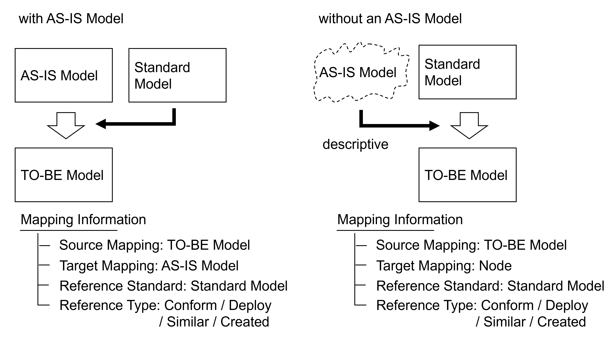

#### Where an AS-IS Model Is Defined
Where the current state of the target stakeholder's function model and information model has been compiled as an AS-IS model, a new TO-BE model is generated based on these AS-IS models. The method of setting the TO-BE model, which becomes the integration model, for the function model and information model is explained step by step using Figure 68.

Figure 68　Procedure for Generating the Integration Model (with an AS-IS Model)
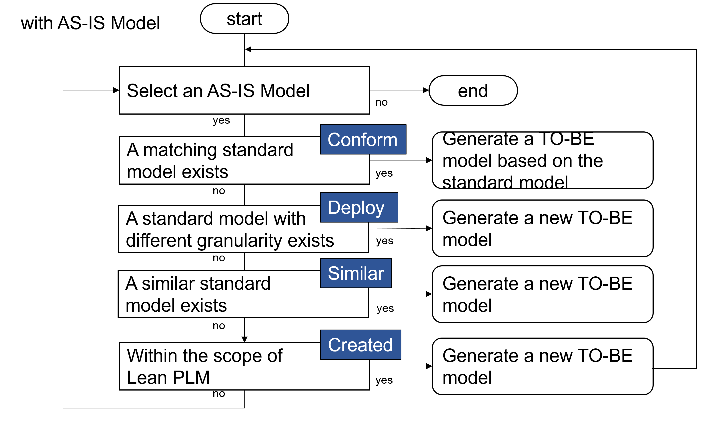

Elements already defined as the AS-IS model are each compared with the content defined as the standard model.
1. Standard Match: Where a standard model exists corresponding to the content defined in the AS-IS model, it is defined as the TO-BE model, and the corresponding standard model is set as mapping information. The mapping type is "Match."
2. Standard Deployment: Where the content defined in the AS-IS model is within scope but differs in granularity from the referenced standard model, it is newly added to the TO-BE model, and the newly added model is set as mapping information. The referenced standard model is set as "Deployment" in the mapping information.
3. Standard Similarity: Where the content defined in the AS-IS model is within scope but differs in meaning from the referenced standard model, it is newly added to the TO-BE model, and the newly added data model is set as mapping information. The referenced standard model, as the standard model with the closest meaning, is set as "Similarity" in the mapping information.
4. New Addition: Where the content defined in the AS-IS model is within scope but does not exist in the standard model, it is newly added to the TO-BE model, and the newly added data model is set as mapping information. The type is "New."
5. No Target: Where the content defined in the AS-IS model is outside the scope of this standard specification, nothing is done and it is not set in the TO-BE model.

For an information model, information items are set for each model. Accordingly, for each information model, the above procedure is further used to compare the information items in the AS-IS model with the information items in the standard model, and they are set in the TO-BE model.

Here, "differs in granularity" refers to a case where the target range differs, such as the difference between "managing the design BOM" and "managing the BOM."

As a result, a TO-BE model is generated, and the mapping source, mapping destination, referenced standard, and reference type are set as mapping information.

#### Where an AS-IS Model Is Not Defined
Where the stakeholder's current state has not been compiled as an AS-IS model, a TO-BE model is newly added, following the procedure in Figure 69, based on the content defined as the standard model. For the data model, the presence of an AS-IS model is a precondition, so the following is the procedure for the function model and information model.

Figure 69　Procedure for Generating the Integration Model (without an AS-IS Model)
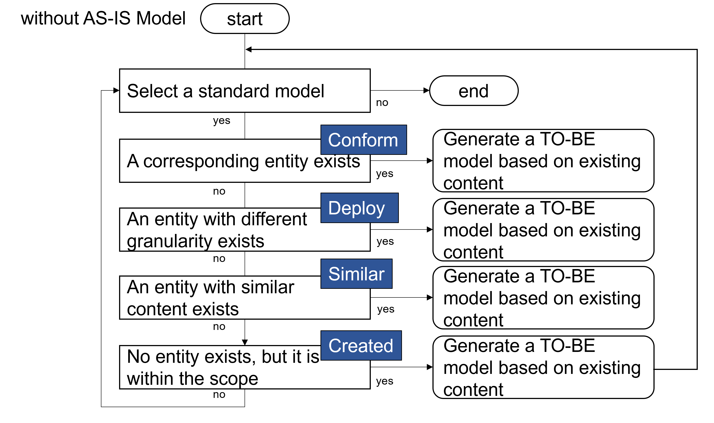

1. Standard Match: Where information corresponding to the content defined in the standard model actually exists, the content of the standard model is defined as the TO-BE model. The added TO-BE model is set as mapping information against the standard model, and the relationship with the standard model is "Match."
2. Standard Deployment: Where the content defined in the standard model actually exists but differs in granularity, it is newly added as the TO-BE model. The newly added TO-BE model is set as mapping information against the target standard model, and the relationship with the standard model is "Deployment."
3. Standard Similarity: Where the content defined in the standard model actually exists but differs in meaning, it is newly added as the TO-BE model. The newly added TO-BE model is set as mapping information against the target standard model, and the relationship with the standard model is "Similarity."
4. New Addition: Where there is no explicit information, but content that should be defined as an AS-IS model does not exist in the standard model, it is newly added as the TO-BE model. The newly added TO-BE model is set as mapping information, and the standard model with the closest meaning to the added model is defined as "New."
5. No Target: Where nothing corresponding to the content defined in the standard model exists in the function model that should be defined as AS-IS, no TO-BE model is generated. The mapping information against the target standard model is set as "None."

For an information model, it is necessary to set information items for each information model; where a standard model is referenced, they are set following it, and as needed, a provisional AS-IS information model is investigated based on the actual current state and its information items are set.

<a id="92-連携用データモデルの定義"></a>
## 9.2. Defining the Data Model for Integration
For the data model, it is assumed that all stakeholders have an AS-IS model. However, the TO-BE model, which is the integration data model, must basically be set based on the standard model.

Also, in defining the TO-BE data model, the previously defined TO-BE information model and its corresponding standard information model are used. In defining the data model for integration, the correspondence between the data model and information model, as well as the correspondence between data attributes and information items, is extremely important.

Figure 70 shows the overall structure for setting the data model for integration. The left side of the figure is the data model, and the right side is the information model. The ultimate goal is to show the correspondence between the AS-IS data model and TO-BE data model, and between the AS-IS data attributes and TO-BE data attributes, and in that process the correspondence with the information model is used as a reference.

Note that whereas for the AS-IS model, the correspondence between the data model and information model may or may not be defined, for the standard model, this technical specification explicitly specifies that relationship. For the TO-BE model, the relationship between the data model and information model is defined according to the following procedure.

Figure 70　Definition of the Data Model for Integration
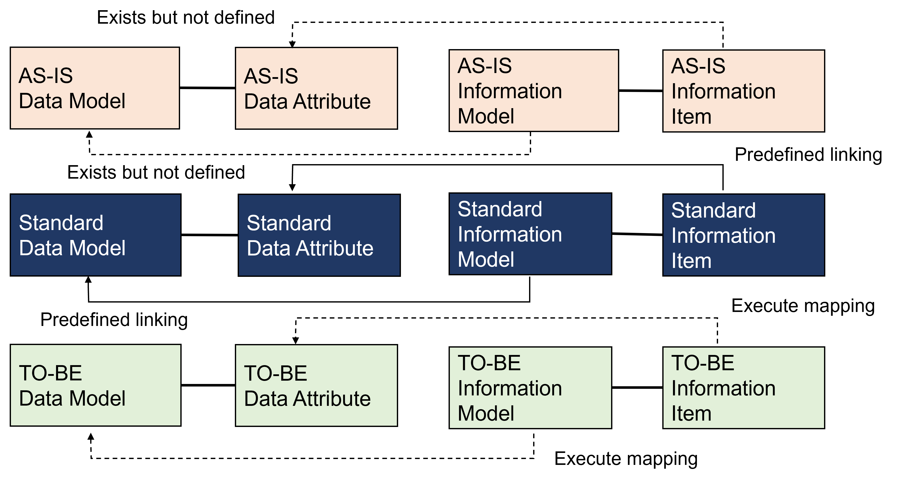

#### Generating the Integration Data Model

First, the following procedure is applied to the TO-BE information model.

1. Search whether a standard information model exists corresponding to the target TO-BE information model.
2. Where a standard information model exists, further obtain the standard data model that is pre-linked to that standard information model within the standard specification.
3. Newly set a TO-BE data model corresponding to the standard data model, and also set TO-BE data attributes corresponding to the standard data attributes.
4. Map the newly set TO-BE data model to the TO-BE information model.

In 2. above, where no standard information model exists, the standard data model is referenced directly, and the one closest to the content of the TO-BE information model is searched for. If found there, the TO-BE data model is set following the procedure in 3. and 4. above.

Note that where no corresponding standard data model is found, a new TO-BE data model is set, and in this case it becomes a data model that does not correspond to a standard data model.

#### Setting Data Attributes
Data attributes and information items are each defined for the data model and information model. Here the procedure for setting a data attribute corresponding to an information item is shown.

1. For all TO-BE information items belonging to all TO-BE information models, set the corresponding standard information item. However, the TO-BE information item and standard information item mapped here are assumed to already have a correspondence set between their respective parent TO-BE information model and standard information model.
2. Where a standard information item exists, further obtain the standard data attribute that is pre-linked to that standard information item within the standard specification.
3. Confirm whether a TO-BE data attribute corresponding to the standard data attribute exists, and if not, newly set one.
4. Map the newly set TO-BE data attribute to the TO-BE information item.

In 2. above, where no suitable information item exists in the target standard information model, the standard data attribute can be referenced directly, and the one closest to the content of the TO-BE information item can be set. In that case, the TO-BE data attribute is set following the procedure in 3. and 4. above.

However, the standard data attribute that can be referenced here must belong to the same data model as another standard data attribute set for an information item of the same TO-BE information model, or a linking relationship via primary key and foreign key must be defined between the parent standard data models.

Note that where no corresponding standard data attribute is found, it is set as a new data attribute corresponding to the target TO-BE data model.

#### Defining the Data Conversion Method
The relationship ultimately obtained between the AS-IS data model and TO-BE data model is defined, in the form of a linking method and a conversion method, as the integration profile shown in Chapter 10.

Figure 71　Definition of the Data Conversion Method
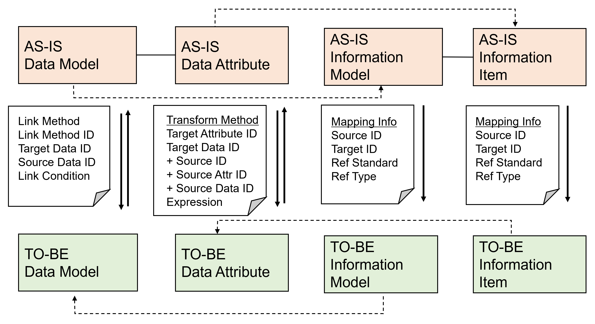
 
The actual conversion of data content follows the definition of the data conversion method shown in Figure 71. Here, the data conversion method is performed between the AS-IS data model and TO-BE data model, but there is a direction depending on which is converted to which.

In this specification, the data model on the side that sets the content is called the target data model, and the data model on the side that references the content is called the referenced data model. When setting the content of the AS-IS data model into the TO-BE data model (PUSH), the referenced data model is the AS-IS data model. On the other hand, when setting the content of the TO-BE data model into the AS-IS data model (PULL), the referenced data model is the TO-BE model.

Where the target model is the TO-BE data model and the data needed for data conversion does not exist on the AS-IS data model side, an extended data model and extended data attributes can be newly added on the TO-BE data model side as an auxiliary data model, and these can be added to the referenced data model.

Using the data attributes in the referenced data model, a definitional formula and calculation procedure are described for setting the content of each data attribute of the target data model. The reference needed to calculate the value of one piece of data may be multiple pieces of data spanning multiple different data models. In defining the calculation procedure, in addition to general operations, there are also record-level filtering, sorting, copying, and aggregation.


<a id="10-連携用プロファイルnormative"></a>
# 10. Integration Profile (normative)
The integration profile is for each stakeholder to describe its own Lean PLM based on this standard. By explicitly describing each Lean PLM following the usage procedure of this technical specification shown in Section 9.1, interoperability is facilitated.

The content of the model for the integration profile shown here is defined for each stakeholder. For the standard model, only the eight models in the model definition can be defined. These are shown in a separate document (lplm-schema.json).

<a id="101-モデルの定義"></a>
## 10.1. Model Definition
The function model, information model, and data model, which are the basic models making up Lean PLM, have the following structure.

Figure 72　Entities for Model Definition
```mermaid
classDiagram
direction RL
class function_model
class information_model
class information_item
class data_model
class data_attribute

information_item --> information_model
data_attribute --> data_model

function_information_deplyment --> function_model
function_information_deplyment --> information_model

information_data_deplyment --> information_model
information_data_deplyment --> data_model

attribute_item_deplyment --> information_item
attribute_item_deplyment --> data_attribute

```

The function model is a compilation of the content of the various business operations held by the target stakeholder, organized as functions that resolve requirements corresponding to specific things or information. Any act performed by a business entity can be captured as a function. However, the range that can be explicitly described as a function model is limited.

Table 117　Function Model (function_model)
| Name | Abbreviation | Data Type | Description |
|---|---|---|---|
| id | ID | PK | Model identification code |
| category | Function Category | varchar | Category name (selected from the content defined in this specification) |
| group_name | Function Group | varchar | Group name (selected from the content defined in this specification) |
| name | Function Name | varchar | Name representing the function |
| description | Description | varchar | Description of the function |
| stakeholder_id | Stakeholder ID | FK | ID of the stakeholder that entered it (a separate identification code is set) |
| created_at | Registration Date/Time | datetime | Date the content was first registered |
| updated_at | Update Date/Time | datetime | Date the content was last modified |
| status | Status | varchar | Current state (active/inactive, etc.) |
| note | Remarks | varchar | Management memo, etc. |

The information model is the unit that represents the information targeted by the business operations defined in the function model. It expresses, in a compiled form, the set of information items necessary for decision-making in the activity carried out by the person in charge of the business, with the information items making up the information laid out spatially.

Table 118　Information Model (information_model)
| Name | Abbreviation | Data Type | Description |
|---|---|---|---|
| id | ID | PK | Model identification code |
| category | Information Category | varchar | Category name (selected from the content defined in this specification) |
| group_name | Information Group | varchar | Group name (selected from the content defined in this specification) |
| name | Information Name | varchar | Name representing the information |
| description | Description | varchar | Description of the information |
| stakeholder_id | Stakeholder ID | FK | ID of the stakeholder that entered it (a separate identification code is set) |
| created_at | Registration Date/Time | datetime | Date the content was first registered |
| updated_at | Update Date/Time | datetime | Date the content was last modified |
| status | Status | varchar | Current state (active/inactive, etc.) |
| note | Remarks | varchar | Management memo, etc. |

An information item is an element making up an information model; it expresses its content and is also the unit that accepts input from the person in charge of the business. The meaning of an information item must be inferable in advance from the information model and its corresponding function model.

Table 119　Information Item (information_item)
| Name | Abbreviation | Data Type | Description |
|---|---|---|---|
| id | ID | PK | Unique ID of the information item |
| information_model_id | Information Model ID | FK | ID of the target information model |
| name | Item Name | varchar | Name of the information item |
| description | Description | varchar | Description of the information item |
| note | Remarks | varchar | Management memo, etc. |

The data model is the unit of entity in the data schema for representing the information model on a computer. In an implementation using a relational database, it corresponds to a table. Data models are linked to one another. Due to normalization, they do not correspond one-to-one with the units of the information model, but can be mapped via data attributes.

Table 120　Data Model (data_model)
| Name | Abbreviation | Data Type | Description |
|---|---|---|---|
| id | ID | PK | Model identification code |
| category | Data Category | varchar | Category name (selected from the content defined in this specification) |
| group_name | Data Group | varchar | Group name (selected from the content defined in this specification) |
| name | Data Name | varchar | Name representing the data |
| description | Description | varchar | Description of the data |
| stakeholder_id | Stakeholder ID | FK | ID of the stakeholder that entered it (a separate identification code is set) |
| created_at | Registration Date/Time | datetime | Date the content was first registered |
| updated_at | Update Date/Time | datetime | Date the content was last modified |
| status | Status | varchar | Current state (active/inactive, etc.) |
| note | Remarks | varchar | Management memo, etc. |

A data attribute is an element making up a data model, and can have a concrete value expressed as a number, character string, etc. It is implemented as a field in a database or via a key-value. A data attribute is assumed to be intended for persistence, but a temporary one corresponding to an information item can also be defined.


Table 121　Data Attribute (data_attribute)
| Name | Abbreviation | Data Type | Description |
|---|---|---|---|
| id | ID | PK | Unique ID of the data attribute |
| data_model_id | Data Model ID | FK | ID of the target data model |
| name | Data Attribute Name | varchar | Name of the data attribute |
| description | Description | varchar | Description of the data attribute |
| note | Remarks | varchar | Management memo, etc. |


<a id="102-モデル展開定義"></a>
## 10.2. Model Deployment Definition

Function-Information Deployment shows the relationship between the function model and information model. Each function model uses information, or provides information, in carrying out its function. Where such information is defined as an information model, the relationship is shown here.

Table 122　Function-Information Deployment (function_info_deployment)
| Name | Abbreviation | Data Type | Description |
|---|---|---|---|
| id | ID | PK | Unique ID of the function-information deployment |
| function_model_id | Function Model ID | FK | ID of the function model that is the deployment source |
| information_model_id | Information Model ID | FK | ID of the information model that is the deployment destination |
| note | Remarks | varchar | Management memo, etc. |

Information-Data Deployment shows the correspondence when an information model is expressed by a data model. An information model is made up of one or more data models. On the other hand, a data model corresponds to zero, one, or more information models. Note that where one piece of information corresponds to multiple data models, a relationship via data model linkage must be set between those data models.

Table 123　Information-Data Deployment (info_data_deployment)
| Name | Abbreviation | Data Type | Description |
|---|---|---|---|
| id | ID | PK | Unique ID of the information-data deployment |
| information_model_id | Information Model ID | FK | ID of the information model that is the deployment source |
| data_model_id | Data Model ID | FK | ID of the data model that is the deployment destination |
| note | Remarks | varchar | Management memo, etc. |


Item-Attribute Deployment shows which data attribute, in which data model, an information item in an information model corresponds to. An information item always corresponds to one data attribute. On the other hand, a data attribute corresponds to zero, one, or more information items.

Table 124　Item-Attribute Deployment (attribute_item_deployment)
| Name | Abbreviation | Data Type | Description |
|---|---|---|---|
| id | ID | PK | Unique ID of the item-attribute deployment |
| information_item_id | Information Item ID | FK | ID of the target information item |
| data_attribute_id | Data Attribute ID | FK | ID of the corresponding data attribute |
| note | Remarks | varchar | Management memo, etc. |


<a id="103-マッピング情報"></a>
## 10.3. Mapping Information
Mapping information shows how the unique function model, information model, and data model defined by each stakeholder correspond to the standard model shown in this specification. Here, each stakeholder's model is the AS-IS model, and the standard model shown in this technical specification is the TO-BE model.

Figure 73　Mapping Information
```mermaid
classDiagram
direction RL
function_model_mapping --> function_model:as-is
function_model_mapping --> function_model:to-be

information_model_mapping --> information_model:as-is
information_model_mapping --> information_model:to-be

data_model_mapping --> data_model:as-is
data_model_mapping --> data_model:to-be

information_item_mapping --> information_item:as-is
information_item_mapping --> information_item:to-be
information_item_mapping --> information_model
information_item --> information_model


data_attribute_mapping --> data_attribute:as-is
data_attribute_mapping --> data_attribute:to-be
data_attribute_mapping --> data_model
data_attribute --> data_model
```
 
Function model mapping shows the correspondence between the AS-IS model and TO-BE model in the function model.

Table 125 Function Model Mapping (function_model_mapping)
| Name | Abbreviation | Data Type | Description |
|---|---|---|---|
| id | ID | PK | Unique ID for the function model correspondence |
| as_is_model_id | AS-IS Function Model ID | FK | ID of the function model representing the current business |
| to_be_model_id | TO-BE Function Model ID | FK | ID of the function model representing the target business |
| standard_model_id | Standard Function Model ID | FK | ID of the corresponding standard function model |
| mapping_type | Mapping Type | varchar | Type of correspondence between models |
| note | Remarks | varchar | Management memo, etc. |


Information model mapping shows the correspondence between the AS-IS model and TO-BE model in the information model.

Table 126　Information Model Mapping (information_model_mapping)
| Name | Abbreviation | Data Type | Description |
|---|---|---|---|
| id | ID | PK | Unique ID for the information model correspondence |
| as_is_model_id | AS-IS Information Model ID | FK | ID of the information model used in the current business |
| to_be_model_id | TO-BE Information Model ID | FK | ID of the information model used in the target business |
| standard_model_id | Standard Information Model ID | FK | ID of the corresponding standard information model |
| mapping_type | Mapping Type | varchar | Type of correspondence between models |
| note | Remarks | varchar | Management memo, etc. |


Data model mapping shows the correspondence between the AS-IS model and TO-BE model in the data model.

Table 127　Data Model Mapping (data_model_mapping)
| Name | Abbreviation | Data Type | Description |
|---|---|---|---|
| id | ID | PK | Unique ID for the data model correspondence |
| as_is_model_id | AS-IS Data Model ID | FK | ID of the data model used in the current system |
| to_be_model_id | TO-BE Data Model ID | FK | ID of the data model used in the target system |
| standard_model_id | Standard Data Model ID | FK | ID of the corresponding standard data model |
| mapping_type | Mapping Type | varchar | Type of correspondence between models |
| note | Remarks | varchar | Management memo, etc. |

Information item mapping shows the mapping between the AS-IS model and TO-BE model at the information item level. For information items belonging to the same information model, the information model to which the corresponding partner information item belongs, via the mapping, may be the same or different. Where the partner information model is different, a direct or indirect relationship must be defined between those information models.

Table 128　Information Item Mapping (information_item_mapping)
| Name | Abbreviation | Data Type | Description |
|---|---|---|---|
| id | ID | PK | Unique ID for the information item correspondence |
| as_is_model_id | AS-IS Information Model | FK | ID of the information model used in the current business |
| as_is_element_id | AS-IS Information Item | FK | ID of the information item used in the current business |
| to_be_model_id | TO-BE Information Model | FK | ID of the information model used in the target business |
| to_be_element_id | TO-BE Information Item | FK | ID of the information item used in the target business |
| mapping_type | Mapping Type | varchar | Type of correspondence between items |
| note | Remarks | varchar | Management memo, etc. |

Data attribute mapping shows the mapping between the AS-IS model and TO-BE model at the data attribute level. For data attributes belonging to the same data model, the data model to which the corresponding partner data attribute belongs, via the mapping, may be the same or different. Where the partner data model is different, a direct or indirect relationship must be defined between those data models.

Table 128　Data Attribute Mapping (data_attribute_mapping)
| Name | Abbreviation | Data Type | Description |
|---|---|---|---|
| id | ID | PK | Unique ID for the information item correspondence |
| as_is_model_id | AS-IS Information Model | FK | ID of the information model used in the current business |
| as_is_element_id | AS-IS Information Item | FK | ID of the information item used in the current business |
| to_be_model_id | TO-BE Information Model | FK | ID of the information model used in the target business |
| to_be_element_id | TO-BE Information Item | FK | ID of the information item used in the target business |
| mapping_type | Mapping Type | varchar | Type of correspondence between items |
| note | Remarks | varchar | Management memo, etc. |


<a id="104-データ連結とロジック"></a>
## 10.4. Data Linking and Logic

Data model linkage and calculation logic show the structure of the data model and the structure of calculations using the values of data held by the data model. The basic configuration has the following three stages.

| Definition Name | Configuration Name |
|--|--|
| data_link | Determines the referenced model |
| data_calculation | Defines the calculation method for the target attribute |
| data_calculation_link | Defines the attributes used within the calculation formula |

#### Data Model Linkage
Data model linkage shows the relationship between data models. This corresponds to a JOIN statement in SQL. At most one data model can be related per definition in a data model linkage, but by combining these, values can be set from multiple data models.

Note that there are two forms of linkage: one where the target data model side holds no actual data and always references the value of the linked data model, and one where the target data model side duplicates and holds, as an actual value, the value of the linked data model.

Figure 74　Data Linking and Logic
```mermaid
classDiagram
direction RL
data_link --> data_model:target
data_link --> data_model:linked

data_attribute --> data_model
data_calculation --> data_attribute:target
data_calculation --> data_model:source
data_calculation --> data_link
```
 
Table 130　Data Model Linkage (data_link)
| Name | Abbreviation | Data Type | Description |
|---|---|---|---|
| id | ID | PK | Unique ID of the data linkage |
| target_model_id | Target Model ID | FK | The target model. Obtains a value from the linked source. |
| linked_model_id | Extension Model ID | FK | The linked model. In the case of copying, becomes the reference source. |
| link_type | Extension Type | varchar | There is the case of static linkage as a JOIN, and the case of dynamically copying a value. |
| join_key | Linkage Method | varchar | Specifies, as a character string, the linkage condition between the two models. |
| note | Remarks | varchar | Management memo, etc. |

The candidate values of link_type are as follows.

| Value	| Meaning |
|--|--|
| JOIN	| Statically links data models. A static model linkage like an SQL JOIN. |
| COPY	| Dynamically copies a value. Obtains and copies the value at the time of data conversion. |
| LOOKUP	| Used as a reference table. Master reference. |
| AGGREGATE	| Used as an aggregation source. Aggregates multiple records. |

#### Calculation Logic

Calculation logic shows the method of calculating the value of the target data attribute. The calculation method is shown by a calculation formula, and the constituent elements of the formula shown there are values of data attributes in the referenced data model. The referenced data model can have multiple data models set by using a calculation-logic link.

Table 131　Calculation Logic (data_calculation)
| Name | Abbreviation | Data Type | Description |
|---|---|---|---|
| id | ID | PK | Unique ID of the data conversion method |
| target_attribute_id | Target Attribute ID | FK | ID of the target attribute whose value is set |
| source_model_id | Referenced Data Model ID | FK | ID of the referenced data model subject to the calculation |
| calculation_type | Calculation Type | varchar | One of: copy, aggregate, merge, filter, or calculate |
| condition | Condition Expression | varchar | Limits the target data that is the premise of the calculation |
| expression | Calculation Formula | varchar | Describes the calculation content or condition expression |
| note | Remarks | varchar | Management memo, etc. |

The table below shows, as calculation_type, the types of calculation available for calculating an attribute value and their implementation method.


| Value | Meaning | Description |
| --------- | --- | ---------------------------------------------------- |
| COPY | Copy | Specifies a search condition, selects a specific record in the referenced data model, and sets the value of that data attribute. |
| AGGREGATE | Aggregate | Aggregates the specified data attribute value across multiple records in the referenced data model matching the search condition. |
| MERGE | Merge | Specifies a search condition, selects a specific record in the referenced data model, and adds it to the target data. |
| FILTER | Filter | Specifies a search condition to select the applicable data, for the referenced data model used in a calculation. |
| CALCULATE | Calculate | Executes a predefined calculation using the values of data attributes of records selected in the referenced data model. |

When calculation_type is AGGREGATE, the value of the target attribute is calculated according to the calculation formula described in expression.

| expression                   | Meaning        |
| ---------------- | --------- |
| COPY               | Copies the quantity as is |
| SUM               | Aggregates the quantity     |
| AVG                    | Average value       |
| MAX             | Maximum value       |

When calculation_type is CALCULATE, the value of the target attribute is calculated within the data of the target data model according to the calculation formula described in expression.

Example description
```source
 Production_Order.Cost = Production_Quantity × Standard_Unit_Price
```

### Calculation Logic Link
A calculation logic link specifies, when calculating based on a calculation formula defined in calculation logic, where there are multiple target referenced data models, the data model linkage for linking them. For example, in performing a calculation A = B + C, if A, B, and C belong to Data-01, Data-01, and Data-02 respectively, then Data-01 and Data-02 must be related to each other in order to execute this calculation.

Table 132　Calculation Logic Link (data_calculation_link)
| Name | Abbreviation | Data Type | Description |
|---|---|---|---|
| id | ID | PK | Unique ID of the data conversion reference |
| data_calculation_id | Calculation Logic ID | FK | ID of the corresponding calculation logic |
| data_link_id | Data Model Linkage ID | FK | ID of the data model linkage used in the calculation |
| note | Remarks | varchar | Management memo, etc. |

<a id="105-kpiモデル"></a>
## 10.5. KPI Model
To evaluate, from a neutral standpoint, the level of system-integration capability of individual Lean PLM solutions belonging to manufacturing establishments as stakeholders, or of solution companies, three KPIs are set: data conformance, data sufficiency, and data reliability. These indicators are calculated separately for the stakeholder on the receiving side (PULL) of the data model content, i.e. the user side, and for the stakeholder on the providing side (PUSH) of the data. So that one side does not affect the performance of the other, they are split at the layer of the standard model positioned in between, and each side is evaluated independently.

### Data Conformance
Data conformance, when converting the target AS-IS data model A into the TO-BE data model A* following the procedure in Section 9.1, is shown by the proportion in which:

1. a TO-BE data model A* corresponding to AS-IS data model A exists, and
2. all of the mandatory data attributes possessed by AS-IS data model A are defined as data attributes of A*.

The same applies, as a PULL type, to the case of obtaining data on the AS-IS data model side from a TO-BE data model based on the standard model.

The counting target is counted on the AS-IS side from the perspective of the information model. That is, all data models making up the AS-IS information model are investigated as targets of data conformance, and anything else is excluded from the target.

### Data Sufficiency
Data sufficiency is the proportion by which, for setting the content of an AS-IS data model implemented by a stakeholder, all of the data model content theoretically needed to reproduce equivalent content can be conveyed in a single transaction.

For example, in a PUSH-type use case, where the partner requires AS-IS data model A*, even when AS-IS data model A alone is insufficient in content, the content can be made 100% sufficient by linking data model B, as in Figure (a).

On the other hand, in practice, as in Figure (b), there are also cases where data model B, needed to constitute data model A*, is transmitted beforehand or afterward and reconstructed on the user side. In this case it is not subject to the calculation of sufficiency.

The calculation of data sufficiency is investigated at the level of the data attribute. The data sufficiency rate can be set for each data model, and at the same time the data sufficiency of the stakeholder as a whole is clarified by taking the weighted average of these data sufficiency rates.
 
 
### Data Reliability
Data reliability shows, for each data model, at the level of the data attribute, the proportion for which the data attributes necessary and sufficient for setting its value exist. Data reliability can be determined per target data model or per business establishment. Even for the same target data model, the value of data reliability differs between the PUSH type and PULL type.

Where there is no applicable data attribute, it is necessary to add it as an attribute on the TO-BE data model side; if this is not done, it is treated as missing, and reliability decreases. Note that for attributes counted as missing, a default value defined for each is set.

For a data attribute under investigation, in order for the data attribute for setting its value to exist on the referenced data model and to be counted in the calculation of data reliability, the conditions are that:

1. an attribute of the referenced data model is assigned to each attribute of the target data model, and
2. calculation logic is defined for the value of the target data attribute, and furthermore, the value of the data attribute referenced within that logic can be obtained.

Note that an extended data model or extended data attribute established to calculate the value of a data attribute corresponds to a corresponding information model or information item; where it does not exist, one is to be newly generated, and where this is not possible, it is excluded from the reliability count.

<a id="11-準拠と認証normative"></a>
# 11. Compliance and Certification (normative)
Manufacturing activities in general carried out by a company, organization, or individual, or a product or service they provide, can be said to comply with this technical specification if all of the following requirements are satisfied.

1.	It is a product or service within the scope of this technical specification.
2.	The terminology describing the product or service is mapped to the terminology defined in this technical specification.
3.	The product or service is described in correspondence with the functions and information defined in this technical specification.
4.	There is otherwise no violation of the rules explicitly prescribed in this technical specification, and there is no risk that its operation will cause significant damage to users.

Furthermore, where a product or service provided by a company or individual satisfies, in addition to the above four requirements, the following requirements, as recognized through the certification process provided by IVI, IVI certifies that it complies with this technical specification.

1.	The function model, information model, and data model are described as an integration profile as shown in Chapter 9 of this technical specification, and the content is submitted to IVI, with no deficiencies in that content.
2.	A test environment corresponding to the submitted integration profile is built, and it can be confirmed that results as specified are obtained in a certification test using three or more sample data sets. Note that the method and criteria of the certification test are prescribed in an attached document.
3.	For bidirectional collaboration between design and manufacturing, the system implementation of the desired future state is periodically reviewed, and efforts to improve the business mechanism and the added value of the product or service provided are continued.
