# PSLX Data Model 

PSLX4.2技術標準 IVI-TS-PSLX-2026-01
Product and Service Lifecycle Transformation

バージョン4.2.01（ドラフト1）
 
 
 

2026/6/2

一般社団法人インダストリアル・バリューチェーン・イニシアティブ

#### 改訂

| 日付	| バージョン	| 内容	| 作成者 |
|---|---|--|---|
| 2025/3/18 | 	4.1.01 | 	ドラフト作成 | 	西岡
| 2025/12/28 | 	4.1.02 | 	4.1ドラフト | 	西岡
| 2026/5/30 | 	4.2.01 | 	4.2ドラフト | 	西岡

### 目的とスコープ
製造業の販売から製造およびサービスに至るサプライチェーン、そして設計から製造および設備に至るエンジニアリングチェーンといったさまざまな業務に関するアプリケーションを連携させるために、共通したデータモデルを提供する。これまで、PSLX標準仕様として、IEC/ISOにも採録されたモデルに加え、一般社団法人インダストリアル・バリューチェーン・イニシアティブ（以下IVI）が提唱するリーンな製品ライフサイクル管理のためのモデルとしても活用可能な形で編成された。

IVIが提供する中小製造業向けの業務アプリケーション（無償アプリ）は、すべて本データモデルを用いて実装しており、既存のさまざまな企業アプリとの相互運用性を容易にするとともに、それらの業務アプリが、本データモデルに準拠したインタフェースを実装することで、それらの業務アプリ間での相互運用性を高める。

設計開発から製造にいたるエンジニアリングチェーンについては、リーンな製品ライフサイクル管理（Lean Product Lifecycle Management：LPLM）をIVIが提唱しており、そこでは本データモデルを採用している。すなわち、エンジニアリングチェーンにおける業務アプリケーション間のデータ連携において、本モデルはその中間フォーマットとして利用されている。

さらに、IVIが提供する企業間オープン連携フレームワーク（CIOF）を用いて、企業を越えた業務アプリの連携を行うための共通辞書として、本データモデルを利用可能とする。製造業がもつ標準的な業務アプリが扱うデータを、他の企業と共有する際に、CIOFのしくみを利用して対象データを明確に定義し、個別の取引契約に明記することで、データを介した企業間のつながりを知財の側面からも強化する。

### 著作権および利用規定
本データモデルの著作権は、一般社団法人インダストリアル・バリューチェーン・イニシアティブが保有する。本データモデルは、仕様書（本仕様書）およびJSON, CSV, XML, SQLなどのデジタル処理可能な形（配布版データモデル）として提供される。著作権者は、前記の目的とスコープの範囲に限り、商用目的かどうかに係らず、本仕様書及び配布版データモデルの利用、複製および再配布を許諾する。

本データモデルの改変は、個別の業務アプリの実装に対応する場合を除き、文書による著作権者の許諾を要する。著作権者の許諾なく、本データモデルを個別に改変した内容を、不特定多数に開示することはできない。個別の業務アプリの実装に対応するために本データモデルを改変する場合は、本データモデルの著作権に関する表示を削除してはならず、本利用規定の内容を継承しなければならない。

### 無保証および限定サポート
著作権者は、本データモデルを実装した業務アプリの動作を保証しない。また、直接および間接的な場合も含めて、本データモデルを利用または利用しないことによる損害に対して、著作権者はいかなる責務も負わない。

本データモデルに関する改変およびサポートは、IVIおよびIVIが委託した個人または団体が継続的に行う。IVIが行うサポートについては、不具合対応や共通的な課題として、本データモデルの品質向上に資するものに限定する。また、個別の事例に対するサポートは、IVI会員に限定し、中小製造業の課題を解決するものを優先する。

## 目次

- [第1章　データモデルの構成](#第1章-データモデルの構成)
  - [1.1 テーブル一覧](#11-テーブル一覧)
  - [1.2 カテゴリ一覧](#12-カテゴリ一覧)
- [第2章　カテゴリ別エンティティ一覧](#第2章-カテゴリ別エンティティ一覧)
  - [2.1 資源階層](#21-資源階層)
  - [2.2 計画管理](#22-計画管理)
  - [2.3 資産管理](#23-資産管理)
  - [2.4 生産品目](#24-生産品目)
  - [2.5 生産工程](#25-生産工程)
  - [2.6 設備管理](#26-設備管理)
  - [2.7 保全管理](#27-保全管理)
  - [2.8 作業者](#28-作業者)
  - [2.9 作業管理](#29-作業管理)
  - [2.10 在庫管理](#210-在庫管理)
  - [2.11 エネルギ管理](#211-エネルギ管理)
  - [2.12 販売管理](#212-販売管理)
  - [2.13 購買管理](#213-購買管理)
- [第3章　テーブル実装](#第3章-テーブル実装)
  - [3.1 実装クラス](#31-実装クラス)
  - [3.2 実装クラス別属性一覧](#32-実装クラス別属性一覧)
  - [3.3 省略属性](#33-省略属性)
- [第4章　付録](#第4章-付録)
  - [4.1 資源階層](#41-資源階層)
  - [4.2 計画管理](#42-計画管理)
  - [4.3 資産管理](#43-資産管理)
  - [4.4 生産品目](#44-生産品目)
  - [4.5 生産工程](#45-生産工程)
  - [4.6 設備管理](#46-設備管理)
  - [4.7 保全管理](#47-保全管理)
  - [4.8 作業者管理](#48-作業者管理)
  - [4.9 作業管理](#49-作業管理)
  - [4.10 在庫管理](#410-在庫管理)
  - [4.11 エネルギ管理](#411-エネルギ管理)
  - [4.12 販売管理](#412-販売管理)
  - [4.13 購買管理](#413-購買管理)

# 第1章　データモデルの構成

## 1.1 テーブル一覧

以下の表にデータモデルの内容を示す。データモデルは、108個のエンティティで構成される。それぞれのエンティティは、カテゴリの列で示す13種類のカテゴリに分類できる。詳細については、それぞれのカテゴリに対応する章で説明する。

グループの列は、対応するエンティティがもつ属性の構造を示す。合計29のグループが存在し、それぞれについて独自に属性の構造を持つ。これはグループ別の属性構造の章において解説する。

**表1　テーブル一覧**
|    ID | エンティティ名    | 英語名                            | 説明                  | カテゴリ   | グループ   |
|------:|:---------|:-------------------------------|:------------------------|:-------|:-------|
| 10001 | 事業者      | Enterprise                     | 自社および取引先となる企業を表す。       | 資源階層   | 階層     |
| 10002 | エリア      | Area                           | サイト内の区画、フロア、または管理単位を表す。 | 資源階層   | 階層     |
| 10003 | サイト      | Site                           | 生産活動を行う工場や拠点を表す。        | 資源階層   | 階層     |
| 10004 | 生産ライン    | Production Line                | 生産工程を実行するラインまたは設備群を表す。  | 資源階層   | 階層     |
| 10005 | カレンダ     | Calendar                       | 稼働日、休日、シフトなどの操業条件を表す。   | 計画管理   | カレンダ   |
| 10006 | ターム      | Term                           | カレンダを構成する時間区間を表す。       | 計画管理   | ターム    |
| 10007 | 生産計画     | Production Plan                | 生産数量や期間に関する計画を表す。       | 計画管理   | 計画     |
| 10008 | 能力計画     | Capacity Plan                  | 生産能力の確保や配分計画を表す。        | 計画管理   | 計画     |
| 10009 | 販売計画     | Sales Plan                     | 期間ごとの販売目標計画を表す。         | 計画管理   | 計画     |
| 10010 | 購買計画     | Purchase Plan                  | 期間ごとの調達目標計画を表す。         | 計画管理   | 計画     |
| 10011 | アセット     | Asset                          | 生産活動に関わる資産の共通情報を表す。     | 資産管理   | 資産     |
| 10012 | アセットグループ | Asset Group                    | 共通属性をもつアセットの分類単位を表す。    | 資産管理   | グループ   |
| 10013 | アセット構成   | Asset Structure                | アセット間の構成関係や階層構造を表す。     | 資産管理   | 構成     |
| 10014 | アセット仕様   | Asset Specification            | アセットに求められる仕様や性能条件を表す。   | 資産管理   | 仕様     |
| 10015 | 監視内容     | Monitoring Content             | 設備や工程で監視する対象項目を表す。      | 資産管理   | 内容     |
| 10016 | 監視結果     | Monitoring Result              | 監視項目に対する実測値や状態結果を表す。    | 資産管理   | 結果     |
| 10017 | 生産品目     | Production Item                | 生産対象となる製品、部品、材料を表す。     | 生産品目   | 資産     |
| 10018 | 品目グループ   | Production Item Group          | 共通特性をもつ生産品目の分類単位を表す。    | 生産品目   | グループ   |
| 10019 | 品目構成     | Production Item Structure      | 生産品目の部品表や構成関係を表す。       | 生産品目   | 構成     |
| 10020 | 品目機能     | Production Item Function       | 生産品目が提供する機能や役割を表す。      | 生産品目   | 機能     |
| 10021 | 品目仕様     | Production Item Specification  | 生産品目の仕様、品質条件、性能条件を表す。   | 生産品目   | 仕様     |
| 10022 | 品目部位     | Production Item Portion        | 生産品目を構成する識別可能な部位を表す。    | 生産品目   | 部位     |
| 10023 | 品目図書     | Production Item Document       | 生産品目に関連する図面や仕様書を表す。     | 生産品目   | 図書     |
| 10024 | 品目事象     | Production Item Issue          | 生産品目に関連する不具合や課題を表す。     | 生産品目   | 事象     |
| 10025 | 品目対策     | Production Item Countermeasure | 品目事象に対する対策内容を表す。        | 生産品目   | 対策     |
| 10026 | 品目結果     | Production Item Result         | 生産品目を生産して得られた実体を示す。 | 生産品目   | 結果     |
| 10027 | 生産工程     | Production Process             | 技術的に定義された生産工程を表す。       | 生産工程   | 工程     |
| 10028 | 生産手順     | Production Operation           | 生産工程を具体化した作業手順を表す。      | 生産工程   | 手順     |
| 10029 | 生産内容     | Production Content             | 生産手順を構成する詳細な作業項目を表す。    | 生産工程   | 内容     |
| 10030 | 生産割当     | Production Assignment          | 生産指示に対するリソース割当を表す。      | 生産工程   | 割当     |
| 10031 | 生産能力     | Production Capacity            | 生産ラインや工程の能力情報を表す。       | 生産工程   | 能力     |
| 10032 | 生産オーダ    | Production Order               | 生産を要求する指示単位を表す。         | 生産工程   | オーダ    |
| 10033 | 生産指示     | Production Schedule            | 生産オーダに基づく実行指示を表す。       | 生産工程   | 指示     |
| 10034 | 生産実績     | Production Performance         | 実際の生産量や稼働実績を表す。         | 生産工程   | 実績     |
| 10035 | 生産結果     | Production Result              | 生産指示の結果として得られた実行結果を表す。  | 生産工程   | 結果     |
| 10036 | 生産図書     | Production Document            | 生産工程に関連する技術文書を表す。       | 生産工程   | 図書     |
| 10037 | 生産事象     | Production Issue               | 生産活動で発生した問題や異常を表す。      | 生産工程   | 事象     |
| 10038 | 生産対策     | Production Countermeasure      | 生産事象に対する改善や対策を表す。       | 生産工程   | 対策     |
| 10039 | 設備       | Equipment                      | 生産作業を実行する機械や装置を表す。      | 設備管理   | 資産     |
| 10040 | 設備グループ   | Equipment Group                | 共通機能をもつ設備の分類単位を表す。      | 設備管理   | グループ   |
| 10041 | 設備構成     | Equipment Structure            | 設備の親子関係や構成情報を表す。        | 設備管理   | 構成     |
| 10042 | 設備機能     | Equipment Function             | 設備がもつ機能や役割を表す。          | 設備管理   | 機能     |
| 10043 | 設備仕様     | Equipment Specification        | 設備に求められる性能や仕様条件を表す。     | 設備管理   | 仕様     |
| 10044 | 設備部位     | Equipment Portion              | 設備を構成する識別可能な部位を表す。      | 設備管理   | 部位     |
| 10045 | 設備図書     | Equipment Document             | 設備に関連する図面やマニュアルを表す。     | 設備管理   | 図書     |
| 10046 | 設備事象     | Equipment Issue                | 設備に発生した故障や異常を表す。        | 設備管理   | 事象     |
| 10047 | 設備対策     | Equipment Countermeasure       | 設備事象に対する対策内容を表す。        | 設備管理   | 対策     |
| 10048 | 設備工程     | Equipment Process              | 設備に関する保全や稼働の工程を表す。      | 保全管理   | 工程     |
| 10049 | 設備手順     | Equipment Operation            | 設備工程を実行する具体的な手順を表す。     | 保全管理   | 手順     |
| 10050 | 設備内容     | Equipment Content              | 設備手順を構成する詳細な作業項目を表す。    | 保全管理   | 内容     |
| 10051 | 設備割当     | Equipment Assignment           | 生産手順に対する設備割当を表す。        | 保全管理   | 割当     |
| 10052 | 設備能力     | Equipment Capacity             | 設備がもつ処理能力や性能を表す。        | 保全管理   | 能力     |
| 10053 | 設備オーダ    | Equipment Order                | 設備に対する作業要求を表す。          | 保全管理   | オーダ    |
| 10054 | 設備指示     | Equipment Schedule             | 設備オーダに基づく実行指示を表す。       | 保全管理   | 指示     |
| 10055 | 設備実績     | Equipment Performance          | 設備の稼働実績や運転結果を表す。        | 保全管理   | 実績     |
| 10056 | 設備結果     | Equipment Result               | 設備作業の結果を表す。             | 保全管理   | 結果     |
| 10057 | 作業者      | Personnel                      | 生産活動に従事する作業者を表す。        | 作業者管理  | 資産     |
| 10058 | 作業者グループ  | Personnel Group                | 共通役割をもつ作業者のグループを表す。     | 作業者管理  | グループ   |
| 10059 | 作業者構成    | Personnel Structure            | 作業者間の階層や代替関係を表す。        | 作業者管理  | 構成     |
| 10060 | 作業者スキル   | Personnel Skill                | 作業者が保有する技能や資格を表す。       | 作業者管理  | 機能     |
| 10061 | 作業者仕様    | Personnel Specification        | 作業者に求められる資格や条件を表す。      | 作業者管理  | 仕様     |
| 10062 | 作業者部位    | Personnel Portion              | 作業者の身体的または機能的な部位を表す。    | 作業者管理  | 部位     |
| 10063 | 作業者図書    | Personnel Document             | 作業者に関連する教育資料や記録を表す。     | 作業者管理  | 図書     |
| 10064 | 作業者事象    | Personnel Issue                | 作業者に関連する問題や事故を表す。       | 作業者管理  | 事象     |
| 10065 | 作業者対策    | Personnel Countermeasure       | 作業者事象に対する改善や対策を表す。      | 作業者管理  | 対策     |
| 10066 | 作業工程     | Work Process                   | 人作業として定義された工程を表す。       | 作業管理   | 工程     |
| 10067 | 作業手順     | Work Operation                 | 作業工程を実行する具体的な手順を表す。     | 作業管理   | 手順     |
| 10068 | 作業内容     | Work Content                   | 作業手順を構成する詳細な作業項目を表す。    | 作業管理   | 内容     |
| 10069 | 作業割当     | Work Assignment                | 作業指示に対するリソース割当を表す。      | 作業管理   | 割当     |
| 10070 | 作業能力     | Work Capacity                  | 作業者または作業班の能力を表す。        | 作業管理   | 能力     |
| 10071 | 作業オーダ    | Work Order                     | 作業者に対する作業要求を表す。         | 作業管理   | オーダ    |
| 10072 | 作業指示     | Work Schedule                  | 作業オーダに基づく実行指示を表す。       | 作業管理   | 指示     |
| 10073 | 作業実績     | Work Performance               | 作業者または作業班の実績を表す。        | 作業管理   | 実績     |
| 10074 | 作業結果     | Work Result                    | 作業の実行結果を表す。             | 作業管理   | 結果     |
| 10075 | 在庫品目     | Inventory Item                 | 在庫場所ごとの管理品目を表す。         | 在庫管理   | 製品     |
| 10076 | 在庫能力     | Inventory Capacity             | 在庫場所の保管能力を表す。           | 在庫管理   | 能力     |
| 10077 | 在庫オーダ    | Inventory Order                | 在庫品目の移動・補充オーダを表す。       | 在庫管理   | オーダ    |
| 10078 | 在庫指示     | Inventory Schedule             | 在庫品目の移動・補充指示を表す。        | 在庫管理   | 指示     |
| 10079 | 在庫移動     | Inventory Transfer             | 在庫品目の数量増減結果を表す。         | 在庫管理   | 実績     |
| 10080 | 在庫数量     | Inventory Result               | ある時点における在庫数量を表す。        | 在庫管理   | 結果     |
| 10081 | エネルギ     | Energy                         | 生産活動に必要なエネルギを表す。        | エネルギ管理 | 資産     |
| 10082 | エネルギグループ | Energy Group                   | エネルギ源の分類単位を表す。          | エネルギ管理 | グループ   |
| 10083 | エネルギ構成   | Energy Structure               | エネルギ供給の構成関係を表す。         | エネルギ管理 | 構成     |
| 10084 | エネルギ機能   | Energy Function                | エネルギがもつ機能を表す。           | エネルギ管理 | 機能     |
| 10085 | エネルギ仕様   | Energy Specification           | エネルギに求められる仕様条件を表す。      | エネルギ管理 | 仕様     |
| 10086 | エネルギ接点   | Energy Node                    | エネルギの供給・消費の接続点を表す。      | エネルギ管理 | 部位     |
| 10087 | エネルギ能力   | Energy Capacity                | 共有可能なエネルギ供給能力を表す。       | エネルギ管理 | 能力     |
| 10088 | エネルギオーダ  | Energy Order                   | エネルギの供給・消費オーダを表す。       | エネルギ管理 | オーダ    |
| 10089 | エネルギ指示   | Energy Schedule                | エネルギの供給・消費指示を表す。        | エネルギ管理 | 指示     |
| 10090 | エネルギ実績   | Energy Performance             | エネルギの供給・消費実績を表す。        | エネルギ管理 | 実績     |
| 10091 | エネルギ結果   | Energy Result                  | エネルギ接点ごとの記録結果を表す。       | エネルギ管理 | 結果     |
| 10092 | 得意先      | Customer                       | 販売品目を提供する相手の事業者を表す。     | 販売管理   | 会社     |
| 10093 | 販売品目     | Sales Item                     | 得意先に提供される生産品目を表す。       | 販売管理   | 製品     |
| 10094 | 受注伝票     | Sales Document                 | 得意先からの注文の管理単位を表す。       | 販売管理   | 注文伝票   |
| 10095 | 受注明細     | Sales Order                    | 販売品目ごとの受注内容を表す。         | 販売管理   | 注文明細   |
| 10096 | 販売仕様     | Sales Specification            | 得意先ごとの販売条件・仕様を表す。       | 販売管理   | 仕様     |
| 10097 | 販売請求     | Sales Invoice                  | 得意先に発行する請求情報を表す。        | 販売管理   | 請求     |
| 10098 | 受注内示     | Sales Forecast                 | 得意先からの需要予測情報を表す。        | 販売管理   | 内示     |
| 10099 | 販売見積     | Sales Quotation                | 得意先への見積依頼と回答を表す。        | 販売管理   | 見積     |
| 10100 | 出荷明細     | Shipping Result                | 販売品目の出荷結果を表す。           | 販売管理   | 結果     |
| 10101 | 仕入先      | Supplier                       | 資材・部品を調達する相手の事業者を表す。    | 購買管理   | 会社     |
| 10102 | 購買品目     | Purchase Item                  | 仕入先から提供される生産品目を表す。      | 購買管理   | 製品     |
| 10103 | 購買伝票     | Purchase Document              | 仕入先への注文の管理単位を表す。        | 購買管理   | 注文伝票   |
| 10104 | 購買明細     | Purchase Order                 | 仕入先への個々の注文内容を表す。        | 購買管理   | 注文明細   |
| 10105 | 購買仕様     | Purchase Specification         | 仕入先ごとの購買条件・仕様を表す。       | 購買管理   | 仕様     |
| 10106 | 購買請求     | Purchase Invoice               | 仕入先から受け取る請求情報を表す。       | 購買管理   | 請求     |
| 10107 | 仕入内示     | Purchase Forecast              | 仕入先への仕入予測通知を表す。         | 購買管理   | 内示     |
| 10108 | 購買見積     | Purchase Quotation             | 仕入先への見積依頼と回答を表す。        | 購買管理   | 見積     |
| 10109 | 入荷明細     | Receiving Result               | 購買品目の入荷結果を表す。           | 購買管理   | 結果     |

## 1.2 カテゴリ一覧

108個のデータモデルは、以下の13のカテゴリに分類できる。それぞれのカテゴリの説明を表に示す。

**表2　カテゴリ一覧**
| カテゴリ | 説明 |
|---|---|
| 資源階層 | 生産活動を行う組織や場所を階層的に捉えるための概念を定義する。企業としての事業者を頂点に、工場・拠点であるサイト、その内部の管理区画であるエリア、実際に工程を実行する生産ラインへと段階的に細分化され、各リソースがどの組織・場所に属するかを明確にする枠組みを提供する。 |
| 計画管理 | 生産活動の時間的な枠組みと将来の目標数値を一元的に管理する概念を定義する。稼働日やシフトを定めるカレンダとその時間区間を基盤として、生産・販売・購買・能力それぞれの領域における計画を策定・調整する機能を担い、各業務領域の活動を時間軸で整合させる役割を果たす。 |
| 資産管理 | 設備・人員・エネルギといった個別領域を横断する共通の資産情報を抽象的に定義し、一元管理する概念を提供する。また、あらゆる資産やプロセスを対象として継続的に状態を観察・記録する監視の仕組みを含み、異常の早期検知や品質・安全の維持に向けた情報基盤を担う。 |
| 生産品目 | 生産活動において製造・加工・調達の対象となるモノを包括的に定義する概念を扱う。単なる識別情報にとどまらず、品目間の部品構成・機能・仕様・部位といった構造的・技術的特性と、関連する図書・不具合事象・対策までを一体として管理し、製品の品質と設計情報を維持する役割を果たす。 |
| 生産工程 | 製品を生産するための工程・手順・作業内容という技術的な定義から、オーダの発行・指示の実行・実績・結果の記録という運用サイクル全体を一貫して管理する概念を扱う。計画から実行・記録までを統合することで、生産活動の再現性・追跡性・改善サイクルの基盤を提供する。 |
| 設備管理 | 生産作業を担う機械・装置を対象として、その静的な特性情報を体系的に維持・管理する概念を扱う。個々の設備の識別・分類・構造・機能・仕様・部位といった設備の「あるべき姿」を定義するとともに、関連する図書・故障事象・対策を一体的に管理し、設備の適切な利活用を支援する。 |
| 保全管理 | 設備の保全・点検・修理という維持管理活動を、工程の定義から実際の作業実行・記録までの一連のサイクルとして管理する概念を扱う。保全作業に必要なリソースの能力・割当・オーダ・指示という計画から実績・結果の収集までを統合し、設備の安定稼働と長期的な信頼性確保を支援する。 |
| 作業者管理 | 生産活動を担う人材を対象として、その静的な特性情報を体系的に維持・管理する概念を扱う。個々の作業者の識別・分類・組織構成・スキル・仕様・部位といった「あるべき姿」を定義するとともに、関連する教育図書・問題事象・対策を一体的に管理し、人材の適切な育成と配置を支援する。 |
| 作業管理 | 人が主体となって行う作業活動を、工程の定義から実際の実行・記録までの一連のサイクルとして管理する概念を扱う。作業に必要な能力・割当・オーダ・指示という計画の側面から、実績・結果の収集までを統合し、人的作業の標準化・進捗管理・パフォーマンス向上を体系的に支援する。 |
| 在庫管理 | 品目の在庫状態をある時点の数量として捉えるとともに、保管能力の制約のもとで入出庫・移動を計画・実行・記録するサイクルを管理する概念を扱う。静的な在庫水準の把握と動的な在庫変動の追跡を統合することで、適正在庫の維持と欠品・過剰在庫の防止を支援する。 |
| エネルギ管理 | 電力・熱・ガスなどのエネルギ資源を、設備や品目と同等の資産として捉え、その調達・供給・消費・変換を体系的に管理する概念を扱う。エネルギの構造・機能・仕様の定義から、能力・オーダ・指示・実績・結果という運用サイクル全体を統合し、エネルギの効率的な利用と可視化を支援する。 |
| 販売管理 | 得意先との商取引を起点として、製品の販売に関わる情報を受注から出荷までの一連の流れとして管理する概念を扱う。得意先固有の仕様・価格条件の把握、見積・内示・受注・請求・出荷という取引プロセスを統合することで、顧客要求への適切な対応と販売活動全体の管理を支援する。 |
| 購買管理 | 仕入先との商取引を起点として、資材・部品の調達に関わる情報を発注から入荷までの一連の流れとして管理する概念を扱う。仕入先固有の仕様・価格条件の把握、見積・内示・発注・請求・入荷という調達プロセスを統合することで、安定調達の実現とサプライチェーン全体の管理を支援する。 |

# 第2章　カテゴリ別エンティティ一覧

## 2.1 資源階層

生産活動を行う組織や場所を階層的に捉えるための概念を定義する。企業としての事業者を頂点に、工場・拠点であるサイト、その内部の管理区画であるエリア、実際に工程を実行する生産ラインへと段階的に細分化され、各リソースがどの組織・場所に属するかを明確にする枠組みを提供する。

**図1　資源階層**
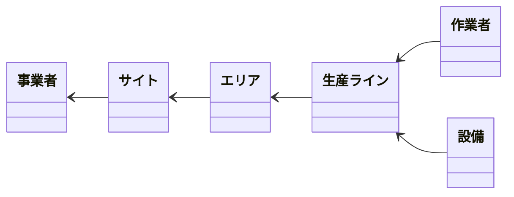
```mermaid
classDiagram
direction RL
  class 事業者
  class サイト
  class エリア
  class 生産ライン

  class 設備
  class 作業者

  作業者 --> 生産ライン
  サイト --> 事業者
  エリア --> サイト
  生産ライン --> エリア
  設備 --> 生産ライン
```

**表3　資源階層エンティティ一覧**
| エンティティ名 | 英語名 | グループ | 説明 |
|---|---|---|---|
| 事業者 | Enterprise | 階層 | 自社および取引先となる企業を表す。得意先または仕入先に加え、販売品目および購入品目における納入先や納入元が対応する。営業所や事業拠点が分かれている場合は、それぞれを独立した事業者として定義してもよい。 |
| エリア | Area | 階層 | サイト内において、特定の目的に対応して区切られた範囲を表す。フロアや生産ラインなどがこれに対応する。生産品目がエリア間を移動する場合は、在庫移動として定義するか、移動工程を生産工程として別途定義する。 |
| サイト | Site | 階層 | 製造の視点から、地理的に離れた拠点単位で定義する。一般に、ひとつの工場はひとつのサイトに対応する。仕入先の拠点をひとつのサイトとして定義することも可能である。基本的に、生産オーダはサイト内で完結するものとする。 |
| 生産ライン | Production Line | 階層 | 生産工程または生産手順に対応した生産指示を実行する対象を表す。設備単位で定義する場合もある。通常はひとりの担当者が受け持つが、シフトにより担当者が変更される場合や、複数の作業者が共同で作業する場合もある。 |

## 2.2 計画管理

生産活動の時間的な枠組みと将来の目標数値を一元的に管理する概念を定義する。稼働日やシフトを定めるカレンダとその時間区間を基盤として、生産・販売・購買・能力それぞれの領域における計画を策定・調整する機能を担い、各業務領域の活動を時間軸で整合させる役割を果たす。

**図2　計画管理：計画エンティティの関係**
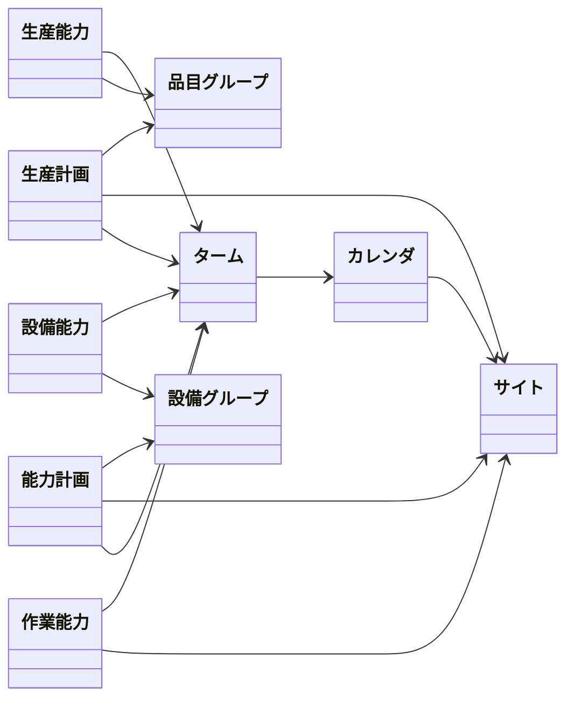
```mermaid
classDiagram
direction LR

  %%calendar --> 事業者

  生産計画 --> 品目グループ
  能力計画 --> 設備グループ

  %%production_capacity --> エリア
  生産能力 --> ターム
  生産能力 --> 品目グループ

  設備能力 --> ターム
  設備能力 --> 設備グループ

  生産計画 --> サイト
  生産計画 --> ターム

  能力計画 --> サイト
  能力計画 --> ターム

  作業能力 --> ターム
  作業能力 --> サイト

  ターム --> カレンダ
  カレンダ --> サイト  
 

```

**表4　計画管理エンティティ一覧**
| エンティティ名 | 英語名 | グループ | 説明 |
|---|---|---|---|
| カレンダ | Calendar | カレンダ | 休日、日ごとの操業時間、シフトなどの操業条件を定義したものを表す。事業者単位、または工場などのサイト単位で設定される。生産計画や作業指示などの日程管理において、稼働日や操業時間帯の基準情報として参照される。 |
| ターム | Term | ターム | カレンダを構成する各期間を表す。開始日時から終了日時までの時間幅をもつ。同一カレンダ内ではタームが重複してはならない。稼働日、休日、シフトなどの区分に対応して定義され、日程計画や実績管理に参照される。 |
| 生産計画 | Production Plan | 計画 | 週や月などの計画単位ごとに、生産数量を計画し管理する情報を表す。生産品目またはシリーズ単位で集計される。計画期間をローリングしながら新規計画の設定および修正を継続的に行う。実績情報と対応付けることで、計画との差異分析にも利用することができる。 |
| 能力計画 | Capacity Plan | 計画 | 工場がもつ生産能力について、ボトルネック設備、作業者の工数、稼働時間などの制約を考慮して、期間ごとに計画された能力情報を表す。需給計画や生産計画に対応して能力のバランスを調整し、残業やシフト変更、外注などの追加能力も考慮される。 |
| 販売計画 | Sales Plan | 計画 | 得意先からの受注動向、市場予測、販売戦略などに基づいて策定される販売計画を表す。販売担当者または販売部門が作成し、一定期間における販売目標として管理される。単位は販売品目またはシリーズ単位で設定され、需給計画における需要数量との整合が図られる。 |
| 購買計画 | Purchase Plan | 計画 | 生産計画、在庫計画、購買実績、または仕入先からの供給能力などに基づいて策定される購買計画を表す。購買担当者または購買部門が作成し、一定期間における調達目標として管理される。購買品目またはシリーズ単位で設定され、需給計画や在庫計画との整合が図られる。 |

## 2.3 資産管理

設備・人員・エネルギといった個別領域を横断する共通の資産情報を抽象的に定義し、一元管理する概念を提供する。また、あらゆる資産やプロセスを対象として継続的に状態を観察・記録する監視の仕組みを含み、異常の早期検知や品質・安全の維持に向けた情報基盤を担う。

**図3　資産管理：アセット基本構成**
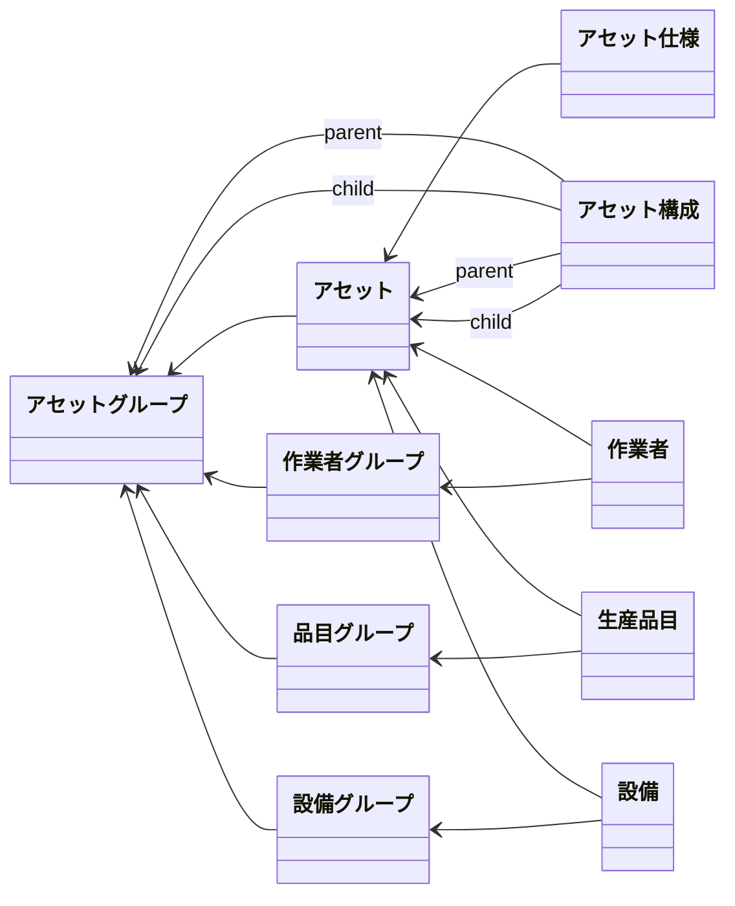
```mermaid
classDiagram
direction RL
  class アセット
  class アセットグループ
  class アセット仕様
  class アセット構成
  
  %% ================

  class 生産品目
  class 設備
  class 作業者
  class 作業者グループ
  class 品目グループ
  class 設備グループ

  アセット --> アセットグループ
  アセット仕様 --> アセット
  アセット構成 --> アセットグループ:parent
  アセット構成 --> アセットグループ:child
  アセット構成 --> アセット:parent
  アセット構成 --> アセット:child
  作業者 --> アセット
  作業者 --> 作業者グループ
  作業者グループ --> アセットグループ
  生産品目 --> アセット
  生産品目 --> 品目グループ
  品目グループ --> アセットグループ
  設備 --> アセット
  設備 --> 設備グループ
  設備グループ --> アセットグループ

```
アセットは、抽象クラスであり、ここで関係づけられたエンティティでは、アセットのサブクラスである生産品目、設備、作業者、生産ラインでも利用可能である。

**図4　資産管理：監視内容と監視結果**

```mermaid
classDiagram
direction RL
  class 監視結果
  class 監視内容

  監視結果 --> 監視内容
  ターム <-- 監視結果
  監視内容 --> アセット
  カレンダ <-- ターム
```

**表5　資産管理エンティティ一覧**
| エンティティ名 | 英語名 | グループ | 説明 |
|---|---|---|---|
| アセット | Asset | 資産 | 生産活動において価値を生成、変換、供給、または消費する対象を表す。生産品目、設備、作業者、エネルギなどの基本要素を抽象化した共通エンティティであり、それぞれの個別エンティティに共通する属性や構造を統一的に管理するために利用される。 |
| アセットグループ | Asset Group | グループ | 共通する機能、特徴、または利用目的をもつ複数のアセットで構成されるグループを表す。生産品目、設備、作業者、エネルギなど異なる種類のアセットを分類し、共通の属性や管理方針をまとめて定義する場合に利用される。 |
| アセット構成 | Asset Structure | 構成 | アセット間の親子関係、包含関係、代替関係、接続関係などの構成情報を表す。生産品目、設備、作業者、エネルギなど、異なる種類のアセット間の関係を統一的に表現し、複合的な生産システムの構造を定義するために利用される。 |
| アセット仕様 | Asset Specification | 仕様 | アセットに求められる機能、性能、品質、能力、利用条件などの仕様を定義したものを表す。アセットの種類に依存しない共通仕様を定義し、設計、運用、および評価における共通基準として利用される。仕様はアセットの種類ごとに継承して拡張することができる。 |
| 監視内容 | Monitoring Content | 内容 | アセットに対して時系列的に取得される監視データを、必要な対象、粒度、集計方法、または判定条件に応じて定義した項目を表す。監視項目に基づいて監視結果が生成される。一定周期で生成される場合と、特定の条件が成立した場合にのみ生成される場合がある。 |
| 監視結果 | Monitoring Result | 結果 | アセットに対して取得された監視データを、監視項目で定義された条件に従って集計、選別、または判定した結果を表す。設備、生産、作業者、エネルギなどの状態監視に利用されるほか、予防保全、予知保全、異常検知、品質改善などの基礎データとして利用される。 |

## 2.4 生産品目

生産活動において製造・加工・調達の対象となるモノを包括的に定義する概念を扱う。単なる識別情報にとどまらず、品目間の部品構成・機能・仕様・部位といった構造的・技術的特性と、関連する図書・不具合事象・対策までを一体として管理し、製品の品質と設計情報を維持する役割を果たす。

**図5　生産品目：品目構造と仕様**
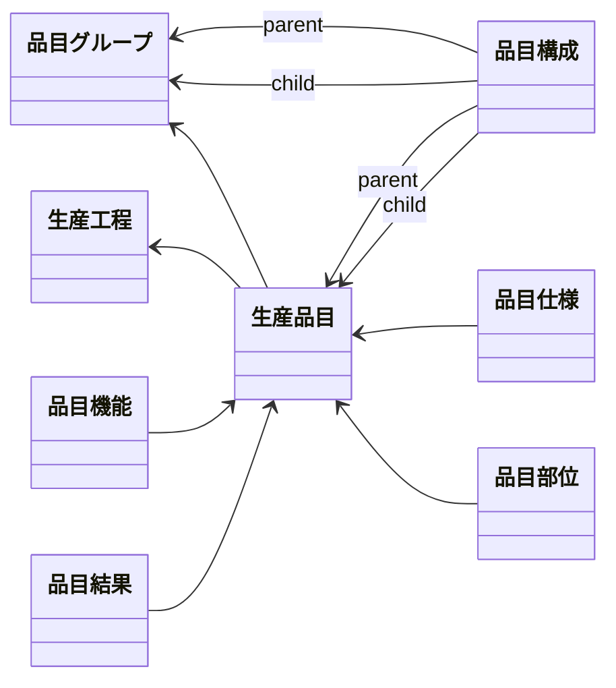
```mermaid
classDiagram
direction RL

  生産品目 --> 品目グループ
  生産品目 --> 生産工程
  品目構成 --> 品目グループ:parent
  品目構成 --> 品目グループ:child
  品目構成 --> 生産品目:parent
  品目構成 --> 生産品目:child
  品目仕様 --> 生産品目
  品目部位 --> 生産品目
  生産品目 <-- 品目機能
  生産品目 <-- 品目結果
```
以下は、図書、事象、対策というカイゼン活動に関係するエンティティの関係を示したものである。

**図6　生産品目：図書・事象・対策**
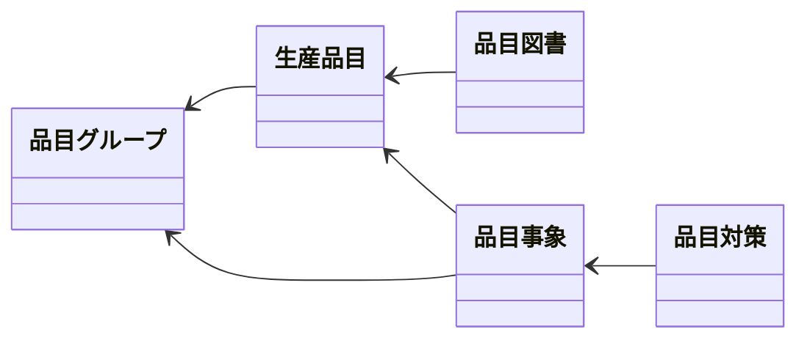
```mermaid
classDiagram
direction RL
  class 品目図書
  class 品目事象
  class 品目対策
  
  品目図書 --> 生産品目
  生産品目 --> 品目グループ
  品目事象 --> 生産品目
  品目事象 --> 品目グループ
  品目対策 --> 品目事象
```

**表6　生産品目エンティティ一覧**
| エンティティ名 | 英語名 | グループ | 説明 |
|---|---|---|---|
| 生産品目 | Production Item | 資産 | 生産対象として管理されるすべての品目を表す。生産工程に投入され、また生産工程から産出される対象が対応する。液体や粉体など、個数で管理できないものも含む。電気、ガス、水などのユーティリティは通常対象としないが、化学工程における副産物や廃棄物を含む場合もある。 |
| 品目グループ | Production Item Group | グループ | 生産品目または販売品目を、共通する機能や特徴に基づいてグループ化したものを表す。主に品目のバリエーション管理に用いる。需要予測や販売計画においてシリーズ単位で管理される場合が多く、生産計画や在庫管理の集計単位としても利用される。 |
| 品目構成 | Production Item Structure | 構成 | 販売品目に対応して、購買品目または構成部品の数量および構成関係を定義したものを表す。サマリーされた部品表（BOM）に対応する。生産オーダの発行対象となる中間品を定義することで、多階層のBOMを定義することもできる。 |
| 品目機能 | Production Item Function | 機能 | 生産品目がもつ機能や役割を定義したものを表す。顧客価値や設計意図を明確にし、品目仕様や構成要素との対応関係を管理するために利用される。設計変更や機能追加の影響範囲を把握する際の基準としても活用される。 |
| 品目仕様 | Production Item Specification | 仕様 | 生産品目に求められる機能、性能、寸法、材質、品質条件などの仕様を定義したものを表す。設計、製造、品質管理における共通の基準として利用される。品目ごとに複数の仕様バージョンを管理することができ、改定履歴の追跡にも利用される。 |
| 品目部位 | Production Item Portion | 部位 | 生産品目の一部として識別可能な特徴をもつ部分を表す。部品として物理的に切り離すことができない場合に定義する。品質管理や作業項目の対象として設定され、部位ごとに検査基準や管理条件を個別に定義することができる。 |
| 品目図書 | Production Item Document | 図書 | 生産品目に関する技術資料として、ファイル形式で提供されるものを表す。製品仕様書、図面、3D-CADデータなどが対応する。ファイル内部のデータ構造は分類ごとに定義され、品目の設計・製造・品質管理における参照資料として管理される。 |
| 品目事象 | Production Item Issue | 事象 | 生産品目に関連して発生した不具合、異常、課題、または変更要求などの事象を表す。発生日、発生条件、影響範囲、原因分析結果などを記録し、品目対策との関連付けに利用される。事象の再発防止や品質改善の基礎情報としても活用される。 |
| 品目対策 | Production Item Countermeasure | 対策 | 生産品目に関連して発生した事象に対する対策内容を表す。暫定対策、恒久対策、再発防止策などを記録し、関連する事象との対応関係を管理する。対策の実施状況や効果の検証結果を記録することができ、品質改善にも活用される。 |
| 品目結果 | Production Item Result | 結果 | 生産品目を実際に生産した結果として得られた実体を示す。生産する方法によっては対象ロットを示し、１個単位で生産した場合は個々の製品や部品を示す。異なる生産オーダ間で中間品の引当てやトレーサビリティにおいて利用される。 |

## 2.5 生産工程

製品を生産するための工程・手順・作業内容という技術的な定義から、オーダの発行・指示の実行・実績・結果の記録という運用サイクル全体を一貫して管理する概念を扱う。計画から実行・記録までを統合することで、生産活動の再現性・追跡性・改善サイクルの基盤を提供する。

**図7　生産工程：工程・手順・指示の関係**
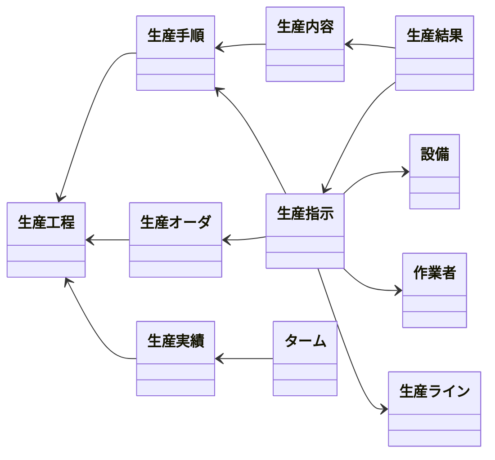
```mermaid
classDiagram
direction RL

  生産手順 --> 生産工程
  生産内容 --> 生産手順
  生産オーダ --> 生産工程

  生産指示 --> 生産オーダ
  生産指示 --> 生産手順
  生産結果 --> 生産指示
  生産結果 --> 生産内容
  ターム --> 生産実績
  生産実績 --> 生産工程

  設備 <-- 生産指示
  作業者 <-- 生産指示
  生産ライン <-- 生産指示
  %%生産結果 --> 作業者
  
```
以下は、プロセスと生産ためのアセットとの関係を示したものである。この基本構成は、保全工程、作業工程でも同じである。

**図8　生産工程：プロセスとアセットの関係**
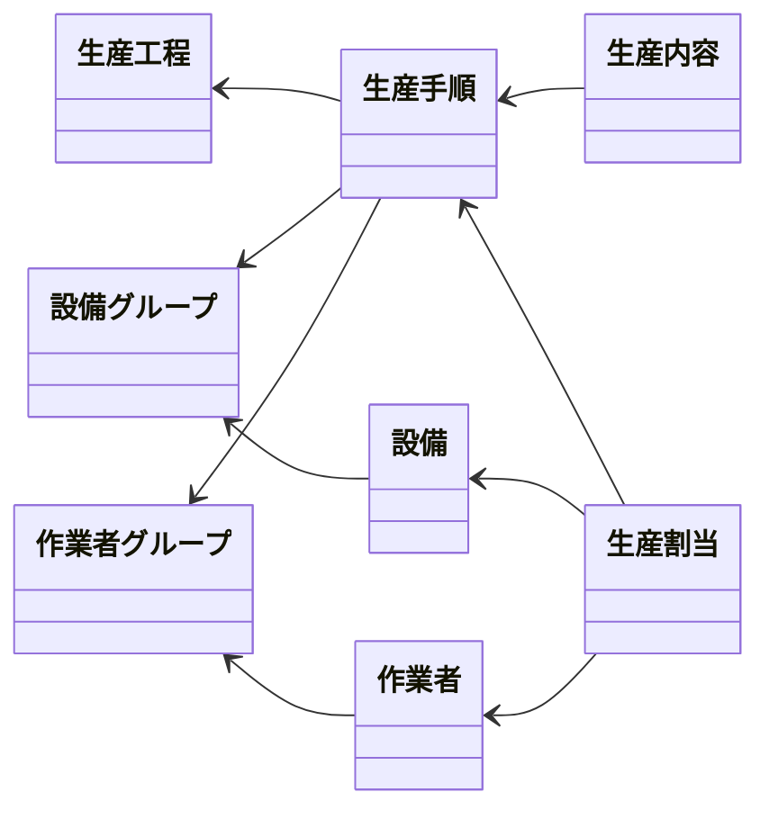
```mermaid
classDiagram
direction RL

  作業者 --> 作業者グループ
  生産手順 --> 生産工程
  生産手順 --> 設備グループ
  生産手順 --> 作業者グループ
  生産内容 --> 生産手順
  設備 --> 設備グループ

  生産割当 --> 生産手順
  生産割当 --> 設備
  生産割当 --> 作業者
```
以下は、図書、事象、対策など、現場改善に関する内容に対応している。

**図9　生産工程：図書・事象・対策**
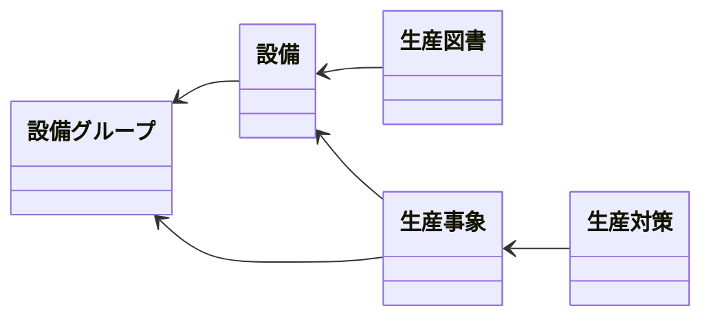
```mermaid
classDiagram
direction RL
  class 生産図書
  class 生産事象
  class 生産対策
  
  設備 --> 設備グループ
  生産図書 --> 設備
  生産事象 --> 設備
  生産事象 --> 設備グループ
  生産対策 --> 生産事象
```

**表7　生産工程エンティティ一覧**
| エンティティ名 | 英語名 | グループ | 説明 |
|---|---|---|---|
| 生産工程 | Production Process | 工程 | 生産を行う単位として、技術的な視点からあらかじめ共通的に定義された工程を表す。生産手順から参照される。生産工程には検査工程を含み、検査のみで構成される工程として定義することもできる。工程間の順序関係を設定することも可能である。 |
| 生産手順 | Production Operation | 手順 | 特定の生産品目に対応して、生産工程を具体化した内容を表す。固有の順序、条件、生産工数などが設定される。生産手順は生産工程を単純に分割したステップではなく、ひとつの生産手順がひとつの生産工程に対応する。 |
| 生産内容 | Production Content | 内容 | 生産工程または生産手順の内容を、より詳細な作業単位ごとに展開した項目を表す。作業順序、品質管理上のポイント、作業条件などが対応する。検査項目、保全項目、点検項目などは、生産内容のサブクラスとして定義することができる。 |
| 生産割当 | Production Assignment | 割当 | 生産手順や生産指示に対して、すでに生産された生産品目や在庫を割り当てるための情報を表す。また、その生産を実施する前提となる生産手順を先行作業として定義することもできる。複数の生産指示間の依存関係を管理するためにも利用される。 |
| 生産能力 | Production Capacity | 能力 | ワークセンタまたは設備が生産可能な能力を表す。ある時点における最大能力や、日などの一定期間における工数が対応する。基本的に、生産対象とは独立して、ワークセンタまたは設備ごとに能力値を設定する。能力計画の基礎情報として参照される。 |
| 生産オーダ | Production Order | オーダ | 必要な数量の生産品目の生産を要求するオーダを表す。得意先からの受注や在庫補充などに対応して生成される。生産指示を構成要素としてもち、生産オーダに対応した生産指示書を発行することができる。複数の生産指示で構成される場合もある。 |
| 生産指示 | Production Schedule | 指示 | 生産手順を特定の時刻において実行するための指示を表す。必要に応じて設備、作業者、資材などを割り当てる。開始時刻および終了時刻に対応して、着手時刻や完了時刻などの実績を記録する場合がある。生産オーダの構成要素として管理される。 |
| 生産実績 | Production Performance | 実績 | 生産指示に対応する実行結果として得られた実績を表す。実際の開始時刻、終了時刻、良品数、不良数などが対応する。分割や中断が発生した場合には、ひとつの生産指示に対して複数の生産実績を記録する場合がある。計画との差異分析に利用される。 |
| 生産結果 | Production Result | 結果 | 生産作業項目ごとに対応して記録される結果を表す。測定値、判定結果、作業記録、特記事項など、後日の分析や改善に利用される情報が対応する。作業項目ごとに記録が必要な場合には常に設定される。検査結果、保全結果、点検結果などはサブクラスとして定義できる。 |
| 生産図書 | Production Document | 図書 | 生産工程、生産手順、または生産作業に関する技術資料として、ファイル形式で提供されるものを表す。作業標準書、工程図、検査基準書、保全手順書などが対応する。ファイル内部のデータ構造は、分類ごとに定義される。 |
| 生産事象 | Production Issue | 事象 | 生産に関連して発生した異常、不具合、停止、品質問題、または改善課題などの事象を表す。発生時刻、発生条件、影響範囲、原因分析結果などを記録し、対策との関連付けに利用される。事象の発生傾向を分析し、継続的な生産改善に活用することもできる。 |
| 生産対策 | Production Countermeasure | 対策 | 生産事象に対応して実施した、または実施を予定している対策内容を表す。作業改善、工程変更、設備調整、品質対策などの内容を記録し、関連する事象との対応関係を管理するために利用される。対策の実施状況や効果の検証結果も管理される。 |

## 2.6 設備管理

生産作業を担う機械・装置を対象として、その静的な特性情報を体系的に維持・管理する概念を扱う。個々の設備の識別・分類・構造・機能・仕様・部位といった設備の「あるべき姿」を定義するとともに、関連する図書・故障事象・対策を一体的に管理し、設備の適切な利活用を支援する。

**図10　設備管理：設備基本構成**
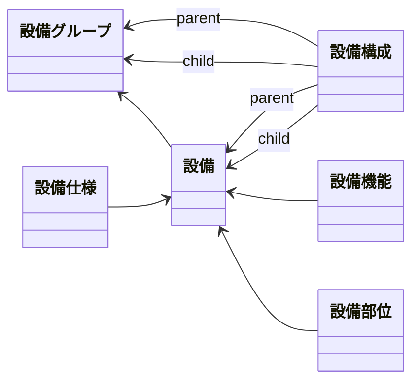
```mermaid
classDiagram
direction RL

  設備 --> 設備グループ
  設備構成 --> 設備グループ:parent
  設備構成 --> 設備グループ:child
  設備構成 --> 設備:parent
  設備構成 --> 設備:child
  設備機能 --> 設備
  設備部位 --> 設備
  設備 <-- 設備仕様


```

設備の不具合などに関する情報は、以下のエンティティが対応する。

**図11　設備管理：設備の事象・対策**
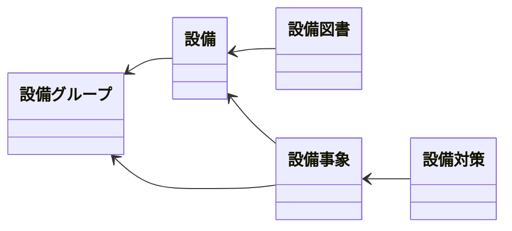
```mermaid
classDiagram
direction RL
  class 設備図書
  class 設備事象
  class 設備対策

  設備図書 --> 設備
  設備事象 --> 設備
  設備事象 --> 設備グループ
  設備 --> 設備グループ
  設備対策 --> 設備事象
```

**表8　設備管理エンティティ一覧**
| エンティティ名 | 英語名 | グループ | 説明 |
|---|---|---|---|
| 設備 | Equipment | 資産 | 工場の現場において、生産に関わる作業を実行する機械、装置、または設備を表す。自動化され自律的に動作する設備を、作業者が監視または操作する場合もある。空調設備のように、直接生産に関与しない設備を対象とする場合もある。 |
| 設備グループ | Equipment Group | グループ | 同じ機能をもつ複数の設備で構成されるグループを表す。物理的には別の設備であっても、性能上同等の機能をもつ設備をまとめて定義する。主に、生産時に代替設備を選択する際の判断基準として利用され、能力計画における集計単位としても利用される。 |
| 設備構成 | Equipment Structure | 構成 | 設備が他の設備の一部として定義される場合に、その親子関係を表す。ひとつの設備は複数の子設備をもつ場合があるが、複数の親設備をもつことは一般的ではない。保全計画や故障分析において、設備間の依存関係を把握するためにも利用される。 |
| 設備機能 | Equipment Function | 機能 | 設備がもつ機能や役割を定義したものを表す。設備仕様や設備部位との対応関係を管理し、設備の利用目的や制御対象を明確にするために利用される。生産工程への割当条件や、代替設備の選定基準としても参照されることがある。 |
| 設備仕様 | Equipment Specification | 仕様 | 設備に求められる機能、性能、寸法、能力、制御条件、保全条件などの仕様を定義したものを表す。設備の設計、導入、運用、および保全における共通の基準として利用される。仕様はバージョン管理され、改定履歴を追跡することができる。 |
| 設備部位 | Equipment Portion | 部位 | 設備を構成し、特定の機能を有する識別可能な部分を表す。複数の機器で構成される設備では、それぞれの機器が設備部位に対応する。設備保全や点検を行う場合には、設備部位ごとに作業手順や点検項目を個別に設定することができる。 |
| 設備図書 | Equipment Document | 図書 | 設備に関する技術資料として、ファイル形式で提供されるものを表す。設備仕様書、取扱説明書、配線図、保全マニュアル、CADデータなどが対応する。ファイル内部のデータ構造は分類ごとに定義され、設備の保全や運用における参照資料として管理される。 |
| 設備事象 | Equipment Issue | 事象 | 設備の故障や異常、停止、不具合など、設備に関連して発生した特徴的な事象を表す。チョコ停や故障履歴など、実際に発生した事象の記録が対応する。監視結果が自動的に収集された状態情報であるのに対し、設備事象は作業者の判断や分析を伴って記録される。 |
| 設備対策 | Equipment Countermeasure | 対策 | 設備事象に対応して実施した、または実施を予定している対策内容を表す。設備指示とは異なり、発生した状況に応じて必要な作業内容を定義し、その実施結果を管理するために利用される。対策の効果を検証し、再発防止策の立案にも活用される。 |

## 2.7 保全管理

設備の保全・点検・修理という維持管理活動を、工程の定義から実際の作業実行・記録までの一連のサイクルとして管理する概念を扱う。保全作業に必要なリソースの能力・割当・オーダ・指示という計画から実績・結果の収集までを統合し、設備の安定稼働と長期的な信頼性確保を支援する。

**図12　保全管理**
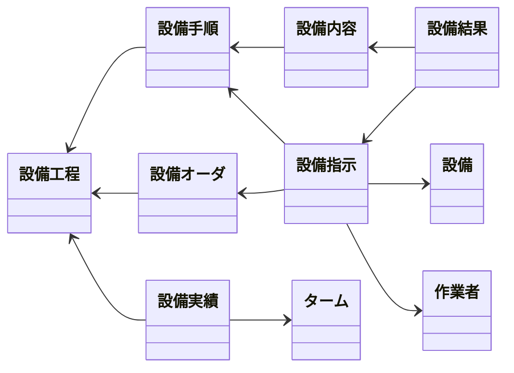
```mermaid
classDiagram
direction RL

  設備手順 --> 設備工程
  設備オーダ --> 設備工程
  設備実績 --> 設備工程

  設備内容 --> 設備手順
  設備指示 --> 設備オーダ

  設備指示 --> 設備手順

  設備結果 --> 設備指示
  設備結果 --> 設備内容

  設備 <--   設備指示
  作業者 <-- 設備指示  
  ターム <-- 設備実績
```

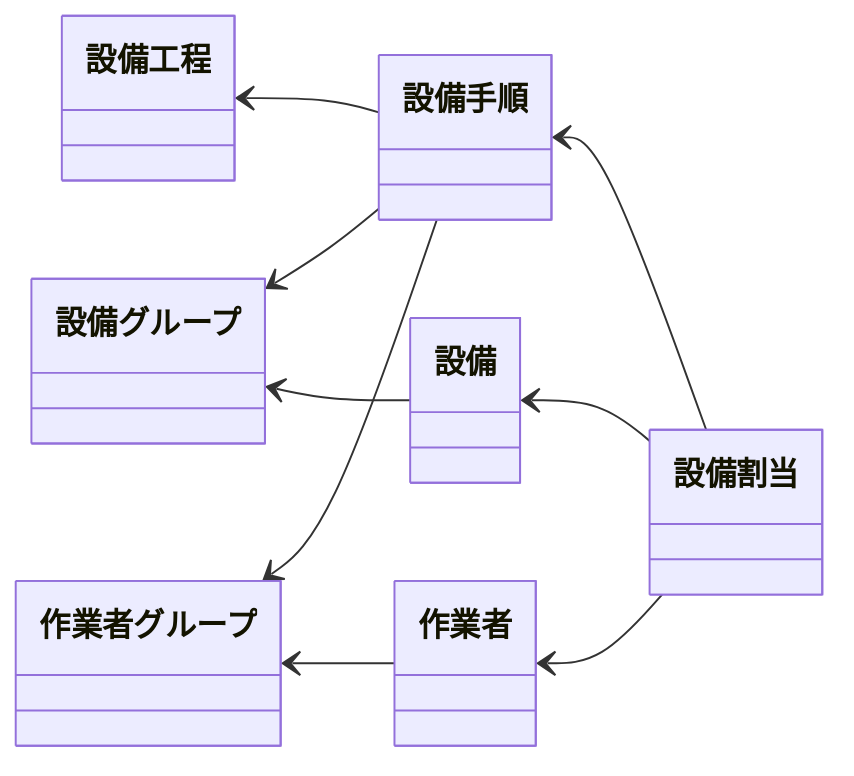
```mermaid
classDiagram
direction RL
  設備手順 --> 設備工程

  設備割当 --> 設備手順
  設備割当 --> 設備
  設備割当 --> 作業者

  設備手順 --> 設備グループ
  設備 --> 設備グループ
  設備手順 --> 作業者グループ
  
  作業者 --> 作業者グループ
```

**表9　保全管理エンティティ一覧**
| エンティティ名 | 英語名 | グループ | 説明 |
|---|---|---|---|
| 設備工程 | Equipment Process | 工程 | 特定の生産品目ではなく、設備を対象とした作業を共通的に定義した工程を表す。設備手順のひな型として利用される。保全項目、点検項目、清掃項目などを構成要素としてあらかじめ設定することができる。複数の設備手順に共通する内容を一元管理するために利用される。 |
| 設備手順 | Equipment Operation | 手順 | 特定の設備を対象として実施される保全作業または運用作業を表す。定期点検、故障時の事後保全、予防保全、立上げ、シャットダウンなどが対応する。設備工程を特定の設備に対して具体化したものとして定義され、手順ごとに必要な工具や担当者を指定できる。 |
| 設備内容 | Equipment Content | 内容 | 設備工程または設備手順の内容を、より詳細な作業単位ごとに展開した項目を表す。点検項目、測定項目、調整項目、交換項目、清掃項目などが対応する。設備結果の記録単位として利用することもでき、作業の実施確認や品質記録の管理に活用される。 |
| 設備割当 | Equipment Assignment | 割当 | 生産手順に対して設備を割り当てることができるかどうかを指定する情報を表す。複数の設備が候補となる場合に、その中から実際に使用する設備を選択するための条件や優先順位を定義することができる。設備の稼働状況や能力に基づいて割当を決定する際に利用される。 |
| 設備能力 | Equipment Capacity | 能力 | 設備が実行可能な作業能力を表す。ある時点における最大能力や、日などの一定期間における稼働可能時間、保全可能工数などが対応する。基本的に、設備ごとに能力値を設定する。生産能力や能力計画の基礎情報として参照される。 |
| 設備オーダ | Equipment Order | オーダ | 特定の設備に対して設備手順を実施するためのオーダを表す。ひとつ以上の設備指示または移動指示で構成される。複数の設備を対象とした特定の設備工程や、ひとつの設備に対する複数の設備工程をまとめて管理する場合に利用される。 |
| 設備指示 | Equipment Schedule | 指示 | 設備手順を特定の時刻において実行するための指示を表す。必要に応じて治工具、担当者、資材などを割り当てる。設備点検や保全作業に加え、日々の立上げやシャットダウンなどの作業も含む。移動設備の場合には、移動指示として定義される。 |
| 設備実績 | Equipment Performance | 実績 | 生産オーダ、生産指示、または設備指示に対応して、設備が実際に稼働した結果を表す。対応する設備指示が存在しない場合や、待機状態、停止状態なども含め、設備の稼働実績を網羅的に記録する。OEEや稼働率の分析にも利用することができる。 |
| 設備結果 | Equipment Result | 結果 | 設備作業項目ごとに対応して記録される結果を表す。測定値、点検結果、保全結果、異常判定、特記事項など、後日の分析や改善に利用される情報が対応する。作業項目ごとに記録が必要な場合には常に設定され、設備の状態管理に活用される。 |

## 2.8 作業者

生産活動を担う人材を対象として、その静的な特性情報を体系的に維持・管理する概念を扱う。個々の作業者の識別・分類・組織構成・スキル・仕様・部位といった「あるべき姿」を定義するとともに、関連する教育図書・問題事象・対策を一体的に管理し、人材の適切な育成と配置を支援する。

**図13　作業者管理**
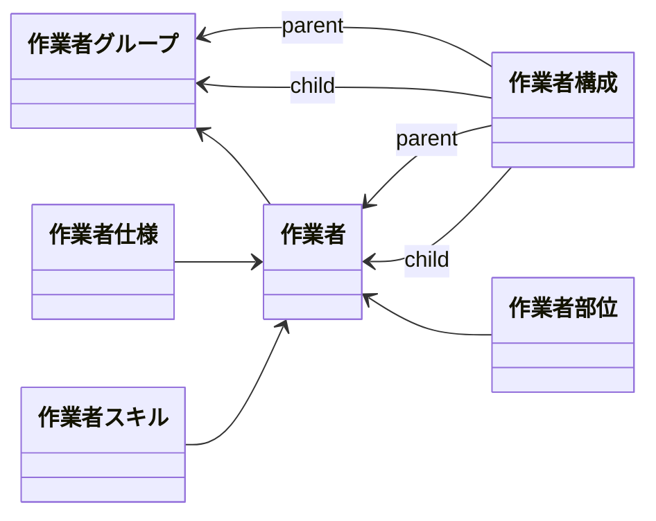
```mermaid
classDiagram
direction RL

  作業者 --> 作業者グループ
  作業者構成 --> 作業者グループ:parent
  作業者構成 --> 作業者グループ:child
  作業者構成 --> 作業者:parent
  作業者構成 --> 作業者:child
  作業者　<-- 作業者仕様
  作業者 <-- 作業者スキル
  作業者部位 --> 作業者
  
```

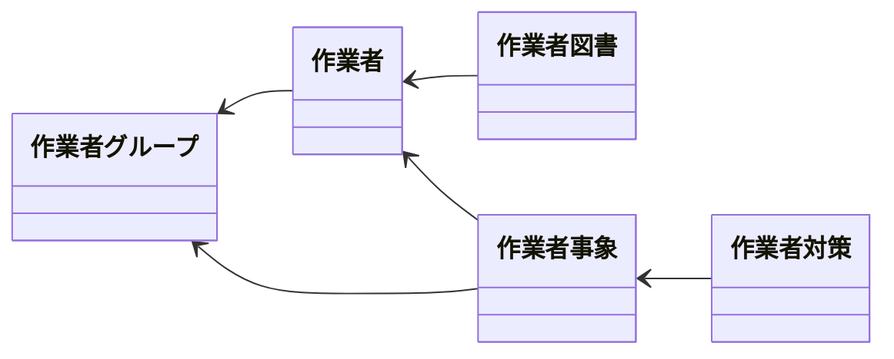
```mermaid
classDiagram
direction RL

  作業者 --> 作業者グループ
  作業者事象 --> 作業者グループ
  作業者図書 --> 作業者
  作業者事象 --> 作業者
  作業者対策 --> 作業者事象 
```

**表10　作業者管理エンティティ一覧**
| エンティティ名 | 英語名 | グループ | 説明 |
|---|---|---|---|
| 作業者 | Personnel | 資産 | 工場において、生産に関する作業を実行する人員を表す。直接工または間接工として労務費の対象となる。作業者は従業員に対応するが、同一の従業員が複数のサイトにおける作業者として登録される場合があり、スキルや資格を個別に管理できる。 |
| 作業者グループ | Personnel Group | グループ | 工場やエリアなどにおいて、生産に従事する作業者で構成されるグループを表す。班長などのリーダーが、作業班単位で生産実績や作業状況を管理する場合に対応する。作業班単位でシフトを構成する場合や、エリア単位で設備保全を担当する場合にも利用される。 |
| 作業者構成 | Personnel Structure | 構成 | 作業者間の代替関係、補完関係、または階層関係などの構成情報を表す。特定の作業者が他の作業者を代替できる場合や、技能継承や支援関係を定義する場合に利用される。ひとりの作業者が複数の作業者と関係をもつ場合もある。 |
| 作業者スキル | Personnel Skill | 機能 | 作業者が実行可能な生産工程、生産手順、作業項目、保全作業、または検査項目と、その習熟レベルを表す。資格管理や技能向上の評価基準として利用することもできる。工程への担当者割当や、教育計画の立案においても参照される。 |
| 作業者仕様 | Personnel Specification | 仕様 | 作業者に求められる役割、能力、資格、勤務条件、教育要件などの仕様を定義したものを表す。人員配置、教育計画、および作業標準の共通基準として利用される。仕様に基づいて作業者のスキルや適性を評価し、適切な工程への割当に活用することができる。 |
| 作業者部位 | Personnel Portion | 部位 | 作業者の身体的または機能的な特徴として識別可能な部分を表す。作業分析、人間工学評価、安全管理、または動作解析の対象として定義する場合に利用される。負荷管理や作業改善における分析の単位として活用されることもある。 |
| 作業者図書 | Personnel Document | 図書 | 作業者に関する技術資料または管理資料として、ファイル形式で提供されるものを表す。教育資料、資格証明書、作業記録、訓練履歴などが対応する。ファイル内部のデータ構造は分類ごとに定義され、人員管理や教育計画の基礎情報として管理される。 |
| 作業者事象 | Personnel Issue | 事象 | 作業者に関連して発生した異常、問題、事故、ヒューマンエラー、または改善課題などの事象を表す。発生条件、影響範囲、原因分析結果などを記録し、対策との関連付けに利用される。再発防止や安全管理の改善に向けた基礎情報としても活用される。 |
| 作業者対策 | Personnel Countermeasure | 対策 | 作業者事象に対応して実施した、または実施を予定している対策内容を表す。教育、再訓練、作業改善、安全対策などの内容を記録し、関連する事象との対応関係を管理するために利用される。対策の効果を検証し再発防止に活用できる。 |

## 2.9 作業管理

人が主体となって行う作業活動を、工程の定義から実際の実行・記録までの一連のサイクルとして管理する概念を扱う。作業に必要な能力・割当・オーダ・指示という計画の側面から、実績・結果の収集までを統合し、人的作業の標準化・進捗管理・パフォーマンス向上を体系的に支援する。

**図14　作業管理**
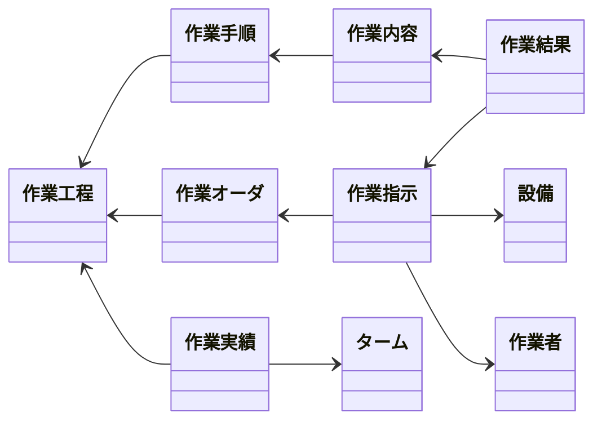
```mermaid
classDiagram
direction RL

  作業手順 --> 作業工程
  作業オーダ --> 作業工程
  作業実績 --> 作業工程

  作業内容 --> 作業手順
  作業結果 --> 作業内容

  作業指示 --> 作業オーダ
  作業結果 --> 作業指示

  設備 <-- 作業指示
  作業者 <-- 作業指示

  ターム <-- 作業実績

```
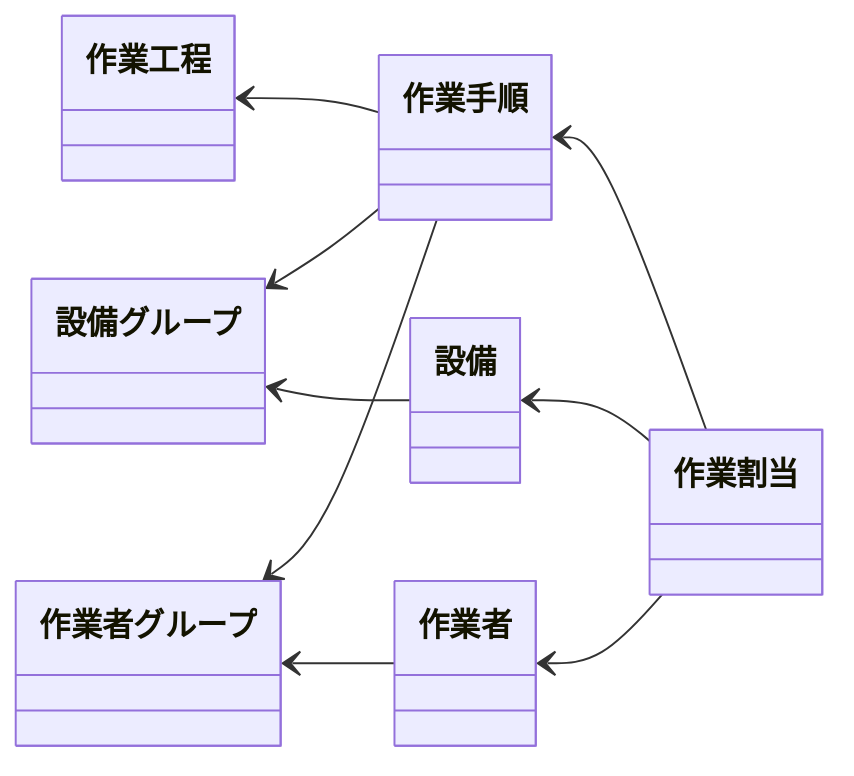
```mermaid
classDiagram
direction RL

  作業手順 --> 作業工程
  作業手順 --> 設備グループ
  作業手順 --> 作業者グループ
  設備 --> 設備グループ
  作業者 --> 作業者グループ
  作業割当 --> 作業手順
  作業割当 --> 作業者
  作業割当 --> 設備
```

**表11　作業管理エンティティ一覧**
| エンティティ名 | 英語名 | グループ | 説明 |
|---|---|---|---|
| 作業工程 | Work Process | 工程 | 作業者が行う工程、あるいは生産工程や設備工程に該当しない一般的な工程を表す。作業手順のひな型として利用される。間接作業、教育訓練、搬送作業など、生産以外の作業活動を体系的に定義し、作業指示や実績管理の対象として管理するために利用される。 |
| 作業手順 | Work Operation | 手順 | 作業工程を構成する一段階細かな工程や活動の単位を表す。あらかじめ実施順序や先行関係が設定されている。一連の作業手順を構成するひとつのステップに対応し、順序が重要な場合は追番をつけて定義する。担当者や必要な道具を個別に設定することもできる。 |
| 作業内容 | Work Content | 内容 | 作業手順を実際に行う場合のより具体的な内容を示す情報を表す。この内容を参照して作業者は実際に作業を実施する。手順ごとの注意事項、使用ツール、完了条件なども記述することができ、作業品質の均一化や標準化に活用される。 |
| 作業割当 | Work Assignment | 割当 | 作業手順や作業指示に対して、設備や作業者、あるいは在庫などを割り当てるための情報を表す。また、その作業を実施する前提となる作業手順を先行作業として定義することもできる。複数の作業指示間の依存関係や実施順序を管理するためにも利用される。 |
| 作業能力 | Work Capacity | 能力 | 作業者が実行可能な作業能力を表す。ある時点における最大稼働時間や、日などの一定期間における作業可能工数、または保有スキルに基づく対応可能な作業範囲などが対応する。基本的に、作業者または作業者グループごとに能力値を設定する。 |
| 作業オーダ | Work Order | オーダ | 特定の作業者または作業者グループに対して作業手順を実施するためのオーダを表す。ひとつ以上の作業者指示で構成される。複数の作業者を対象とした特定の作業工程や、ひとりの作業者に対する複数の作業工程を含む場合がある。 |
| 作業指示 | Work Schedule | 指示 | 作業手順を特定の時刻において実行するための指示を表す。必要に応じて設備、治工具、作業場所、または補助作業者などを割り当てる。シフト勤務、教育訓練、保全作業、検査作業なども対象とすることができる。作業実績の記録単位としても利用される。 |
| 作業実績 | Work Performance | 実績 | 生産オーダ、生産指示、または作業者指示に対応して、作業者が実際に実施した結果を表す。実際の開始時刻、終了時刻、作業時間、作業数量、または待機時間などが対応する。対応する作業者指示が存在しない場合や、待機状態なども含めて記録することができる。 |
| 作業結果 | Work Result | 結果 | 作業者の作業項目ごとに対応して記録される結果を表す。測定値、確認結果、作業記録、教育結果、技能評価、特記事項など、後日の分析や改善に利用される情報が対応する。作業項目ごとに記録が必要な場合には常に設定される。 |

## 2.10 在庫管理

品目の在庫状態をある時点の数量として捉えるとともに、保管能力の制約のもとで入出庫・移動を計画・実行・記録するサイクルを管理する概念を扱う。静的な在庫水準の把握と動的な在庫変動の追跡を統合することで、適正在庫の維持と欠品・過剰在庫の防止を支援する。

**図15　在庫管理**
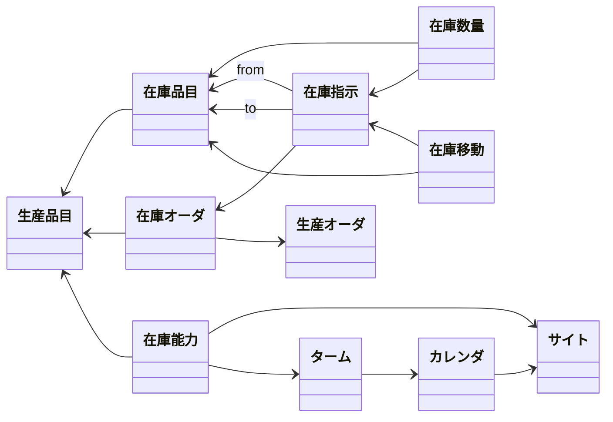
```mermaid
classDiagram
direction RL
  class 在庫品目
  class 在庫オーダ
  class 在庫指示
  class 在庫移動
  class 在庫数量

  %% ================

  在庫品目 --> 生産品目
  在庫数量 --> 在庫品目
  在庫数量 --> 在庫指示
  在庫指示 --> 在庫オーダ
  在庫指示 --> 在庫品目:from
  在庫指示 --> 在庫品目:to
  在庫移動 --> 在庫品目
  在庫移動 --> 在庫指示
  在庫オーダ --> 生産品目
  生産オーダ <-- 在庫オーダ

  在庫能力 --> 生産品目 

  サイト <--   在庫能力
  ターム <-- 在庫能力 
  カレンダ <-- ターム
  サイト <-- カレンダ  

```

**表12　在庫管理エンティティ一覧**
| エンティティ名 | 英語名 | グループ | 説明 |
|---|---|---|---|
| 在庫品目 | Inventory Item | 製品 | 在庫管理の対象となる生産品目を、在庫場所ごとに定義したものを表す。販売品目や購買品目に加えて、中間品、仕掛品、副産物なども対象となる。ひとつの生産品目が複数の在庫場所に対応して複数の在庫品目として定義される場合がある。在庫管理の対象外となる品目は定義されない。 |
| 在庫能力 | Inventory Capacity | 能力 | 在庫場所において保管することができる能力を表す。保管スペースなどの物理的制約、期間など品質管理上の制約、あるいは財務的な制約などが対応する。在庫計画や補充計画において、保管可能量の上限を管理するための基準として利用される。 |
| 在庫オーダ | Inventory Order | オーダ | 在庫品目の移動、補充、引当、または棚卸を実施するためのオーダを表す。ひとつ以上の在庫指示で構成される。生産指示、出荷指示、入荷指示、または在庫補充計画などに対応して生成される。在庫の過不足を防ぐための計画的な在庫調整にも利用される。 |
| 在庫指示 | Inventory Schedule | 指示 | 在庫品目を特定の時刻において移動、補充、引当、または棚卸するための指示を表す。ピッキングなど、主に在庫場所からワークセンタへ出庫する作業が対応する。在庫場所への入庫や、ワークセンタ間、または在庫場所間の移動も定義することができる。 |
| 在庫移動 | Inventory Transfer | 実績 | 出荷、入荷、または在庫指示などに対応して、在庫品目の数量が増減した結果を表す。実際に在庫が移動した場合には、移動元および移動先のそれぞれに対して在庫数量の増減値として記録される。在庫数量の正確性を維持するための基礎データとして利用される。 |
| 在庫数量 | Inventory Result | 結果 | 在庫品目に対して、ある時点における在庫数量を計算または実地棚卸によって取得した結果を表す。理論在庫、棚卸在庫、調整後在庫などの数量情報が対応する。差異分析や在庫精度の向上、補充計画の立案において参照される基礎情報として利用される。 |

## 2.11 エネルギ管理

電力・熱・ガスなどのエネルギ資源を、設備や品目と同等の資産として捉え、その調達・供給・消費・変換を体系的に管理する概念を扱う。エネルギの構造・機能・仕様の定義から、能力・オーダ・指示・実績・結果という運用サイクル全体を統合し、エネルギの効率的な利用と可視化を支援する。

**図16　エネルギ管理：エネルギ基本構成**
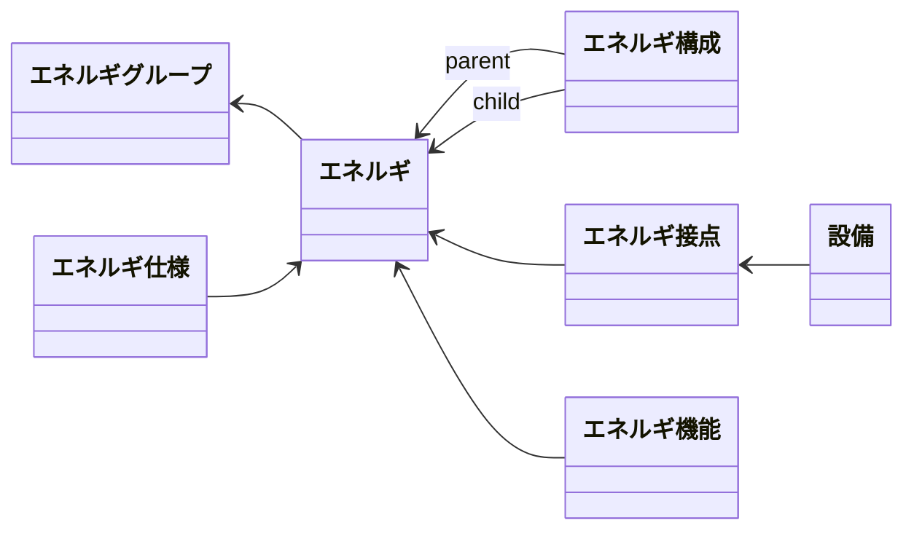
```mermaid
classDiagram
direction RL

  エネルギ --> エネルギグループ
  エネルギ構成 --> エネルギ:parent
  エネルギ構成 --> エネルギ:child
  エネルギ接点 --> エネルギ
  エネルギ機能 --> エネルギ
  エネルギ <-- エネルギ仕様
  設備 --> エネルギ接点
```

以下は、エネルギの現場での中継地点であるエネルギノードを中核としたトランザクションデータによってエネルギの流れを示す。

**図17　エネルギ管理：エネルギノードとトランザクション**
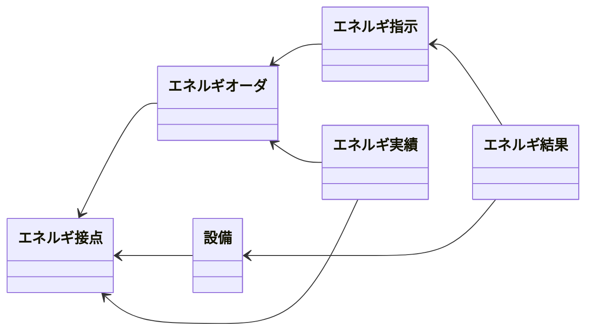
```mermaid
classDiagram
direction RL
  class エネルギオーダ
  class エネルギ指示
  class エネルギ実績
  class エネルギ結果

  エネルギオーダ --> エネルギ接点
  設備 --> エネルギ接点
  エネルギ指示 --> エネルギオーダ
  エネルギ結果 --> エネルギ指示
  エネルギ結果 --> 設備
  エネルギ実績 --> エネルギ接点
  エネルギ実績 --> エネルギオーダ

```

```mermaid
classDiagram
direction LR
  class カレンダ
  class ターム

  エネルギ計画 --> エネルギグループ
  エネルギ計画 --> ターム
  エネルギ計画 --> サイト

  ターム --> カレンダ
  カレンダ --> サイト  

  エネルギ能力 --> エネルギグループ


  エネルギ能力 --> サイト
  エネルギ能力 --> ターム

```

**表13　エネルギ管理エンティティ一覧**
| エンティティ名 | 英語名 | グループ | 説明 |
|---|---|---|---|
| エネルギ | Energy | 資産 | 生産活動を実行するうえで必要となるエネルギを表す。電気、ガス、蒸気、圧縮空気、灯油、水などの動力源またはユーティリティが対応する。それぞれについて供給量と消費量のバランスを管理し、エネルギコストの削減や省エネ施策の立案に活用される。 |
| エネルギグループ | Energy Group | グループ | 同じ種類または同等の機能をもつ複数のエネルギ源で構成されるグループを表す。電力系統、ガス系統、蒸気系統など、供給源や利用目的が共通するエネルギをまとめて管理する場合に利用される。供給の冗長化や代替経路の選択に利用することもできる。 |
| エネルギ構成 | Energy Structure | 構成 | エネルギ供給における供給源、変換設備、蓄積設備、消費設備などの接続関係や構成情報を表す。ひとつのエネルギ源が複数の供給経路をもつ場合や、複数の供給源が統合される場合に利用される。供給経路の可視化や障害時の代替経路の管理にも活用される。 |
| エネルギ機能 | Energy Function | 機能 | エネルギがもつ供給、変換、蓄積、分配、または消費などの機能を定義したものを表す。設備や生産工程に対して必要なエネルギの役割や供給条件を明確にするために利用される。エネルギ効率の評価や省エネ対策の立案における分析単位としても活用される。 |
| エネルギ仕様 | Energy Specification | 仕様 | エネルギに求められる種類、品質、供給能力、圧力、電圧、温度、流量、供給条件などの仕様を定義したものを表す。設備設計、生産計画、およびエネルギ管理の共通基準として利用される。仕様はエネルギの種類ごとに個別に定義することができる。 |
| エネルギ接点 | Energy Node | 部位 | エネルギの供給、変換、分配、または消費が行われる接続点を表す。受電点、分電盤、バルブ、配管接続点、タンク接続点などが対応する。エネルギの流れや使用状況を管理する基準点として利用され、計測データの収集地点として定義されることもある。 |
| エネルギ能力 | Energy Capacity | 能力 | エリアまたはサイトにおいて共有可能なエネルギ供給能力を表す。対象期間における特定のエネルギの最大供給量、供給時間、または利用可能量が対応する。設備や生産工程は、ここで定義されたエネルギ能力を消費する。 |
| エネルギオーダ | Energy Order | オーダ | 特定の期間において必要なエネルギの供給または消費を要求するオーダを表す。生産計画、設備計画、またはエネルギ管理計画に対応して生成される。ひとつ以上のエネルギ指示で構成され、エネルギの需給バランスを管理するための基礎情報として利用される。 |
| エネルギ指示 | Energy Schedule | 指示 | エネルギの供給、蓄積、変換、または消費を特定の時刻において実行するための指示を表す。必要に応じて供給源、蓄積設備、変換設備、または消費設備などを割り当てる。ピーク制御や負荷平準化のために利用される場合もある。 |
| エネルギ実績 | Energy Performance | 実績 | エネルギオーダまたはエネルギ指示に対応して、実際に供給、変換、蓄積、または消費された結果を表す。実際の供給量、消費量、使用時間、効率、または損失量などが対応する。計画されていない消費や待機損失なども記録することができる。 |
| エネルギ結果 | Energy Result | 結果 | エネルギ作業項目またはエネルギ接点ごとに対応して記録される結果を表す。測定値、負荷状態、効率、品質指標、異常判定、特記事項など、後日の分析や改善に利用される情報が対応する。記録が必要な場合には常に設定される。 |

## 2.12 販売管理

得意先との商取引を起点として、製品の販売に関わる情報を受注から出荷までの一連の流れとして管理する概念を扱う。得意先固有の仕様・価格条件の把握、見積・内示・受注・請求・出荷という取引プロセスを統合することで、顧客要求への適切な対応と販売活動全体の管理を支援する。

**図18　販売管理：販売品目の関係**
```mermaid
classDiagram
direction RL

  class 得意先
  class 販売品目
  class 受注伝票
  class 受注明細
  class 販売仕様

  class 販売請求
  class 受注内示
  class 販売見積
  class 出荷明細

  %% ================

  受注明細 --> 受注伝票
  受注伝票 --> 得意先
  販売品目 --> 生産品目
  販売請求 --> 得意先
  販売仕様 --> 得意先
  受注内示 --> 販売品目
  販売見積 --> 得意先
  出荷明細 --> 受注明細
  受注明細 --> 販売品目
  販売品目 --> 得意先

```
実際に注文があった場合は、以下のモデルによって処理される。

**図19　販売管理：受注業務の流れ**
```mermaid
classDiagram
direction RL
  出荷明細 --> 受注明細
  受注明細 --> 受注伝票
  受注内示 --> 販売品目
  販売見積 --> 販売品目
  受注明細 --> 販売品目
  販売請求 --> 出荷明細

  販売計画 --> サイト
  販売計画 --> ターム

```

**表14　販売管理エンティティ一覧**
| エンティティ名 | 英語名 | グループ | 説明 |
|---|---|---|---|
| 得意先 | Customer | 会社 | 自社で製造した販売品目を提供する相手となる事業者を表す。得意先からの受注に対応して対象となる販売品目を出荷する。ある事業者が得意先であると同時に仕入先となる場合もある。得意先ごとに価格条件や納入条件などの取引情報を設定することができる。 |
| 販売品目 | Sales Item | 製品 | 生産品目のうち、得意先に提供される品目を表す。得意先の仕様に対応した個別品目と、自社が標準として保有するカタログ品目がある。販売品目には、販売先となる得意先の情報、価格、納入条件などを設定することができ、得意先ごとに複数設定することもできる。 |
| 受注伝票 | Sales Document | 注文伝票 | 得意先から一回の取引として受け取った注文情報の管理単位を表す。ひとつ以上の受注明細で構成される。販売品目ごとの注文内容に加えて、消費税、値引条件、納入場所、支払条件などの共通情報が伝票単位で付加される。 |
| 受注明細 | Sales Order | 注文明細 | 得意先から受け取った注文情報のうち、個々の販売品目に対応する受注内容を表す。数量、納期、単価、仕様などが含まれる。見込受注、内示情報、または仕様や数量が未確定の確定受注を含む場合もある。生産オーダや出荷指示の発行に連動することができる。 |
| 販売仕様 | Sales Specification | 仕様 | 販売品目に対して、得意先ごとに要求される仕様、価格条件、納入条件、包装条件、品質条件などを定義したものを表す。販売品目の個別条件を管理するために利用される。受注対応や見積作成における条件確認の基準としても参照される。 |
| 販売請求 | Sales Invoice | 請求 | 受注に対応して販売品目を出荷した後、得意先に対して発行される請求情報を表す。通常は得意先ごとの締日に対応して、月次または一定期間ごとにまとめて発行される。出荷明細との照合により請求内容の正確性を確認することができる。 |
| 受注内示 | Sales Forecast | 内示 | 得意先から受け取る将来需要に関する予測情報を表す。確定受注の前段階として、一定期間内における予測数量や納期情報がまとめられる。需要計画や生産計画の基礎情報として利用され、業界によっては内示をもとに資材調達や生産準備を開始する場合もある。 |
| 販売見積 | Sales Quotation | 見積 | 得意先から受け取った見積依頼、およびそれに対する回答内容を表す。通常は販売品目に対応する価格や納期の照会が対象となる。個別案件では、仕様書や図面などをもとに、生産工程の選定を含めた見積を行う場合もある。 |
| 出荷明細 | Shipping Result | 結果 | 受注に対応して販売品目を出荷した結果を表す。ひとつの受注に対して複数の出荷が対応する場合もある。出荷情報に基づいて販売請求を生成する処理が行われる。支給品として提供される生産品目の出荷を含む場合もある。 |

## 2.13 購買管理

仕入先との商取引を起点として、資材・部品の調達に関わる情報を発注から入荷までの一連の流れとして管理する概念を扱う。仕入先固有の仕様・価格条件の把握、見積・内示・発注・請求・入荷という調達プロセスを統合することで、安定調達の実現とサプライチェーン全体の管理を支援する。

**図20　購買管理：購買品目の関係**
```mermaid
classDiagram
direction RL

  class 仕入先
  class 購買品目
  class 購買伝票
  class 購買明細
  class 購買仕様

  class 購買請求
  class 仕入内示
  class 購買見積
  class 入荷明細

  %% ================

  購買明細 --> 購買伝票
  購買伝票 --> 仕入先
  購買品目 --> 生産品目
  購買請求 --> 仕入先
  購買仕様 --> 仕入先
  仕入内示 --> 購買品目
  購買見積 --> 仕入先
  入荷明細 --> 購買明細
  購買明細 --> 購買品目
  購買品目 --> 仕入先

```
購買オーダ（仕入伝票）を中心とした業務の流れに関係するデータは以下となる。

**図21　購買管理：発注業務の流れ**
```mermaid
classDiagram
direction RL
  入荷明細 --> 購買明細
  購買明細 --> 購買伝票
  仕入内示 --> 購買品目
  購買見積 --> 購買品目
  購買明細 --> 購買品目
  購買請求 --> 入荷明細

  購買計画 --> サイト
  購買計画 --> ターム

```

**表15　購買管理エンティティ一覧**
| エンティティ名 | 英語名 | グループ | 説明 |
|---|---|---|---|
| 仕入先 | Supplier | 会社 | 製造に必要な部品、資材、またはサービスを調達する相手となる事業者を表す。仕入先への発注に対応して対象となる購買品目を入荷する。生産委託や工程委託を行う場合の取引先も仕入先として定義され、取引条件を個別に設定できる。 |
| 購買品目 | Purchase Item | 製品 | 生産品目のうち、仕入先から提供される品目を表す。仕入先のカタログに登録された標準品目と、仕様を指定した個別品目がある。購買品目には、想定される仕入先や購買条件などを設定することができる。生産委託や工程委託に対応する生産品目は、通常の購買品目には含まれない。 |
| 購買伝票 | Purchase Document | 注文伝票 | 仕入先に対して一回の取引として送付される注文情報の管理単位を表す。ひとつ以上の購買明細で構成される。生産委託や工程委託の場合には生産品目が対象となり、図面や仕様書などの関連資料が付加される場合もある。 |
| 購買明細 | Purchase Order | 注文明細 | 仕入先に対する個々の注文情報を表す。ひとつの購買品目または生産委託案件に対応して、数量、納期、単価、仕様などが含まれる。副資材や消耗品など、製造間接費に対応する資材も購買対象となる場合がある。入荷明細や請求との照合に利用される。 |
| 購買仕様 | Purchase Specification | 仕様 | 購買品目に対して、仕入先ごとに要求される仕様、価格条件、納期条件、包装条件、品質条件などを定義したものを表す。購買品目の個別条件を管理するために利用される。発注や受入検査における条件確認の基準としても参照される。 |
| 購買請求 | Purchase Invoice | 請求 | 仕入に対応して購買品目または生産品目が入荷した後、仕入先から受け取る請求情報を表す。受け取った請求内容と、入荷した品目や発注内容との突合せに利用される。差異が生じた場合は、承認フローや修正処理の対象となることがある。 |
| 仕入内示 | Purchase Forecast | 内示 | 将来の仕入予定に関する情報を、仕入先に対して事前に通知するための予測情報を表す。業界によっては実質的な注文として取り扱われる場合もある。仕入先の生産準備や資材調達の計画立案における基礎情報として利用されることが多い。 |
| 購買見積 | Purchase Quotation | 見積 | 仕入先に送付した見積依頼、およびそれに対する回答内容を表す。通常は購買品目に対応する価格や納期の照会が対象となる。生産委託や工程委託など、新規取引の場合には、実現可能性を含めた見積が行われる場合もある。 |
| 入荷明細 | Receiving Result | 結果 | 仕入に対応して購買品目または生産品目が入荷した結果を表す。ひとつの購買明細に対して複数の入荷が対応する場合もある。入荷情報に基づいて購買請求との照合処理が行われる。支給品または委託品に対応する生産品目の入荷を含む場合もある。 |

# 第3章　テーブル実装

## 3.1 実装クラス
それぞれのデータモデルは、以下の29の実装クラスのいずれかに属する。それぞれのテーブル構造は、対応する実装クラスがもつ属性によって定義される。

**表16　実装クラス一覧**
| クラス | 説明 |
|---|---|
| 階層 | 生産活動の場や組織を、事業者・サイト・エリア・生産ラインという段階的な包含関係によって表現する概念。どのリソースがどの場所・組織に属するかを位置づけるための空間的・組織的な文脈を定義し、他のあらゆる情報の所在を特定する基盤となる。 |
| カレンダ | 稼働日・休日・シフトといった時間的な操業条件を定義する概念。いつ生産・作業・保全などの活動が可能かを規定することで、計画策定やスケジューリングの前提条件を与え、業務全体の時間的な枠組みを支える役割を担う。 |
| ターム | カレンダを構成する個々の時間区間を表す概念。稼働時間帯・シフト・期間などを具体的な時刻単位で細分化し、計画や実績を時間軸上の特定区間に紐づけることを可能にする。カレンダと組み合わせて時間管理の精度を高める。 |
| 計画 | 生産・販売・購買・能力といった各業務領域における将来の目標数量や配分方針を定義する概念。一定期間の見通しを数値として表現し、オーダや指示といった実行管理の上位方針として機能することで、業務活動全体の方向性を与える。 |
| 資産 | 設備・品目・作業者・エネルギといった生産活動を構成する主要リソースを、種別を問わず共通の視点で捉えるための概念。各リソースの基本的な識別情報と属性を定義し、それぞれのリソース管理の出発点となる最上位の実体を表す。 |
| グループ | 共通の属性・機能・役割をもつ複数のリソースをまとめて分類するための概念。個々のリソースを束ねることで、一括した仕様の適用や検索・集計・管理の効率化を可能にし、リソースの多様性を整理して扱いやすくする分類単位を表す。 |
| 構成 | リソース間の親子関係・包含関係・代替関係といった構造的なつながりを表す概念。品目の部品表、設備の機器構成、作業者の組織階層、エネルギの供給ネットワークなど、個々の要素が全体の中でどのような位置づけにあるかを明示する。 |
| 仕様 | リソースや取引に対して要求される性能・品質・条件を定義する概念。設備や品目の技術的要件、作業者の保有資格要件、得意先・仕入先ごとの個別条件など、「満たすべき基準」を明文化することで、選定・調達・評価の判断根拠を与える。 |
| 内容 | 工程や手順をさらに細分化した個々の作業項目、および継続的に観察すべき監視対象を定義する概念。実行すべきことの最小単位を明示することで、作業の標準化・漏れの防止・実績記録の粒度を確保する役割を担う。 |
| 結果 | 指示・作業・監視・物流など、あるアクションや観察に対して得られた実測値・完了状態・数量を記録する概念。何が実際に起きたかという事実を時点情報として保存し、計画や指示との比較・分析・トレーサビリティの確保に用いられる。 |
| 機能 | 品目・設備・作業者・エネルギといったリソースが提供できる能力や役割を定義する概念。リソースが「何をできるか」を明示することで、要件への適合判断や代替リソースの選定、作業への割当判断の根拠となる情報を与える。 |
| 部位 | リソースを構成する識別可能な部分的要素を表す概念。品目の構成部品の特定箇所、設備の個別コンポーネント、作業者の身体的・機能的部位など、リソース全体ではなくその一部に対して情報を紐づける際の参照先となる。 |
| 図書 | リソースや工程に関連する図面・マニュアル・仕様書・教育資料などのドキュメント情報を管理する概念。作業の根拠となる技術情報や記録を体系的に紐づけ、標準作業の維持・教育・監査対応・変更管理を支援する。 |
| 事象 | リソースや生産活動において発生した不具合・故障・問題・事故などの異常事態を記録する概念。いつ・どこで・何が起きたかという事実を残すことで、原因分析・対策立案・再発防止に向けた情報基盤を提供する。 |
| 対策 | 事象として記録された問題や異常に対して実施した改善措置・修正内容・予防策を管理する概念。事象と対策を紐づけることで、問題解決のサイクルを完結させ、ナレッジとして蓄積することによる継続的な品質・安全の向上を支援する。 |
| 工程 | 生産・保全・作業それぞれの活動を技術的に定義した工程の単位を表す概念。何をどのような手順で行うかの大枠を規定し、手順・内容・能力・割当といった詳細情報の上位構造として、業務プロセスの骨格を形成する。 |
| 手順 | 工程を実行するための具体的な作業ステップを定義する概念。工程という大きな括りを実際に遂行可能な順序ある手続きへと落とし込み、作業内容・割当・実績記録の単位として機能することで、業務の再現性と標準化を支える。 |
| 割当 | 指示または手順の実行に際して、どのリソース（設備・作業者・エネルギなど）をどのように使用するかを紐づける概念。要求と実行能力を結びつけることで、リソースの有効活用と実行可能性の確保を実現し、スケジューリングの具体化を担う。 |
| 能力 | リソースや場所がもつ処理・供給・保管などの最大的な能力値を定義する概念。生産ラインの処理量・設備の性能・作業者の対応可能量・在庫場所の保管限界・エネルギの供給上限など、計画やオーダの実行可能性を判断する基準値を与える。 |
| オーダ | 生産・保全・作業・在庫・エネルギの各領域において、実行すべき活動の要求を発行する概念。「何を・どれだけ・いつまでに」という要求内容を明示し、指示・割当・実績という後続のプロセスを起動する起点となる。 |
| 指示 | オーダに基づいて実際の実行単位に変換された、具体的な実施命令を表す概念。実行するリソース・時刻・数量・対象を特定することで、現場レベルで即座に着手できる粒度の行動指示を与え、実績・結果の収集対象となる。 |
| 実績 | 指示に対して実際に行われた活動の実施状況を記録する概念。生産量・稼働状況・作業完了・エネルギ消費・在庫移動など、「何がどれだけ実際に行われたか」という定量的な事実を記録し、計画対実績の評価や改善の根拠を与える。 |
| 製品 | 在庫・販売・購買のそれぞれの文脈において取り扱われる品目の存在を定義する概念。生産品目という基本定義を、保管・販売・調達という具体的な用途・取引文脈に応じて位置づけ直したものであり、各業務領域での品目管理の起点となる。 |
| 会社 | 自社と取引関係をもつ外部の事業者を、販売側（得意先）と購買側（仕入先）という取引の方向性によって定義する概念。取引相手の識別と属性の管理を通じて、受注・発注・請求・内示といった取引業務全体の関係主体を明確化する。 |
| 注文伝票 | 一回の取引として授受される注文情報全体の管理単位を表す概念。受注または発注という取引行為を、複数品目にまたがるまとまりとして一括管理し、取引の識別・追跡・照合の基準となる。 |
| 注文明細 | 注文伝票を構成する品目ごとの個別注文内容を表す概念。品目・数量・納期・単価などを明細単位で管理することで、取引の内訳を詳細に把握し、出荷・入荷・請求との突合および進捗管理の最小単位として機能する。 |
| 請求 | 取引の履行後に授受される金銭的な請求情報を表す概念。販売においては得意先への代金請求、購買においては仕入先からの代金請求として現れ、取引の経済的な決済を記録・管理する役割を担う。 |
| 内示 | 取引相手との間で確定前に授受される将来の需要・調達予測情報を表す概念。正式な注文に先立って方向性を共有することで、相手方の準備・生産計画・調達計画に対して事前に影響を与え、サプライチェーン全体の需給調整を円滑にする。 |
| 見積 | 取引成立前に価格・条件・仕様などを提示・確認するための情報を表す概念。販売においては得意先への提案、購買においては仕入先への依頼と回答として現れ、取引条件の事前合意とその記録を通じて正式な注文への橋渡しを担う。 |
| 会社 | 注文など自社で生産ができないものに対して生産を依頼する場合、あるいは依頼される相手を表す。住所や連絡先、URLなどの企業情報や、法人番号などの公的なIDなども管理することで、エンジニアリングチェーンやサプライチェーンの活動の基本となる。 |

## 3.2 実装クラス別属性一覧

### 3.2.1 階層（Hierarchy）

生産活動の場や組織を、事業者・サイト・エリア・生産ラインという段階的な包含関係によって表現する概念。どのリソースがどの場所・組織に属するかを位置づけるための空間的・組織的な文脈を定義し、他のあらゆる情報の所在を特定する基盤となる。

**表17　階層（Hierarchy）属性一覧**
| 属性名 | 英語名 | データ型 | 説明 |
|---|---|---|---|
| 仕様 | specification | 文字列 | 仕様、条件、内容などを記述する説明属性。 |
| 数量 | value | 数値 | 数量、能力、実績値などの値を表す属性。 |
| 単位 | unit | 文字列 | 値の単位を表す属性。 |
| 場所 | location | 文字列 | 場所、位置、保管場所、実施場所などを表す属性。 |

### 3.2.2 製品（Product）

在庫・販売・購買のそれぞれの文脈において取り扱われる品目の存在を定義する概念。生産品目という基本定義を、保管・販売・調達という具体的な用途・取引文脈に応じて位置づけ直したものであり、各業務領域での品目管理の起点となる。

**表18　製品（Product）属性一覧**
| 属性名 | 英語名 | データ型 | 説明 |
|---|---|---|---|
| 仕様 | specification | 文字列 | 仕様、条件、内容などを記述する説明属性。 |
| 数量 | value | 数値 | 数量、能力、実績値などの値を表す属性。 |
| 単位 | unit | 文字列 | 値の単位を表す属性。 |
| 場所 | location | 文字列 | 場所、位置、保管場所、実施場所などを表す属性。 |
| 単価 | unit_price | 数値 | 品目または作業の単価を表す属性。 |
| 日数 | lead_time | 数値 | 調達または製造に要するリードタイムを表す属性。 |

### 3.2.3 資産（Asset）

設備・品目・作業者・エネルギといった生産活動を構成する主要リソースを、種別を問わず共通の視点で捉えるための概念。各リソースの基本的な識別情報と属性を定義し、それぞれのリソース管理の出発点となる最上位の実体を表す。

**表19　資産（Asset）属性一覧**
| 属性名 | 英語名 | データ型 | 説明 |
|---|---|---|---|
| 仕様 | specification | 文字列 | 仕様、条件、内容などを記述する説明属性。 |
| 場所 | location | 文字列 | 場所、位置、保管場所、実施場所などを表す属性。 |

### 3.2.4 グループ（Group）

共通の属性・機能・役割をもつ複数のリソースをまとめて分類するための概念。個々のリソースを束ねることで、一括した仕様の適用や検索・集計・管理の効率化を可能にし、リソースの多様性を整理して扱いやすくする分類単位を表す。

**表20　グループ（Group）属性一覧**
| 属性名 | 英語名 | データ型 | 説明 |
|---|---|---|---|
| 仕様 | specification | 文字列 | 仕様、条件、内容などを記述する説明属性。 |
| 数量 | value | 数値 | 数量、能力、実績値などの値を表す属性。 |
| 単位 | unit | 文字列 | 値の単位を表す属性。 |

### 3.2.5 構成（Structure）

リソース間の親子関係・包含関係・代替関係といった構造的なつながりを表す概念。品目の部品表、設備の機器構成、作業者の組織階層、エネルギの供給ネットワークなど、個々の要素が全体の中でどのような位置づけにあるかを明示する。

**表21　構成（Structure）属性一覧**
| 属性名 | 英語名 | データ型 | 説明 |
|---|---|---|---|
| 仕様 | specification | 文字列 | 仕様、条件、内容などを記述する説明属性。 |
| 数量 | value | 数値 | 数量、能力、実績値などの値を表す属性。 |
| 単位 | unit | 文字列 | 値の単位を表す属性。 |

### 3.2.6 機能（Function）

品目・設備・作業者・エネルギといったリソースが提供できる能力や役割を定義する概念。リソースが「何をできるか」を明示することで、要件への適合判断や代替リソースの選定、作業への割当判断の根拠となる情報を与える。

**表22　機能（Function）属性一覧**
| 属性名 | 英語名 | データ型 | 説明 |
|---|---|---|---|
| 仕様 | specification | 文字列 | 仕様、条件、内容などを記述する説明属性。 |
| 数量 | value | 数値 | 数量、能力、実績値などの値を表す属性。 |
| 単位 | unit | 文字列 | 値の単位を表す属性。 |

### 3.2.7 仕様（Specification）

リソースや取引に対して要求される性能・品質・条件を定義する概念。設備や品目の技術的要件、作業者の保有資格要件、得意先・仕入先ごとの個別条件など、「満たすべき基準」を明文化することで、選定・調達・評価の判断根拠を与える。

**表23　仕様（Specification）属性一覧**
| 属性名 | 英語名 | データ型 | 説明 |
|---|---|---|---|
| 仕様 | specification | 文字列 | 仕様、条件、内容などを記述する説明属性。 |
| 数量 | value | 数値 | 数量、能力、実績値などの値を表す属性。 |
| 単位 | unit | 文字列 | 値の単位を表す属性。 |

### 3.2.8 部位（Portion）

リソースを構成する識別可能な部分的要素を表す概念。品目の構成部品の特定箇所、設備の個別コンポーネント、作業者の身体的・機能的部位など、リソース全体ではなくその一部に対して情報を紐づける際の参照先となる。

**表24　部位（Portion）属性一覧**
| 属性名 | 英語名 | データ型 | 説明 |
|---|---|---|---|
| 仕様 | specification | 文字列 | 仕様、条件、内容などを記述する説明属性。 |
| 数量 | value | 数値 | 数量、能力、実績値などの値を表す属性。 |
| 単位 | unit | 文字列 | 値の単位を表す属性。 |
| 場所 | location | 文字列 | 場所、位置、保管場所、実施場所などを表す属性。 |

### 3.2.9 図書（Document）

リソースや工程に関連する図面・マニュアル・仕様書・教育資料などのドキュメント情報を管理する概念。作業の根拠となる技術情報や記録を体系的に紐づけ、標準作業の維持・教育・監査対応・変更管理を支援する。

**表25　図書（Document）属性一覧**
| 属性名 | 英語名 | データ型 | 説明 |
|---|---|---|---|
| 仕様 | specification | 文字列 | 仕様、条件、内容などを記述する説明属性。 |
| 数量 | value | 数値 | 数量、能力、実績値などの値を表す属性。 |
| 単位 | unit | 文字列 | 値の単位を表す属性。 |
| ファイル | file_link | 文字列 | 関連ファイル、図書、文書へのリンクを表す属性。 |

### 3.2.10 事象（Issue）

リソースや生産活動において発生した不具合・故障・問題・事故などの異常事態を記録する概念。いつ・どこで・何が起きたかという事実を残すことで、原因分析・対策立案・再発防止に向けた情報基盤を提供する。

**表26　事象（Issue）属性一覧**
| 属性名 | 英語名 | データ型 | 説明 |
|---|---|---|---|
| 摘要 | note | 文字列 | 備考、事象内容、対策内容などを記述する属性。 |
| 数量 | value | 数値 | 数量、能力、実績値などの値を表す属性。 |
| 単位 | unit | 文字列 | 値の単位を表す属性。 |
| 場所 | location | 文字列 | 場所、位置、保管場所、実施場所などを表す属性。 |
| 事象日時 | issue_at | 日付時刻 | 事象、不具合、課題などが発生または検出された日時を表す属性。 |

### 3.2.11 対策（Countermeasure）

事象として記録された問題や異常に対して実施した改善措置・修正内容・予防策を管理する概念。事象と対策を紐づけることで、問題解決のサイクルを完結させ、ナレッジとして蓄積することによる継続的な品質・安全の向上を支援する。

**表27　対策（Countermeasure）属性一覧**
| 属性名 | 英語名 | データ型 | 説明 |
|---|---|---|---|
| 追番 | index | 数値 | 表示順、工程順、手順順などの順序を表す属性。 |
| 摘要 | note | 文字列 | 備考、事象内容、対策内容などを記述する属性。 |
| 数量 | value | 数値 | 数量、能力、実績値などの値を表す属性。 |
| 単位 | unit | 文字列 | 値の単位を表す属性。 |
| 着手日時 | start_at | 日付時刻 | 開始日時を表す属性。 |
| 完了日時 | end_at | 日付時刻 | 終了日時を表す属性。 |

### 3.2.12 工程（Process）

生産・保全・作業それぞれの活動を技術的に定義した工程の単位を表す概念。何をどのような手順で行うかの大枠を規定し、手順・内容・能力・割当といった詳細情報の上位構造として、業務プロセスの骨格を形成する。

**表28　工程（Process）属性一覧**
| 属性名 | 英語名 | データ型 | 説明 |
|---|---|---|---|
| 仕様 | specification | 文字列 | 仕様、条件、内容などを記述する説明属性。 |
| 数量 | value | 数値 | 数量、能力、実績値などの値を表す属性。 |
| 単位 | unit | 文字列 | 値の単位を表す属性。 |

### 3.2.13 手順（Operation）

工程を実行するための具体的な作業ステップを定義する概念。工程という大きな括りを実際に遂行可能な順序ある手続きへと落とし込み、作業内容・割当・実績記録の単位として機能することで、業務の再現性と標準化を支える。

**表29　手順（Operation）属性一覧**
| 属性名 | 英語名 | データ型 | 説明 |
|---|---|---|---|
| 追番 | index | 数値 | 表示順、工程順、手順順などの順序を表す属性。 |
| 仕様 | specification | 文字列 | 仕様、条件、内容などを記述する説明属性。 |
| 数量 | value | 数値 | 数量、能力、実績値などの値を表す属性。 |
| 単位 | unit | 文字列 | 値の単位を表す属性。 |
| 生産工数 | work_hours | 数値 | 作業に要する工数（時間数）を表す属性。 |
| 生産日数 | work_days | 数値 | 作業に要する日数を表す属性。 |

### 3.2.14 割当（Assignment）

指示または手順の実行に際して、どのリソース（設備・作業者・エネルギなど）をどのように使用するかを紐づける概念。要求と実行能力を結びつけることで、リソースの有効活用と実行可能性の確保を実現し、スケジューリングの具体化を担う。

**表30　割当（Assignment）属性一覧**
| 属性名 | 英語名 | データ型 | 説明 |
|---|---|---|---|
| 追番 | index | 数値 | 表示順、優先順などを表す属性。 |
| 仕様 | specification | 文字列 | 仕様、条件、内容などを記述する説明属性。 |
| 数量 | value | 数値 | 数量、能力、実績値などの値を表す属性。 |
| 単位 | unit | 文字列 | 値の単位を表す属性。 |

### 3.2.15 内容（Content）

工程や手順をさらに細分化した個々の作業項目、および継続的に観察すべき監視対象を定義する概念。実行すべきことの最小単位を明示することで、作業の標準化・漏れの防止・実績記録の粒度を確保する役割を担う。

**表31　内容（Content）属性一覧**
| 属性名 | 英語名 | データ型 | 説明 |
|---|---|---|---|
| 仕様 | specification | 文字列 | 仕様、条件、内容などを記述する説明属性。 |
| 数量 | value | 数値 | 数量、能力、実績値などの値を表す属性。 |
| 単位 | unit | 文字列 | 値の単位を表す属性。 |

### 3.2.16 能力（Capacity）

リソースや場所がもつ処理・供給・保管などの最大的な能力値を定義する概念。生産ラインの処理量・設備の性能・作業者の対応可能量・在庫場所の保管限界・エネルギの供給上限など、計画やオーダの実行可能性を判断する基準値を与える。

**表32　能力（Capacity）属性一覧**
| 属性名 | 英語名 | データ型 | 説明 |
|---|---|---|---|
| 仕様 | specification | 文字列 | 仕様、条件、内容などを記述する説明属性。 |
| 数量 | value | 数値 | 数量、能力、実績値などの値を表す属性。 |
| 単位 | unit | 文字列 | 値の単位を表す属性。 |
| 最大値 | maximum_value | 数値 | 上限値または最大能力を表す属性。 |
| 最小値 | minimum_value | 数値 | 下限値または最小能力を表す属性。 |

### 3.2.17 オーダ（Order）

生産・保全・作業・在庫・エネルギの各領域において、実行すべき活動の要求を発行する概念。「何を・どれだけ・いつまでに」という要求内容を明示し、指示・割当・実績という後続のプロセスを起動する起点となる。

**表33　オーダ（Order）属性一覧**
| 属性名 | 英語名 | データ型 | 説明 |
|---|---|---|---|
| 仕様 | specification | 文字列 | 仕様、条件、内容などを記述する説明属性。 |
| 数量 | value | 数値 | 数量、能力、実績値などの値を表す属性。 |
| 単位 | unit | 文字列 | 値の単位を表す属性。 |
| 場所 | location | 文字列 | 場所、位置、保管場所、実施場所などを表す属性。 |
| 納期 | due_at | 日付時刻 | 納期または期限を表す日時属性。 |
| 発行日時 | release_at | 日付時刻 | リリース日時、発行日時、指示可能となる日時を表す属性。 |
| 着手日時 | start_at | 日付時刻 | 開始日時を表す属性。 |
| 完了日時 | end_at | 日付時刻 | 終了日時を表す属性。 |

### 3.2.18 指示（Schedule）

オーダに基づいて実際の実行単位に変換された、具体的な実施命令を表す概念。実行するリソース・時刻・数量・対象を特定することで、現場レベルで即座に着手できる粒度の行動指示を与え、実績・結果の収集対象となる。

**表34　指示（Schedule）属性一覧**
| 属性名 | 英語名 | データ型 | 説明 |
|---|---|---|---|
| 追番 | index | 数値 | 表示順、工程順、手順順などの順序を表す属性。 |
| 仕様 | specification | 文字列 | 仕様、条件、内容などを記述する説明属性。 |
| 予定数量 | planned_value | 数値 | 計画値を表す属性。 |
| 実績数量 | actual_value | 数値 | 実績値を表す属性。 |
| 単位 | unit | 文字列 | 値の単位を表す属性。 |
| 場所 | location | 文字列 | 場所、位置、保管場所、実施場所などを表す属性。 |
| 開始日時 | start_at | 日付時刻 | 開始日時を表す属性。 |
| 終了日時 | end_at | 日付時刻 | 終了日時を表す属性。 |

### 3.2.19 実績（Performance）

指示に対して実際に行われた活動の実施状況を記録する概念。生産量・稼働状況・作業完了・エネルギ消費・在庫移動など、「何がどれだけ実際に行われたか」という定量的な事実を記録し、計画対実績の評価や改善の根拠を与える。

**表35　実績（Performance）属性一覧**
| 属性名 | 英語名 | データ型 | 説明 |
|---|---|---|---|
| 仕様 | specification | 文字列 | 仕様、条件、内容などを記述する説明属性。 |
| 数量 | value | 数値 | 数量、能力、実績値などの値を表す属性。 |
| 単位 | unit | 文字列 | 値の単位を表す属性。 |
| 時間 | time | 数値 | 時間量を表す属性。 |
| 時間単位 | time_unit | 文字列 | 時間量の単位を表す属性。 |
| 開始日時 | start_at | 日付時刻 | 開始日時を表す属性。 |
| 終了日時 | end_at | 日付時刻 | 終了日時を表す属性。 |

### 3.2.20 結果（Result）

指示・作業・監視・物流など、あるアクションや観察に対して得られた実測値・完了状態・数量を記録する概念。何が実際に起きたかという事実を時点情報として保存し、計画や指示との比較・分析・トレーサビリティの確保に用いられる。

**表36　結果（Result）属性一覧**
| 属性名 | 英語名 | データ型 | 説明 |
|---|---|---|---|
| 仕様 | specification | 文字列 | 仕様、条件、内容などを記述する説明属性。 |
| 数量 | value | 数値 | 数量、能力、実績値などの値を表す属性。 |
| 単位 | unit | 文字列 | 値の単位を表す属性。 |
| 場所 | location | 文字列 | 場所、位置、保管場所、実施場所などを表す属性。 |
| 結果日時 | result_at | 日付時刻 | 結果が発生または記録された日時を表す属性。 |

### 3.2.21 計画（Plan）

生産・販売・購買・能力といった各業務領域における将来の目標数量や配分方針を定義する概念。一定期間の見通しを数値として表現し、オーダや指示といった実行管理の上位方針として機能することで、業務活動全体の方向性を与える。

**表37　計画（Plan）属性一覧**
| 属性名 | 英語名 | データ型 | 説明 |
|---|---|---|---|
| 仕様 | specification | 文字列 | 仕様、条件、内容などを記述する説明属性。 |
| 計画数量 | planned_value | 数値 | 計画値を表す属性。 |
| 実績数量 | actual_value | 数値 | 実績値を表す属性。 |
| 単位 | unit | 文字列 | 値の単位を表す属性。 |

### 3.2.22 カレンダ（Calendar）

稼働日・休日・シフトといった時間的な操業条件を定義する概念。いつ生産・作業・保全などの活動が可能かを規定することで、計画策定やスケジューリングの前提条件を与え、業務全体の時間的な枠組みを支える役割を担う。

**表38　カレンダ（Calendar）属性一覧**
| 属性名 | 英語名 | データ型 | 説明 |
|---|---|---|---|
| 仕様 | specification | 文字列 | 仕様、条件、内容などを記述する説明属性。 |

### 3.2.23 ターム（Term）

カレンダを構成する個々の時間区間を表す概念。稼働時間帯・シフト・期間などを具体的な時刻単位で細分化し、計画や実績を時間軸上の特定区間に紐づけることを可能にする。カレンダと組み合わせて時間管理の精度を高める。

**表39　ターム（Term）属性一覧**
| 属性名 | 英語名 | データ型 | 説明 |
|---|---|---|---|
| 追番 | index | 数値 | 表示順、工程順、手順順などの順序を表す属性。 |
| 仕様 | specification | 文字列 | 仕様、条件、内容などを記述する説明属性。 |
| 数量 | value | 数値 | 数量、能力、実績値などの値を表す属性。 |
| 単位 | unit | 文字列 | 値の単位を表す属性。 |
| 開始日時 | start_at | 日付時刻 | 開始日時を表す属性。 |
| 終了日時 | end_at | 日付時刻 | 終了日時を表す属性。 |

### 3.2.24 注文明細（Order Content）

注文伝票を構成する品目ごとの個別注文内容を表す概念。品目・数量・納期・単価などを明細単位で管理することで、取引の内訳を詳細に把握し、出荷・入荷・請求との突合および進捗管理の最小単位として機能する。

**表40　注文明細（Order Content）属性一覧**
| 属性名 | 英語名 | データ型 | 説明 |
|---|---|---|---|
| 仕様 | specification | 文字列 | 仕様、条件、内容などを記述する説明属性。 |
| 数量 | value | 数値 | 数量、能力、実績値などの値を表す属性。 |
| 単位 | unit | 文字列 | 値の単位を表す属性。 |
| 場所 | location | 文字列 | 場所、位置、保管場所、実施場所などを表す属性。 |
| 納期 | due_at | 日付時刻 | 納期または期限を表す日時属性。 |
| 発行日時 | release_at | 日付時刻 | リリース日時、発行日時、指示可能となる日時を表す属性。 |
| 着手日時 | start_at | 日付時刻 | 開始日時を表す属性。 |
| 完了日時 | end_at | 日付時刻 | 終了日時を表す属性。 |
| 単価 | unit_price | 数値 | 品目または作業の単価を表す属性。 |
| 金額 | price | 数値 | 合計金額または請求金額を表す属性。 |

### 3.2.25 注文伝票（Order Document）

一回の取引として授受される注文情報全体の管理単位を表す概念。受注または発注という取引行為を、複数品目にまたがるまとまりとして一括管理し、取引の識別・追跡・照合の基準となる。

**表41　注文伝票（Order Document）属性一覧**
| 属性名 | 英語名 | データ型 | 説明 |
|---|---|---|---|
| 仕様 | specification | 文字列 | 仕様、条件、内容などを記述する説明属性。 |
| 数量 | value | 数値 | 数量、能力、実績値などの値を表す属性。 |
| 単位 | unit | 文字列 | 値の単位を表す属性。 |
| 単価 | unit_price | 数値 | 品目または作業の単価を表す属性。 |
| 金額 | price | 数値 | 合計金額または請求金額を表す属性。 |
| 納期 | due_at | 日付時刻 | 納期または期限を表す日時属性。 |
| 発注日時 | order_at | 日付時刻 | 注文または発注が行われた日時を表す属性。 |
| 入荷日時 | receiving_at | 日付時刻 | 入荷または受領が行われた日時を表す属性。 |

### 3.2.26 請求（Invoice）

取引の履行後に授受される金銭的な請求情報を表す概念。販売においては得意先への代金請求、購買においては仕入先からの代金請求として現れ、取引の経済的な決済を記録・管理する役割を担う。

**表42　請求（Invoice）属性一覧**
| 属性名 | 英語名 | データ型 | 説明 |
|---|---|---|---|
| 仕様 | specification | 文字列 | 仕様、条件、内容などを記述する説明属性。 |
| 数量 | value | 数値 | 数量、能力、実績値などの値を表す属性。 |
| 単位 | unit | 文字列 | 値の単位を表す属性。 |
| 単価 | unit_price | 数値 | 品目または作業の単価を表す属性。 |
| 金額 | price | 数値 | 合計金額または請求金額を表す属性。 |
| 請求日時 | invoice_at | 日付時刻 | 請求書が発行された日時を表す属性。 |
| 支払日時 | payment_at | 日付時刻 | 支払いが行われた日時を表す属性。 |

### 3.2.27 見積（Quotation）

取引成立前に価格・条件・仕様などを提示・確認するための情報を表す概念。販売においては得意先への提案、購買においては仕入先への依頼と回答として現れ、取引条件の事前合意とその記録を通じて正式な注文への橋渡しを担う。

**表43　見積（Quotation）属性一覧**
| 属性名 | 英語名 | データ型 | 説明 |
|---|---|---|---|
| 仕様 | specification | 文字列 | 仕様、条件、内容などを記述する説明属性。 |
| 数量 | value | 数値 | 数量、能力、実績値などの値を表す属性。 |
| 単位 | unit | 文字列 | 値の単位を表す属性。 |
| 単価 | unit_price | 数値 | 品目または作業の単価を表す属性。 |
| 金額 | price | 数値 | 合計金額または請求金額を表す属性。 |
| 納期 | due_at | 日付時刻 | 納期または期限を表す日時属性。 |
| 見積日時 | quotation_at | 日付時刻 | 見積書が発行または回答された日時を表す属性。 |

### 3.2.28 内示（Forecast）

取引相手との間で確定前に授受される将来の需要・調達予測情報を表す概念。正式な注文に先立って方向性を共有することで、相手方の準備・生産計画・調達計画に対して事前に影響を与え、サプライチェーン全体の需給調整を円滑にする。

**表44　内示（Forecast）属性一覧**
| 属性名 | 英語名 | データ型 | 説明 |
|---|---|---|---|
| 仕様 | specification | 文字列 | 仕様、条件、内容などを記述する説明属性。 |
| 数量 | value | 数値 | 数量、能力、実績値などの値を表す属性。 |
| 単位 | unit | 文字列 | 値の単位を表す属性。 |
| 内示日時 | forecast_at | 日付時刻 | 内示情報が発行または通知された日時を表す属性。 |

### 3.2.29 会社（Company）

注文など自社で生産ができないものに対して生産を依頼する場合、あるいは依頼される相手を表す。住所や連絡先、URLなどの企業情報や、法人番号などの公的なIDなども管理することで、エンジニアリングチェーンやサプライチェーンの活動の基本となる。

**表45　会社（Company）属性一覧**
| 属性名 | 英語名 | データ型 | 説明 |
|---|---|---|---|
| 仕様 | specification | 文字列 | 仕様、条件、内容などを記述する説明属性。 |
| 数量 | value | 数値 | 数量、能力、実績値などの値を表す属性。 |
| 単位 | unit | 文字列 | 値の単位を表す属性。 |
| 場所 | location | 文字列 | 場所、位置、保管場所、実施場所などを表す属性。 |

## 3.3 省略属性
すべてのテーブルは以下の属性を持ちます。この文書における各テーブル定義表では、これらの属性の表示を省略しています。

### 3.3.1 ヘッダ属性
すべてのエンティティは、その先頭に以下の属性を持つ。

**表46　ヘッダ属性一覧**
| 属性名 | 英語名 | データ型 | 説明 |
|---|---|---|---|
| ID | `ID` | PK | 対象となるエンティティが識別可能な記号を設定する。 |
| 名称 | `name` | varchar | 対象となるエンティティの名称を設定する。 |
| 分類 | `category` | varchar | 種類、用途、区分などの分類情報を設定する。 |
| 状態 | `status` | varchar | 有効状態、進捗状態、利用状態などを設定する。 |
| 説明 | `description` | varchar | 対象に関する説明、仕様、特徴などを記述する。 |

### 3.3.2 フッタ属性
すべてのエンティティは、その末尾に以下の属性を持つ。

**表47　フッタ属性一覧**
| 属性名 | 英語名 | データ型 | 説明 |
|---|---|---|---|
| 登録日時 | `created_at` | datetime | レコードが登録された日時を設定する。 |
| 更新日時 | `updated_at` | datetime | レコードが最後に更新された日時を設定する。 |
| 作成者 | `created_by` | varchar | レコードを作成した担当者またはシステムを設定する。 |
| 承認者 | `approved_by` | varchar | レコードを承認した担当者を設定する。 |
| 備考 | `remark` | varchar | その他の補足情報や特記事項を記述する。 |

#  第4章　付録

ここでは、2章で示した108テーブルすべてについて、共通ヘッダ属性、外部参照属性、グループ別属性、共通フッタ属性を統合した属性リストを示す。ここで示す内容は、実際のデータベースの実装スキーマと対応している。（別途提供しているDDLファイルにて生成可能）

## 4.1 資源階層

### 1. 事業者（Enterprise）

自社および取引先となる企業を表す。得意先または仕入先に加え、販売品目および購入品目における納入先や納入元が対応する。営業所や事業拠点が分かれている場合は、それぞれを独立した事業者として定義してもよい。

**表48　事業者（Enterprise）属性一覧**
| 属性名 | 英語名 | データ型 | 説明 |
|---|---|---|---|
| ID | ID | PK | 対象となるエンティティが識別可能な記号を設定する。 |
| 名称 | name | varchar | 対象となるエンティティの名称を設定する。 |
| 分類 | category | varchar | 種類、用途、区分などの分類情報を設定する。 |
| 状態 | status | varchar | 有効状態、進捗状態、利用状態などを設定する。 |
| 説明 | description | varchar | 対象に関する説明、仕様、特徴などを記述する。 |
| 仕様 | specification | 文字列 | 仕様、条件、内容などを記述する説明属性。 |
| 数量 | value | 数値 | 数量、能力、実績値などの値を表す属性。 |
| 単位 | unit | 文字列 | 値の単位を表す属性。 |
| 場所 | location | 文字列 | 場所、位置、保管場所、実施場所などを表す属性。 |
| 登録日時 | created_at | datetime | レコードが登録された日時を設定する。 |
| 更新日時 | updated_at | datetime | レコードが最後に更新された日時を設定する。 |
| 作成者 | created_by | varchar | レコードを作成した担当者またはシステムを設定する。 |
| 承認者 | approved_by | varchar | レコードを承認した担当者を設定する。 |
| 備考 | remark | varchar | その他の補足情報や特記事項を記述する。 |

### 2. エリア（Area）

サイト内において、特定の目的に対応して区切られた範囲を表す。フロアや生産ラインなどがこれに対応する。生産品目がエリア間を移動する場合は、在庫移動として定義するか、移動工程を生産工程として別途定義する。

**表49　エリア（Area）属性一覧**
| 属性名 | 英語名 | データ型 | 説明 |
|---|---|---|---|
| ID | ID | PK | 対象となるエンティティが識別可能な記号を設定する。 |
| 名称 | name | varchar | 対象となるエンティティの名称を設定する。 |
| 分類 | category | varchar | 種類、用途、区分などの分類情報を設定する。 |
| 状態 | status | varchar | 有効状態、進捗状態、利用状態などを設定する。 |
| 説明 | description | varchar | 対象に関する説明、仕様、特徴などを記述する。 |
| サイトID | site_id | FK | サイトテーブルの内容を外部参照キーとして対応づける。 |
| 仕様 | specification | 文字列 | 仕様、条件、内容などを記述する説明属性。 |
| 数量 | value | 数値 | 数量、能力、実績値などの値を表す属性。 |
| 単位 | unit | 文字列 | 値の単位を表す属性。 |
| 場所 | location | 文字列 | 場所、位置、保管場所、実施場所などを表す属性。 |
| 登録日時 | created_at | datetime | レコードが登録された日時を設定する。 |
| 更新日時 | updated_at | datetime | レコードが最後に更新された日時を設定する。 |
| 作成者 | created_by | varchar | レコードを作成した担当者またはシステムを設定する。 |
| 承認者 | approved_by | varchar | レコードを承認した担当者を設定する。 |
| 備考 | remark | varchar | その他の補足情報や特記事項を記述する。 |

### 3. サイト（Site）

製造の視点から、地理的に離れた拠点単位で定義する。一般に、ひとつの工場はひとつのサイトに対応する。仕入先の拠点をひとつのサイトとして定義することも可能である。基本的に、生産オーダはサイト内で完結するものとする。

**表50　サイト（Site）属性一覧**
| 属性名 | 英語名 | データ型 | 説明 |
|---|---|---|---|
| ID | ID | PK | 対象となるエンティティが識別可能な記号を設定する。 |
| 名称 | name | varchar | 対象となるエンティティの名称を設定する。 |
| 分類 | category | varchar | 種類、用途、区分などの分類情報を設定する。 |
| 状態 | status | varchar | 有効状態、進捗状態、利用状態などを設定する。 |
| 説明 | description | varchar | 対象に関する説明、仕様、特徴などを記述する。 |
| 事業者ID | enterprise_id | FK | 事業者テーブルの内容を外部参照キーとして対応づける。 |
| 仕様 | specification | 文字列 | 仕様、条件、内容などを記述する説明属性。 |
| 数量 | value | 数値 | 数量、能力、実績値などの値を表す属性。 |
| 単位 | unit | 文字列 | 値の単位を表す属性。 |
| 場所 | location | 文字列 | 場所、位置、保管場所、実施場所などを表す属性。 |
| 登録日時 | created_at | datetime | レコードが登録された日時を設定する。 |
| 更新日時 | updated_at | datetime | レコードが最後に更新された日時を設定する。 |
| 作成者 | created_by | varchar | レコードを作成した担当者またはシステムを設定する。 |
| 承認者 | approved_by | varchar | レコードを承認した担当者を設定する。 |
| 備考 | remark | varchar | その他の補足情報や特記事項を記述する。 |

### 4. 生産ライン（Production Line）

生産工程または生産手順に対応した生産指示を実行する対象を表す。設備単位で定義する場合もある。通常はひとりの担当者が受け持つが、シフトにより担当者が変更される場合や、複数の作業者が共同で作業する場合もある。

**表51　生産ライン（Production Line）属性一覧**
| 属性名 | 英語名 | データ型 | 説明 |
|---|---|---|---|
| ID | ID | PK | 対象となるエンティティが識別可能な記号を設定する。 |
| 名称 | name | varchar | 対象となるエンティティの名称を設定する。 |
| 分類 | category | varchar | 種類、用途、区分などの分類情報を設定する。 |
| 状態 | status | varchar | 有効状態、進捗状態、利用状態などを設定する。 |
| 説明 | description | varchar | 対象に関する説明、仕様、特徴などを記述する。 |
| エリアID | area_id | FK | エリアテーブルの内容を外部参照キーとして対応づける。 |
| 仕様 | specification | 文字列 | 仕様、条件、内容などを記述する説明属性。 |
| 数量 | value | 数値 | 数量、能力、実績値などの値を表す属性。 |
| 単位 | unit | 文字列 | 値の単位を表す属性。 |
| 場所 | location | 文字列 | 場所、位置、保管場所、実施場所などを表す属性。 |
| 登録日時 | created_at | datetime | レコードが登録された日時を設定する。 |
| 更新日時 | updated_at | datetime | レコードが最後に更新された日時を設定する。 |
| 作成者 | created_by | varchar | レコードを作成した担当者またはシステムを設定する。 |
| 承認者 | approved_by | varchar | レコードを承認した担当者を設定する。 |
| 備考 | remark | varchar | その他の補足情報や特記事項を記述する。 |

## 4.2 計画管理

### 5. カレンダ（Calendar）

休日、日ごとの操業時間、シフトなどの操業条件を定義したものを表す。事業者単位、または工場などのサイト単位で設定される。生産計画や作業指示などの日程管理において、稼働日や操業時間帯の基準情報として参照される。

**表52　カレンダ（Calendar）属性一覧**
| 属性名 | 英語名 | データ型 | 説明 |
|---|---|---|---|
| ID | ID | PK | 対象となるエンティティが識別可能な記号を設定する。 |
| 名称 | name | varchar | 対象となるエンティティの名称を設定する。 |
| 分類 | category | varchar | 種類、用途、区分などの分類情報を設定する。 |
| 状態 | status | varchar | 有効状態、進捗状態、利用状態などを設定する。 |
| 説明 | description | varchar | 対象に関する説明、仕様、特徴などを記述する。 |
| サイトID | site_id | FK | サイトテーブルの内容を外部参照キーとして対応づける。 |
| 仕様 | specification | 文字列 | 仕様、条件、内容などを記述する説明属性。 |
| 登録日時 | created_at | datetime | レコードが登録された日時を設定する。 |
| 更新日時 | updated_at | datetime | レコードが最後に更新された日時を設定する。 |
| 作成者 | created_by | varchar | レコードを作成した担当者またはシステムを設定する。 |
| 承認者 | approved_by | varchar | レコードを承認した担当者を設定する。 |
| 備考 | remark | varchar | その他の補足情報や特記事項を記述する。 |

### 6. ターム（Term）

カレンダを構成する各期間を表す。開始日時から終了日時までの時間幅をもつ。同一カレンダ内ではタームが重複してはならない。稼働日、休日、シフトなどの区分に対応して定義され、日程計画や実績管理に参照される。

**表53　ターム（Term）属性一覧**
| 属性名 | 英語名 | データ型 | 説明 |
|---|---|---|---|
| ID | ID | PK | 対象となるエンティティが識別可能な記号を設定する。 |
| 名称 | name | varchar | 対象となるエンティティの名称を設定する。 |
| 分類 | category | varchar | 種類、用途、区分などの分類情報を設定する。 |
| 状態 | status | varchar | 有効状態、進捗状態、利用状態などを設定する。 |
| 説明 | description | varchar | 対象に関する説明、仕様、特徴などを記述する。 |
| カレンダID | calendar_id | FK | カレンダテーブルの内容を外部参照キーとして対応づける。 |
| 追番 | index | 数値 | 表示順、工程順、手順順などの順序を表す属性。 |
| 仕様 | specification | 文字列 | 仕様、条件、内容などを記述する説明属性。 |
| 数量 | value | 数値 | 数量、能力、実績値などの値を表す属性。 |
| 単位 | unit | 文字列 | 値の単位を表す属性。 |
| 開始日時 | start_at | 日付時刻 | 開始日時を表す属性。 |
| 終了日時 | end_at | 日付時刻 | 終了日時を表す属性。 |
| 登録日時 | created_at | datetime | レコードが登録された日時を設定する。 |
| 更新日時 | updated_at | datetime | レコードが最後に更新された日時を設定する。 |
| 作成者 | created_by | varchar | レコードを作成した担当者またはシステムを設定する。 |
| 承認者 | approved_by | varchar | レコードを承認した担当者を設定する。 |
| 備考 | remark | varchar | その他の補足情報や特記事項を記述する。 |

### 7. 生産計画（Production Plan）

週や月などの計画単位ごとに、生産数量を計画し管理する情報を表す。生産品目またはシリーズ単位で集計される。計画期間をローリングしながら新規計画の設定および修正を継続的に行う。実績情報と対応付けることで、計画との差異分析にも利用することができる。

**表54　生産計画（Production Plan）属性一覧**
| 属性名 | 英語名 | データ型 | 説明 |
|---|---|---|---|
| ID | ID | PK | 対象となるエンティティが識別可能な記号を設定する。 |
| 名称 | name | varchar | 対象となるエンティティの名称を設定する。 |
| 分類 | category | varchar | 種類、用途、区分などの分類情報を設定する。 |
| 状態 | status | varchar | 有効状態、進捗状態、利用状態などを設定する。 |
| 説明 | description | varchar | 対象に関する説明、仕様、特徴などを記述する。 |
| サイトID | site_id | FK | サイトテーブルの内容を外部参照キーとして対応づける。 |
| タームID | term_id | FK | タームテーブルの内容を外部参照キーとして対応づける。 |
| 品目グループID | production_item_group_id | FK | 品目グループテーブルの内容を外部参照キーとして対応づける。 |
| 仕様 | specification | 文字列 | 仕様、条件、内容などを記述する説明属性。 |
| 計画数量 | planned_value | 数値 | 計画値を表す属性。 |
| 実績数量 | actual_value | 数値 | 実績値を表す属性。 |
| 単位 | unit | 文字列 | 値の単位を表す属性。 |
| 登録日時 | created_at | datetime | レコードが登録された日時を設定する。 |
| 更新日時 | updated_at | datetime | レコードが最後に更新された日時を設定する。 |
| 作成者 | created_by | varchar | レコードを作成した担当者またはシステムを設定する。 |
| 承認者 | approved_by | varchar | レコードを承認した担当者を設定する。 |
| 備考 | remark | varchar | その他の補足情報や特記事項を記述する。 |

### 8. 能力計画（Capacity Plan）

工場がもつ生産能力について、ボトルネック設備、作業者の工数、稼働時間などの制約を考慮して、期間ごとに計画された能力情報を表す。需給計画や生産計画に対応して能力のバランスを調整し、残業やシフト変更、外注などの追加能力も考慮される。

**表55　能力計画（Capacity Plan）属性一覧**
| 属性名 | 英語名 | データ型 | 説明 |
|---|---|---|---|
| ID | ID | PK | 対象となるエンティティが識別可能な記号を設定する。 |
| 名称 | name | varchar | 対象となるエンティティの名称を設定する。 |
| 分類 | category | varchar | 種類、用途、区分などの分類情報を設定する。 |
| 状態 | status | varchar | 有効状態、進捗状態、利用状態などを設定する。 |
| 説明 | description | varchar | 対象に関する説明、仕様、特徴などを記述する。 |
| サイトID | site_id | FK | サイトテーブルの内容を外部参照キーとして対応づける。 |
| タームID | term_id | FK | タームテーブルの内容を外部参照キーとして対応づける。 |
| 設備グループID | equipment_group_id | FK | 設備グループテーブルの内容を外部参照キーとして対応づける。 |
| 仕様 | specification | 文字列 | 仕様、条件、内容などを記述する説明属性。 |
| 計画数量 | planned_value | 数値 | 計画値を表す属性。 |
| 実績数量 | actual_value | 数値 | 実績値を表す属性。 |
| 単位 | unit | 文字列 | 値の単位を表す属性。 |
| 登録日時 | created_at | datetime | レコードが登録された日時を設定する。 |
| 更新日時 | updated_at | datetime | レコードが最後に更新された日時を設定する。 |
| 作成者 | created_by | varchar | レコードを作成した担当者またはシステムを設定する。 |
| 承認者 | approved_by | varchar | レコードを承認した担当者を設定する。 |
| 備考 | remark | varchar | その他の補足情報や特記事項を記述する。 |

### 9. 販売計画（Sales Plan）

得意先からの受注動向、市場予測、販売戦略などに基づいて策定される販売計画を表す。販売担当者または販売部門が作成し、一定期間における販売目標として管理される。単位は販売品目またはシリーズ単位で設定され、需給計画における需要数量との整合が図られる。

**表56　販売計画（Sales Plan）属性一覧**
| 属性名 | 英語名 | データ型 | 説明 |
|---|---|---|---|
| ID | ID | PK | 対象となるエンティティが識別可能な記号を設定する。 |
| 名称 | name | varchar | 対象となるエンティティの名称を設定する。 |
| 分類 | category | varchar | 種類、用途、区分などの分類情報を設定する。 |
| 状態 | status | varchar | 有効状態、進捗状態、利用状態などを設定する。 |
| 説明 | description | varchar | 対象に関する説明、仕様、特徴などを記述する。 |
| サイトID | site_id | FK | サイトテーブルの内容を外部参照キーとして対応づける。 |
| タームID | term_id | FK | タームテーブルの内容を外部参照キーとして対応づける。 |
| 仕様 | specification | 文字列 | 仕様、条件、内容などを記述する説明属性。 |
| 計画数量 | planned_value | 数値 | 計画値を表す属性。 |
| 実績数量 | actual_value | 数値 | 実績値を表す属性。 |
| 単位 | unit | 文字列 | 値の単位を表す属性。 |
| 登録日時 | created_at | datetime | レコードが登録された日時を設定する。 |
| 更新日時 | updated_at | datetime | レコードが最後に更新された日時を設定する。 |
| 作成者 | created_by | varchar | レコードを作成した担当者またはシステムを設定する。 |
| 承認者 | approved_by | varchar | レコードを承認した担当者を設定する。 |
| 備考 | remark | varchar | その他の補足情報や特記事項を記述する。 |

### 10. 購買計画（Purchase Plan）

生産計画、在庫計画、購買実績、または仕入先からの供給能力などに基づいて策定される購買計画を表す。購買担当者または購買部門が作成し、一定期間における調達目標として管理される。購買品目またはシリーズ単位で設定され、需給計画や在庫計画との整合が図られる。

**表57　購買計画（Purchase Plan）属性一覧**
| 属性名 | 英語名 | データ型 | 説明 |
|---|---|---|---|
| ID | ID | PK | 対象となるエンティティが識別可能な記号を設定する。 |
| 名称 | name | varchar | 対象となるエンティティの名称を設定する。 |
| 分類 | category | varchar | 種類、用途、区分などの分類情報を設定する。 |
| 状態 | status | varchar | 有効状態、進捗状態、利用状態などを設定する。 |
| 説明 | description | varchar | 対象に関する説明、仕様、特徴などを記述する。 |
| サイトID | site_id | FK | サイトテーブルの内容を外部参照キーとして対応づける。 |
| タームID | term_id | FK | タームテーブルの内容を外部参照キーとして対応づける。 |
| 仕様 | specification | 文字列 | 仕様、条件、内容などを記述する説明属性。 |
| 計画数量 | planned_value | 数値 | 計画値を表す属性。 |
| 実績数量 | actual_value | 数値 | 実績値を表す属性。 |
| 単位 | unit | 文字列 | 値の単位を表す属性。 |
| 登録日時 | created_at | datetime | レコードが登録された日時を設定する。 |
| 更新日時 | updated_at | datetime | レコードが最後に更新された日時を設定する。 |
| 作成者 | created_by | varchar | レコードを作成した担当者またはシステムを設定する。 |
| 承認者 | approved_by | varchar | レコードを承認した担当者を設定する。 |
| 備考 | remark | varchar | その他の補足情報や特記事項を記述する。 |

## 4.3 資産管理

### 11. アセット（Asset）

生産活動において価値を生成、変換、供給、または消費する対象を表す。生産品目、設備、作業者、エネルギなどの基本要素を抽象化した共通エンティティであり、それぞれの個別エンティティに共通する属性や構造を統一的に管理するために利用される。

**表58　アセット（Asset）属性一覧**
| 属性名 | 英語名 | データ型 | 説明 |
|---|---|---|---|
| ID | ID | PK | 対象となるエンティティが識別可能な記号を設定する。 |
| 名称 | name | varchar | 対象となるエンティティの名称を設定する。 |
| 分類 | category | varchar | 種類、用途、区分などの分類情報を設定する。 |
| 状態 | status | varchar | 有効状態、進捗状態、利用状態などを設定する。 |
| 説明 | description | varchar | 対象に関する説明、仕様、特徴などを記述する。 |
| アセットグループID | asset_group_id | FK | アセットグループテーブルの内容を外部参照キーとして対応づける。 |
| 仕様 | specification | 文字列 | 仕様、条件、内容などを記述する説明属性。 |
| 場所 | location | 文字列 | 場所、位置、保管場所、実施場所などを表す属性。 |
| 登録日時 | created_at | datetime | レコードが登録された日時を設定する。 |
| 更新日時 | updated_at | datetime | レコードが最後に更新された日時を設定する。 |
| 作成者 | created_by | varchar | レコードを作成した担当者またはシステムを設定する。 |
| 承認者 | approved_by | varchar | レコードを承認した担当者を設定する。 |
| 備考 | remark | varchar | その他の補足情報や特記事項を記述する。 |

### 12. アセットグループ（Asset Group）

共通する機能、特徴、または利用目的をもつ複数のアセットで構成されるグループを表す。生産品目、設備、作業者、エネルギなど異なる種類のアセットを分類し、共通の属性や管理方針をまとめて定義する場合に利用される。

**表59　アセットグループ（Asset Group）属性一覧**
| 属性名 | 英語名 | データ型 | 説明 |
|---|---|---|---|
| ID | ID | PK | 対象となるエンティティが識別可能な記号を設定する。 |
| 名称 | name | varchar | 対象となるエンティティの名称を設定する。 |
| 分類 | category | varchar | 種類、用途、区分などの分類情報を設定する。 |
| 状態 | status | varchar | 有効状態、進捗状態、利用状態などを設定する。 |
| 説明 | description | varchar | 対象に関する説明、仕様、特徴などを記述する。 |
| 仕様 | specification | 文字列 | 仕様、条件、内容などを記述する説明属性。 |
| 数量 | value | 数値 | 数量、能力、実績値などの値を表す属性。 |
| 単位 | unit | 文字列 | 値の単位を表す属性。 |
| 登録日時 | created_at | datetime | レコードが登録された日時を設定する。 |
| 更新日時 | updated_at | datetime | レコードが最後に更新された日時を設定する。 |
| 作成者 | created_by | varchar | レコードを作成した担当者またはシステムを設定する。 |
| 承認者 | approved_by | varchar | レコードを承認した担当者を設定する。 |
| 備考 | remark | varchar | その他の補足情報や特記事項を記述する。 |

### 13. アセット構成（Asset Structure）

アセット間の親子関係、包含関係、代替関係、接続関係などの構成情報を表す。生産品目、設備、作業者、エネルギなど、異なる種類のアセット間の関係を統一的に表現し、複合的な生産システムの構造を定義するために利用される。

**表60　アセット構成（Asset Structure）属性一覧**
| 属性名 | 英語名 | データ型 | 説明 |
|---|---|---|---|
| ID | ID | PK | 対象となるエンティティが識別可能な記号を設定する。 |
| 名称 | name | varchar | 対象となるエンティティの名称を設定する。 |
| 分類 | category | varchar | 種類、用途、区分などの分類情報を設定する。 |
| 状態 | status | varchar | 有効状態、進捗状態、利用状態などを設定する。 |
| 説明 | description | varchar | 対象に関する説明、仕様、特徴などを記述する。 |
| 親アセットグループID | parent_asset_group_id | FK | アセットグループテーブルの内容を外部参照キーとして対応づける。 |
| 子アセットグループID | child_asset_group_id | FK | アセットグループテーブルの内容を外部参照キーとして対応づける。 |
| 親アセットID | parent_asset_id | FK | アセットテーブルの内容を外部参照キーとして対応づける。 |
| 子アセットID | child_asset_id | FK | アセットテーブルの内容を外部参照キーとして対応づける。 |
| 仕様 | specification | 文字列 | 仕様、条件、内容などを記述する説明属性。 |
| 数量 | value | 数値 | 数量、能力、実績値などの値を表す属性。 |
| 単位 | unit | 文字列 | 値の単位を表す属性。 |
| 登録日時 | created_at | datetime | レコードが登録された日時を設定する。 |
| 更新日時 | updated_at | datetime | レコードが最後に更新された日時を設定する。 |
| 作成者 | created_by | varchar | レコードを作成した担当者またはシステムを設定する。 |
| 承認者 | approved_by | varchar | レコードを承認した担当者を設定する。 |
| 備考 | remark | varchar | その他の補足情報や特記事項を記述する。 |

### 14. アセット仕様（Asset Specification）

アセットに求められる機能、性能、品質、能力、利用条件などの仕様を定義したものを表す。アセットの種類に依存しない共通仕様を定義し、設計、運用、および評価における共通基準として利用される。仕様はアセットの種類ごとに継承して拡張することができる。

**表61　アセット仕様（Asset Specification）属性一覧**
| 属性名 | 英語名 | データ型 | 説明 |
|---|---|---|---|
| ID | ID | PK | 対象となるエンティティが識別可能な記号を設定する。 |
| 名称 | name | varchar | 対象となるエンティティの名称を設定する。 |
| 分類 | category | varchar | 種類、用途、区分などの分類情報を設定する。 |
| 状態 | status | varchar | 有効状態、進捗状態、利用状態などを設定する。 |
| 説明 | description | varchar | 対象に関する説明、仕様、特徴などを記述する。 |
| アセットID | asset_id | FK | アセットテーブルの内容を外部参照キーとして対応づける。 |
| 仕様 | specification | 文字列 | 仕様、条件、内容などを記述する説明属性。 |
| 数量 | value | 数値 | 数量、能力、実績値などの値を表す属性。 |
| 単位 | unit | 文字列 | 値の単位を表す属性。 |
| 登録日時 | created_at | datetime | レコードが登録された日時を設定する。 |
| 更新日時 | updated_at | datetime | レコードが最後に更新された日時を設定する。 |
| 作成者 | created_by | varchar | レコードを作成した担当者またはシステムを設定する。 |
| 承認者 | approved_by | varchar | レコードを承認した担当者を設定する。 |
| 備考 | remark | varchar | その他の補足情報や特記事項を記述する。 |

### 15. 監視内容（Monitoring Content）

アセットに対して時系列的に取得される監視データを、必要な対象、粒度、集計方法、または判定条件に応じて定義した項目を表す。監視項目に基づいて監視結果が生成される。一定周期で生成される場合と、特定の条件が成立した場合にのみ生成される場合がある。

**表62　監視内容（Monitoring Content）属性一覧**
| 属性名 | 英語名 | データ型 | 説明 |
|---|---|---|---|
| ID | ID | PK | 対象となるエンティティが識別可能な記号を設定する。 |
| 名称 | name | varchar | 対象となるエンティティの名称を設定する。 |
| 分類 | category | varchar | 種類、用途、区分などの分類情報を設定する。 |
| 状態 | status | varchar | 有効状態、進捗状態、利用状態などを設定する。 |
| 説明 | description | varchar | 対象に関する説明、仕様、特徴などを記述する。 |
| アセットID | asset_id | FK | アセットテーブルの内容を外部参照キーとして対応づける。 |
| 仕様 | specification | 文字列 | 仕様、条件、内容などを記述する説明属性。 |
| 数量 | value | 数値 | 数量、能力、実績値などの値を表す属性。 |
| 単位 | unit | 文字列 | 値の単位を表す属性。 |
| 登録日時 | created_at | datetime | レコードが登録された日時を設定する。 |
| 更新日時 | updated_at | datetime | レコードが最後に更新された日時を設定する。 |
| 作成者 | created_by | varchar | レコードを作成した担当者またはシステムを設定する。 |
| 承認者 | approved_by | varchar | レコードを承認した担当者を設定する。 |
| 備考 | remark | varchar | その他の補足情報や特記事項を記述する。 |

### 16. 監視結果（Monitoring Result）

アセットに対して取得された監視データを、監視項目で定義された条件に従って集計、選別、または判定した結果を表す。設備、生産、作業者、エネルギなどの状態監視に利用されるほか、予防保全、予知保全、異常検知、品質改善などの基礎データとして利用される。

**表63　監視結果（Monitoring Result）属性一覧**
| 属性名 | 英語名 | データ型 | 説明 |
|---|---|---|---|
| ID | ID | PK | 対象となるエンティティが識別可能な記号を設定する。 |
| 名称 | name | varchar | 対象となるエンティティの名称を設定する。 |
| 分類 | category | varchar | 種類、用途、区分などの分類情報を設定する。 |
| 状態 | status | varchar | 有効状態、進捗状態、利用状態などを設定する。 |
| 説明 | description | varchar | 対象に関する説明、仕様、特徴などを記述する。 |
| 監視内容ID | monitoring_content_id | FK | 監視内容テーブルの内容を外部参照キーとして対応づける。 |
| タームID | term_id | FK | タームテーブルの内容を外部参照キーとして対応づける。 |
| 仕様 | specification | 文字列 | 仕様、条件、内容などを記述する説明属性。 |
| 数量 | value | 数値 | 数量、能力、実績値などの値を表す属性。 |
| 単位 | unit | 文字列 | 値の単位を表す属性。 |
| 場所 | location | 文字列 | 場所、位置、保管場所、実施場所などを表す属性。 |
| 結果日時 | result_at | 日付時刻 | 結果が発生または記録された日時を表す属性。 |
| 登録日時 | created_at | datetime | レコードが登録された日時を設定する。 |
| 更新日時 | updated_at | datetime | レコードが最後に更新された日時を設定する。 |
| 作成者 | created_by | varchar | レコードを作成した担当者またはシステムを設定する。 |
| 承認者 | approved_by | varchar | レコードを承認した担当者を設定する。 |
| 備考 | remark | varchar | その他の補足情報や特記事項を記述する。 |

## 4.4 生産品目

### 17. 生産品目（Production Item）

生産対象として管理されるすべての品目を表す。生産工程に投入され、また生産工程から産出される対象が対応する。液体や粉体など、個数で管理できないものも含む。電気、ガス、水などのユーティリティは通常対象としないが、化学工程における副産物や廃棄物を含む場合もある。

**表64　生産品目（Production Item）属性一覧**
| 属性名 | 英語名 | データ型 | 説明 |
|---|---|---|---|
| ID | ID | PK | 対象となるエンティティが識別可能な記号を設定する。 |
| 名称 | name | varchar | 対象となるエンティティの名称を設定する。 |
| 分類 | category | varchar | 種類、用途、区分などの分類情報を設定する。 |
| 状態 | status | varchar | 有効状態、進捗状態、利用状態などを設定する。 |
| 説明 | description | varchar | 対象に関する説明、仕様、特徴などを記述する。 |
| アセットID | asset_id | FK | アセットテーブルの内容を外部参照キーとして対応づける。 |
| 品目グループID | production_item_group_id | FK | 品目グループテーブルの内容を外部参照キーとして対応づける。 |
| 生産工程ID | production_process_id | FK | 生産工程テーブルの内容を外部参照キーとして対応づける。 |
| 仕様 | specification | 文字列 | 仕様、条件、内容などを記述する説明属性。 |
| 場所 | location | 文字列 | 場所、位置、保管場所、実施場所などを表す属性。 |
| 登録日時 | created_at | datetime | レコードが登録された日時を設定する。 |
| 更新日時 | updated_at | datetime | レコードが最後に更新された日時を設定する。 |
| 作成者 | created_by | varchar | レコードを作成した担当者またはシステムを設定する。 |
| 承認者 | approved_by | varchar | レコードを承認した担当者を設定する。 |
| 備考 | remark | varchar | その他の補足情報や特記事項を記述する。 |

### 18. 品目グループ（Production Item Group）

生産品目または販売品目を、共通する機能や特徴に基づいてグループ化したものを表す。主に品目のバリエーション管理に用いる。需要予測や販売計画においてシリーズ単位で管理される場合が多く、生産計画や在庫管理の集計単位としても利用される。

**表65　品目グループ（Production Item Group）属性一覧**
| 属性名 | 英語名 | データ型 | 説明 |
|---|---|---|---|
| ID | ID | PK | 対象となるエンティティが識別可能な記号を設定する。 |
| 名称 | name | varchar | 対象となるエンティティの名称を設定する。 |
| 分類 | category | varchar | 種類、用途、区分などの分類情報を設定する。 |
| 状態 | status | varchar | 有効状態、進捗状態、利用状態などを設定する。 |
| 説明 | description | varchar | 対象に関する説明、仕様、特徴などを記述する。 |
| アセットグループID | asset_group_id | FK | アセットグループテーブルの内容を外部参照キーとして対応づける。 |
| 仕様 | specification | 文字列 | 仕様、条件、内容などを記述する説明属性。 |
| 数量 | value | 数値 | 数量、能力、実績値などの値を表す属性。 |
| 単位 | unit | 文字列 | 値の単位を表す属性。 |
| 登録日時 | created_at | datetime | レコードが登録された日時を設定する。 |
| 更新日時 | updated_at | datetime | レコードが最後に更新された日時を設定する。 |
| 作成者 | created_by | varchar | レコードを作成した担当者またはシステムを設定する。 |
| 承認者 | approved_by | varchar | レコードを承認した担当者を設定する。 |
| 備考 | remark | varchar | その他の補足情報や特記事項を記述する。 |

### 19. 品目構成（Production Item Structure）

販売品目に対応して、購買品目または構成部品の数量および構成関係を定義したものを表す。サマリーされた部品表（BOM）に対応する。生産オーダの発行対象となる中間品を定義することで、多階層のBOMを定義することもできる。

**表66　品目構成（Production Item Structure）属性一覧**
| 属性名 | 英語名 | データ型 | 説明 |
|---|---|---|---|
| ID | ID | PK | 対象となるエンティティが識別可能な記号を設定する。 |
| 名称 | name | varchar | 対象となるエンティティの名称を設定する。 |
| 分類 | category | varchar | 種類、用途、区分などの分類情報を設定する。 |
| 状態 | status | varchar | 有効状態、進捗状態、利用状態などを設定する。 |
| 説明 | description | varchar | 対象に関する説明、仕様、特徴などを記述する。 |
| 親品目グループID | parent_production_item_group_id | FK | 品目グループテーブルの内容を外部参照キーとして対応づける。 |
| 子品目グループID | child_production_item_group_id | FK | 品目グループテーブルの内容を外部参照キーとして対応づける。 |
| 親生産品目ID | parent_production_item_id | FK | 生産品目テーブルの内容を外部参照キーとして対応づける。 |
| 子生産品目ID | child_production_item_id | FK | 生産品目テーブルの内容を外部参照キーとして対応づける。 |
| 仕様 | specification | 文字列 | 仕様、条件、内容などを記述する説明属性。 |
| 数量 | value | 数値 | 数量、能力、実績値などの値を表す属性。 |
| 単位 | unit | 文字列 | 値の単位を表す属性。 |
| 登録日時 | created_at | datetime | レコードが登録された日時を設定する。 |
| 更新日時 | updated_at | datetime | レコードが最後に更新された日時を設定する。 |
| 作成者 | created_by | varchar | レコードを作成した担当者またはシステムを設定する。 |
| 承認者 | approved_by | varchar | レコードを承認した担当者を設定する。 |
| 備考 | remark | varchar | その他の補足情報や特記事項を記述する。 |

### 20. 品目機能（Production Item Function）

生産品目がもつ機能や役割を定義したものを表す。顧客価値や設計意図を明確にし、品目仕様や構成要素との対応関係を管理するために利用される。設計変更や機能追加の影響範囲を把握する際の基準としても活用される。

**表67　品目機能（Production Item Function）属性一覧**
| 属性名 | 英語名 | データ型 | 説明 |
|---|---|---|---|
| ID | ID | PK | 対象となるエンティティが識別可能な記号を設定する。 |
| 名称 | name | varchar | 対象となるエンティティの名称を設定する。 |
| 分類 | category | varchar | 種類、用途、区分などの分類情報を設定する。 |
| 状態 | status | varchar | 有効状態、進捗状態、利用状態などを設定する。 |
| 説明 | description | varchar | 対象に関する説明、仕様、特徴などを記述する。 |
| 生産品目ID | production_item_id | FK | 生産品目テーブルの内容を外部参照キーとして対応づける。 |
| 仕様 | specification | 文字列 | 仕様、条件、内容などを記述する説明属性。 |
| 数量 | value | 数値 | 数量、能力、実績値などの値を表す属性。 |
| 単位 | unit | 文字列 | 値の単位を表す属性。 |
| 登録日時 | created_at | datetime | レコードが登録された日時を設定する。 |
| 更新日時 | updated_at | datetime | レコードが最後に更新された日時を設定する。 |
| 作成者 | created_by | varchar | レコードを作成した担当者またはシステムを設定する。 |
| 承認者 | approved_by | varchar | レコードを承認した担当者を設定する。 |
| 備考 | remark | varchar | その他の補足情報や特記事項を記述する。 |

### 21. 品目仕様（Production Item Specification）

生産品目に求められる機能、性能、寸法、材質、品質条件などの仕様を定義したものを表す。設計、製造、品質管理における共通の基準として利用される。品目ごとに複数の仕様バージョンを管理することができ、改定履歴の追跡にも利用される。

**表68　品目仕様（Production Item Specification）属性一覧**
| 属性名 | 英語名 | データ型 | 説明 |
|---|---|---|---|
| ID | ID | PK | 対象となるエンティティが識別可能な記号を設定する。 |
| 名称 | name | varchar | 対象となるエンティティの名称を設定する。 |
| 分類 | category | varchar | 種類、用途、区分などの分類情報を設定する。 |
| 状態 | status | varchar | 有効状態、進捗状態、利用状態などを設定する。 |
| 説明 | description | varchar | 対象に関する説明、仕様、特徴などを記述する。 |
| 生産品目ID | production_item_id | FK | 生産品目テーブルの内容を外部参照キーとして対応づける。 |
| 仕様 | specification | 文字列 | 仕様、条件、内容などを記述する説明属性。 |
| 数量 | value | 数値 | 数量、能力、実績値などの値を表す属性。 |
| 単位 | unit | 文字列 | 値の単位を表す属性。 |
| 登録日時 | created_at | datetime | レコードが登録された日時を設定する。 |
| 更新日時 | updated_at | datetime | レコードが最後に更新された日時を設定する。 |
| 作成者 | created_by | varchar | レコードを作成した担当者またはシステムを設定する。 |
| 承認者 | approved_by | varchar | レコードを承認した担当者を設定する。 |
| 備考 | remark | varchar | その他の補足情報や特記事項を記述する。 |

### 22. 品目部位（Production Item Portion）

生産品目の一部として識別可能な特徴をもつ部分を表す。部品として物理的に切り離すことができない場合に定義する。品質管理や作業項目の対象として設定され、部位ごとに検査基準や管理条件を個別に定義することができる。

**表69　品目部位（Production Item Portion）属性一覧**
| 属性名 | 英語名 | データ型 | 説明 |
|---|---|---|---|
| ID | ID | PK | 対象となるエンティティが識別可能な記号を設定する。 |
| 名称 | name | varchar | 対象となるエンティティの名称を設定する。 |
| 分類 | category | varchar | 種類、用途、区分などの分類情報を設定する。 |
| 状態 | status | varchar | 有効状態、進捗状態、利用状態などを設定する。 |
| 説明 | description | varchar | 対象に関する説明、仕様、特徴などを記述する。 |
| 生産品目ID | production_item_id | FK | 生産品目テーブルの内容を外部参照キーとして対応づける。 |
| 仕様 | specification | 文字列 | 仕様、条件、内容などを記述する説明属性。 |
| 数量 | value | 数値 | 数量、能力、実績値などの値を表す属性。 |
| 単位 | unit | 文字列 | 値の単位を表す属性。 |
| 場所 | location | 文字列 | 場所、位置、保管場所、実施場所などを表す属性。 |
| 登録日時 | created_at | datetime | レコードが登録された日時を設定する。 |
| 更新日時 | updated_at | datetime | レコードが最後に更新された日時を設定する。 |
| 作成者 | created_by | varchar | レコードを作成した担当者またはシステムを設定する。 |
| 承認者 | approved_by | varchar | レコードを承認した担当者を設定する。 |
| 備考 | remark | varchar | その他の補足情報や特記事項を記述する。 |

### 23. 品目図書（Production Item Document）

生産品目に関する技術資料として、ファイル形式で提供されるものを表す。製品仕様書、図面、3D-CADデータなどが対応する。ファイル内部のデータ構造は分類ごとに定義され、品目の設計・製造・品質管理における参照資料として管理される。

**表70　品目図書（Production Item Document）属性一覧**
| 属性名 | 英語名 | データ型 | 説明 |
|---|---|---|---|
| ID | ID | PK | 対象となるエンティティが識別可能な記号を設定する。 |
| 名称 | name | varchar | 対象となるエンティティの名称を設定する。 |
| 分類 | category | varchar | 種類、用途、区分などの分類情報を設定する。 |
| 状態 | status | varchar | 有効状態、進捗状態、利用状態などを設定する。 |
| 説明 | description | varchar | 対象に関する説明、仕様、特徴などを記述する。 |
| 生産品目ID | production_item_id | FK | 生産品目テーブルの内容を外部参照キーとして対応づける。 |
| 仕様 | specification | 文字列 | 仕様、条件、内容などを記述する説明属性。 |
| 数量 | value | 数値 | 数量、能力、実績値などの値を表す属性。 |
| 単位 | unit | 文字列 | 値の単位を表す属性。 |
| ファイル | file_link | 文字列 | 関連ファイル、図書、文書へのリンクを表す属性。 |
| 登録日時 | created_at | datetime | レコードが登録された日時を設定する。 |
| 更新日時 | updated_at | datetime | レコードが最後に更新された日時を設定する。 |
| 作成者 | created_by | varchar | レコードを作成した担当者またはシステムを設定する。 |
| 承認者 | approved_by | varchar | レコードを承認した担当者を設定する。 |
| 備考 | remark | varchar | その他の補足情報や特記事項を記述する。 |

### 24. 品目事象（Production Item Issue）

生産品目に関連して発生した不具合、異常、課題、または変更要求などの事象を表す。発生日、発生条件、影響範囲、原因分析結果などを記録し、品目対策との関連付けに利用される。事象の再発防止や品質改善の基礎情報としても活用される。

**表71　品目事象（Production Item Issue）属性一覧**
| 属性名 | 英語名 | データ型 | 説明 |
|---|---|---|---|
| ID | ID | PK | 対象となるエンティティが識別可能な記号を設定する。 |
| 名称 | name | varchar | 対象となるエンティティの名称を設定する。 |
| 分類 | category | varchar | 種類、用途、区分などの分類情報を設定する。 |
| 状態 | status | varchar | 有効状態、進捗状態、利用状態などを設定する。 |
| 説明 | description | varchar | 対象に関する説明、仕様、特徴などを記述する。 |
| 生産品目ID | production_item_id | FK | 生産品目テーブルの内容を外部参照キーとして対応づける。 |
| 品目グループID | production_item_group_id | FK | 品目グループテーブルの内容を外部参照キーとして対応づける。 |
| 摘要 | note | 文字列 | 備考、事象内容、対策内容などを記述する属性。 |
| 数量 | value | 数値 | 数量、能力、実績値などの値を表す属性。 |
| 単位 | unit | 文字列 | 値の単位を表す属性。 |
| 場所 | location | 文字列 | 場所、位置、保管場所、実施場所などを表す属性。 |
| 事象日時 | issue_at | 日付時刻 | 事象、不具合、課題などが発生または検出された日時を表す属性。 |
| 登録日時 | created_at | datetime | レコードが登録された日時を設定する。 |
| 更新日時 | updated_at | datetime | レコードが最後に更新された日時を設定する。 |
| 作成者 | created_by | varchar | レコードを作成した担当者またはシステムを設定する。 |
| 承認者 | approved_by | varchar | レコードを承認した担当者を設定する。 |
| 備考 | remark | varchar | その他の補足情報や特記事項を記述する。 |

### 25. 品目対策（Production Item Countermeasure）

生産品目に関連して発生した事象に対する対策内容を表す。暫定対策、恒久対策、再発防止策などを記録し、関連する事象との対応関係を管理する。対策の実施状況や効果の検証結果を記録することができ、品質改善にも活用される。

**表72　品目対策（Production Item Countermeasure）属性一覧**
| 属性名 | 英語名 | データ型 | 説明 |
|---|---|---|---|
| ID | ID | PK | 対象となるエンティティが識別可能な記号を設定する。 |
| 名称 | name | varchar | 対象となるエンティティの名称を設定する。 |
| 分類 | category | varchar | 種類、用途、区分などの分類情報を設定する。 |
| 状態 | status | varchar | 有効状態、進捗状態、利用状態などを設定する。 |
| 説明 | description | varchar | 対象に関する説明、仕様、特徴などを記述する。 |
| 品目事象ID | production_item_issue_id | FK | 品目事象テーブルの内容を外部参照キーとして対応づける。 |
| 追番 | index | 数値 | 表示順、工程順、手順順などの順序を表す属性。 |
| 摘要 | note | 文字列 | 備考、事象内容、対策内容などを記述する属性。 |
| 数量 | value | 数値 | 数量、能力、実績値などの値を表す属性。 |
| 単位 | unit | 文字列 | 値の単位を表す属性。 |
| 着手日時 | start_at | 日付時刻 | 開始日時を表す属性。 |
| 完了日時 | end_at | 日付時刻 | 終了日時を表す属性。 |
| 登録日時 | created_at | datetime | レコードが登録された日時を設定する。 |
| 更新日時 | updated_at | datetime | レコードが最後に更新された日時を設定する。 |
| 作成者 | created_by | varchar | レコードを作成した担当者またはシステムを設定する。 |
| 承認者 | approved_by | varchar | レコードを承認した担当者を設定する。 |
| 備考 | remark | varchar | その他の補足情報や特記事項を記述する。 |

### 26. 品目結果（Production Item Result）

生産品目を実際に生産した結果として得られた実体を示す。生産する方法によっては対象ロットを示し、１個単位で生産した場合は個々の製品や部品を示す。異なる生産オーダ間で中間品の引当てやトレーサビリティにおいて利用される。

**表73　品目結果（Production Item Result）属性一覧**
| 属性名 | 英語名 | データ型 | 説明 |
|---|---|---|---|
| ID | ID | PK | 対象となるエンティティが識別可能な記号を設定する。 |
| 名称 | name | varchar | 対象となるエンティティの名称を設定する。 |
| 分類 | category | varchar | 種類、用途、区分などの分類情報を設定する。 |
| 状態 | status | varchar | 有効状態、進捗状態、利用状態などを設定する。 |
| 説明 | description | varchar | 対象に関する説明、仕様、特徴などを記述する。 |
| 生産品目ID | production_item_id | FK | 生産品目テーブルの内容を外部参照キーとして対応づける。 |
| 生産指示ID | production_schedule_id | FK | 生産指示テーブルの内容を外部参照キーとして対応づける。 |
| 仕様 | specification | 文字列 | 仕様、条件、内容などを記述する説明属性。 |
| 数量 | value | 数値 | 数量、能力、実績値などの値を表す属性。 |
| 単位 | unit | 文字列 | 値の単位を表す属性。 |
| 場所 | location | 文字列 | 場所、位置、保管場所、実施場所などを表す属性。 |
| 結果日時 | result_at | 日付時刻 | 結果が発生または記録された日時を表す属性。 |
| 登録日時 | created_at | datetime | レコードが登録された日時を設定する。 |
| 更新日時 | updated_at | datetime | レコードが最後に更新された日時を設定する。 |
| 作成者 | created_by | varchar | レコードを作成した担当者またはシステムを設定する。 |
| 承認者 | approved_by | varchar | レコードを承認した担当者を設定する。 |
| 備考 | remark | varchar | その他の補足情報や特記事項を記述する。 |

## 4.5 生産工程

### 27. 生産工程（Production Process）

生産を行う単位として、技術的な視点からあらかじめ共通的に定義された工程を表す。生産手順から参照される。生産工程には検査工程を含み、検査のみで構成される工程として定義することもできる。工程間の順序関係を設定することも可能である。

**表74　生産工程（Production Process）属性一覧**
| 属性名 | 英語名 | データ型 | 説明 |
|---|---|---|---|
| ID | ID | PK | 対象となるエンティティが識別可能な記号を設定する。 |
| 名称 | name | varchar | 対象となるエンティティの名称を設定する。 |
| 分類 | category | varchar | 種類、用途、区分などの分類情報を設定する。 |
| 状態 | status | varchar | 有効状態、進捗状態、利用状態などを設定する。 |
| 説明 | description | varchar | 対象に関する説明、仕様、特徴などを記述する。 |
| 品目グループID | production_item_group_id | FK | 品目グループテーブルの内容を外部参照キーとして対応づける。 |
| 仕様 | specification | 文字列 | 仕様、条件、内容などを記述する説明属性。 |
| 数量 | value | 数値 | 数量、能力、実績値などの値を表す属性。 |
| 単位 | unit | 文字列 | 値の単位を表す属性。 |
| 登録日時 | created_at | datetime | レコードが登録された日時を設定する。 |
| 更新日時 | updated_at | datetime | レコードが最後に更新された日時を設定する。 |
| 作成者 | created_by | varchar | レコードを作成した担当者またはシステムを設定する。 |
| 承認者 | approved_by | varchar | レコードを承認した担当者を設定する。 |
| 備考 | remark | varchar | その他の補足情報や特記事項を記述する。 |

### 28. 生産手順（Production Operation）

特定の生産品目に対応して、生産工程を具体化した内容を表す。固有の順序、条件、生産工数などが設定される。生産手順は生産工程を単純に分割したステップではなく、ひとつの生産手順がひとつの生産工程に対応する。

**表75　生産手順（Production Operation）属性一覧**
| 属性名 | 英語名 | データ型 | 説明 |
|---|---|---|---|
| ID | ID | PK | 対象となるエンティティが識別可能な記号を設定する。 |
| 名称 | name | varchar | 対象となるエンティティの名称を設定する。 |
| 分類 | category | varchar | 種類、用途、区分などの分類情報を設定する。 |
| 状態 | status | varchar | 有効状態、進捗状態、利用状態などを設定する。 |
| 説明 | description | varchar | 対象に関する説明、仕様、特徴などを記述する。 |
| 生産工程ID | production_process_id | FK | 生産工程テーブルの内容を外部参照キーとして対応づける。 |
| 設備グループID | equipment_group_id | FK | 設備グループテーブルの内容を外部参照キーとして対応づける。 |
| 作業者グループID | personnel_group_id | FK | 作業者グループテーブルの内容を外部参照キーとして対応づける。 |
| 追番 | index | 数値 | 表示順、工程順、手順順などの順序を表す属性。 |
| 仕様 | specification | 文字列 | 仕様、条件、内容などを記述する説明属性。 |
| 数量 | value | 数値 | 数量、能力、実績値などの値を表す属性。 |
| 単位 | unit | 文字列 | 値の単位を表す属性。 |
| 生産工数 | work_hours | 数値 | 作業に要する工数（時間数）を表す属性。 |
| 生産日数 | work_days | 数値 | 作業に要する日数を表す属性。 |
| 登録日時 | created_at | datetime | レコードが登録された日時を設定する。 |
| 更新日時 | updated_at | datetime | レコードが最後に更新された日時を設定する。 |
| 作成者 | created_by | varchar | レコードを作成した担当者またはシステムを設定する。 |
| 承認者 | approved_by | varchar | レコードを承認した担当者を設定する。 |
| 備考 | remark | varchar | その他の補足情報や特記事項を記述する。 |

### 29. 生産内容（Production Content）

生産工程または生産手順の内容を、より詳細な作業単位ごとに展開した項目を表す。作業順序、品質管理上のポイント、作業条件などが対応する。検査項目、保全項目、点検項目などは、生産内容のサブクラスとして定義することができる。

**表76　生産内容（Production Content）属性一覧**
| 属性名 | 英語名 | データ型 | 説明 |
|---|---|---|---|
| ID | ID | PK | 対象となるエンティティが識別可能な記号を設定する。 |
| 名称 | name | varchar | 対象となるエンティティの名称を設定する。 |
| 分類 | category | varchar | 種類、用途、区分などの分類情報を設定する。 |
| 状態 | status | varchar | 有効状態、進捗状態、利用状態などを設定する。 |
| 説明 | description | varchar | 対象に関する説明、仕様、特徴などを記述する。 |
| 生産手順ID | production_operation_id | FK | 生産手順テーブルの内容を外部参照キーとして対応づける。 |
| 仕様 | specification | 文字列 | 仕様、条件、内容などを記述する説明属性。 |
| 数量 | value | 数値 | 数量、能力、実績値などの値を表す属性。 |
| 単位 | unit | 文字列 | 値の単位を表す属性。 |
| 登録日時 | created_at | datetime | レコードが登録された日時を設定する。 |
| 更新日時 | updated_at | datetime | レコードが最後に更新された日時を設定する。 |
| 作成者 | created_by | varchar | レコードを作成した担当者またはシステムを設定する。 |
| 承認者 | approved_by | varchar | レコードを承認した担当者を設定する。 |
| 備考 | remark | varchar | その他の補足情報や特記事項を記述する。 |

### 30. 生産割当（Production Assignment）

生産手順や生産指示に対して、すでに生産された生産品目や在庫を割り当てるための情報を表す。また、その生産を実施する前提となる生産手順を先行作業として定義することもできる。複数の生産指示間の依存関係を管理するためにも利用される。

**表77　生産割当（Production Assignment）属性一覧**
| 属性名 | 英語名 | データ型 | 説明 |
|---|---|---|---|
| ID | ID | PK | 対象となるエンティティが識別可能な記号を設定する。 |
| 名称 | name | varchar | 対象となるエンティティの名称を設定する。 |
| 分類 | category | varchar | 種類、用途、区分などの分類情報を設定する。 |
| 状態 | status | varchar | 有効状態、進捗状態、利用状態などを設定する。 |
| 説明 | description | varchar | 対象に関する説明、仕様、特徴などを記述する。 |
| 生産手順ID | production_operation_id | FK | 生産手順テーブルの内容を外部参照キーとして対応づける。 |
| 設備ID | equipment_id | FK | 設備テーブルの内容を外部参照キーとして対応づける。 |
| 作業者ID | personnel_id | FK | 作業者テーブルの内容を外部参照キーとして対応づける。 |
| 追番 | index | 数値 | 表示順、優先順などを表す属性。 |
| 仕様 | specification | 文字列 | 仕様、条件、内容などを記述する説明属性。 |
| 数量 | value | 数値 | 数量、能力、実績値などの値を表す属性。 |
| 単位 | unit | 文字列 | 値の単位を表す属性。 |
| 登録日時 | created_at | datetime | レコードが登録された日時を設定する。 |
| 更新日時 | updated_at | datetime | レコードが最後に更新された日時を設定する。 |
| 作成者 | created_by | varchar | レコードを作成した担当者またはシステムを設定する。 |
| 承認者 | approved_by | varchar | レコードを承認した担当者を設定する。 |
| 備考 | remark | varchar | その他の補足情報や特記事項を記述する。 |

### 31. 生産能力（Production Capacity）

ワークセンタまたは設備が生産可能な能力を表す。ある時点における最大能力や、日などの一定期間における工数が対応する。基本的に、生産対象とは独立して、ワークセンタまたは設備ごとに能力値を設定する。能力計画の基礎情報として参照される。

**表78　生産能力（Production Capacity）属性一覧**
| 属性名 | 英語名 | データ型 | 説明 |
|---|---|---|---|
| ID | ID | PK | 対象となるエンティティが識別可能な記号を設定する。 |
| 名称 | name | varchar | 対象となるエンティティの名称を設定する。 |
| 分類 | category | varchar | 種類、用途、区分などの分類情報を設定する。 |
| 状態 | status | varchar | 有効状態、進捗状態、利用状態などを設定する。 |
| 説明 | description | varchar | 対象に関する説明、仕様、特徴などを記述する。 |
| タームID | term_id | FK | タームテーブルの内容を外部参照キーとして対応づける。 |
| 品目グループID | production_item_group_id | FK | 品目グループテーブルの内容を外部参照キーとして対応づける。 |
| 仕様 | specification | 文字列 | 仕様、条件、内容などを記述する説明属性。 |
| 数量 | value | 数値 | 数量、能力、実績値などの値を表す属性。 |
| 単位 | unit | 文字列 | 値の単位を表す属性。 |
| 最大値 | maximum_value | 数値 | 上限値または最大能力を表す属性。 |
| 最小値 | minimum_value | 数値 | 下限値または最小能力を表す属性。 |
| 登録日時 | created_at | datetime | レコードが登録された日時を設定する。 |
| 更新日時 | updated_at | datetime | レコードが最後に更新された日時を設定する。 |
| 作成者 | created_by | varchar | レコードを作成した担当者またはシステムを設定する。 |
| 承認者 | approved_by | varchar | レコードを承認した担当者を設定する。 |
| 備考 | remark | varchar | その他の補足情報や特記事項を記述する。 |

### 32. 生産オーダ（Production Order）

必要な数量の生産品目の生産を要求するオーダを表す。得意先からの受注や在庫補充などに対応して生成される。生産指示を構成要素としてもち、生産オーダに対応した生産指示書を発行することができる。複数の生産指示で構成される場合もある。

**表79　生産オーダ（Production Order）属性一覧**
| 属性名 | 英語名 | データ型 | 説明 |
|---|---|---|---|
| ID | ID | PK | 対象となるエンティティが識別可能な記号を設定する。 |
| 名称 | name | varchar | 対象となるエンティティの名称を設定する。 |
| 分類 | category | varchar | 種類、用途、区分などの分類情報を設定する。 |
| 状態 | status | varchar | 有効状態、進捗状態、利用状態などを設定する。 |
| 説明 | description | varchar | 対象に関する説明、仕様、特徴などを記述する。 |
| 生産工程ID | production_process_id | FK | 生産工程テーブルの内容を外部参照キーとして対応づける。 |
| 仕様 | specification | 文字列 | 仕様、条件、内容などを記述する説明属性。 |
| 数量 | value | 数値 | 数量、能力、実績値などの値を表す属性。 |
| 単位 | unit | 文字列 | 値の単位を表す属性。 |
| 場所 | location | 文字列 | 場所、位置、保管場所、実施場所などを表す属性。 |
| 納期 | due_at | 日付時刻 | 納期または期限を表す日時属性。 |
| 発行日時 | release_at | 日付時刻 | リリース日時、発行日時、指示可能となる日時を表す属性。 |
| 着手日時 | start_at | 日付時刻 | 開始日時を表す属性。 |
| 完了日時 | end_at | 日付時刻 | 終了日時を表す属性。 |
| 登録日時 | created_at | datetime | レコードが登録された日時を設定する。 |
| 更新日時 | updated_at | datetime | レコードが最後に更新された日時を設定する。 |
| 作成者 | created_by | varchar | レコードを作成した担当者またはシステムを設定する。 |
| 承認者 | approved_by | varchar | レコードを承認した担当者を設定する。 |
| 備考 | remark | varchar | その他の補足情報や特記事項を記述する。 |

### 33. 生産指示（Production Schedule）

生産手順を特定の時刻において実行するための指示を表す。必要に応じて設備、作業者、資材などを割り当てる。開始時刻および終了時刻に対応して、着手時刻や完了時刻などの実績を記録する場合がある。生産オーダの構成要素として管理される。

**表80　生産指示（Production Schedule）属性一覧**
| 属性名 | 英語名 | データ型 | 説明 |
|---|---|---|---|
| ID | ID | PK | 対象となるエンティティが識別可能な記号を設定する。 |
| 名称 | name | varchar | 対象となるエンティティの名称を設定する。 |
| 分類 | category | varchar | 種類、用途、区分などの分類情報を設定する。 |
| 状態 | status | varchar | 有効状態、進捗状態、利用状態などを設定する。 |
| 説明 | description | varchar | 対象に関する説明、仕様、特徴などを記述する。 |
| 生産オーダID | production_order_id | FK | 生産オーダテーブルの内容を外部参照キーとして対応づける。 |
| 生産手順ID | production_operation_id | FK | 生産手順テーブルの内容を外部参照キーとして対応づける。 |
| 設備ID | equipment_id | FK | 設備テーブルの内容を外部参照キーとして対応づける。 |
| 作業者ID | personnel_id | FK | 作業者テーブルの内容を外部参照キーとして対応づける。 |
| 生産ラインID | production_line_id | FK | 生産ラインテーブルの内容を外部参照キーとして対応づける。 |
| 追番 | index | 数値 | 表示順、工程順、手順順などの順序を表す属性。 |
| 仕様 | specification | 文字列 | 仕様、条件、内容などを記述する説明属性。 |
| 予定数量 | planned_value | 数値 | 計画値を表す属性。 |
| 実績数量 | actual_value | 数値 | 実績値を表す属性。 |
| 単位 | unit | 文字列 | 値の単位を表す属性。 |
| 場所 | location | 文字列 | 場所、位置、保管場所、実施場所などを表す属性。 |
| 開始日時 | start_at | 日付時刻 | 開始日時を表す属性。 |
| 終了日時 | end_at | 日付時刻 | 終了日時を表す属性。 |
| 登録日時 | created_at | datetime | レコードが登録された日時を設定する。 |
| 更新日時 | updated_at | datetime | レコードが最後に更新された日時を設定する。 |
| 作成者 | created_by | varchar | レコードを作成した担当者またはシステムを設定する。 |
| 承認者 | approved_by | varchar | レコードを承認した担当者を設定する。 |
| 備考 | remark | varchar | その他の補足情報や特記事項を記述する。 |

### 34. 生産実績（Production Performance）

生産指示に対応する実行結果として得られた実績を表す。実際の開始時刻、終了時刻、良品数、不良数などが対応する。分割や中断が発生した場合には、ひとつの生産指示に対して複数の生産実績を記録する場合がある。計画との差異分析に利用される。

**表81　生産実績（Production Performance）属性一覧**
| 属性名 | 英語名 | データ型 | 説明 |
|---|---|---|---|
| ID | ID | PK | 対象となるエンティティが識別可能な記号を設定する。 |
| 名称 | name | varchar | 対象となるエンティティの名称を設定する。 |
| 分類 | category | varchar | 種類、用途、区分などの分類情報を設定する。 |
| 状態 | status | varchar | 有効状態、進捗状態、利用状態などを設定する。 |
| 説明 | description | varchar | 対象に関する説明、仕様、特徴などを記述する。 |
| タームID | term_id | FK | タームテーブルの内容を外部参照キーとして対応づける。 |
| 生産工程ID | production_process_id | FK | 生産工程テーブルの内容を外部参照キーとして対応づける。 |
| 仕様 | specification | 文字列 | 仕様、条件、内容などを記述する説明属性。 |
| 数量 | value | 数値 | 数量、能力、実績値などの値を表す属性。 |
| 単位 | unit | 文字列 | 値の単位を表す属性。 |
| 時間 | time | 数値 | 時間量を表す属性。 |
| 時間単位 | time_unit | 文字列 | 時間量の単位を表す属性。 |
| 開始日時 | start_at | 日付時刻 | 開始日時を表す属性。 |
| 終了日時 | end_at | 日付時刻 | 終了日時を表す属性。 |
| 登録日時 | created_at | datetime | レコードが登録された日時を設定する。 |
| 更新日時 | updated_at | datetime | レコードが最後に更新された日時を設定する。 |
| 作成者 | created_by | varchar | レコードを作成した担当者またはシステムを設定する。 |
| 承認者 | approved_by | varchar | レコードを承認した担当者を設定する。 |
| 備考 | remark | varchar | その他の補足情報や特記事項を記述する。 |

### 35. 生産結果（Production Result）

生産作業項目ごとに対応して記録される結果を表す。測定値、判定結果、作業記録、特記事項など、後日の分析や改善に利用される情報が対応する。作業項目ごとに記録が必要な場合には常に設定される。検査結果、保全結果、点検結果などはサブクラスとして定義できる。

**表82　生産結果（Production Result）属性一覧**
| 属性名 | 英語名 | データ型 | 説明 |
|---|---|---|---|
| ID | ID | PK | 対象となるエンティティが識別可能な記号を設定する。 |
| 名称 | name | varchar | 対象となるエンティティの名称を設定する。 |
| 分類 | category | varchar | 種類、用途、区分などの分類情報を設定する。 |
| 状態 | status | varchar | 有効状態、進捗状態、利用状態などを設定する。 |
| 説明 | description | varchar | 対象に関する説明、仕様、特徴などを記述する。 |
| 生産指示ID | production_schedule_id | FK | 生産指示テーブルの内容を外部参照キーとして対応づける。 |
| 生産項目ID | production_content_id | FK | 生産内容テーブルの内容を外部参照キーとして対応づける。 |
| 作業者ID | personnel_id | FK | 作業者テーブルの内容を外部参照キーとして対応づける。 |
| 仕様 | specification | 文字列 | 仕様、条件、内容などを記述する説明属性。 |
| 数量 | value | 数値 | 数量、能力、実績値などの値を表す属性。 |
| 単位 | unit | 文字列 | 値の単位を表す属性。 |
| 場所 | location | 文字列 | 場所、位置、保管場所、実施場所などを表す属性。 |
| 結果日時 | result_at | 日付時刻 | 結果が発生または記録された日時を表す属性。 |
| 登録日時 | created_at | datetime | レコードが登録された日時を設定する。 |
| 更新日時 | updated_at | datetime | レコードが最後に更新された日時を設定する。 |
| 作成者 | created_by | varchar | レコードを作成した担当者またはシステムを設定する。 |
| 承認者 | approved_by | varchar | レコードを承認した担当者を設定する。 |
| 備考 | remark | varchar | その他の補足情報や特記事項を記述する。 |

### 36. 生産図書（Production Document）

生産工程、生産手順、または生産作業に関する技術資料として、ファイル形式で提供されるものを表す。作業標準書、工程図、検査基準書、保全手順書などが対応する。ファイル内部のデータ構造は、分類ごとに定義される。

**表83　生産図書（Production Document）属性一覧**
| 属性名 | 英語名 | データ型 | 説明 |
|---|---|---|---|
| ID | ID | PK | 対象となるエンティティが識別可能な記号を設定する。 |
| 名称 | name | varchar | 対象となるエンティティの名称を設定する。 |
| 分類 | category | varchar | 種類、用途、区分などの分類情報を設定する。 |
| 状態 | status | varchar | 有効状態、進捗状態、利用状態などを設定する。 |
| 説明 | description | varchar | 対象に関する説明、仕様、特徴などを記述する。 |
| 設備ID | equipment_id | FK | 設備テーブルの内容を外部参照キーとして対応づける。 |
| 仕様 | specification | 文字列 | 仕様、条件、内容などを記述する説明属性。 |
| 数量 | value | 数値 | 数量、能力、実績値などの値を表す属性。 |
| 単位 | unit | 文字列 | 値の単位を表す属性。 |
| ファイル | file_link | 文字列 | 関連ファイル、図書、文書へのリンクを表す属性。 |
| 登録日時 | created_at | datetime | レコードが登録された日時を設定する。 |
| 更新日時 | updated_at | datetime | レコードが最後に更新された日時を設定する。 |
| 作成者 | created_by | varchar | レコードを作成した担当者またはシステムを設定する。 |
| 承認者 | approved_by | varchar | レコードを承認した担当者を設定する。 |
| 備考 | remark | varchar | その他の補足情報や特記事項を記述する。 |

### 37. 生産事象（Production Issue）

生産に関連して発生した異常、不具合、停止、品質問題、または改善課題などの事象を表す。発生時刻、発生条件、影響範囲、原因分析結果などを記録し、対策との関連付けに利用される。事象の発生傾向を分析し、継続的な生産改善に活用することもできる。

**表84　生産事象（Production Issue）属性一覧**
| 属性名 | 英語名 | データ型 | 説明 |
|---|---|---|---|
| ID | ID | PK | 対象となるエンティティが識別可能な記号を設定する。 |
| 名称 | name | varchar | 対象となるエンティティの名称を設定する。 |
| 分類 | category | varchar | 種類、用途、区分などの分類情報を設定する。 |
| 状態 | status | varchar | 有効状態、進捗状態、利用状態などを設定する。 |
| 説明 | description | varchar | 対象に関する説明、仕様、特徴などを記述する。 |
| 設備ID | equipment_id | FK | 設備テーブルの内容を外部参照キーとして対応づける。 |
| 設備グループID | equipment_group_id | FK | 設備グループテーブルの内容を外部参照キーとして対応づける。 |
| 摘要 | note | 文字列 | 備考、事象内容、対策内容などを記述する属性。 |
| 数量 | value | 数値 | 数量、能力、実績値などの値を表す属性。 |
| 単位 | unit | 文字列 | 値の単位を表す属性。 |
| 場所 | location | 文字列 | 場所、位置、保管場所、実施場所などを表す属性。 |
| 事象日時 | issue_at | 日付時刻 | 事象、不具合、課題などが発生または検出された日時を表す属性。 |
| 登録日時 | created_at | datetime | レコードが登録された日時を設定する。 |
| 更新日時 | updated_at | datetime | レコードが最後に更新された日時を設定する。 |
| 作成者 | created_by | varchar | レコードを作成した担当者またはシステムを設定する。 |
| 承認者 | approved_by | varchar | レコードを承認した担当者を設定する。 |
| 備考 | remark | varchar | その他の補足情報や特記事項を記述する。 |

### 38. 生産対策（Production Countermeasure）

生産事象に対応して実施した、または実施を予定している対策内容を表す。作業改善、工程変更、設備調整、品質対策などの内容を記録し、関連する事象との対応関係を管理するために利用される。対策の実施状況や効果の検証結果も管理される。

**表85　生産対策（Production Countermeasure）属性一覧**
| 属性名 | 英語名 | データ型 | 説明 |
|---|---|---|---|
| ID | ID | PK | 対象となるエンティティが識別可能な記号を設定する。 |
| 名称 | name | varchar | 対象となるエンティティの名称を設定する。 |
| 分類 | category | varchar | 種類、用途、区分などの分類情報を設定する。 |
| 状態 | status | varchar | 有効状態、進捗状態、利用状態などを設定する。 |
| 説明 | description | varchar | 対象に関する説明、仕様、特徴などを記述する。 |
| 生産事象ID | production_issue_id | FK | 生産事象テーブルの内容を外部参照キーとして対応づける。 |
| 追番 | index | 数値 | 表示順、工程順、手順順などの順序を表す属性。 |
| 摘要 | note | 文字列 | 備考、事象内容、対策内容などを記述する属性。 |
| 数量 | value | 数値 | 数量、能力、実績値などの値を表す属性。 |
| 単位 | unit | 文字列 | 値の単位を表す属性。 |
| 着手日時 | start_at | 日付時刻 | 開始日時を表す属性。 |
| 完了日時 | end_at | 日付時刻 | 終了日時を表す属性。 |
| 登録日時 | created_at | datetime | レコードが登録された日時を設定する。 |
| 更新日時 | updated_at | datetime | レコードが最後に更新された日時を設定する。 |
| 作成者 | created_by | varchar | レコードを作成した担当者またはシステムを設定する。 |
| 承認者 | approved_by | varchar | レコードを承認した担当者を設定する。 |
| 備考 | remark | varchar | その他の補足情報や特記事項を記述する。 |

## 4.6 設備管理

### 39. 設備（Equipment）

工場の現場において、生産に関わる作業を実行する機械、装置、または設備を表す。自動化され自律的に動作する設備を、作業者が監視または操作する場合もある。空調設備のように、直接生産に関与しない設備を対象とする場合もある。

**表86　設備（Equipment）属性一覧**
| 属性名 | 英語名 | データ型 | 説明 |
|---|---|---|---|
| ID | ID | PK | 対象となるエンティティが識別可能な記号を設定する。 |
| 名称 | name | varchar | 対象となるエンティティの名称を設定する。 |
| 分類 | category | varchar | 種類、用途、区分などの分類情報を設定する。 |
| 状態 | status | varchar | 有効状態、進捗状態、利用状態などを設定する。 |
| 説明 | description | varchar | 対象に関する説明、仕様、特徴などを記述する。 |
| 生産ラインID | production_line_id | FK | 生産ラインテーブルの内容を外部参照キーとして対応づける。 |
| アセットID | asset_id | FK | アセットテーブルの内容を外部参照キーとして対応づける。 |
| 設備グループID | equipment_group_id | FK | 設備グループテーブルの内容を外部参照キーとして対応づける。 |
| エネルギ接点ID | energy_node_id | FK | エネルギ接点テーブルの内容を外部参照キーとして対応づける。 |
| 仕様 | specification | 文字列 | 仕様、条件、内容などを記述する説明属性。 |
| 場所 | location | 文字列 | 場所、位置、保管場所、実施場所などを表す属性。 |
| 登録日時 | created_at | datetime | レコードが登録された日時を設定する。 |
| 更新日時 | updated_at | datetime | レコードが最後に更新された日時を設定する。 |
| 作成者 | created_by | varchar | レコードを作成した担当者またはシステムを設定する。 |
| 承認者 | approved_by | varchar | レコードを承認した担当者を設定する。 |
| 備考 | remark | varchar | その他の補足情報や特記事項を記述する。 |

### 40. 設備グループ（Equipment Group）

同じ機能をもつ複数の設備で構成されるグループを表す。物理的には別の設備であっても、性能上同等の機能をもつ設備をまとめて定義する。主に、生産時に代替設備を選択する際の判断基準として利用され、能力計画における集計単位としても利用される。

**表87　設備グループ（Equipment Group）属性一覧**
| 属性名 | 英語名 | データ型 | 説明 |
|---|---|---|---|
| ID | ID | PK | 対象となるエンティティが識別可能な記号を設定する。 |
| 名称 | name | varchar | 対象となるエンティティの名称を設定する。 |
| 分類 | category | varchar | 種類、用途、区分などの分類情報を設定する。 |
| 状態 | status | varchar | 有効状態、進捗状態、利用状態などを設定する。 |
| 説明 | description | varchar | 対象に関する説明、仕様、特徴などを記述する。 |
| アセットグループID | asset_group_id | FK | アセットグループテーブルの内容を外部参照キーとして対応づける。 |
| 仕様 | specification | 文字列 | 仕様、条件、内容などを記述する説明属性。 |
| 数量 | value | 数値 | 数量、能力、実績値などの値を表す属性。 |
| 単位 | unit | 文字列 | 値の単位を表す属性。 |
| 登録日時 | created_at | datetime | レコードが登録された日時を設定する。 |
| 更新日時 | updated_at | datetime | レコードが最後に更新された日時を設定する。 |
| 作成者 | created_by | varchar | レコードを作成した担当者またはシステムを設定する。 |
| 承認者 | approved_by | varchar | レコードを承認した担当者を設定する。 |
| 備考 | remark | varchar | その他の補足情報や特記事項を記述する。 |

### 41. 設備構成（Equipment Structure）

設備が他の設備の一部として定義される場合に、その親子関係を表す。ひとつの設備は複数の子設備をもつ場合があるが、複数の親設備をもつことは一般的ではない。保全計画や故障分析において、設備間の依存関係を把握するためにも利用される。

**表88　設備構成（Equipment Structure）属性一覧**
| 属性名 | 英語名 | データ型 | 説明 |
|---|---|---|---|
| ID | ID | PK | 対象となるエンティティが識別可能な記号を設定する。 |
| 名称 | name | varchar | 対象となるエンティティの名称を設定する。 |
| 分類 | category | varchar | 種類、用途、区分などの分類情報を設定する。 |
| 状態 | status | varchar | 有効状態、進捗状態、利用状態などを設定する。 |
| 説明 | description | varchar | 対象に関する説明、仕様、特徴などを記述する。 |
| 親設備グループID | parent_equipment_group_id | FK | 設備グループテーブルの内容を外部参照キーとして対応づける。 |
| 子設備グループID | child_equipment_group_id | FK | 設備グループテーブルの内容を外部参照キーとして対応づける。 |
| 親設備ID | parent_equipment_id | FK | 設備テーブルの内容を外部参照キーとして対応づける。 |
| 子設備ID | child_equipment_id | FK | 設備テーブルの内容を外部参照キーとして対応づける。 |
| 仕様 | specification | 文字列 | 仕様、条件、内容などを記述する説明属性。 |
| 数量 | value | 数値 | 数量、能力、実績値などの値を表す属性。 |
| 単位 | unit | 文字列 | 値の単位を表す属性。 |
| 登録日時 | created_at | datetime | レコードが登録された日時を設定する。 |
| 更新日時 | updated_at | datetime | レコードが最後に更新された日時を設定する。 |
| 作成者 | created_by | varchar | レコードを作成した担当者またはシステムを設定する。 |
| 承認者 | approved_by | varchar | レコードを承認した担当者を設定する。 |
| 備考 | remark | varchar | その他の補足情報や特記事項を記述する。 |

### 42. 設備機能（Equipment Function）

設備がもつ機能や役割を定義したものを表す。設備仕様や設備部位との対応関係を管理し、設備の利用目的や制御対象を明確にするために利用される。生産工程への割当条件や、代替設備の選定基準としても参照されることがある。

**表89　設備機能（Equipment Function）属性一覧**
| 属性名 | 英語名 | データ型 | 説明 |
|---|---|---|---|
| ID | ID | PK | 対象となるエンティティが識別可能な記号を設定する。 |
| 名称 | name | varchar | 対象となるエンティティの名称を設定する。 |
| 分類 | category | varchar | 種類、用途、区分などの分類情報を設定する。 |
| 状態 | status | varchar | 有効状態、進捗状態、利用状態などを設定する。 |
| 説明 | description | varchar | 対象に関する説明、仕様、特徴などを記述する。 |
| 設備ID | equipment_id | FK | 設備テーブルの内容を外部参照キーとして対応づける。 |
| 仕様 | specification | 文字列 | 仕様、条件、内容などを記述する説明属性。 |
| 数量 | value | 数値 | 数量、能力、実績値などの値を表す属性。 |
| 単位 | unit | 文字列 | 値の単位を表す属性。 |
| 登録日時 | created_at | datetime | レコードが登録された日時を設定する。 |
| 更新日時 | updated_at | datetime | レコードが最後に更新された日時を設定する。 |
| 作成者 | created_by | varchar | レコードを作成した担当者またはシステムを設定する。 |
| 承認者 | approved_by | varchar | レコードを承認した担当者を設定する。 |
| 備考 | remark | varchar | その他の補足情報や特記事項を記述する。 |

### 43. 設備仕様（Equipment Specification）

設備に求められる機能、性能、寸法、能力、制御条件、保全条件などの仕様を定義したものを表す。設備の設計、導入、運用、および保全における共通の基準として利用される。仕様はバージョン管理され、改定履歴を追跡することができる。

**表90　設備仕様（Equipment Specification）属性一覧**
| 属性名 | 英語名 | データ型 | 説明 |
|---|---|---|---|
| ID | ID | PK | 対象となるエンティティが識別可能な記号を設定する。 |
| 名称 | name | varchar | 対象となるエンティティの名称を設定する。 |
| 分類 | category | varchar | 種類、用途、区分などの分類情報を設定する。 |
| 状態 | status | varchar | 有効状態、進捗状態、利用状態などを設定する。 |
| 説明 | description | varchar | 対象に関する説明、仕様、特徴などを記述する。 |
| 設備ID | equipment_id | FK | 設備テーブルの内容を外部参照キーとして対応づける。 |
| 仕様 | specification | 文字列 | 仕様、条件、内容などを記述する説明属性。 |
| 数量 | value | 数値 | 数量、能力、実績値などの値を表す属性。 |
| 単位 | unit | 文字列 | 値の単位を表す属性。 |
| 登録日時 | created_at | datetime | レコードが登録された日時を設定する。 |
| 更新日時 | updated_at | datetime | レコードが最後に更新された日時を設定する。 |
| 作成者 | created_by | varchar | レコードを作成した担当者またはシステムを設定する。 |
| 承認者 | approved_by | varchar | レコードを承認した担当者を設定する。 |
| 備考 | remark | varchar | その他の補足情報や特記事項を記述する。 |

### 44. 設備部位（Equipment Portion）

設備を構成し、特定の機能を有する識別可能な部分を表す。複数の機器で構成される設備では、それぞれの機器が設備部位に対応する。設備保全や点検を行う場合には、設備部位ごとに作業手順や点検項目を個別に設定することができる。

**表91　設備部位（Equipment Portion）属性一覧**
| 属性名 | 英語名 | データ型 | 説明 |
|---|---|---|---|
| ID | ID | PK | 対象となるエンティティが識別可能な記号を設定する。 |
| 名称 | name | varchar | 対象となるエンティティの名称を設定する。 |
| 分類 | category | varchar | 種類、用途、区分などの分類情報を設定する。 |
| 状態 | status | varchar | 有効状態、進捗状態、利用状態などを設定する。 |
| 説明 | description | varchar | 対象に関する説明、仕様、特徴などを記述する。 |
| 設備ID | equipment_id | FK | 設備テーブルの内容を外部参照キーとして対応づける。 |
| 仕様 | specification | 文字列 | 仕様、条件、内容などを記述する説明属性。 |
| 数量 | value | 数値 | 数量、能力、実績値などの値を表す属性。 |
| 単位 | unit | 文字列 | 値の単位を表す属性。 |
| 場所 | location | 文字列 | 場所、位置、保管場所、実施場所などを表す属性。 |
| 登録日時 | created_at | datetime | レコードが登録された日時を設定する。 |
| 更新日時 | updated_at | datetime | レコードが最後に更新された日時を設定する。 |
| 作成者 | created_by | varchar | レコードを作成した担当者またはシステムを設定する。 |
| 承認者 | approved_by | varchar | レコードを承認した担当者を設定する。 |
| 備考 | remark | varchar | その他の補足情報や特記事項を記述する。 |

### 45. 設備図書（Equipment Document）

設備に関する技術資料として、ファイル形式で提供されるものを表す。設備仕様書、取扱説明書、配線図、保全マニュアル、CADデータなどが対応する。ファイル内部のデータ構造は分類ごとに定義され、設備の保全や運用における参照資料として管理される。

**表92　設備図書（Equipment Document）属性一覧**
| 属性名 | 英語名 | データ型 | 説明 |
|---|---|---|---|
| ID | ID | PK | 対象となるエンティティが識別可能な記号を設定する。 |
| 名称 | name | varchar | 対象となるエンティティの名称を設定する。 |
| 分類 | category | varchar | 種類、用途、区分などの分類情報を設定する。 |
| 状態 | status | varchar | 有効状態、進捗状態、利用状態などを設定する。 |
| 説明 | description | varchar | 対象に関する説明、仕様、特徴などを記述する。 |
| 設備ID | equipment_id | FK | 設備テーブルの内容を外部参照キーとして対応づける。 |
| 仕様 | specification | 文字列 | 仕様、条件、内容などを記述する説明属性。 |
| 数量 | value | 数値 | 数量、能力、実績値などの値を表す属性。 |
| 単位 | unit | 文字列 | 値の単位を表す属性。 |
| ファイル | file_link | 文字列 | 関連ファイル、図書、文書へのリンクを表す属性。 |
| 登録日時 | created_at | datetime | レコードが登録された日時を設定する。 |
| 更新日時 | updated_at | datetime | レコードが最後に更新された日時を設定する。 |
| 作成者 | created_by | varchar | レコードを作成した担当者またはシステムを設定する。 |
| 承認者 | approved_by | varchar | レコードを承認した担当者を設定する。 |
| 備考 | remark | varchar | その他の補足情報や特記事項を記述する。 |

### 46. 設備事象（Equipment Issue）

設備の故障や異常、停止、不具合など、設備に関連して発生した特徴的な事象を表す。チョコ停や故障履歴など、実際に発生した事象の記録が対応する。監視結果が自動的に収集された状態情報であるのに対し、設備事象は作業者の判断や分析を伴って記録される。

**表93　設備事象（Equipment Issue）属性一覧**
| 属性名 | 英語名 | データ型 | 説明 |
|---|---|---|---|
| ID | ID | PK | 対象となるエンティティが識別可能な記号を設定する。 |
| 名称 | name | varchar | 対象となるエンティティの名称を設定する。 |
| 分類 | category | varchar | 種類、用途、区分などの分類情報を設定する。 |
| 状態 | status | varchar | 有効状態、進捗状態、利用状態などを設定する。 |
| 説明 | description | varchar | 対象に関する説明、仕様、特徴などを記述する。 |
| 設備ID | equipment_id | FK | 設備テーブルの内容を外部参照キーとして対応づける。 |
| 設備グループID | equipment_group_id | FK | 設備グループテーブルの内容を外部参照キーとして対応づける。 |
| 摘要 | note | 文字列 | 備考、事象内容、対策内容などを記述する属性。 |
| 数量 | value | 数値 | 数量、能力、実績値などの値を表す属性。 |
| 単位 | unit | 文字列 | 値の単位を表す属性。 |
| 場所 | location | 文字列 | 場所、位置、保管場所、実施場所などを表す属性。 |
| 事象日時 | issue_at | 日付時刻 | 事象、不具合、課題などが発生または検出された日時を表す属性。 |
| 登録日時 | created_at | datetime | レコードが登録された日時を設定する。 |
| 更新日時 | updated_at | datetime | レコードが最後に更新された日時を設定する。 |
| 作成者 | created_by | varchar | レコードを作成した担当者またはシステムを設定する。 |
| 承認者 | approved_by | varchar | レコードを承認した担当者を設定する。 |
| 備考 | remark | varchar | その他の補足情報や特記事項を記述する。 |

### 47. 設備対策（Equipment Countermeasure）

設備事象に対応して実施した、または実施を予定している対策内容を表す。設備指示とは異なり、発生した状況に応じて必要な作業内容を定義し、その実施結果を管理するために利用される。対策の効果を検証し、再発防止策の立案にも活用される。

**表94　設備対策（Equipment Countermeasure）属性一覧**
| 属性名 | 英語名 | データ型 | 説明 |
|---|---|---|---|
| ID | ID | PK | 対象となるエンティティが識別可能な記号を設定する。 |
| 名称 | name | varchar | 対象となるエンティティの名称を設定する。 |
| 分類 | category | varchar | 種類、用途、区分などの分類情報を設定する。 |
| 状態 | status | varchar | 有効状態、進捗状態、利用状態などを設定する。 |
| 説明 | description | varchar | 対象に関する説明、仕様、特徴などを記述する。 |
| 設備事象ID | equipment_issue_id | FK | 設備事象テーブルの内容を外部参照キーとして対応づける。 |
| 追番 | index | 数値 | 表示順、工程順、手順順などの順序を表す属性。 |
| 摘要 | note | 文字列 | 備考、事象内容、対策内容などを記述する属性。 |
| 数量 | value | 数値 | 数量、能力、実績値などの値を表す属性。 |
| 単位 | unit | 文字列 | 値の単位を表す属性。 |
| 着手日時 | start_at | 日付時刻 | 開始日時を表す属性。 |
| 完了日時 | end_at | 日付時刻 | 終了日時を表す属性。 |
| 登録日時 | created_at | datetime | レコードが登録された日時を設定する。 |
| 更新日時 | updated_at | datetime | レコードが最後に更新された日時を設定する。 |
| 作成者 | created_by | varchar | レコードを作成した担当者またはシステムを設定する。 |
| 承認者 | approved_by | varchar | レコードを承認した担当者を設定する。 |
| 備考 | remark | varchar | その他の補足情報や特記事項を記述する。 |

## 4.7 保全管理

### 48. 設備工程（Equipment Process）

特定の生産品目ではなく、設備を対象とした作業を共通的に定義した工程を表す。設備手順のひな型として利用される。保全項目、点検項目、清掃項目などを構成要素としてあらかじめ設定することができる。複数の設備手順に共通する内容を一元管理するために利用される。

**表95　設備工程（Equipment Process）属性一覧**
| 属性名 | 英語名 | データ型 | 説明 |
|---|---|---|---|
| ID | ID | PK | 対象となるエンティティが識別可能な記号を設定する。 |
| 名称 | name | varchar | 対象となるエンティティの名称を設定する。 |
| 分類 | category | varchar | 種類、用途、区分などの分類情報を設定する。 |
| 状態 | status | varchar | 有効状態、進捗状態、利用状態などを設定する。 |
| 説明 | description | varchar | 対象に関する説明、仕様、特徴などを記述する。 |
| 仕様 | specification | 文字列 | 仕様、条件、内容などを記述する説明属性。 |
| 数量 | value | 数値 | 数量、能力、実績値などの値を表す属性。 |
| 単位 | unit | 文字列 | 値の単位を表す属性。 |
| 登録日時 | created_at | datetime | レコードが登録された日時を設定する。 |
| 更新日時 | updated_at | datetime | レコードが最後に更新された日時を設定する。 |
| 作成者 | created_by | varchar | レコードを作成した担当者またはシステムを設定する。 |
| 承認者 | approved_by | varchar | レコードを承認した担当者を設定する。 |
| 備考 | remark | varchar | その他の補足情報や特記事項を記述する。 |

### 49. 設備手順（Equipment Operation）

特定の設備を対象として実施される保全作業または運用作業を表す。定期点検、故障時の事後保全、予防保全、立上げ、シャットダウンなどが対応する。設備工程を特定の設備に対して具体化したものとして定義され、手順ごとに必要な工具や担当者を指定できる。

**表96　設備手順（Equipment Operation）属性一覧**
| 属性名 | 英語名 | データ型 | 説明 |
|---|---|---|---|
| ID | ID | PK | 対象となるエンティティが識別可能な記号を設定する。 |
| 名称 | name | varchar | 対象となるエンティティの名称を設定する。 |
| 分類 | category | varchar | 種類、用途、区分などの分類情報を設定する。 |
| 状態 | status | varchar | 有効状態、進捗状態、利用状態などを設定する。 |
| 説明 | description | varchar | 対象に関する説明、仕様、特徴などを記述する。 |
| 設備工程ID | equipment_process_id | FK | 設備工程テーブルの内容を外部参照キーとして対応づける。 |
| 設備グループID | equipment_group_id | FK | 設備グループテーブルの内容を外部参照キーとして対応づける。 |
| 作業者グループID | personnel_group_id | FK | 作業者グループテーブルの内容を外部参照キーとして対応づける。 |
| 追番 | index | 数値 | 表示順、工程順、手順順などの順序を表す属性。 |
| 仕様 | specification | 文字列 | 仕様、条件、内容などを記述する説明属性。 |
| 数量 | value | 数値 | 数量、能力、実績値などの値を表す属性。 |
| 単位 | unit | 文字列 | 値の単位を表す属性。 |
| 生産工数 | work_hours | 数値 | 作業に要する工数（時間数）を表す属性。 |
| 生産日数 | work_days | 数値 | 作業に要する日数を表す属性。 |
| 登録日時 | created_at | datetime | レコードが登録された日時を設定する。 |
| 更新日時 | updated_at | datetime | レコードが最後に更新された日時を設定する。 |
| 作成者 | created_by | varchar | レコードを作成した担当者またはシステムを設定する。 |
| 承認者 | approved_by | varchar | レコードを承認した担当者を設定する。 |
| 備考 | remark | varchar | その他の補足情報や特記事項を記述する。 |

### 50. 設備内容（Equipment Content）

設備工程または設備手順の内容を、より詳細な作業単位ごとに展開した項目を表す。点検項目、測定項目、調整項目、交換項目、清掃項目などが対応する。設備結果の記録単位として利用することもでき、作業の実施確認や品質記録の管理に活用される。

**表97　設備内容（Equipment Content）属性一覧**
| 属性名 | 英語名 | データ型 | 説明 |
|---|---|---|---|
| ID | ID | PK | 対象となるエンティティが識別可能な記号を設定する。 |
| 名称 | name | varchar | 対象となるエンティティの名称を設定する。 |
| 分類 | category | varchar | 種類、用途、区分などの分類情報を設定する。 |
| 状態 | status | varchar | 有効状態、進捗状態、利用状態などを設定する。 |
| 説明 | description | varchar | 対象に関する説明、仕様、特徴などを記述する。 |
| 設備手順ID | equipment_operation_id | FK | 設備手順テーブルの内容を外部参照キーとして対応づける。 |
| 仕様 | specification | 文字列 | 仕様、条件、内容などを記述する説明属性。 |
| 数量 | value | 数値 | 数量、能力、実績値などの値を表す属性。 |
| 単位 | unit | 文字列 | 値の単位を表す属性。 |
| 登録日時 | created_at | datetime | レコードが登録された日時を設定する。 |
| 更新日時 | updated_at | datetime | レコードが最後に更新された日時を設定する。 |
| 作成者 | created_by | varchar | レコードを作成した担当者またはシステムを設定する。 |
| 承認者 | approved_by | varchar | レコードを承認した担当者を設定する。 |
| 備考 | remark | varchar | その他の補足情報や特記事項を記述する。 |

### 51. 設備割当（Equipment Assignment）

生産手順に対して設備を割り当てることができるかどうかを指定する情報を表す。複数の設備が候補となる場合に、その中から実際に使用する設備を選択するための条件や優先順位を定義することができる。設備の稼働状況や能力に基づいて割当を決定する際に利用される。

**表98　設備割当（Equipment Assignment）属性一覧**
| 属性名 | 英語名 | データ型 | 説明 |
|---|---|---|---|
| ID | ID | PK | 対象となるエンティティが識別可能な記号を設定する。 |
| 名称 | name | varchar | 対象となるエンティティの名称を設定する。 |
| 分類 | category | varchar | 種類、用途、区分などの分類情報を設定する。 |
| 状態 | status | varchar | 有効状態、進捗状態、利用状態などを設定する。 |
| 説明 | description | varchar | 対象に関する説明、仕様、特徴などを記述する。 |
| 設備手順ID | equipment_operation_id | FK | 設備手順テーブルの内容を外部参照キーとして対応づける。 |
| 設備ID | equipment_id | FK | 設備テーブルの内容を外部参照キーとして対応づける。 |
| 作業者ID | personnel_id | FK | 作業者テーブルの内容を外部参照キーとして対応づける。 |
| 追番 | index | 数値 | 表示順、優先順などを表す属性。 |
| 仕様 | specification | 文字列 | 仕様、条件、内容などを記述する説明属性。 |
| 数量 | value | 数値 | 数量、能力、実績値などの値を表す属性。 |
| 単位 | unit | 文字列 | 値の単位を表す属性。 |
| 登録日時 | created_at | datetime | レコードが登録された日時を設定する。 |
| 更新日時 | updated_at | datetime | レコードが最後に更新された日時を設定する。 |
| 作成者 | created_by | varchar | レコードを作成した担当者またはシステムを設定する。 |
| 承認者 | approved_by | varchar | レコードを承認した担当者を設定する。 |
| 備考 | remark | varchar | その他の補足情報や特記事項を記述する。 |

### 52. 設備能力（Equipment Capacity）

設備が実行可能な作業能力を表す。ある時点における最大能力や、日などの一定期間における稼働可能時間、保全可能工数などが対応する。基本的に、設備ごとに能力値を設定する。生産能力や能力計画の基礎情報として参照される。

**表99　設備能力（Equipment Capacity）属性一覧**
| 属性名 | 英語名 | データ型 | 説明 |
|---|---|---|---|
| ID | ID | PK | 対象となるエンティティが識別可能な記号を設定する。 |
| 名称 | name | varchar | 対象となるエンティティの名称を設定する。 |
| 分類 | category | varchar | 種類、用途、区分などの分類情報を設定する。 |
| 状態 | status | varchar | 有効状態、進捗状態、利用状態などを設定する。 |
| 説明 | description | varchar | 対象に関する説明、仕様、特徴などを記述する。 |
| タームID | term_id | FK | タームテーブルの内容を外部参照キーとして対応づける。 |
| 設備グループID | equipment_group_id | FK | 設備グループテーブルの内容を外部参照キーとして対応づける。 |
| 仕様 | specification | 文字列 | 仕様、条件、内容などを記述する説明属性。 |
| 数量 | value | 数値 | 数量、能力、実績値などの値を表す属性。 |
| 単位 | unit | 文字列 | 値の単位を表す属性。 |
| 最大値 | maximum_value | 数値 | 上限値または最大能力を表す属性。 |
| 最小値 | minimum_value | 数値 | 下限値または最小能力を表す属性。 |
| 登録日時 | created_at | datetime | レコードが登録された日時を設定する。 |
| 更新日時 | updated_at | datetime | レコードが最後に更新された日時を設定する。 |
| 作成者 | created_by | varchar | レコードを作成した担当者またはシステムを設定する。 |
| 承認者 | approved_by | varchar | レコードを承認した担当者を設定する。 |
| 備考 | remark | varchar | その他の補足情報や特記事項を記述する。 |

### 53. 設備オーダ（Equipment Order）

特定の設備に対して設備手順を実施するためのオーダを表す。ひとつ以上の設備指示または移動指示で構成される。複数の設備を対象とした特定の設備工程や、ひとつの設備に対する複数の設備工程をまとめて管理する場合に利用される。

**表100　設備オーダ（Equipment Order）属性一覧**
| 属性名 | 英語名 | データ型 | 説明 |
|---|---|---|---|
| ID | ID | PK | 対象となるエンティティが識別可能な記号を設定する。 |
| 名称 | name | varchar | 対象となるエンティティの名称を設定する。 |
| 分類 | category | varchar | 種類、用途、区分などの分類情報を設定する。 |
| 状態 | status | varchar | 有効状態、進捗状態、利用状態などを設定する。 |
| 説明 | description | varchar | 対象に関する説明、仕様、特徴などを記述する。 |
| 設備工程ID | equipment_process_id | FK | 設備工程テーブルの内容を外部参照キーとして対応づける。 |
| 仕様 | specification | 文字列 | 仕様、条件、内容などを記述する説明属性。 |
| 数量 | value | 数値 | 数量、能力、実績値などの値を表す属性。 |
| 単位 | unit | 文字列 | 値の単位を表す属性。 |
| 場所 | location | 文字列 | 場所、位置、保管場所、実施場所などを表す属性。 |
| 納期 | due_at | 日付時刻 | 納期または期限を表す日時属性。 |
| 発行日時 | release_at | 日付時刻 | リリース日時、発行日時、指示可能となる日時を表す属性。 |
| 着手日時 | start_at | 日付時刻 | 開始日時を表す属性。 |
| 完了日時 | end_at | 日付時刻 | 終了日時を表す属性。 |
| 登録日時 | created_at | datetime | レコードが登録された日時を設定する。 |
| 更新日時 | updated_at | datetime | レコードが最後に更新された日時を設定する。 |
| 作成者 | created_by | varchar | レコードを作成した担当者またはシステムを設定する。 |
| 承認者 | approved_by | varchar | レコードを承認した担当者を設定する。 |
| 備考 | remark | varchar | その他の補足情報や特記事項を記述する。 |

### 54. 設備指示（Equipment Schedule）

設備手順を特定の時刻において実行するための指示を表す。必要に応じて治工具、担当者、資材などを割り当てる。設備点検や保全作業に加え、日々の立上げやシャットダウンなどの作業も含む。移動設備の場合には、移動指示として定義される。

**表101　設備指示（Equipment Schedule）属性一覧**
| 属性名 | 英語名 | データ型 | 説明 |
|---|---|---|---|
| ID | ID | PK | 対象となるエンティティが識別可能な記号を設定する。 |
| 名称 | name | varchar | 対象となるエンティティの名称を設定する。 |
| 分類 | category | varchar | 種類、用途、区分などの分類情報を設定する。 |
| 状態 | status | varchar | 有効状態、進捗状態、利用状態などを設定する。 |
| 説明 | description | varchar | 対象に関する説明、仕様、特徴などを記述する。 |
| 設備手順ID | equipment_operation_id | FK | 設備手順テーブルの内容を外部参照キーとして対応づける。 |
| 設備オーダID | equipment_order_id | FK | 設備オーダテーブルの内容を外部参照キーとして対応づける。 |
| 設備ID | equipment_id | FK | 設備テーブルの内容を外部参照キーとして対応づける。 |
| 作業者ID | personnel_id | FK | 作業者テーブルの内容を外部参照キーとして対応づける。 |
| 追番 | index | 数値 | 表示順、工程順、手順順などの順序を表す属性。 |
| 仕様 | specification | 文字列 | 仕様、条件、内容などを記述する説明属性。 |
| 予定数量 | planned_value | 数値 | 計画値を表す属性。 |
| 実績数量 | actual_value | 数値 | 実績値を表す属性。 |
| 単位 | unit | 文字列 | 値の単位を表す属性。 |
| 場所 | location | 文字列 | 場所、位置、保管場所、実施場所などを表す属性。 |
| 開始日時 | start_at | 日付時刻 | 開始日時を表す属性。 |
| 終了日時 | end_at | 日付時刻 | 終了日時を表す属性。 |
| 登録日時 | created_at | datetime | レコードが登録された日時を設定する。 |
| 更新日時 | updated_at | datetime | レコードが最後に更新された日時を設定する。 |
| 作成者 | created_by | varchar | レコードを作成した担当者またはシステムを設定する。 |
| 承認者 | approved_by | varchar | レコードを承認した担当者を設定する。 |
| 備考 | remark | varchar | その他の補足情報や特記事項を記述する。 |

### 55. 設備実績（Equipment Performance）

生産オーダ、生産指示、または設備指示に対応して、設備が実際に稼働した結果を表す。対応する設備指示が存在しない場合や、待機状態、停止状態なども含め、設備の稼働実績を網羅的に記録する。OEEや稼働率の分析にも利用することができる。

**表102　設備実績（Equipment Performance）属性一覧**
| 属性名 | 英語名 | データ型 | 説明 |
|---|---|---|---|
| ID | ID | PK | 対象となるエンティティが識別可能な記号を設定する。 |
| 名称 | name | varchar | 対象となるエンティティの名称を設定する。 |
| 分類 | category | varchar | 種類、用途、区分などの分類情報を設定する。 |
| 状態 | status | varchar | 有効状態、進捗状態、利用状態などを設定する。 |
| 説明 | description | varchar | 対象に関する説明、仕様、特徴などを記述する。 |
| タームID | term_id | FK | タームテーブルの内容を外部参照キーとして対応づける。 |
| 設備工程ID | equipment_process_id | FK | 設備工程テーブルの内容を外部参照キーとして対応づける。 |
| 仕様 | specification | 文字列 | 仕様、条件、内容などを記述する説明属性。 |
| 数量 | value | 数値 | 数量、能力、実績値などの値を表す属性。 |
| 単位 | unit | 文字列 | 値の単位を表す属性。 |
| 時間 | time | 数値 | 時間量を表す属性。 |
| 時間単位 | time_unit | 文字列 | 時間量の単位を表す属性。 |
| 開始日時 | start_at | 日付時刻 | 開始日時を表す属性。 |
| 終了日時 | end_at | 日付時刻 | 終了日時を表す属性。 |
| 登録日時 | created_at | datetime | レコードが登録された日時を設定する。 |
| 更新日時 | updated_at | datetime | レコードが最後に更新された日時を設定する。 |
| 作成者 | created_by | varchar | レコードを作成した担当者またはシステムを設定する。 |
| 承認者 | approved_by | varchar | レコードを承認した担当者を設定する。 |
| 備考 | remark | varchar | その他の補足情報や特記事項を記述する。 |

### 56. 設備結果（Equipment Result）

設備作業項目ごとに対応して記録される結果を表す。測定値、点検結果、保全結果、異常判定、特記事項など、後日の分析や改善に利用される情報が対応する。作業項目ごとに記録が必要な場合には常に設定され、設備の状態管理に活用される。

**表103　設備結果（Equipment Result）属性一覧**
| 属性名 | 英語名 | データ型 | 説明 |
|---|---|---|---|
| ID | ID | PK | 対象となるエンティティが識別可能な記号を設定する。 |
| 名称 | name | varchar | 対象となるエンティティの名称を設定する。 |
| 分類 | category | varchar | 種類、用途、区分などの分類情報を設定する。 |
| 状態 | status | varchar | 有効状態、進捗状態、利用状態などを設定する。 |
| 説明 | description | varchar | 対象に関する説明、仕様、特徴などを記述する。 |
| 設備項目ID | equipment_content_id | FK | 設備内容テーブルの内容を外部参照キーとして対応づける。 |
| 設備指示ID | equipment_schedule_id | FK | 設備指示テーブルの内容を外部参照キーとして対応づける。 |
| 仕様 | specification | 文字列 | 仕様、条件、内容などを記述する説明属性。 |
| 数量 | value | 数値 | 数量、能力、実績値などの値を表す属性。 |
| 単位 | unit | 文字列 | 値の単位を表す属性。 |
| 場所 | location | 文字列 | 場所、位置、保管場所、実施場所などを表す属性。 |
| 結果日時 | result_at | 日付時刻 | 結果が発生または記録された日時を表す属性。 |
| 登録日時 | created_at | datetime | レコードが登録された日時を設定する。 |
| 更新日時 | updated_at | datetime | レコードが最後に更新された日時を設定する。 |
| 作成者 | created_by | varchar | レコードを作成した担当者またはシステムを設定する。 |
| 承認者 | approved_by | varchar | レコードを承認した担当者を設定する。 |
| 備考 | remark | varchar | その他の補足情報や特記事項を記述する。 |

## 4.8 作業者管理

### 57. 作業者（Personnel）

工場において、生産に関する作業を実行する人員を表す。直接工または間接工として労務費の対象となる。作業者は従業員に対応するが、同一の従業員が複数のサイトにおける作業者として登録される場合があり、スキルや資格を個別に管理できる。

**表104　作業者（Personnel）属性一覧**
| 属性名 | 英語名 | データ型 | 説明 |
|---|---|---|---|
| ID | ID | PK | 対象となるエンティティが識別可能な記号を設定する。 |
| 名称 | name | varchar | 対象となるエンティティの名称を設定する。 |
| 分類 | category | varchar | 種類、用途、区分などの分類情報を設定する。 |
| 状態 | status | varchar | 有効状態、進捗状態、利用状態などを設定する。 |
| 説明 | description | varchar | 対象に関する説明、仕様、特徴などを記述する。 |
| 生産ラインID | production_line_id | FK | 生産ラインテーブルの内容を外部参照キーとして対応づける。 |
| アセットID | asset_id | FK | アセットテーブルの内容を外部参照キーとして対応づける。 |
| 作業者グループID | personnel_group_id | FK | 作業者グループテーブルの内容を外部参照キーとして対応づける。 |
| 仕様 | specification | 文字列 | 仕様、条件、内容などを記述する説明属性。 |
| 場所 | location | 文字列 | 場所、位置、保管場所、実施場所などを表す属性。 |
| 登録日時 | created_at | datetime | レコードが登録された日時を設定する。 |
| 更新日時 | updated_at | datetime | レコードが最後に更新された日時を設定する。 |
| 作成者 | created_by | varchar | レコードを作成した担当者またはシステムを設定する。 |
| 承認者 | approved_by | varchar | レコードを承認した担当者を設定する。 |
| 備考 | remark | varchar | その他の補足情報や特記事項を記述する。 |

### 58. 作業者グループ（Personnel Group）

工場やエリアなどにおいて、生産に従事する作業者で構成されるグループを表す。班長などのリーダーが、作業班単位で生産実績や作業状況を管理する場合に対応する。作業班単位でシフトを構成する場合や、エリア単位で設備保全を担当する場合にも利用される。

**表105　作業者グループ（Personnel Group）属性一覧**
| 属性名 | 英語名 | データ型 | 説明 |
|---|---|---|---|
| ID | ID | PK | 対象となるエンティティが識別可能な記号を設定する。 |
| 名称 | name | varchar | 対象となるエンティティの名称を設定する。 |
| 分類 | category | varchar | 種類、用途、区分などの分類情報を設定する。 |
| 状態 | status | varchar | 有効状態、進捗状態、利用状態などを設定する。 |
| 説明 | description | varchar | 対象に関する説明、仕様、特徴などを記述する。 |
| アセットグループID | asset_group_id | FK | アセットグループテーブルの内容を外部参照キーとして対応づける。 |
| 仕様 | specification | 文字列 | 仕様、条件、内容などを記述する説明属性。 |
| 数量 | value | 数値 | 数量、能力、実績値などの値を表す属性。 |
| 単位 | unit | 文字列 | 値の単位を表す属性。 |
| 登録日時 | created_at | datetime | レコードが登録された日時を設定する。 |
| 更新日時 | updated_at | datetime | レコードが最後に更新された日時を設定する。 |
| 作成者 | created_by | varchar | レコードを作成した担当者またはシステムを設定する。 |
| 承認者 | approved_by | varchar | レコードを承認した担当者を設定する。 |
| 備考 | remark | varchar | その他の補足情報や特記事項を記述する。 |

### 59. 作業者構成（Personnel Structure）

作業者間の代替関係、補完関係、または階層関係などの構成情報を表す。特定の作業者が他の作業者を代替できる場合や、技能継承や支援関係を定義する場合に利用される。ひとりの作業者が複数の作業者と関係をもつ場合もある。

**表106　作業者構成（Personnel Structure）属性一覧**
| 属性名 | 英語名 | データ型 | 説明 |
|---|---|---|---|
| ID | ID | PK | 対象となるエンティティが識別可能な記号を設定する。 |
| 名称 | name | varchar | 対象となるエンティティの名称を設定する。 |
| 分類 | category | varchar | 種類、用途、区分などの分類情報を設定する。 |
| 状態 | status | varchar | 有効状態、進捗状態、利用状態などを設定する。 |
| 説明 | description | varchar | 対象に関する説明、仕様、特徴などを記述する。 |
| 作業者グループID | personnel_group_id | FK | 作業者グループテーブルの内容を外部参照キーとして対応づける。 |
| 作業者ID | personnel_id | FK | 作業者テーブルの内容を外部参照キーとして対応づける。 |
| 仕様 | specification | 文字列 | 仕様、条件、内容などを記述する説明属性。 |
| 数量 | value | 数値 | 数量、能力、実績値などの値を表す属性。 |
| 単位 | unit | 文字列 | 値の単位を表す属性。 |
| 登録日時 | created_at | datetime | レコードが登録された日時を設定する。 |
| 更新日時 | updated_at | datetime | レコードが最後に更新された日時を設定する。 |
| 作成者 | created_by | varchar | レコードを作成した担当者またはシステムを設定する。 |
| 承認者 | approved_by | varchar | レコードを承認した担当者を設定する。 |
| 備考 | remark | varchar | その他の補足情報や特記事項を記述する。 |

### 60. 作業者スキル（Personnel Skill）

作業者が実行可能な生産工程、生産手順、作業項目、保全作業、または検査項目と、その習熟レベルを表す。資格管理や技能向上の評価基準として利用することもできる。工程への担当者割当や、教育計画の立案においても参照される。

**表107　作業者スキル（Personnel Skill）属性一覧**
| 属性名 | 英語名 | データ型 | 説明 |
|---|---|---|---|
| ID | ID | PK | 対象となるエンティティが識別可能な記号を設定する。 |
| 名称 | name | varchar | 対象となるエンティティの名称を設定する。 |
| 分類 | category | varchar | 種類、用途、区分などの分類情報を設定する。 |
| 状態 | status | varchar | 有効状態、進捗状態、利用状態などを設定する。 |
| 説明 | description | varchar | 対象に関する説明、仕様、特徴などを記述する。 |
| 作業者ID | personnel_id | FK | 作業者テーブルの内容を外部参照キーとして対応づける。 |
| 仕様 | specification | 文字列 | 仕様、条件、内容などを記述する説明属性。 |
| 数量 | value | 数値 | 数量、能力、実績値などの値を表す属性。 |
| 単位 | unit | 文字列 | 値の単位を表す属性。 |
| 登録日時 | created_at | datetime | レコードが登録された日時を設定する。 |
| 更新日時 | updated_at | datetime | レコードが最後に更新された日時を設定する。 |
| 作成者 | created_by | varchar | レコードを作成した担当者またはシステムを設定する。 |
| 承認者 | approved_by | varchar | レコードを承認した担当者を設定する。 |
| 備考 | remark | varchar | その他の補足情報や特記事項を記述する。 |

### 61. 作業者仕様（Personnel Specification）

作業者に求められる役割、能力、資格、勤務条件、教育要件などの仕様を定義したものを表す。人員配置、教育計画、および作業標準の共通基準として利用される。仕様に基づいて作業者のスキルや適性を評価し、適切な工程への割当に活用することができる。

**表108　作業者仕様（Personnel Specification）属性一覧**
| 属性名 | 英語名 | データ型 | 説明 |
|---|---|---|---|
| ID | ID | PK | 対象となるエンティティが識別可能な記号を設定する。 |
| 名称 | name | varchar | 対象となるエンティティの名称を設定する。 |
| 分類 | category | varchar | 種類、用途、区分などの分類情報を設定する。 |
| 状態 | status | varchar | 有効状態、進捗状態、利用状態などを設定する。 |
| 説明 | description | varchar | 対象に関する説明、仕様、特徴などを記述する。 |
| 作業者ID | personnel_id | FK | 作業者テーブルの内容を外部参照キーとして対応づける。 |
| 仕様 | specification | 文字列 | 仕様、条件、内容などを記述する説明属性。 |
| 数量 | value | 数値 | 数量、能力、実績値などの値を表す属性。 |
| 単位 | unit | 文字列 | 値の単位を表す属性。 |
| 登録日時 | created_at | datetime | レコードが登録された日時を設定する。 |
| 更新日時 | updated_at | datetime | レコードが最後に更新された日時を設定する。 |
| 作成者 | created_by | varchar | レコードを作成した担当者またはシステムを設定する。 |
| 承認者 | approved_by | varchar | レコードを承認した担当者を設定する。 |
| 備考 | remark | varchar | その他の補足情報や特記事項を記述する。 |

### 62. 作業者部位（Personnel Portion）

作業者の身体的または機能的な特徴として識別可能な部分を表す。作業分析、人間工学評価、安全管理、または動作解析の対象として定義する場合に利用される。負荷管理や作業改善における分析の単位として活用されることもある。

**表109　作業者部位（Personnel Portion）属性一覧**
| 属性名 | 英語名 | データ型 | 説明 |
|---|---|---|---|
| ID | ID | PK | 対象となるエンティティが識別可能な記号を設定する。 |
| 名称 | name | varchar | 対象となるエンティティの名称を設定する。 |
| 分類 | category | varchar | 種類、用途、区分などの分類情報を設定する。 |
| 状態 | status | varchar | 有効状態、進捗状態、利用状態などを設定する。 |
| 説明 | description | varchar | 対象に関する説明、仕様、特徴などを記述する。 |
| 作業者ID | personnel_id | FK | 作業者テーブルの内容を外部参照キーとして対応づける。 |
| 仕様 | specification | 文字列 | 仕様、条件、内容などを記述する説明属性。 |
| 数量 | value | 数値 | 数量、能力、実績値などの値を表す属性。 |
| 単位 | unit | 文字列 | 値の単位を表す属性。 |
| 場所 | location | 文字列 | 場所、位置、保管場所、実施場所などを表す属性。 |
| 登録日時 | created_at | datetime | レコードが登録された日時を設定する。 |
| 更新日時 | updated_at | datetime | レコードが最後に更新された日時を設定する。 |
| 作成者 | created_by | varchar | レコードを作成した担当者またはシステムを設定する。 |
| 承認者 | approved_by | varchar | レコードを承認した担当者を設定する。 |
| 備考 | remark | varchar | その他の補足情報や特記事項を記述する。 |

### 63. 作業者図書（Personnel Document）

作業者に関する技術資料または管理資料として、ファイル形式で提供されるものを表す。教育資料、資格証明書、作業記録、訓練履歴などが対応する。ファイル内部のデータ構造は分類ごとに定義され、人員管理や教育計画の基礎情報として管理される。

**表110　作業者図書（Personnel Document）属性一覧**
| 属性名 | 英語名 | データ型 | 説明 |
|---|---|---|---|
| ID | ID | PK | 対象となるエンティティが識別可能な記号を設定する。 |
| 名称 | name | varchar | 対象となるエンティティの名称を設定する。 |
| 分類 | category | varchar | 種類、用途、区分などの分類情報を設定する。 |
| 状態 | status | varchar | 有効状態、進捗状態、利用状態などを設定する。 |
| 説明 | description | varchar | 対象に関する説明、仕様、特徴などを記述する。 |
| 作業者ID | personnel_id | FK | 作業者テーブルの内容を外部参照キーとして対応づける。 |
| 仕様 | specification | 文字列 | 仕様、条件、内容などを記述する説明属性。 |
| 数量 | value | 数値 | 数量、能力、実績値などの値を表す属性。 |
| 単位 | unit | 文字列 | 値の単位を表す属性。 |
| ファイル | file_link | 文字列 | 関連ファイル、図書、文書へのリンクを表す属性。 |
| 登録日時 | created_at | datetime | レコードが登録された日時を設定する。 |
| 更新日時 | updated_at | datetime | レコードが最後に更新された日時を設定する。 |
| 作成者 | created_by | varchar | レコードを作成した担当者またはシステムを設定する。 |
| 承認者 | approved_by | varchar | レコードを承認した担当者を設定する。 |
| 備考 | remark | varchar | その他の補足情報や特記事項を記述する。 |

### 64. 作業者事象（Personnel Issue）

作業者に関連して発生した異常、問題、事故、ヒューマンエラー、または改善課題などの事象を表す。発生条件、影響範囲、原因分析結果などを記録し、対策との関連付けに利用される。再発防止や安全管理の改善に向けた基礎情報としても活用される。

**表111　作業者事象（Personnel Issue）属性一覧**
| 属性名 | 英語名 | データ型 | 説明 |
|---|---|---|---|
| ID | ID | PK | 対象となるエンティティが識別可能な記号を設定する。 |
| 名称 | name | varchar | 対象となるエンティティの名称を設定する。 |
| 分類 | category | varchar | 種類、用途、区分などの分類情報を設定する。 |
| 状態 | status | varchar | 有効状態、進捗状態、利用状態などを設定する。 |
| 説明 | description | varchar | 対象に関する説明、仕様、特徴などを記述する。 |
| 作業者ID | personnel_id | FK | 作業者テーブルの内容を外部参照キーとして対応づける。 |
| 作業者グループID | personnel_group_id | FK | 作業者グループテーブルの内容を外部参照キーとして対応づける。 |
| 摘要 | note | 文字列 | 備考、事象内容、対策内容などを記述する属性。 |
| 数量 | value | 数値 | 数量、能力、実績値などの値を表す属性。 |
| 単位 | unit | 文字列 | 値の単位を表す属性。 |
| 場所 | location | 文字列 | 場所、位置、保管場所、実施場所などを表す属性。 |
| 事象日時 | issue_at | 日付時刻 | 事象、不具合、課題などが発生または検出された日時を表す属性。 |
| 登録日時 | created_at | datetime | レコードが登録された日時を設定する。 |
| 更新日時 | updated_at | datetime | レコードが最後に更新された日時を設定する。 |
| 作成者 | created_by | varchar | レコードを作成した担当者またはシステムを設定する。 |
| 承認者 | approved_by | varchar | レコードを承認した担当者を設定する。 |
| 備考 | remark | varchar | その他の補足情報や特記事項を記述する。 |

### 65. 作業者対策（Personnel Countermeasure）

作業者事象に対応して実施した、または実施を予定している対策内容を表す。教育、再訓練、作業改善、安全対策などの内容を記録し、関連する事象との対応関係を管理するために利用される。対策の効果を検証し再発防止に活用できる。

**表112　作業者対策（Personnel Countermeasure）属性一覧**
| 属性名 | 英語名 | データ型 | 説明 |
|---|---|---|---|
| ID | ID | PK | 対象となるエンティティが識別可能な記号を設定する。 |
| 名称 | name | varchar | 対象となるエンティティの名称を設定する。 |
| 分類 | category | varchar | 種類、用途、区分などの分類情報を設定する。 |
| 状態 | status | varchar | 有効状態、進捗状態、利用状態などを設定する。 |
| 説明 | description | varchar | 対象に関する説明、仕様、特徴などを記述する。 |
| 作業者事象ID | personnel_issue_id | FK | 作業者事象テーブルの内容を外部参照キーとして対応づける。 |
| 追番 | index | 数値 | 表示順、工程順、手順順などの順序を表す属性。 |
| 摘要 | note | 文字列 | 備考、事象内容、対策内容などを記述する属性。 |
| 数量 | value | 数値 | 数量、能力、実績値などの値を表す属性。 |
| 単位 | unit | 文字列 | 値の単位を表す属性。 |
| 着手日時 | start_at | 日付時刻 | 開始日時を表す属性。 |
| 完了日時 | end_at | 日付時刻 | 終了日時を表す属性。 |
| 登録日時 | created_at | datetime | レコードが登録された日時を設定する。 |
| 更新日時 | updated_at | datetime | レコードが最後に更新された日時を設定する。 |
| 作成者 | created_by | varchar | レコードを作成した担当者またはシステムを設定する。 |
| 承認者 | approved_by | varchar | レコードを承認した担当者を設定する。 |
| 備考 | remark | varchar | その他の補足情報や特記事項を記述する。 |

## 4.9 作業管理

### 66. 作業工程（Work Process）

作業者が行う工程、あるいは生産工程や設備工程に該当しない一般的な工程を表す。作業手順のひな型として利用される。間接作業、教育訓練、搬送作業など、生産以外の作業活動を体系的に定義し、作業指示や実績管理の対象として管理するために利用される。

**表113　作業工程（Work Process）属性一覧**
| 属性名 | 英語名 | データ型 | 説明 |
|---|---|---|---|
| ID | ID | PK | 対象となるエンティティが識別可能な記号を設定する。 |
| 名称 | name | varchar | 対象となるエンティティの名称を設定する。 |
| 分類 | category | varchar | 種類、用途、区分などの分類情報を設定する。 |
| 状態 | status | varchar | 有効状態、進捗状態、利用状態などを設定する。 |
| 説明 | description | varchar | 対象に関する説明、仕様、特徴などを記述する。 |
| 仕様 | specification | 文字列 | 仕様、条件、内容などを記述する説明属性。 |
| 数量 | value | 数値 | 数量、能力、実績値などの値を表す属性。 |
| 単位 | unit | 文字列 | 値の単位を表す属性。 |
| 登録日時 | created_at | datetime | レコードが登録された日時を設定する。 |
| 更新日時 | updated_at | datetime | レコードが最後に更新された日時を設定する。 |
| 作成者 | created_by | varchar | レコードを作成した担当者またはシステムを設定する。 |
| 承認者 | approved_by | varchar | レコードを承認した担当者を設定する。 |
| 備考 | remark | varchar | その他の補足情報や特記事項を記述する。 |

### 67. 作業手順（Work Operation）

作業工程を構成する一段階細かな工程や活動の単位を表す。あらかじめ実施順序や先行関係が設定されている。一連の作業手順を構成するひとつのステップに対応し、順序が重要な場合は追番をつけて定義する。担当者や必要な道具を個別に設定することもできる。

**表114　作業手順（Work Operation）属性一覧**
| 属性名 | 英語名 | データ型 | 説明 |
|---|---|---|---|
| ID | ID | PK | 対象となるエンティティが識別可能な記号を設定する。 |
| 名称 | name | varchar | 対象となるエンティティの名称を設定する。 |
| 分類 | category | varchar | 種類、用途、区分などの分類情報を設定する。 |
| 状態 | status | varchar | 有効状態、進捗状態、利用状態などを設定する。 |
| 説明 | description | varchar | 対象に関する説明、仕様、特徴などを記述する。 |
| 作業工程ID | work_process_id | FK | 作業工程テーブルの内容を外部参照キーとして対応づける。 |
| 設備グループID | equipment_group_id | FK | 設備グループテーブルの内容を外部参照キーとして対応づける。 |
| 作業者グループID | personnel_group_id | FK | 作業者グループテーブルの内容を外部参照キーとして対応づける。 |
| 追番 | index | 数値 | 表示順、工程順、手順順などの順序を表す属性。 |
| 仕様 | specification | 文字列 | 仕様、条件、内容などを記述する説明属性。 |
| 数量 | value | 数値 | 数量、能力、実績値などの値を表す属性。 |
| 単位 | unit | 文字列 | 値の単位を表す属性。 |
| 生産工数 | work_hours | 数値 | 作業に要する工数（時間数）を表す属性。 |
| 生産日数 | work_days | 数値 | 作業に要する日数を表す属性。 |
| 登録日時 | created_at | datetime | レコードが登録された日時を設定する。 |
| 更新日時 | updated_at | datetime | レコードが最後に更新された日時を設定する。 |
| 作成者 | created_by | varchar | レコードを作成した担当者またはシステムを設定する。 |
| 承認者 | approved_by | varchar | レコードを承認した担当者を設定する。 |
| 備考 | remark | varchar | その他の補足情報や特記事項を記述する。 |

### 68. 作業内容（Work Content）

作業手順を実際に行う場合のより具体的な内容を示す情報を表す。この内容を参照して作業者は実際に作業を実施する。手順ごとの注意事項、使用ツール、完了条件なども記述することができ、作業品質の均一化や標準化に活用される。

**表115　作業内容（Work Content）属性一覧**
| 属性名 | 英語名 | データ型 | 説明 |
|---|---|---|---|
| ID | ID | PK | 対象となるエンティティが識別可能な記号を設定する。 |
| 名称 | name | varchar | 対象となるエンティティの名称を設定する。 |
| 分類 | category | varchar | 種類、用途、区分などの分類情報を設定する。 |
| 状態 | status | varchar | 有効状態、進捗状態、利用状態などを設定する。 |
| 説明 | description | varchar | 対象に関する説明、仕様、特徴などを記述する。 |
| 作業手順ID | work_operation_id | FK | 作業手順テーブルの内容を外部参照キーとして対応づける。 |
| 仕様 | specification | 文字列 | 仕様、条件、内容などを記述する説明属性。 |
| 数量 | value | 数値 | 数量、能力、実績値などの値を表す属性。 |
| 単位 | unit | 文字列 | 値の単位を表す属性。 |
| 登録日時 | created_at | datetime | レコードが登録された日時を設定する。 |
| 更新日時 | updated_at | datetime | レコードが最後に更新された日時を設定する。 |
| 作成者 | created_by | varchar | レコードを作成した担当者またはシステムを設定する。 |
| 承認者 | approved_by | varchar | レコードを承認した担当者を設定する。 |
| 備考 | remark | varchar | その他の補足情報や特記事項を記述する。 |

### 69. 作業割当（Work Assignment）

作業手順や作業指示に対して、設備や作業者、あるいは在庫などを割り当てるための情報を表す。また、その作業を実施する前提となる作業手順を先行作業として定義することもできる。複数の作業指示間の依存関係や実施順序を管理するためにも利用される。

**表116　作業割当（Work Assignment）属性一覧**
| 属性名 | 英語名 | データ型 | 説明 |
|---|---|---|---|
| ID | ID | PK | 対象となるエンティティが識別可能な記号を設定する。 |
| 名称 | name | varchar | 対象となるエンティティの名称を設定する。 |
| 分類 | category | varchar | 種類、用途、区分などの分類情報を設定する。 |
| 状態 | status | varchar | 有効状態、進捗状態、利用状態などを設定する。 |
| 説明 | description | varchar | 対象に関する説明、仕様、特徴などを記述する。 |
| 作業手順ID | work_operation_id | FK | 作業手順テーブルの内容を外部参照キーとして対応づける。 |
| 作業者ID | personnel_id | FK | 作業者テーブルの内容を外部参照キーとして対応づける。 |
| 設備ID | equipment_id | FK | 設備テーブルの内容を外部参照キーとして対応づける。 |
| 追番 | index | 数値 | 表示順、優先順などを表す属性。 |
| 仕様 | specification | 文字列 | 仕様、条件、内容などを記述する説明属性。 |
| 数量 | value | 数値 | 数量、能力、実績値などの値を表す属性。 |
| 単位 | unit | 文字列 | 値の単位を表す属性。 |
| 登録日時 | created_at | datetime | レコードが登録された日時を設定する。 |
| 更新日時 | updated_at | datetime | レコードが最後に更新された日時を設定する。 |
| 作成者 | created_by | varchar | レコードを作成した担当者またはシステムを設定する。 |
| 承認者 | approved_by | varchar | レコードを承認した担当者を設定する。 |
| 備考 | remark | varchar | その他の補足情報や特記事項を記述する。 |

### 70. 作業能力（Work Capacity）

作業者が実行可能な作業能力を表す。ある時点における最大稼働時間や、日などの一定期間における作業可能工数、または保有スキルに基づく対応可能な作業範囲などが対応する。基本的に、作業者または作業者グループごとに能力値を設定する。

**表117　作業能力（Work Capacity）属性一覧**
| 属性名 | 英語名 | データ型 | 説明 |
|---|---|---|---|
| ID | ID | PK | 対象となるエンティティが識別可能な記号を設定する。 |
| 名称 | name | varchar | 対象となるエンティティの名称を設定する。 |
| 分類 | category | varchar | 種類、用途、区分などの分類情報を設定する。 |
| 状態 | status | varchar | 有効状態、進捗状態、利用状態などを設定する。 |
| 説明 | description | varchar | 対象に関する説明、仕様、特徴などを記述する。 |
| サイトID | site_id | FK | サイトテーブルの内容を外部参照キーとして対応づける。 |
| タームID | term_id | FK | タームテーブルの内容を外部参照キーとして対応づける。 |
| 仕様 | specification | 文字列 | 仕様、条件、内容などを記述する説明属性。 |
| 数量 | value | 数値 | 数量、能力、実績値などの値を表す属性。 |
| 単位 | unit | 文字列 | 値の単位を表す属性。 |
| 最大値 | maximum_value | 数値 | 上限値または最大能力を表す属性。 |
| 最小値 | minimum_value | 数値 | 下限値または最小能力を表す属性。 |
| 登録日時 | created_at | datetime | レコードが登録された日時を設定する。 |
| 更新日時 | updated_at | datetime | レコードが最後に更新された日時を設定する。 |
| 作成者 | created_by | varchar | レコードを作成した担当者またはシステムを設定する。 |
| 承認者 | approved_by | varchar | レコードを承認した担当者を設定する。 |
| 備考 | remark | varchar | その他の補足情報や特記事項を記述する。 |

### 71. 作業オーダ（Work Order）

特定の作業者または作業者グループに対して作業手順を実施するためのオーダを表す。ひとつ以上の作業者指示で構成される。複数の作業者を対象とした特定の作業工程や、ひとりの作業者に対する複数の作業工程を含む場合がある。

**表118　作業オーダ（Work Order）属性一覧**
| 属性名 | 英語名 | データ型 | 説明 |
|---|---|---|---|
| ID | ID | PK | 対象となるエンティティが識別可能な記号を設定する。 |
| 名称 | name | varchar | 対象となるエンティティの名称を設定する。 |
| 分類 | category | varchar | 種類、用途、区分などの分類情報を設定する。 |
| 状態 | status | varchar | 有効状態、進捗状態、利用状態などを設定する。 |
| 説明 | description | varchar | 対象に関する説明、仕様、特徴などを記述する。 |
| 作業工程ID | work_process_id | FK | 作業工程テーブルの内容を外部参照キーとして対応づける。 |
| 仕様 | specification | 文字列 | 仕様、条件、内容などを記述する説明属性。 |
| 数量 | value | 数値 | 数量、能力、実績値などの値を表す属性。 |
| 単位 | unit | 文字列 | 値の単位を表す属性。 |
| 場所 | location | 文字列 | 場所、位置、保管場所、実施場所などを表す属性。 |
| 納期 | due_at | 日付時刻 | 納期または期限を表す日時属性。 |
| 発行日時 | release_at | 日付時刻 | リリース日時、発行日時、指示可能となる日時を表す属性。 |
| 着手日時 | start_at | 日付時刻 | 開始日時を表す属性。 |
| 完了日時 | end_at | 日付時刻 | 終了日時を表す属性。 |
| 登録日時 | created_at | datetime | レコードが登録された日時を設定する。 |
| 更新日時 | updated_at | datetime | レコードが最後に更新された日時を設定する。 |
| 作成者 | created_by | varchar | レコードを作成した担当者またはシステムを設定する。 |
| 承認者 | approved_by | varchar | レコードを承認した担当者を設定する。 |
| 備考 | remark | varchar | その他の補足情報や特記事項を記述する。 |

### 72. 作業指示（Work Schedule）

作業手順を特定の時刻において実行するための指示を表す。必要に応じて設備、治工具、作業場所、または補助作業者などを割り当てる。シフト勤務、教育訓練、保全作業、検査作業なども対象とすることができる。作業実績の記録単位としても利用される。

**表119　作業指示（Work Schedule）属性一覧**
| 属性名 | 英語名 | データ型 | 説明 |
|---|---|---|---|
| ID | ID | PK | 対象となるエンティティが識別可能な記号を設定する。 |
| 名称 | name | varchar | 対象となるエンティティの名称を設定する。 |
| 分類 | category | varchar | 種類、用途、区分などの分類情報を設定する。 |
| 状態 | status | varchar | 有効状態、進捗状態、利用状態などを設定する。 |
| 説明 | description | varchar | 対象に関する説明、仕様、特徴などを記述する。 |
| 作業オーダID | work_order_id | FK | 作業オーダテーブルの内容を外部参照キーとして対応づける。 |
| 追番 | index | 数値 | 表示順、工程順、手順順などの順序を表す属性。 |
| 仕様 | specification | 文字列 | 仕様、条件、内容などを記述する説明属性。 |
| 予定数量 | planned_value | 数値 | 計画値を表す属性。 |
| 実績数量 | actual_value | 数値 | 実績値を表す属性。 |
| 単位 | unit | 文字列 | 値の単位を表す属性。 |
| 場所 | location | 文字列 | 場所、位置、保管場所、実施場所などを表す属性。 |
| 開始日時 | start_at | 日付時刻 | 開始日時を表す属性。 |
| 終了日時 | end_at | 日付時刻 | 終了日時を表す属性。 |
| 登録日時 | created_at | datetime | レコードが登録された日時を設定する。 |
| 更新日時 | updated_at | datetime | レコードが最後に更新された日時を設定する。 |
| 作成者 | created_by | varchar | レコードを作成した担当者またはシステムを設定する。 |
| 承認者 | approved_by | varchar | レコードを承認した担当者を設定する。 |
| 備考 | remark | varchar | その他の補足情報や特記事項を記述する。 |

### 73. 作業実績（Work Performance）

生産オーダ、生産指示、または作業者指示に対応して、作業者が実際に実施した結果を表す。実際の開始時刻、終了時刻、作業時間、作業数量、または待機時間などが対応する。対応する作業者指示が存在しない場合や、待機状態なども含めて記録することができる。

**表120　作業実績（Work Performance）属性一覧**
| 属性名 | 英語名 | データ型 | 説明 |
|---|---|---|---|
| ID | ID | PK | 対象となるエンティティが識別可能な記号を設定する。 |
| 名称 | name | varchar | 対象となるエンティティの名称を設定する。 |
| 分類 | category | varchar | 種類、用途、区分などの分類情報を設定する。 |
| 状態 | status | varchar | 有効状態、進捗状態、利用状態などを設定する。 |
| 説明 | description | varchar | 対象に関する説明、仕様、特徴などを記述する。 |
| 作業オーダID | work_order_id | FK | 作業オーダテーブルの内容を外部参照キーとして対応づける。 |
| タームID | term_id | FK | タームテーブルの内容を外部参照キーとして対応づける。 |
| 仕様 | specification | 文字列 | 仕様、条件、内容などを記述する説明属性。 |
| 数量 | value | 数値 | 数量、能力、実績値などの値を表す属性。 |
| 単位 | unit | 文字列 | 値の単位を表す属性。 |
| 時間 | time | 数値 | 時間量を表す属性。 |
| 時間単位 | time_unit | 文字列 | 時間量の単位を表す属性。 |
| 開始日時 | start_at | 日付時刻 | 開始日時を表す属性。 |
| 終了日時 | end_at | 日付時刻 | 終了日時を表す属性。 |
| 登録日時 | created_at | datetime | レコードが登録された日時を設定する。 |
| 更新日時 | updated_at | datetime | レコードが最後に更新された日時を設定する。 |
| 作成者 | created_by | varchar | レコードを作成した担当者またはシステムを設定する。 |
| 承認者 | approved_by | varchar | レコードを承認した担当者を設定する。 |
| 備考 | remark | varchar | その他の補足情報や特記事項を記述する。 |

### 74. 作業結果（Work Result）

作業者の作業項目ごとに対応して記録される結果を表す。測定値、確認結果、作業記録、教育結果、技能評価、特記事項など、後日の分析や改善に利用される情報が対応する。作業項目ごとに記録が必要な場合には常に設定される。

**表121　作業結果（Work Result）属性一覧**
| 属性名 | 英語名 | データ型 | 説明 |
|---|---|---|---|
| ID | ID | PK | 対象となるエンティティが識別可能な記号を設定する。 |
| 名称 | name | varchar | 対象となるエンティティの名称を設定する。 |
| 分類 | category | varchar | 種類、用途、区分などの分類情報を設定する。 |
| 状態 | status | varchar | 有効状態、進捗状態、利用状態などを設定する。 |
| 説明 | description | varchar | 対象に関する説明、仕様、特徴などを記述する。 |
| 作業指示ID | work_schedule_id | FK | 作業指示テーブルの内容を外部参照キーとして対応づける。 |
| 作業項目ID | work_content_id | FK | 作業内容テーブルの内容を外部参照キーとして対応づける。 |
| 仕様 | specification | 文字列 | 仕様、条件、内容などを記述する説明属性。 |
| 数量 | value | 数値 | 数量、能力、実績値などの値を表す属性。 |
| 単位 | unit | 文字列 | 値の単位を表す属性。 |
| 場所 | location | 文字列 | 場所、位置、保管場所、実施場所などを表す属性。 |
| 結果日時 | result_at | 日付時刻 | 結果が発生または記録された日時を表す属性。 |
| 登録日時 | created_at | datetime | レコードが登録された日時を設定する。 |
| 更新日時 | updated_at | datetime | レコードが最後に更新された日時を設定する。 |
| 作成者 | created_by | varchar | レコードを作成した担当者またはシステムを設定する。 |
| 承認者 | approved_by | varchar | レコードを承認した担当者を設定する。 |
| 備考 | remark | varchar | その他の補足情報や特記事項を記述する。 |

## 4.10 在庫管理

### 75. 在庫品目（Inventory Item）

在庫管理の対象となる生産品目を、在庫場所ごとに定義したものを表す。販売品目や購買品目に加えて、中間品、仕掛品、副産物なども対象となる。ひとつの生産品目が複数の在庫場所に対応して複数の在庫品目として定義される場合がある。在庫管理の対象外となる品目は定義されない。

**表122　在庫品目（Inventory Item）属性一覧**
| 属性名 | 英語名 | データ型 | 説明 |
|---|---|---|---|
| ID | ID | PK | 対象となるエンティティが識別可能な記号を設定する。 |
| 名称 | name | varchar | 対象となるエンティティの名称を設定する。 |
| 分類 | category | varchar | 種類、用途、区分などの分類情報を設定する。 |
| 状態 | status | varchar | 有効状態、進捗状態、利用状態などを設定する。 |
| 説明 | description | varchar | 対象に関する説明、仕様、特徴などを記述する。 |
| 生産品目ID | production_item_id | FK | 生産品目テーブルの内容を外部参照キーとして対応づける。 |
| 仕様 | specification | 文字列 | 仕様、条件、内容などを記述する説明属性。 |
| 数量 | value | 数値 | 数量、能力、実績値などの値を表す属性。 |
| 単位 | unit | 文字列 | 値の単位を表す属性。 |
| 場所 | location | 文字列 | 場所、位置、保管場所、実施場所などを表す属性。 |
| 単価 | unit_price | 数値 | 品目または作業の単価を表す属性。 |
| 日数 | lead_time | 数値 | 調達または製造に要するリードタイムを表す属性。 |
| 数量 | value | 数値 | 数量、能力、実績値などの値を表す属性。 |
| 単位 | unit | 文字列 | 値の単位を表す属性。 |
| 登録日時 | created_at | datetime | レコードが登録された日時を設定する。 |
| 更新日時 | updated_at | datetime | レコードが最後に更新された日時を設定する。 |
| 作成者 | created_by | varchar | レコードを作成した担当者またはシステムを設定する。 |
| 承認者 | approved_by | varchar | レコードを承認した担当者を設定する。 |
| 備考 | remark | varchar | その他の補足情報や特記事項を記述する。 |

### 76. 在庫能力（Inventory Capacity）

在庫場所において保管することができる能力を表す。保管スペースなどの物理的制約、期間など品質管理上の制約、あるいは財務的な制約などが対応する。在庫計画や補充計画において、保管可能量の上限を管理するための基準として利用される。

**表123　在庫能力（Inventory Capacity）属性一覧**
| 属性名 | 英語名 | データ型 | 説明 |
|---|---|---|---|
| ID | ID | PK | 対象となるエンティティが識別可能な記号を設定する。 |
| 名称 | name | varchar | 対象となるエンティティの名称を設定する。 |
| 分類 | category | varchar | 種類、用途、区分などの分類情報を設定する。 |
| 状態 | status | varchar | 有効状態、進捗状態、利用状態などを設定する。 |
| 説明 | description | varchar | 対象に関する説明、仕様、特徴などを記述する。 |
| サイトID | site_id | FK | サイトテーブルの内容を外部参照キーとして対応づける。 |
| タームID | term_id | FK | タームテーブルの内容を外部参照キーとして対応づける。 |
| 生産品目ID | production_item_id | FK | 生産品目テーブルの内容を外部参照キーとして対応づける。 |
| 仕様 | specification | 文字列 | 仕様、条件、内容などを記述する説明属性。 |
| 数量 | value | 数値 | 数量、能力、実績値などの値を表す属性。 |
| 単位 | unit | 文字列 | 値の単位を表す属性。 |
| 最大値 | maximum_value | 数値 | 上限値または最大能力を表す属性。 |
| 最小値 | minimum_value | 数値 | 下限値または最小能力を表す属性。 |
| 登録日時 | created_at | datetime | レコードが登録された日時を設定する。 |
| 更新日時 | updated_at | datetime | レコードが最後に更新された日時を設定する。 |
| 作成者 | created_by | varchar | レコードを作成した担当者またはシステムを設定する。 |
| 承認者 | approved_by | varchar | レコードを承認した担当者を設定する。 |
| 備考 | remark | varchar | その他の補足情報や特記事項を記述する。 |

### 77. 在庫オーダ（Inventory Order）

在庫品目の移動、補充、引当、または棚卸を実施するためのオーダを表す。ひとつ以上の在庫指示で構成される。生産指示、出荷指示、入荷指示、または在庫補充計画などに対応して生成される。在庫の過不足を防ぐための計画的な在庫調整にも利用される。

**表124　在庫オーダ（Inventory Order）属性一覧**
| 属性名 | 英語名 | データ型 | 説明 |
|---|---|---|---|
| ID | ID | PK | 対象となるエンティティが識別可能な記号を設定する。 |
| 名称 | name | varchar | 対象となるエンティティの名称を設定する。 |
| 分類 | category | varchar | 種類、用途、区分などの分類情報を設定する。 |
| 状態 | status | varchar | 有効状態、進捗状態、利用状態などを設定する。 |
| 説明 | description | varchar | 対象に関する説明、仕様、特徴などを記述する。 |
| 生産品目ID | production_item_id | FK | 生産品目テーブルの内容を外部参照キーとして対応づける。 |
| 生産オーダID | production_order_id | FK | 生産オーダテーブルの内容を外部参照キーとして対応づける。 |
| 仕様 | specification | 文字列 | 仕様、条件、内容などを記述する説明属性。 |
| 数量 | value | 数値 | 数量、能力、実績値などの値を表す属性。 |
| 単位 | unit | 文字列 | 値の単位を表す属性。 |
| 場所 | location | 文字列 | 場所、位置、保管場所、実施場所などを表す属性。 |
| 納期 | due_at | 日付時刻 | 納期または期限を表す日時属性。 |
| 発行日時 | release_at | 日付時刻 | リリース日時、発行日時、指示可能となる日時を表す属性。 |
| 着手日時 | start_at | 日付時刻 | 開始日時を表す属性。 |
| 完了日時 | end_at | 日付時刻 | 終了日時を表す属性。 |
| 登録日時 | created_at | datetime | レコードが登録された日時を設定する。 |
| 更新日時 | updated_at | datetime | レコードが最後に更新された日時を設定する。 |
| 作成者 | created_by | varchar | レコードを作成した担当者またはシステムを設定する。 |
| 承認者 | approved_by | varchar | レコードを承認した担当者を設定する。 |
| 備考 | remark | varchar | その他の補足情報や特記事項を記述する。 |

### 78. 在庫指示（Inventory Schedule）

在庫品目を特定の時刻において移動、補充、引当、または棚卸するための指示を表す。ピッキングなど、主に在庫場所からワークセンタへ出庫する作業が対応する。在庫場所への入庫や、ワークセンタ間、または在庫場所間の移動も定義することができる。

**表125　在庫指示（Inventory Schedule）属性一覧**
| 属性名 | 英語名 | データ型 | 説明 |
|---|---|---|---|
| ID | ID | PK | 対象となるエンティティが識別可能な記号を設定する。 |
| 名称 | name | varchar | 対象となるエンティティの名称を設定する。 |
| 分類 | category | varchar | 種類、用途、区分などの分類情報を設定する。 |
| 状態 | status | varchar | 有効状態、進捗状態、利用状態などを設定する。 |
| 説明 | description | varchar | 対象に関する説明、仕様、特徴などを記述する。 |
| 在庫オーダID | inventory_order_id | FK | 在庫オーダテーブルの内容を外部参照キーとして対応づける。 |
| 移動元在庫品目ID | from_inventory_item_id | FK | 在庫品目テーブルの内容を外部参照キーとして対応づける。 |
| 移動先在庫品目ID | to_inventory_item_id | FK | 在庫品目テーブルの内容を外部参照キーとして対応づける。 |
| 追番 | index | 数値 | 表示順、工程順、手順順などの順序を表す属性。 |
| 仕様 | specification | 文字列 | 仕様、条件、内容などを記述する説明属性。 |
| 予定数量 | planned_value | 数値 | 計画値を表す属性。 |
| 実績数量 | actual_value | 数値 | 実績値を表す属性。 |
| 単位 | unit | 文字列 | 値の単位を表す属性。 |
| 場所 | location | 文字列 | 場所、位置、保管場所、実施場所などを表す属性。 |
| 開始日時 | start_at | 日付時刻 | 開始日時を表す属性。 |
| 終了日時 | end_at | 日付時刻 | 終了日時を表す属性。 |
| 登録日時 | created_at | datetime | レコードが登録された日時を設定する。 |
| 更新日時 | updated_at | datetime | レコードが最後に更新された日時を設定する。 |
| 作成者 | created_by | varchar | レコードを作成した担当者またはシステムを設定する。 |
| 承認者 | approved_by | varchar | レコードを承認した担当者を設定する。 |
| 備考 | remark | varchar | その他の補足情報や特記事項を記述する。 |

### 79. 在庫移動（Inventory Transfer）

出荷、入荷、または在庫指示などに対応して、在庫品目の数量が増減した結果を表す。実際に在庫が移動した場合には、移動元および移動先のそれぞれに対して在庫数量の増減値として記録される。在庫数量の正確性を維持するための基礎データとして利用される。

**表126　在庫移動（Inventory Transfer）属性一覧**
| 属性名 | 英語名 | データ型 | 説明 |
|---|---|---|---|
| ID | ID | PK | 対象となるエンティティが識別可能な記号を設定する。 |
| 名称 | name | varchar | 対象となるエンティティの名称を設定する。 |
| 分類 | category | varchar | 種類、用途、区分などの分類情報を設定する。 |
| 状態 | status | varchar | 有効状態、進捗状態、利用状態などを設定する。 |
| 説明 | description | varchar | 対象に関する説明、仕様、特徴などを記述する。 |
| 在庫品目ID | inventory_item_id | FK | 在庫品目テーブルの内容を外部参照キーとして対応づける。 |
| 在庫指示ID | inventory_schedule_id | FK | 在庫指示テーブルの内容を外部参照キーとして対応づける。 |
| 仕様 | specification | 文字列 | 仕様、条件、内容などを記述する説明属性。 |
| 数量 | value | 数値 | 数量、能力、実績値などの値を表す属性。 |
| 単位 | unit | 文字列 | 値の単位を表す属性。 |
| 時間 | time | 数値 | 時間量を表す属性。 |
| 時間単位 | time_unit | 文字列 | 時間量の単位を表す属性。 |
| 開始日時 | start_at | 日付時刻 | 開始日時を表す属性。 |
| 終了日時 | end_at | 日付時刻 | 終了日時を表す属性。 |
| 登録日時 | created_at | datetime | レコードが登録された日時を設定する。 |
| 更新日時 | updated_at | datetime | レコードが最後に更新された日時を設定する。 |
| 作成者 | created_by | varchar | レコードを作成した担当者またはシステムを設定する。 |
| 承認者 | approved_by | varchar | レコードを承認した担当者を設定する。 |
| 備考 | remark | varchar | その他の補足情報や特記事項を記述する。 |

### 80. 在庫数量（Inventory Result）

在庫品目に対して、ある時点における在庫数量を計算または実地棚卸によって取得した結果を表す。理論在庫、棚卸在庫、調整後在庫などの数量情報が対応する。差異分析や在庫精度の向上、補充計画の立案において参照される基礎情報として利用される。

**表127　在庫数量（Inventory Result）属性一覧**
| 属性名 | 英語名 | データ型 | 説明 |
|---|---|---|---|
| ID | ID | PK | 対象となるエンティティが識別可能な記号を設定する。 |
| 名称 | name | varchar | 対象となるエンティティの名称を設定する。 |
| 分類 | category | varchar | 種類、用途、区分などの分類情報を設定する。 |
| 状態 | status | varchar | 有効状態、進捗状態、利用状態などを設定する。 |
| 説明 | description | varchar | 対象に関する説明、仕様、特徴などを記述する。 |
| 在庫品目ID | inventory_item_id | FK | 在庫品目テーブルの内容を外部参照キーとして対応づける。 |
| 在庫指示ID | inventory_schedule_id | FK | 在庫指示テーブルの内容を外部参照キーとして対応づける。 |
| 仕様 | specification | 文字列 | 仕様、条件、内容などを記述する説明属性。 |
| 数量 | value | 数値 | 数量、能力、実績値などの値を表す属性。 |
| 単位 | unit | 文字列 | 値の単位を表す属性。 |
| 場所 | location | 文字列 | 場所、位置、保管場所、実施場所などを表す属性。 |
| 結果日時 | result_at | 日付時刻 | 結果が発生または記録された日時を表す属性。 |
| 登録日時 | created_at | datetime | レコードが登録された日時を設定する。 |
| 更新日時 | updated_at | datetime | レコードが最後に更新された日時を設定する。 |
| 作成者 | created_by | varchar | レコードを作成した担当者またはシステムを設定する。 |
| 承認者 | approved_by | varchar | レコードを承認した担当者を設定する。 |
| 備考 | remark | varchar | その他の補足情報や特記事項を記述する。 |

## 4.11 エネルギ管理

### 81. エネルギ（Energy）

生産活動を実行するうえで必要となるエネルギを表す。電気、ガス、蒸気、圧縮空気、灯油、水などの動力源またはユーティリティが対応する。それぞれについて供給量と消費量のバランスを管理し、エネルギコストの削減や省エネ施策の立案に活用される。

**表128　エネルギ（Energy）属性一覧**
| 属性名 | 英語名 | データ型 | 説明 |
|---|---|---|---|
| ID | ID | PK | 対象となるエンティティが識別可能な記号を設定する。 |
| 名称 | name | varchar | 対象となるエンティティの名称を設定する。 |
| 分類 | category | varchar | 種類、用途、区分などの分類情報を設定する。 |
| 状態 | status | varchar | 有効状態、進捗状態、利用状態などを設定する。 |
| 説明 | description | varchar | 対象に関する説明、仕様、特徴などを記述する。 |
| エネルギグループID | energy_group_id | FK | エネルギグループテーブルの内容を外部参照キーとして対応づける。 |
| 仕様 | specification | 文字列 | 仕様、条件、内容などを記述する説明属性。 |
| 場所 | location | 文字列 | 場所、位置、保管場所、実施場所などを表す属性。 |
| 登録日時 | created_at | datetime | レコードが登録された日時を設定する。 |
| 更新日時 | updated_at | datetime | レコードが最後に更新された日時を設定する。 |
| 作成者 | created_by | varchar | レコードを作成した担当者またはシステムを設定する。 |
| 承認者 | approved_by | varchar | レコードを承認した担当者を設定する。 |
| 備考 | remark | varchar | その他の補足情報や特記事項を記述する。 |

### 82. エネルギグループ（Energy Group）

同じ種類または同等の機能をもつ複数のエネルギ源で構成されるグループを表す。電力系統、ガス系統、蒸気系統など、供給源や利用目的が共通するエネルギをまとめて管理する場合に利用される。供給の冗長化や代替経路の選択に利用することもできる。

**表129　エネルギグループ（Energy Group）属性一覧**
| 属性名 | 英語名 | データ型 | 説明 |
|---|---|---|---|
| ID | ID | PK | 対象となるエンティティが識別可能な記号を設定する。 |
| 名称 | name | varchar | 対象となるエンティティの名称を設定する。 |
| 分類 | category | varchar | 種類、用途、区分などの分類情報を設定する。 |
| 状態 | status | varchar | 有効状態、進捗状態、利用状態などを設定する。 |
| 説明 | description | varchar | 対象に関する説明、仕様、特徴などを記述する。 |
| 仕様 | specification | 文字列 | 仕様、条件、内容などを記述する説明属性。 |
| 数量 | value | 数値 | 数量、能力、実績値などの値を表す属性。 |
| 単位 | unit | 文字列 | 値の単位を表す属性。 |
| 登録日時 | created_at | datetime | レコードが登録された日時を設定する。 |
| 更新日時 | updated_at | datetime | レコードが最後に更新された日時を設定する。 |
| 作成者 | created_by | varchar | レコードを作成した担当者またはシステムを設定する。 |
| 承認者 | approved_by | varchar | レコードを承認した担当者を設定する。 |
| 備考 | remark | varchar | その他の補足情報や特記事項を記述する。 |

### 83. エネルギ構成（Energy Structure）

エネルギ供給における供給源、変換設備、蓄積設備、消費設備などの接続関係や構成情報を表す。ひとつのエネルギ源が複数の供給経路をもつ場合や、複数の供給源が統合される場合に利用される。供給経路の可視化や障害時の代替経路の管理にも活用される。

**表130　エネルギ構成（Energy Structure）属性一覧**
| 属性名 | 英語名 | データ型 | 説明 |
|---|---|---|---|
| ID | ID | PK | 対象となるエンティティが識別可能な記号を設定する。 |
| 名称 | name | varchar | 対象となるエンティティの名称を設定する。 |
| 分類 | category | varchar | 種類、用途、区分などの分類情報を設定する。 |
| 状態 | status | varchar | 有効状態、進捗状態、利用状態などを設定する。 |
| 説明 | description | varchar | 対象に関する説明、仕様、特徴などを記述する。 |
| エネルギID | energy_id | FK | エネルギテーブルの内容を外部参照キーとして対応づける。 |
| 仕様 | specification | 文字列 | 仕様、条件、内容などを記述する説明属性。 |
| 数量 | value | 数値 | 数量、能力、実績値などの値を表す属性。 |
| 単位 | unit | 文字列 | 値の単位を表す属性。 |
| 登録日時 | created_at | datetime | レコードが登録された日時を設定する。 |
| 更新日時 | updated_at | datetime | レコードが最後に更新された日時を設定する。 |
| 作成者 | created_by | varchar | レコードを作成した担当者またはシステムを設定する。 |
| 承認者 | approved_by | varchar | レコードを承認した担当者を設定する。 |
| 備考 | remark | varchar | その他の補足情報や特記事項を記述する。 |

### 84. エネルギ機能（Energy Function）

エネルギがもつ供給、変換、蓄積、分配、または消費などの機能を定義したものを表す。設備や生産工程に対して必要なエネルギの役割や供給条件を明確にするために利用される。エネルギ効率の評価や省エネ対策の立案における分析単位としても活用される。

**表131　エネルギ機能（Energy Function）属性一覧**
| 属性名 | 英語名 | データ型 | 説明 |
|---|---|---|---|
| ID | ID | PK | 対象となるエンティティが識別可能な記号を設定する。 |
| 名称 | name | varchar | 対象となるエンティティの名称を設定する。 |
| 分類 | category | varchar | 種類、用途、区分などの分類情報を設定する。 |
| 状態 | status | varchar | 有効状態、進捗状態、利用状態などを設定する。 |
| 説明 | description | varchar | 対象に関する説明、仕様、特徴などを記述する。 |
| エネルギID | energy_id | FK | エネルギテーブルの内容を外部参照キーとして対応づける。 |
| 仕様 | specification | 文字列 | 仕様、条件、内容などを記述する説明属性。 |
| 数量 | value | 数値 | 数量、能力、実績値などの値を表す属性。 |
| 単位 | unit | 文字列 | 値の単位を表す属性。 |
| 登録日時 | created_at | datetime | レコードが登録された日時を設定する。 |
| 更新日時 | updated_at | datetime | レコードが最後に更新された日時を設定する。 |
| 作成者 | created_by | varchar | レコードを作成した担当者またはシステムを設定する。 |
| 承認者 | approved_by | varchar | レコードを承認した担当者を設定する。 |
| 備考 | remark | varchar | その他の補足情報や特記事項を記述する。 |

### 85. エネルギ仕様（Energy Specification）

エネルギに求められる種類、品質、供給能力、圧力、電圧、温度、流量、供給条件などの仕様を定義したものを表す。設備設計、生産計画、およびエネルギ管理の共通基準として利用される。仕様はエネルギの種類ごとに個別に定義することができる。

**表132　エネルギ仕様（Energy Specification）属性一覧**
| 属性名 | 英語名 | データ型 | 説明 |
|---|---|---|---|
| ID | ID | PK | 対象となるエンティティが識別可能な記号を設定する。 |
| 名称 | name | varchar | 対象となるエンティティの名称を設定する。 |
| 分類 | category | varchar | 種類、用途、区分などの分類情報を設定する。 |
| 状態 | status | varchar | 有効状態、進捗状態、利用状態などを設定する。 |
| 説明 | description | varchar | 対象に関する説明、仕様、特徴などを記述する。 |
| エネルギID | energy_id | FK | エネルギテーブルの内容を外部参照キーとして対応づける。 |
| 仕様 | specification | 文字列 | 仕様、条件、内容などを記述する説明属性。 |
| 数量 | value | 数値 | 数量、能力、実績値などの値を表す属性。 |
| 単位 | unit | 文字列 | 値の単位を表す属性。 |
| 登録日時 | created_at | datetime | レコードが登録された日時を設定する。 |
| 更新日時 | updated_at | datetime | レコードが最後に更新された日時を設定する。 |
| 作成者 | created_by | varchar | レコードを作成した担当者またはシステムを設定する。 |
| 承認者 | approved_by | varchar | レコードを承認した担当者を設定する。 |
| 備考 | remark | varchar | その他の補足情報や特記事項を記述する。 |

### 86. エネルギ接点（Energy Node）

エネルギの供給、変換、分配、または消費が行われる接続点を表す。受電点、分電盤、バルブ、配管接続点、タンク接続点などが対応する。エネルギの流れや使用状況を管理する基準点として利用され、計測データの収集地点として定義されることもある。

**表133　エネルギ接点（Energy Node）属性一覧**
| 属性名 | 英語名 | データ型 | 説明 |
|---|---|---|---|
| ID | ID | PK | 対象となるエンティティが識別可能な記号を設定する。 |
| 名称 | name | varchar | 対象となるエンティティの名称を設定する。 |
| 分類 | category | varchar | 種類、用途、区分などの分類情報を設定する。 |
| 状態 | status | varchar | 有効状態、進捗状態、利用状態などを設定する。 |
| 説明 | description | varchar | 対象に関する説明、仕様、特徴などを記述する。 |
| エネルギID | energy_id | FK | エネルギテーブルの内容を外部参照キーとして対応づける。 |
| 仕様 | specification | 文字列 | 仕様、条件、内容などを記述する説明属性。 |
| 数量 | value | 数値 | 数量、能力、実績値などの値を表す属性。 |
| 単位 | unit | 文字列 | 値の単位を表す属性。 |
| 場所 | location | 文字列 | 場所、位置、保管場所、実施場所などを表す属性。 |
| 登録日時 | created_at | datetime | レコードが登録された日時を設定する。 |
| 更新日時 | updated_at | datetime | レコードが最後に更新された日時を設定する。 |
| 作成者 | created_by | varchar | レコードを作成した担当者またはシステムを設定する。 |
| 承認者 | approved_by | varchar | レコードを承認した担当者を設定する。 |
| 備考 | remark | varchar | その他の補足情報や特記事項を記述する。 |

### 87. エネルギ能力（Energy Capacity）

エリアまたはサイトにおいて共有可能なエネルギ供給能力を表す。対象期間における特定のエネルギの最大供給量、供給時間、または利用可能量が対応する。設備や生産工程は、ここで定義されたエネルギ能力を消費する。

**表134　エネルギ能力（Energy Capacity）属性一覧**
| 属性名 | 英語名 | データ型 | 説明 |
|---|---|---|---|
| ID | ID | PK | 対象となるエンティティが識別可能な記号を設定する。 |
| 名称 | name | varchar | 対象となるエンティティの名称を設定する。 |
| 分類 | category | varchar | 種類、用途、区分などの分類情報を設定する。 |
| 状態 | status | varchar | 有効状態、進捗状態、利用状態などを設定する。 |
| 説明 | description | varchar | 対象に関する説明、仕様、特徴などを記述する。 |
| サイトID | site_id | FK | サイトテーブルの内容を外部参照キーとして対応づける。 |
| タームID | term_id | FK | タームテーブルの内容を外部参照キーとして対応づける。 |
| エネルギグループID | energy_group_id | FK | エネルギグループテーブルの内容を外部参照キーとして対応づける。 |
| 仕様 | specification | 文字列 | 仕様、条件、内容などを記述する説明属性。 |
| 数量 | value | 数値 | 数量、能力、実績値などの値を表す属性。 |
| 単位 | unit | 文字列 | 値の単位を表す属性。 |
| 最大値 | maximum_value | 数値 | 上限値または最大能力を表す属性。 |
| 最小値 | minimum_value | 数値 | 下限値または最小能力を表す属性。 |
| 登録日時 | created_at | datetime | レコードが登録された日時を設定する。 |
| 更新日時 | updated_at | datetime | レコードが最後に更新された日時を設定する。 |
| 作成者 | created_by | varchar | レコードを作成した担当者またはシステムを設定する。 |
| 承認者 | approved_by | varchar | レコードを承認した担当者を設定する。 |
| 備考 | remark | varchar | その他の補足情報や特記事項を記述する。 |

### 88. エネルギオーダ（Energy Order）

特定の期間において必要なエネルギの供給または消費を要求するオーダを表す。生産計画、設備計画、またはエネルギ管理計画に対応して生成される。ひとつ以上のエネルギ指示で構成され、エネルギの需給バランスを管理するための基礎情報として利用される。

**表135　エネルギオーダ（Energy Order）属性一覧**
| 属性名 | 英語名 | データ型 | 説明 |
|---|---|---|---|
| ID | ID | PK | 対象となるエンティティが識別可能な記号を設定する。 |
| 名称 | name | varchar | 対象となるエンティティの名称を設定する。 |
| 分類 | category | varchar | 種類、用途、区分などの分類情報を設定する。 |
| 状態 | status | varchar | 有効状態、進捗状態、利用状態などを設定する。 |
| 説明 | description | varchar | 対象に関する説明、仕様、特徴などを記述する。 |
| エネルギ接点ID | energy_node_id | FK | エネルギ接点テーブルの内容を外部参照キーとして対応づける。 |
| 仕様 | specification | 文字列 | 仕様、条件、内容などを記述する説明属性。 |
| 数量 | value | 数値 | 数量、能力、実績値などの値を表す属性。 |
| 単位 | unit | 文字列 | 値の単位を表す属性。 |
| 場所 | location | 文字列 | 場所、位置、保管場所、実施場所などを表す属性。 |
| 納期 | due_at | 日付時刻 | 納期または期限を表す日時属性。 |
| 発行日時 | release_at | 日付時刻 | リリース日時、発行日時、指示可能となる日時を表す属性。 |
| 着手日時 | start_at | 日付時刻 | 開始日時を表す属性。 |
| 完了日時 | end_at | 日付時刻 | 終了日時を表す属性。 |
| 登録日時 | created_at | datetime | レコードが登録された日時を設定する。 |
| 更新日時 | updated_at | datetime | レコードが最後に更新された日時を設定する。 |
| 作成者 | created_by | varchar | レコードを作成した担当者またはシステムを設定する。 |
| 承認者 | approved_by | varchar | レコードを承認した担当者を設定する。 |
| 備考 | remark | varchar | その他の補足情報や特記事項を記述する。 |

### 89. エネルギ指示（Energy Schedule）

エネルギの供給、蓄積、変換、または消費を特定の時刻において実行するための指示を表す。必要に応じて供給源、蓄積設備、変換設備、または消費設備などを割り当てる。ピーク制御や負荷平準化のために利用される場合もある。

**表136　エネルギ指示（Energy Schedule）属性一覧**
| 属性名 | 英語名 | データ型 | 説明 |
|---|---|---|---|
| ID | ID | PK | 対象となるエンティティが識別可能な記号を設定する。 |
| 名称 | name | varchar | 対象となるエンティティの名称を設定する。 |
| 分類 | category | varchar | 種類、用途、区分などの分類情報を設定する。 |
| 状態 | status | varchar | 有効状態、進捗状態、利用状態などを設定する。 |
| 説明 | description | varchar | 対象に関する説明、仕様、特徴などを記述する。 |
| エネルギオーダID | energy_order_id | FK | エネルギオーダテーブルの内容を外部参照キーとして対応づける。 |
| 追番 | index | 数値 | 表示順、工程順、手順順などの順序を表す属性。 |
| 仕様 | specification | 文字列 | 仕様、条件、内容などを記述する説明属性。 |
| 予定数量 | planned_value | 数値 | 計画値を表す属性。 |
| 実績数量 | actual_value | 数値 | 実績値を表す属性。 |
| 単位 | unit | 文字列 | 値の単位を表す属性。 |
| 場所 | location | 文字列 | 場所、位置、保管場所、実施場所などを表す属性。 |
| 開始日時 | start_at | 日付時刻 | 開始日時を表す属性。 |
| 終了日時 | end_at | 日付時刻 | 終了日時を表す属性。 |
| 登録日時 | created_at | datetime | レコードが登録された日時を設定する。 |
| 更新日時 | updated_at | datetime | レコードが最後に更新された日時を設定する。 |
| 作成者 | created_by | varchar | レコードを作成した担当者またはシステムを設定する。 |
| 承認者 | approved_by | varchar | レコードを承認した担当者を設定する。 |
| 備考 | remark | varchar | その他の補足情報や特記事項を記述する。 |

### 90. エネルギ実績（Energy Performance）

エネルギオーダまたはエネルギ指示に対応して、実際に供給、変換、蓄積、または消費された結果を表す。実際の供給量、消費量、使用時間、効率、または損失量などが対応する。計画されていない消費や待機損失なども記録することができる。

**表137　エネルギ実績（Energy Performance）属性一覧**
| 属性名 | 英語名 | データ型 | 説明 |
|---|---|---|---|
| ID | ID | PK | 対象となるエンティティが識別可能な記号を設定する。 |
| 名称 | name | varchar | 対象となるエンティティの名称を設定する。 |
| 分類 | category | varchar | 種類、用途、区分などの分類情報を設定する。 |
| 状態 | status | varchar | 有効状態、進捗状態、利用状態などを設定する。 |
| 説明 | description | varchar | 対象に関する説明、仕様、特徴などを記述する。 |
| エネルギ接点ID | energy_node_id | FK | エネルギ接点テーブルの内容を外部参照キーとして対応づける。 |
| エネルギオーダID | energy_order_id | FK | エネルギオーダテーブルの内容を外部参照キーとして対応づける。 |
| 仕様 | specification | 文字列 | 仕様、条件、内容などを記述する説明属性。 |
| 数量 | value | 数値 | 数量、能力、実績値などの値を表す属性。 |
| 単位 | unit | 文字列 | 値の単位を表す属性。 |
| 時間 | time | 数値 | 時間量を表す属性。 |
| 時間単位 | time_unit | 文字列 | 時間量の単位を表す属性。 |
| 開始日時 | start_at | 日付時刻 | 開始日時を表す属性。 |
| 終了日時 | end_at | 日付時刻 | 終了日時を表す属性。 |
| 登録日時 | created_at | datetime | レコードが登録された日時を設定する。 |
| 更新日時 | updated_at | datetime | レコードが最後に更新された日時を設定する。 |
| 作成者 | created_by | varchar | レコードを作成した担当者またはシステムを設定する。 |
| 承認者 | approved_by | varchar | レコードを承認した担当者を設定する。 |
| 備考 | remark | varchar | その他の補足情報や特記事項を記述する。 |

### 91. エネルギ結果（Energy Result）

エネルギ作業項目またはエネルギ接点ごとに対応して記録される結果を表す。測定値、負荷状態、効率、品質指標、異常判定、特記事項など、後日の分析や改善に利用される情報が対応する。記録が必要な場合には常に設定される。

**表138　エネルギ結果（Energy Result）属性一覧**
| 属性名 | 英語名 | データ型 | 説明 |
|---|---|---|---|
| ID | ID | PK | 対象となるエンティティが識別可能な記号を設定する。 |
| 名称 | name | varchar | 対象となるエンティティの名称を設定する。 |
| 分類 | category | varchar | 種類、用途、区分などの分類情報を設定する。 |
| 状態 | status | varchar | 有効状態、進捗状態、利用状態などを設定する。 |
| 説明 | description | varchar | 対象に関する説明、仕様、特徴などを記述する。 |
| エネルギ指示ID | energy_schedule_id | FK | エネルギ指示テーブルの内容を外部参照キーとして対応づける。 |
| 設備ID | equipment_id | FK | 設備テーブルの内容を外部参照キーとして対応づける。 |
| 仕様 | specification | 文字列 | 仕様、条件、内容などを記述する説明属性。 |
| 数量 | value | 数値 | 数量、能力、実績値などの値を表す属性。 |
| 単位 | unit | 文字列 | 値の単位を表す属性。 |
| 場所 | location | 文字列 | 場所、位置、保管場所、実施場所などを表す属性。 |
| 結果日時 | result_at | 日付時刻 | 結果が発生または記録された日時を表す属性。 |
| 登録日時 | created_at | datetime | レコードが登録された日時を設定する。 |
| 更新日時 | updated_at | datetime | レコードが最後に更新された日時を設定する。 |
| 作成者 | created_by | varchar | レコードを作成した担当者またはシステムを設定する。 |
| 承認者 | approved_by | varchar | レコードを承認した担当者を設定する。 |
| 備考 | remark | varchar | その他の補足情報や特記事項を記述する。 |

## 4.12 販売管理

### 92. 得意先（Customer）

自社で製造した販売品目を提供する相手となる事業者を表す。得意先からの受注に対応して対象となる販売品目を出荷する。ある事業者が得意先であると同時に仕入先となる場合もある。得意先ごとに価格条件や納入条件などの取引情報を設定することができる。

**表139　得意先（Customer）属性一覧**
| 属性名 | 英語名 | データ型 | 説明 |
|---|---|---|---|
| ID | ID | PK | 対象となるエンティティが識別可能な記号を設定する。 |
| 名称 | name | varchar | 対象となるエンティティの名称を設定する。 |
| 分類 | category | varchar | 種類、用途、区分などの分類情報を設定する。 |
| 状態 | status | varchar | 有効状態、進捗状態、利用状態などを設定する。 |
| 説明 | description | varchar | 対象に関する説明、仕様、特徴などを記述する。 |
| 登録日時 | created_at | datetime | レコードが登録された日時を設定する。 |
| 更新日時 | updated_at | datetime | レコードが最後に更新された日時を設定する。 |
| 作成者 | created_by | varchar | レコードを作成した担当者またはシステムを設定する。 |
| 承認者 | approved_by | varchar | レコードを承認した担当者を設定する。 |
| 備考 | remark | varchar | その他の補足情報や特記事項を記述する。 |

### 93. 販売品目（Sales Item）

生産品目のうち、得意先に提供される品目を表す。得意先の仕様に対応した個別品目と、自社が標準として保有するカタログ品目がある。販売品目には、販売先となる得意先の情報、価格、納入条件などを設定することができ、得意先ごとに複数設定することもできる。

**表140　販売品目（Sales Item）属性一覧**
| 属性名 | 英語名 | データ型 | 説明 |
|---|---|---|---|
| ID | ID | PK | 対象となるエンティティが識別可能な記号を設定する。 |
| 名称 | name | varchar | 対象となるエンティティの名称を設定する。 |
| 分類 | category | varchar | 種類、用途、区分などの分類情報を設定する。 |
| 状態 | status | varchar | 有効状態、進捗状態、利用状態などを設定する。 |
| 説明 | description | varchar | 対象に関する説明、仕様、特徴などを記述する。 |
| 生産品目ID | production_item_id | FK | 生産品目テーブルの内容を外部参照キーとして対応づける。 |
| 顧客ID | customer_id | FK | 得意先テーブルの内容を外部参照キーとして対応づける。 |
| 仕様 | specification | 文字列 | 仕様、条件、内容などを記述する説明属性。 |
| 数量 | value | 数値 | 数量、能力、実績値などの値を表す属性。 |
| 単位 | unit | 文字列 | 値の単位を表す属性。 |
| 場所 | location | 文字列 | 場所、位置、保管場所、実施場所などを表す属性。 |
| 単価 | unit_price | 数値 | 品目または作業の単価を表す属性。 |
| 日数 | lead_time | 数値 | 調達または製造に要するリードタイムを表す属性。 |
| 登録日時 | created_at | datetime | レコードが登録された日時を設定する。 |
| 更新日時 | updated_at | datetime | レコードが最後に更新された日時を設定する。 |
| 作成者 | created_by | varchar | レコードを作成した担当者またはシステムを設定する。 |
| 承認者 | approved_by | varchar | レコードを承認した担当者を設定する。 |
| 備考 | remark | varchar | その他の補足情報や特記事項を記述する。 |

### 94. 受注伝票（Sales Document）

得意先から一回の取引として受け取った注文情報の管理単位を表す。ひとつ以上の受注明細で構成される。販売品目ごとの注文内容に加えて、消費税、値引条件、納入場所、支払条件などの共通情報が伝票単位で付加される。

**表141　受注伝票（Sales Document）属性一覧**
| 属性名 | 英語名 | データ型 | 説明 |
|---|---|---|---|
| ID | ID | PK | 対象となるエンティティが識別可能な記号を設定する。 |
| 名称 | name | varchar | 対象となるエンティティの名称を設定する。 |
| 分類 | category | varchar | 種類、用途、区分などの分類情報を設定する。 |
| 状態 | status | varchar | 有効状態、進捗状態、利用状態などを設定する。 |
| 説明 | description | varchar | 対象に関する説明、仕様、特徴などを記述する。 |
| 顧客ID | customer_id | FK | 得意先テーブルの内容を外部参照キーとして対応づける。 |
| 仕様 | specification | 文字列 | 仕様、条件、内容などを記述する説明属性。 |
| 数量 | value | 数値 | 数量、能力、実績値などの値を表す属性。 |
| 単位 | unit | 文字列 | 値の単位を表す属性。 |
| 単価 | unit_price | 数値 | 品目または作業の単価を表す属性。 |
| 金額 | price | 数値 | 合計金額または請求金額を表す属性。 |
| 納期 | due_at | 日付時刻 | 納期または期限を表す日時属性。 |
| 発注日時 | order_at | 日付時刻 | 注文または発注が行われた日時を表す属性。 |
| 入荷日時 | receiving_at | 日付時刻 | 入荷または受領が行われた日時を表す属性。 |
| 登録日時 | created_at | datetime | レコードが登録された日時を設定する。 |
| 更新日時 | updated_at | datetime | レコードが最後に更新された日時を設定する。 |
| 作成者 | created_by | varchar | レコードを作成した担当者またはシステムを設定する。 |
| 承認者 | approved_by | varchar | レコードを承認した担当者を設定する。 |
| 備考 | remark | varchar | その他の補足情報や特記事項を記述する。 |

### 95. 受注明細（Sales Order）

得意先から受け取った注文情報のうち、個々の販売品目に対応する受注内容を表す。数量、納期、単価、仕様などが含まれる。見込受注、内示情報、または仕様や数量が未確定の確定受注を含む場合もある。生産オーダや出荷指示の発行に連動することができる。

**表142　受注明細（Sales Order）属性一覧**
| 属性名 | 英語名 | データ型 | 説明 |
|---|---|---|---|
| ID | ID | PK | 対象となるエンティティが識別可能な記号を設定する。 |
| 名称 | name | varchar | 対象となるエンティティの名称を設定する。 |
| 分類 | category | varchar | 種類、用途、区分などの分類情報を設定する。 |
| 状態 | status | varchar | 有効状態、進捗状態、利用状態などを設定する。 |
| 説明 | description | varchar | 対象に関する説明、仕様、特徴などを記述する。 |
| 販売伝票ID | sales_document_id | FK | 受注伝票テーブルの内容を外部参照キーとして対応づける。 |
| 販売品目ID | sales_item_id | FK | 販売品目テーブルの内容を外部参照キーとして対応づける。 |
| 仕様 | specification | 文字列 | 仕様、条件、内容などを記述する説明属性。 |
| 数量 | value | 数値 | 数量、能力、実績値などの値を表す属性。 |
| 単位 | unit | 文字列 | 値の単位を表す属性。 |
| 場所 | location | 文字列 | 場所、位置、保管場所、実施場所などを表す属性。 |
| 納期 | due_at | 日付時刻 | 納期または期限を表す日時属性。 |
| 発行日時 | release_at | 日付時刻 | リリース日時、発行日時、指示可能となる日時を表す属性。 |
| 着手日時 | start_at | 日付時刻 | 開始日時を表す属性。 |
| 完了日時 | end_at | 日付時刻 | 終了日時を表す属性。 |
| 単価 | unit_price | 数値 | 品目または作業の単価を表す属性。 |
| 金額 | price | 数値 | 合計金額または請求金額を表す属性。 |
| 登録日時 | created_at | datetime | レコードが登録された日時を設定する。 |
| 更新日時 | updated_at | datetime | レコードが最後に更新された日時を設定する。 |
| 作成者 | created_by | varchar | レコードを作成した担当者またはシステムを設定する。 |
| 承認者 | approved_by | varchar | レコードを承認した担当者を設定する。 |
| 備考 | remark | varchar | その他の補足情報や特記事項を記述する。 |

### 96. 販売仕様（Sales Specification）

販売品目に対して、得意先ごとに要求される仕様、価格条件、納入条件、包装条件、品質条件などを定義したものを表す。販売品目の個別条件を管理するために利用される。受注対応や見積作成における条件確認の基準としても参照される。

**表143　販売仕様（Sales Specification）属性一覧**
| 属性名 | 英語名 | データ型 | 説明 |
|---|---|---|---|
| ID | ID | PK | 対象となるエンティティが識別可能な記号を設定する。 |
| 名称 | name | varchar | 対象となるエンティティの名称を設定する。 |
| 分類 | category | varchar | 種類、用途、区分などの分類情報を設定する。 |
| 状態 | status | varchar | 有効状態、進捗状態、利用状態などを設定する。 |
| 説明 | description | varchar | 対象に関する説明、仕様、特徴などを記述する。 |
| 顧客ID | customer_id | FK | 得意先テーブルの内容を外部参照キーとして対応づける。 |
| 仕様 | specification | 文字列 | 仕様、条件、内容などを記述する説明属性。 |
| 数量 | value | 数値 | 数量、能力、実績値などの値を表す属性。 |
| 単位 | unit | 文字列 | 値の単位を表す属性。 |
| 登録日時 | created_at | datetime | レコードが登録された日時を設定する。 |
| 更新日時 | updated_at | datetime | レコードが最後に更新された日時を設定する。 |
| 作成者 | created_by | varchar | レコードを作成した担当者またはシステムを設定する。 |
| 承認者 | approved_by | varchar | レコードを承認した担当者を設定する。 |
| 備考 | remark | varchar | その他の補足情報や特記事項を記述する。 |

### 97. 販売請求（Sales Invoice）

受注に対応して販売品目を出荷した後、得意先に対して発行される請求情報を表す。通常は得意先ごとの締日に対応して、月次または一定期間ごとにまとめて発行される。出荷明細との照合により請求内容の正確性を確認することができる。

**表144　販売請求（Sales Invoice）属性一覧**
| 属性名 | 英語名 | データ型 | 説明 |
|---|---|---|---|
| ID | ID | PK | 対象となるエンティティが識別可能な記号を設定する。 |
| 名称 | name | varchar | 対象となるエンティティの名称を設定する。 |
| 分類 | category | varchar | 種類、用途、区分などの分類情報を設定する。 |
| 状態 | status | varchar | 有効状態、進捗状態、利用状態などを設定する。 |
| 説明 | description | varchar | 対象に関する説明、仕様、特徴などを記述する。 |
| 顧客ID | customer_id | FK | 得意先テーブルの内容を外部参照キーとして対応づける。 |
| 出荷実績ID | shipping_result_id | FK | 出荷明細テーブルの内容を外部参照キーとして対応づける。 |
| 仕様 | specification | 文字列 | 仕様、条件、内容などを記述する説明属性。 |
| 数量 | value | 数値 | 数量、能力、実績値などの値を表す属性。 |
| 単位 | unit | 文字列 | 値の単位を表す属性。 |
| 単価 | unit_price | 数値 | 品目または作業の単価を表す属性。 |
| 金額 | price | 数値 | 合計金額または請求金額を表す属性。 |
| 請求日時 | invoice_at | 日付時刻 | 請求書が発行された日時を表す属性。 |
| 支払日時 | payment_at | 日付時刻 | 支払いが行われた日時を表す属性。 |
| 登録日時 | created_at | datetime | レコードが登録された日時を設定する。 |
| 更新日時 | updated_at | datetime | レコードが最後に更新された日時を設定する。 |
| 作成者 | created_by | varchar | レコードを作成した担当者またはシステムを設定する。 |
| 承認者 | approved_by | varchar | レコードを承認した担当者を設定する。 |
| 備考 | remark | varchar | その他の補足情報や特記事項を記述する。 |

### 98. 受注内示（Sales Forecast）

得意先から受け取る将来需要に関する予測情報を表す。確定受注の前段階として、一定期間内における予測数量や納期情報がまとめられる。需要計画や生産計画の基礎情報として利用され、業界によっては内示をもとに資材調達や生産準備を開始する場合もある。

**表145　受注内示（Sales Forecast）属性一覧**
| 属性名 | 英語名 | データ型 | 説明 |
|---|---|---|---|
| ID | ID | PK | 対象となるエンティティが識別可能な記号を設定する。 |
| 名称 | name | varchar | 対象となるエンティティの名称を設定する。 |
| 分類 | category | varchar | 種類、用途、区分などの分類情報を設定する。 |
| 状態 | status | varchar | 有効状態、進捗状態、利用状態などを設定する。 |
| 説明 | description | varchar | 対象に関する説明、仕様、特徴などを記述する。 |
| 販売品目ID | sales_item_id | FK | 販売品目テーブルの内容を外部参照キーとして対応づける。 |
| 仕様 | specification | 文字列 | 仕様、条件、内容などを記述する説明属性。 |
| 数量 | value | 数値 | 数量、能力、実績値などの値を表す属性。 |
| 単位 | unit | 文字列 | 値の単位を表す属性。 |
| 内示日時 | forecast_at | 日付時刻 | 内示情報が発行または通知された日時を表す属性。 |
| 登録日時 | created_at | datetime | レコードが登録された日時を設定する。 |
| 更新日時 | updated_at | datetime | レコードが最後に更新された日時を設定する。 |
| 作成者 | created_by | varchar | レコードを作成した担当者またはシステムを設定する。 |
| 承認者 | approved_by | varchar | レコードを承認した担当者を設定する。 |
| 備考 | remark | varchar | その他の補足情報や特記事項を記述する。 |

### 99. 販売見積（Sales Quotation）

得意先から受け取った見積依頼、およびそれに対する回答内容を表す。通常は販売品目に対応する価格や納期の照会が対象となる。個別案件では、仕様書や図面などをもとに、生産工程の選定を含めた見積を行う場合もある。

**表146　販売見積（Sales Quotation）属性一覧**
| 属性名 | 英語名 | データ型 | 説明 |
|---|---|---|---|
| ID | ID | PK | 対象となるエンティティが識別可能な記号を設定する。 |
| 名称 | name | varchar | 対象となるエンティティの名称を設定する。 |
| 分類 | category | varchar | 種類、用途、区分などの分類情報を設定する。 |
| 状態 | status | varchar | 有効状態、進捗状態、利用状態などを設定する。 |
| 説明 | description | varchar | 対象に関する説明、仕様、特徴などを記述する。 |
| 顧客ID | customer_id | FK | 得意先テーブルの内容を外部参照キーとして対応づける。 |
| 販売品目ID | sales_item_id | FK | 販売品目テーブルの内容を外部参照キーとして対応づける。 |
| 仕様 | specification | 文字列 | 仕様、条件、内容などを記述する説明属性。 |
| 数量 | value | 数値 | 数量、能力、実績値などの値を表す属性。 |
| 単位 | unit | 文字列 | 値の単位を表す属性。 |
| 単価 | unit_price | 数値 | 品目または作業の単価を表す属性。 |
| 金額 | price | 数値 | 合計金額または請求金額を表す属性。 |
| 納期 | due_at | 日付時刻 | 納期または期限を表す日時属性。 |
| 見積日時 | quotation_at | 日付時刻 | 見積書が発行または回答された日時を表す属性。 |
| 登録日時 | created_at | datetime | レコードが登録された日時を設定する。 |
| 更新日時 | updated_at | datetime | レコードが最後に更新された日時を設定する。 |
| 作成者 | created_by | varchar | レコードを作成した担当者またはシステムを設定する。 |
| 承認者 | approved_by | varchar | レコードを承認した担当者を設定する。 |
| 備考 | remark | varchar | その他の補足情報や特記事項を記述する。 |

### 100. 出荷明細（Shipping Result）

受注に対応して販売品目を出荷した結果を表す。ひとつの受注に対して複数の出荷が対応する場合もある。出荷情報に基づいて販売請求を生成する処理が行われる。支給品として提供される生産品目の出荷を含む場合もある。

**表147　出荷明細（Shipping Result）属性一覧**
| 属性名 | 英語名 | データ型 | 説明 |
|---|---|---|---|
| ID | ID | PK | 対象となるエンティティが識別可能な記号を設定する。 |
| 名称 | name | varchar | 対象となるエンティティの名称を設定する。 |
| 分類 | category | varchar | 種類、用途、区分などの分類情報を設定する。 |
| 状態 | status | varchar | 有効状態、進捗状態、利用状態などを設定する。 |
| 説明 | description | varchar | 対象に関する説明、仕様、特徴などを記述する。 |
| 販売オーダID | sales_order_id | FK | 受注明細テーブルの内容を外部参照キーとして対応づける。 |
| 仕様 | specification | 文字列 | 仕様、条件、内容などを記述する説明属性。 |
| 数量 | value | 数値 | 数量、能力、実績値などの値を表す属性。 |
| 単位 | unit | 文字列 | 値の単位を表す属性。 |
| 場所 | location | 文字列 | 場所、位置、保管場所、実施場所などを表す属性。 |
| 結果日時 | result_at | 日付時刻 | 結果が発生または記録された日時を表す属性。 |
| 登録日時 | created_at | datetime | レコードが登録された日時を設定する。 |
| 更新日時 | updated_at | datetime | レコードが最後に更新された日時を設定する。 |
| 作成者 | created_by | varchar | レコードを作成した担当者またはシステムを設定する。 |
| 承認者 | approved_by | varchar | レコードを承認した担当者を設定する。 |
| 備考 | remark | varchar | その他の補足情報や特記事項を記述する。 |

## 4.13 購買管理

### 101. 仕入先（Supplier）

製造に必要な部品、資材、またはサービスを調達する相手となる事業者を表す。仕入先への発注に対応して対象となる購買品目を入荷する。生産委託や工程委託を行う場合の取引先も仕入先として定義され、取引条件を個別に設定できる。

**表148　仕入先（Supplier）属性一覧**
| 属性名 | 英語名 | データ型 | 説明 |
|---|---|---|---|
| ID | ID | PK | 対象となるエンティティが識別可能な記号を設定する。 |
| 名称 | name | varchar | 対象となるエンティティの名称を設定する。 |
| 分類 | category | varchar | 種類、用途、区分などの分類情報を設定する。 |
| 状態 | status | varchar | 有効状態、進捗状態、利用状態などを設定する。 |
| 説明 | description | varchar | 対象に関する説明、仕様、特徴などを記述する。 |
| 登録日時 | created_at | datetime | レコードが登録された日時を設定する。 |
| 更新日時 | updated_at | datetime | レコードが最後に更新された日時を設定する。 |
| 作成者 | created_by | varchar | レコードを作成した担当者またはシステムを設定する。 |
| 承認者 | approved_by | varchar | レコードを承認した担当者を設定する。 |
| 備考 | remark | varchar | その他の補足情報や特記事項を記述する。 |

### 102. 購買品目（Purchase Item）

生産品目のうち、仕入先から提供される品目を表す。仕入先のカタログに登録された標準品目と、仕様を指定した個別品目がある。購買品目には、想定される仕入先や購買条件などを設定することができる。生産委託や工程委託に対応する生産品目は、通常の購買品目には含まれない。

**表149　購買品目（Purchase Item）属性一覧**
| 属性名 | 英語名 | データ型 | 説明 |
|---|---|---|---|
| ID | ID | PK | 対象となるエンティティが識別可能な記号を設定する。 |
| 名称 | name | varchar | 対象となるエンティティの名称を設定する。 |
| 分類 | category | varchar | 種類、用途、区分などの分類情報を設定する。 |
| 状態 | status | varchar | 有効状態、進捗状態、利用状態などを設定する。 |
| 説明 | description | varchar | 対象に関する説明、仕様、特徴などを記述する。 |
| 生産品目ID | production_item_id | FK | 生産品目テーブルの内容を外部参照キーとして対応づける。 |
| 仕入先ID | supplier_id | FK | 仕入先テーブルの内容を外部参照キーとして対応づける。 |
| 仕様 | specification | 文字列 | 仕様、条件、内容などを記述する説明属性。 |
| 数量 | value | 数値 | 数量、能力、実績値などの値を表す属性。 |
| 単位 | unit | 文字列 | 値の単位を表す属性。 |
| 場所 | location | 文字列 | 場所、位置、保管場所、実施場所などを表す属性。 |
| 単価 | unit_price | 数値 | 品目または作業の単価を表す属性。 |
| 日数 | lead_time | 数値 | 調達または製造に要するリードタイムを表す属性。 |
| 登録日時 | created_at | datetime | レコードが登録された日時を設定する。 |
| 更新日時 | updated_at | datetime | レコードが最後に更新された日時を設定する。 |
| 作成者 | created_by | varchar | レコードを作成した担当者またはシステムを設定する。 |
| 承認者 | approved_by | varchar | レコードを承認した担当者を設定する。 |
| 備考 | remark | varchar | その他の補足情報や特記事項を記述する。 |

### 103. 購買伝票（Purchase Document）

仕入先に対して一回の取引として送付される注文情報の管理単位を表す。ひとつ以上の購買明細で構成される。生産委託や工程委託の場合には生産品目が対象となり、図面や仕様書などの関連資料が付加される場合もある。

**表150　購買伝票（Purchase Document）属性一覧**
| 属性名 | 英語名 | データ型 | 説明 |
|---|---|---|---|
| ID | ID | PK | 対象となるエンティティが識別可能な記号を設定する。 |
| 名称 | name | varchar | 対象となるエンティティの名称を設定する。 |
| 分類 | category | varchar | 種類、用途、区分などの分類情報を設定する。 |
| 状態 | status | varchar | 有効状態、進捗状態、利用状態などを設定する。 |
| 説明 | description | varchar | 対象に関する説明、仕様、特徴などを記述する。 |
| 仕入先ID | supplier_id | FK | 仕入先テーブルの内容を外部参照キーとして対応づける。 |
| 仕様 | specification | 文字列 | 仕様、条件、内容などを記述する説明属性。 |
| 数量 | value | 数値 | 数量、能力、実績値などの値を表す属性。 |
| 単位 | unit | 文字列 | 値の単位を表す属性。 |
| 単価 | unit_price | 数値 | 品目または作業の単価を表す属性。 |
| 金額 | price | 数値 | 合計金額または請求金額を表す属性。 |
| 納期 | due_at | 日付時刻 | 納期または期限を表す日時属性。 |
| 発注日時 | order_at | 日付時刻 | 注文または発注が行われた日時を表す属性。 |
| 入荷日時 | receiving_at | 日付時刻 | 入荷または受領が行われた日時を表す属性。 |
| 登録日時 | created_at | datetime | レコードが登録された日時を設定する。 |
| 更新日時 | updated_at | datetime | レコードが最後に更新された日時を設定する。 |
| 作成者 | created_by | varchar | レコードを作成した担当者またはシステムを設定する。 |
| 承認者 | approved_by | varchar | レコードを承認した担当者を設定する。 |
| 備考 | remark | varchar | その他の補足情報や特記事項を記述する。 |

### 104. 購買明細（Purchase Order）

仕入先に対する個々の注文情報を表す。ひとつの購買品目または生産委託案件に対応して、数量、納期、単価、仕様などが含まれる。副資材や消耗品など、製造間接費に対応する資材も購買対象となる場合がある。入荷明細や請求との照合に利用される。

**表151　購買明細（Purchase Order）属性一覧**
| 属性名 | 英語名 | データ型 | 説明 |
|---|---|---|---|
| ID | ID | PK | 対象となるエンティティが識別可能な記号を設定する。 |
| 名称 | name | varchar | 対象となるエンティティの名称を設定する。 |
| 分類 | category | varchar | 種類、用途、区分などの分類情報を設定する。 |
| 状態 | status | varchar | 有効状態、進捗状態、利用状態などを設定する。 |
| 説明 | description | varchar | 対象に関する説明、仕様、特徴などを記述する。 |
| 購買伝票ID | purchase_document_id | FK | 購買伝票テーブルの内容を外部参照キーとして対応づける。 |
| 購買品目ID | purchase_item_id | FK | 購買品目テーブルの内容を外部参照キーとして対応づける。 |
| 仕様 | specification | 文字列 | 仕様、条件、内容などを記述する説明属性。 |
| 数量 | value | 数値 | 数量、能力、実績値などの値を表す属性。 |
| 単位 | unit | 文字列 | 値の単位を表す属性。 |
| 場所 | location | 文字列 | 場所、位置、保管場所、実施場所などを表す属性。 |
| 納期 | due_at | 日付時刻 | 納期または期限を表す日時属性。 |
| 発行日時 | release_at | 日付時刻 | リリース日時、発行日時、指示可能となる日時を表す属性。 |
| 着手日時 | start_at | 日付時刻 | 開始日時を表す属性。 |
| 完了日時 | end_at | 日付時刻 | 終了日時を表す属性。 |
| 単価 | unit_price | 数値 | 品目または作業の単価を表す属性。 |
| 金額 | price | 数値 | 合計金額または請求金額を表す属性。 |
| 登録日時 | created_at | datetime | レコードが登録された日時を設定する。 |
| 更新日時 | updated_at | datetime | レコードが最後に更新された日時を設定する。 |
| 作成者 | created_by | varchar | レコードを作成した担当者またはシステムを設定する。 |
| 承認者 | approved_by | varchar | レコードを承認した担当者を設定する。 |
| 備考 | remark | varchar | その他の補足情報や特記事項を記述する。 |

### 105. 購買仕様（Purchase Specification）

購買品目に対して、仕入先ごとに要求される仕様、価格条件、納期条件、包装条件、品質条件などを定義したものを表す。購買品目の個別条件を管理するために利用される。発注や受入検査における条件確認の基準としても参照される。

**表152　購買仕様（Purchase Specification）属性一覧**
| 属性名 | 英語名 | データ型 | 説明 |
|---|---|---|---|
| ID | ID | PK | 対象となるエンティティが識別可能な記号を設定する。 |
| 名称 | name | varchar | 対象となるエンティティの名称を設定する。 |
| 分類 | category | varchar | 種類、用途、区分などの分類情報を設定する。 |
| 状態 | status | varchar | 有効状態、進捗状態、利用状態などを設定する。 |
| 説明 | description | varchar | 対象に関する説明、仕様、特徴などを記述する。 |
| 仕入先ID | supplier_id | FK | 仕入先テーブルの内容を外部参照キーとして対応づける。 |
| 仕様 | specification | 文字列 | 仕様、条件、内容などを記述する説明属性。 |
| 数量 | value | 数値 | 数量、能力、実績値などの値を表す属性。 |
| 単位 | unit | 文字列 | 値の単位を表す属性。 |
| 登録日時 | created_at | datetime | レコードが登録された日時を設定する。 |
| 更新日時 | updated_at | datetime | レコードが最後に更新された日時を設定する。 |
| 作成者 | created_by | varchar | レコードを作成した担当者またはシステムを設定する。 |
| 承認者 | approved_by | varchar | レコードを承認した担当者を設定する。 |
| 備考 | remark | varchar | その他の補足情報や特記事項を記述する。 |

### 106. 購買請求（Purchase Invoice）

仕入に対応して購買品目または生産品目が入荷した後、仕入先から受け取る請求情報を表す。受け取った請求内容と、入荷した品目や発注内容との突合せに利用される。差異が生じた場合は、承認フローや修正処理の対象となることがある。

**表153　購買請求（Purchase Invoice）属性一覧**
| 属性名 | 英語名 | データ型 | 説明 |
|---|---|---|---|
| ID | ID | PK | 対象となるエンティティが識別可能な記号を設定する。 |
| 名称 | name | varchar | 対象となるエンティティの名称を設定する。 |
| 分類 | category | varchar | 種類、用途、区分などの分類情報を設定する。 |
| 状態 | status | varchar | 有効状態、進捗状態、利用状態などを設定する。 |
| 説明 | description | varchar | 対象に関する説明、仕様、特徴などを記述する。 |
| 仕入先ID | supplier_id | FK | 仕入先テーブルの内容を外部参照キーとして対応づける。 |
| 入荷実績ID | receiving_result_id | FK | 入荷明細テーブルの内容を外部参照キーとして対応づける。 |
| 仕様 | specification | 文字列 | 仕様、条件、内容などを記述する説明属性。 |
| 数量 | value | 数値 | 数量、能力、実績値などの値を表す属性。 |
| 単位 | unit | 文字列 | 値の単位を表す属性。 |
| 単価 | unit_price | 数値 | 品目または作業の単価を表す属性。 |
| 金額 | price | 数値 | 合計金額または請求金額を表す属性。 |
| 請求日時 | invoice_at | 日付時刻 | 請求書が発行された日時を表す属性。 |
| 支払日時 | payment_at | 日付時刻 | 支払いが行われた日時を表す属性。 |
| 登録日時 | created_at | datetime | レコードが登録された日時を設定する。 |
| 更新日時 | updated_at | datetime | レコードが最後に更新された日時を設定する。 |
| 作成者 | created_by | varchar | レコードを作成した担当者またはシステムを設定する。 |
| 承認者 | approved_by | varchar | レコードを承認した担当者を設定する。 |
| 備考 | remark | varchar | その他の補足情報や特記事項を記述する。 |

### 107. 仕入内示（Purchase Forecast）

将来の仕入予定に関する情報を、仕入先に対して事前に通知するための予測情報を表す。業界によっては実質的な注文として取り扱われる場合もある。仕入先の生産準備や資材調達の計画立案における基礎情報として利用されることが多い。

**表154　仕入内示（Purchase Forecast）属性一覧**
| 属性名 | 英語名 | データ型 | 説明 |
|---|---|---|---|
| ID | ID | PK | 対象となるエンティティが識別可能な記号を設定する。 |
| 名称 | name | varchar | 対象となるエンティティの名称を設定する。 |
| 分類 | category | varchar | 種類、用途、区分などの分類情報を設定する。 |
| 状態 | status | varchar | 有効状態、進捗状態、利用状態などを設定する。 |
| 説明 | description | varchar | 対象に関する説明、仕様、特徴などを記述する。 |
| 購買品目ID | purchase_item_id | FK | 購買品目テーブルの内容を外部参照キーとして対応づける。 |
| 仕様 | specification | 文字列 | 仕様、条件、内容などを記述する説明属性。 |
| 数量 | value | 数値 | 数量、能力、実績値などの値を表す属性。 |
| 単位 | unit | 文字列 | 値の単位を表す属性。 |
| 内示日時 | forecast_at | 日付時刻 | 内示情報が発行または通知された日時を表す属性。 |
| 登録日時 | created_at | datetime | レコードが登録された日時を設定する。 |
| 更新日時 | updated_at | datetime | レコードが最後に更新された日時を設定する。 |
| 作成者 | created_by | varchar | レコードを作成した担当者またはシステムを設定する。 |
| 承認者 | approved_by | varchar | レコードを承認した担当者を設定する。 |
| 備考 | remark | varchar | その他の補足情報や特記事項を記述する。 |

### 108. 購買見積（Purchase Quotation）

仕入先に送付した見積依頼、およびそれに対する回答内容を表す。通常は購買品目に対応する価格や納期の照会が対象となる。生産委託や工程委託など、新規取引の場合には、実現可能性を含めた見積が行われる場合もある。

**表155　購買見積（Purchase Quotation）属性一覧**
| 属性名 | 英語名 | データ型 | 説明 |
|---|---|---|---|
| ID | ID | PK | 対象となるエンティティが識別可能な記号を設定する。 |
| 名称 | name | varchar | 対象となるエンティティの名称を設定する。 |
| 分類 | category | varchar | 種類、用途、区分などの分類情報を設定する。 |
| 状態 | status | varchar | 有効状態、進捗状態、利用状態などを設定する。 |
| 説明 | description | varchar | 対象に関する説明、仕様、特徴などを記述する。 |
| 仕入先ID | supplier_id | FK | 仕入先テーブルの内容を外部参照キーとして対応づける。 |
| 購買品目ID | purchase_item_id | FK | 購買品目テーブルの内容を外部参照キーとして対応づける。 |
| 仕様 | specification | 文字列 | 仕様、条件、内容などを記述する説明属性。 |
| 数量 | value | 数値 | 数量、能力、実績値などの値を表す属性。 |
| 単位 | unit | 文字列 | 値の単位を表す属性。 |
| 単価 | unit_price | 数値 | 品目または作業の単価を表す属性。 |
| 金額 | price | 数値 | 合計金額または請求金額を表す属性。 |
| 納期 | due_at | 日付時刻 | 納期または期限を表す日時属性。 |
| 見積日時 | quotation_at | 日付時刻 | 見積書が発行または回答された日時を表す属性。 |
| 登録日時 | created_at | datetime | レコードが登録された日時を設定する。 |
| 更新日時 | updated_at | datetime | レコードが最後に更新された日時を設定する。 |
| 作成者 | created_by | varchar | レコードを作成した担当者またはシステムを設定する。 |
| 承認者 | approved_by | varchar | レコードを承認した担当者を設定する。 |
| 備考 | remark | varchar | その他の補足情報や特記事項を記述する。 |

### 109. 入荷明細（Receiving Result）

仕入に対応して購買品目または生産品目が入荷した結果を表す。ひとつの購買明細に対して複数の入荷が対応する場合もある。入荷情報に基づいて購買請求との照合処理が行われる。支給品または委託品に対応する生産品目の入荷を含む場合もある。

**表156　入荷明細（Receiving Result）属性一覧**
| 属性名 | 英語名 | データ型 | 説明 |
|---|---|---|---|
| ID | ID | PK | 対象となるエンティティが識別可能な記号を設定する。 |
| 名称 | name | varchar | 対象となるエンティティの名称を設定する。 |
| 分類 | category | varchar | 種類、用途、区分などの分類情報を設定する。 |
| 状態 | status | varchar | 有効状態、進捗状態、利用状態などを設定する。 |
| 説明 | description | varchar | 対象に関する説明、仕様、特徴などを記述する。 |
| 購買オーダID | purchase_order_id | FK | 購買明細テーブルの内容を外部参照キーとして対応づける。 |
| 仕様 | specification | 文字列 | 仕様、条件、内容などを記述する説明属性。 |
| 数量 | value | 数値 | 数量、能力、実績値などの値を表す属性。 |
| 単位 | unit | 文字列 | 値の単位を表す属性。 |
| 場所 | location | 文字列 | 場所、位置、保管場所、実施場所などを表す属性。 |
| 結果日時 | result_at | 日付時刻 | 結果が発生または記録された日時を表す属性。 |
| 登録日時 | created_at | datetime | レコードが登録された日時を設定する。 |
| 更新日時 | updated_at | datetime | レコードが最後に更新された日時を設定する。 |
| 作成者 | created_by | varchar | レコードを作成した担当者またはシステムを設定する。 |
| 承認者 | approved_by | varchar | レコードを承認した担当者を設定する。 |
| 備考 | remark | varchar | その他の補足情報や特記事項を記述する。 |
