# PSLX Data Model 

PSLX 4.2 Technical Standard IVI-TS-PSLX-2026-01
Product and Service Lifecycle Transformation

Version 4.2.01 (Draft 1)
<br>
<br>
<br>


2026/6/2

Industrial Value Chain Initiative (General Incorporated Association)

#### Revision History

| Date	| Version	| Content	| Author |
|---|---|--|---|
| 2025/3/18 | 	4.1.01 | 	Draft created | 	Nishioka
| 2025/12/28 | 	4.1.02 | 	4.1 draft | 	Nishioka
| 2026/5/30 | 	4.2.01 | 	4.2 draft | 	Nishioka


### Purpose and Scope
This document provides a common data model for connecting applications across a wide range of operations in manufacturing — the supply chain from sales through manufacturing and service, and the engineering chain from design through manufacturing and equipment. In addition to the model already recorded with IEC/ISO as the PSLX standard specification, it has been organized so that it can also be used as the model for Lean Product Lifecycle Management advocated by the Industrial Value Chain Initiative (hereafter, IVI).

The business applications for small and medium-sized manufacturers provided by IVI (free applications) are all implemented using this data model, which both eases interoperability with a variety of existing corporate applications and, by having those business applications implement an interface conforming to this data model, increases interoperability between those applications.

For the engineering chain from design and development through to manufacturing, IVI advocates Lean Product Lifecycle Management (LPLM), which adopts this data model. That is, this model is used as the intermediate format for data linkage between business applications in the engineering chain.

Furthermore, this data model can be used, via the Cross-Industry Open Framework (CIOF) provided by IVI, as a common dictionary for connecting business applications across companies. When data handled by a manufacturer's standard business applications is shared with another company, the CIOF mechanism can be used to clearly define the target data and specify it in an individual transaction contract, strengthening the inter-company data connection from an intellectual-property perspective as well.

### Copyright and Terms of Use
Copyright in this data model is held by the Industrial Value Chain Initiative (General Incorporated Association). This data model is provided both as a specification (this document) and in digitally processable forms such as JSON, CSV, XML, and SQL (the distributed data model). The copyright holder permits the use, reproduction, and redistribution of this specification and the distributed data model, whether or not for commercial purposes, solely within the purpose and scope stated above.

Modification of this data model requires the written permission of the copyright holder, except where it is done to support the implementation of an individual business application. Content in which this data model has been individually modified may not be disclosed to an unspecified number of people without the copyright holder's permission. Where this data model is modified to support the implementation of an individual business application, the copyright notice for this data model must not be removed, and the content of these terms of use must be carried forward.

### No Warranty and Limited Support
The copyright holder does not warrant the operation of a business application that implements this data model. Furthermore, the copyright holder bears no liability, whether direct or indirect, for any damage arising from the use, or non-use, of this data model.

Modification of, and support for, this data model is carried out on an ongoing basis by IVI and by individuals or organizations commissioned by IVI. Support provided by IVI is limited to matters that contribute to improving the quality of this data model, such as defect response and common issues. Support for individual cases is limited to IVI members, with priority given to matters that resolve the issues of small and medium-sized manufacturers.


## Table of Contents

- [Chapter 1: Structure of the Data Model](#chapter-1-structure-of-the-data-model)
  - [1.1 Table List](#11-table-list)
  - [1.2 Category List](#12-category-list)
- [Chapter 2: Entity List by Category](#chapter-2-entity-list-by-category)
  - [2.1 Resource Hierarchy](#21-resource-hierarchy)
  - [2.2 Planning Management](#22-planning-management)
  - [2.3 Asset Management](#23-asset-management)
  - [2.4 Production Item](#24-production-item)
  - [2.5 Production Process](#25-production-process)
  - [2.6 Equipment Management](#26-equipment-management)
  - [2.7 Maintenance Management](#27-maintenance-management)
  - [2.8 Personnel](#28-personnel)
  - [2.9 Work Management](#29-work-management)
  - [2.10 Inventory Management](#210-inventory-management)
  - [2.11 Energy Management](#211-energy-management)
  - [2.12 Sales Management](#212-sales-management)
  - [2.13 Purchase Management](#213-purchase-management)
- [Chapter 3: Table Implementation](#chapter-3-table-implementation)
  - [3.1 Implementation Classes](#31-implementation-classes)
  - [3.2 Attribute List by Implementation Class](#32-attribute-list-by-implementation-class)
  - [3.3 Omitted Attributes](#33-omitted-attributes)
- [Chapter 4: Appendix](#chapter-4-appendix)
  - [4.1 Resource Hierarchy](#41-resource-hierarchy)
  - [4.2 Planning Management](#42-planning-management)
  - [4.3 Asset Management](#43-asset-management)
  - [4.4 Production Item](#44-production-item)
  - [4.5 Production Process](#45-production-process)
  - [4.6 Equipment Management](#46-equipment-management)
  - [4.7 Maintenance Management](#47-maintenance-management)
  - [4.8 Personnel Management](#48-personnel-management)
  - [4.9 Work Management](#49-work-management)
  - [4.10 Inventory Management](#410-inventory-management)
  - [4.11 Energy Management](#411-energy-management)
  - [4.12 Sales Management](#412-sales-management)
  - [4.13 Purchase Management](#413-purchase-management)


# Chapter 1: Structure of the Data Model

## 1.1 Table List

The table below shows the content of the data model. The data model is made up of 108 entities. Each entity can be classified into one of the 13 categories shown in the Category column. Details are explained in the chapter corresponding to each category.

The Group column shows the attribute structure of the corresponding entity. There are 29 groups in total, each with its own attribute structure. This is explained in the chapter on attribute structure by group.


**Table 1: Table List**
|    ID | Name                            | Description                  | Category   | Class   |
|------:|:-------------------------------|:------------------------|:-------|:-------|
| 10001 | Enterprise | Represents a company that is either one's own company or a business partner. | Resource Hierarchy | Hierarchy |
| 10002 | Area | Represents a zone, floor, or management unit within a site. | Resource Hierarchy | Hierarchy |
| 10003 | Site | Represents a plant or base where production activity is carried out. | Resource Hierarchy | Hierarchy |
| 10004 | Production Line | Represents a line or group of equipment that executes a production process. | Resource Hierarchy | Hierarchy |
| 10005 | Calendar | Represents operating conditions such as working days, holidays, and shifts. | Planning Management | Calendar |
| 10006 | Term | Represents a time interval that makes up a calendar. | Planning Management | Term |
| 10007 | Production Plan | Represents a plan concerning production quantity and period. | Planning Management | Plan |
| 10008 | Capacity Plan | Represents a plan for securing or allocating production capacity. | Planning Management | Plan |
| 10009 | Sales Plan | Represents a sales target plan for each period. | Planning Management | Plan |
| 10010 | Purchase Plan | Represents a procurement target plan for each period. | Planning Management | Plan |
| 10011 | Asset | Represents common information about an asset involved in production activity. | Asset Management | Asset |
| 10012 | Asset Group | Represents a classification unit for assets that share common attributes. | Asset Management | Group |
| 10013 | Asset Structure | Represents the configuration relationship or hierarchical structure between assets. | Asset Management | Structure |
| 10014 | Asset Specification | Represents the specification or performance conditions required of an asset. | Asset Management | Specification |
| 10015 | Monitoring Content | Represents the target items monitored for equipment or a process. | Asset Management | Content |
| 10016 | Monitoring Result | Represents the measured values or status results for a monitored item. | Asset Management | Result |
| 10017 | Production Item | Represents the products, parts, or materials that are the target of production. | Production Item | Asset |
| 10018 | Production Item Group | Represents a classification unit for production items that share common characteristics. | Production Item | Group |
| 10019 | Production Item Structure | Represents the bill of materials or configuration relationship of a production item. | Production Item | Structure |
| 10020 | Production Item Function | Represents the function or role provided by a production item. | Production Item | Function |
| 10021 | Production Item Specification | Represents the specification, quality conditions, and performance conditions of a production item. | Production Item | Specification |
| 10022 | Production Item Portion | Represents an identifiable portion that makes up a production item. | Production Item | Portion |
| 10023 | Production Item Document | Represents drawings or specification documents related to a production item. | Production Item | Document |
| 10024 | Production Item Issue | Represents a defect or issue related to a production item. | Production Item | Issue |
| 10025 | Production Item Countermeasure | Represents the countermeasure content taken for a production item issue. | Production Item | Countermeasure |
| 10026 | Production Item Result | Represents the physical entity obtained by producing a production item. | Production Item | Result |
| 10027 | Production Process | Represents a technically defined production process. | Production Process | Process |
| 10028 | Production Operation | Represents the work operation that puts a production process into concrete form. | Production Process | Operation |
| 10029 | Production Content | Represents a detailed work item that makes up a production operation. | Production Process | Content |
| 10030 | Production Assignment | Represents the resource assignment for a production schedule. | Production Process | Assignment |
| 10031 | Production Capacity | Represents capacity information for a production line or process. | Production Process | Capacity |
| 10032 | Production Order | Represents the unit of a request for production. | Production Process | Order |
| 10033 | Production Schedule | Represents the execution schedule based on a production order. | Production Process | Schedule |
| 10034 | Production Performance | Represents the actual production quantity and operating performance. | Production Process | Performance |
| 10035 | Production Result | Represents the execution result obtained from a production schedule. | Production Process | Result |
| 10036 | Production Document | Represents a technical document related to a production process. | Production Process | Document |
| 10037 | Production Issue | Represents a problem or abnormality that occurred in production activity. | Production Process | Issue |
| 10038 | Production Countermeasure | Represents an improvement or countermeasure taken for a production issue. | Production Process | Countermeasure |
| 10039 | Equipment | Represents a machine or device that carries out production work. | Equipment Management | Asset |
| 10040 | Equipment Group | Represents a classification unit for equipment that shares a common function. | Equipment Management | Group |
| 10041 | Equipment Structure | Represents the parent-child relationship or configuration information of equipment. | Equipment Management | Structure |
| 10042 | Equipment Function | Represents a function or role possessed by equipment. | Equipment Management | Function |
| 10043 | Equipment Specification | Represents the performance or specification conditions required of equipment. | Equipment Management | Specification |
| 10044 | Equipment Portion | Represents an identifiable portion that makes up equipment. | Equipment Management | Portion |
| 10045 | Equipment Document | Represents drawings or manuals related to equipment. | Equipment Management | Document |
| 10046 | Equipment Issue | Represents a failure or abnormality that occurred in equipment. | Equipment Management | Issue |
| 10047 | Equipment Countermeasure | Represents the countermeasure content taken for an equipment issue. | Equipment Management | Countermeasure |
| 10048 | Equipment Process | Represents a maintenance or operating process related to equipment. | Maintenance Management | Process |
| 10049 | Equipment Operation | Represents the concrete operation that executes an equipment process. | Maintenance Management | Operation |
| 10050 | Equipment Content | Represents a detailed work item that makes up an equipment operation. | Maintenance Management | Content |
| 10051 | Equipment Assignment | Represents the equipment assignment for a production operation. | Maintenance Management | Assignment |
| 10052 | Equipment Capacity | Represents the processing capacity or performance of equipment. | Maintenance Management | Capacity |
| 10053 | Equipment Order | Represents a work request for equipment. | Maintenance Management | Order |
| 10054 | Equipment Schedule | Represents the execution schedule based on an equipment order. | Maintenance Management | Schedule |
| 10055 | Equipment Performance | Represents the operating performance or operational results of equipment. | Maintenance Management | Performance |
| 10056 | Equipment Result | Represents the result of equipment work. | Maintenance Management | Result |
| 10057 | Personnel | Represents a worker engaged in production activity. | Personnel Management | Asset |
| 10058 | Personnel Group | Represents a group of workers who share a common role. | Personnel Management | Group |
| 10059 | Personnel Structure | Represents the hierarchy or substitution relationship between workers. | Personnel Management | Structure |
| 10060 | Personnel Skill | Represents the skills or qualifications held by a worker. | Personnel Management | Function |
| 10061 | Personnel Specification | Represents the qualifications or conditions required of a worker. | Personnel Management | Specification |
| 10062 | Personnel Portion | Represents a physical or functional portion of a worker. | Personnel Management | Portion |
| 10063 | Personnel Document | Represents training materials or records related to a worker. | Personnel Management | Document |
| 10064 | Personnel Issue | Represents a problem or accident related to a worker. | Personnel Management | Issue |
| 10065 | Personnel Countermeasure | Represents an improvement or countermeasure taken for a personnel issue. | Personnel Management | Countermeasure |
| 10066 | Work Process | Represents a process defined as manual work. | Work Management | Process |
| 10067 | Work Operation | Represents the concrete operation that executes a work process. | Work Management | Operation |
| 10068 | Work Content | Represents a detailed work item that makes up a work operation. | Work Management | Content |
| 10069 | Work Assignment | Represents the resource assignment for a work schedule. | Work Management | Assignment |
| 10070 | Work Capacity | Represents the capacity of a worker or work group. | Work Management | Capacity |
| 10071 | Work Order | Represents a work request made to a worker. | Work Management | Order |
| 10072 | Work Schedule | Represents the execution schedule based on a work order. | Work Management | Schedule |
| 10073 | Work Performance | Represents the performance of a worker or work group. | Work Management | Performance |
| 10074 | Work Result | Represents the execution result of work. | Work Management | Result |
| 10075 | Inventory Item | Represents an item managed for each inventory location. | Inventory Management | Product |
| 10076 | Inventory Capacity | Represents the storage capacity of an inventory location. | Inventory Management | Capacity |
| 10077 | Inventory Order | Represents an order to move or replenish an inventory item. | Inventory Management | Order |
| 10078 | Inventory Schedule | Represents a schedule to move or replenish an inventory item. | Inventory Management | Schedule |
| 10079 | Inventory Transfer | Represents the result of an increase or decrease in the quantity of an inventory item. | Inventory Management | Performance |
| 10080 | Inventory Result | Represents the inventory quantity at a given point in time. | Inventory Management | Result |
| 10081 | Energy | Represents the energy required for production activity. | Energy Management | Asset |
| 10082 | Energy Group | Represents a classification unit for energy sources. | Energy Management | Group |
| 10083 | Energy Structure | Represents the configuration relationship of an energy supply. | Energy Management | Structure |
| 10084 | Energy Function | Represents a function possessed by an energy source. | Energy Management | Function |
| 10085 | Energy Specification | Represents the specification conditions required of an energy source. | Energy Management | Specification |
| 10086 | Energy Node | Represents a connection point for the supply or consumption of energy. | Energy Management | Portion |
| 10087 | Energy Capacity | Represents a shareable energy supply capacity. | Energy Management | Capacity |
| 10088 | Energy Order | Represents an order for the supply or consumption of energy. | Energy Management | Order |
| 10089 | Energy Schedule | Represents a schedule for the supply or consumption of energy. | Energy Management | Schedule |
| 10090 | Energy Performance | Represents the actual supply or consumption performance of energy. | Energy Management | Performance |
| 10091 | Energy Result | Represents the recorded result for each energy node. | Energy Management | Result |
| 10092 | Customer | Represents the enterprise to which sales items are provided. | Sales Management | Company |
| 10093 | Sales Item | Represents a production item provided to a customer. | Sales Management | Product |
| 10094 | Sales Document | Represents the management unit for an order received from a customer. | Sales Management | Order Document |
| 10095 | Sales Order | Represents the content of an order received, per sales item. | Sales Management | Order Content |
| 10096 | Sales Specification | Represents the sales conditions and specifications for each customer. | Sales Management | Specification |
| 10097 | Sales Invoice | Represents billing information issued to a customer. | Sales Management | Invoice |
| 10098 | Sales Forecast | Represents demand forecast information from a customer. | Sales Management | Forecast |
| 10099 | Sales Quotation | Represents a quotation request from, and response to, a customer. | Sales Management | Quotation |
| 10100 | Shipping Result | Represents the shipment result of a sales item. | Sales Management | Result |
| 10101 | Supplier | Represents the enterprise from which materials or parts are procured. | Purchase Management | Company |
| 10102 | Purchase Item | Represents a production item provided by a supplier. | Purchase Management | Product |
| 10103 | Purchase Document | Represents the management unit for an order placed with a supplier. | Purchase Management | Order Document |
| 10104 | Purchase Order | Represents the individual order content placed with a supplier. | Purchase Management | Order Content |
| 10105 | Purchase Specification | Represents the purchasing conditions and specifications for each supplier. | Purchase Management | Specification |
| 10106 | Purchase Invoice | Represents billing information received from a supplier. | Purchase Management | Invoice |
| 10107 | Purchase Forecast | Represents a purchasing forecast notice to a supplier. | Purchase Management | Forecast |
| 10108 | Purchase Quotation | Represents a quotation request to, and response from, a supplier. | Purchase Management | Quotation |
| 10109 | Receiving Result | Represents the receiving result of a purchase item. | Purchase Management | Result |

## 1.2 Category List

The 108 data models can be classified into the following 13 categories. The table below shows a description of each category.


**Table 2: Category List**
| Category | Description |
|---|---|
| Resource Hierarchy | Defines the concepts for capturing, in hierarchical form, the organizations and locations where production activities take place. Starting from the Enterprise at the top, the model progressively subdivides into the Site (a plant or base), the Area (a management zone within it), and the Production Line that actually carries out the process, providing a framework that clarifies which organization or location each resource belongs to. |
| Planning Management | Defines the concepts for centrally managing the time framework of production activities and future target figures. Built on the Calendar, which defines working days and shifts, and the Term that subdivides it, this category is responsible for formulating and coordinating plans in the areas of production, sales, purchasing, and capacity, aligning activities across business areas along a common time axis. |
| Asset Management | Provides the concepts for abstractly and centrally defining common asset information that cuts across individual areas such as equipment, personnel, and energy. It also includes a monitoring mechanism that continuously observes and records the state of any asset or process, forming an information base for early detection of abnormalities and for maintaining quality and safety. |
| Production Item | Covers the concepts for comprehensively defining the items that are the target of manufacturing, processing, or procurement in production activities. Beyond simple identification information, it manages structural and technical characteristics such as the bill of materials, functions, specifications, and portions of an item as a single whole, together with related documents, issues, and countermeasures, to maintain product quality and design information. |
| Production Process | Covers the concepts for consistently managing everything from the technical definition of the processes, operations, and content used to manufacture a product, through to the full operational cycle of order issuance, schedule execution, and the recording of performance and results. By integrating planning through execution and recording, it provides the basis for the repeatability, traceability, and improvement cycle of production activities. |
| Equipment Management | Covers the concepts for systematically maintaining and managing static characteristic information about the machines and devices that carry out production work. It defines the "ideal state" of each piece of equipment — its identification, classification, structure, function, specification, and portions — while also managing related documents, failure events, and countermeasures as a unified whole, supporting the appropriate use of equipment. |
| Maintenance Management | Covers the concepts for managing equipment maintenance, inspection, and repair activities as a single cycle running from the definition of a process through to the actual execution and recording of work. It integrates the planning of capacity, assignment, orders, and schedules required for maintenance work with the collection of performance and results, supporting stable equipment operation and long-term reliability. |
| Personnel Management | Covers the concepts for systematically maintaining and managing static characteristic information about the people who carry out production activities. It defines the "ideal state" of each worker — identification, classification, organizational structure, skills, specifications, and portions — while also managing related training materials, issues, and countermeasures as a unified whole, supporting the appropriate development and deployment of personnel. |
| Work Management | Covers the concepts for managing work activities carried out primarily by people as a single cycle running from the definition of a process through to actual execution and recording. It integrates the planning aspects of capacity, assignment, orders, and schedules needed for the work with the collection of performance and results, systematically supporting the standardization, progress management, and performance improvement of manual work. |
| Inventory Management | Covers the concepts for capturing the inventory status of items as a quantity at a given point in time, while also managing the cycle of planning, executing, and recording the receipt, issue, and transfer of stock under the constraints of storage capacity. By integrating the static grasp of inventory levels with the dynamic tracking of inventory movements, it supports maintaining appropriate stock levels and preventing both stockouts and excess inventory. |
| Energy Management | Covers the concepts for treating energy resources such as electricity, heat, and gas as assets on a par with equipment and items, and for systematically managing their procurement, supply, consumption, and conversion. By integrating the definition of energy structure, function, and specification with the full operational cycle of capacity, orders, schedules, performance, and results, it supports the efficient use and visualization of energy. |
| Sales Management | Covers the concepts for managing, starting from commercial transactions with customers, the information related to product sales as a single flow from order receipt through to shipment. By integrating the grasp of customer-specific specifications and pricing conditions with the transaction process of quotation, forecast, order, invoice, and shipment, it supports appropriate responses to customer requirements and the management of sales activities as a whole. |
| Purchase Management | Covers the concepts for managing, starting from commercial transactions with suppliers, the information related to the procurement of materials and parts as a single flow from ordering through to receipt. By integrating the grasp of supplier-specific specifications and pricing conditions with the procurement process of quotation, forecast, order, invoice, and receipt, it supports stable procurement and the management of the supply chain as a whole. |


# Chapter 2: Entity List by Category

## 2.1 Resource Hierarchy

Defines the concepts for capturing, in hierarchical form, the organizations and locations where production activities take place. Starting from the Enterprise at the top, the model progressively subdivides into the Site (a plant or base), the Area (a management zone within it), and the Production Line that actually carries out the process, providing a framework that clarifies which organization or location each resource belongs to.


**Figure 1: Resource Hierarchy**
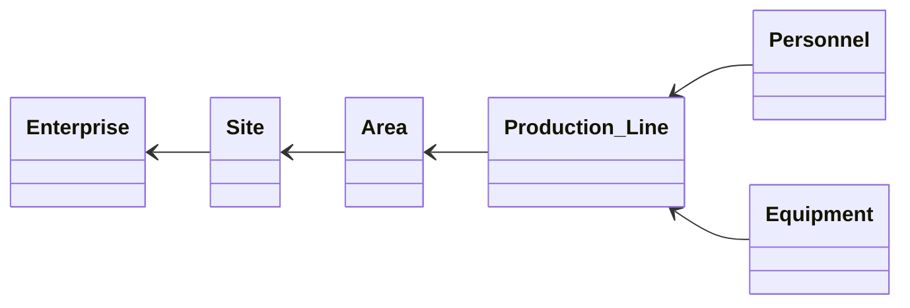


**Table 3: Resource Hierarchy Entity List**
| Entity Name | Class | Description |
|---|---|---|
| Enterprise | Hierarchy | Represents a company that is either one's own company or a business partner. In addition to a customer or a supplier, this covers the delivery destination or delivery origin for sales items and purchased items. Where sales offices or business locations are separate, each may be defined as an independent enterprise. |
| Area | Hierarchy | Represents a zone within a site that is delimited for a specific purpose, such as a floor or a production line. When a production item moves between areas, this is either defined as an inventory transfer, or the movement is separately defined as a production process. |
| Site | Hierarchy | Defined, from a manufacturing perspective, as a unit corresponding to a geographically separate base. In general, one plant corresponds to one site. A supplier's base can also be defined as a site. In principle, a production order is completed within a single site. |
| Production Line | Hierarchy | Represents the target that executes a production schedule corresponding to a production process or production operation. It may also be defined at the level of an individual piece of equipment. It is normally handled by one person in charge, although the person in charge may change with the shift, or multiple workers may work on it jointly. |

## 2.2 Planning Management

Defines the concepts for centrally managing the time framework of production activities and future target figures. Built on the Calendar, which defines working days and shifts, and the Term that subdivides it, this category is responsible for formulating and coordinating plans in the areas of production, sales, purchasing, and capacity, aligning activities across business areas along a common time axis.


**Figure 2: Planning Management: Relationships between Planning Entities**
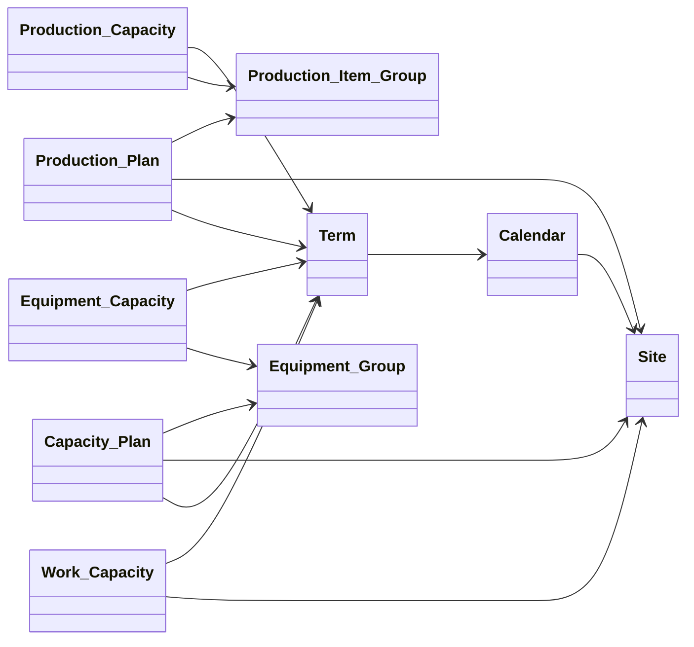


**Table 4: Planning Management Entity List**
| Entity Name | Class | Description |
|---|---|---|
| Calendar | Calendar | Represents a definition of operating conditions such as holidays, daily operating hours, and shifts. It is set at the level of an enterprise, or at the level of a site such as a plant. It is referenced as the basis for working days and operating hours in schedule management, such as production plans and work schedules. |
| Term | Term | Represents each period that makes up a calendar. It has a time span from a start date/time to an end date/time. Terms must not overlap within the same calendar. It is defined corresponding to a category such as working day, holiday, or shift, and is referenced in schedule planning and performance management. |
| Production Plan | Plan | Represents information that plans and manages production quantity for each planning unit, such as a week or a month. It is aggregated at the level of a production item or a series. New plans are set and revised on a continuous rolling basis over the planning period. By associating it with performance information, it can also be used to analyze the variance from the plan. |
| Capacity Plan | Plan | Represents capacity information planned for each period, taking into account constraints such as bottleneck equipment, worker labor hours, and operating hours, for the production capacity held by a plant. It adjusts the capacity balance in line with the supply-and-demand plan and the production plan, and also takes into account additional capacity such as overtime, shift changes, and outsourcing. |
| Sales Plan | Plan | Represents a sales plan formulated based on order trends from customers, market forecasts, sales strategy, and the like. It is created by a sales representative or the sales department and managed as a sales target for a given period. It is set at the level of a sales item or a series, and is aligned with the demand quantity in the supply-and-demand plan. |
| Purchase Plan | Plan | Represents a purchasing plan formulated based on the production plan, inventory plan, purchasing performance, or supply capacity from suppliers. It is created by a purchasing representative or the purchasing department and managed as a procurement target for a given period. It is set at the level of a purchase item or a series, and is aligned with the supply-and-demand plan and the inventory plan. |

## 2.3 Asset Management

Provides the concepts for abstractly and centrally defining common asset information that cuts across individual areas such as equipment, personnel, and energy. It also includes a monitoring mechanism that continuously observes and records the state of any asset or process, forming an information base for early detection of abnormalities and for maintaining quality and safety.


**Figure 3: Asset Management: Basic Asset Configuration**
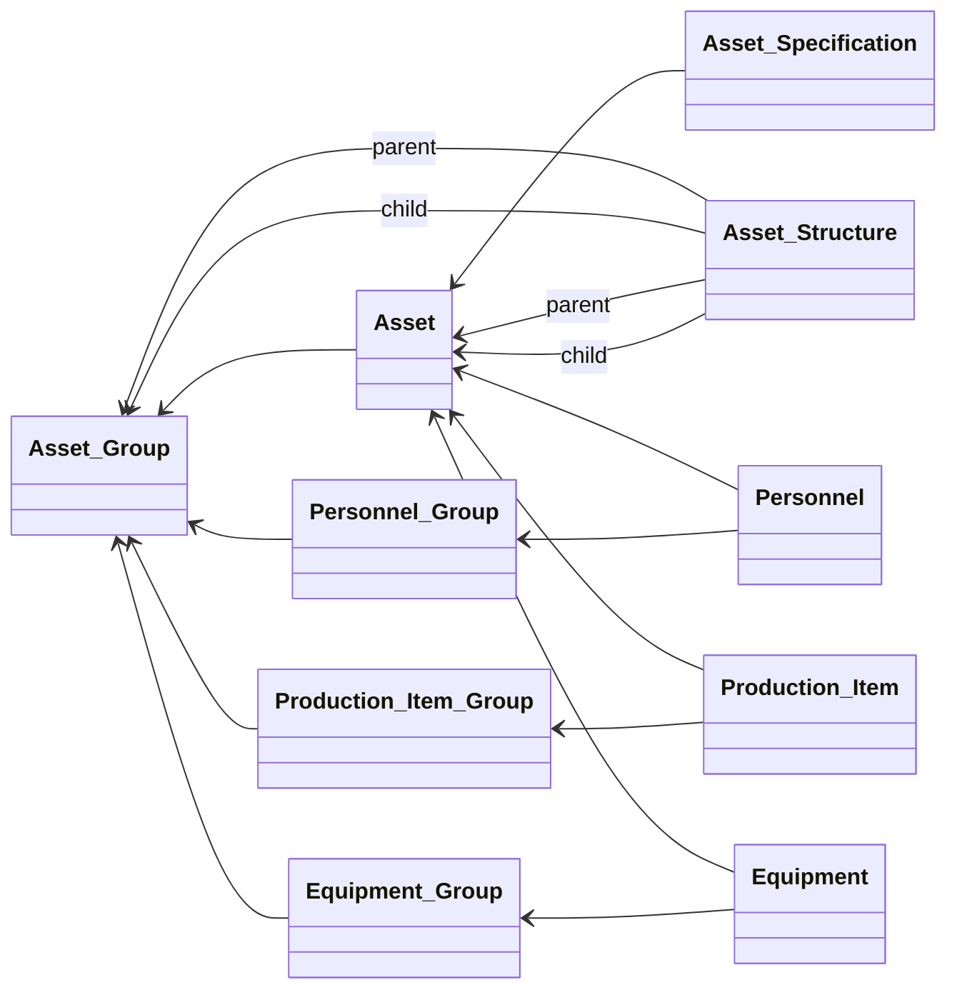
Asset is an abstract class, and for the entities related here it can also be used for the subclasses of Asset — Production Item, Equipment, Personnel, and Production Line.

**Figure 4: Asset Management: Monitoring Content and Monitoring Result**
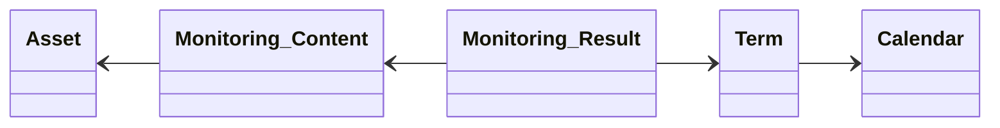


**Table 5: Asset Management Entity List**
| Entity Name | Class | Description |
|---|---|---|
| Asset | Asset | Represents an object that generates, converts, supplies, or consumes value in production activity. It is a common entity that abstracts basic elements such as production items, equipment, personnel, and energy, and is used to manage in a unified manner the attributes and structures common to each individual entity. |
| Asset Group | Group | Represents a group made up of multiple assets that share a common function, characteristic, or purpose of use. It is used to classify different kinds of assets — production items, equipment, personnel, energy, and so on — and to define common attributes and management policies for them together. |
| Asset Structure | Structure | Represents configuration information such as the parent-child, containment, substitution, or connection relationships between assets. It is used to express, in a unified way, relationships between different kinds of assets — production items, equipment, personnel, energy, and so on — and to define the structure of a composite production system. |
| Asset Specification | Specification | Represents a definition of the specifications required of an asset, such as function, performance, quality, capacity, and conditions of use. It defines a common specification independent of the type of asset, and is used as a common standard in design, operation, and evaluation. A specification can be inherited and extended for each type of asset. |
| Monitoring Content | Content | Represents an item that defines the monitoring data acquired over time for an asset, according to the required target, granularity, aggregation method, or judgment condition. A monitoring result is generated based on a monitoring item. It may be generated at a fixed interval, or only when a specific condition is met. |
| Monitoring Result | Result | Represents the result of aggregating, selecting, or judging the monitoring data acquired for an asset, according to the conditions defined by the monitoring item. It is used for condition monitoring of equipment, production, personnel, energy, and so on, as well as being used as underlying data for preventive maintenance, predictive maintenance, anomaly detection, and quality improvement. |

## 2.4 Production Item

Covers the concepts for comprehensively defining the items that are the target of manufacturing, processing, or procurement in production activities. Beyond simple identification information, it manages structural and technical characteristics such as the bill of materials, functions, specifications, and portions of an item as a single whole, together with related documents, issues, and countermeasures, to maintain product quality and design information.


**Figure 5: Production Item: Item Structure and Specification**
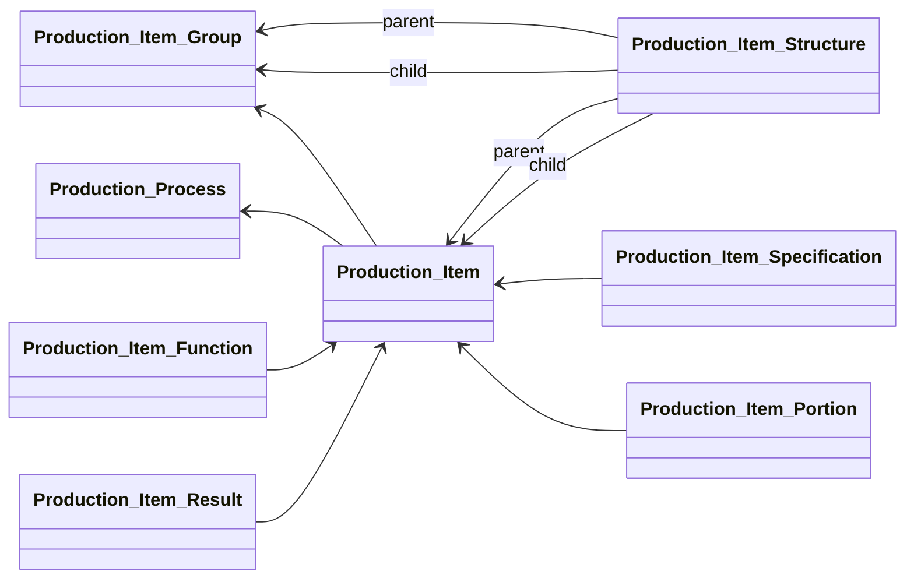
The following shows the relationships between the entities related to kaizen (improvement) activity — Document, Issue, and Countermeasure.


**Figure 6: Production Item: Document, Issue, and Countermeasure**
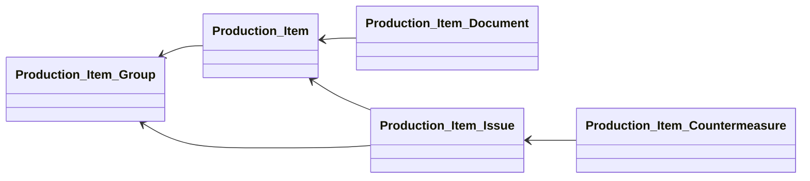


**Table 6: Production Item Entity List**
| Entity Name | Class | Description |
|---|---|---|
| Production Item | Asset | Represents every item managed as a target of production. This covers items that are input to a production process as well as those output from a production process. It also includes items, such as liquids and powders, that cannot be managed by count. Utilities such as electricity, gas, and water are not normally included, but by-products or waste from a chemical process may be included. |
| Production Item Group | Group | Represents production items or sales items grouped based on a common function or characteristic. It is used mainly for managing item variations. It is often managed at the series level in demand forecasting and sales planning, and is also used as the aggregation unit for production planning and inventory management. |
| Production Item Structure | Structure | Represents the quantity and configuration relationship of purchase items or component parts defined for a sales item. It corresponds to a summarized bill of materials (BOM). By defining an intermediate item that is the target of a production order, a multi-level BOM can also be defined. |
| Production Item Function | Function | Represents the function or role defined for a production item. It is used to clarify customer value and design intent, and to manage the correspondence with item specifications and constituent elements. It is also used as a basis for grasping the scope of impact of a design change or an added function. |
| Production Item Specification | Specification | Represents a definition of the specifications required of a production item, such as function, performance, dimensions, material, and quality conditions. It is used as a common standard in design, manufacturing, and quality control. Multiple specification versions can be managed for each item, and this is also used to track the revision history. |
| Production Item Portion | Portion | Represents a part with an identifiable characteristic that forms part of a production item. It is defined for cases where a component cannot be physically separated as a part. It is set as the target of quality control or a work item, and inspection standards or control conditions can be individually defined for each portion. |
| Production Item Document | Document | Represents technical material related to a production item that is provided in file form, such as a product specification sheet, a drawing, or 3D CAD data. The internal data structure of a file is defined for each classification, and it is managed as reference material for the design, manufacturing, and quality control of an item. |
| Production Item Issue | Issue | Represents an event related to a production item, such as a defect, abnormality, issue, or change request. It records the date of occurrence, the conditions under which it occurred, the scope of impact, and the results of root-cause analysis, and is used to link the event to a production item countermeasure. It is also used as underlying information for preventing recurrence and for quality improvement. |
| Production Item Countermeasure | Countermeasure | Represents the content of a countermeasure taken for an event related to a production item. It records interim countermeasures, permanent countermeasures, and recurrence-prevention measures, and manages the correspondence with the related event. The implementation status of the countermeasure and the results of verifying its effectiveness can be recorded, and it is also used for quality improvement. |
| Production Item Result | Result | Indicates the physical entity obtained as a result of actually producing a production item. Depending on the production method, this may indicate a target lot, or, if produced on a unit basis, an individual product or part. It is used for allocating intermediate items and for traceability across different production orders. |

## 2.5 Production Process

Covers the concepts for consistently managing everything from the technical definition of the processes, operations, and content used to manufacture a product, through to the full operational cycle of order issuance, schedule execution, and the recording of performance and results. By integrating planning through execution and recording, it provides the basis for the repeatability, traceability, and improvement cycle of production activities.


**Figure 7: Production Process: Relationships between Process, Operation, and Schedule**
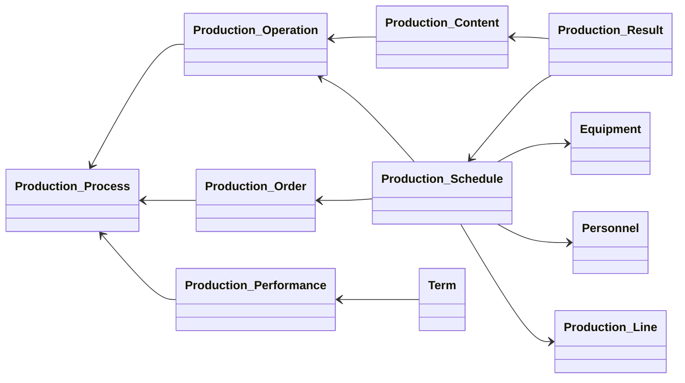
The following shows the relationship between a process and the assets used for production. This basic configuration is the same for a maintenance process and a work process.


**Figure 8: Production Process: Relationship between Process and Assets**
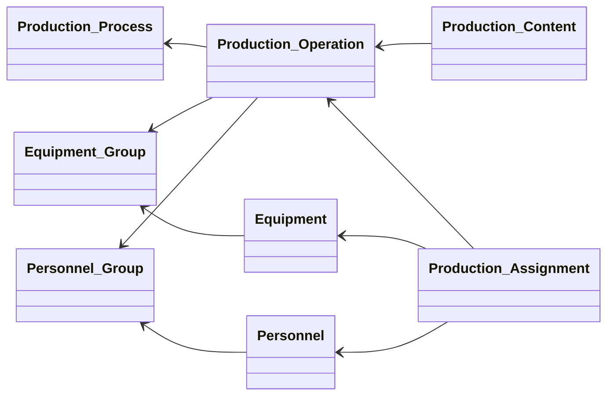
The following corresponds to content related to shop-floor improvement, such as Document, Issue, and Countermeasure.

**Figure 9: Production Process: Document, Issue, and Countermeasure**
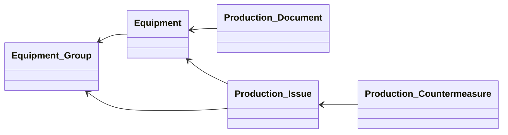


**Table 7: Production Process Entity List**
| Entity Name | Class | Description |
|---|---|---|
| Production Process | Process | Represents a process pre-defined in common, from a technical perspective, as a unit for carrying out production. It is referenced from a production operation. A production process may include an inspection process, and can also be defined as a process consisting solely of inspection. The order relationship between processes can also be set. |
| Production Operation | Operation | Represents the content that puts a production process into concrete form for a specific production item. A specific order, conditions, work hours, and so on are set. A production operation is not simply a step obtained by splitting a production process; rather, one production operation corresponds to one production process. |
| Production Content | Content | Represents an item obtained by expanding the content of a production process or production operation into more detailed work units. This covers work order, quality-control points, work conditions, and the like. Inspection items, maintenance items, check items, and so on can be defined as subclasses of production content. |
| Production Assignment | Assignment | Represents information for assigning an already-produced production item or inventory to a production operation or production schedule. It can also define, as a predecessor task, a production operation that is a precondition for carrying out the production. It is also used to manage dependencies between multiple production schedules. |
| Production Capacity | Capacity | Represents the capacity that a work center or piece of equipment is able to produce. This covers the maximum capacity at a given point in time, or the labor hours over a given period such as a day. In principle, a capacity value is set for each work center or piece of equipment, independent of the production target. It is referenced as underlying information for capacity planning. |
| Production Order | Order | Represents an order requesting the production of a required quantity of a production item. It is generated in response to an order received from a customer, inventory replenishment, and the like. It has production schedules as its constituent elements, and a production instruction document corresponding to the production order can be issued. It may also be made up of multiple production schedules. |
| Production Schedule | Schedule | Represents a schedule for executing a production operation at a specific time. Equipment, personnel, materials, and the like are assigned as needed. Performance such as the actual start time and completion time may be recorded corresponding to the start time and end time. It is managed as a constituent element of a production order. |
| Production Performance | Performance | Represents the performance obtained as the execution result corresponding to a production schedule. This covers the actual start time, end time, number of good units, number of defective units, and the like. If a split or interruption occurs, multiple production performance records may be recorded for one production schedule. It is used to analyze the variance from the plan. |
| Production Result | Result | Represents the result recorded corresponding to each production work item. This covers measured values, judgment results, work records, remarks, and other information used for later analysis and improvement. It is always set when a record is required for each work item. Inspection results, maintenance results, check results, and so on can be defined as subclasses. |
| Production Document | Document | Represents technical material related to a production process, production operation, or production work that is provided in file form, such as a work standard document, a process chart, an inspection standard document, or a maintenance procedure document. The internal data structure of a file is defined for each classification. |
| Production Issue | Issue | Represents an event related to production, such as an abnormality, defect, stoppage, quality problem, or improvement issue. It records the time of occurrence, the conditions under which it occurred, the scope of impact, and the results of root-cause analysis, and is used to link the event to a countermeasure. It can also be used to analyze occurrence trends and drive continuous production improvement. |
| Production Countermeasure | Countermeasure | Represents the content of a countermeasure that has been, or is planned to be, taken in response to a production issue. It records content such as work improvement, process changes, equipment adjustment, and quality countermeasures, and is used to manage the correspondence with the related issue. The implementation status of the countermeasure and the results of verifying its effectiveness are also managed. |

## 2.6 Equipment Management

Covers the concepts for systematically maintaining and managing static characteristic information about the machines and devices that carry out production work. It defines the "ideal state" of each piece of equipment — its identification, classification, structure, function, specification, and portions — while also managing related documents, failure events, and countermeasures as a unified whole, supporting the appropriate use of equipment.


**Figure 10: Equipment Management: Basic Equipment Configuration**
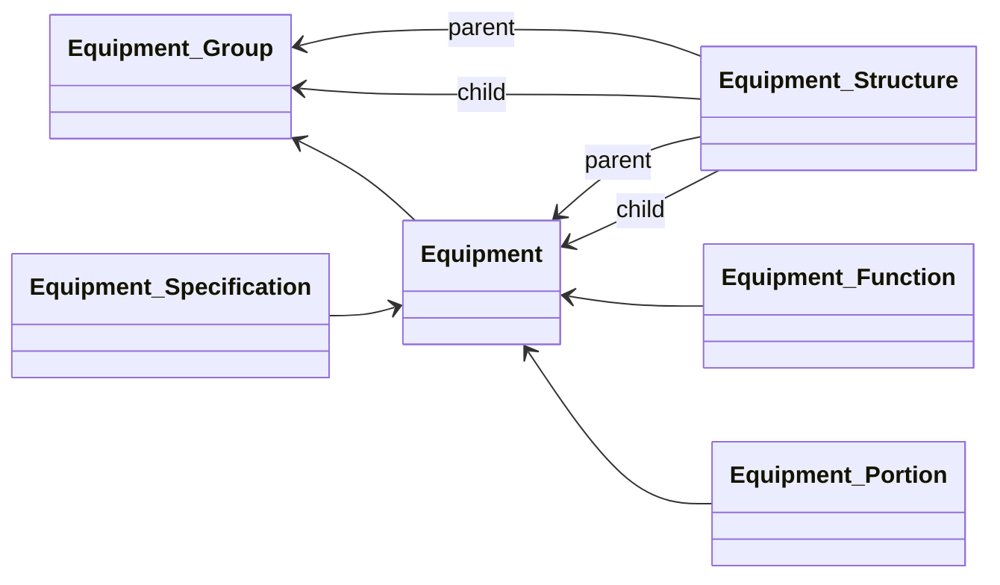

Information related to an equipment defect or the like is covered by the following entities.


**Figure 11: Equipment Management: Equipment Issue and Countermeasure**
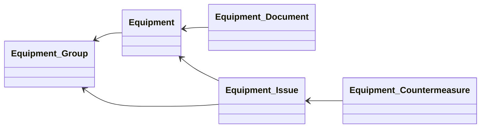


**Table 8: Equipment Management Entity List**
| Entity Name | Class | Description |
|---|---|---|
| Equipment | Asset | Represents a machine, device, or piece of equipment that carries out work related to production on the shop floor of a plant. Equipment that operates automatically and autonomously may be monitored or operated by a worker. It may also cover equipment, such as air-conditioning equipment, that is not directly involved in production. |
| Equipment Group | Group | Represents a group made up of multiple pieces of equipment that share the same function. Equipment that is physically distinct but functionally equivalent in performance is defined together. It is used mainly as the basis for judgment when selecting alternative equipment during production, and is also used as the aggregation unit in capacity planning. |
| Equipment Structure | Structure | Represents the parent-child relationship in cases where a piece of equipment is defined as part of another piece of equipment. One piece of equipment may have multiple child pieces of equipment, but it is uncommon for it to have multiple parent pieces of equipment. It is also used to grasp dependencies between pieces of equipment in maintenance planning and failure analysis. |
| Equipment Function | Function | Represents the function or role defined for a piece of equipment. It manages the correspondence with equipment specifications and equipment portions, and is used to clarify the purpose of use and the object of control for the equipment. It may also be referenced as a criterion for assignment conditions to a production process or for selecting alternative equipment. |
| Equipment Specification | Specification | Represents a definition of the specifications required of a piece of equipment, such as function, performance, dimensions, capacity, control conditions, and maintenance conditions. It is used as a common standard in the design, introduction, operation, and maintenance of equipment. Specifications are version-controlled, and the revision history can be tracked. |
| Equipment Portion | Portion | Represents an identifiable part that makes up a piece of equipment and has a specific function. For equipment consisting of multiple devices, each device corresponds to an equipment portion. When performing equipment maintenance or inspection, a work operation or check item can be individually set for each equipment portion. |
| Equipment Document | Document | Represents technical material related to a piece of equipment that is provided in file form, such as an equipment specification sheet, an instruction manual, a wiring diagram, a maintenance manual, or CAD data. The internal data structure of a file is defined for each classification, and it is managed as reference material for equipment maintenance and operation. |
| Equipment Issue | Issue | Represents a characteristic event related to a piece of equipment, such as a failure, abnormality, stoppage, or defect. This covers the record of an event that actually occurred, such as a minor stoppage or failure history. Whereas a monitoring result is state information collected automatically, an equipment issue is recorded together with a worker's judgment or analysis. |
| Equipment Countermeasure | Countermeasure | Represents the content of a countermeasure that has been, or is planned to be, taken in response to an equipment issue. Unlike an equipment schedule, it defines the work content required according to the situation that occurred, and is used to manage the result of its implementation. It is also used to verify the effectiveness of the countermeasure and to plan recurrence-prevention measures. |

## 2.7 Maintenance Management

Covers the concepts for managing equipment maintenance, inspection, and repair activities as a single cycle running from the definition of a process through to the actual execution and recording of work. It integrates the planning of capacity, assignment, orders, and schedules required for maintenance work with the collection of performance and results, supporting stable equipment operation and long-term reliability.


**Figure 12: Maintenance Management**
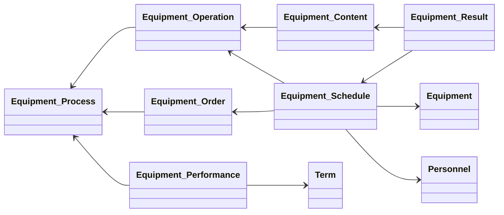

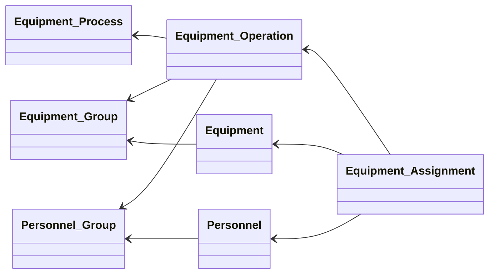

**Table 9: Maintenance Management Entity List**
| Entity Name | Class | Description |
|---|---|---|
| Equipment Process | Process | Represents a process defined in common for work targeting equipment, rather than a specific production item. It is used as a template for equipment operations. Maintenance items, check items, cleaning items, and so on can be pre-set as constituent elements. It is used to centrally manage content common to multiple equipment operations. |
| Equipment Operation | Operation | Represents maintenance work or operational work carried out for a specific piece of equipment. This covers regular inspection, corrective maintenance after a failure, preventive maintenance, startup, shutdown, and the like. It is defined as an equipment process put into concrete form for a specific piece of equipment, and the tools and person in charge required can be specified for each operation. |
| Equipment Content | Content | Represents an item obtained by expanding the content of an equipment process or equipment operation into more detailed work units. This covers check items, measurement items, adjustment items, replacement items, cleaning items, and the like. It can also be used as the recording unit for equipment results, and is used to confirm the execution of work and manage quality records. |
| Equipment Assignment | Assignment | Represents information specifying whether a piece of equipment can be assigned to a production operation. Where multiple pieces of equipment are candidates, conditions or priority for selecting which one is actually used can be defined. It is used when deciding an assignment based on the operating status or capacity of the equipment. |
| Equipment Capacity | Capacity | Represents the work capacity that a piece of equipment is able to execute. This covers the maximum capacity at a given point in time, the available operating hours over a given period such as a day, and the available maintenance labor hours, and the like. In principle, a capacity value is set for each piece of equipment. It is referenced as underlying information for production capacity and capacity planning. |
| Equipment Order | Order | Represents an order for carrying out an equipment operation on a specific piece of equipment. It is made up of one or more equipment schedules or transfer schedules. It is used to manage together a specific equipment process targeting multiple pieces of equipment, or multiple equipment processes for a single piece of equipment. |
| Equipment Schedule | Schedule | Represents a schedule for executing an equipment operation at a specific time. Tools, the person in charge, materials, and the like are assigned as needed. This covers not only equipment checks and maintenance work but also day-to-day work such as startup and shutdown. For mobile equipment, it is defined as a transfer schedule. |
| Equipment Performance | Performance | Represents the result of a piece of equipment actually operating, corresponding to a production order, production schedule, or equipment schedule. It comprehensively records the equipment's operating performance, including cases where there is no corresponding equipment schedule and including standby or stopped states. It can also be used for OEE and operating-rate analysis. |
| Equipment Result | Result | Represents the result recorded corresponding to each equipment work item. This covers measured values, check results, maintenance results, abnormality judgments, remarks, and other information used for later analysis and improvement. It is always set when a record is required for each work item, and is used for equipment condition management. |

## 2.8 Personnel

Covers the concepts for systematically maintaining and managing static characteristic information about the people who carry out production activities. It defines the "ideal state" of each worker — identification, classification, organizational structure, skills, specifications, and portions — while also managing related training materials, issues, and countermeasures as a unified whole, supporting the appropriate development and deployment of personnel.


**Figure 13: Personnel Management**
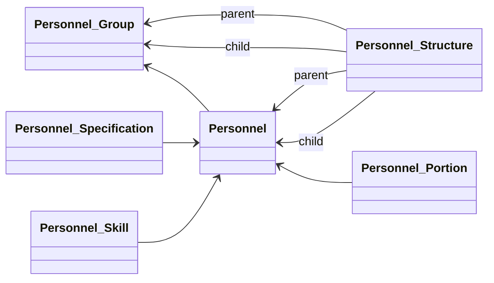

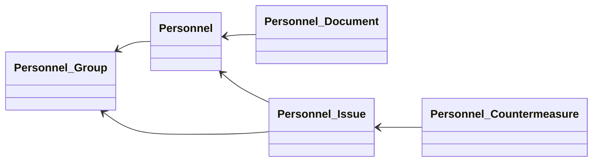

**Table 10: Personnel Management Entity List**
| Entity Name | Class | Description |
|---|---|---|
| Personnel | Asset | Represents personnel in a plant who carry out work related to production. They are the subject of labor cost either as direct labor or as indirect labor. A worker corresponds to an employee, but the same employee may be registered as a worker at multiple sites, and skills or qualifications can be individually managed. |
| Personnel Group | Group | Represents a group made up of workers engaged in production at a plant, an area, or the like. It corresponds to cases where a leader, such as a team leader, manages production performance or work status at the level of a work team. It is also used when a shift is organized at the team level, or when equipment maintenance is assigned at the area level. |
| Personnel Structure | Structure | Represents configuration information such as the substitution, complementary, or hierarchical relationship between workers. It is used to define cases where a specific worker can substitute for another worker, or to define skill succession or support relationships. One worker may have relationships with multiple other workers. |
| Personnel Skill | Function | Represents a production process, production operation, work item, maintenance work, or inspection item that a worker is able to perform, together with their level of proficiency. It can also be used as a basis for qualification management and evaluating skill improvement. It is also referenced when assigning personnel to a process and when planning training. |
| Personnel Specification | Specification | Represents a definition of the specifications required of a worker, such as role, capability, qualification, working conditions, and training requirements. It is used as a common standard for personnel deployment, training planning, and work standards. Based on the specification, a worker's skills or aptitude can be evaluated and used to assign them to an appropriate process. |
| Personnel Portion | Portion | Represents an identifiable part of a worker's physical or functional characteristics. It is used when defined as the target of work analysis, ergonomic evaluation, safety management, or motion analysis. It can also be used as the unit of analysis in workload management and work improvement. |
| Personnel Document | Document | Represents technical or management material related to a worker that is provided in file form, such as training material, a certificate of qualification, a work record, or a training history. The internal data structure of a file is defined for each classification, and it is managed as underlying information for personnel management and training planning. |
| Personnel Issue | Issue | Represents an event related to a worker, such as an abnormality, problem, accident, human error, or improvement issue. It records the conditions under which it occurred, the scope of impact, the results of root-cause analysis, and the like, and is used to link the event to a countermeasure. It is also used as underlying information for preventing recurrence and improving safety management. |
| Personnel Countermeasure | Countermeasure | Represents the content of a countermeasure that has been, or is planned to be, taken in response to a personnel issue. It records content such as training, retraining, work improvement, and safety measures, and is used to manage the correspondence with the related event. The effectiveness of the countermeasure can be verified and used to prevent recurrence. |

## 2.9 Work Management

Covers the concepts for managing work activities carried out primarily by people as a single cycle running from the definition of a process through to actual execution and recording. It integrates the planning aspects of capacity, assignment, orders, and schedules needed for the work with the collection of performance and results, systematically supporting the standardization, progress management, and performance improvement of manual work.


**Figure 14: Work Management**
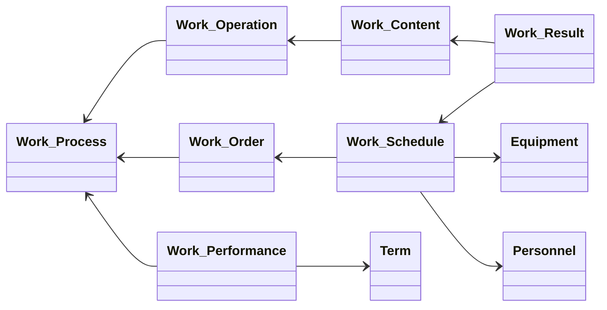
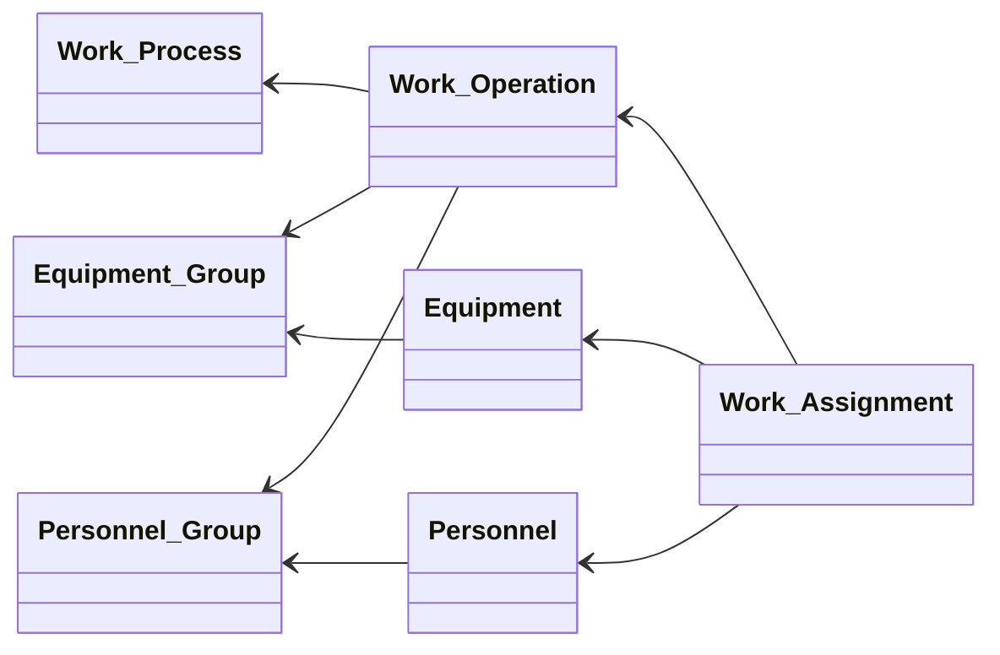

**Table 11: Work Management Entity List**
| Entity Name | Class | Description |
|---|---|---|
| Work Process | Process | Represents a process carried out by a worker, or a general process that does not fall under a production process or an equipment process. It is used as a template for a work operation. It is used to systematically define non-production work activity — indirect work, education and training, transport work, and the like — and to manage it as the target of a work schedule and performance management. |
| Work Operation | Operation | Represents a unit of process or activity, one level more detailed, that makes up a work process. The order of execution and any precedence relationship are set in advance. It corresponds to one step making up a series of work operations, and where order is important it is defined with a sequence number. The person in charge and the tools required can also be individually set. |
| Work Content | Content | Represents information showing more concrete content for when a work operation is actually carried out. A worker refers to this content to actually carry out the work. Points of caution for each operation, the tools used, completion conditions, and the like can also be described, and it is used to make work quality uniform and to standardize work. |
| Work Assignment | Assignment | Represents information for assigning equipment, a worker, or inventory to a work operation or work schedule. It can also define, as a predecessor task, a work operation that is a precondition for carrying out the work. It is also used to manage dependencies and order of execution between multiple work schedules. |
| Work Capacity | Capacity | Represents the work capacity that a worker is able to execute. This covers the maximum operating time at a given point in time, the available work hours over a given period such as a day, or the range of work that can be handled based on held skills, and the like. In principle, a capacity value is set for each worker or worker group. |
| Work Order | Order | Represents an order for carrying out a work operation for a specific worker or worker group. It is made up of one or more personnel schedules. It may include a specific work process targeting multiple workers, or multiple work processes for a single worker. |
| Work Schedule | Schedule | Represents a schedule for executing a work operation at a specific time. Equipment, tools, the work location, or a supporting worker, and the like are assigned as needed. Shift work, training, maintenance work, inspection work, and the like can also be covered. It is also used as the recording unit for work performance. |
| Work Performance | Performance | Represents the result actually carried out by a worker, corresponding to a production order, production schedule, or personnel schedule. This covers the actual start time, end time, work time, work quantity, waiting time, and the like. It can also be recorded including cases where there is no corresponding personnel schedule, and including standby states. |
| Work Result | Result | Represents the result recorded corresponding to each work item performed by a worker. This covers measured values, confirmation results, work records, training results, skill evaluations, remarks, and other information used for later analysis and improvement. It is always set when a record is required for each work item. |

## 2.10 Inventory Management

Covers the concepts for capturing the inventory status of items as a quantity at a given point in time, while also managing the cycle of planning, executing, and recording the receipt, issue, and transfer of stock under the constraints of storage capacity. By integrating the static grasp of inventory levels with the dynamic tracking of inventory movements, it supports maintaining appropriate stock levels and preventing both stockouts and excess inventory.


**Figure 15: Inventory Management**
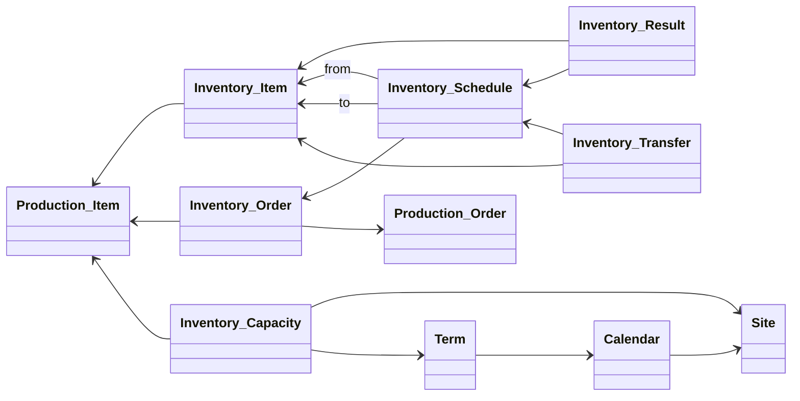

**Table 12: Inventory Management Entity List**
| Entity Name | Class | Description |
|---|---|---|
| Inventory Item | Product | Represents a production item managed for inventory, defined for each inventory location. In addition to sales items and purchase items, this also covers intermediate items, work-in-process, and by-products. One production item may be defined as multiple inventory items corresponding to multiple inventory locations. Items excluded from inventory management are not defined. |
| Inventory Capacity | Capacity | Represents the capacity that can be stored at an inventory location. This covers physical constraints such as storage space, quality-control constraints such as shelf life, or financial constraints, and the like. It is used as the basis for managing the upper limit of the storable quantity in inventory planning and replenishment planning. |
| Inventory Order | Order | Represents an order for carrying out the transfer, replenishment, allocation, or stocktaking of an inventory item. It is made up of one or more inventory schedules. It is generated corresponding to a production schedule, shipping schedule, receiving schedule, or inventory replenishment plan. It is also used for planned inventory adjustment to prevent shortage or excess. |
| Inventory Schedule | Schedule | Represents a schedule for transferring, replenishing, allocating, or taking stock of an inventory item at a specific time. This mainly covers work such as picking, issuing stock from an inventory location to a work center. Receiving into an inventory location, and transfers between work centers or between inventory locations, can also be defined. |
| Inventory Transfer | Performance | Represents the result of an increase or decrease in the quantity of an inventory item, corresponding to a shipment, receipt, inventory schedule, or the like. When inventory actually moves, it is recorded as an increase or decrease value in inventory quantity at both the source and the destination. It is used as underlying data for maintaining the accuracy of inventory quantity. |
| Inventory Result | Result | Represents the result of obtaining the inventory quantity at a given point in time for an inventory item, either by calculation or by physical stocktaking. This covers quantity information such as theoretical inventory, physical inventory, and adjusted inventory. It is used as underlying information referenced in variance analysis, improving inventory accuracy, and planning replenishment. |

## 2.11 Energy Management

Covers the concepts for treating energy resources such as electricity, heat, and gas as assets on a par with equipment and items, and for systematically managing their procurement, supply, consumption, and conversion. By integrating the definition of energy structure, function, and specification with the full operational cycle of capacity, orders, schedules, performance, and results, it supports the efficient use and visualization of energy.


**Figure 16: Energy Management: Basic Energy Configuration**
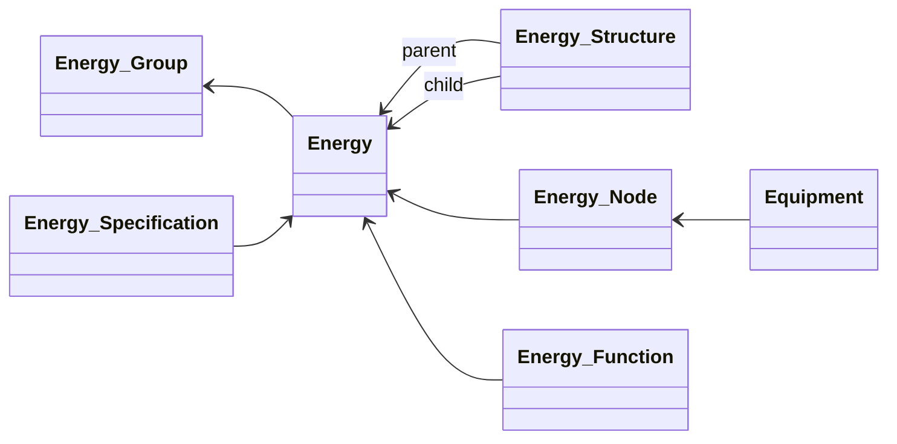

The following shows the flow of energy through transaction data centered on the Energy Node, the relay point for energy on the shop floor.


**Figure 17: Energy Management: Energy Nodes and Transactions**
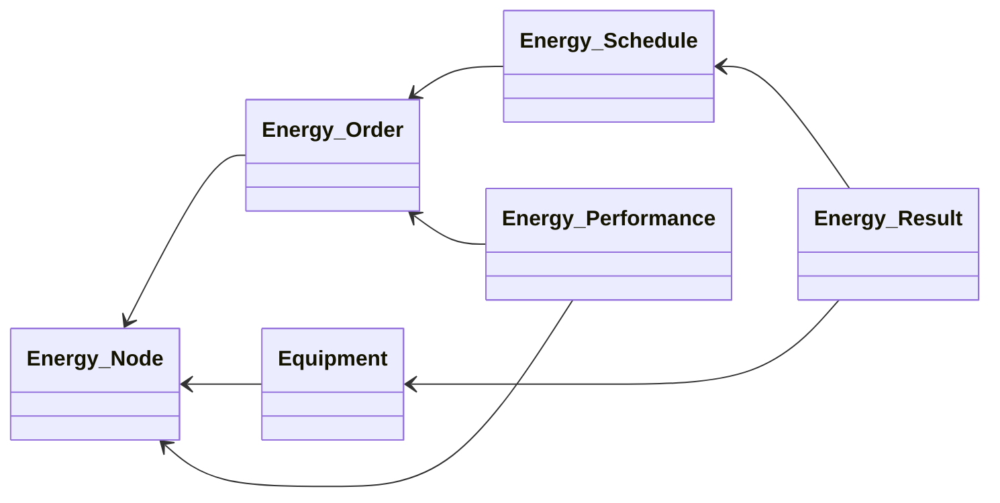

```mermaid
classDiagram
direction LR
  class Calendar
  class Term

  Energy_Plan --> Energy_Group
  Energy_Plan --> Term
  Energy_Plan --> Site

  Term --> Calendar
  Calendar --> Site  

  Energy_Capacity --> Energy_Group


  Energy_Capacity --> Site
  Energy_Capacity --> Term

```


**Table 13: Energy Management Entity List**
| Entity Name | Class | Description |
|---|---|---|
| Energy | Asset | Represents the energy required to carry out production activity. This covers power sources or utilities such as electricity, gas, steam, compressed air, kerosene, and water. The balance of supply and consumption is managed for each, and it is used to reduce energy cost and plan energy-saving measures. |
| Energy Group | Group | Represents a group made up of multiple energy sources that share the same type or an equivalent function. It is used to manage together energy sources that share a common supply source or purpose of use, such as an electrical system, gas system, or steam system. It can also be used for redundancy of supply or the selection of alternative routes. |
| Energy Structure | Structure | Represents connection relationships and configuration information such as the supply source, conversion equipment, storage equipment, and consumption equipment in an energy supply. It is used for cases where one energy source has multiple supply routes, or where multiple supply sources are integrated. It is also used to visualize supply routes and manage alternative routes in the event of a failure. |
| Energy Function | Function | Represents a definition of the function that an energy source has, such as supply, conversion, storage, distribution, or consumption. It is used to clarify the role and supply conditions of the energy required for a piece of equipment or a production process. It is also used as the unit of analysis in evaluating energy efficiency and planning energy-saving measures. |
| Energy Specification | Specification | Represents a definition of the specifications required of energy, such as type, quality, supply capacity, pressure, voltage, temperature, flow rate, and supply conditions. It is used as a common standard for equipment design, production planning, and energy management. A specification can be individually defined for each type of energy. |
| Energy Node | Portion | Represents a connection point at which the supply, conversion, distribution, or consumption of energy takes place, such as a power receiving point, distribution board, valve, piping connection point, or tank connection point. It is used as the reference point for managing the flow of energy and its usage status, and may also be defined as a data collection point for measurements. |
| Energy Capacity | Capacity | Represents an energy supply capacity that can be shared within an area or a site. This covers the maximum supply amount, supply time, or available amount of a specific type of energy over the target period. Equipment and production processes consume the energy capacity defined here. |
| Energy Order | Order | Represents an order requesting the supply or consumption of energy required over a specific period. It is generated corresponding to a production plan, an equipment plan, or an energy management plan. It is made up of one or more energy schedules, and is used as underlying information for managing the supply-and-demand balance of energy. |
| Energy Schedule | Schedule | Represents a schedule for executing the supply, storage, conversion, or consumption of energy at a specific time. A supply source, storage equipment, conversion equipment, or consumption equipment, and the like are assigned as needed. It may also be used for peak control or load leveling. |
| Energy Performance | Performance | Represents the result of energy actually supplied, converted, stored, or consumed, corresponding to an energy order or energy schedule. This covers the actual amount supplied, amount consumed, hours of use, efficiency, or amount of loss, and the like. Unplanned consumption or standby loss can also be recorded. |
| Energy Result | Result | Represents the result recorded corresponding to each energy work item or energy node. This covers measured values, load status, efficiency, quality indicators, abnormality judgments, remarks, and other information used for later analysis and improvement. It is always set when a record is required. |

## 2.12 Sales Management

Covers the concepts for managing, starting from commercial transactions with customers, the information related to product sales as a single flow from order receipt through to shipment. By integrating the grasp of customer-specific specifications and pricing conditions with the transaction process of quotation, forecast, order, invoice, and shipment, it supports appropriate responses to customer requirements and the management of sales activities as a whole.


**Figure 18: Sales Management: Relationships of Sales Items**
```mermaid
classDiagram
direction RL

  class Customer
  class Sales_Item
  class Sales_Document
  class Sales_Order
  class Sales_Specification

  class Sales_Invoice
  class Sales_Forecast
  class Sales_Quotation
  class Shipping_Result

  %% ================

  Sales_Order --> Sales_Document
  Sales_Document --> Customer
  Sales_Item --> Production_Item
  Sales_Invoice --> Customer
  Sales_Specification --> Customer
  Sales_Forecast --> Sales_Item
  Sales_Quotation --> Customer
  Shipping_Result --> Sales_Order
  Sales_Order --> Sales_Item
  Sales_Item --> Customer

```
When an order is actually received, it is processed using the following model.


**Figure 19: Sales Management: Order-Receiving Process Flow**
```mermaid
classDiagram
direction RL
  Shipping_Result --> Sales_Order
  Sales_Order --> Sales_Document
  Sales_Forecast --> Sales_Item
  Sales_Quotation --> Sales_Item
  Sales_Order --> Sales_Item
  Sales_Invoice --> Shipping_Result

  Sales_Plan --> Site
  Sales_Plan --> Term

```


**Table 14: Sales Management Entity List**
| Entity Name | Class | Description |
|---|---|---|
| Customer | Company | Represents the enterprise that is the recipient of a sales item manufactured by one's own company. A sales item is shipped in response to an order received from a customer. An enterprise may be both a customer and a supplier at the same time. Transaction information such as pricing conditions and delivery conditions can be set for each customer. |
| Sales Item | Product | Represents, among production items, an item provided to a customer. This covers individual items corresponding to a customer's specification, and catalog items held as one's own company's standard. Information about the destination customer, price, delivery conditions, and the like can be set for a sales item, and multiple settings can be made for each customer. |
| Sales Document | Order Document | Represents the management unit for order information received from a customer as a single transaction. It is made up of one or more sales orders. In addition to the order content for each sales item, common information such as consumption tax, discount conditions, delivery location, and payment terms is added at the document level. |
| Sales Order | Order Content | Represents, among the order information received from a customer, the order content corresponding to an individual sales item. This includes quantity, due date, unit price, specification, and the like. It may also include a prospective order, forecast information, or a confirmed order whose specification or quantity is not yet fixed. It can be linked to the issuance of a production order or a shipping schedule. |
| Sales Specification | Specification | Represents a definition of the specifications, pricing conditions, delivery conditions, packaging conditions, quality conditions, and the like required by each customer for a sales item. It is used to manage the individual conditions of a sales item, and is also referenced as the basis for confirming conditions in order handling and quotation preparation. |
| Sales Invoice | Invoice | Represents billing information issued to a customer after a sales item has been shipped corresponding to an order. It is normally issued in a batch, monthly or over a given period, corresponding to the closing date for each customer. The accuracy of the billed content can be confirmed by reconciling it against the shipping result. |
| Sales Forecast | Forecast | Represents forecast information on future demand received from a customer. As a stage preceding a confirmed order, forecast quantity and due date information over a given period are compiled. It is used as underlying information for demand planning and production planning, and in some industries material procurement or production preparation may be started based on the forecast. |
| Sales Quotation | Quotation | Represents a quotation request received from a customer, and the content of the response to it. This normally covers inquiries about price or due date corresponding to a sales item. For individual projects, a quotation, including the selection of a production process, may be made based on a specification sheet or drawing. |
| Shipping Result | Result | Represents the result of shipping a sales item corresponding to an order received. Multiple shipments may correspond to a single order. Processing to generate a sales invoice is carried out based on the shipping information. It may also include the shipment of a production item provided as a supplied part. |

## 2.13 Purchase Management

Covers the concepts for managing, starting from commercial transactions with suppliers, the information related to the procurement of materials and parts as a single flow from ordering through to receipt. By integrating the grasp of supplier-specific specifications and pricing conditions with the procurement process of quotation, forecast, order, invoice, and receipt, it supports stable procurement and the management of the supply chain as a whole.


**Figure 20: Purchase Management: Relationships of Purchase Items**
```mermaid
classDiagram
direction RL

  class Supplier
  class Purchase_Item
  class Purchase_Document
  class Purchase_Order
  class Purchase_Specification

  class Purchase_Invoice
  class Purchase_Forecast
  class Purchase_Quotation
  class Receiving_Result

  %% ================

  Purchase_Order --> Purchase_Document
  Purchase_Document --> Supplier
  Purchase_Item --> Production_Item
  Purchase_Invoice --> Supplier
  Purchase_Specification --> Supplier
  Purchase_Forecast --> Purchase_Item
  Purchase_Quotation --> Supplier
  Receiving_Result --> Purchase_Order
  Purchase_Order --> Purchase_Item
  Purchase_Item --> Supplier

```
The data related to the operational flow centered on a purchase order (purchase document) is as follows.


**Figure 21: Purchase Management: Ordering Process Flow**
```mermaid
classDiagram
direction RL
  Receiving_Result --> Purchase_Order
  Purchase_Order --> Purchase_Document
  Purchase_Forecast --> Purchase_Item
  Purchase_Quotation --> Purchase_Item
  Purchase_Order --> Purchase_Item
  Purchase_Invoice --> Receiving_Result

  Purchase_Plan --> Site
  Purchase_Plan --> Term

```


**Table 15: Purchase Management Entity List**
| Entity Name | Class | Description |
|---|---|---|
| Supplier | Company | Represents the enterprise from which the parts, materials, or services required for manufacturing are procured. A purchase item is received in response to an order placed with a supplier. A trading partner for a subcontracted production or process is also defined as a supplier, and transaction conditions can be individually set. |
| Purchase Item | Product | Represents, among production items, an item provided by a supplier. This covers standard items registered in a supplier's catalog, and individual items with a specified specification. An expected supplier, purchasing conditions, and the like can be set for a purchase item. A production item corresponding to a subcontracted production or process is not included in an ordinary purchase item. |
| Purchase Document | Order Document | Represents the management unit for order information sent to a supplier as a single transaction. It is made up of one or more purchase orders. In the case of subcontracted production or a subcontracted process, a production item is the target, and related material such as a drawing or specification sheet may be attached. |
| Purchase Order | Order Content | Represents the individual order information for a supplier. Corresponding to one purchase item or subcontracted production project, it includes quantity, due date, unit price, specification, and the like. Materials corresponding to manufacturing overhead, such as auxiliary materials or consumables, may also be a purchasing target. It is used for reconciliation against receiving results and invoices. |
| Purchase Specification | Specification | Represents a definition of the specifications, pricing conditions, due-date conditions, packaging conditions, quality conditions, and the like required by each supplier for a purchase item. It is used to manage the individual conditions of a purchase item, and is also referenced as the basis for confirming conditions in ordering and incoming inspection. |
| Purchase Invoice | Invoice | Represents billing information received from a supplier after a purchase item or production item has been received corresponding to a purchase. It is used to reconcile the received billing content against the received item and the order content. Where a discrepancy arises, it may be subject to an approval workflow or a correction process. |
| Purchase Forecast | Forecast | Represents forecast information for notifying a supplier in advance of future purchasing plans. In some industries this may be treated as a substantive order. It is often used as underlying information for a supplier's production preparation and material procurement planning. |
| Purchase Quotation | Quotation | Represents a quotation request sent to a supplier, and the content of the response to it. This normally covers inquiries about price or due date corresponding to a purchase item. For a new transaction, such as subcontracted production or a subcontracted process, a quotation including feasibility may be made. |
| Receiving Result | Result | Represents the result of a purchase item or production item being received corresponding to a purchase. Multiple receipts may correspond to a single purchase order. Reconciliation processing against a purchase invoice is carried out based on the receiving information. It may also include the receipt of a production item corresponding to a supplied part or a subcontracted item. |

# Chapter 3: Table Implementation

## 3.1 Implementation Classes
Each data model belongs to one of the following 29 implementation classes. Each table structure is defined by the attributes of the corresponding implementation class.


**Table 16: Implementation Class List**
| Class | Description |
|---|---|
| Hierarchy | The concept of expressing the places and organizations involved in production activity through the successive containment relationship of Enterprise, Site, Area, and Production Line. It defines the spatial and organizational context that positions which resource belongs to which location or organization, forming the foundation for locating all other information. |
| Product | The concept of defining the existence of an item as it is handled in each of the inventory, sales, and purchasing contexts. It repositions the basic definition of a Production Item according to the concrete use or transaction context of storage, sales, or procurement, serving as the starting point for item management in each business area. |
| Asset | The concept for capturing, from a common viewpoint regardless of type, the principal resources that make up production activity — equipment, items, personnel, and energy. It defines the basic identification information and attributes of each resource and represents the top-level entity that serves as the starting point for managing each resource. |
| Group | The concept for classifying together multiple resources that share common attributes, functions, or roles. By bundling individual resources, it enables the batch application of specifications and more efficient search, aggregation, and management, representing a classification unit that organizes resource diversity into something easier to handle. |
| Structure | The concept representing structural relationships between resources, such as parent-child, containment, and substitution relationships. It makes explicit how an individual element is positioned within the whole — for example an item's bill of materials, the equipment configuration of a machine, a worker's organizational hierarchy, or an energy supply network. |
| Specification | The concept of defining the performance, quality, and conditions required of a resource or transaction. By documenting the "standard to be met" — such as the technical requirements of equipment or items, the qualification requirements of personnel, or the individual conditions of a given customer or supplier — it provides the basis for decisions on selection, procurement, and evaluation. |
| Function | The concept of defining the capability or role that a resource — an item, piece of equipment, worker, or energy source — can provide. By making explicit "what the resource can do," it provides the information needed to judge conformance to requirements, select alternative resources, and decide on work assignment. |
| Portion | The concept representing an identifiable partial element that makes up a resource — a specific location on a component part of an item, an individual component of a piece of equipment, or a physical or functional part of a worker's body. It serves as the reference point when information needs to be linked not to the whole resource but to a part of it. |
| Document | The concept of managing document information related to a resource or process — drawings, manuals, specification sheets, training materials, and the like. It systematically links the technical information and records that form the basis for work, supporting the maintenance of standard work, training, audit response, and change management. |
| Issue | The concept of recording an abnormal event — a defect, failure, problem, or accident — that has occurred in a resource or in production activity. By preserving the facts of when, where, and what happened, it provides the information base for root-cause analysis, countermeasure planning, and prevention of recurrence. |
| Countermeasure | The concept of managing the improvement measures, corrective content, or preventive actions carried out in response to a problem or abnormality recorded as an Issue. By linking the issue to the countermeasure, it completes the problem-solving cycle and, by accumulating this as knowledge, supports the continuous improvement of quality and safety. |
| Process | The concept representing the technically defined unit of a process for each of the production, maintenance, and work activities. It specifies, at a general level, what is to be done and in what manner, forming the skeleton of the business process as the higher-level structure for detailed information such as operations, content, capacity, and assignment. |
| Operation | The concept of defining the concrete work steps for carrying out a process. It breaks the broad grouping of a process down into an ordered, executable procedure, functioning as the unit for work content, assignment, and performance recording, and thereby supporting the repeatability and standardization of operations. |
| Assignment | The concept of linking, at the time a schedule or operation is executed, which resource (equipment, personnel, energy, etc.) is used and how. By connecting the requirement to the execution capability, it achieves effective use of resources and ensures feasibility, translating scheduling into concrete terms. |
| Content | The concept of defining the individual work items obtained by further subdividing a process or operation, and the monitoring targets that must be continuously observed. By making explicit the smallest unit of what must be executed, it ensures standardization of work, prevention of omissions, and an appropriate granularity for recording performance. |
| Capacity | The concept of defining the maximum processing, supply, or storage capability of a resource or location. It provides the reference value for judging the feasibility of a plan or order — the throughput of a production line, the performance of a piece of equipment, the workload a worker can handle, the storage limit of an inventory location, or the maximum energy supply. |
| Order | The concept of issuing a request for an activity to be carried out in each of the production, maintenance, work, inventory, and energy domains. It makes explicit "what, how much, and by when," and serves as the starting point that triggers the subsequent processes of scheduling, assignment, and performance. |
| Schedule | The concept representing the concrete execution order converted, based on an order, into an actual unit of execution. By specifying the executing resource, time, quantity, and target, it gives an action instruction at a granularity that can be acted on immediately at the shop-floor level, and becomes the target for the collection of performance and results. |
| Performance | The concept of recording the actual state of execution of an activity carried out against a schedule. It records the quantitative fact of "what was actually done, and how much" — production quantity, operating status, work completion, energy consumption, inventory movement, and so on — providing the basis for evaluating plan versus actual and for improvement. |
| Result | The concept of recording the measured values, completion status, or quantity obtained for a given action or observation — such as a schedule, work item, monitoring activity, or logistics event. It preserves the fact of what actually happened as a point-in-time record, and is used for comparison and analysis against plans and schedules, and for ensuring traceability. |
| Company | The concept of defining an external enterprise that has a business relationship with the company, according to the direction of the transaction — the sales side (Customer) or the purchasing side (Supplier). Through the identification and attribute management of the trading partner, it clarifies the party involved throughout transaction operations such as orders, invoices, and forecasts. |
| Calendar | The concept of defining time-based operating conditions such as working days, holidays, and shifts. By specifying when activities such as production, work, and maintenance are possible, it provides the preconditions for planning and scheduling, and supports the overall time framework of operations. |
| Term | The concept representing the individual time intervals that make up a calendar. It subdivides operating hours, shifts, and periods into concrete time units, making it possible to link plans and performance to a specific interval on the time axis, and works together with the Calendar to increase the precision of time management. |
| Plan | The concept of defining future target quantities and allocation policies for each business area, such as production, sales, purchasing, and capacity. It expresses the outlook for a given period as a numerical figure and functions as the higher-level policy for execution management concepts such as orders and schedules, giving direction to the whole of the operation. |
| Order Document | The concept representing the management unit for the whole of the order information exchanged in a single transaction. It manages the act of receiving or placing an order as a single grouping spanning multiple items, and serves as the reference for identifying, tracking, and reconciling the transaction. |
| Order Content | The concept representing the individual order content, per item, that makes up an order document. By managing the item, quantity, due date, unit price, and so on at the line-item level, it captures the breakdown of the transaction in detail and functions as the smallest unit for reconciliation against shipments, receipts, and invoices, and for progress management. |
| Invoice | The concept representing the monetary billing information exchanged after a transaction has been fulfilled. It appears, on the sales side, as a bill to the customer, and, on the purchasing side, as a bill received from the supplier, and is responsible for recording and managing the financial settlement of the transaction. |
| Forecast | The concept representing the forecast information on future demand or procurement, exchanged with a trading partner before it is finalized. By sharing the general direction ahead of a formal order, it has an advance effect on the partner's preparation, production planning, and procurement planning, smoothing supply-and-demand coordination across the whole supply chain. |
| Quotation | The concept representing the information used to present and confirm price, terms, and specifications before a transaction is concluded. It appears, on the sales side, as a proposal to the customer, and, on the purchasing side, as a request to and response from the supplier, bridging the way to a formal order through prior agreement on, and a record of, the transaction terms. |

## 3.2 Attribute List by Implementation Class

### 3.2.1 Hierarchy

The concept of expressing the places and organizations involved in production activity through the successive containment relationship of Enterprise, Site, Area, and Production Line. It defines the spatial and organizational context that positions which resource belongs to which location or organization, forming the foundation for locating all other information.


**Table 17: Hierarchy Attribute List**
| Attribute Name | Data Type | Description |
|---|---|---|
| specification | string | A descriptive attribute recording a specification, condition, or content. |
| value | number | An attribute representing a value such as a quantity, capacity, or performance figure. |
| unit | string | An attribute representing the unit of the value. |
| location | string | An attribute representing a location, position, storage location, or place of execution. |

### 3.2.2 Product

The concept of defining the existence of an item as it is handled in each of the inventory, sales, and purchasing contexts. It repositions the basic definition of a Production Item according to the concrete use or transaction context of storage, sales, or procurement, serving as the starting point for item management in each business area.


**Table 18: Product Attribute List**
| Attribute Name | Data Type | Description |
|---|---|---|
| specification | string | A descriptive attribute recording a specification, condition, or content. |
| value | number | An attribute representing a value such as a quantity, capacity, or performance figure. |
| unit | string | An attribute representing the unit of the value. |
| location | string | An attribute representing a location, position, storage location, or place of execution. |
| unit_price | number | An attribute representing the unit price of an item or of work. |
| lead_time | number | An attribute representing the lead time required for procurement or manufacturing. |

### 3.2.3 Asset

The concept for capturing, from a common viewpoint regardless of type, the principal resources that make up production activity — equipment, items, personnel, and energy. It defines the basic identification information and attributes of each resource and represents the top-level entity that serves as the starting point for managing each resource.


**Table 19: Asset Attribute List**
| Attribute Name | Data Type | Description |
|---|---|---|
| specification | string | A descriptive attribute recording a specification, condition, or content. |
| location | string | An attribute representing a location, position, storage location, or place of execution. |

### 3.2.4 Group

The concept for classifying together multiple resources that share common attributes, functions, or roles. By bundling individual resources, it enables the batch application of specifications and more efficient search, aggregation, and management, representing a classification unit that organizes resource diversity into something easier to handle.


**Table 20: Group Attribute List**
| Attribute Name | Data Type | Description |
|---|---|---|
| specification | string | A descriptive attribute recording a specification, condition, or content. |
| value | number | An attribute representing a value such as a quantity, capacity, or performance figure. |
| unit | string | An attribute representing the unit of the value. |

### 3.2.5 Structure

The concept representing structural relationships between resources, such as parent-child, containment, and substitution relationships. It makes explicit how an individual element is positioned within the whole — for example an item's bill of materials, the equipment configuration of a machine, a worker's organizational hierarchy, or an energy supply network.


**Table 21: Structure Attribute List**
| Attribute Name | Data Type | Description |
|---|---|---|
| specification | string | A descriptive attribute recording a specification, condition, or content. |
| value | number | An attribute representing a value such as a quantity, capacity, or performance figure. |
| unit | string | An attribute representing the unit of the value. |

### 3.2.6 Function

The concept of defining the capability or role that a resource — an item, piece of equipment, worker, or energy source — can provide. By making explicit "what the resource can do," it provides the information needed to judge conformance to requirements, select alternative resources, and decide on work assignment.


**Table 22: Function Attribute List**
| Attribute Name | Data Type | Description |
|---|---|---|
| specification | string | A descriptive attribute recording a specification, condition, or content. |
| value | number | An attribute representing a value such as a quantity, capacity, or performance figure. |
| unit | string | An attribute representing the unit of the value. |

### 3.2.7 Specification

The concept of defining the performance, quality, and conditions required of a resource or transaction. By documenting the "standard to be met" — such as the technical requirements of equipment or items, the qualification requirements of personnel, or the individual conditions of a given customer or supplier — it provides the basis for decisions on selection, procurement, and evaluation.


**Table 23: Specification Attribute List**
| Attribute Name | Data Type | Description |
|---|---|---|
| specification | string | A descriptive attribute recording a specification, condition, or content. |
| value | number | An attribute representing a value such as a quantity, capacity, or performance figure. |
| unit | string | An attribute representing the unit of the value. |

### 3.2.8 Portion

The concept representing an identifiable partial element that makes up a resource — a specific location on a component part of an item, an individual component of a piece of equipment, or a physical or functional part of a worker's body. It serves as the reference point when information needs to be linked not to the whole resource but to a part of it.


**Table 24: Portion Attribute List**
| Attribute Name | Data Type | Description |
|---|---|---|
| specification | string | A descriptive attribute recording a specification, condition, or content. |
| value | number | An attribute representing a value such as a quantity, capacity, or performance figure. |
| unit | string | An attribute representing the unit of the value. |
| location | string | An attribute representing a location, position, storage location, or place of execution. |

### 3.2.9 Document

The concept of managing document information related to a resource or process — drawings, manuals, specification sheets, training materials, and the like. It systematically links the technical information and records that form the basis for work, supporting the maintenance of standard work, training, audit response, and change management.


**Table 25: Document Attribute List**
| Attribute Name | Data Type | Description |
|---|---|---|
| specification | string | A descriptive attribute recording a specification, condition, or content. |
| value | number | An attribute representing a value such as a quantity, capacity, or performance figure. |
| unit | string | An attribute representing the unit of the value. |
| file_link | string | An attribute representing a link to a related file, document, or record. |

### 3.2.10 Issue

The concept of recording an abnormal event — a defect, failure, problem, or accident — that has occurred in a resource or in production activity. By preserving the facts of when, where, and what happened, it provides the information base for root-cause analysis, countermeasure planning, and prevention of recurrence.


**Table 26: Issue Attribute List**
| Attribute Name | Data Type | Description |
|---|---|---|
| note | string | An attribute recording a remark, the content of an issue, or the content of a countermeasure. |
| value | number | An attribute representing a value such as a quantity, capacity, or performance figure. |
| unit | string | An attribute representing the unit of the value. |
| location | string | An attribute representing a location, position, storage location, or place of execution. |
| issue_at | datetime | An attribute representing the date and time an issue, defect, or problem occurred or was detected. |

### 3.2.11 Countermeasure

The concept of managing the improvement measures, corrective content, or preventive actions carried out in response to a problem or abnormality recorded as an Issue. By linking the issue to the countermeasure, it completes the problem-solving cycle and, by accumulating this as knowledge, supports the continuous improvement of quality and safety.


**Table 27: Countermeasure Attribute List**
| Attribute Name | Data Type | Description |
|---|---|---|
| index | number | An attribute representing an order such as display order, process order, or operation order. |
| note | string | An attribute recording a remark, the content of an issue, or the content of a countermeasure. |
| value | number | An attribute representing a value such as a quantity, capacity, or performance figure. |
| unit | string | An attribute representing the unit of the value. |
| start_at | datetime | An attribute representing the start date and time. |
| end_at | datetime | An attribute representing the end date and time. |

### 3.2.12 Process

The concept representing the technically defined unit of a process for each of the production, maintenance, and work activities. It specifies, at a general level, what is to be done and in what manner, forming the skeleton of the business process as the higher-level structure for detailed information such as operations, content, capacity, and assignment.


**Table 28: Process Attribute List**
| Attribute Name | Data Type | Description |
|---|---|---|
| specification | string | A descriptive attribute recording a specification, condition, or content. |
| value | number | An attribute representing a value such as a quantity, capacity, or performance figure. |
| unit | string | An attribute representing the unit of the value. |

### 3.2.13 Operation

The concept of defining the concrete work steps for carrying out a process. It breaks the broad grouping of a process down into an ordered, executable procedure, functioning as the unit for work content, assignment, and performance recording, and thereby supporting the repeatability and standardization of operations.


**Table 29: Operation Attribute List**
| Attribute Name | Data Type | Description |
|---|---|---|
| index | number | An attribute representing an order such as display order, process order, or operation order. |
| specification | string | A descriptive attribute recording a specification, condition, or content. |
| value | number | An attribute representing a value such as a quantity, capacity, or performance figure. |
| unit | string | An attribute representing the unit of the value. |
| work_hours | number | An attribute representing the labor hours (number of hours) required for the work. |
| work_days | number | An attribute representing the number of days required for the work. |

### 3.2.14 Assignment

The concept of linking, at the time a schedule or operation is executed, which resource (equipment, personnel, energy, etc.) is used and how. By connecting the requirement to the execution capability, it achieves effective use of resources and ensures feasibility, translating scheduling into concrete terms.


**Table 30: Assignment Attribute List**
| Attribute Name | Data Type | Description |
|---|---|---|
| index | number | An attribute representing display order, priority order, or the like. |
| specification | string | A descriptive attribute recording a specification, condition, or content. |
| value | number | An attribute representing a value such as a quantity, capacity, or performance figure. |
| unit | string | An attribute representing the unit of the value. |

### 3.2.15 Content

The concept of defining the individual work items obtained by further subdividing a process or operation, and the monitoring targets that must be continuously observed. By making explicit the smallest unit of what must be executed, it ensures standardization of work, prevention of omissions, and an appropriate granularity for recording performance.


**Table 31: Content Attribute List**
| Attribute Name | Data Type | Description |
|---|---|---|
| specification | string | A descriptive attribute recording a specification, condition, or content. |
| value | number | An attribute representing a value such as a quantity, capacity, or performance figure. |
| unit | string | An attribute representing the unit of the value. |

### 3.2.16 Capacity

The concept of defining the maximum processing, supply, or storage capability of a resource or location. It provides the reference value for judging the feasibility of a plan or order — the throughput of a production line, the performance of a piece of equipment, the workload a worker can handle, the storage limit of an inventory location, or the maximum energy supply.


**Table 32: Capacity Attribute List**
| Attribute Name | Data Type | Description |
|---|---|---|
| specification | string | A descriptive attribute recording a specification, condition, or content. |
| value | number | An attribute representing a value such as a quantity, capacity, or performance figure. |
| unit | string | An attribute representing the unit of the value. |
| maximum_value | number | An attribute representing the upper limit or maximum capacity. |
| minimum_value | number | An attribute representing the lower limit or minimum capacity. |

### 3.2.17 Order

The concept of issuing a request for an activity to be carried out in each of the production, maintenance, work, inventory, and energy domains. It makes explicit "what, how much, and by when," and serves as the starting point that triggers the subsequent processes of scheduling, assignment, and performance.


**Table 33: Order Attribute List**
| Attribute Name | Data Type | Description |
|---|---|---|
| specification | string | A descriptive attribute recording a specification, condition, or content. |
| value | number | An attribute representing a value such as a quantity, capacity, or performance figure. |
| unit | string | An attribute representing the unit of the value. |
| location | string | An attribute representing a location, position, storage location, or place of execution. |
| due_at | datetime | A date/time attribute representing the due date or deadline. |
| release_at | datetime | An attribute representing the release date and time, i.e. the date and time from which the schedule can be acted on. |
| start_at | datetime | An attribute representing the start date and time. |
| end_at | datetime | An attribute representing the end date and time. |

### 3.2.18 Schedule

The concept representing the concrete execution order converted, based on an order, into an actual unit of execution. By specifying the executing resource, time, quantity, and target, it gives an action instruction at a granularity that can be acted on immediately at the shop-floor level, and becomes the target for the collection of performance and results.


**Table 34: Schedule Attribute List**
| Attribute Name | Data Type | Description |
|---|---|---|
| index | number | An attribute representing an order such as display order, process order, or operation order. |
| specification | string | A descriptive attribute recording a specification, condition, or content. |
| planned_value | number | An attribute representing the planned value. |
| actual_value | number | An attribute representing the actual value. |
| unit | string | An attribute representing the unit of the value. |
| location | string | An attribute representing a location, position, storage location, or place of execution. |
| start_at | datetime | An attribute representing the start date and time. |
| end_at | datetime | An attribute representing the end date and time. |

### 3.2.19 Performance

The concept of recording the actual state of execution of an activity carried out against a schedule. It records the quantitative fact of "what was actually done, and how much" — production quantity, operating status, work completion, energy consumption, inventory movement, and so on — providing the basis for evaluating plan versus actual and for improvement.


**Table 35: Performance Attribute List**
| Attribute Name | Data Type | Description |
|---|---|---|
| specification | string | A descriptive attribute recording a specification, condition, or content. |
| value | number | An attribute representing a value such as a quantity, capacity, or performance figure. |
| unit | string | An attribute representing the unit of the value. |
| time | number | An attribute representing an amount of time. |
| time_unit | string | An attribute representing the unit of the time amount. |
| start_at | datetime | An attribute representing the start date and time. |
| end_at | datetime | An attribute representing the end date and time. |

### 3.2.20 Result

The concept of recording the measured values, completion status, or quantity obtained for a given action or observation — such as a schedule, work item, monitoring activity, or logistics event. It preserves the fact of what actually happened as a point-in-time record, and is used for comparison and analysis against plans and schedules, and for ensuring traceability.


**Table 36: Result Attribute List**
| Attribute Name | Data Type | Description |
|---|---|---|
| specification | string | A descriptive attribute recording a specification, condition, or content. |
| value | number | An attribute representing a value such as a quantity, capacity, or performance figure. |
| unit | string | An attribute representing the unit of the value. |
| location | string | An attribute representing a location, position, storage location, or place of execution. |
| result_at | datetime | An attribute representing the date and time the result occurred or was recorded. |

### 3.2.21 Plan

The concept of defining future target quantities and allocation policies for each business area, such as production, sales, purchasing, and capacity. It expresses the outlook for a given period as a numerical figure and functions as the higher-level policy for execution management concepts such as orders and schedules, giving direction to the whole of the operation.


**Table 37: Plan Attribute List**
| Attribute Name | Data Type | Description |
|---|---|---|
| specification | string | A descriptive attribute recording a specification, condition, or content. |
| planned_value | number | An attribute representing the planned value. |
| actual_value | number | An attribute representing the actual value. |
| unit | string | An attribute representing the unit of the value. |

### 3.2.22 Calendar

The concept of defining time-based operating conditions such as working days, holidays, and shifts. By specifying when activities such as production, work, and maintenance are possible, it provides the preconditions for planning and scheduling, and supports the overall time framework of operations.


**Table 38: Calendar Attribute List**
| Attribute Name | Data Type | Description |
|---|---|---|
| specification | string | A descriptive attribute recording a specification, condition, or content. |

### 3.2.23 Term

The concept representing the individual time intervals that make up a calendar. It subdivides operating hours, shifts, and periods into concrete time units, making it possible to link plans and performance to a specific interval on the time axis, and works together with the Calendar to increase the precision of time management.


**Table 39: Term Attribute List**
| Attribute Name | Data Type | Description |
|---|---|---|
| index | number | An attribute representing an order such as display order, process order, or operation order. |
| specification | string | A descriptive attribute recording a specification, condition, or content. |
| value | number | An attribute representing a value such as a quantity, capacity, or performance figure. |
| unit | string | An attribute representing the unit of the value. |
| start_at | datetime | An attribute representing the start date and time. |
| end_at | datetime | An attribute representing the end date and time. |

### 3.2.24 Order Content

The concept representing the individual order content, per item, that makes up an order document. By managing the item, quantity, due date, unit price, and so on at the line-item level, it captures the breakdown of the transaction in detail and functions as the smallest unit for reconciliation against shipments, receipts, and invoices, and for progress management.


**Table 40: Order Content Attribute List**
| Attribute Name | Data Type | Description |
|---|---|---|
| specification | string | A descriptive attribute recording a specification, condition, or content. |
| value | number | An attribute representing a value such as a quantity, capacity, or performance figure. |
| unit | string | An attribute representing the unit of the value. |
| location | string | An attribute representing a location, position, storage location, or place of execution. |
| due_at | datetime | A date/time attribute representing the due date or deadline. |
| release_at | datetime | An attribute representing the release date and time, i.e. the date and time from which the schedule can be acted on. |
| start_at | datetime | An attribute representing the start date and time. |
| end_at | datetime | An attribute representing the end date and time. |
| unit_price | number | An attribute representing the unit price of an item or of work. |
| price | number | An attribute representing the total amount or billed amount. |

### 3.2.25 Order Document

The concept representing the management unit for the whole of the order information exchanged in a single transaction. It manages the act of receiving or placing an order as a single grouping spanning multiple items, and serves as the reference for identifying, tracking, and reconciling the transaction.


**Table 41: Order Document Attribute List**
| Attribute Name | Data Type | Description |
|---|---|---|
| specification | string | A descriptive attribute recording a specification, condition, or content. |
| value | number | An attribute representing a value such as a quantity, capacity, or performance figure. |
| unit | string | An attribute representing the unit of the value. |
| unit_price | number | An attribute representing the unit price of an item or of work. |
| price | number | An attribute representing the total amount or billed amount. |
| due_at | datetime | A date/time attribute representing the due date or deadline. |
| order_at | datetime | An attribute representing the date and time the order was placed. |
| receiving_at | datetime | An attribute representing the date and time receiving took place. |

### 3.2.26 Invoice

The concept representing the monetary billing information exchanged after a transaction has been fulfilled. It appears, on the sales side, as a bill to the customer, and, on the purchasing side, as a bill received from the supplier, and is responsible for recording and managing the financial settlement of the transaction.


**Table 42: Invoice Attribute List**
| Attribute Name | Data Type | Description |
|---|---|---|
| specification | string | A descriptive attribute recording a specification, condition, or content. |
| value | number | An attribute representing a value such as a quantity, capacity, or performance figure. |
| unit | string | An attribute representing the unit of the value. |
| unit_price | number | An attribute representing the unit price of an item or of work. |
| price | number | An attribute representing the total amount or billed amount. |
| invoice_at | datetime | An attribute representing the date and time the invoice was issued. |
| payment_at | datetime | An attribute representing the date and time payment was made. |

### 3.2.27 Quotation

The concept representing the information used to present and confirm price, terms, and specifications before a transaction is concluded. It appears, on the sales side, as a proposal to the customer, and, on the purchasing side, as a request to and response from the supplier, bridging the way to a formal order through prior agreement on, and a record of, the transaction terms.


**Table 43: Quotation Attribute List**
| Attribute Name | Data Type | Description |
|---|---|---|
| specification | string | A descriptive attribute recording a specification, condition, or content. |
| value | number | An attribute representing a value such as a quantity, capacity, or performance figure. |
| unit | string | An attribute representing the unit of the value. |
| unit_price | number | An attribute representing the unit price of an item or of work. |
| price | number | An attribute representing the total amount or billed amount. |
| due_at | datetime | A date/time attribute representing the due date or deadline. |
| quotation_at | datetime | An attribute representing the date and time the quotation was issued or answered. |

### 3.2.28 Forecast

The concept representing the forecast information on future demand or procurement, exchanged with a trading partner before it is finalized. By sharing the general direction ahead of a formal order, it has an advance effect on the partner's preparation, production planning, and procurement planning, smoothing supply-and-demand coordination across the whole supply chain.


**Table 44: Forecast Attribute List**
| Attribute Name | Data Type | Description |
|---|---|---|
| specification | string | A descriptive attribute recording a specification, condition, or content. |
| value | number | An attribute representing a value such as a quantity, capacity, or performance figure. |
| unit | string | An attribute representing the unit of the value. |
| forecast_at | datetime | An attribute representing the date and time the forecast information was issued or notified. |

### 3.2.29 Company

Represents the party to whom production is requested — or which requests production — for something the company cannot produce in-house, such as a subcontracted order. By also managing corporate information such as address, contact details, and URL, as well as public identifiers such as a corporate registration number, it forms the basis for engineering-chain and supply-chain activity.


**Table 45: Company Attribute List**
| Attribute Name | Data Type | Description |
|---|---|---|
| specification | string | A descriptive attribute recording a specification, condition, or content. |
| value | number | An attribute representing a value such as a quantity, capacity, or performance figure. |
| unit | string | An attribute representing the unit of the value. |
| location | string | An attribute representing a location, position, storage location, or place of execution. |

## 3.3 Omitted Attributes
Every table has the following attributes. In each table-definition table in this document, the display of these attributes is omitted.


### 3.3.1 Header Attributes
Every entity has the following attributes at its head.


**Table 46: Header Attribute List**
| Attribute Name | Data Type | Description |
|---|---|---|
| `ID` | PK | Set an identifying symbol by which the target entity can be identified. |
| `name` | varchar | Set the name of the target entity. |
| `category` | varchar | Set classification information such as type, purpose, or category. |
| `status` | varchar | Set the status, such as validity, progress, or usage status. |
| `description` | varchar | Record a description, specification, or characteristic of the target. |


### 3.3.2 Footer Attributes
Every entity has the following attributes at its tail.


**Table 47: Footer Attribute List**
| Attribute Name | Data Type | Description |
|---|---|---|
| `created_at` | datetime | Set the date and time the record was created. |
| `updated_at` | datetime | Set the date and time the record was last updated. |
| `created_by` | varchar | Set the person in charge or system that created the record. |
| `approved_by` | varchar | Set the person in charge who approved the record. |
| `remark` | varchar | Record any other supplementary information or notes. |

# Chapter 4: Appendix

This chapter shows, for all 108 tables presented in Chapter 2, an integrated attribute list combining the common header attributes, foreign-reference attributes, group-specific attributes, and common footer attributes. The content shown here corresponds to the actual implementation schema of the database (and can be generated from the separately provided DDL file).


## 4.1 Resource Hierarchy

### 1. Enterprise

Represents a company that is either one's own company or a business partner. In addition to a customer or a supplier, this covers the delivery destination or delivery origin for sales items and purchased items. Where sales offices or business locations are separate, each may be defined as an independent enterprise.


**Table 48: Enterprise Attribute List**
| Attribute Name | Data Type | Description |
|---|---|---|
| ID | PK | Set an identifying symbol by which the target entity can be identified. |
| name | varchar | Set the name of the target entity. |
| category | varchar | Set classification information such as type, purpose, or category. |
| status | varchar | Set the status, such as validity, progress, or usage status. |
| description | varchar | Record a description, specification, or characteristic of the target. |
| specification | string | A descriptive attribute recording a specification, condition, or content. |
| value | number | An attribute representing a value such as a quantity, capacity, or performance figure. |
| unit | string | An attribute representing the unit of the value. |
| location | string | An attribute representing a location, position, storage location, or place of execution. |
| created_at | datetime | Set the date and time the record was created. |
| updated_at | datetime | Set the date and time the record was last updated. |
| created_by | varchar | Set the person in charge or system that created the record. |
| approved_by | varchar | Set the person in charge who approved the record. |
| remark | varchar | Record any other supplementary information or notes. |

### 2. Area

Represents a zone within a site that is delimited for a specific purpose, such as a floor or a production line. When a production item moves between areas, this is either defined as an inventory transfer, or the movement is separately defined as a production process.


**Table 49: Area Attribute List**
| Attribute Name | Data Type | Description |
|---|---|---|
| ID | PK | Set an identifying symbol by which the target entity can be identified. |
| name | varchar | Set the name of the target entity. |
| category | varchar | Set classification information such as type, purpose, or category. |
| status | varchar | Set the status, such as validity, progress, or usage status. |
| description | varchar | Record a description, specification, or characteristic of the target. |
| site_id | FK | Cross-references the Site table via a foreign key. |
| specification | string | A descriptive attribute recording a specification, condition, or content. |
| value | number | An attribute representing a value such as a quantity, capacity, or performance figure. |
| unit | string | An attribute representing the unit of the value. |
| location | string | An attribute representing a location, position, storage location, or place of execution. |
| created_at | datetime | Set the date and time the record was created. |
| updated_at | datetime | Set the date and time the record was last updated. |
| created_by | varchar | Set the person in charge or system that created the record. |
| approved_by | varchar | Set the person in charge who approved the record. |
| remark | varchar | Record any other supplementary information or notes. |

### 3. Site

Defined, from a manufacturing perspective, as a unit corresponding to a geographically separate base. In general, one plant corresponds to one site. A supplier's base can also be defined as a site. In principle, a production order is completed within a single site.


**Table 50: Site Attribute List**
| Attribute Name | Data Type | Description |
|---|---|---|
| ID | PK | Set an identifying symbol by which the target entity can be identified. |
| name | varchar | Set the name of the target entity. |
| category | varchar | Set classification information such as type, purpose, or category. |
| status | varchar | Set the status, such as validity, progress, or usage status. |
| description | varchar | Record a description, specification, or characteristic of the target. |
| enterprise_id | FK | Cross-references the Enterprise table via a foreign key. |
| specification | string | A descriptive attribute recording a specification, condition, or content. |
| value | number | An attribute representing a value such as a quantity, capacity, or performance figure. |
| unit | string | An attribute representing the unit of the value. |
| location | string | An attribute representing a location, position, storage location, or place of execution. |
| created_at | datetime | Set the date and time the record was created. |
| updated_at | datetime | Set the date and time the record was last updated. |
| created_by | varchar | Set the person in charge or system that created the record. |
| approved_by | varchar | Set the person in charge who approved the record. |
| remark | varchar | Record any other supplementary information or notes. |

### 4. Production Line

Represents the target that executes a production schedule corresponding to a production process or production operation. It may also be defined at the level of an individual piece of equipment. It is normally handled by one person in charge, although the person in charge may change with the shift, or multiple workers may work on it jointly.


**Table 51: Production Line Attribute List**
| Attribute Name | Data Type | Description |
|---|---|---|
| ID | PK | Set an identifying symbol by which the target entity can be identified. |
| name | varchar | Set the name of the target entity. |
| category | varchar | Set classification information such as type, purpose, or category. |
| status | varchar | Set the status, such as validity, progress, or usage status. |
| description | varchar | Record a description, specification, or characteristic of the target. |
| area_id | FK | Cross-references the Area table via a foreign key. |
| specification | string | A descriptive attribute recording a specification, condition, or content. |
| value | number | An attribute representing a value such as a quantity, capacity, or performance figure. |
| unit | string | An attribute representing the unit of the value. |
| location | string | An attribute representing a location, position, storage location, or place of execution. |
| created_at | datetime | Set the date and time the record was created. |
| updated_at | datetime | Set the date and time the record was last updated. |
| created_by | varchar | Set the person in charge or system that created the record. |
| approved_by | varchar | Set the person in charge who approved the record. |
| remark | varchar | Record any other supplementary information or notes. |


## 4.2 Planning Management

### 5. Calendar

Represents a definition of operating conditions such as holidays, daily operating hours, and shifts. It is set at the level of an enterprise, or at the level of a site such as a plant. It is referenced as the basis for working days and operating hours in schedule management, such as production plans and work schedules.


**Table 52: Calendar Attribute List**
| Attribute Name | Data Type | Description |
|---|---|---|
| ID | PK | Set an identifying symbol by which the target entity can be identified. |
| name | varchar | Set the name of the target entity. |
| category | varchar | Set classification information such as type, purpose, or category. |
| status | varchar | Set the status, such as validity, progress, or usage status. |
| description | varchar | Record a description, specification, or characteristic of the target. |
| site_id | FK | Cross-references the Site table via a foreign key. |
| specification | string | A descriptive attribute recording a specification, condition, or content. |
| created_at | datetime | Set the date and time the record was created. |
| updated_at | datetime | Set the date and time the record was last updated. |
| created_by | varchar | Set the person in charge or system that created the record. |
| approved_by | varchar | Set the person in charge who approved the record. |
| remark | varchar | Record any other supplementary information or notes. |

### 6. Term

Represents each period that makes up a calendar. It has a time span from a start date/time to an end date/time. Terms must not overlap within the same calendar. It is defined corresponding to a category such as working day, holiday, or shift, and is referenced in schedule planning and performance management.


**Table 53: Term Attribute List**
| Attribute Name | Data Type | Description |
|---|---|---|
| ID | PK | Set an identifying symbol by which the target entity can be identified. |
| name | varchar | Set the name of the target entity. |
| category | varchar | Set classification information such as type, purpose, or category. |
| status | varchar | Set the status, such as validity, progress, or usage status. |
| description | varchar | Record a description, specification, or characteristic of the target. |
| calendar_id | FK | Cross-references the Calendar table via a foreign key. |
| index | number | An attribute representing an order such as display order, process order, or operation order. |
| specification | string | A descriptive attribute recording a specification, condition, or content. |
| value | number | An attribute representing a value such as a quantity, capacity, or performance figure. |
| unit | string | An attribute representing the unit of the value. |
| start_at | datetime | An attribute representing the start date and time. |
| end_at | datetime | An attribute representing the end date and time. |
| created_at | datetime | Set the date and time the record was created. |
| updated_at | datetime | Set the date and time the record was last updated. |
| created_by | varchar | Set the person in charge or system that created the record. |
| approved_by | varchar | Set the person in charge who approved the record. |
| remark | varchar | Record any other supplementary information or notes. |

### 7. Production Plan

Represents information that plans and manages production quantity for each planning unit, such as a week or a month. It is aggregated at the level of a production item or a series. New plans are set and revised on a continuous rolling basis over the planning period. By associating it with performance information, it can also be used to analyze the variance from the plan.


**Table 54: Production Plan Attribute List**
| Attribute Name | Data Type | Description |
|---|---|---|
| ID | PK | Set an identifying symbol by which the target entity can be identified. |
| name | varchar | Set the name of the target entity. |
| category | varchar | Set classification information such as type, purpose, or category. |
| status | varchar | Set the status, such as validity, progress, or usage status. |
| description | varchar | Record a description, specification, or characteristic of the target. |
| site_id | FK | Cross-references the Site table via a foreign key. |
| term_id | FK | Cross-references the Term table via a foreign key. |
| production_item_group_id | FK | Cross-references the Production Item Group table via a foreign key. |
| specification | string | A descriptive attribute recording a specification, condition, or content. |
| planned_value | number | An attribute representing the planned value. |
| actual_value | number | An attribute representing the actual value. |
| unit | string | An attribute representing the unit of the value. |
| created_at | datetime | Set the date and time the record was created. |
| updated_at | datetime | Set the date and time the record was last updated. |
| created_by | varchar | Set the person in charge or system that created the record. |
| approved_by | varchar | Set the person in charge who approved the record. |
| remark | varchar | Record any other supplementary information or notes. |

### 8. Capacity Plan

Represents capacity information planned for each period, taking into account constraints such as bottleneck equipment, worker labor hours, and operating hours, for the production capacity held by a plant. It adjusts the capacity balance in line with the supply-and-demand plan and the production plan, and also takes into account additional capacity such as overtime, shift changes, and outsourcing.


**Table 55: Capacity Plan Attribute List**
| Attribute Name | Data Type | Description |
|---|---|---|
| ID | PK | Set an identifying symbol by which the target entity can be identified. |
| name | varchar | Set the name of the target entity. |
| category | varchar | Set classification information such as type, purpose, or category. |
| status | varchar | Set the status, such as validity, progress, or usage status. |
| description | varchar | Record a description, specification, or characteristic of the target. |
| site_id | FK | Cross-references the Site table via a foreign key. |
| term_id | FK | Cross-references the Term table via a foreign key. |
| equipment_group_id | FK | Cross-references the Equipment Group table via a foreign key. |
| specification | string | A descriptive attribute recording a specification, condition, or content. |
| planned_value | number | An attribute representing the planned value. |
| actual_value | number | An attribute representing the actual value. |
| unit | string | An attribute representing the unit of the value. |
| created_at | datetime | Set the date and time the record was created. |
| updated_at | datetime | Set the date and time the record was last updated. |
| created_by | varchar | Set the person in charge or system that created the record. |
| approved_by | varchar | Set the person in charge who approved the record. |
| remark | varchar | Record any other supplementary information or notes. |

### 9. Sales Plan

Represents a sales plan formulated based on order trends from customers, market forecasts, sales strategy, and the like. It is created by a sales representative or the sales department and managed as a sales target for a given period. It is set at the level of a sales item or a series, and is aligned with the demand quantity in the supply-and-demand plan.


**Table 56: Sales Plan Attribute List**
| Attribute Name | Data Type | Description |
|---|---|---|
| ID | PK | Set an identifying symbol by which the target entity can be identified. |
| name | varchar | Set the name of the target entity. |
| category | varchar | Set classification information such as type, purpose, or category. |
| status | varchar | Set the status, such as validity, progress, or usage status. |
| description | varchar | Record a description, specification, or characteristic of the target. |
| site_id | FK | Cross-references the Site table via a foreign key. |
| term_id | FK | Cross-references the Term table via a foreign key. |
| specification | string | A descriptive attribute recording a specification, condition, or content. |
| planned_value | number | An attribute representing the planned value. |
| actual_value | number | An attribute representing the actual value. |
| unit | string | An attribute representing the unit of the value. |
| created_at | datetime | Set the date and time the record was created. |
| updated_at | datetime | Set the date and time the record was last updated. |
| created_by | varchar | Set the person in charge or system that created the record. |
| approved_by | varchar | Set the person in charge who approved the record. |
| remark | varchar | Record any other supplementary information or notes. |

### 10. Purchase Plan

Represents a purchasing plan formulated based on the production plan, inventory plan, purchasing performance, or supply capacity from suppliers. It is created by a purchasing representative or the purchasing department and managed as a procurement target for a given period. It is set at the level of a purchase item or a series, and is aligned with the supply-and-demand plan and the inventory plan.


**Table 57: Purchase Plan Attribute List**
| Attribute Name | Data Type | Description |
|---|---|---|
| ID | PK | Set an identifying symbol by which the target entity can be identified. |
| name | varchar | Set the name of the target entity. |
| category | varchar | Set classification information such as type, purpose, or category. |
| status | varchar | Set the status, such as validity, progress, or usage status. |
| description | varchar | Record a description, specification, or characteristic of the target. |
| site_id | FK | Cross-references the Site table via a foreign key. |
| term_id | FK | Cross-references the Term table via a foreign key. |
| specification | string | A descriptive attribute recording a specification, condition, or content. |
| planned_value | number | An attribute representing the planned value. |
| actual_value | number | An attribute representing the actual value. |
| unit | string | An attribute representing the unit of the value. |
| created_at | datetime | Set the date and time the record was created. |
| updated_at | datetime | Set the date and time the record was last updated. |
| created_by | varchar | Set the person in charge or system that created the record. |
| approved_by | varchar | Set the person in charge who approved the record. |
| remark | varchar | Record any other supplementary information or notes. |


## 4.3 Asset Management

### 11. Asset

Represents an object that generates, converts, supplies, or consumes value in production activity. It is a common entity that abstracts basic elements such as production items, equipment, personnel, and energy, and is used to manage in a unified manner the attributes and structures common to each individual entity.


**Table 58: Asset Attribute List**
| Attribute Name | Data Type | Description |
|---|---|---|
| ID | PK | Set an identifying symbol by which the target entity can be identified. |
| name | varchar | Set the name of the target entity. |
| category | varchar | Set classification information such as type, purpose, or category. |
| status | varchar | Set the status, such as validity, progress, or usage status. |
| description | varchar | Record a description, specification, or characteristic of the target. |
| asset_group_id | FK | Cross-references the Asset Group table via a foreign key. |
| specification | string | A descriptive attribute recording a specification, condition, or content. |
| location | string | An attribute representing a location, position, storage location, or place of execution. |
| created_at | datetime | Set the date and time the record was created. |
| updated_at | datetime | Set the date and time the record was last updated. |
| created_by | varchar | Set the person in charge or system that created the record. |
| approved_by | varchar | Set the person in charge who approved the record. |
| remark | varchar | Record any other supplementary information or notes. |

### 12. Asset Group

Represents a group made up of multiple assets that share a common function, characteristic, or purpose of use. It is used to classify different kinds of assets — production items, equipment, personnel, energy, and so on — and to define common attributes and management policies for them together.


**Table 59: Asset Group Attribute List**
| Attribute Name | Data Type | Description |
|---|---|---|
| ID | PK | Set an identifying symbol by which the target entity can be identified. |
| name | varchar | Set the name of the target entity. |
| category | varchar | Set classification information such as type, purpose, or category. |
| status | varchar | Set the status, such as validity, progress, or usage status. |
| description | varchar | Record a description, specification, or characteristic of the target. |
| specification | string | A descriptive attribute recording a specification, condition, or content. |
| value | number | An attribute representing a value such as a quantity, capacity, or performance figure. |
| unit | string | An attribute representing the unit of the value. |
| created_at | datetime | Set the date and time the record was created. |
| updated_at | datetime | Set the date and time the record was last updated. |
| created_by | varchar | Set the person in charge or system that created the record. |
| approved_by | varchar | Set the person in charge who approved the record. |
| remark | varchar | Record any other supplementary information or notes. |

### 13. Asset Structure

Represents configuration information such as the parent-child, containment, substitution, or connection relationships between assets. It is used to express, in a unified way, relationships between different kinds of assets — production items, equipment, personnel, energy, and so on — and to define the structure of a composite production system.


**Table 60: Asset Structure Attribute List**
| Attribute Name | Data Type | Description |
|---|---|---|
| ID | PK | Set an identifying symbol by which the target entity can be identified. |
| name | varchar | Set the name of the target entity. |
| category | varchar | Set classification information such as type, purpose, or category. |
| status | varchar | Set the status, such as validity, progress, or usage status. |
| description | varchar | Record a description, specification, or characteristic of the target. |
| parent_asset_group_id | FK | Cross-references the Asset Group table via a foreign key. |
| child_asset_group_id | FK | Cross-references the Asset Group table via a foreign key. |
| parent_asset_id | FK | Cross-references the Asset table via a foreign key. |
| child_asset_id | FK | Cross-references the Asset table via a foreign key. |
| specification | string | A descriptive attribute recording a specification, condition, or content. |
| value | number | An attribute representing a value such as a quantity, capacity, or performance figure. |
| unit | string | An attribute representing the unit of the value. |
| created_at | datetime | Set the date and time the record was created. |
| updated_at | datetime | Set the date and time the record was last updated. |
| created_by | varchar | Set the person in charge or system that created the record. |
| approved_by | varchar | Set the person in charge who approved the record. |
| remark | varchar | Record any other supplementary information or notes. |

### 14. Asset Specification

Represents a definition of the specifications required of an asset, such as function, performance, quality, capacity, and conditions of use. It defines a common specification independent of the type of asset, and is used as a common standard in design, operation, and evaluation. A specification can be inherited and extended for each type of asset.


**Table 61: Asset Specification Attribute List**
| Attribute Name | Data Type | Description |
|---|---|---|
| ID | PK | Set an identifying symbol by which the target entity can be identified. |
| name | varchar | Set the name of the target entity. |
| category | varchar | Set classification information such as type, purpose, or category. |
| status | varchar | Set the status, such as validity, progress, or usage status. |
| description | varchar | Record a description, specification, or characteristic of the target. |
| asset_id | FK | Cross-references the Asset table via a foreign key. |
| specification | string | A descriptive attribute recording a specification, condition, or content. |
| value | number | An attribute representing a value such as a quantity, capacity, or performance figure. |
| unit | string | An attribute representing the unit of the value. |
| created_at | datetime | Set the date and time the record was created. |
| updated_at | datetime | Set the date and time the record was last updated. |
| created_by | varchar | Set the person in charge or system that created the record. |
| approved_by | varchar | Set the person in charge who approved the record. |
| remark | varchar | Record any other supplementary information or notes. |

### 15. Monitoring Content

Represents an item that defines the monitoring data acquired over time for an asset, according to the required target, granularity, aggregation method, or judgment condition. A monitoring result is generated based on a monitoring item. It may be generated at a fixed interval, or only when a specific condition is met.


**Table 62: Monitoring Content Attribute List**
| Attribute Name | Data Type | Description |
|---|---|---|
| ID | PK | Set an identifying symbol by which the target entity can be identified. |
| name | varchar | Set the name of the target entity. |
| category | varchar | Set classification information such as type, purpose, or category. |
| status | varchar | Set the status, such as validity, progress, or usage status. |
| description | varchar | Record a description, specification, or characteristic of the target. |
| asset_id | FK | Cross-references the Asset table via a foreign key. |
| specification | string | A descriptive attribute recording a specification, condition, or content. |
| value | number | An attribute representing a value such as a quantity, capacity, or performance figure. |
| unit | string | An attribute representing the unit of the value. |
| created_at | datetime | Set the date and time the record was created. |
| updated_at | datetime | Set the date and time the record was last updated. |
| created_by | varchar | Set the person in charge or system that created the record. |
| approved_by | varchar | Set the person in charge who approved the record. |
| remark | varchar | Record any other supplementary information or notes. |

### 16. Monitoring Result

Represents the result of aggregating, selecting, or judging the monitoring data acquired for an asset, according to the conditions defined by the monitoring item. It is used for condition monitoring of equipment, production, personnel, energy, and so on, as well as being used as underlying data for preventive maintenance, predictive maintenance, anomaly detection, and quality improvement.


**Table 63: Monitoring Result Attribute List**
| Attribute Name | Data Type | Description |
|---|---|---|
| ID | PK | Set an identifying symbol by which the target entity can be identified. |
| name | varchar | Set the name of the target entity. |
| category | varchar | Set classification information such as type, purpose, or category. |
| status | varchar | Set the status, such as validity, progress, or usage status. |
| description | varchar | Record a description, specification, or characteristic of the target. |
| monitoring_content_id | FK | Cross-references the Monitoring Content table via a foreign key. |
| term_id | FK | Cross-references the Term table via a foreign key. |
| specification | string | A descriptive attribute recording a specification, condition, or content. |
| value | number | An attribute representing a value such as a quantity, capacity, or performance figure. |
| unit | string | An attribute representing the unit of the value. |
| location | string | An attribute representing a location, position, storage location, or place of execution. |
| result_at | datetime | An attribute representing the date and time the result occurred or was recorded. |
| created_at | datetime | Set the date and time the record was created. |
| updated_at | datetime | Set the date and time the record was last updated. |
| created_by | varchar | Set the person in charge or system that created the record. |
| approved_by | varchar | Set the person in charge who approved the record. |
| remark | varchar | Record any other supplementary information or notes. |


## 4.4 Production Item

### 17. Production Item

Represents every item managed as a target of production. This covers items that are input to a production process as well as those output from a production process. It also includes items, such as liquids and powders, that cannot be managed by count. Utilities such as electricity, gas, and water are not normally included, but by-products or waste from a chemical process may be included.


**Table 64: Production Item Attribute List**
| Attribute Name | Data Type | Description |
|---|---|---|
| ID | PK | Set an identifying symbol by which the target entity can be identified. |
| name | varchar | Set the name of the target entity. |
| category | varchar | Set classification information such as type, purpose, or category. |
| status | varchar | Set the status, such as validity, progress, or usage status. |
| description | varchar | Record a description, specification, or characteristic of the target. |
| asset_id | FK | Cross-references the Asset table via a foreign key. |
| production_item_group_id | FK | Cross-references the Production Item Group table via a foreign key. |
| production_process_id | FK | Cross-references the Production Process table via a foreign key. |
| specification | string | A descriptive attribute recording a specification, condition, or content. |
| location | string | An attribute representing a location, position, storage location, or place of execution. |
| created_at | datetime | Set the date and time the record was created. |
| updated_at | datetime | Set the date and time the record was last updated. |
| created_by | varchar | Set the person in charge or system that created the record. |
| approved_by | varchar | Set the person in charge who approved the record. |
| remark | varchar | Record any other supplementary information or notes. |

### 18. Production Item Group

Represents production items or sales items grouped based on a common function or characteristic. It is used mainly for managing item variations. It is often managed at the series level in demand forecasting and sales planning, and is also used as the aggregation unit for production planning and inventory management.


**Table 65: Production Item Group Attribute List**
| Attribute Name | Data Type | Description |
|---|---|---|
| ID | PK | Set an identifying symbol by which the target entity can be identified. |
| name | varchar | Set the name of the target entity. |
| category | varchar | Set classification information such as type, purpose, or category. |
| status | varchar | Set the status, such as validity, progress, or usage status. |
| description | varchar | Record a description, specification, or characteristic of the target. |
| asset_group_id | FK | Cross-references the Asset Group table via a foreign key. |
| specification | string | A descriptive attribute recording a specification, condition, or content. |
| value | number | An attribute representing a value such as a quantity, capacity, or performance figure. |
| unit | string | An attribute representing the unit of the value. |
| created_at | datetime | Set the date and time the record was created. |
| updated_at | datetime | Set the date and time the record was last updated. |
| created_by | varchar | Set the person in charge or system that created the record. |
| approved_by | varchar | Set the person in charge who approved the record. |
| remark | varchar | Record any other supplementary information or notes. |

### 19. Production Item Structure

Represents the quantity and configuration relationship of purchase items or component parts defined for a sales item. It corresponds to a summarized bill of materials (BOM). By defining an intermediate item that is the target of a production order, a multi-level BOM can also be defined.


**Table 66: Production Item Structure Attribute List**
| Attribute Name | Data Type | Description |
|---|---|---|
| ID | PK | Set an identifying symbol by which the target entity can be identified. |
| name | varchar | Set the name of the target entity. |
| category | varchar | Set classification information such as type, purpose, or category. |
| status | varchar | Set the status, such as validity, progress, or usage status. |
| description | varchar | Record a description, specification, or characteristic of the target. |
| parent_production_item_group_id | FK | Cross-references the Production Item Group table via a foreign key. |
| child_production_item_group_id | FK | Cross-references the Production Item Group table via a foreign key. |
| parent_production_item_id | FK | Cross-references the Production Item table via a foreign key. |
| child_production_item_id | FK | Cross-references the Production Item table via a foreign key. |
| specification | string | A descriptive attribute recording a specification, condition, or content. |
| value | number | An attribute representing a value such as a quantity, capacity, or performance figure. |
| unit | string | An attribute representing the unit of the value. |
| created_at | datetime | Set the date and time the record was created. |
| updated_at | datetime | Set the date and time the record was last updated. |
| created_by | varchar | Set the person in charge or system that created the record. |
| approved_by | varchar | Set the person in charge who approved the record. |
| remark | varchar | Record any other supplementary information or notes. |

### 20. Production Item Function

Represents the function or role defined for a production item. It is used to clarify customer value and design intent, and to manage the correspondence with item specifications and constituent elements. It is also used as a basis for grasping the scope of impact of a design change or an added function.


**Table 67: Production Item Function Attribute List**
| Attribute Name | Data Type | Description |
|---|---|---|
| ID | PK | Set an identifying symbol by which the target entity can be identified. |
| name | varchar | Set the name of the target entity. |
| category | varchar | Set classification information such as type, purpose, or category. |
| status | varchar | Set the status, such as validity, progress, or usage status. |
| description | varchar | Record a description, specification, or characteristic of the target. |
| production_item_id | FK | Cross-references the Production Item table via a foreign key. |
| specification | string | A descriptive attribute recording a specification, condition, or content. |
| value | number | An attribute representing a value such as a quantity, capacity, or performance figure. |
| unit | string | An attribute representing the unit of the value. |
| created_at | datetime | Set the date and time the record was created. |
| updated_at | datetime | Set the date and time the record was last updated. |
| created_by | varchar | Set the person in charge or system that created the record. |
| approved_by | varchar | Set the person in charge who approved the record. |
| remark | varchar | Record any other supplementary information or notes. |

### 21. Production Item Specification

Represents a definition of the specifications required of a production item, such as function, performance, dimensions, material, and quality conditions. It is used as a common standard in design, manufacturing, and quality control. Multiple specification versions can be managed for each item, and this is also used to track the revision history.


**Table 68: Production Item Specification Attribute List**
| Attribute Name | Data Type | Description |
|---|---|---|
| ID | PK | Set an identifying symbol by which the target entity can be identified. |
| name | varchar | Set the name of the target entity. |
| category | varchar | Set classification information such as type, purpose, or category. |
| status | varchar | Set the status, such as validity, progress, or usage status. |
| description | varchar | Record a description, specification, or characteristic of the target. |
| production_item_id | FK | Cross-references the Production Item table via a foreign key. |
| specification | string | A descriptive attribute recording a specification, condition, or content. |
| value | number | An attribute representing a value such as a quantity, capacity, or performance figure. |
| unit | string | An attribute representing the unit of the value. |
| created_at | datetime | Set the date and time the record was created. |
| updated_at | datetime | Set the date and time the record was last updated. |
| created_by | varchar | Set the person in charge or system that created the record. |
| approved_by | varchar | Set the person in charge who approved the record. |
| remark | varchar | Record any other supplementary information or notes. |

### 22. Production Item Portion

Represents a part with an identifiable characteristic that forms part of a production item. It is defined for cases where a component cannot be physically separated as a part. It is set as the target of quality control or a work item, and inspection standards or control conditions can be individually defined for each portion.


**Table 69: Production Item Portion Attribute List**
| Attribute Name | Data Type | Description |
|---|---|---|
| ID | PK | Set an identifying symbol by which the target entity can be identified. |
| name | varchar | Set the name of the target entity. |
| category | varchar | Set classification information such as type, purpose, or category. |
| status | varchar | Set the status, such as validity, progress, or usage status. |
| description | varchar | Record a description, specification, or characteristic of the target. |
| production_item_id | FK | Cross-references the Production Item table via a foreign key. |
| specification | string | A descriptive attribute recording a specification, condition, or content. |
| value | number | An attribute representing a value such as a quantity, capacity, or performance figure. |
| unit | string | An attribute representing the unit of the value. |
| location | string | An attribute representing a location, position, storage location, or place of execution. |
| created_at | datetime | Set the date and time the record was created. |
| updated_at | datetime | Set the date and time the record was last updated. |
| created_by | varchar | Set the person in charge or system that created the record. |
| approved_by | varchar | Set the person in charge who approved the record. |
| remark | varchar | Record any other supplementary information or notes. |

### 23. Production Item Document

Represents technical material related to a production item that is provided in file form, such as a product specification sheet, a drawing, or 3D CAD data. The internal data structure of a file is defined for each classification, and it is managed as reference material for the design, manufacturing, and quality control of an item.


**Table 70: Production Item Document Attribute List**
| Attribute Name | Data Type | Description |
|---|---|---|
| ID | PK | Set an identifying symbol by which the target entity can be identified. |
| name | varchar | Set the name of the target entity. |
| category | varchar | Set classification information such as type, purpose, or category. |
| status | varchar | Set the status, such as validity, progress, or usage status. |
| description | varchar | Record a description, specification, or characteristic of the target. |
| production_item_id | FK | Cross-references the Production Item table via a foreign key. |
| specification | string | A descriptive attribute recording a specification, condition, or content. |
| value | number | An attribute representing a value such as a quantity, capacity, or performance figure. |
| unit | string | An attribute representing the unit of the value. |
| file_link | string | An attribute representing a link to a related file, document, or record. |
| created_at | datetime | Set the date and time the record was created. |
| updated_at | datetime | Set the date and time the record was last updated. |
| created_by | varchar | Set the person in charge or system that created the record. |
| approved_by | varchar | Set the person in charge who approved the record. |
| remark | varchar | Record any other supplementary information or notes. |

### 24. Production Item Issue

Represents an event related to a production item, such as a defect, abnormality, issue, or change request. It records the date of occurrence, the conditions under which it occurred, the scope of impact, and the results of root-cause analysis, and is used to link the event to a production item countermeasure. It is also used as underlying information for preventing recurrence and for quality improvement.


**Table 71: Production Item Issue Attribute List**
| Attribute Name | Data Type | Description |
|---|---|---|
| ID | PK | Set an identifying symbol by which the target entity can be identified. |
| name | varchar | Set the name of the target entity. |
| category | varchar | Set classification information such as type, purpose, or category. |
| status | varchar | Set the status, such as validity, progress, or usage status. |
| description | varchar | Record a description, specification, or characteristic of the target. |
| production_item_id | FK | Cross-references the Production Item table via a foreign key. |
| production_item_group_id | FK | Cross-references the Production Item Group table via a foreign key. |
| note | string | An attribute recording a remark, the content of an issue, or the content of a countermeasure. |
| value | number | An attribute representing a value such as a quantity, capacity, or performance figure. |
| unit | string | An attribute representing the unit of the value. |
| location | string | An attribute representing a location, position, storage location, or place of execution. |
| issue_at | datetime | An attribute representing the date and time an issue, defect, or problem occurred or was detected. |
| created_at | datetime | Set the date and time the record was created. |
| updated_at | datetime | Set the date and time the record was last updated. |
| created_by | varchar | Set the person in charge or system that created the record. |
| approved_by | varchar | Set the person in charge who approved the record. |
| remark | varchar | Record any other supplementary information or notes. |

### 25. Production Item Countermeasure

Represents the content of a countermeasure taken for an event related to a production item. It records interim countermeasures, permanent countermeasures, and recurrence-prevention measures, and manages the correspondence with the related event. The implementation status of the countermeasure and the results of verifying its effectiveness can be recorded, and it is also used for quality improvement.


**Table 72: Production Item Countermeasure Attribute List**
| Attribute Name | Data Type | Description |
|---|---|---|
| ID | PK | Set an identifying symbol by which the target entity can be identified. |
| name | varchar | Set the name of the target entity. |
| category | varchar | Set classification information such as type, purpose, or category. |
| status | varchar | Set the status, such as validity, progress, or usage status. |
| description | varchar | Record a description, specification, or characteristic of the target. |
| production_item_issue_id | FK | Cross-references the Production Item Issue table via a foreign key. |
| index | number | An attribute representing an order such as display order, process order, or operation order. |
| note | string | An attribute recording a remark, the content of an issue, or the content of a countermeasure. |
| value | number | An attribute representing a value such as a quantity, capacity, or performance figure. |
| unit | string | An attribute representing the unit of the value. |
| start_at | datetime | An attribute representing the start date and time. |
| end_at | datetime | An attribute representing the end date and time. |
| created_at | datetime | Set the date and time the record was created. |
| updated_at | datetime | Set the date and time the record was last updated. |
| created_by | varchar | Set the person in charge or system that created the record. |
| approved_by | varchar | Set the person in charge who approved the record. |
| remark | varchar | Record any other supplementary information or notes. |

### 26. Production Item Result

Indicates the physical entity obtained as a result of actually producing a production item. Depending on the production method, this may indicate a target lot, or, if produced on a unit basis, an individual product or part. It is used for allocating intermediate items and for traceability across different production orders.

**Table 73: Production Item Result Attribute List**
| Attribute Name | Data Type | Description |
|---|---|---|
| ID | PK | Set an identifying symbol by which the target entity can be identified. |
| name | varchar | Set the name of the target entity. |
| category | varchar | Set classification information such as type, purpose, or category. |
| status | varchar | Set the status, such as validity, progress, or usage status. |
| description | varchar | Record a description, specification, or characteristic of the target. |
| production_item_id | FK | Cross-references the Production Item table via a foreign key. |
| production_schedule_id | FK | Cross-references the Production Schedule table via a foreign key. |
| specification | string | A descriptive attribute recording a specification, condition, or content. |
| value | number | An attribute representing a value such as a quantity, capacity, or performance figure. |
| unit | string | An attribute representing the unit of the value. |
| location | string | An attribute representing a location, position, storage location, or place of execution. |
| result_at | datetime | An attribute representing the date and time the result occurred or was recorded. |
| created_at | datetime | Set the date and time the record was created. |
| updated_at | datetime | Set the date and time the record was last updated. |
| created_by | varchar | Set the person in charge or system that created the record. |
| approved_by | varchar | Set the person in charge who approved the record. |
| remark | varchar | Record any other supplementary information or notes. |


## 4.5 Production Process

### 27. Production Process

Represents a process pre-defined in common, from a technical perspective, as a unit for carrying out production. It is referenced from a production operation. A production process may include an inspection process, and can also be defined as a process consisting solely of inspection. The order relationship between processes can also be set.


**Table 74: Production Process Attribute List**
| Attribute Name | Data Type | Description |
|---|---|---|
| ID | PK | Set an identifying symbol by which the target entity can be identified. |
| name | varchar | Set the name of the target entity. |
| category | varchar | Set classification information such as type, purpose, or category. |
| status | varchar | Set the status, such as validity, progress, or usage status. |
| description | varchar | Record a description, specification, or characteristic of the target. |
| production_item_group_id | FK | Cross-references the Production Item Group table via a foreign key. |
| specification | string | A descriptive attribute recording a specification, condition, or content. |
| value | number | An attribute representing a value such as a quantity, capacity, or performance figure. |
| unit | string | An attribute representing the unit of the value. |
| created_at | datetime | Set the date and time the record was created. |
| updated_at | datetime | Set the date and time the record was last updated. |
| created_by | varchar | Set the person in charge or system that created the record. |
| approved_by | varchar | Set the person in charge who approved the record. |
| remark | varchar | Record any other supplementary information or notes. |

### 28. Production Operation

Represents the content that puts a production process into concrete form for a specific production item. A specific order, conditions, work hours, and so on are set. A production operation is not simply a step obtained by splitting a production process; rather, one production operation corresponds to one production process.


**Table 75: Production Operation Attribute List**
| Attribute Name | Data Type | Description |
|---|---|---|
| ID | PK | Set an identifying symbol by which the target entity can be identified. |
| name | varchar | Set the name of the target entity. |
| category | varchar | Set classification information such as type, purpose, or category. |
| status | varchar | Set the status, such as validity, progress, or usage status. |
| description | varchar | Record a description, specification, or characteristic of the target. |
| production_process_id | FK | Cross-references the Production Process table via a foreign key. |
| equipment_group_id | FK | Cross-references the Equipment Group table via a foreign key. |
| personnel_group_id | FK | Cross-references the Personnel Group table via a foreign key. |
| index | number | An attribute representing an order such as display order, process order, or operation order. |
| specification | string | A descriptive attribute recording a specification, condition, or content. |
| value | number | An attribute representing a value such as a quantity, capacity, or performance figure. |
| unit | string | An attribute representing the unit of the value. |
| work_hours | number | An attribute representing the labor hours (number of hours) required for the work. |
| work_days | number | An attribute representing the number of days required for the work. |
| created_at | datetime | Set the date and time the record was created. |
| updated_at | datetime | Set the date and time the record was last updated. |
| created_by | varchar | Set the person in charge or system that created the record. |
| approved_by | varchar | Set the person in charge who approved the record. |
| remark | varchar | Record any other supplementary information or notes. |

### 29. Production Content

Represents an item obtained by expanding the content of a production process or production operation into more detailed work units. This covers work order, quality-control points, work conditions, and the like. Inspection items, maintenance items, check items, and so on can be defined as subclasses of production content.


**Table 76: Production Content Attribute List**
| Attribute Name | Data Type | Description |
|---|---|---|
| ID | PK | Set an identifying symbol by which the target entity can be identified. |
| name | varchar | Set the name of the target entity. |
| category | varchar | Set classification information such as type, purpose, or category. |
| status | varchar | Set the status, such as validity, progress, or usage status. |
| description | varchar | Record a description, specification, or characteristic of the target. |
| production_operation_id | FK | Cross-references the Production Operation table via a foreign key. |
| specification | string | A descriptive attribute recording a specification, condition, or content. |
| value | number | An attribute representing a value such as a quantity, capacity, or performance figure. |
| unit | string | An attribute representing the unit of the value. |
| created_at | datetime | Set the date and time the record was created. |
| updated_at | datetime | Set the date and time the record was last updated. |
| created_by | varchar | Set the person in charge or system that created the record. |
| approved_by | varchar | Set the person in charge who approved the record. |
| remark | varchar | Record any other supplementary information or notes. |

### 30. Production Assignment

Represents information for assigning an already-produced production item or inventory to a production operation or production schedule. It can also define, as a predecessor task, a production operation that is a precondition for carrying out the production. It is also used to manage dependencies between multiple production schedules.


**Table 77: Production Assignment Attribute List**
| Attribute Name | Data Type | Description |
|---|---|---|
| ID | PK | Set an identifying symbol by which the target entity can be identified. |
| name | varchar | Set the name of the target entity. |
| category | varchar | Set classification information such as type, purpose, or category. |
| status | varchar | Set the status, such as validity, progress, or usage status. |
| description | varchar | Record a description, specification, or characteristic of the target. |
| production_operation_id | FK | Cross-references the Production Operation table via a foreign key. |
| equipment_id | FK | Cross-references the Equipment table via a foreign key. |
| personnel_id | FK | Cross-references the Personnel table via a foreign key. |
| index | number | An attribute representing display order, priority order, or the like. |
| specification | string | A descriptive attribute recording a specification, condition, or content. |
| value | number | An attribute representing a value such as a quantity, capacity, or performance figure. |
| unit | string | An attribute representing the unit of the value. |
| created_at | datetime | Set the date and time the record was created. |
| updated_at | datetime | Set the date and time the record was last updated. |
| created_by | varchar | Set the person in charge or system that created the record. |
| approved_by | varchar | Set the person in charge who approved the record. |
| remark | varchar | Record any other supplementary information or notes. |

### 31. Production Capacity

Represents the capacity that a work center or piece of equipment is able to produce. This covers the maximum capacity at a given point in time, or the labor hours over a given period such as a day. In principle, a capacity value is set for each work center or piece of equipment, independent of the production target. It is referenced as underlying information for capacity planning.


**Table 78: Production Capacity Attribute List**
| Attribute Name | Data Type | Description |
|---|---|---|
| ID | PK | Set an identifying symbol by which the target entity can be identified. |
| name | varchar | Set the name of the target entity. |
| category | varchar | Set classification information such as type, purpose, or category. |
| status | varchar | Set the status, such as validity, progress, or usage status. |
| description | varchar | Record a description, specification, or characteristic of the target. |
| term_id | FK | Cross-references the Term table via a foreign key. |
| production_item_group_id | FK | Cross-references the Production Item Group table via a foreign key. |
| specification | string | A descriptive attribute recording a specification, condition, or content. |
| value | number | An attribute representing a value such as a quantity, capacity, or performance figure. |
| unit | string | An attribute representing the unit of the value. |
| maximum_value | number | An attribute representing the upper limit or maximum capacity. |
| minimum_value | number | An attribute representing the lower limit or minimum capacity. |
| created_at | datetime | Set the date and time the record was created. |
| updated_at | datetime | Set the date and time the record was last updated. |
| created_by | varchar | Set the person in charge or system that created the record. |
| approved_by | varchar | Set the person in charge who approved the record. |
| remark | varchar | Record any other supplementary information or notes. |

### 32. Production Order

Represents an order requesting the production of a required quantity of a production item. It is generated in response to an order received from a customer, inventory replenishment, and the like. It has production schedules as its constituent elements, and a production instruction document corresponding to the production order can be issued. It may also be made up of multiple production schedules.


**Table 79: Production Order Attribute List**
| Attribute Name | Data Type | Description |
|---|---|---|
| ID | PK | Set an identifying symbol by which the target entity can be identified. |
| name | varchar | Set the name of the target entity. |
| category | varchar | Set classification information such as type, purpose, or category. |
| status | varchar | Set the status, such as validity, progress, or usage status. |
| description | varchar | Record a description, specification, or characteristic of the target. |
| production_process_id | FK | Cross-references the Production Process table via a foreign key. |
| specification | string | A descriptive attribute recording a specification, condition, or content. |
| value | number | An attribute representing a value such as a quantity, capacity, or performance figure. |
| unit | string | An attribute representing the unit of the value. |
| location | string | An attribute representing a location, position, storage location, or place of execution. |
| due_at | datetime | A date/time attribute representing the due date or deadline. |
| release_at | datetime | An attribute representing the release date and time, i.e. the date and time from which the schedule can be acted on. |
| start_at | datetime | An attribute representing the start date and time. |
| end_at | datetime | An attribute representing the end date and time. |
| created_at | datetime | Set the date and time the record was created. |
| updated_at | datetime | Set the date and time the record was last updated. |
| created_by | varchar | Set the person in charge or system that created the record. |
| approved_by | varchar | Set the person in charge who approved the record. |
| remark | varchar | Record any other supplementary information or notes. |

### 33. Production Schedule

Represents a schedule for executing a production operation at a specific time. Equipment, personnel, materials, and the like are assigned as needed. Performance such as the actual start time and completion time may be recorded corresponding to the start time and end time. It is managed as a constituent element of a production order.


**Table 80: Production Schedule Attribute List**
| Attribute Name | Data Type | Description |
|---|---|---|
| ID | PK | Set an identifying symbol by which the target entity can be identified. |
| name | varchar | Set the name of the target entity. |
| category | varchar | Set classification information such as type, purpose, or category. |
| status | varchar | Set the status, such as validity, progress, or usage status. |
| description | varchar | Record a description, specification, or characteristic of the target. |
| production_order_id | FK | Cross-references the Production Order table via a foreign key. |
| production_operation_id | FK | Cross-references the Production Operation table via a foreign key. |
| equipment_id | FK | Cross-references the Equipment table via a foreign key. |
| personnel_id | FK | Cross-references the Personnel table via a foreign key. |
| production_line_id | FK | Cross-references the Production Line table via a foreign key. |
| index | number | An attribute representing an order such as display order, process order, or operation order. |
| specification | string | A descriptive attribute recording a specification, condition, or content. |
| planned_value | number | An attribute representing the planned value. |
| actual_value | number | An attribute representing the actual value. |
| unit | string | An attribute representing the unit of the value. |
| location | string | An attribute representing a location, position, storage location, or place of execution. |
| start_at | datetime | An attribute representing the start date and time. |
| end_at | datetime | An attribute representing the end date and time. |
| created_at | datetime | Set the date and time the record was created. |
| updated_at | datetime | Set the date and time the record was last updated. |
| created_by | varchar | Set the person in charge or system that created the record. |
| approved_by | varchar | Set the person in charge who approved the record. |
| remark | varchar | Record any other supplementary information or notes. |

### 34. Production Performance

Represents the performance obtained as the execution result corresponding to a production schedule. This covers the actual start time, end time, number of good units, number of defective units, and the like. If a split or interruption occurs, multiple production performance records may be recorded for one production schedule. It is used to analyze the variance from the plan.


**Table 81: Production Performance Attribute List**
| Attribute Name | Data Type | Description |
|---|---|---|
| ID | PK | Set an identifying symbol by which the target entity can be identified. |
| name | varchar | Set the name of the target entity. |
| category | varchar | Set classification information such as type, purpose, or category. |
| status | varchar | Set the status, such as validity, progress, or usage status. |
| description | varchar | Record a description, specification, or characteristic of the target. |
| term_id | FK | Cross-references the Term table via a foreign key. |
| production_process_id | FK | Cross-references the Production Process table via a foreign key. |
| specification | string | A descriptive attribute recording a specification, condition, or content. |
| value | number | An attribute representing a value such as a quantity, capacity, or performance figure. |
| unit | string | An attribute representing the unit of the value. |
| time | number | An attribute representing an amount of time. |
| time_unit | string | An attribute representing the unit of the time amount. |
| start_at | datetime | An attribute representing the start date and time. |
| end_at | datetime | An attribute representing the end date and time. |
| created_at | datetime | Set the date and time the record was created. |
| updated_at | datetime | Set the date and time the record was last updated. |
| created_by | varchar | Set the person in charge or system that created the record. |
| approved_by | varchar | Set the person in charge who approved the record. |
| remark | varchar | Record any other supplementary information or notes. |

### 35. Production Result

Represents the result recorded corresponding to each production work item. This covers measured values, judgment results, work records, remarks, and other information used for later analysis and improvement. It is always set when a record is required for each work item. Inspection results, maintenance results, check results, and so on can be defined as subclasses.


**Table 82: Production Result Attribute List**
| Attribute Name | Data Type | Description |
|---|---|---|
| ID | PK | Set an identifying symbol by which the target entity can be identified. |
| name | varchar | Set the name of the target entity. |
| category | varchar | Set classification information such as type, purpose, or category. |
| status | varchar | Set the status, such as validity, progress, or usage status. |
| description | varchar | Record a description, specification, or characteristic of the target. |
| production_schedule_id | FK | Cross-references the Production Schedule table via a foreign key. |
| production_content_id | FK | Cross-references the Production Content table via a foreign key. |
| personnel_id | FK | Cross-references the Personnel table via a foreign key. |
| specification | string | A descriptive attribute recording a specification, condition, or content. |
| value | number | An attribute representing a value such as a quantity, capacity, or performance figure. |
| unit | string | An attribute representing the unit of the value. |
| location | string | An attribute representing a location, position, storage location, or place of execution. |
| result_at | datetime | An attribute representing the date and time the result occurred or was recorded. |
| created_at | datetime | Set the date and time the record was created. |
| updated_at | datetime | Set the date and time the record was last updated. |
| created_by | varchar | Set the person in charge or system that created the record. |
| approved_by | varchar | Set the person in charge who approved the record. |
| remark | varchar | Record any other supplementary information or notes. |

### 36. Production Document

Represents technical material related to a production process, production operation, or production work that is provided in file form, such as a work standard document, a process chart, an inspection standard document, or a maintenance procedure document. The internal data structure of a file is defined for each classification.


**Table 83: Production Document Attribute List**
| Attribute Name | Data Type | Description |
|---|---|---|
| ID | PK | Set an identifying symbol by which the target entity can be identified. |
| name | varchar | Set the name of the target entity. |
| category | varchar | Set classification information such as type, purpose, or category. |
| status | varchar | Set the status, such as validity, progress, or usage status. |
| description | varchar | Record a description, specification, or characteristic of the target. |
| equipment_id | FK | Cross-references the Equipment table via a foreign key. |
| specification | string | A descriptive attribute recording a specification, condition, or content. |
| value | number | An attribute representing a value such as a quantity, capacity, or performance figure. |
| unit | string | An attribute representing the unit of the value. |
| file_link | string | An attribute representing a link to a related file, document, or record. |
| created_at | datetime | Set the date and time the record was created. |
| updated_at | datetime | Set the date and time the record was last updated. |
| created_by | varchar | Set the person in charge or system that created the record. |
| approved_by | varchar | Set the person in charge who approved the record. |
| remark | varchar | Record any other supplementary information or notes. |

### 37. Production Issue

Represents an event related to production, such as an abnormality, defect, stoppage, quality problem, or improvement issue. It records the time of occurrence, the conditions under which it occurred, the scope of impact, and the results of root-cause analysis, and is used to link the event to a countermeasure. It can also be used to analyze occurrence trends and drive continuous production improvement.


**Table 84: Production Issue Attribute List**
| Attribute Name | Data Type | Description |
|---|---|---|
| ID | PK | Set an identifying symbol by which the target entity can be identified. |
| name | varchar | Set the name of the target entity. |
| category | varchar | Set classification information such as type, purpose, or category. |
| status | varchar | Set the status, such as validity, progress, or usage status. |
| description | varchar | Record a description, specification, or characteristic of the target. |
| equipment_id | FK | Cross-references the Equipment table via a foreign key. |
| equipment_group_id | FK | Cross-references the Equipment Group table via a foreign key. |
| note | string | An attribute recording a remark, the content of an issue, or the content of a countermeasure. |
| value | number | An attribute representing a value such as a quantity, capacity, or performance figure. |
| unit | string | An attribute representing the unit of the value. |
| location | string | An attribute representing a location, position, storage location, or place of execution. |
| issue_at | datetime | An attribute representing the date and time an issue, defect, or problem occurred or was detected. |
| created_at | datetime | Set the date and time the record was created. |
| updated_at | datetime | Set the date and time the record was last updated. |
| created_by | varchar | Set the person in charge or system that created the record. |
| approved_by | varchar | Set the person in charge who approved the record. |
| remark | varchar | Record any other supplementary information or notes. |

### 38. Production Countermeasure

Represents the content of a countermeasure that has been, or is planned to be, taken in response to a production issue. It records content such as work improvement, process changes, equipment adjustment, and quality countermeasures, and is used to manage the correspondence with the related issue. The implementation status of the countermeasure and the results of verifying its effectiveness are also managed.


**Table 85: Production Countermeasure Attribute List**
| Attribute Name | Data Type | Description |
|---|---|---|
| ID | PK | Set an identifying symbol by which the target entity can be identified. |
| name | varchar | Set the name of the target entity. |
| category | varchar | Set classification information such as type, purpose, or category. |
| status | varchar | Set the status, such as validity, progress, or usage status. |
| description | varchar | Record a description, specification, or characteristic of the target. |
| production_issue_id | FK | Cross-references the Production Issue table via a foreign key. |
| index | number | An attribute representing an order such as display order, process order, or operation order. |
| note | string | An attribute recording a remark, the content of an issue, or the content of a countermeasure. |
| value | number | An attribute representing a value such as a quantity, capacity, or performance figure. |
| unit | string | An attribute representing the unit of the value. |
| start_at | datetime | An attribute representing the start date and time. |
| end_at | datetime | An attribute representing the end date and time. |
| created_at | datetime | Set the date and time the record was created. |
| updated_at | datetime | Set the date and time the record was last updated. |
| created_by | varchar | Set the person in charge or system that created the record. |
| approved_by | varchar | Set the person in charge who approved the record. |
| remark | varchar | Record any other supplementary information or notes. |


## 4.6 Equipment Management

### 39. Equipment

Represents a machine, device, or piece of equipment that carries out work related to production on the shop floor of a plant. Equipment that operates automatically and autonomously may be monitored or operated by a worker. It may also cover equipment, such as air-conditioning equipment, that is not directly involved in production.


**Table 86: Equipment Attribute List**
| Attribute Name | Data Type | Description |
|---|---|---|
| ID | PK | Set an identifying symbol by which the target entity can be identified. |
| name | varchar | Set the name of the target entity. |
| category | varchar | Set classification information such as type, purpose, or category. |
| status | varchar | Set the status, such as validity, progress, or usage status. |
| description | varchar | Record a description, specification, or characteristic of the target. |
| production_line_id | FK | Cross-references the Production Line table via a foreign key. |
| asset_id | FK | Cross-references the Asset table via a foreign key. |
| equipment_group_id | FK | Cross-references the Equipment Group table via a foreign key. |
| energy_node_id | FK | Cross-references the Energy Node table via a foreign key. |
| specification | string | A descriptive attribute recording a specification, condition, or content. |
| location | string | An attribute representing a location, position, storage location, or place of execution. |
| created_at | datetime | Set the date and time the record was created. |
| updated_at | datetime | Set the date and time the record was last updated. |
| created_by | varchar | Set the person in charge or system that created the record. |
| approved_by | varchar | Set the person in charge who approved the record. |
| remark | varchar | Record any other supplementary information or notes. |

### 40. Equipment Group

Represents a group made up of multiple pieces of equipment that share the same function. Equipment that is physically distinct but functionally equivalent in performance is defined together. It is used mainly as the basis for judgment when selecting alternative equipment during production, and is also used as the aggregation unit in capacity planning.


**Table 87: Equipment Group Attribute List**
| Attribute Name | Data Type | Description |
|---|---|---|
| ID | PK | Set an identifying symbol by which the target entity can be identified. |
| name | varchar | Set the name of the target entity. |
| category | varchar | Set classification information such as type, purpose, or category. |
| status | varchar | Set the status, such as validity, progress, or usage status. |
| description | varchar | Record a description, specification, or characteristic of the target. |
| asset_group_id | FK | Cross-references the Asset Group table via a foreign key. |
| specification | string | A descriptive attribute recording a specification, condition, or content. |
| value | number | An attribute representing a value such as a quantity, capacity, or performance figure. |
| unit | string | An attribute representing the unit of the value. |
| created_at | datetime | Set the date and time the record was created. |
| updated_at | datetime | Set the date and time the record was last updated. |
| created_by | varchar | Set the person in charge or system that created the record. |
| approved_by | varchar | Set the person in charge who approved the record. |
| remark | varchar | Record any other supplementary information or notes. |

### 41. Equipment Structure

Represents the parent-child relationship in cases where a piece of equipment is defined as part of another piece of equipment. One piece of equipment may have multiple child pieces of equipment, but it is uncommon for it to have multiple parent pieces of equipment. It is also used to grasp dependencies between pieces of equipment in maintenance planning and failure analysis.


**Table 88: Equipment Structure Attribute List**
| Attribute Name | Data Type | Description |
|---|---|---|
| ID | PK | Set an identifying symbol by which the target entity can be identified. |
| name | varchar | Set the name of the target entity. |
| category | varchar | Set classification information such as type, purpose, or category. |
| status | varchar | Set the status, such as validity, progress, or usage status. |
| description | varchar | Record a description, specification, or characteristic of the target. |
| parent_equipment_group_id | FK | Cross-references the Equipment Group table via a foreign key. |
| child_equipment_group_id | FK | Cross-references the Equipment Group table via a foreign key. |
| parent_equipment_id | FK | Cross-references the Equipment table via a foreign key. |
| child_equipment_id | FK | Cross-references the Equipment table via a foreign key. |
| specification | string | A descriptive attribute recording a specification, condition, or content. |
| value | number | An attribute representing a value such as a quantity, capacity, or performance figure. |
| unit | string | An attribute representing the unit of the value. |
| created_at | datetime | Set the date and time the record was created. |
| updated_at | datetime | Set the date and time the record was last updated. |
| created_by | varchar | Set the person in charge or system that created the record. |
| approved_by | varchar | Set the person in charge who approved the record. |
| remark | varchar | Record any other supplementary information or notes. |

### 42. Equipment Function

Represents the function or role defined for a piece of equipment. It manages the correspondence with equipment specifications and equipment portions, and is used to clarify the purpose of use and the object of control for the equipment. It may also be referenced as a criterion for assignment conditions to a production process or for selecting alternative equipment.


**Table 89: Equipment Function Attribute List**
| Attribute Name | Data Type | Description |
|---|---|---|
| ID | PK | Set an identifying symbol by which the target entity can be identified. |
| name | varchar | Set the name of the target entity. |
| category | varchar | Set classification information such as type, purpose, or category. |
| status | varchar | Set the status, such as validity, progress, or usage status. |
| description | varchar | Record a description, specification, or characteristic of the target. |
| equipment_id | FK | Cross-references the Equipment table via a foreign key. |
| specification | string | A descriptive attribute recording a specification, condition, or content. |
| value | number | An attribute representing a value such as a quantity, capacity, or performance figure. |
| unit | string | An attribute representing the unit of the value. |
| created_at | datetime | Set the date and time the record was created. |
| updated_at | datetime | Set the date and time the record was last updated. |
| created_by | varchar | Set the person in charge or system that created the record. |
| approved_by | varchar | Set the person in charge who approved the record. |
| remark | varchar | Record any other supplementary information or notes. |

### 43. Equipment Specification

Represents a definition of the specifications required of a piece of equipment, such as function, performance, dimensions, capacity, control conditions, and maintenance conditions. It is used as a common standard in the design, introduction, operation, and maintenance of equipment. Specifications are version-controlled, and the revision history can be tracked.


**Table 90: Equipment Specification Attribute List**
| Attribute Name | Data Type | Description |
|---|---|---|
| ID | PK | Set an identifying symbol by which the target entity can be identified. |
| name | varchar | Set the name of the target entity. |
| category | varchar | Set classification information such as type, purpose, or category. |
| status | varchar | Set the status, such as validity, progress, or usage status. |
| description | varchar | Record a description, specification, or characteristic of the target. |
| equipment_id | FK | Cross-references the Equipment table via a foreign key. |
| specification | string | A descriptive attribute recording a specification, condition, or content. |
| value | number | An attribute representing a value such as a quantity, capacity, or performance figure. |
| unit | string | An attribute representing the unit of the value. |
| created_at | datetime | Set the date and time the record was created. |
| updated_at | datetime | Set the date and time the record was last updated. |
| created_by | varchar | Set the person in charge or system that created the record. |
| approved_by | varchar | Set the person in charge who approved the record. |
| remark | varchar | Record any other supplementary information or notes. |

### 44. Equipment Portion

Represents an identifiable part that makes up a piece of equipment and has a specific function. For equipment consisting of multiple devices, each device corresponds to an equipment portion. When performing equipment maintenance or inspection, a work operation or check item can be individually set for each equipment portion.


**Table 91: Equipment Portion Attribute List**
| Attribute Name | Data Type | Description |
|---|---|---|
| ID | PK | Set an identifying symbol by which the target entity can be identified. |
| name | varchar | Set the name of the target entity. |
| category | varchar | Set classification information such as type, purpose, or category. |
| status | varchar | Set the status, such as validity, progress, or usage status. |
| description | varchar | Record a description, specification, or characteristic of the target. |
| equipment_id | FK | Cross-references the Equipment table via a foreign key. |
| specification | string | A descriptive attribute recording a specification, condition, or content. |
| value | number | An attribute representing a value such as a quantity, capacity, or performance figure. |
| unit | string | An attribute representing the unit of the value. |
| location | string | An attribute representing a location, position, storage location, or place of execution. |
| created_at | datetime | Set the date and time the record was created. |
| updated_at | datetime | Set the date and time the record was last updated. |
| created_by | varchar | Set the person in charge or system that created the record. |
| approved_by | varchar | Set the person in charge who approved the record. |
| remark | varchar | Record any other supplementary information or notes. |

### 45. Equipment Document

Represents technical material related to a piece of equipment that is provided in file form, such as an equipment specification sheet, an instruction manual, a wiring diagram, a maintenance manual, or CAD data. The internal data structure of a file is defined for each classification, and it is managed as reference material for equipment maintenance and operation.


**Table 92: Equipment Document Attribute List**
| Attribute Name | Data Type | Description |
|---|---|---|
| ID | PK | Set an identifying symbol by which the target entity can be identified. |
| name | varchar | Set the name of the target entity. |
| category | varchar | Set classification information such as type, purpose, or category. |
| status | varchar | Set the status, such as validity, progress, or usage status. |
| description | varchar | Record a description, specification, or characteristic of the target. |
| equipment_id | FK | Cross-references the Equipment table via a foreign key. |
| specification | string | A descriptive attribute recording a specification, condition, or content. |
| value | number | An attribute representing a value such as a quantity, capacity, or performance figure. |
| unit | string | An attribute representing the unit of the value. |
| file_link | string | An attribute representing a link to a related file, document, or record. |
| created_at | datetime | Set the date and time the record was created. |
| updated_at | datetime | Set the date and time the record was last updated. |
| created_by | varchar | Set the person in charge or system that created the record. |
| approved_by | varchar | Set the person in charge who approved the record. |
| remark | varchar | Record any other supplementary information or notes. |

### 46. Equipment Issue

Represents a characteristic event related to a piece of equipment, such as a failure, abnormality, stoppage, or defect. This covers the record of an event that actually occurred, such as a minor stoppage or failure history. Whereas a monitoring result is state information collected automatically, an equipment issue is recorded together with a worker's judgment or analysis.


**Table 93: Equipment Issue Attribute List**
| Attribute Name | Data Type | Description |
|---|---|---|
| ID | PK | Set an identifying symbol by which the target entity can be identified. |
| name | varchar | Set the name of the target entity. |
| category | varchar | Set classification information such as type, purpose, or category. |
| status | varchar | Set the status, such as validity, progress, or usage status. |
| description | varchar | Record a description, specification, or characteristic of the target. |
| equipment_id | FK | Cross-references the Equipment table via a foreign key. |
| equipment_group_id | FK | Cross-references the Equipment Group table via a foreign key. |
| note | string | An attribute recording a remark, the content of an issue, or the content of a countermeasure. |
| value | number | An attribute representing a value such as a quantity, capacity, or performance figure. |
| unit | string | An attribute representing the unit of the value. |
| location | string | An attribute representing a location, position, storage location, or place of execution. |
| issue_at | datetime | An attribute representing the date and time an issue, defect, or problem occurred or was detected. |
| created_at | datetime | Set the date and time the record was created. |
| updated_at | datetime | Set the date and time the record was last updated. |
| created_by | varchar | Set the person in charge or system that created the record. |
| approved_by | varchar | Set the person in charge who approved the record. |
| remark | varchar | Record any other supplementary information or notes. |

### 47. Equipment Countermeasure

Represents the content of a countermeasure that has been, or is planned to be, taken in response to an equipment issue. Unlike an equipment schedule, it defines the work content required according to the situation that occurred, and is used to manage the result of its implementation. It is also used to verify the effectiveness of the countermeasure and to plan recurrence-prevention measures.


**Table 94: Equipment Countermeasure Attribute List**
| Attribute Name | Data Type | Description |
|---|---|---|
| ID | PK | Set an identifying symbol by which the target entity can be identified. |
| name | varchar | Set the name of the target entity. |
| category | varchar | Set classification information such as type, purpose, or category. |
| status | varchar | Set the status, such as validity, progress, or usage status. |
| description | varchar | Record a description, specification, or characteristic of the target. |
| equipment_issue_id | FK | Cross-references the Equipment Issue table via a foreign key. |
| index | number | An attribute representing an order such as display order, process order, or operation order. |
| note | string | An attribute recording a remark, the content of an issue, or the content of a countermeasure. |
| value | number | An attribute representing a value such as a quantity, capacity, or performance figure. |
| unit | string | An attribute representing the unit of the value. |
| start_at | datetime | An attribute representing the start date and time. |
| end_at | datetime | An attribute representing the end date and time. |
| created_at | datetime | Set the date and time the record was created. |
| updated_at | datetime | Set the date and time the record was last updated. |
| created_by | varchar | Set the person in charge or system that created the record. |
| approved_by | varchar | Set the person in charge who approved the record. |
| remark | varchar | Record any other supplementary information or notes. |


## 4.7 Maintenance Management

### 48. Equipment Process

Represents a process defined in common for work targeting equipment, rather than a specific production item. It is used as a template for equipment operations. Maintenance items, check items, cleaning items, and so on can be pre-set as constituent elements. It is used to centrally manage content common to multiple equipment operations.


**Table 95: Equipment Process Attribute List**
| Attribute Name | Data Type | Description |
|---|---|---|
| ID | PK | Set an identifying symbol by which the target entity can be identified. |
| name | varchar | Set the name of the target entity. |
| category | varchar | Set classification information such as type, purpose, or category. |
| status | varchar | Set the status, such as validity, progress, or usage status. |
| description | varchar | Record a description, specification, or characteristic of the target. |
| specification | string | A descriptive attribute recording a specification, condition, or content. |
| value | number | An attribute representing a value such as a quantity, capacity, or performance figure. |
| unit | string | An attribute representing the unit of the value. |
| created_at | datetime | Set the date and time the record was created. |
| updated_at | datetime | Set the date and time the record was last updated. |
| created_by | varchar | Set the person in charge or system that created the record. |
| approved_by | varchar | Set the person in charge who approved the record. |
| remark | varchar | Record any other supplementary information or notes. |

### 49. Equipment Operation

Represents maintenance work or operational work carried out for a specific piece of equipment. This covers regular inspection, corrective maintenance after a failure, preventive maintenance, startup, shutdown, and the like. It is defined as an equipment process put into concrete form for a specific piece of equipment, and the tools and person in charge required can be specified for each operation.


**Table 96: Equipment Operation Attribute List**
| Attribute Name | Data Type | Description |
|---|---|---|
| ID | PK | Set an identifying symbol by which the target entity can be identified. |
| name | varchar | Set the name of the target entity. |
| category | varchar | Set classification information such as type, purpose, or category. |
| status | varchar | Set the status, such as validity, progress, or usage status. |
| description | varchar | Record a description, specification, or characteristic of the target. |
| equipment_process_id | FK | Cross-references the Equipment Process table via a foreign key. |
| equipment_group_id | FK | Cross-references the Equipment Group table via a foreign key. |
| personnel_group_id | FK | Cross-references the Personnel Group table via a foreign key. |
| index | number | An attribute representing an order such as display order, process order, or operation order. |
| specification | string | A descriptive attribute recording a specification, condition, or content. |
| value | number | An attribute representing a value such as a quantity, capacity, or performance figure. |
| unit | string | An attribute representing the unit of the value. |
| work_hours | number | An attribute representing the labor hours (number of hours) required for the work. |
| work_days | number | An attribute representing the number of days required for the work. |
| created_at | datetime | Set the date and time the record was created. |
| updated_at | datetime | Set the date and time the record was last updated. |
| created_by | varchar | Set the person in charge or system that created the record. |
| approved_by | varchar | Set the person in charge who approved the record. |
| remark | varchar | Record any other supplementary information or notes. |

### 50. Equipment Content

Represents an item obtained by expanding the content of an equipment process or equipment operation into more detailed work units. This covers check items, measurement items, adjustment items, replacement items, cleaning items, and the like. It can also be used as the recording unit for equipment results, and is used to confirm the execution of work and manage quality records.


**Table 97: Equipment Content Attribute List**
| Attribute Name | Data Type | Description |
|---|---|---|
| ID | PK | Set an identifying symbol by which the target entity can be identified. |
| name | varchar | Set the name of the target entity. |
| category | varchar | Set classification information such as type, purpose, or category. |
| status | varchar | Set the status, such as validity, progress, or usage status. |
| description | varchar | Record a description, specification, or characteristic of the target. |
| equipment_operation_id | FK | Cross-references the Equipment Operation table via a foreign key. |
| specification | string | A descriptive attribute recording a specification, condition, or content. |
| value | number | An attribute representing a value such as a quantity, capacity, or performance figure. |
| unit | string | An attribute representing the unit of the value. |
| created_at | datetime | Set the date and time the record was created. |
| updated_at | datetime | Set the date and time the record was last updated. |
| created_by | varchar | Set the person in charge or system that created the record. |
| approved_by | varchar | Set the person in charge who approved the record. |
| remark | varchar | Record any other supplementary information or notes. |

### 51. Equipment Assignment

Represents information specifying whether a piece of equipment can be assigned to a production operation. Where multiple pieces of equipment are candidates, conditions or priority for selecting which one is actually used can be defined. It is used when deciding an assignment based on the operating status or capacity of the equipment.


**Table 98: Equipment Assignment Attribute List**
| Attribute Name | Data Type | Description |
|---|---|---|
| ID | PK | Set an identifying symbol by which the target entity can be identified. |
| name | varchar | Set the name of the target entity. |
| category | varchar | Set classification information such as type, purpose, or category. |
| status | varchar | Set the status, such as validity, progress, or usage status. |
| description | varchar | Record a description, specification, or characteristic of the target. |
| equipment_operation_id | FK | Cross-references the Equipment Operation table via a foreign key. |
| equipment_id | FK | Cross-references the Equipment table via a foreign key. |
| personnel_id | FK | Cross-references the Personnel table via a foreign key. |
| index | number | An attribute representing display order, priority order, or the like. |
| specification | string | A descriptive attribute recording a specification, condition, or content. |
| value | number | An attribute representing a value such as a quantity, capacity, or performance figure. |
| unit | string | An attribute representing the unit of the value. |
| created_at | datetime | Set the date and time the record was created. |
| updated_at | datetime | Set the date and time the record was last updated. |
| created_by | varchar | Set the person in charge or system that created the record. |
| approved_by | varchar | Set the person in charge who approved the record. |
| remark | varchar | Record any other supplementary information or notes. |

### 52. Equipment Capacity

Represents the work capacity that a piece of equipment is able to execute. This covers the maximum capacity at a given point in time, the available operating hours over a given period such as a day, and the available maintenance labor hours, and the like. In principle, a capacity value is set for each piece of equipment. It is referenced as underlying information for production capacity and capacity planning.


**Table 99: Equipment Capacity Attribute List**
| Attribute Name | Data Type | Description |
|---|---|---|
| ID | PK | Set an identifying symbol by which the target entity can be identified. |
| name | varchar | Set the name of the target entity. |
| category | varchar | Set classification information such as type, purpose, or category. |
| status | varchar | Set the status, such as validity, progress, or usage status. |
| description | varchar | Record a description, specification, or characteristic of the target. |
| term_id | FK | Cross-references the Term table via a foreign key. |
| equipment_group_id | FK | Cross-references the Equipment Group table via a foreign key. |
| specification | string | A descriptive attribute recording a specification, condition, or content. |
| value | number | An attribute representing a value such as a quantity, capacity, or performance figure. |
| unit | string | An attribute representing the unit of the value. |
| maximum_value | number | An attribute representing the upper limit or maximum capacity. |
| minimum_value | number | An attribute representing the lower limit or minimum capacity. |
| created_at | datetime | Set the date and time the record was created. |
| updated_at | datetime | Set the date and time the record was last updated. |
| created_by | varchar | Set the person in charge or system that created the record. |
| approved_by | varchar | Set the person in charge who approved the record. |
| remark | varchar | Record any other supplementary information or notes. |

### 53. Equipment Order

Represents an order for carrying out an equipment operation on a specific piece of equipment. It is made up of one or more equipment schedules or transfer schedules. It is used to manage together a specific equipment process targeting multiple pieces of equipment, or multiple equipment processes for a single piece of equipment.


**Table 100: Equipment Order Attribute List**
| Attribute Name | Data Type | Description |
|---|---|---|
| ID | PK | Set an identifying symbol by which the target entity can be identified. |
| name | varchar | Set the name of the target entity. |
| category | varchar | Set classification information such as type, purpose, or category. |
| status | varchar | Set the status, such as validity, progress, or usage status. |
| description | varchar | Record a description, specification, or characteristic of the target. |
| equipment_process_id | FK | Cross-references the Equipment Process table via a foreign key. |
| specification | string | A descriptive attribute recording a specification, condition, or content. |
| value | number | An attribute representing a value such as a quantity, capacity, or performance figure. |
| unit | string | An attribute representing the unit of the value. |
| location | string | An attribute representing a location, position, storage location, or place of execution. |
| due_at | datetime | A date/time attribute representing the due date or deadline. |
| release_at | datetime | An attribute representing the release date and time, i.e. the date and time from which the schedule can be acted on. |
| start_at | datetime | An attribute representing the start date and time. |
| end_at | datetime | An attribute representing the end date and time. |
| created_at | datetime | Set the date and time the record was created. |
| updated_at | datetime | Set the date and time the record was last updated. |
| created_by | varchar | Set the person in charge or system that created the record. |
| approved_by | varchar | Set the person in charge who approved the record. |
| remark | varchar | Record any other supplementary information or notes. |

### 54. Equipment Schedule

Represents a schedule for executing an equipment operation at a specific time. Tools, the person in charge, materials, and the like are assigned as needed. This covers not only equipment checks and maintenance work but also day-to-day work such as startup and shutdown. For mobile equipment, it is defined as a transfer schedule.


**Table 101: Equipment Schedule Attribute List**
| Attribute Name | Data Type | Description |
|---|---|---|
| ID | PK | Set an identifying symbol by which the target entity can be identified. |
| name | varchar | Set the name of the target entity. |
| category | varchar | Set classification information such as type, purpose, or category. |
| status | varchar | Set the status, such as validity, progress, or usage status. |
| description | varchar | Record a description, specification, or characteristic of the target. |
| equipment_operation_id | FK | Cross-references the Equipment Operation table via a foreign key. |
| equipment_order_id | FK | Cross-references the Equipment Order table via a foreign key. |
| equipment_id | FK | Cross-references the Equipment table via a foreign key. |
| personnel_id | FK | Cross-references the Personnel table via a foreign key. |
| index | number | An attribute representing an order such as display order, process order, or operation order. |
| specification | string | A descriptive attribute recording a specification, condition, or content. |
| planned_value | number | An attribute representing the planned value. |
| actual_value | number | An attribute representing the actual value. |
| unit | string | An attribute representing the unit of the value. |
| location | string | An attribute representing a location, position, storage location, or place of execution. |
| start_at | datetime | An attribute representing the start date and time. |
| end_at | datetime | An attribute representing the end date and time. |
| created_at | datetime | Set the date and time the record was created. |
| updated_at | datetime | Set the date and time the record was last updated. |
| created_by | varchar | Set the person in charge or system that created the record. |
| approved_by | varchar | Set the person in charge who approved the record. |
| remark | varchar | Record any other supplementary information or notes. |

### 55. Equipment Performance

Represents the result of a piece of equipment actually operating, corresponding to a production order, production schedule, or equipment schedule. It comprehensively records the equipment's operating performance, including cases where there is no corresponding equipment schedule and including standby or stopped states. It can also be used for OEE and operating-rate analysis.


**Table 102: Equipment Performance Attribute List**
| Attribute Name | Data Type | Description |
|---|---|---|
| ID | PK | Set an identifying symbol by which the target entity can be identified. |
| name | varchar | Set the name of the target entity. |
| category | varchar | Set classification information such as type, purpose, or category. |
| status | varchar | Set the status, such as validity, progress, or usage status. |
| description | varchar | Record a description, specification, or characteristic of the target. |
| term_id | FK | Cross-references the Term table via a foreign key. |
| equipment_process_id | FK | Cross-references the Equipment Process table via a foreign key. |
| specification | string | A descriptive attribute recording a specification, condition, or content. |
| value | number | An attribute representing a value such as a quantity, capacity, or performance figure. |
| unit | string | An attribute representing the unit of the value. |
| time | number | An attribute representing an amount of time. |
| time_unit | string | An attribute representing the unit of the time amount. |
| start_at | datetime | An attribute representing the start date and time. |
| end_at | datetime | An attribute representing the end date and time. |
| created_at | datetime | Set the date and time the record was created. |
| updated_at | datetime | Set the date and time the record was last updated. |
| created_by | varchar | Set the person in charge or system that created the record. |
| approved_by | varchar | Set the person in charge who approved the record. |
| remark | varchar | Record any other supplementary information or notes. |

### 56. Equipment Result

Represents the result recorded corresponding to each equipment work item. This covers measured values, check results, maintenance results, abnormality judgments, remarks, and other information used for later analysis and improvement. It is always set when a record is required for each work item, and is used for equipment condition management.


**Table 103: Equipment Result Attribute List**
| Attribute Name | Data Type | Description |
|---|---|---|
| ID | PK | Set an identifying symbol by which the target entity can be identified. |
| name | varchar | Set the name of the target entity. |
| category | varchar | Set classification information such as type, purpose, or category. |
| status | varchar | Set the status, such as validity, progress, or usage status. |
| description | varchar | Record a description, specification, or characteristic of the target. |
| equipment_content_id | FK | Cross-references the Equipment Content table via a foreign key. |
| equipment_schedule_id | FK | Cross-references the Equipment Schedule table via a foreign key. |
| specification | string | A descriptive attribute recording a specification, condition, or content. |
| value | number | An attribute representing a value such as a quantity, capacity, or performance figure. |
| unit | string | An attribute representing the unit of the value. |
| location | string | An attribute representing a location, position, storage location, or place of execution. |
| result_at | datetime | An attribute representing the date and time the result occurred or was recorded. |
| created_at | datetime | Set the date and time the record was created. |
| updated_at | datetime | Set the date and time the record was last updated. |
| created_by | varchar | Set the person in charge or system that created the record. |
| approved_by | varchar | Set the person in charge who approved the record. |
| remark | varchar | Record any other supplementary information or notes. |


## 4.8 Personnel Management

### 57. Personnel

Represents personnel in a plant who carry out work related to production. They are the subject of labor cost either as direct labor or as indirect labor. A worker corresponds to an employee, but the same employee may be registered as a worker at multiple sites, and skills or qualifications can be individually managed.


**Table 104: Personnel Attribute List**
| Attribute Name | Data Type | Description |
|---|---|---|
| ID | PK | Set an identifying symbol by which the target entity can be identified. |
| name | varchar | Set the name of the target entity. |
| category | varchar | Set classification information such as type, purpose, or category. |
| status | varchar | Set the status, such as validity, progress, or usage status. |
| description | varchar | Record a description, specification, or characteristic of the target. |
| production_line_id | FK | Cross-references the Production Line table via a foreign key. |
| asset_id | FK | Cross-references the Asset table via a foreign key. |
| personnel_group_id | FK | Cross-references the Personnel Group table via a foreign key. |
| specification | string | A descriptive attribute recording a specification, condition, or content. |
| location | string | An attribute representing a location, position, storage location, or place of execution. |
| created_at | datetime | Set the date and time the record was created. |
| updated_at | datetime | Set the date and time the record was last updated. |
| created_by | varchar | Set the person in charge or system that created the record. |
| approved_by | varchar | Set the person in charge who approved the record. |
| remark | varchar | Record any other supplementary information or notes. |

### 58. Personnel Group

Represents a group made up of workers engaged in production at a plant, an area, or the like. It corresponds to cases where a leader, such as a team leader, manages production performance or work status at the level of a work team. It is also used when a shift is organized at the team level, or when equipment maintenance is assigned at the area level.


**Table 105: Personnel Group Attribute List**
| Attribute Name | Data Type | Description |
|---|---|---|
| ID | PK | Set an identifying symbol by which the target entity can be identified. |
| name | varchar | Set the name of the target entity. |
| category | varchar | Set classification information such as type, purpose, or category. |
| status | varchar | Set the status, such as validity, progress, or usage status. |
| description | varchar | Record a description, specification, or characteristic of the target. |
| asset_group_id | FK | Cross-references the Asset Group table via a foreign key. |
| specification | string | A descriptive attribute recording a specification, condition, or content. |
| value | number | An attribute representing a value such as a quantity, capacity, or performance figure. |
| unit | string | An attribute representing the unit of the value. |
| created_at | datetime | Set the date and time the record was created. |
| updated_at | datetime | Set the date and time the record was last updated. |
| created_by | varchar | Set the person in charge or system that created the record. |
| approved_by | varchar | Set the person in charge who approved the record. |
| remark | varchar | Record any other supplementary information or notes. |

### 59. Personnel Structure

Represents configuration information such as the substitution, complementary, or hierarchical relationship between workers. It is used to define cases where a specific worker can substitute for another worker, or to define skill succession or support relationships. One worker may have relationships with multiple other workers.


**Table 106: Personnel Structure Attribute List**
| Attribute Name | Data Type | Description |
|---|---|---|
| ID | PK | Set an identifying symbol by which the target entity can be identified. |
| name | varchar | Set the name of the target entity. |
| category | varchar | Set classification information such as type, purpose, or category. |
| status | varchar | Set the status, such as validity, progress, or usage status. |
| description | varchar | Record a description, specification, or characteristic of the target. |
| personnel_group_id | FK | Cross-references the Personnel Group table via a foreign key. |
| personnel_id | FK | Cross-references the Personnel table via a foreign key. |
| specification | string | A descriptive attribute recording a specification, condition, or content. |
| value | number | An attribute representing a value such as a quantity, capacity, or performance figure. |
| unit | string | An attribute representing the unit of the value. |
| created_at | datetime | Set the date and time the record was created. |
| updated_at | datetime | Set the date and time the record was last updated. |
| created_by | varchar | Set the person in charge or system that created the record. |
| approved_by | varchar | Set the person in charge who approved the record. |
| remark | varchar | Record any other supplementary information or notes. |

### 60. Personnel Skill

Represents a production process, production operation, work item, maintenance work, or inspection item that a worker is able to perform, together with their level of proficiency. It can also be used as a basis for qualification management and evaluating skill improvement. It is also referenced when assigning personnel to a process and when planning training.


**Table 107: Personnel Skill Attribute List**
| Attribute Name | Data Type | Description |
|---|---|---|
| ID | PK | Set an identifying symbol by which the target entity can be identified. |
| name | varchar | Set the name of the target entity. |
| category | varchar | Set classification information such as type, purpose, or category. |
| status | varchar | Set the status, such as validity, progress, or usage status. |
| description | varchar | Record a description, specification, or characteristic of the target. |
| personnel_id | FK | Cross-references the Personnel table via a foreign key. |
| specification | string | A descriptive attribute recording a specification, condition, or content. |
| value | number | An attribute representing a value such as a quantity, capacity, or performance figure. |
| unit | string | An attribute representing the unit of the value. |
| created_at | datetime | Set the date and time the record was created. |
| updated_at | datetime | Set the date and time the record was last updated. |
| created_by | varchar | Set the person in charge or system that created the record. |
| approved_by | varchar | Set the person in charge who approved the record. |
| remark | varchar | Record any other supplementary information or notes. |

### 61. Personnel Specification

Represents a definition of the specifications required of a worker, such as role, capability, qualification, working conditions, and training requirements. It is used as a common standard for personnel deployment, training planning, and work standards. Based on the specification, a worker's skills or aptitude can be evaluated and used to assign them to an appropriate process.


**Table 108: Personnel Specification Attribute List**
| Attribute Name | Data Type | Description |
|---|---|---|
| ID | PK | Set an identifying symbol by which the target entity can be identified. |
| name | varchar | Set the name of the target entity. |
| category | varchar | Set classification information such as type, purpose, or category. |
| status | varchar | Set the status, such as validity, progress, or usage status. |
| description | varchar | Record a description, specification, or characteristic of the target. |
| personnel_id | FK | Cross-references the Personnel table via a foreign key. |
| specification | string | A descriptive attribute recording a specification, condition, or content. |
| value | number | An attribute representing a value such as a quantity, capacity, or performance figure. |
| unit | string | An attribute representing the unit of the value. |
| created_at | datetime | Set the date and time the record was created. |
| updated_at | datetime | Set the date and time the record was last updated. |
| created_by | varchar | Set the person in charge or system that created the record. |
| approved_by | varchar | Set the person in charge who approved the record. |
| remark | varchar | Record any other supplementary information or notes. |

### 62. Personnel Portion

Represents an identifiable part of a worker's physical or functional characteristics. It is used when defined as the target of work analysis, ergonomic evaluation, safety management, or motion analysis. It can also be used as the unit of analysis in workload management and work improvement.


**Table 109: Personnel Portion Attribute List**
| Attribute Name | Data Type | Description |
|---|---|---|
| ID | PK | Set an identifying symbol by which the target entity can be identified. |
| name | varchar | Set the name of the target entity. |
| category | varchar | Set classification information such as type, purpose, or category. |
| status | varchar | Set the status, such as validity, progress, or usage status. |
| description | varchar | Record a description, specification, or characteristic of the target. |
| personnel_id | FK | Cross-references the Personnel table via a foreign key. |
| specification | string | A descriptive attribute recording a specification, condition, or content. |
| value | number | An attribute representing a value such as a quantity, capacity, or performance figure. |
| unit | string | An attribute representing the unit of the value. |
| location | string | An attribute representing a location, position, storage location, or place of execution. |
| created_at | datetime | Set the date and time the record was created. |
| updated_at | datetime | Set the date and time the record was last updated. |
| created_by | varchar | Set the person in charge or system that created the record. |
| approved_by | varchar | Set the person in charge who approved the record. |
| remark | varchar | Record any other supplementary information or notes. |

### 63. Personnel Document

Represents technical or management material related to a worker that is provided in file form, such as training material, a certificate of qualification, a work record, or a training history. The internal data structure of a file is defined for each classification, and it is managed as underlying information for personnel management and training planning.


**Table 110: Personnel Document Attribute List**
| Attribute Name | Data Type | Description |
|---|---|---|
| ID | PK | Set an identifying symbol by which the target entity can be identified. |
| name | varchar | Set the name of the target entity. |
| category | varchar | Set classification information such as type, purpose, or category. |
| status | varchar | Set the status, such as validity, progress, or usage status. |
| description | varchar | Record a description, specification, or characteristic of the target. |
| personnel_id | FK | Cross-references the Personnel table via a foreign key. |
| specification | string | A descriptive attribute recording a specification, condition, or content. |
| value | number | An attribute representing a value such as a quantity, capacity, or performance figure. |
| unit | string | An attribute representing the unit of the value. |
| file_link | string | An attribute representing a link to a related file, document, or record. |
| created_at | datetime | Set the date and time the record was created. |
| updated_at | datetime | Set the date and time the record was last updated. |
| created_by | varchar | Set the person in charge or system that created the record. |
| approved_by | varchar | Set the person in charge who approved the record. |
| remark | varchar | Record any other supplementary information or notes. |

### 64. Personnel Issue

Represents an event related to a worker, such as an abnormality, problem, accident, human error, or improvement issue. It records the conditions under which it occurred, the scope of impact, the results of root-cause analysis, and the like, and is used to link the event to a countermeasure. It is also used as underlying information for preventing recurrence and improving safety management.


**Table 111: Personnel Issue Attribute List**
| Attribute Name | Data Type | Description |
|---|---|---|
| ID | PK | Set an identifying symbol by which the target entity can be identified. |
| name | varchar | Set the name of the target entity. |
| category | varchar | Set classification information such as type, purpose, or category. |
| status | varchar | Set the status, such as validity, progress, or usage status. |
| description | varchar | Record a description, specification, or characteristic of the target. |
| personnel_id | FK | Cross-references the Personnel table via a foreign key. |
| personnel_group_id | FK | Cross-references the Personnel Group table via a foreign key. |
| note | string | An attribute recording a remark, the content of an issue, or the content of a countermeasure. |
| value | number | An attribute representing a value such as a quantity, capacity, or performance figure. |
| unit | string | An attribute representing the unit of the value. |
| location | string | An attribute representing a location, position, storage location, or place of execution. |
| issue_at | datetime | An attribute representing the date and time an issue, defect, or problem occurred or was detected. |
| created_at | datetime | Set the date and time the record was created. |
| updated_at | datetime | Set the date and time the record was last updated. |
| created_by | varchar | Set the person in charge or system that created the record. |
| approved_by | varchar | Set the person in charge who approved the record. |
| remark | varchar | Record any other supplementary information or notes. |

### 65. Personnel Countermeasure

Represents the content of a countermeasure that has been, or is planned to be, taken in response to a personnel issue. It records content such as training, retraining, work improvement, and safety measures, and is used to manage the correspondence with the related event. The effectiveness of the countermeasure can be verified and used to prevent recurrence.


**Table 112: Personnel Countermeasure Attribute List**
| Attribute Name | Data Type | Description |
|---|---|---|
| ID | PK | Set an identifying symbol by which the target entity can be identified. |
| name | varchar | Set the name of the target entity. |
| category | varchar | Set classification information such as type, purpose, or category. |
| status | varchar | Set the status, such as validity, progress, or usage status. |
| description | varchar | Record a description, specification, or characteristic of the target. |
| personnel_issue_id | FK | Cross-references the Personnel Issue table via a foreign key. |
| index | number | An attribute representing an order such as display order, process order, or operation order. |
| note | string | An attribute recording a remark, the content of an issue, or the content of a countermeasure. |
| value | number | An attribute representing a value such as a quantity, capacity, or performance figure. |
| unit | string | An attribute representing the unit of the value. |
| start_at | datetime | An attribute representing the start date and time. |
| end_at | datetime | An attribute representing the end date and time. |
| created_at | datetime | Set the date and time the record was created. |
| updated_at | datetime | Set the date and time the record was last updated. |
| created_by | varchar | Set the person in charge or system that created the record. |
| approved_by | varchar | Set the person in charge who approved the record. |
| remark | varchar | Record any other supplementary information or notes. |


## 4.9 Work Management

### 66. Work Process

Represents a process carried out by a worker, or a general process that does not fall under a production process or an equipment process. It is used as a template for a work operation. It is used to systematically define non-production work activity — indirect work, education and training, transport work, and the like — and to manage it as the target of a work schedule and performance management.


**Table 113: Work Process Attribute List**
| Attribute Name | Data Type | Description |
|---|---|---|
| ID | PK | Set an identifying symbol by which the target entity can be identified. |
| name | varchar | Set the name of the target entity. |
| category | varchar | Set classification information such as type, purpose, or category. |
| status | varchar | Set the status, such as validity, progress, or usage status. |
| description | varchar | Record a description, specification, or characteristic of the target. |
| specification | string | A descriptive attribute recording a specification, condition, or content. |
| value | number | An attribute representing a value such as a quantity, capacity, or performance figure. |
| unit | string | An attribute representing the unit of the value. |
| created_at | datetime | Set the date and time the record was created. |
| updated_at | datetime | Set the date and time the record was last updated. |
| created_by | varchar | Set the person in charge or system that created the record. |
| approved_by | varchar | Set the person in charge who approved the record. |
| remark | varchar | Record any other supplementary information or notes. |

### 67. Work Operation

Represents a unit of process or activity, one level more detailed, that makes up a work process. The order of execution and any precedence relationship are set in advance. It corresponds to one step making up a series of work operations, and where order is important it is defined with a sequence number. The person in charge and the tools required can also be individually set.


**Table 114: Work Operation Attribute List**
| Attribute Name | Data Type | Description |
|---|---|---|
| ID | PK | Set an identifying symbol by which the target entity can be identified. |
| name | varchar | Set the name of the target entity. |
| category | varchar | Set classification information such as type, purpose, or category. |
| status | varchar | Set the status, such as validity, progress, or usage status. |
| description | varchar | Record a description, specification, or characteristic of the target. |
| work_process_id | FK | Cross-references the Work Process table via a foreign key. |
| equipment_group_id | FK | Cross-references the Equipment Group table via a foreign key. |
| personnel_group_id | FK | Cross-references the Personnel Group table via a foreign key. |
| index | number | An attribute representing an order such as display order, process order, or operation order. |
| specification | string | A descriptive attribute recording a specification, condition, or content. |
| value | number | An attribute representing a value such as a quantity, capacity, or performance figure. |
| unit | string | An attribute representing the unit of the value. |
| work_hours | number | An attribute representing the labor hours (number of hours) required for the work. |
| work_days | number | An attribute representing the number of days required for the work. |
| created_at | datetime | Set the date and time the record was created. |
| updated_at | datetime | Set the date and time the record was last updated. |
| created_by | varchar | Set the person in charge or system that created the record. |
| approved_by | varchar | Set the person in charge who approved the record. |
| remark | varchar | Record any other supplementary information or notes. |

### 68. Work Content

Represents information showing more concrete content for when a work operation is actually carried out. A worker refers to this content to actually carry out the work. Points of caution for each operation, the tools used, completion conditions, and the like can also be described, and it is used to make work quality uniform and to standardize work.


**Table 115: Work Content Attribute List**
| Attribute Name | Data Type | Description |
|---|---|---|
| ID | PK | Set an identifying symbol by which the target entity can be identified. |
| name | varchar | Set the name of the target entity. |
| category | varchar | Set classification information such as type, purpose, or category. |
| status | varchar | Set the status, such as validity, progress, or usage status. |
| description | varchar | Record a description, specification, or characteristic of the target. |
| work_operation_id | FK | Cross-references the Work Operation table via a foreign key. |
| specification | string | A descriptive attribute recording a specification, condition, or content. |
| value | number | An attribute representing a value such as a quantity, capacity, or performance figure. |
| unit | string | An attribute representing the unit of the value. |
| created_at | datetime | Set the date and time the record was created. |
| updated_at | datetime | Set the date and time the record was last updated. |
| created_by | varchar | Set the person in charge or system that created the record. |
| approved_by | varchar | Set the person in charge who approved the record. |
| remark | varchar | Record any other supplementary information or notes. |

### 69. Work Assignment

Represents information for assigning equipment, a worker, or inventory to a work operation or work schedule. It can also define, as a predecessor task, a work operation that is a precondition for carrying out the work. It is also used to manage dependencies and order of execution between multiple work schedules.


**Table 116: Work Assignment Attribute List**
| Attribute Name | Data Type | Description |
|---|---|---|
| ID | PK | Set an identifying symbol by which the target entity can be identified. |
| name | varchar | Set the name of the target entity. |
| category | varchar | Set classification information such as type, purpose, or category. |
| status | varchar | Set the status, such as validity, progress, or usage status. |
| description | varchar | Record a description, specification, or characteristic of the target. |
| work_operation_id | FK | Cross-references the Work Operation table via a foreign key. |
| personnel_id | FK | Cross-references the Personnel table via a foreign key. |
| equipment_id | FK | Cross-references the Equipment table via a foreign key. |
| index | number | An attribute representing display order, priority order, or the like. |
| specification | string | A descriptive attribute recording a specification, condition, or content. |
| value | number | An attribute representing a value such as a quantity, capacity, or performance figure. |
| unit | string | An attribute representing the unit of the value. |
| created_at | datetime | Set the date and time the record was created. |
| updated_at | datetime | Set the date and time the record was last updated. |
| created_by | varchar | Set the person in charge or system that created the record. |
| approved_by | varchar | Set the person in charge who approved the record. |
| remark | varchar | Record any other supplementary information or notes. |

### 70. Work Capacity

Represents the work capacity that a worker is able to execute. This covers the maximum operating time at a given point in time, the available work hours over a given period such as a day, or the range of work that can be handled based on held skills, and the like. In principle, a capacity value is set for each worker or worker group.


**Table 117: Work Capacity Attribute List**
| Attribute Name | Data Type | Description |
|---|---|---|
| ID | PK | Set an identifying symbol by which the target entity can be identified. |
| name | varchar | Set the name of the target entity. |
| category | varchar | Set classification information such as type, purpose, or category. |
| status | varchar | Set the status, such as validity, progress, or usage status. |
| description | varchar | Record a description, specification, or characteristic of the target. |
| site_id | FK | Cross-references the Site table via a foreign key. |
| term_id | FK | Cross-references the Term table via a foreign key. |
| specification | string | A descriptive attribute recording a specification, condition, or content. |
| value | number | An attribute representing a value such as a quantity, capacity, or performance figure. |
| unit | string | An attribute representing the unit of the value. |
| maximum_value | number | An attribute representing the upper limit or maximum capacity. |
| minimum_value | number | An attribute representing the lower limit or minimum capacity. |
| created_at | datetime | Set the date and time the record was created. |
| updated_at | datetime | Set the date and time the record was last updated. |
| created_by | varchar | Set the person in charge or system that created the record. |
| approved_by | varchar | Set the person in charge who approved the record. |
| remark | varchar | Record any other supplementary information or notes. |

### 71. Work Order

Represents an order for carrying out a work operation for a specific worker or worker group. It is made up of one or more personnel schedules. It may include a specific work process targeting multiple workers, or multiple work processes for a single worker.


**Table 118: Work Order Attribute List**
| Attribute Name | Data Type | Description |
|---|---|---|
| ID | PK | Set an identifying symbol by which the target entity can be identified. |
| name | varchar | Set the name of the target entity. |
| category | varchar | Set classification information such as type, purpose, or category. |
| status | varchar | Set the status, such as validity, progress, or usage status. |
| description | varchar | Record a description, specification, or characteristic of the target. |
| work_process_id | FK | Cross-references the Work Process table via a foreign key. |
| specification | string | A descriptive attribute recording a specification, condition, or content. |
| value | number | An attribute representing a value such as a quantity, capacity, or performance figure. |
| unit | string | An attribute representing the unit of the value. |
| location | string | An attribute representing a location, position, storage location, or place of execution. |
| due_at | datetime | A date/time attribute representing the due date or deadline. |
| release_at | datetime | An attribute representing the release date and time, i.e. the date and time from which the schedule can be acted on. |
| start_at | datetime | An attribute representing the start date and time. |
| end_at | datetime | An attribute representing the end date and time. |
| created_at | datetime | Set the date and time the record was created. |
| updated_at | datetime | Set the date and time the record was last updated. |
| created_by | varchar | Set the person in charge or system that created the record. |
| approved_by | varchar | Set the person in charge who approved the record. |
| remark | varchar | Record any other supplementary information or notes. |

### 72. Work Schedule

Represents a schedule for executing a work operation at a specific time. Equipment, tools, the work location, or a supporting worker, and the like are assigned as needed. Shift work, training, maintenance work, inspection work, and the like can also be covered. It is also used as the recording unit for work performance.


**Table 119: Work Schedule Attribute List**
| Attribute Name | Data Type | Description |
|---|---|---|
| ID | PK | Set an identifying symbol by which the target entity can be identified. |
| name | varchar | Set the name of the target entity. |
| category | varchar | Set classification information such as type, purpose, or category. |
| status | varchar | Set the status, such as validity, progress, or usage status. |
| description | varchar | Record a description, specification, or characteristic of the target. |
| work_order_id | FK | Cross-references the Work Order table via a foreign key. |
| index | number | An attribute representing an order such as display order, process order, or operation order. |
| specification | string | A descriptive attribute recording a specification, condition, or content. |
| planned_value | number | An attribute representing the planned value. |
| actual_value | number | An attribute representing the actual value. |
| unit | string | An attribute representing the unit of the value. |
| location | string | An attribute representing a location, position, storage location, or place of execution. |
| start_at | datetime | An attribute representing the start date and time. |
| end_at | datetime | An attribute representing the end date and time. |
| created_at | datetime | Set the date and time the record was created. |
| updated_at | datetime | Set the date and time the record was last updated. |
| created_by | varchar | Set the person in charge or system that created the record. |
| approved_by | varchar | Set the person in charge who approved the record. |
| remark | varchar | Record any other supplementary information or notes. |

### 73. Work Performance

Represents the result actually carried out by a worker, corresponding to a production order, production schedule, or personnel schedule. This covers the actual start time, end time, work time, work quantity, waiting time, and the like. It can also be recorded including cases where there is no corresponding personnel schedule, and including standby states.


**Table 120: Work Performance Attribute List**
| Attribute Name | Data Type | Description |
|---|---|---|
| ID | PK | Set an identifying symbol by which the target entity can be identified. |
| name | varchar | Set the name of the target entity. |
| category | varchar | Set classification information such as type, purpose, or category. |
| status | varchar | Set the status, such as validity, progress, or usage status. |
| description | varchar | Record a description, specification, or characteristic of the target. |
| work_order_id | FK | Cross-references the Work Order table via a foreign key. |
| term_id | FK | Cross-references the Term table via a foreign key. |
| specification | string | A descriptive attribute recording a specification, condition, or content. |
| value | number | An attribute representing a value such as a quantity, capacity, or performance figure. |
| unit | string | An attribute representing the unit of the value. |
| time | number | An attribute representing an amount of time. |
| time_unit | string | An attribute representing the unit of the time amount. |
| start_at | datetime | An attribute representing the start date and time. |
| end_at | datetime | An attribute representing the end date and time. |
| created_at | datetime | Set the date and time the record was created. |
| updated_at | datetime | Set the date and time the record was last updated. |
| created_by | varchar | Set the person in charge or system that created the record. |
| approved_by | varchar | Set the person in charge who approved the record. |
| remark | varchar | Record any other supplementary information or notes. |

### 74. Work Result

Represents the result recorded corresponding to each work item performed by a worker. This covers measured values, confirmation results, work records, training results, skill evaluations, remarks, and other information used for later analysis and improvement. It is always set when a record is required for each work item.


**Table 121: Work Result Attribute List**
| Attribute Name | Data Type | Description |
|---|---|---|
| ID | PK | Set an identifying symbol by which the target entity can be identified. |
| name | varchar | Set the name of the target entity. |
| category | varchar | Set classification information such as type, purpose, or category. |
| status | varchar | Set the status, such as validity, progress, or usage status. |
| description | varchar | Record a description, specification, or characteristic of the target. |
| work_schedule_id | FK | Cross-references the Work Schedule table via a foreign key. |
| work_content_id | FK | Cross-references the Work Content table via a foreign key. |
| specification | string | A descriptive attribute recording a specification, condition, or content. |
| value | number | An attribute representing a value such as a quantity, capacity, or performance figure. |
| unit | string | An attribute representing the unit of the value. |
| location | string | An attribute representing a location, position, storage location, or place of execution. |
| result_at | datetime | An attribute representing the date and time the result occurred or was recorded. |
| created_at | datetime | Set the date and time the record was created. |
| updated_at | datetime | Set the date and time the record was last updated. |
| created_by | varchar | Set the person in charge or system that created the record. |
| approved_by | varchar | Set the person in charge who approved the record. |
| remark | varchar | Record any other supplementary information or notes. |


## 4.10 Inventory Management

### 75. Inventory Item

Represents a production item managed for inventory, defined for each inventory location. In addition to sales items and purchase items, this also covers intermediate items, work-in-process, and by-products. One production item may be defined as multiple inventory items corresponding to multiple inventory locations. Items excluded from inventory management are not defined.


**Table 122: Inventory Item Attribute List**
| Attribute Name | Data Type | Description |
|---|---|---|
| ID | PK | Set an identifying symbol by which the target entity can be identified. |
| name | varchar | Set the name of the target entity. |
| category | varchar | Set classification information such as type, purpose, or category. |
| status | varchar | Set the status, such as validity, progress, or usage status. |
| description | varchar | Record a description, specification, or characteristic of the target. |
| production_item_id | FK | Cross-references the Production Item table via a foreign key. |
| specification | string | A descriptive attribute recording a specification, condition, or content. |
| value | number | An attribute representing a value such as a quantity, capacity, or performance figure. |
| unit | string | An attribute representing the unit of the value. |
| location | string | An attribute representing a location, position, storage location, or place of execution. |
| unit_price | number | An attribute representing the unit price of an item or of work. |
| lead_time | number | An attribute representing the lead time required for procurement or manufacturing. |
| value | number | An attribute representing a value such as a quantity, capacity, or performance figure. |
| unit | string | An attribute representing the unit of the value. |
| created_at | datetime | Set the date and time the record was created. |
| updated_at | datetime | Set the date and time the record was last updated. |
| created_by | varchar | Set the person in charge or system that created the record. |
| approved_by | varchar | Set the person in charge who approved the record. |
| remark | varchar | Record any other supplementary information or notes. |

### 76. Inventory Capacity

Represents the capacity that can be stored at an inventory location. This covers physical constraints such as storage space, quality-control constraints such as shelf life, or financial constraints, and the like. It is used as the basis for managing the upper limit of the storable quantity in inventory planning and replenishment planning.


**Table 123: Inventory Capacity Attribute List**
| Attribute Name | Data Type | Description |
|---|---|---|
| ID | PK | Set an identifying symbol by which the target entity can be identified. |
| name | varchar | Set the name of the target entity. |
| category | varchar | Set classification information such as type, purpose, or category. |
| status | varchar | Set the status, such as validity, progress, or usage status. |
| description | varchar | Record a description, specification, or characteristic of the target. |
| site_id | FK | Cross-references the Site table via a foreign key. |
| term_id | FK | Cross-references the Term table via a foreign key. |
| production_item_id | FK | Cross-references the Production Item table via a foreign key. |
| specification | string | A descriptive attribute recording a specification, condition, or content. |
| value | number | An attribute representing a value such as a quantity, capacity, or performance figure. |
| unit | string | An attribute representing the unit of the value. |
| maximum_value | number | An attribute representing the upper limit or maximum capacity. |
| minimum_value | number | An attribute representing the lower limit or minimum capacity. |
| created_at | datetime | Set the date and time the record was created. |
| updated_at | datetime | Set the date and time the record was last updated. |
| created_by | varchar | Set the person in charge or system that created the record. |
| approved_by | varchar | Set the person in charge who approved the record. |
| remark | varchar | Record any other supplementary information or notes. |

### 77. Inventory Order

Represents an order for carrying out the transfer, replenishment, allocation, or stocktaking of an inventory item. It is made up of one or more inventory schedules. It is generated corresponding to a production schedule, shipping schedule, receiving schedule, or inventory replenishment plan. It is also used for planned inventory adjustment to prevent shortage or excess.


**Table 124: Inventory Order Attribute List**
| Attribute Name | Data Type | Description |
|---|---|---|
| ID | PK | Set an identifying symbol by which the target entity can be identified. |
| name | varchar | Set the name of the target entity. |
| category | varchar | Set classification information such as type, purpose, or category. |
| status | varchar | Set the status, such as validity, progress, or usage status. |
| description | varchar | Record a description, specification, or characteristic of the target. |
| production_item_id | FK | Cross-references the Production Item table via a foreign key. |
| production_order_id | FK | Cross-references the Production Order table via a foreign key. |
| specification | string | A descriptive attribute recording a specification, condition, or content. |
| value | number | An attribute representing a value such as a quantity, capacity, or performance figure. |
| unit | string | An attribute representing the unit of the value. |
| location | string | An attribute representing a location, position, storage location, or place of execution. |
| due_at | datetime | A date/time attribute representing the due date or deadline. |
| release_at | datetime | An attribute representing the release date and time, i.e. the date and time from which the schedule can be acted on. |
| start_at | datetime | An attribute representing the start date and time. |
| end_at | datetime | An attribute representing the end date and time. |
| created_at | datetime | Set the date and time the record was created. |
| updated_at | datetime | Set the date and time the record was last updated. |
| created_by | varchar | Set the person in charge or system that created the record. |
| approved_by | varchar | Set the person in charge who approved the record. |
| remark | varchar | Record any other supplementary information or notes. |

### 78. Inventory Schedule

Represents a schedule for transferring, replenishing, allocating, or taking stock of an inventory item at a specific time. This mainly covers work such as picking, issuing stock from an inventory location to a work center. Receiving into an inventory location, and transfers between work centers or between inventory locations, can also be defined.


**Table 125: Inventory Schedule Attribute List**
| Attribute Name | Data Type | Description |
|---|---|---|
| ID | PK | Set an identifying symbol by which the target entity can be identified. |
| name | varchar | Set the name of the target entity. |
| category | varchar | Set classification information such as type, purpose, or category. |
| status | varchar | Set the status, such as validity, progress, or usage status. |
| description | varchar | Record a description, specification, or characteristic of the target. |
| inventory_order_id | FK | Cross-references the Inventory Order table via a foreign key. |
| from_inventory_item_id | FK | Cross-references the Inventory Item table via a foreign key. |
| to_inventory_item_id | FK | Cross-references the Inventory Item table via a foreign key. |
| index | number | An attribute representing an order such as display order, process order, or operation order. |
| specification | string | A descriptive attribute recording a specification, condition, or content. |
| planned_value | number | An attribute representing the planned value. |
| actual_value | number | An attribute representing the actual value. |
| unit | string | An attribute representing the unit of the value. |
| location | string | An attribute representing a location, position, storage location, or place of execution. |
| start_at | datetime | An attribute representing the start date and time. |
| end_at | datetime | An attribute representing the end date and time. |
| created_at | datetime | Set the date and time the record was created. |
| updated_at | datetime | Set the date and time the record was last updated. |
| created_by | varchar | Set the person in charge or system that created the record. |
| approved_by | varchar | Set the person in charge who approved the record. |
| remark | varchar | Record any other supplementary information or notes. |

### 79. Inventory Transfer

Represents the result of an increase or decrease in the quantity of an inventory item, corresponding to a shipment, receipt, inventory schedule, or the like. When inventory actually moves, it is recorded as an increase or decrease value in inventory quantity at both the source and the destination. It is used as underlying data for maintaining the accuracy of inventory quantity.


**Table 126: Inventory Transfer Attribute List**
| Attribute Name | Data Type | Description |
|---|---|---|
| ID | PK | Set an identifying symbol by which the target entity can be identified. |
| name | varchar | Set the name of the target entity. |
| category | varchar | Set classification information such as type, purpose, or category. |
| status | varchar | Set the status, such as validity, progress, or usage status. |
| description | varchar | Record a description, specification, or characteristic of the target. |
| inventory_item_id | FK | Cross-references the Inventory Item table via a foreign key. |
| inventory_schedule_id | FK | Cross-references the Inventory Schedule table via a foreign key. |
| specification | string | A descriptive attribute recording a specification, condition, or content. |
| value | number | An attribute representing a value such as a quantity, capacity, or performance figure. |
| unit | string | An attribute representing the unit of the value. |
| time | number | An attribute representing an amount of time. |
| time_unit | string | An attribute representing the unit of the time amount. |
| start_at | datetime | An attribute representing the start date and time. |
| end_at | datetime | An attribute representing the end date and time. |
| created_at | datetime | Set the date and time the record was created. |
| updated_at | datetime | Set the date and time the record was last updated. |
| created_by | varchar | Set the person in charge or system that created the record. |
| approved_by | varchar | Set the person in charge who approved the record. |
| remark | varchar | Record any other supplementary information or notes. |

### 80. Inventory Result

Represents the result of obtaining the inventory quantity at a given point in time for an inventory item, either by calculation or by physical stocktaking. This covers quantity information such as theoretical inventory, physical inventory, and adjusted inventory. It is used as underlying information referenced in variance analysis, improving inventory accuracy, and planning replenishment.


**Table 127: Inventory Result Attribute List**
| Attribute Name | Data Type | Description |
|---|---|---|
| ID | PK | Set an identifying symbol by which the target entity can be identified. |
| name | varchar | Set the name of the target entity. |
| category | varchar | Set classification information such as type, purpose, or category. |
| status | varchar | Set the status, such as validity, progress, or usage status. |
| description | varchar | Record a description, specification, or characteristic of the target. |
| inventory_item_id | FK | Cross-references the Inventory Item table via a foreign key. |
| inventory_schedule_id | FK | Cross-references the Inventory Schedule table via a foreign key. |
| specification | string | A descriptive attribute recording a specification, condition, or content. |
| value | number | An attribute representing a value such as a quantity, capacity, or performance figure. |
| unit | string | An attribute representing the unit of the value. |
| location | string | An attribute representing a location, position, storage location, or place of execution. |
| result_at | datetime | An attribute representing the date and time the result occurred or was recorded. |
| created_at | datetime | Set the date and time the record was created. |
| updated_at | datetime | Set the date and time the record was last updated. |
| created_by | varchar | Set the person in charge or system that created the record. |
| approved_by | varchar | Set the person in charge who approved the record. |
| remark | varchar | Record any other supplementary information or notes. |


## 4.11 Energy Management

### 81. Energy

Represents the energy required to carry out production activity. This covers power sources or utilities such as electricity, gas, steam, compressed air, kerosene, and water. The balance of supply and consumption is managed for each, and it is used to reduce energy cost and plan energy-saving measures.


**Table 128: Energy Attribute List**
| Attribute Name | Data Type | Description |
|---|---|---|
| ID | PK | Set an identifying symbol by which the target entity can be identified. |
| name | varchar | Set the name of the target entity. |
| category | varchar | Set classification information such as type, purpose, or category. |
| status | varchar | Set the status, such as validity, progress, or usage status. |
| description | varchar | Record a description, specification, or characteristic of the target. |
| energy_group_id | FK | Cross-references the Energy Group table via a foreign key. |
| specification | string | A descriptive attribute recording a specification, condition, or content. |
| location | string | An attribute representing a location, position, storage location, or place of execution. |
| created_at | datetime | Set the date and time the record was created. |
| updated_at | datetime | Set the date and time the record was last updated. |
| created_by | varchar | Set the person in charge or system that created the record. |
| approved_by | varchar | Set the person in charge who approved the record. |
| remark | varchar | Record any other supplementary information or notes. |

### 82. Energy Group

Represents a group made up of multiple energy sources that share the same type or an equivalent function. It is used to manage together energy sources that share a common supply source or purpose of use, such as an electrical system, gas system, or steam system. It can also be used for redundancy of supply or the selection of alternative routes.


**Table 129: Energy Group Attribute List**
| Attribute Name | Data Type | Description |
|---|---|---|
| ID | PK | Set an identifying symbol by which the target entity can be identified. |
| name | varchar | Set the name of the target entity. |
| category | varchar | Set classification information such as type, purpose, or category. |
| status | varchar | Set the status, such as validity, progress, or usage status. |
| description | varchar | Record a description, specification, or characteristic of the target. |
| specification | string | A descriptive attribute recording a specification, condition, or content. |
| value | number | An attribute representing a value such as a quantity, capacity, or performance figure. |
| unit | string | An attribute representing the unit of the value. |
| created_at | datetime | Set the date and time the record was created. |
| updated_at | datetime | Set the date and time the record was last updated. |
| created_by | varchar | Set the person in charge or system that created the record. |
| approved_by | varchar | Set the person in charge who approved the record. |
| remark | varchar | Record any other supplementary information or notes. |

### 83. Energy Structure

Represents connection relationships and configuration information such as the supply source, conversion equipment, storage equipment, and consumption equipment in an energy supply. It is used for cases where one energy source has multiple supply routes, or where multiple supply sources are integrated. It is also used to visualize supply routes and manage alternative routes in the event of a failure.


**Table 130: Energy Structure Attribute List**
| Attribute Name | Data Type | Description |
|---|---|---|
| ID | PK | Set an identifying symbol by which the target entity can be identified. |
| name | varchar | Set the name of the target entity. |
| category | varchar | Set classification information such as type, purpose, or category. |
| status | varchar | Set the status, such as validity, progress, or usage status. |
| description | varchar | Record a description, specification, or characteristic of the target. |
| energy_id | FK | Cross-references the Energy table via a foreign key. |
| specification | string | A descriptive attribute recording a specification, condition, or content. |
| value | number | An attribute representing a value such as a quantity, capacity, or performance figure. |
| unit | string | An attribute representing the unit of the value. |
| created_at | datetime | Set the date and time the record was created. |
| updated_at | datetime | Set the date and time the record was last updated. |
| created_by | varchar | Set the person in charge or system that created the record. |
| approved_by | varchar | Set the person in charge who approved the record. |
| remark | varchar | Record any other supplementary information or notes. |

### 84. Energy Function

Represents a definition of the function that an energy source has, such as supply, conversion, storage, distribution, or consumption. It is used to clarify the role and supply conditions of the energy required for a piece of equipment or a production process. It is also used as the unit of analysis in evaluating energy efficiency and planning energy-saving measures.


**Table 131: Energy Function Attribute List**
| Attribute Name | Data Type | Description |
|---|---|---|
| ID | PK | Set an identifying symbol by which the target entity can be identified. |
| name | varchar | Set the name of the target entity. |
| category | varchar | Set classification information such as type, purpose, or category. |
| status | varchar | Set the status, such as validity, progress, or usage status. |
| description | varchar | Record a description, specification, or characteristic of the target. |
| energy_id | FK | Cross-references the Energy table via a foreign key. |
| specification | string | A descriptive attribute recording a specification, condition, or content. |
| value | number | An attribute representing a value such as a quantity, capacity, or performance figure. |
| unit | string | An attribute representing the unit of the value. |
| created_at | datetime | Set the date and time the record was created. |
| updated_at | datetime | Set the date and time the record was last updated. |
| created_by | varchar | Set the person in charge or system that created the record. |
| approved_by | varchar | Set the person in charge who approved the record. |
| remark | varchar | Record any other supplementary information or notes. |

### 85. Energy Specification

Represents a definition of the specifications required of energy, such as type, quality, supply capacity, pressure, voltage, temperature, flow rate, and supply conditions. It is used as a common standard for equipment design, production planning, and energy management. A specification can be individually defined for each type of energy.


**Table 132: Energy Specification Attribute List**
| Attribute Name | Data Type | Description |
|---|---|---|
| ID | PK | Set an identifying symbol by which the target entity can be identified. |
| name | varchar | Set the name of the target entity. |
| category | varchar | Set classification information such as type, purpose, or category. |
| status | varchar | Set the status, such as validity, progress, or usage status. |
| description | varchar | Record a description, specification, or characteristic of the target. |
| energy_id | FK | Cross-references the Energy table via a foreign key. |
| specification | string | A descriptive attribute recording a specification, condition, or content. |
| value | number | An attribute representing a value such as a quantity, capacity, or performance figure. |
| unit | string | An attribute representing the unit of the value. |
| created_at | datetime | Set the date and time the record was created. |
| updated_at | datetime | Set the date and time the record was last updated. |
| created_by | varchar | Set the person in charge or system that created the record. |
| approved_by | varchar | Set the person in charge who approved the record. |
| remark | varchar | Record any other supplementary information or notes. |

### 86. Energy Node

Represents a connection point at which the supply, conversion, distribution, or consumption of energy takes place, such as a power receiving point, distribution board, valve, piping connection point, or tank connection point. It is used as the reference point for managing the flow of energy and its usage status, and may also be defined as a data collection point for measurements.


**Table 133: Energy Node Attribute List**
| Attribute Name | Data Type | Description |
|---|---|---|
| ID | PK | Set an identifying symbol by which the target entity can be identified. |
| name | varchar | Set the name of the target entity. |
| category | varchar | Set classification information such as type, purpose, or category. |
| status | varchar | Set the status, such as validity, progress, or usage status. |
| description | varchar | Record a description, specification, or characteristic of the target. |
| energy_id | FK | Cross-references the Energy table via a foreign key. |
| specification | string | A descriptive attribute recording a specification, condition, or content. |
| value | number | An attribute representing a value such as a quantity, capacity, or performance figure. |
| unit | string | An attribute representing the unit of the value. |
| location | string | An attribute representing a location, position, storage location, or place of execution. |
| created_at | datetime | Set the date and time the record was created. |
| updated_at | datetime | Set the date and time the record was last updated. |
| created_by | varchar | Set the person in charge or system that created the record. |
| approved_by | varchar | Set the person in charge who approved the record. |
| remark | varchar | Record any other supplementary information or notes. |

### 87. Energy Capacity

Represents an energy supply capacity that can be shared within an area or a site. This covers the maximum supply amount, supply time, or available amount of a specific type of energy over the target period. Equipment and production processes consume the energy capacity defined here.


**Table 134: Energy Capacity Attribute List**
| Attribute Name | Data Type | Description |
|---|---|---|
| ID | PK | Set an identifying symbol by which the target entity can be identified. |
| name | varchar | Set the name of the target entity. |
| category | varchar | Set classification information such as type, purpose, or category. |
| status | varchar | Set the status, such as validity, progress, or usage status. |
| description | varchar | Record a description, specification, or characteristic of the target. |
| site_id | FK | Cross-references the Site table via a foreign key. |
| term_id | FK | Cross-references the Term table via a foreign key. |
| energy_group_id | FK | Cross-references the Energy Group table via a foreign key. |
| specification | string | A descriptive attribute recording a specification, condition, or content. |
| value | number | An attribute representing a value such as a quantity, capacity, or performance figure. |
| unit | string | An attribute representing the unit of the value. |
| maximum_value | number | An attribute representing the upper limit or maximum capacity. |
| minimum_value | number | An attribute representing the lower limit or minimum capacity. |
| created_at | datetime | Set the date and time the record was created. |
| updated_at | datetime | Set the date and time the record was last updated. |
| created_by | varchar | Set the person in charge or system that created the record. |
| approved_by | varchar | Set the person in charge who approved the record. |
| remark | varchar | Record any other supplementary information or notes. |

### 88. Energy Order

Represents an order requesting the supply or consumption of energy required over a specific period. It is generated corresponding to a production plan, an equipment plan, or an energy management plan. It is made up of one or more energy schedules, and is used as underlying information for managing the supply-and-demand balance of energy.


**Table 135: Energy Order Attribute List**
| Attribute Name | Data Type | Description |
|---|---|---|
| ID | PK | Set an identifying symbol by which the target entity can be identified. |
| name | varchar | Set the name of the target entity. |
| category | varchar | Set classification information such as type, purpose, or category. |
| status | varchar | Set the status, such as validity, progress, or usage status. |
| description | varchar | Record a description, specification, or characteristic of the target. |
| energy_node_id | FK | Cross-references the Energy Node table via a foreign key. |
| specification | string | A descriptive attribute recording a specification, condition, or content. |
| value | number | An attribute representing a value such as a quantity, capacity, or performance figure. |
| unit | string | An attribute representing the unit of the value. |
| location | string | An attribute representing a location, position, storage location, or place of execution. |
| due_at | datetime | A date/time attribute representing the due date or deadline. |
| release_at | datetime | An attribute representing the release date and time, i.e. the date and time from which the schedule can be acted on. |
| start_at | datetime | An attribute representing the start date and time. |
| end_at | datetime | An attribute representing the end date and time. |
| created_at | datetime | Set the date and time the record was created. |
| updated_at | datetime | Set the date and time the record was last updated. |
| created_by | varchar | Set the person in charge or system that created the record. |
| approved_by | varchar | Set the person in charge who approved the record. |
| remark | varchar | Record any other supplementary information or notes. |

### 89. Energy Schedule

Represents a schedule for executing the supply, storage, conversion, or consumption of energy at a specific time. A supply source, storage equipment, conversion equipment, or consumption equipment, and the like are assigned as needed. It may also be used for peak control or load leveling.


**Table 136: Energy Schedule Attribute List**
| Attribute Name | Data Type | Description |
|---|---|---|
| ID | PK | Set an identifying symbol by which the target entity can be identified. |
| name | varchar | Set the name of the target entity. |
| category | varchar | Set classification information such as type, purpose, or category. |
| status | varchar | Set the status, such as validity, progress, or usage status. |
| description | varchar | Record a description, specification, or characteristic of the target. |
| energy_order_id | FK | Cross-references the Energy Order table via a foreign key. |
| index | number | An attribute representing an order such as display order, process order, or operation order. |
| specification | string | A descriptive attribute recording a specification, condition, or content. |
| planned_value | number | An attribute representing the planned value. |
| actual_value | number | An attribute representing the actual value. |
| unit | string | An attribute representing the unit of the value. |
| location | string | An attribute representing a location, position, storage location, or place of execution. |
| start_at | datetime | An attribute representing the start date and time. |
| end_at | datetime | An attribute representing the end date and time. |
| created_at | datetime | Set the date and time the record was created. |
| updated_at | datetime | Set the date and time the record was last updated. |
| created_by | varchar | Set the person in charge or system that created the record. |
| approved_by | varchar | Set the person in charge who approved the record. |
| remark | varchar | Record any other supplementary information or notes. |

### 90. Energy Performance

Represents the result of energy actually supplied, converted, stored, or consumed, corresponding to an energy order or energy schedule. This covers the actual amount supplied, amount consumed, hours of use, efficiency, or amount of loss, and the like. Unplanned consumption or standby loss can also be recorded.


**Table 137: Energy Performance Attribute List**
| Attribute Name | Data Type | Description |
|---|---|---|
| ID | PK | Set an identifying symbol by which the target entity can be identified. |
| name | varchar | Set the name of the target entity. |
| category | varchar | Set classification information such as type, purpose, or category. |
| status | varchar | Set the status, such as validity, progress, or usage status. |
| description | varchar | Record a description, specification, or characteristic of the target. |
| energy_node_id | FK | Cross-references the Energy Node table via a foreign key. |
| energy_order_id | FK | Cross-references the Energy Order table via a foreign key. |
| specification | string | A descriptive attribute recording a specification, condition, or content. |
| value | number | An attribute representing a value such as a quantity, capacity, or performance figure. |
| unit | string | An attribute representing the unit of the value. |
| time | number | An attribute representing an amount of time. |
| time_unit | string | An attribute representing the unit of the time amount. |
| start_at | datetime | An attribute representing the start date and time. |
| end_at | datetime | An attribute representing the end date and time. |
| created_at | datetime | Set the date and time the record was created. |
| updated_at | datetime | Set the date and time the record was last updated. |
| created_by | varchar | Set the person in charge or system that created the record. |
| approved_by | varchar | Set the person in charge who approved the record. |
| remark | varchar | Record any other supplementary information or notes. |

### 91. Energy Result

Represents the result recorded corresponding to each energy work item or energy node. This covers measured values, load status, efficiency, quality indicators, abnormality judgments, remarks, and other information used for later analysis and improvement. It is always set when a record is required.


**Table 138: Energy Result Attribute List**
| Attribute Name | Data Type | Description |
|---|---|---|
| ID | PK | Set an identifying symbol by which the target entity can be identified. |
| name | varchar | Set the name of the target entity. |
| category | varchar | Set classification information such as type, purpose, or category. |
| status | varchar | Set the status, such as validity, progress, or usage status. |
| description | varchar | Record a description, specification, or characteristic of the target. |
| energy_schedule_id | FK | Cross-references the Energy Schedule table via a foreign key. |
| equipment_id | FK | Cross-references the Equipment table via a foreign key. |
| specification | string | A descriptive attribute recording a specification, condition, or content. |
| value | number | An attribute representing a value such as a quantity, capacity, or performance figure. |
| unit | string | An attribute representing the unit of the value. |
| location | string | An attribute representing a location, position, storage location, or place of execution. |
| result_at | datetime | An attribute representing the date and time the result occurred or was recorded. |
| created_at | datetime | Set the date and time the record was created. |
| updated_at | datetime | Set the date and time the record was last updated. |
| created_by | varchar | Set the person in charge or system that created the record. |
| approved_by | varchar | Set the person in charge who approved the record. |
| remark | varchar | Record any other supplementary information or notes. |


## 4.12 Sales Management

### 92. Customer

Represents the enterprise that is the recipient of a sales item manufactured by one's own company. A sales item is shipped in response to an order received from a customer. An enterprise may be both a customer and a supplier at the same time. Transaction information such as pricing conditions and delivery conditions can be set for each customer.


**Table 139: Customer Attribute List**
| Attribute Name | Data Type | Description |
|---|---|---|
| ID | PK | Set an identifying symbol by which the target entity can be identified. |
| name | varchar | Set the name of the target entity. |
| category | varchar | Set classification information such as type, purpose, or category. |
| status | varchar | Set the status, such as validity, progress, or usage status. |
| description | varchar | Record a description, specification, or characteristic of the target. |
| created_at | datetime | Set the date and time the record was created. |
| updated_at | datetime | Set the date and time the record was last updated. |
| created_by | varchar | Set the person in charge or system that created the record. |
| approved_by | varchar | Set the person in charge who approved the record. |
| remark | varchar | Record any other supplementary information or notes. |

### 93. Sales Item

Represents, among production items, an item provided to a customer. This covers individual items corresponding to a customer's specification, and catalog items held as one's own company's standard. Information about the destination customer, price, delivery conditions, and the like can be set for a sales item, and multiple settings can be made for each customer.


**Table 140: Sales Item Attribute List**
| Attribute Name | Data Type | Description |
|---|---|---|
| ID | PK | Set an identifying symbol by which the target entity can be identified. |
| name | varchar | Set the name of the target entity. |
| category | varchar | Set classification information such as type, purpose, or category. |
| status | varchar | Set the status, such as validity, progress, or usage status. |
| description | varchar | Record a description, specification, or characteristic of the target. |
| production_item_id | FK | Cross-references the Production Item table via a foreign key. |
| customer_id | FK | Cross-references the Customer table via a foreign key. |
| specification | string | A descriptive attribute recording a specification, condition, or content. |
| value | number | An attribute representing a value such as a quantity, capacity, or performance figure. |
| unit | string | An attribute representing the unit of the value. |
| location | string | An attribute representing a location, position, storage location, or place of execution. |
| unit_price | number | An attribute representing the unit price of an item or of work. |
| lead_time | number | An attribute representing the lead time required for procurement or manufacturing. |
| created_at | datetime | Set the date and time the record was created. |
| updated_at | datetime | Set the date and time the record was last updated. |
| created_by | varchar | Set the person in charge or system that created the record. |
| approved_by | varchar | Set the person in charge who approved the record. |
| remark | varchar | Record any other supplementary information or notes. |

### 94. Sales Document

Represents the management unit for order information received from a customer as a single transaction. It is made up of one or more sales orders. In addition to the order content for each sales item, common information such as consumption tax, discount conditions, delivery location, and payment terms is added at the document level.


**Table 141: Sales Document Attribute List**
| Attribute Name | Data Type | Description |
|---|---|---|
| ID | PK | Set an identifying symbol by which the target entity can be identified. |
| name | varchar | Set the name of the target entity. |
| category | varchar | Set classification information such as type, purpose, or category. |
| status | varchar | Set the status, such as validity, progress, or usage status. |
| description | varchar | Record a description, specification, or characteristic of the target. |
| customer_id | FK | Cross-references the Customer table via a foreign key. |
| specification | string | A descriptive attribute recording a specification, condition, or content. |
| value | number | An attribute representing a value such as a quantity, capacity, or performance figure. |
| unit | string | An attribute representing the unit of the value. |
| unit_price | number | An attribute representing the unit price of an item or of work. |
| price | number | An attribute representing the total amount or billed amount. |
| due_at | datetime | A date/time attribute representing the due date or deadline. |
| order_at | datetime | An attribute representing the date and time the order was placed. |
| receiving_at | datetime | An attribute representing the date and time receiving took place. |
| created_at | datetime | Set the date and time the record was created. |
| updated_at | datetime | Set the date and time the record was last updated. |
| created_by | varchar | Set the person in charge or system that created the record. |
| approved_by | varchar | Set the person in charge who approved the record. |
| remark | varchar | Record any other supplementary information or notes. |

### 95. Sales Order

Represents, among the order information received from a customer, the order content corresponding to an individual sales item. This includes quantity, due date, unit price, specification, and the like. It may also include a prospective order, forecast information, or a confirmed order whose specification or quantity is not yet fixed. It can be linked to the issuance of a production order or a shipping schedule.


**Table 142: Sales Order Attribute List**
| Attribute Name | Data Type | Description |
|---|---|---|
| ID | PK | Set an identifying symbol by which the target entity can be identified. |
| name | varchar | Set the name of the target entity. |
| category | varchar | Set classification information such as type, purpose, or category. |
| status | varchar | Set the status, such as validity, progress, or usage status. |
| description | varchar | Record a description, specification, or characteristic of the target. |
| sales_document_id | FK | Cross-references the Sales Document table via a foreign key. |
| sales_item_id | FK | Cross-references the Sales Item table via a foreign key. |
| specification | string | A descriptive attribute recording a specification, condition, or content. |
| value | number | An attribute representing a value such as a quantity, capacity, or performance figure. |
| unit | string | An attribute representing the unit of the value. |
| location | string | An attribute representing a location, position, storage location, or place of execution. |
| due_at | datetime | A date/time attribute representing the due date or deadline. |
| release_at | datetime | An attribute representing the release date and time, i.e. the date and time from which the schedule can be acted on. |
| start_at | datetime | An attribute representing the start date and time. |
| end_at | datetime | An attribute representing the end date and time. |
| unit_price | number | An attribute representing the unit price of an item or of work. |
| price | number | An attribute representing the total amount or billed amount. |
| created_at | datetime | Set the date and time the record was created. |
| updated_at | datetime | Set the date and time the record was last updated. |
| created_by | varchar | Set the person in charge or system that created the record. |
| approved_by | varchar | Set the person in charge who approved the record. |
| remark | varchar | Record any other supplementary information or notes. |

### 96. Sales Specification

Represents a definition of the specifications, pricing conditions, delivery conditions, packaging conditions, quality conditions, and the like required by each customer for a sales item. It is used to manage the individual conditions of a sales item, and is also referenced as the basis for confirming conditions in order handling and quotation preparation.


**Table 143: Sales Specification Attribute List**
| Attribute Name | Data Type | Description |
|---|---|---|
| ID | PK | Set an identifying symbol by which the target entity can be identified. |
| name | varchar | Set the name of the target entity. |
| category | varchar | Set classification information such as type, purpose, or category. |
| status | varchar | Set the status, such as validity, progress, or usage status. |
| description | varchar | Record a description, specification, or characteristic of the target. |
| customer_id | FK | Cross-references the Customer table via a foreign key. |
| specification | string | A descriptive attribute recording a specification, condition, or content. |
| value | number | An attribute representing a value such as a quantity, capacity, or performance figure. |
| unit | string | An attribute representing the unit of the value. |
| created_at | datetime | Set the date and time the record was created. |
| updated_at | datetime | Set the date and time the record was last updated. |
| created_by | varchar | Set the person in charge or system that created the record. |
| approved_by | varchar | Set the person in charge who approved the record. |
| remark | varchar | Record any other supplementary information or notes. |

### 97. Sales Invoice

Represents billing information issued to a customer after a sales item has been shipped corresponding to an order. It is normally issued in a batch, monthly or over a given period, corresponding to the closing date for each customer. The accuracy of the billed content can be confirmed by reconciling it against the shipping result.


**Table 144: Sales Invoice Attribute List**
| Attribute Name | Data Type | Description |
|---|---|---|
| ID | PK | Set an identifying symbol by which the target entity can be identified. |
| name | varchar | Set the name of the target entity. |
| category | varchar | Set classification information such as type, purpose, or category. |
| status | varchar | Set the status, such as validity, progress, or usage status. |
| description | varchar | Record a description, specification, or characteristic of the target. |
| customer_id | FK | Cross-references the Customer table via a foreign key. |
| shipping_result_id | FK | Cross-references the Shipping Result table via a foreign key. |
| specification | string | A descriptive attribute recording a specification, condition, or content. |
| value | number | An attribute representing a value such as a quantity, capacity, or performance figure. |
| unit | string | An attribute representing the unit of the value. |
| unit_price | number | An attribute representing the unit price of an item or of work. |
| price | number | An attribute representing the total amount or billed amount. |
| invoice_at | datetime | An attribute representing the date and time the invoice was issued. |
| payment_at | datetime | An attribute representing the date and time payment was made. |
| created_at | datetime | Set the date and time the record was created. |
| updated_at | datetime | Set the date and time the record was last updated. |
| created_by | varchar | Set the person in charge or system that created the record. |
| approved_by | varchar | Set the person in charge who approved the record. |
| remark | varchar | Record any other supplementary information or notes. |

### 98. Sales Forecast

Represents forecast information on future demand received from a customer. As a stage preceding a confirmed order, forecast quantity and due date information over a given period are compiled. It is used as underlying information for demand planning and production planning, and in some industries material procurement or production preparation may be started based on the forecast.


**Table 145: Sales Forecast Attribute List**
| Attribute Name | Data Type | Description |
|---|---|---|
| ID | PK | Set an identifying symbol by which the target entity can be identified. |
| name | varchar | Set the name of the target entity. |
| category | varchar | Set classification information such as type, purpose, or category. |
| status | varchar | Set the status, such as validity, progress, or usage status. |
| description | varchar | Record a description, specification, or characteristic of the target. |
| sales_item_id | FK | Cross-references the Sales Item table via a foreign key. |
| specification | string | A descriptive attribute recording a specification, condition, or content. |
| value | number | An attribute representing a value such as a quantity, capacity, or performance figure. |
| unit | string | An attribute representing the unit of the value. |
| forecast_at | datetime | An attribute representing the date and time the forecast information was issued or notified. |
| created_at | datetime | Set the date and time the record was created. |
| updated_at | datetime | Set the date and time the record was last updated. |
| created_by | varchar | Set the person in charge or system that created the record. |
| approved_by | varchar | Set the person in charge who approved the record. |
| remark | varchar | Record any other supplementary information or notes. |

### 99. Sales Quotation

Represents a quotation request received from a customer, and the content of the response to it. This normally covers inquiries about price or due date corresponding to a sales item. For individual projects, a quotation, including the selection of a production process, may be made based on a specification sheet or drawing.


**Table 146: Sales Quotation Attribute List**
| Attribute Name | Data Type | Description |
|---|---|---|
| ID | PK | Set an identifying symbol by which the target entity can be identified. |
| name | varchar | Set the name of the target entity. |
| category | varchar | Set classification information such as type, purpose, or category. |
| status | varchar | Set the status, such as validity, progress, or usage status. |
| description | varchar | Record a description, specification, or characteristic of the target. |
| customer_id | FK | Cross-references the Customer table via a foreign key. |
| sales_item_id | FK | Cross-references the Sales Item table via a foreign key. |
| specification | string | A descriptive attribute recording a specification, condition, or content. |
| value | number | An attribute representing a value such as a quantity, capacity, or performance figure. |
| unit | string | An attribute representing the unit of the value. |
| unit_price | number | An attribute representing the unit price of an item or of work. |
| price | number | An attribute representing the total amount or billed amount. |
| due_at | datetime | A date/time attribute representing the due date or deadline. |
| quotation_at | datetime | An attribute representing the date and time the quotation was issued or answered. |
| created_at | datetime | Set the date and time the record was created. |
| updated_at | datetime | Set the date and time the record was last updated. |
| created_by | varchar | Set the person in charge or system that created the record. |
| approved_by | varchar | Set the person in charge who approved the record. |
| remark | varchar | Record any other supplementary information or notes. |

### 100. Shipping Result

Represents the result of shipping a sales item corresponding to an order received. Multiple shipments may correspond to a single order. Processing to generate a sales invoice is carried out based on the shipping information. It may also include the shipment of a production item provided as a supplied part.


**Table 147: Shipping Result Attribute List**
| Attribute Name | Data Type | Description |
|---|---|---|
| ID | PK | Set an identifying symbol by which the target entity can be identified. |
| name | varchar | Set the name of the target entity. |
| category | varchar | Set classification information such as type, purpose, or category. |
| status | varchar | Set the status, such as validity, progress, or usage status. |
| description | varchar | Record a description, specification, or characteristic of the target. |
| sales_order_id | FK | Cross-references the Sales Order table via a foreign key. |
| specification | string | A descriptive attribute recording a specification, condition, or content. |
| value | number | An attribute representing a value such as a quantity, capacity, or performance figure. |
| unit | string | An attribute representing the unit of the value. |
| location | string | An attribute representing a location, position, storage location, or place of execution. |
| result_at | datetime | An attribute representing the date and time the result occurred or was recorded. |
| created_at | datetime | Set the date and time the record was created. |
| updated_at | datetime | Set the date and time the record was last updated. |
| created_by | varchar | Set the person in charge or system that created the record. |
| approved_by | varchar | Set the person in charge who approved the record. |
| remark | varchar | Record any other supplementary information or notes. |


## 4.13 Purchase Management

### 101. Supplier

Represents the enterprise from which the parts, materials, or services required for manufacturing are procured. A purchase item is received in response to an order placed with a supplier. A trading partner for a subcontracted production or process is also defined as a supplier, and transaction conditions can be individually set.


**Table 148: Supplier Attribute List**
| Attribute Name | Data Type | Description |
|---|---|---|
| ID | PK | Set an identifying symbol by which the target entity can be identified. |
| name | varchar | Set the name of the target entity. |
| category | varchar | Set classification information such as type, purpose, or category. |
| status | varchar | Set the status, such as validity, progress, or usage status. |
| description | varchar | Record a description, specification, or characteristic of the target. |
| created_at | datetime | Set the date and time the record was created. |
| updated_at | datetime | Set the date and time the record was last updated. |
| created_by | varchar | Set the person in charge or system that created the record. |
| approved_by | varchar | Set the person in charge who approved the record. |
| remark | varchar | Record any other supplementary information or notes. |

### 102. Purchase Item

Represents, among production items, an item provided by a supplier. This covers standard items registered in a supplier's catalog, and individual items with a specified specification. An expected supplier, purchasing conditions, and the like can be set for a purchase item. A production item corresponding to a subcontracted production or process is not included in an ordinary purchase item.


**Table 149: Purchase Item Attribute List**
| Attribute Name | Data Type | Description |
|---|---|---|
| ID | PK | Set an identifying symbol by which the target entity can be identified. |
| name | varchar | Set the name of the target entity. |
| category | varchar | Set classification information such as type, purpose, or category. |
| status | varchar | Set the status, such as validity, progress, or usage status. |
| description | varchar | Record a description, specification, or characteristic of the target. |
| production_item_id | FK | Cross-references the Production Item table via a foreign key. |
| supplier_id | FK | Cross-references the Supplier table via a foreign key. |
| specification | string | A descriptive attribute recording a specification, condition, or content. |
| value | number | An attribute representing a value such as a quantity, capacity, or performance figure. |
| unit | string | An attribute representing the unit of the value. |
| location | string | An attribute representing a location, position, storage location, or place of execution. |
| unit_price | number | An attribute representing the unit price of an item or of work. |
| lead_time | number | An attribute representing the lead time required for procurement or manufacturing. |
| created_at | datetime | Set the date and time the record was created. |
| updated_at | datetime | Set the date and time the record was last updated. |
| created_by | varchar | Set the person in charge or system that created the record. |
| approved_by | varchar | Set the person in charge who approved the record. |
| remark | varchar | Record any other supplementary information or notes. |

### 103. Purchase Document

Represents the management unit for order information sent to a supplier as a single transaction. It is made up of one or more purchase orders. In the case of subcontracted production or a subcontracted process, a production item is the target, and related material such as a drawing or specification sheet may be attached.


**Table 150: Purchase Document Attribute List**
| Attribute Name | Data Type | Description |
|---|---|---|
| ID | PK | Set an identifying symbol by which the target entity can be identified. |
| name | varchar | Set the name of the target entity. |
| category | varchar | Set classification information such as type, purpose, or category. |
| status | varchar | Set the status, such as validity, progress, or usage status. |
| description | varchar | Record a description, specification, or characteristic of the target. |
| supplier_id | FK | Cross-references the Supplier table via a foreign key. |
| specification | string | A descriptive attribute recording a specification, condition, or content. |
| value | number | An attribute representing a value such as a quantity, capacity, or performance figure. |
| unit | string | An attribute representing the unit of the value. |
| unit_price | number | An attribute representing the unit price of an item or of work. |
| price | number | An attribute representing the total amount or billed amount. |
| due_at | datetime | A date/time attribute representing the due date or deadline. |
| order_at | datetime | An attribute representing the date and time the order was placed. |
| receiving_at | datetime | An attribute representing the date and time receiving took place. |
| created_at | datetime | Set the date and time the record was created. |
| updated_at | datetime | Set the date and time the record was last updated. |
| created_by | varchar | Set the person in charge or system that created the record. |
| approved_by | varchar | Set the person in charge who approved the record. |
| remark | varchar | Record any other supplementary information or notes. |

### 104. Purchase Order

Represents the individual order information for a supplier. Corresponding to one purchase item or subcontracted production project, it includes quantity, due date, unit price, specification, and the like. Materials corresponding to manufacturing overhead, such as auxiliary materials or consumables, may also be a purchasing target. It is used for reconciliation against receiving results and invoices.


**Table 151: Purchase Order Attribute List**
| Attribute Name | Data Type | Description |
|---|---|---|
| ID | PK | Set an identifying symbol by which the target entity can be identified. |
| name | varchar | Set the name of the target entity. |
| category | varchar | Set classification information such as type, purpose, or category. |
| status | varchar | Set the status, such as validity, progress, or usage status. |
| description | varchar | Record a description, specification, or characteristic of the target. |
| purchase_document_id | FK | Cross-references the Purchase Document table via a foreign key. |
| purchase_item_id | FK | Cross-references the Purchase Item table via a foreign key. |
| specification | string | A descriptive attribute recording a specification, condition, or content. |
| value | number | An attribute representing a value such as a quantity, capacity, or performance figure. |
| unit | string | An attribute representing the unit of the value. |
| location | string | An attribute representing a location, position, storage location, or place of execution. |
| due_at | datetime | A date/time attribute representing the due date or deadline. |
| release_at | datetime | An attribute representing the release date and time, i.e. the date and time from which the schedule can be acted on. |
| start_at | datetime | An attribute representing the start date and time. |
| end_at | datetime | An attribute representing the end date and time. |
| unit_price | number | An attribute representing the unit price of an item or of work. |
| price | number | An attribute representing the total amount or billed amount. |
| created_at | datetime | Set the date and time the record was created. |
| updated_at | datetime | Set the date and time the record was last updated. |
| created_by | varchar | Set the person in charge or system that created the record. |
| approved_by | varchar | Set the person in charge who approved the record. |
| remark | varchar | Record any other supplementary information or notes. |

### 105. Purchase Specification

Represents a definition of the specifications, pricing conditions, due-date conditions, packaging conditions, quality conditions, and the like required by each supplier for a purchase item. It is used to manage the individual conditions of a purchase item, and is also referenced as the basis for confirming conditions in ordering and incoming inspection.


**Table 152: Purchase Specification Attribute List**
| Attribute Name | Data Type | Description |
|---|---|---|
| ID | PK | Set an identifying symbol by which the target entity can be identified. |
| name | varchar | Set the name of the target entity. |
| category | varchar | Set classification information such as type, purpose, or category. |
| status | varchar | Set the status, such as validity, progress, or usage status. |
| description | varchar | Record a description, specification, or characteristic of the target. |
| supplier_id | FK | Cross-references the Supplier table via a foreign key. |
| specification | string | A descriptive attribute recording a specification, condition, or content. |
| value | number | An attribute representing a value such as a quantity, capacity, or performance figure. |
| unit | string | An attribute representing the unit of the value. |
| created_at | datetime | Set the date and time the record was created. |
| updated_at | datetime | Set the date and time the record was last updated. |
| created_by | varchar | Set the person in charge or system that created the record. |
| approved_by | varchar | Set the person in charge who approved the record. |
| remark | varchar | Record any other supplementary information or notes. |

### 106. Purchase Invoice

Represents billing information received from a supplier after a purchase item or production item has been received corresponding to a purchase. It is used to reconcile the received billing content against the received item and the order content. Where a discrepancy arises, it may be subject to an approval workflow or a correction process.


**Table 153: Purchase Invoice Attribute List**
| Attribute Name | Data Type | Description |
|---|---|---|
| ID | PK | Set an identifying symbol by which the target entity can be identified. |
| name | varchar | Set the name of the target entity. |
| category | varchar | Set classification information such as type, purpose, or category. |
| status | varchar | Set the status, such as validity, progress, or usage status. |
| description | varchar | Record a description, specification, or characteristic of the target. |
| supplier_id | FK | Cross-references the Supplier table via a foreign key. |
| receiving_result_id | FK | Cross-references the Receiving Result table via a foreign key. |
| specification | string | A descriptive attribute recording a specification, condition, or content. |
| value | number | An attribute representing a value such as a quantity, capacity, or performance figure. |
| unit | string | An attribute representing the unit of the value. |
| unit_price | number | An attribute representing the unit price of an item or of work. |
| price | number | An attribute representing the total amount or billed amount. |
| invoice_at | datetime | An attribute representing the date and time the invoice was issued. |
| payment_at | datetime | An attribute representing the date and time payment was made. |
| created_at | datetime | Set the date and time the record was created. |
| updated_at | datetime | Set the date and time the record was last updated. |
| created_by | varchar | Set the person in charge or system that created the record. |
| approved_by | varchar | Set the person in charge who approved the record. |
| remark | varchar | Record any other supplementary information or notes. |

### 107. Purchase Forecast

Represents forecast information for notifying a supplier in advance of future purchasing plans. In some industries this may be treated as a substantive order. It is often used as underlying information for a supplier's production preparation and material procurement planning.


**Table 154: Purchase Forecast Attribute List**
| Attribute Name | Data Type | Description |
|---|---|---|
| ID | PK | Set an identifying symbol by which the target entity can be identified. |
| name | varchar | Set the name of the target entity. |
| category | varchar | Set classification information such as type, purpose, or category. |
| status | varchar | Set the status, such as validity, progress, or usage status. |
| description | varchar | Record a description, specification, or characteristic of the target. |
| purchase_item_id | FK | Cross-references the Purchase Item table via a foreign key. |
| specification | string | A descriptive attribute recording a specification, condition, or content. |
| value | number | An attribute representing a value such as a quantity, capacity, or performance figure. |
| unit | string | An attribute representing the unit of the value. |
| forecast_at | datetime | An attribute representing the date and time the forecast information was issued or notified. |
| created_at | datetime | Set the date and time the record was created. |
| updated_at | datetime | Set the date and time the record was last updated. |
| created_by | varchar | Set the person in charge or system that created the record. |
| approved_by | varchar | Set the person in charge who approved the record. |
| remark | varchar | Record any other supplementary information or notes. |

### 108. Purchase Quotation

Represents a quotation request sent to a supplier, and the content of the response to it. This normally covers inquiries about price or due date corresponding to a purchase item. For a new transaction, such as subcontracted production or a subcontracted process, a quotation including feasibility may be made.


**Table 155: Purchase Quotation Attribute List**
| Attribute Name | Data Type | Description |
|---|---|---|
| ID | PK | Set an identifying symbol by which the target entity can be identified. |
| name | varchar | Set the name of the target entity. |
| category | varchar | Set classification information such as type, purpose, or category. |
| status | varchar | Set the status, such as validity, progress, or usage status. |
| description | varchar | Record a description, specification, or characteristic of the target. |
| supplier_id | FK | Cross-references the Supplier table via a foreign key. |
| purchase_item_id | FK | Cross-references the Purchase Item table via a foreign key. |
| specification | string | A descriptive attribute recording a specification, condition, or content. |
| value | number | An attribute representing a value such as a quantity, capacity, or performance figure. |
| unit | string | An attribute representing the unit of the value. |
| unit_price | number | An attribute representing the unit price of an item or of work. |
| price | number | An attribute representing the total amount or billed amount. |
| due_at | datetime | A date/time attribute representing the due date or deadline. |
| quotation_at | datetime | An attribute representing the date and time the quotation was issued or answered. |
| created_at | datetime | Set the date and time the record was created. |
| updated_at | datetime | Set the date and time the record was last updated. |
| created_by | varchar | Set the person in charge or system that created the record. |
| approved_by | varchar | Set the person in charge who approved the record. |
| remark | varchar | Record any other supplementary information or notes. |

### 109. Receiving Result

Represents the result of a purchase item or production item being received corresponding to a purchase. Multiple receipts may correspond to a single purchase order. Reconciliation processing against a purchase invoice is carried out based on the receiving information. It may also include the receipt of a production item corresponding to a supplied part or a subcontracted item.


**Table 156: Receiving Result Attribute List**
| Attribute Name | Data Type | Description |
|---|---|---|
| ID | PK | Set an identifying symbol by which the target entity can be identified. |
| name | varchar | Set the name of the target entity. |
| category | varchar | Set classification information such as type, purpose, or category. |
| status | varchar | Set the status, such as validity, progress, or usage status. |
| description | varchar | Record a description, specification, or characteristic of the target. |
| purchase_order_id | FK | Cross-references the Purchase Order table via a foreign key. |
| specification | string | A descriptive attribute recording a specification, condition, or content. |
| value | number | An attribute representing a value such as a quantity, capacity, or performance figure. |
| unit | string | An attribute representing the unit of the value. |
| location | string | An attribute representing a location, position, storage location, or place of execution. |
| result_at | datetime | An attribute representing the date and time the result occurred or was recorded. |
| created_at | datetime | Set the date and time the record was created. |
| updated_at | datetime | Set the date and time the record was last updated. |
| created_by | varchar | Set the person in charge or system that created the record. |
| approved_by | varchar | Set the person in charge who approved the record. |
| remark | varchar | Record any other supplementary information or notes. |
